+++
date = '2024-10-20T00:27:55+08:00'
title = 'CTFSHOW-信息收集-Writeup'
categories = ["Writeup"]
tags = ["writeup", "ctf", "Web"]

+++


#### Web 1-5

- 查看网页源代码
- 抓个包看有没有藏东西
- 查看robots.txt
- phps源码泄露，访问index.phps，通过其源码泄露，在其中找到flag

#### Web6

网页提示下载源码查看，访问url/www.zip得到源码文件

解压文件我们得到

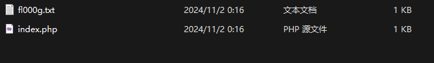

打开fl00g.txt，没有我们想要的flag

打开index.php

```php
<?php

/*
# -*- coding: utf-8 -*-
# @Author: h1xa
# @Date:   2020-09-01 14:37:13
# @Last Modified by:   h1xa
# @Last Modified time: 2020-09-01 14:42:44
# @email: h1xa@ctfer.com
# @link: https://ctfer.com

*/
//flag in fl000g.txt
echo "web6:where is flag?"
?>
```

显示flag in fl00g.txt

直接访问url/fl00g.txt得到flag

#### web7

git泄露，访问url/.git即可得到flag

#### web8

svn泄露，访问url/.git即可得到flag

#### web9

vim缓存信息泄露，访问url/index.php.swp，打开下载的index.php.swp即可得到flag

#### web10

根据hint查看cookie可以看到

> cookie:flag=ctfshow%7B3ac14c03-64d1-41aa-9328-c97bcceeb840%7D

进行url解码即可得到flag

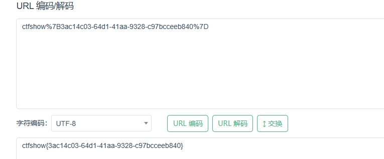

#### web11

域名解析

我们可以通过nslookup来进行域名解析查询

```
nslookup -qt=格式 URL
```

```
nslookup -qt=any URL 
//遍历所有格式
```

```
nslookup -qt=TXT URL
//查询txt格式
```

#### web12

hint：有时候网站上的公开信息，就是管理员常用密码

先用dirsearch扫一下


访问admin，要求我们输入管理员账号密码，根据后台路径我们可以猜测账号为`admin`

回到主页，在网页的底部我们可以看到一个电话`Help Line Number : 372619038`

猜测电话为管理员密码，输入后成功得到flag

#### web13

在页面底部可以看到一个document


点击发现下载了一个document.pdf文件，文件里有后台的地址和账号密码

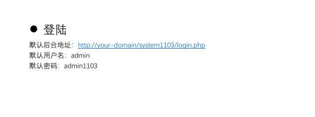d

登录后台即可得到flag

#### web14

根据hint知道editor处应该有信息泄漏(虽然不知道什么是editor)

我们先用dirsearch扫一下后台

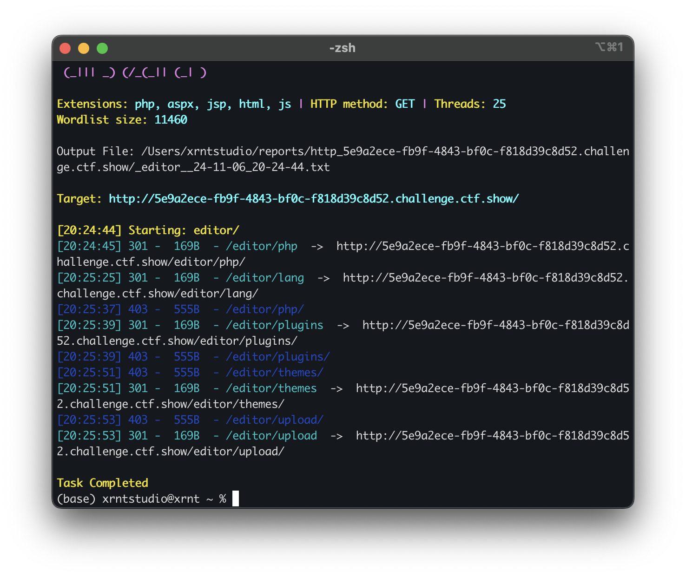

访问url/editor

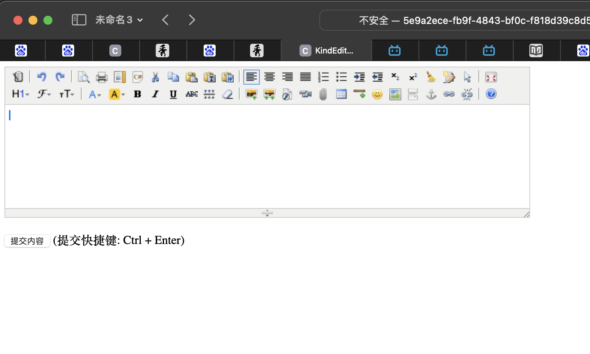

是一个文字编辑的页面，我们可以发现在上传附件📎出可以调用出到服务器的文件管理器

在服务器的根目录没看到flag，尝试查看网站的根目录(var/www/html),看看有没有隐藏页面

发现nothinghere文件夹中有个fl00g.txt文件

访问url/nothinghere/f1000g.txt即可得到flag

#### web15

扫描到后台为url/admin，打开看到有个忘记密码，要求输入城市

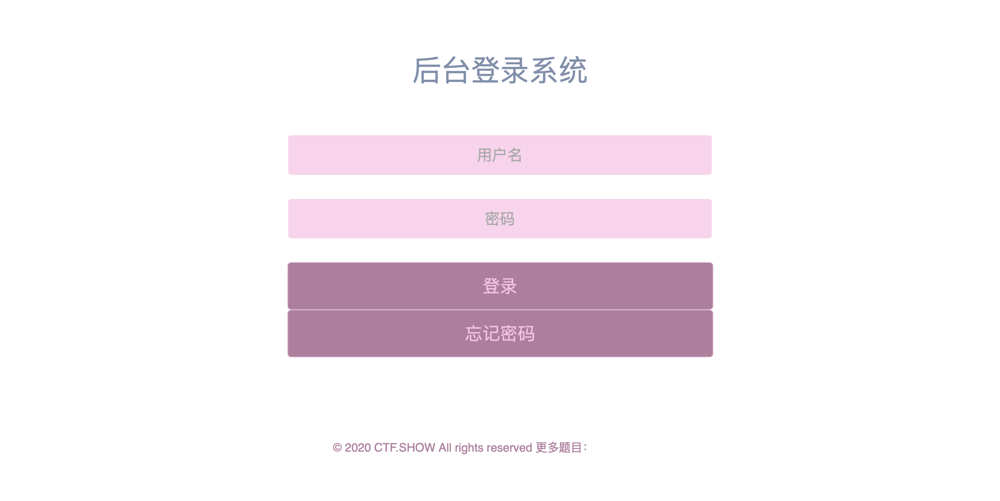

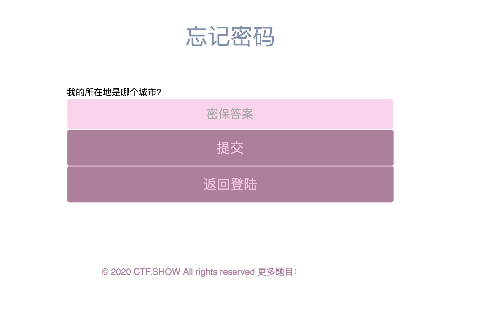

根据hint我们可以在主页底部找到一个qq邮箱，查询一下qq号


得到信息，现居陕西西安

输入西安成功重置密码，输入重置密码和帐号admin，成功得到flag

#### Web16

探针泄漏

dirsearch 扫描不到这个探针，看wp才知道的

探针在url/tz.php

访问探针

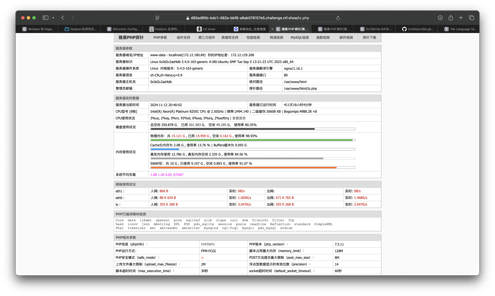

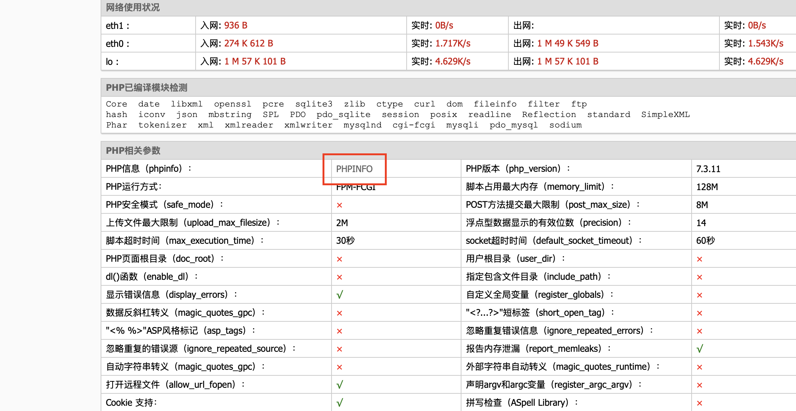

在指针里面可以找到phpinfo页面

打开在phpinfo里面可以找到flag

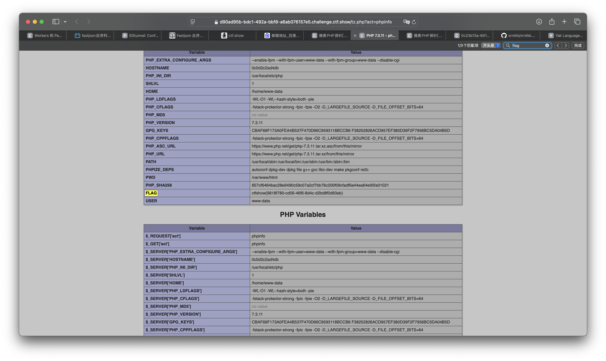

#### web17

sql备份泄漏


用dirsearch扫出来存在sql备份泄漏，下载backup.sql，打开得到flag


#### web18

本题是一个游戏，玩到101分就能得到flag

我们直接看js

Flappy_js.js


审一下代码，我们可以看到当分数大于100的时候会输出这段文字，这段文字看着像unidcode编码，解码试试

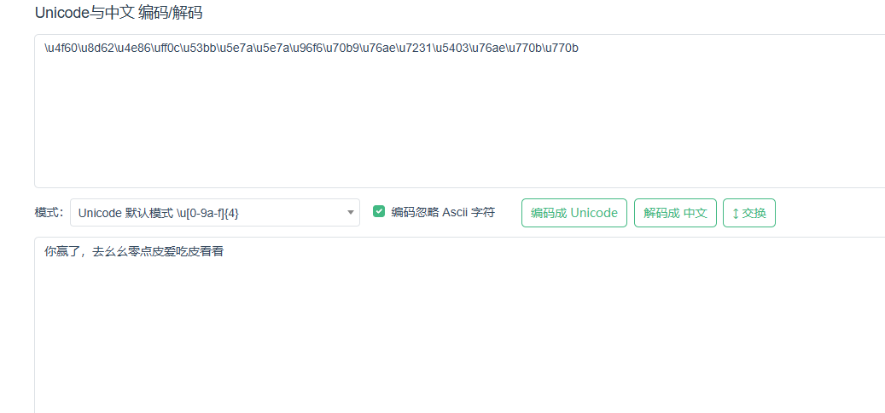

根据提示访问url/110.php,得到flag

#### web19

题目是一个登录的页面，根据hint查看网页源代码

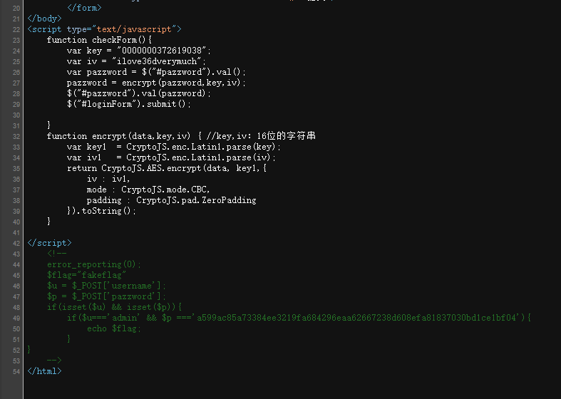

根据提示，这道题应该是一道对密码进行了加密的题目

审阅一下代码我们得到这些信息

> mode模式： CBC padding 填充方式： ZeroPadding
> 密文输出编码： 十六进制hex 偏移量iv: ilove36dverymuch 密钥：0000000372619038
> 密文为： a599ac85a73384ee3219fa684296eaa62667238d608efa81837030bd1ce1bf04

[AES 加密/解密 - 锤子在线工具](https://www.toolhelper.cn/SymmetricEncryption/AES)

用解密工具解密一下密文我们可以得到密码为


输入密码，得到flag

#### web20

> hint：mdb文件是早期asp+access构架的数据库文件，文件泄露相当于数据库被脱裤了。

这是一个使用access数据库的asp程序

根据提示本题存在mdb文件泄露，那我们直接访问url/db/db.mdb

下载db.mdb文件后用记事本打开搜索flag，即可得到 flag{ctfshow_old_database}

