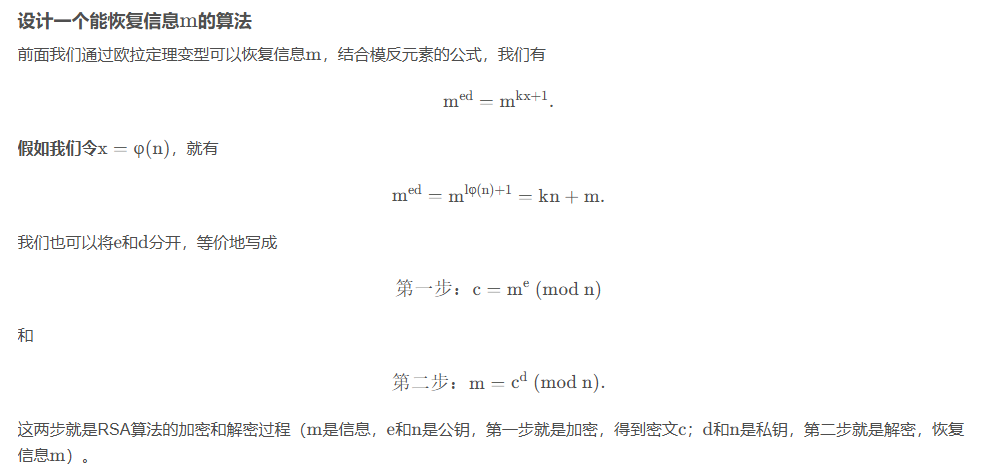
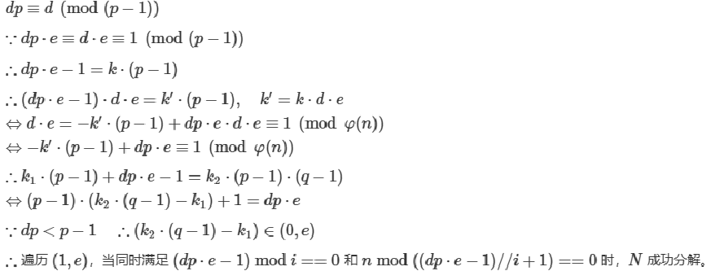
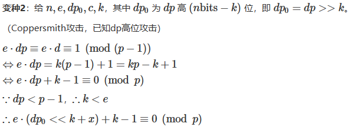
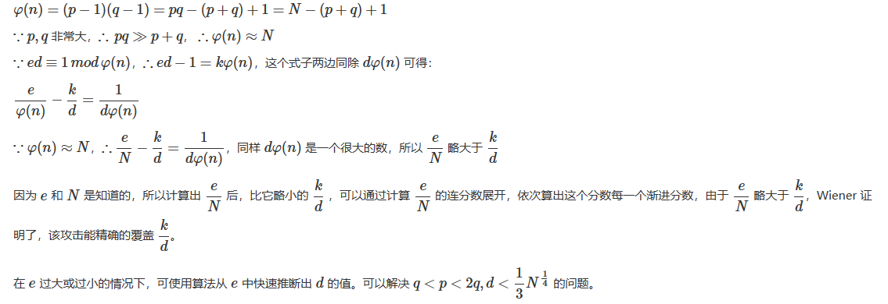
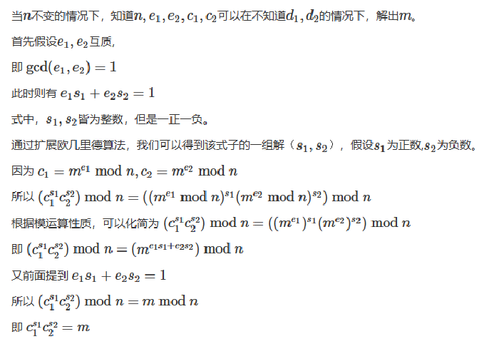
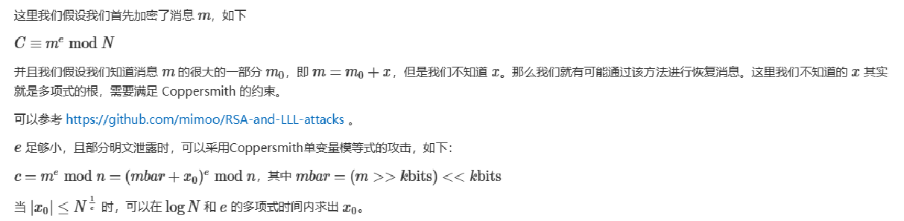
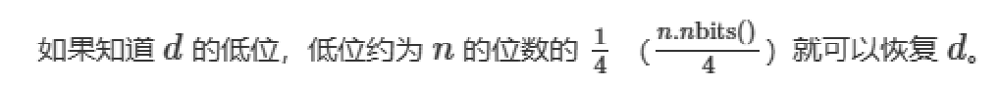
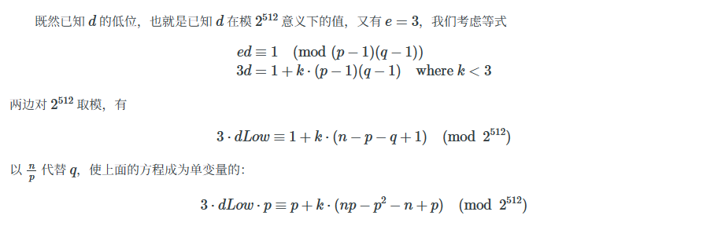

# Crypto

## 0、一些常用的工具网站

赛博厨子，工具很多	[CyberChef](https://cyberchef.cn/)

ctf工具箱，有些编码有bug	[CTF在线工具](http://www.hiencode.com/)

base100	[Base100编码/解码](http://www.atoolbox.net/Tool.php?Id=936)

ook和Brainfuck	[splitbrain.org](https://www.splitbrain.org/blog)

## 一、编码

### 1、ASCII编码

现今最通用的单字节编码系统，并等同于国际标准ISO/IEC 646

可以分作三部分组成

第一部分是：ASCII非打印控制字符

第二部分是：ASCII打印字符；

第三部分是：扩展ASCII打印字符

c++书后面有码表


### 2、Hex编码

Hex 全称 是Intel HEX。Hex文件是由一行行符合Intel HEX文件格式的文本所构成的ASCII文本文件。在Intel HEX文件中，每一行包含一个HEX记录。这些记录由对应机器语言码和/或常量数据的**十六进制编码数字**组成。

**特征**

十六进制（Hexadecimal）

它是计算机中数据的一种表示方法，**由0-9，A-F组成，字母不区分大小写**。

与10进制的对应关系是0-9不变，A-F对应10-15。

**样例**

```
明文：hello

密文：
68656c6c6f
0x680x650x6c0x6c0x6f
\x68\x65\x6c\x6c\x6f
。。。
```


### 3、base家族

#### base16

- Base16编码是将二进制文件转换成由16个字符组成的文本（也可以当成是hex）

**特性**

大写字母(A-Z)和数字(0-9)，不用‘=’补齐

**样例**

```
hello,world

68656C6C6F2C776F726C64
```


#### base32

- base32的编码表是由（A-Z、2-7）32个可见字符构成，“=”符号用作后缀填充。

**特征**

大写字母(A-Z)和数字(2-7)，不满5的倍数，用‘=’补齐。

**样例**

```
hello,world

NBSWY3DPFR3W64TMMQ======
```


#### base64

- base64的编码表是由（A-Z、a-z、0-9、+、/）64个可见字符构成，“=”符号用作后缀填充。

**特征**

大小写字母（A-Z，a-z）和数字（0-9）以及特殊字符‘+’，‘/’，不满3的倍数，用‘=’补齐。

**样例**

```
hello,world

aGVsbG8sd29ybGQ=
```


#### base58

- base58的编码表相比base64少了数字0，大写字母I，O，小写字母l(这个是L），以及符号‘+’和‘/’

**特征**

相比Base64，Base58不使用数字"0"，字母大写"O"，字母大写"I"，和字母小写"l"，以及"+"和"/"符号，最主要的是后面不会出现'='。

**样例**

```
hello,world

StV1DL6Jv3wuEJw
```


#### base100

- Base100编码/解码工具（又名Emoji表情符号编码/解码），可将文本内容编码为Emoji表情符号；同时也可以将编码后的Emoji表情符号内容解码为文本。

**特征**

一堆Emoji表情

**样例**

```
hello,world

👟👜👣👣👦🐣👮👦👩👣👛
```

题目：

```
4d4e4d4534354b5a474e4a47325a4c324b56354532563256504a4d585551544d4a524c554d32535a4b524958495453484c4a574532364a524e42485549524a554a524c564b3653324b354b5855574b554d3432453436535247424845514d4235
```

### 4、url编码

url编码又叫百分号编码，是统一资源定位(URL)编码方式

URL地址（常说网址）规定了常用地数字，字母可以直接使用，另外一批作为特殊用户字符也可以直接用（/,:@等），剩下的其它所有字符必须通过在该字节ascii码的的16进制字符前面加%编码处理

js：有encodeURI、encodeURIComponent

PHP有 urlencode、urldecode等

url编码和双重编码是绕过时常用手段。

**特征**

编码前面都有%

**样例**

```
%0a 回车
%20 空格

```


### 5、Unicode编码

Unicode（统一码、万国码、单一码）是一种在计算机上使用的字符编码。

它用两个字节来编码一个字符,字符编码一般用十六进制来表示。

**样例**

Unicode有以下四种编码方式：

```
明文：hello，world.

密文：
&#x [hex]：&#x0068;&#x0065;&#x006C;&#x006C;&#x006F;&#xFF0C;&#x0077;&#x006F;&#x0072;&#x006C;&#x0064;&#x002E;

&# ：&#00104;&#00101;&#00108;&#00108;&#00111;&#65292;&#00119;&#00111;&#00114;&#00108;&#00100;&#00046;

\u [hex]：\U0068\U0065\U006C\U006C\U006F\U002C\U0077\U006F\U0072\U006C\U0064\U002E

\u+ [hex]：\U+0068\U+0065\U+006C\U+006C\U+006F\U+FF0C\U+0077\U+006F\U+0072\U+006C\U+0064\U+002E

```

### 6、HTML实体编码

HTML 中的预留字符必须被替换为字符实体

一些在键盘上找不到的字符也可以使用字符实体来替换

在使用浏览器访问网页时会将这个编号解析还原为字符以供阅读。

**特征**

以`&#`开头

**样例**

```
明文：hello，world.
十进制：&#104;&#101;&#108;&#108;&#111;&#65292;&#119;&#111;&#114;&#108;&#100;&#46;
十六进制：&#x68;&#x65;&#x6C;&#x6C;&#x6F;&#xFF0C;&#x77;&#x6F;&#x72;&#x6C;&#x64;&#x2E;

```

### 7、摩尔斯电码（摩斯密码）

大名鼎鼎的morse电码

- 早期的数字化通信形式

- 不同于现代只使用0和1两种状态的二进制代码

- 代码包括五种：

  点（.）

  划（-）

  每个字符间短的停顿（在点和划之间的停顿）

  每个词之间中等的停顿

  句子之间长的停顿

**特征**

由点(.)和划(-)组成

**样例**

```
hello,world

.... . .-.. .-.. --- --..-- .-- --- .-. .-.. -..
...././.-../.-../---/--..--/.--/---/.-./.-../-..
```

题目：

```
qsnctf{.----/-----/.-/----./...--/./-----/-.../-....-/....-/...--/...../...--/-....-/....-/---../....-/.-/-....-/----./..-./..---/--.../-....-/-.-./..-./-..../-..../-.-./--.../.-/---../-.../..---/...--/.....}
```

### 8、jsfuck编码

原理：[只用 6 个字符，就可以写出任意 JavaScript 代码！---- JSFuck原理解析](https://www.cnblogs.com/mq0036/p/13931405.html)

JSFuck是一种深奥的 JavaScript 编程风格。以这种风格写成的代码中仅使用 [、]、(、)、! 和 + 六种字符。此编程风格的名字派生自仅使用较少符号写代码的Brainfuck语言

**特征**

只有` ( ) + [ ] ! ` 而且很长

**样例**

```
hello,world

(+(+!+[]+[+[]]+[+!+[]]))[(!![]+[])[+[]]+(!![]+[][(![]+[])[+[]]+(![]+[])[!+[]+!+[]]+(![]+[])[+!+[]]+(!![]+[])[+[]]])[+!+[]+[+[]]]+([]+[])[([][(![]+[])[+[]]+(![]+[])[!+[]+!+[]]+(![]+[])[+!+[]]+(!![]+[])[+[]]]+[])[!+[]+!+[]+!+[]]+(!![]+[][(![]+[])[+[]]+(![]+[])[!+[]+!+[]]+(![]+[])[+!+[]]+(!![]+[])[+[]]])[+!+[]+[+[]]]+([][[]]+[])[+!+[]]+(![]+[])[!+[]+!+[]+!+[]]+(!![]+[])[+[]]+(!![]+[])[+!+[]]+([][[]]+[])[+[]]+([][(![]+[])[+[]]+(![]+[])[!+[]+!+[]]+(![]+[])[+!+[]]+(!![]+[])[+[]]]+[])[!+[]+!+[]+!+[]]+(!![]+[])[+[]]+(!![]+[][(![]+[])[+[]]+(![]+[])[!+[]+!+[]]+(![]+[])[+!+[]]+(!![]+[])[+[]]])[+!+[]+[+[]]]+(!![]+[])[+!+[]]][([][[]]+[])[+!+[]]+(![]+[])[+!+[]]+((+[])[([][(![]+[])[+[]]+(![]+[])[!+[]+!+[]]+(![]+[])[+!+[]]+(!![]+[])[+[]]]+[])[!+[]+!+[]+!+[]]+(!![]+[][(![]+[])[+[]]+(![]+[])[!+[]+!+[]]+(![]+[])[+!+[]]+(!![]+[])[+[]]])[+!+[]+[+[]]]+([][[]]+[])[+!+[]]+(![]+[])[!+[]+!+[]+!+[]]+(!![]+[])[+[]]+(!![]+[])[+!+[]]+([][[]]+[])[+[]]+([][(![]+[])[+[]]+(![]+[])[!+[]+!+[]]+(![]+[])[+!+[]]+(!![]+[])[+[]]]+[])[!+[]+!+[]+!+[]]+(!![]+[])[+[]]+(!![]+[][(![]+[])[+[]]+(![]+[])[!+[]+!+[]]+(![]+[])[+!+[]]+(!![]+[])[+[]]])[+!+[]+[+[]]]+(!![]+[])[+!+[]]]+[])[+!+[]+[+!+[]]]+(!![]+[])[!+[]+!+[]+!+[]]]](!+[]+!+[]+[+!+[]])[+!+[]]+(!![]+[])[!+[]+!+[]+!+[]]+(![]+[])[!+[]+!+[]]+(![]+[])[!+[]+!+[]]+(!![]+[][(![]+[])[+[]]+(![]+[])[!+[]+!+[]]+(![]+[])[+!+[]]+(!![]+[])[+[]]])[+!+[]+[+[]]]+[[]][([][(![]+[])[+[]]+(![]+[])[!+[]+!+[]]+(![]+[])[+!+[]]+(!![]+[])[+[]]]+[])[!+[]+!+[]+!+[]]+(!![]+[][(![]+[])[+[]]+(![]+[])[!+[]+!+[]]+(![]+[])[+!+[]]+(!![]+[])[+[]]])[+!+[]+[+[]]]+([][[]]+[])[+!+[]]+([][(![]+[])[+[]]+(![]+[])[!+[]+!+[]]+(![]+[])[+!+[]]+(!![]+[])[+[]]]+[])[!+[]+!+[]+!+[]]+(![]+[])[+!+[]]+(!![]+[])[+[]]]([[]])+[]+(+(!+[]+!+[]+!+[]+[!+[]+!+[]]))[(!![]+[])[+[]]+(!![]+[][(![]+[])[+[]]+(![]+[])[!+[]+!+[]]+(![]+[])[+!+[]]+(!![]+[])[+[]]])[+!+[]+[+[]]]+([]+[])[([][(![]+[])[+[]]+(![]+[])[!+[]+!+[]]+(![]+[])[+!+[]]+(!![]+[])[+[]]]+[])[!+[]+!+[]+!+[]]+(!![]+[][(![]+[])[+[]]+(![]+[])[!+[]+!+[]]+(![]+[])[+!+[]]+(!![]+[])[+[]]])[+!+[]+[+[]]]+([][[]]+[])[+!+[]]+(![]+[])[!+[]+!+[]+!+[]]+(!![]+[])[+[]]+(!![]+[])[+!+[]]+([][[]]+[])[+[]]+([][(![]+[])[+[]]+(![]+[])[!+[]+!+[]]+(![]+[])[+!+[]]+(!![]+[])[+[]]]+[])[!+[]+!+[]+!+[]]+(!![]+[])[+[]]+(!![]+[][(![]+[])[+[]]+(![]+[])[!+[]+!+[]]+(![]+[])[+!+[]]+(!![]+[])[+[]]])[+!+[]+[+[]]]+(!![]+[])[+!+[]]][([][[]]+[])[+!+[]]+(![]+[])[+!+[]]+((+[])[([][(![]+[])[+[]]+(![]+[])[!+[]+!+[]]+(![]+[])[+!+[]]+(!![]+[])[+[]]]+[])[!+[]+!+[]+!+[]]+(!![]+[][(![]+[])[+[]]+(![]+[])[!+[]+!+[]]+(![]+[])[+!+[]]+(!![]+[])[+[]]])[+!+[]+[+[]]]+([][[]]+[])[+!+[]]+(![]+[])[!+[]+!+[]+!+[]]+(!![]+[])[+[]]+(!![]+[])[+!+[]]+([][[]]+[])[+[]]+([][(![]+[])[+[]]+(![]+[])[!+[]+!+[]]+(![]+[])[+!+[]]+(!![]+[])[+[]]]+[])[!+[]+!+[]+!+[]]+(!![]+[])[+[]]+(!![]+[][(![]+[])[+[]]+(![]+[])[!+[]+!+[]]+(![]+[])[+!+[]]+(!![]+[])[+[]]])[+!+[]+[+[]]]+(!![]+[])[+!+[]]]+[])[+!+[]+[+!+[]]]+(!![]+[])[!+[]+!+[]+!+[]]]](!+[]+!+[]+!+[]+[!+[]+!+[]+!+[]])+(!![]+[][(![]+[])[+[]]+(![]+[])[!+[]+!+[]]+(![]+[])[+!+[]]+(!![]+[])[+[]]])[+!+[]+[+[]]]+(!![]+[])[+!+[]]+(![]+[])[!+[]+!+[]]+([][[]]+[])[!+[]+!+[]]
```

题目：

1-8

### 9、brainfuck编码

Brainfuck是一种极小化的计算机语言，按照”Turingcomplete（完整图灵机）”思想设计的语言，它的主要设计思路是用最小的概念实现一种“简单”的语言。

**特征**

BrainFuck语言只有八种符号，所有的操作都由这八种符号**(><±.,[])**的组合来完成。

**举例**

```
明文：hello,world.
密文：+++++ +++++ [->++ +++++ +++<] >++++ .---. +++++ ++..+ ++.<+ +++++ ++[->
----- ---<] >---. <++++ ++++[ ->+++ +++++ <]>++ +++++ ++++. ----- ---.+
++.-- ----. ----- ---.< +++++ ++[-> ----- --<]> ----- .<
```

题目：

```
+++++ +++++ [->++ +++++ +++<] >++.+ +++++ .<+++ [->-- -<]>- -.+++ +++.<
++++[ ->+++ +<]>+ +++.< +++++ +++[- >---- ----< ]>--. .--.- -.-.- --.-.
+++++ +..-- -..<+ +++++ +[->+ +++++ +<]>+ +.<++ ++++[ ->--- ---<] >----
----- .---- -.<++ ++++[ ->+++ +++<] >++++ +++++ +++.< +++++ ++[-> -----
--<]> .++.- ----. <++++ +++[- >++++ +++<] >+++. --.<+ +++++ [->-- ----<
]>--- ----- ---.+ .<+++ +++[- >++++ ++<]> +++++ +++++ ++.<+ +++++ [->--
----< ]>--- ----- ---.- .++++ .<+++ +++[- >++++ ++<]> +++++ +++.< +++++
+[->- ----- <]>-- ----- ---.- ----- .++++ +++++ .---- ----. <++++ ++[->
+++++ +<]>+ +++++ +++++ +.<++ +++[- >++++ +<]>+ ++.<
```


### 10、Ook编码

Ook编码实际上就是在brainfuck的基础上进行了转换，类似于摩斯密码

**特征**

Ook开头带上符号，但不完全是，重点在Ook后边的符号。

**样例**

```
hello,world.

Ook. Ook. Ook. Ook. Ook. Ook. Ook. Ook. Ook. Ook. Ook. Ook. Ook. Ook. Ook.
Ook. Ook. Ook. Ook. Ook. Ook! Ook? Ook! Ook! Ook. Ook? Ook. Ook. Ook. Ook.
Ook. Ook. Ook. Ook. Ook. Ook. Ook. Ook. Ook. Ook. Ook. Ook. Ook. Ook. Ook.
Ook. Ook? Ook. Ook? Ook! Ook. Ook? Ook. Ook. Ook. Ook. Ook. Ook. Ook. Ook.
Ook! Ook. Ook! Ook! Ook! Ook! Ook! Ook! Ook! Ook. Ook. Ook. Ook. Ook. Ook.
Ook. Ook. Ook. Ook. Ook. Ook. Ook. Ook. Ook. Ook! Ook. Ook! Ook. Ook. Ook.
Ook. Ook. Ook. Ook. Ook! Ook. Ook? Ook. Ook. Ook. Ook. Ook. Ook. Ook. Ook.
Ook. Ook. Ook. Ook. Ook. Ook. Ook. Ook. Ook. Ook! Ook? Ook! Ook! Ook. Ook?
Ook! Ook! Ook! Ook! Ook! Ook! Ook! Ook! Ook! Ook! Ook! Ook! Ook! Ook! Ook!
Ook! Ook? Ook. Ook? Ook! Ook. Ook? Ook! Ook! Ook! Ook! Ook! Ook! Ook! Ook.
Ook? Ook. Ook. Ook. Ook. Ook. Ook. Ook. Ook. Ook. Ook. Ook. Ook. Ook. Ook.
Ook. Ook. Ook. Ook! Ook? Ook! Ook! Ook. Ook? Ook. Ook. Ook. Ook. Ook. Ook.
Ook. Ook. Ook. Ook. Ook. Ook. Ook. Ook. Ook. Ook. Ook? Ook. Ook? Ook! Ook.
Ook? Ook. Ook. Ook. Ook. Ook. Ook. Ook. Ook. Ook. Ook. Ook. Ook. Ook. Ook.
Ook. Ook. Ook. Ook. Ook. Ook. Ook. Ook. Ook! Ook. Ook! Ook! Ook! Ook! Ook!
Ook! Ook! Ook! Ook! Ook! Ook! Ook! Ook! Ook! Ook! Ook! Ook! Ook. Ook. Ook.
Ook. Ook. Ook. Ook. Ook! Ook. Ook! Ook! Ook! Ook! Ook! Ook! Ook! Ook! Ook!
Ook! Ook! Ook! Ook! Ook. Ook! Ook! Ook! Ook! Ook! Ook! Ook! Ook! Ook! Ook!
Ook! Ook! Ook! Ook! Ook! Ook! Ook! Ook. Ook? Ook. Ook. Ook. Ook. Ook. Ook.
Ook. Ook. Ook. Ook. Ook. Ook. Ook. Ook. Ook. Ook! Ook? Ook! Ook! Ook. Ook?
Ook! Ook! Ook! Ook! Ook! Ook! Ook! Ook! Ook! Ook! Ook! Ook! Ook! Ook! Ook?
Ook. Ook? Ook! Ook. Ook? Ook! Ook! Ook! Ook! Ook! Ook! Ook! Ook! Ook! Ook!
Ook! Ook. Ook? Ook. 
```

题目：

1-10


还有很多编码，需要大家自行了解，比如：

社会主义编码，特征是12字真言

与佛论禅，特征是与关佛经的汉字

尊嘟假嘟，特征是`O.o`，在线网站：[尊嘟假嘟翻译器O.o](https://zdjd.vercel.app/)

。。。


## 二、古典密码

### 1、hash

常见的由md5，sha1，sha256等

**特征**

不可逆，有固定的长度

**样例**

```
hello,world.

md5: 3cb95cfbe1035bce8c448fcaf80fe7d9
sha1: 6ff8595f00a0bc53e22c67c8a47f91d1aacd10c1

```

这类密码想要得到明文只能暴力破解，通过穷举所有组合试出值相同的字符串。

注意：MD5本身存在漏洞

题目：

```
a8db1d82db78ed452ba0882fb9554fc
```

[cmd5](https://www.cmd5.com/)

[md5.cn](https://md5.cn/)

### 2、凯撒密码

凯撒密码主要通过偏移来实现加密，偏移量是几，密文就是明文在字母表上向后移几位所对应的字母，由于凯撒密码所操作的范围只有字母表上的26个英文字母，所以当偏移量大于26时，密文就会在字母表上绕一圈绕回来。

```
key是密钥

加密公式：f(a) = (a+key) % 26

解密公式：f(a) = (a+(a-key)) % 26


```

**样例**

```
hello,world.	key:3

khoor,zruog.
```

题目：

```
kqfl{hf3x4w'x_h1umjw_n5_a4wd_3fed}

```


### 3、栅栏密码

栅栏密码是一种简单的移动字符位置的加密方法，规则简单，容易破解。栅栏密码的加密方式：把文本按照一定的字数分成多个组，取每组第一个字连起来得到密文1，再取每组第二个字连起来得到密文2……最后把密文1、密文2……连成整段密文。

例：

```
明文：abcdefgh
每组字数：4

把明文分组：
abcd
efgh

取每组第一个字符：ae
取每组第二个字符：bf
取每组第三个字符：cg
取每组第四个字符：dh

所以密文为：aebfcgdh
```

解密过程反推即可

题目：

```
fa{ereigtepanet6680}lgrodrn_h_litx#8fc3
```

进阶版：W形栅栏密码

### 4、ROT编码

ROT编码是一种简单的码元位置顺序替换暗码。此类编码具有可逆性，可以自我解密。

ROT5：只对数字进行编码，用当前数字往后数的第5个数字替换当前数字。
例：1——>6。

ROT13：只对字母进行编码，用当前字母往后数的第13个字母替换当前字母。（凯撒密码，密钥是13）
例：A——>N

ROT18：这是一个异类，本来没有，它是将ROT5和ROT13组合在一起。
例：1a——>6n

ROT47：对数字、字母、常用符号进行编码，按照它们的ASCII值进行位置替换，用当前字符ASCII值往前或后数的第47位对应字符替换当前字符。
例：0——>_ ，z——K


### 5、维吉尼亚密码

维吉尼亚密码（Vigenère cipher）是一种基于多个凯撒密码组合而成的加密算法，由布鲁托·德维吉尼亚（Blaise de Vigenère）在16世纪提出。相比于凯撒密码，维吉尼亚密码更加复杂和安全。

- 密钥：维吉尼亚密码使用一个密钥来加密和解密文本。密钥是一个字符串，通常由一个或多个字母组成。密钥的长度可以与明文的长度相同，也可以比明文长。（a对应0，b对应1，z对应25，以此类推）

- 重复密钥：维吉尼亚密码中的关键概念是重复密钥。如果密钥比明文短，则会将密钥重复使用直到与明文长度相匹配。例如，如果明文是"HELLO"，而密钥是"KEY"，则密钥将被重复使用为"KEYKE"。

- 字母表表格：维吉尼亚密码使用一个字母表表格（也称为Vigenère Square）来进行加密和解密。字母表表格是一个26x26的矩阵，包含了所有字母在凯撒密码中的偏移结果。

- 加密过程：对于加密，将明文中的每个字母与对应位置的密钥字母相匹配，找到字母表表格中对应位置的字母，即为密文。例如，如果明文是"HELLO"，密钥是"KEY"，则将"H"与"K"匹配，得到密文中的第一个字母，以此类推。

- 解密过程：对于解密，将密文中的每个字母与对应位置的密钥字母相匹配，找到字母表表格中对应行的字母，即为明文。例如，如果密文是"RIJVS"，密钥是"KEY"，则将"R"与"K"匹配，得到明文中的第一个字母，以此类推。
  

**样例**

```
hello,world.	key:ok
okokokokoko

vozvc,gcbzn.
```

题目：

```
pqcq{qc_m1kt4_njn_5slp0b_lkyacx_gcdy1ud4_g3nv5x0}

```

[Vigenère Solver](https://www.guballa.de/vigenere-solver)

### 6、Rabbit加密

Rabbit加密算法是一个可逆加密算法，是一个高性能的流密码加密方式，Rabbit算法属于对称加密算法。

在线网站：[Rabbit加密-*Rabbit解密*-*在线Rabbit*加密解密工具](https://www.baidu.com/link?url=2Na-KiVsicPGk_R0OzYnX9tqVo5uCNZMVspPkIOLDPzhRjJ1KFqHrjnYd-EXaUro&wd=&eqid=9c3ed5a7001b34c50000000665689146)

**特征**

以`U2FsdGvk`开头

有base64的所有特征

**样例**

```
hello,world.  	key:123456

U2FsdGVkX1+MqBxN2PP9vPW0v2Q1s+rZcqMdtA==
```

题目：

```
密文：
U2FsdGVkX19mGsGlfI3nciNVpWZZRqZO2PYjJ1ZQuRqoiknyHSWeQv8ol0uRZP94
MqeD2xz+
密钥：
加密方式名称
```

### 7、DES算法

参考链接：[DES](https://ctf-wiki.org/crypto/blockcipher/des/)

Data Encryption Standard(DES)，数据加密标准，是典型的块加密，其基本信息如下

- 输入 64 位。
- 输出 64 位。
- 密钥 64 位，使用 64 位密钥中的 56 位，剩余的 8 位要么丢弃，要么作为奇偶校验位。
- Feistel 迭代结构
  - 明文经过 16 轮迭代得到密文。
  - 密文经过类似的 16 轮迭代得到明文。


题目：

```
key: ctfctfer
iv: ctfctfer
output: 1603da7cd65377c7f5587407d188ffbd4514a941f9289e7be3000cd223878a0d
```


### 8、AES算法

参考链接：[AES](https://ctf-wiki.org/crypto/blockcipher/aes/#2018-crackmec)

Advanced Encryption Standard（AES），高级加密标准，是典型的块加密，被设计来取代 DES，由 Joan Daemen 和 Vincent Rijmen 所设计。其基本信息如下

- 输入：128 比特。
- 输出：128 比特。
- SPN 网络结构。

其迭代轮数与密钥长度有关系

| 密钥长度（比特） | 迭代轮数 |
| :--------------: | :------: |
|       128        |    10    |
|       192        |    12    |
|       256        |    14    |

AES跟DES非常相像。但是值得注意一点的是，AES取代了DES成为21世纪的加密标准。是因为以其密匙长度和高安全性获得了先天优势。虽然界面上看上去没多大区别，但是破解难度远远大于DES。

```python
from Crypto.Cipher import AES
import os
import gmpy2
from flag import FLAG
from Crypto.Util.number import *

def main():
    key = os.urandom(2) * 16  # 生成一个随机的密钥，长度为32字节（256位）
    iv = os.urandom(16)  # 生成一个随机的初始化向量，长度为16字节（128位）
    print(bytes_to_long(key) ^ bytes_to_long(iv))  # 将密钥和初始化向量转换为长整数，并执行异或操作，然后打印结果
    aes = AES.new(key, AES.MODE_CBC, iv)  # 使用密钥、模式（CBC）和初始化向量创建一个新的AES加密对象
    enc_flag = aes.encrypt(FLAG)  # 使用AES加密对象对FLAG进行加密，并将加密后的结果存储在enc_flag变量中
    print(enc_flag)  # 打印加密后的FLAG

if __name__ == "__main__":
    main()  # 如果当前模块是主模块，则调用main函数
"""
106369350061263593452198373990890812979078483995852080721044353515739899408954
b'I\x973\x14\x8c\xb7\x1c{v\xa6\x03\xcf\xecG\x1e\xb7\xa0V\xedj\xef\x167*\xcd<\xf2I\x01{\xd3\xca'
"""
```


## 三、现代密码学

### RSA

#### 简介

>1977年，三位数学家Rivest、Shamir 和 Adleman
>设计了一种算法，可以实现非对称加密。这种算法用他们三个人的名字命名，叫做RSA算法。
>从那时直到现在，RSA算法一直是最广为使用的"非对称加密算法"。

#### 数学背景

**互质**

从小学开始，我们就了解了什么是质数。互质是针对多个数字而言的，如果两个正整数，除了1以外，没有其他公因子，那么就称这两个数是互质关系（注意，这里并没有说这两个数一定是质数或有一个为质数。比如15跟4就是互质关系）。以下有一些关于质数与互质的性质：

- 质数只能被1和它自身整除
- 任意两个质数都是互质关系
- 如果两个数之中，较大的那个数是质数，则两者构成互质关系
- 如果两个数之中，较小的那个数是质数，且较大数不为较小数的整数倍，则两者构成互质关系 1和任意一个自然数是都是互质关系
- p是大于1的整数，则p和p-1构成互质关系 p是大于1的奇数，则p和p-2构成互质关系


**欧拉函数**

简单定义：对于一个整数 n，我们用欧拉函数 $φ(n)$ 来表示小于`n`并与之互质的正整数

- 如果 `n` 是质数，则  $φ(n) = n-1$
- 如果n可以表示成2个互质的数的乘积，即 $n = p * q$ ，那么 $φ(n) = φ(p)*φ(q)$。


**欧拉定理变型**

欧拉定理为：如果m与n互质，则 $m^{φ(n)}=kn+1$ ，即模n余1
等式两边同时取整数 l 次方，并再乘上m，得
$$
m^{lφ(n)+1}=m(kn+1)^l = k'n+m
$$
如果`m < n` ，则有
$$
m^{lφ(n)+1}\ mod(n) = m
$$
显然这是一个很好地恢复原数（m 看做是传输的信息）的算法，这也为后面RSA的算法提供了思路


**模反元素**

> 定义：如果两个正整数a和n互质，那么一定可以找到整数b，使得 ab-1 被n整除，或者说ab被n除的余数是1。

根据欧拉定理我们知道，$m * m^{φ(n)-1}=kn+1$ 

对于互质的两个数e和x，一定存在他的一个模反元素d，满足 $e*d=1\ mod(x)$
注意，为了书写方便，不同公式出现的符号 `k` 可以是任何不相等的整数


#### RSA原理

RSA是一种算法，并且广泛应用于现代，用于保密通信。

> RSA算法涉及三个参数,n,e,d，其中分为私钥和公钥，私钥是n,d，公钥是n,e

非对称公钥加密算法可以由下列几步实现：

- 信息接收方产生公钥pk与私钥sk，公钥可以给任何人，私钥自己保存；

- 信息发送方将要发送的信息m与公钥pk一起用特定的加密算法加密，即密文c；
- 信息接收方接收到密文c，与私钥 sk一起用特定解密算法恢复明文。




加密过程：

```
c = pow(m,e,n)
```


$$
c = m^e\ mod(n)
$$
解密过程：

```
m = pow(c,d,n)
```

$$
m = c^d\ mod(n)
$$

求解私钥d：

```
phi = (p-1)*(q-1)
d = gmpy2.invert(e, phi)
```

$$
d = e^{-1}\ mod(phi)
$$

简单模板：

```python
import gmpy2
from Crypto.Util.number import *
 
#填p
p = 

#填q
q = 

n=p*q

e = 65537
#填c
c=

d = gmpy2.invert(e, (p - 1) * (q - 1))
m = pow(c, d, n)
flag = long_to_bytes(m)
print(flag)
```

在线工具：[factordb](http://www.factordb.com/index.php)

[sage](https://sagecell.sagemath.org/)

### RSA变式

#### DP泄露

**常见脚本**

```python
from Crypto.Util.number import *
import gmpy2

p = getStrongPrime(512)
q = getStrongPrime(512)
n = p * q
phi = (p - 1) * (q - 1)
e = 7621
d = gmpy2.invert(e, phi)

flag = b"flag{xxxxxxxxxxxxxxxxxxxxxxxxxxxxxxxxxxxx}"
c = pow(bytes_to_long(flag), e, n)

dp = d % (p - 1)
print(dp)
print(c, e, n)
```


**解题思路**



#### DP高位泄露

常见脚本

```python
from Crypto.Util.number import *
import gmpy2

p = getStrongPrime(512)
q = getStrongPrime(512)
n = p * q
phi = (p - 1) * (q - 1)
e = 7621
d = gmpy2.invert(e, phi)

flag = b"flag{xxxxxxxxxxxxxxxxxxxxxxxxxxxxxxxxxxxx}"
c = pow(bytes_to_long(flag), e, n)

dp = d % (p - 1)
print(dp >> 200)
print(c, e, n)
```

解题思路



#### 低解密指数攻击

已知N、e，且e过大或过小



#### 低加密指数攻击

n很大，但是e很小，一般e=3n很大时我们就不能因式分解了。

例如，当e=3 ,就有c=me+kn可以开根，可以对k进行爆破，直到c-kn可以开根，就可以得到m了

```
#n:  0x52d483c27cd806550fbe0e37a61af2e7cf5e0efb723dfc81174c918a27627779b21fa3c851e9e94188eaee3d5cd6f752406a43fbecb53e80836ff1e185d3ccd7782ea846c2e91a7b0808986666e0bdadbfb7bdd65670a589a4d2478e9adcafe97c6ee23614bcb2ecc23580f4d2e3cc1ecfec25c50da4bc754dde6c8bfd8d1fc16956c74d8e9196046a01dc9f3024e11461c294f29d7421140732fedacac97b8fe50999117d27943c953f18c4ff4f8c258d839764078d4b6ef6e8591e0ff5563b31a39e6374d0d41c8c46921c25e5904a817ef8e39e5c9b71225a83269693e0b7e3218fc5e5a1e8412ba16e588b3d6ac536dce39fcdfce81eec79979ea6872793L
#e:  0x3
#c:0x10652cdfaa6b63f6d7bd1109da08181e500e5643f5b240a9024bfa84d5f2cac9310562978347bb232d63e7289283871efab83d84ff5a7b64a94a79d34cfbd4ef121723ba1f663e514f83f6f01492b4e13e1bb4296d96ea5a353d3bf2edd2f449c03c4a3e995237985a596908adc741f32365

```

#### 低加密指数广播攻击

加密指数e非常小

一份明文使用不同的模数n，相同的加密指数e进行多次加密

可以拿到每一份加密后的密文和对应的模数n、加密指数e

**解题思路**

由于模数n只能分解为p和q，所以当n很多时，p或q有相同的风险因此不同的模数n中可能存在相同的p或者说q

求出不同n之间的gcd()，如果大于1说明这里存在漏洞，可以继续攻击

所得到的最大公约数就是p或q，然后可得d

有私钥d就能得到明文

#### 共模攻击

n,m相同，c,e不同



#### Coppersmith攻击

Coppersmith定理指出在一个e阶的mod n多项式f(x)中，如果有一个根小于n^1/e，就可以运用一个O(log n)的算法求出这些根。
这个定理可以应用于rsa算法。如果e = 3并且在明文当中只有三分之二的比特是已知的，这种算法可以求出明文中所有的比特。


Coppersmith攻击有多个分类

1 已知P高位攻击
2 已知M高位攻击
3 已知D的低位攻击
4 。。。


#### 已知P高位攻击

当我们知道一个公钥中模数N的一个因子的较高位时，我们就有一定几率来分解N


#### 已知m高位攻击



#### 已知D低位攻击



例题：

```

n=92896523979616431783569762645945918751162321185159790302085768095763248357146198882641160678623069857011832929179987623492267852304178894461486295864091871341339490870689110279720283415976342208476126414933914026436666789270209690168581379143120688241413470569887426810705898518783625903350928784794371176183

e=3
m=random.getrandbits(512)

c=pow(m,e,n)=56164378185049402404287763972280630295410174183649054805947329504892979921131852321281317326306506444145699012788547718091371389698969718830761120076359634262880912417797038049510647237337251037070369278596191506725812511682495575589039521646062521091457438869068866365907962691742604895495670783101319608530
d&((1<<512)-1)=
787673996295376297668171075170955852109814939442242049800811601753001897317556022653997651874897208487913321031340711138331360350633965420642045383644955
long_to_bytes(m).encode('hex')=

```


