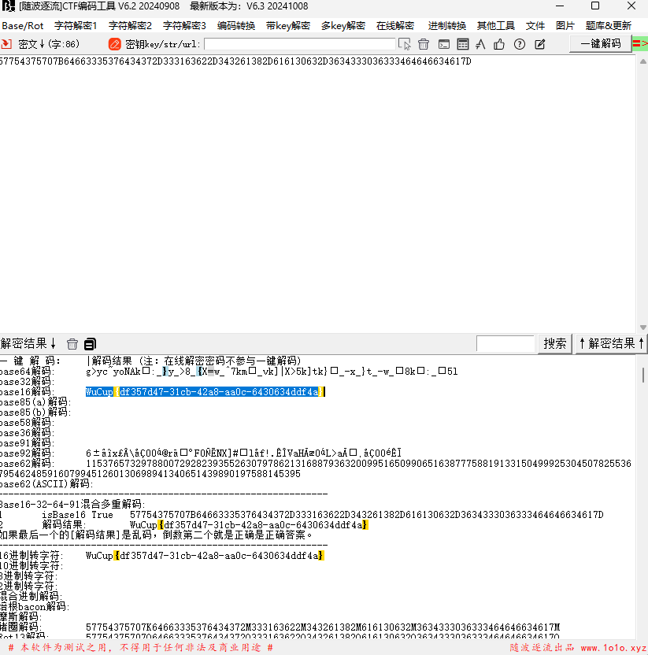
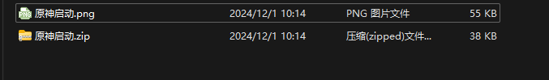
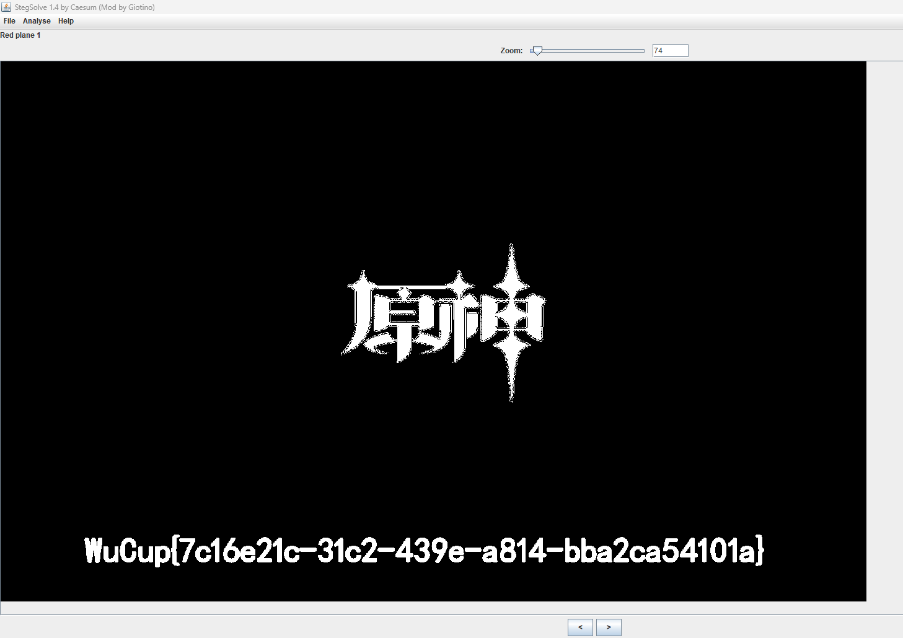
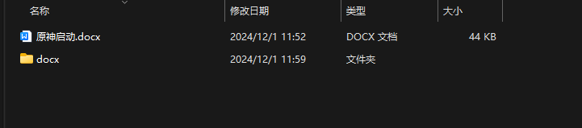
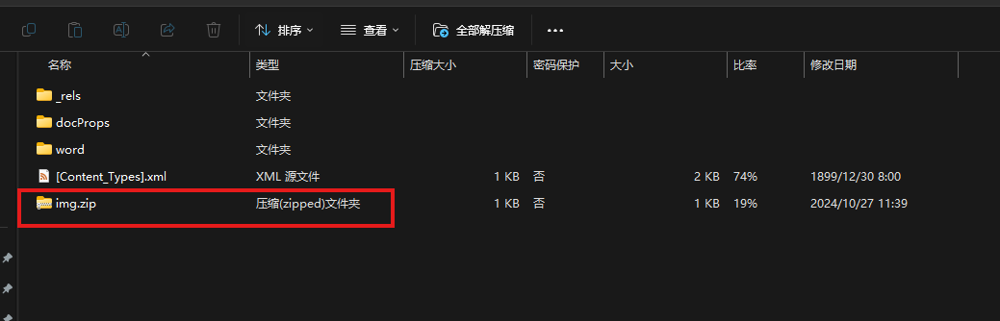
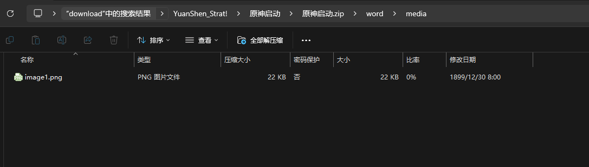
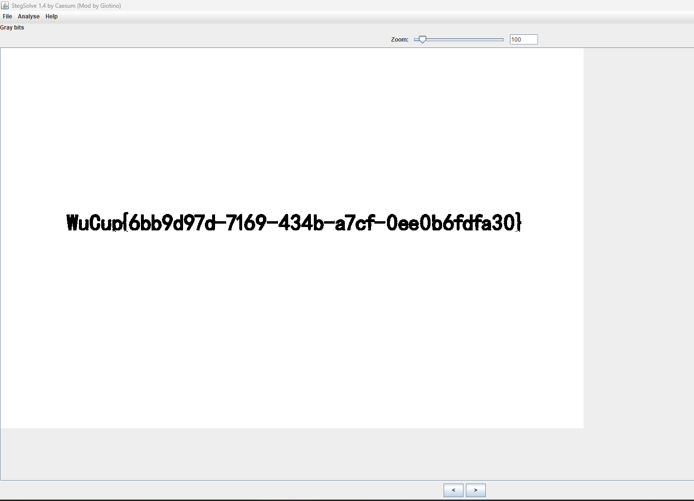
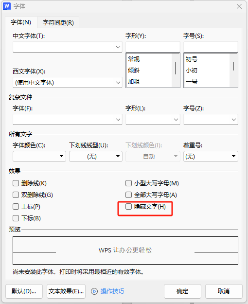
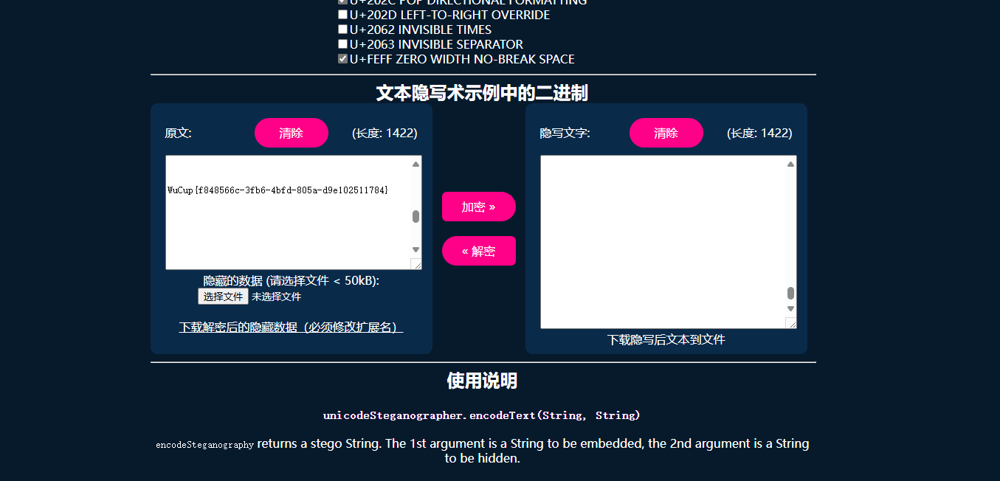
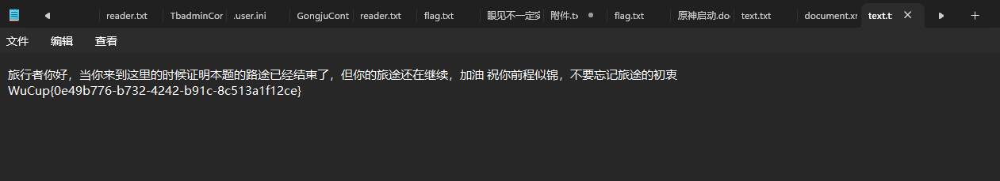

# WuCup_2024

## Web

#### Sign

题目给了一个密码，用蚁剑连一下直接找flag就行


## Cypto

### Easy

题目

```python
get buf unsign s[256]

get buf t[256]

we have key:hello world

we have flag:????????????????????????????????


for i:0 to 256
    
set s[i]:i

for i:0 to 256
    set t[i]:key[(i)mod(key.lenth)]

for i:0 to 256
    set j:(j+s[i]+t[i])mod(256)
        swap:s[i],s[j]

for m:0 to 37
    set i:(i + 1)mod(256)
    set j:(j + S[i])mod(256)
    swap:s[i],s[j]
    set x:(s[i] + (s[j]mod(256))mod(256))
    set flag[m]:flag[m]^s[x]

fprint flagx to file


'''
d8d2 963e 0d8a b853 3d2a 7fe2 96c5 2923
3924 6eba 0d29 2d57 5257 8359 322c 3a77
892d fa72 61b8 4f

'''
```

给出了比较清晰的加密方式

直接让chatgpt写个脚本

payload:

```python
def rc4(key, data):
    s = list(range(256))
    t = [ord(key[i % len(key)]) for i in range(256)]
    
    # Key Scheduling Algorithm (KSA)
    j = 0
    for i in range(256):
        j = (j + s[i] + t[i]) % 256
        s[i], s[j] = s[j], s[i]
    
    # Pseudo-Random Generation Algorithm (PRGA)
    i = 0
    j = 0
    result = []
    for byte in data:
        i = (i + 1) % 256
        j = (j + s[i]) % 256
        s[i], s[j] = s[j], s[i]
        keystream_byte = s[(s[i] + s[j]) % 256]
        result.append(byte ^ keystream_byte)
    
    return bytes(result)

# Encrypted flag in hex (from the problem statement)
encrypted_flag_hex = bytes([
    0xd8, 0xd2, 0x96, 0x3e, 0x0d, 0x8a, 0xb8, 0x53, 0x3d, 0x2a, 0x7f, 0xe2, 0x96, 0xc5, 0x29, 0x23,
    0x39, 0x24, 0x6e, 0xba, 0x0d, 0x29, 0x2d, 0x57, 0x52, 0x57, 0x83, 0x59, 0x32, 0x2c, 0x3a, 0x77,
    0x89, 0x2d, 0xfa, 0x72, 0x61, 0xb8, 0x4f
])

key = "hello world"
decrypted_flag = rc4(key, encrypted_flag_hex)

print("Decrypted Flag:", decrypted_flag.decode('utf-8'))

```

## Misc

### Sign

题目：

```
57754375707B64663335376434372D333163622D343261382D616130632D3634333036333464646634617D
```

随波逐流一把梭



### 原神启动

下载附件拿到一张图片和一个压缩包



用StegSolve能看到假flag



flag是压缩包的密码



将解压得到的docx文件，再解压开，里面能藏了一个压缩包和图片





图片用StegSolve又能看到一个flag



用这个flag解开刚刚得到的压缩包

里面得到一个叫test.zip的压缩包

这一步卡了挺久，最后回头看docx文件中的隐藏字符






得到最后一个解压文件的密码，解压之后拿到flag



